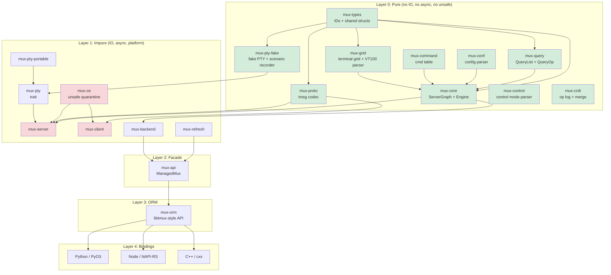

# TermForge: Rust Terminal Multiplexer Architecture (v4 -- Pass 2)

## Refined Architectural Synthesis

Date: 2026-02-10
Model: Claude Opus 4.6 (Pass 2 of 3-pass synthesis)
License: MIT OR Apache-2.0
Rust edition: 2024 (minimum 1.85)

**Pass 2 Purpose:** Resolve all 10 open questions from the Pass 1 synthesis, strengthen the VT100 parser, format engine, key bindings, copy mode, FakePty Scenario Recorder, WASM compilability, type separation, and ORM placement sections with concrete designs verified against the actual tmux C source.

---

## Table of Contents

1. [Project Name and Identity](#1-project-name-and-identity)
2. [Vision and Philosophy](#2-vision-and-philosophy)
3. [North Star Acceptance Criteria](#3-north-star-acceptance-criteria)
4. [High-Level Architecture](#4-high-level-architecture)
5. [Workspace Layout](#5-workspace-layout)
6. [Layering Contract](#6-layering-contract)
7. [Entity Model](#7-entity-model)
8. [Event/Effect Engine](#8-eventeffect-engine)
9. [Protocol Codec](#9-protocol-codec)
10. [ORM-like Query API](#10-orm-like-query-api)
11. [Runtime Architecture](#11-runtime-architecture)
12. [Language Bindings](#12-language-bindings)
13. [CRDT Transaction Layer](#13-crdt-transaction-layer)
14. [tmux Version Management](#14-tmux-version-management)
15. [Test Support Crate](#15-test-support-crate)
16. [Fake PTY Backend](#16-fake-pty-backend)
17. [Binding Test Frameworks](#17-binding-test-frameworks)
18. [Test Framework and Harness Design](#18-test-framework-and-harness-design)
19. [Visual Client (TUI)](#19-visual-client-tui)
20. [DOs and DON'Ts](#20-dos-and-donts)
21. [AGENTS.md Template](#21-agentsmd-template)
22. [Phased Implementation Plan](#22-phased-implementation-plan)
23. [Risks and Mitigations](#23-risks-and-mitigations)
24. [Appendix: Open Question Resolutions](#appendix-open-question-resolutions)

---

## Open Question Resolutions (Summary)

Before the full document, here are the concrete decisions for all 10 open questions identified in the Pass 1 synthesis:

| # | Question | Decision | Rationale |
|---|----------|----------|-----------|
| 1 | SecondaryMap vs Vec in entities | **Vec<WindowId> inside Session struct** (Claude/GPT approach) | Forward-only child lists inside parent entities are simpler to serialize, snapshot, and reason about. SecondaryMap adds indirection without meaningful benefit when the graph is already SlotMap-based. Reverse lookups are computed during snapshot construction (verified in existing `vibe-tmux/crates/mux-core/src/graph.rs:218-229`). |
| 2 | WASM compilability | **Yes, as a CI gate, not a runtime target** | `mux-core` and other Layer 0 crates must compile to `wasm32-unknown-unknown` as a purity proof. This is enforced in CI via `cargo check --target wasm32-unknown-unknown -p mux-core`. The only dependency risk is `slotmap` (which is `no_std`-compatible) and `regex` (which has a WASM target). This constraint catches any accidental `std::fs`, `std::net`, or `tokio` imports. |
| 3 | mux-types separation | **Yes, separate mux-types crate** (GPT approach) | Extracting typed IDs and shared entity structs into `mux-types` reduces coupling. `mux-grid`, `mux-proto`, `mux-query`, and `mux-pty-fake` can depend on `mux-types` without pulling in the full `mux-core` engine. The existing vibe-tmux code already defines IDs in per-entity files within `mux-core`; the refactor is to hoist `SessionId`, `WindowId`, `PaneId`, `ClientId`, `JobId`, `BufferId`, plus `PaneSize`, `SplitDirection`, and `Rect` into `mux-types`. |
| 4 | ORM placement | **Separate mux-orm crate** (GPT approach) with ORM depending on `mux-api` | The ORM provides libtmux-style ergonomic traversal (`server.sessions().filter(...).get(...)`) and should be a separate crate so that callers who want the raw `mux-api` facade (ManagedMux, intents, snapshots) are not forced to pull in the QueryList/Queryable machinery. `mux-orm` depends on `mux-api` + `mux-query`. Bindings depend on `mux-orm` for the full developer experience. |
| 5 | FakePty Scenario Recorder | **Concrete design below** (Section 16) | Recording format is a binary log of timestamped (direction, bytes) pairs, similar to `script(1)` but with bidirectional channels. Replay feeds the recorded PTY output bytes as `Event::PtyOutputBytes` into the pure core. The recorder is a proxy that sits between a real tmux session and a real PTY, capturing both directions. |
| 6 | Persistent data structures (im-rs) | **Defer; do not adopt im-rs in v1** | The `Clone` cost of `ServerGraph` is bounded by entity count (typically < 1000 entities), not by grid content (grids are behind `Arc<Grid>` with copy-on-write). Premature adoption of `im-rs` adds API complexity and a heavy dependency. Profile first, optimize if needed. |
| 7 | VT100/ANSI parser | **Custom state machine matching tmux's `input.c` structure** (Section 7.5) | The `vte` crate is a reasonable starting point but diverges from tmux's specific behavior (tmux has its own state table based on the Paul Williams parser with custom extensions for APC, DCS escape, and rename strings). We implement a table-driven parser in `mux-grid` that mirrors tmux's 17 states and transition tables, enabling bit-exact parity testing. |
| 8 | Format string engine | **Dedicated module in mux-core** (Section 7.6) | tmux's `format.c` is ~5500 lines implementing a template language with conditionals, loops, modifiers, and variable expansion. We implement this as a pure function `fn format_expand(template: &str, ctx: &FormatContext) -> String` in `mux-core/src/format.rs`, with the variable registry derived from the entity graph. |
| 9 | Key binding system | **Concrete design below** (Section 7.7) | tmux uses named key tables (prefix, root, copy-mode, copy-mode-vi) with bindings mapping key codes to command lists. We model this as `KeyTable` -> `KeyBinding` -> `CommandList` in the pure core, with the key dispatch being an `Event::Key` that the engine resolves against the current key table. |
| 10 | Copy mode | **Concrete design below** (Section 7.8) | Copy mode is a per-pane state machine with its own screen, cursor, selection state, search state, and key table. We model it as `CopyModeState` stored inside the `Pane` entity (when active), with all operations handled by the pure engine via `Event::CopyModeAction`. |

---

## 1. Project Name and Identity

**Name:** `termforge`

**Crate prefix:** `mux-*` -- retains continuity with the proven vibe-tmux workspace. The `mux-` prefix is established in downstream tooling, CI pipelines, and 15+ existing crate skeletons.

**Binary names:**
- `muxd` -- server daemon (GPT's suggestion; clearer than `mux-server` as a binary name)
- `mux` -- CLI client
- `mux-tui` -- visual TUI client

**Tagline:** "A deterministic multiplexer kernel with tmux wire-compatibility, ORM queries, and collaborative sessions."

**License:** MIT OR Apache-2.0
**Rust edition:** 2024 (MSRV 1.85)
**Repository:** Cargo workspace at root

---

## 2. Vision and Philosophy

### Core Thesis

TermForge is not a tmux port. It is a **new terminal multiplexer** that speaks tmux's binary protocol (`imsg` over Unix domain sockets). The internal architecture is Rust-native: algebraic types, ownership-tracked state, pure-functional kernel, and async runtime -- while maintaining bit-for-bit compatibility with the tmux wire format.

### Architectural Principles

1. **Pure/Impure Separation (Sans-IO):** The kernel (`mux-core`) is a pure `fn(graph, event) -> (graph, effects)` reducer. It never touches file descriptors, system calls, timers, or network. All IO happens in the runtime layer that interprets `Effect` variants.

2. **tmux is a Compatibility Profile, Not the Architecture:** tmux's `struct session`, `struct window`, `struct window_pane` inform our entity model but do not dictate it. Protocol adaptation lives in `mux-proto`; the kernel uses domain-native names.

3. **Snapshots are the Read Path:** The authoritative state lives in the `ServerGraph`. Readers (UI, bindings, query API) see immutable snapshots published via `ArcSwap`. Writers go through the event/effect engine. This eliminates read contention.

4. **ORM is a Facade:** `mux-orm` translates user intent (`.new_session("work")`) into `Event` variants or backend commands. It never implements multiplexer logic.

5. **Layered Testing:** Every layer has its own test strategy. Pure core uses property testing and snapshot testing. Protocol uses fixture-driven roundtrip tests. Runtime uses hermetic servers with fake PTYs.

6. **WASM as Purity Proof:** Layer 0 crates compile to `wasm32-unknown-unknown`, proving they contain no OS dependencies. This is a CI gate, not a production deployment target.

---

## 3. North Star Acceptance Criteria

### 3.1 Compatibility Acceptance

| ID | Criterion | Verification |
|---|---|---|
| C1 | Real tmux 3.6+ client can attach to `muxd` | Integration test: `tmux attach -S <sock>` |
| C2 | `mux` client can attach to real tmux 3.6+ server | Integration test via `mux-client` |
| C3 | Protocol v8 imsg framing: roundtrip all 35 `MsgType` variants | `proptest` with arbitrary payloads |
| C4 | Identify burst (13 message types) round-trips correctly | Fixture captures from real tmux |
| C5 | SCM_RIGHTS fd passing preserved through sniff proxy | `tmux-sniff` passthrough test |
| C6 | Command semantics match tmux's 144+ cmd_table entries | `tmux-command-audit` parity checks |
| C7 | Format string expansion matches tmux for all 200+ variables | `format-audit` parity checks |
| C8 | Key bindings: default prefix table, copy-mode-vi, copy-mode match tmux | Key table parity tests |

### 3.2 Architectural Acceptance

| ID | Criterion | Enforcement |
|---|---|---|
| A1 | `mux-core`, `mux-types`, `mux-grid`, `mux-query` have zero `unsafe` | `#![forbid(unsafe_code)]` in crate root |
| A2 | Layer 0 crates compile to `wasm32-unknown-unknown` | CI: `cargo check --target wasm32-unknown-unknown` |
| A3 | `mux-os` is the sole `unsafe` quarantine | CI lint: grep for `unsafe` outside `mux-os` |
| A4 | All state transitions are deterministic | Property: `apply_event(s, e)` is referentially transparent |
| A5 | No panics in protocol decode/encode paths | `#[deny(clippy::unwrap_used)]` in hot crates |
| A6 | Bindings depend only on `mux-api`/`mux-orm` | Cargo dependency check in CI |
| A7 | No `Arc<Mutex<_>>` in the read path | `ArcSwap`-based `StateHandle` |

### 3.3 Product Acceptance

| ID | Criterion |
|---|---|
| P1 | In-process embedding: create session, split, send keys, read grid -- all without spawning processes |
| P2 | Python `pytest` fixture: `server` -> `session` -> `window` -> `pane` in 4 lines |
| P3 | Snapshot test: feed VT100 input, assert grid state via `insta` |
| P4 | CRDT: two servers merge concurrent `new-session` without conflict |
| P5 | TUI client attaches to real tmux server and renders correctly |
| P6 | FakePty scenario replay produces identical grid state to real tmux |

---

## 4. High-Level Architecture

### The Layer Cake

```
Layer 0  PURE KERNEL     mux-types, mux-core, mux-query, mux-conf,
                          mux-command, mux-grid, mux-control, mux-pty-fake
                          mux-crdt, mux-proto

Layer 1  IMPURE RUNTIME  mux-os, mux-pty, mux-pty-portable, mux-client,
                          mux-server, mux-refresh, mux-backend

Layer 2  FACADE           mux-api (ManagedMux, SocketActor, intents)

Layer 3  ORM              mux-orm (libtmux-style graph + QueryList sugar)

Layer 4  BINDINGS         bindings/python (PyO3), bindings/node (NAPI-RS),
                          crates/mux-cxx (cxx bridge)

Layer 5  TOOLS            tmux-sniff, tmux-vm, tmux-builder, tmux-worktrees,
                          mux-tui, mux-doctor, format-audit, regress-audit,
                          tmux-command-audit, mux-regress
```

### Mermaid Diagram



---

## 5. Workspace Layout

```
termforge/
  Cargo.toml                     # workspace root
  AGENTS.md                      # LLM development guide
  rust-toolchain.toml

  crates/
    -- LAYER 0: PURE --
    mux-types/                   # Shared newtypes: SessionId, WindowId, PaneId, etc.
      src/
        lib.rs
        ids.rs                   # SlotMap key types
        size.rs                  # PaneSize, Rect, SplitDirection
        options.rs               # OptionScope, OptionValue
        errors.rs                # Shared error types
    mux-core/                    # Pure kernel: ServerGraph, Event, Effect, apply_event
      src/
        lib.rs
        graph.rs                 # ServerGraph (SlotMap-backed)
        session.rs               # Session entity
        window.rs                # Window entity
        pane.rs                  # Pane entity + PaneMode
        client.rs                # Client entity
        job.rs                   # Job entity
        buffer.rs                # Buffer entity (paste buffers)
        event.rs                 # Event enum
        effect.rs                # Effect enum
        engine.rs                # apply_event() pure reducer
        context.rs               # ClientContext resolution
        state.rs                 # GraphState snapshots
        facade.rs                # ServerFacade (command string -> event)
        handle.rs                # GraphHandle (read-only accessor)
        layout.rs                # LayoutTree + tiling algorithms
        format.rs                # Format string expansion engine
        key_table.rs             # Key tables + bindings (pure model)
        copy_mode.rs             # Copy mode state machine
        environ.rs               # Environment variable store
        command/                 # Per-command handlers (pure)
          mod.rs
          new_session.rs
          new_window.rs
          split_window.rs
          select_pane.rs
          send_keys.rs
          set_option.rs
          ...                    # one file per tmux command
    mux-grid/                    # Terminal grid + VT100 state machine
      src/
        lib.rs
        grid.rs                  # Grid (row/column cell storage)
        cell.rs                  # Cell (character + style attributes)
        row.rs                   # Row (line storage, wrapping)
        cursor.rs                # Cursor state
        parser.rs                # VT100 table-driven state machine
        parser_tables.rs         # State transition tables (from input.c)
        csi.rs                   # CSI command dispatch
        osc.rs                   # OSC command dispatch
        sgr.rs                   # SGR (Select Graphic Rendition)
        scrollback.rs            # Scrollback buffer management
        hyperlinks.rs            # OSC 8 hyperlink tracking
        snapshot.rs              # Grid snapshot for insta testing
    mux-query/                   # QueryList, QueryOp, Queryable derive
    mux-conf/                    # tmux.conf parser (PURE -- no file IO)
    mux-command/                 # Command table + dispatch
    mux-control/                 # Control mode parser (%output, %begin, etc.)
    mux-proto/                   # imsg framing + MsgType + payload parsers
    mux-crdt/                    # CrdtOp, HLC, merge semantics
    mux-pty/                     # PtyBackend trait (pure interface)
    mux-pty-fake/                # FakePty + FakePtyBackend + ScenarioRecorder (PURE)

    -- LAYER 1: IMPURE --
    mux-os/                      # unsafe quarantine: SCM_RIGHTS, signals
      SAFETY.md
    mux-pty-portable/            # portable-pty based backend
    mux-server/                  # tokio runtime, socket accept loop
    mux-client/                  # client connection, control mode
    mux-backend/                 # Backend trait: Local + Tmux
    mux-refresh/                 # StateStore + ArcSwap + RefreshPlanner
    mux-test-support/            # TmuxTestServer, PathGuard, hermetic isolation

    -- LAYER 2: FACADE --
    mux-api/                     # ManagedMux, MuxBackend, intent API

    -- LAYER 3: ORM --
    mux-orm/                     # libtmux-style graph traversal + QueryList
      src/
        lib.rs
        server.rs                # OrmServer: sessions(), cmd()
        session.rs               # OrmSession: windows(), name()
        window.rs                # OrmWindow: panes(), name()
        pane.rs                  # OrmPane: send_keys(), grid_text()

    -- SUPPORT --
    mux-cxx/                     # cxx bridge
    mux-telemetry/               # tracing span context
    mux-view/                    # Immutable view types

  tools/
    tmux-sniff/                  # Protocol sniffer with SCM_RIGHTS passthrough
    tmux-vm/                     # tmux version manager
    tmux-builder/                # Build tmux from source
    tmux-worktrees/              # Git worktree manager for tmux source
    tmux-command-audit/          # Compare our commands vs tmux's cmd_table
    format-audit/                # Audit format.c expansion coverage
    regress-audit/               # Run tmux regress suite against our server
    mux-regress/                 # Compatibility harness (run both servers)
    mux-tui/                     # Rust-native TUI client
    mux-doctor/                  # Diagnostic tool

  bindings/
    python/
      Cargo.toml
      pyproject.toml             # maturin + uv
      src/lib.rs
      python/termforge/
        __init__.py
        _native.pyi
      tests/
        conftest.py              # pytest fixtures
        test_server.py
        test_query.py
    node/
      Cargo.toml
      package.json               # pnpm
      src/lib.rs
      __test__/
        server.spec.ts

  fixtures/
    captures/                    # Binary protocol captures from real tmux
    grids/                       # Terminal grid snapshots for insta
    configs/                     # tmux.conf samples
    scenarios/                   # FakePty scenario recordings
```

---

## 6. Layering Contract

### Hard Boundaries

**Boundary A -- Core is Deterministic:**

The core never asks the operating system for anything. No `SystemTime::now()`, no `std::fs`, no `rand()`, no `std::thread`. If the core needs a timestamp, it receives one via an `Event` variant. If it needs randomness, it receives a seed.

Enforcement:
- `#![forbid(unsafe_code)]` in every Layer 0 crate.
- CI: `cargo check --target wasm32-unknown-unknown -p mux-core -p mux-types -p mux-grid -p mux-query -p mux-conf -p mux-command -p mux-proto -p mux-control -p mux-pty-fake -p mux-crdt`
- CI lint: ban `std::fs`, `std::net`, `std::process`, `std::time::SystemTime` via `clippy.toml` or custom lint.

**Boundary B -- Snapshots are the Read Path:**

The `ServerGraph` is mutated only through `apply_event()`. After mutation, the runtime publishes a `GraphState` snapshot through `ArcSwap`. All readers (UI, bindings, query API) read from the snapshot, never from the mutable graph.

**Boundary C -- tmux Compatibility is an Adapter:**

The core uses domain-native names (`Session`, `Window`, `Pane`). tmux protocol specifics (`MsgType::IdentifyFlags`, imsg framing) live entirely in `mux-proto`. The server runtime translates between the two.

**Boundary D -- ORM API is a Facade, Not the Engine:**

The ORM translates intent into commands. It never implements window splitting, session creation logic, or layout algorithms. Those belong in the core.

### Enforcement Rules

| Rule | Mechanism |
|---|---|
| Pure crates: no `tokio`, `async`, `unsafe` | `#![forbid(unsafe_code)]` + CI WASM check |
| One-way deps: bindings -> orm -> api -> backend -> core | `cargo deny check` |
| No `Arc<Mutex>` on read path | Code review + clippy config |
| No panics in protocol/server paths | `#[deny(clippy::unwrap_used, clippy::expect_used)]` |
| `unsafe` only in `mux-os` | CI grep check |

---

## 7. Entity Model

### 7.1 Typed ID Declarations (mux-types)

```rust
// mux-types/src/ids.rs
use slotmap::new_key_type;

new_key_type! {
    /// Unique identifier for a session within the server.
    pub struct SessionId;
    pub struct WindowId;
    pub struct PaneId;
    pub struct ClientId;
    pub struct JobId;
    pub struct BufferId;
}
```

### 7.2 Entity Structs (mux-core)

```rust
/// mux-core/src/session.rs
#[derive(Debug, Clone)]
pub struct Session {
    pub name: String,
    pub cwd: String,
    pub windows: Vec<WindowId>,           // ordered child list
    pub active_window: Option<WindowId>,
    pub last_window: Option<WindowId>,
    pub created_at: i64,                  // injected via Event
    pub last_attached_at: i64,
    pub destroying: bool,
    pub options: SessionOptions,
    pub environ: EnvironMap,
}

/// mux-core/src/window.rs
#[derive(Debug, Clone)]
pub struct Window {
    pub name: String,
    pub panes: Vec<PaneId>,              // ordered child list
    pub active_pane: Option<PaneId>,
    pub last_active_pane: Option<PaneId>,
    pub layout_root: LayoutTree,
    pub size: WindowSize,
    pub flags: WindowFlags,
    pub options: WindowOptions,
}

/// mux-core/src/pane.rs
#[derive(Debug, Clone)]
pub struct Pane {
    pub size: PaneSize,
    pub bounds: Option<Rect>,
    pub exited: bool,
    pub exit_status: Option<i32>,
    pub start_command: String,
    pub start_path: String,
    pub mode: PaneMode,
    pub title: String,
    pub grid: Arc<Grid>,                 // shared; copy-on-write for snapshots
    pub copy_mode: Option<CopyModeState>,
}

#[derive(Debug, Clone, Copy, PartialEq, Eq)]
pub enum PaneMode {
    Normal,
    CopyMode,      // vi or emacs bindings
    ViewMode,      // read-only scrollback view
}

/// mux-core/src/buffer.rs
#[derive(Debug, Clone)]
pub struct Buffer {
    pub name: String,
    pub data: Vec<u8>,
    pub created_at: i64,
}
```

### 7.3 The ServerGraph

```rust
// mux-core/src/graph.rs
#[derive(Debug, Default, Clone)]
pub struct ServerGraph {
    sessions: SlotMap<SessionId, Session>,
    windows:  SlotMap<WindowId, Window>,
    panes:    SlotMap<PaneId, Pane>,
    clients:  SlotMap<ClientId, Client>,
    jobs:     SlotMap<JobId, Job>,
    buffers:  SlotMap<BufferId, Buffer>,
    key_tables: KeyTableSet,             // all key tables (prefix, root, copy-mode-vi, etc.)
    global_options: GlobalOptions,
    global_environ: EnvironMap,
}
```

Design: windows and panes store **only** forward references (parent owns child IDs). Reverse lookups (pane -> window, window -> session) are computed during `graph_state()` snapshot construction via HashMap building. This is verified in the existing implementation at `~/work/rust/vibe-tmux/crates/mux-core/src/graph.rs`.

### 7.4 Relationship Model

```
Server (implicit singleton)
  |-- sessions: SlotMap<SessionId, Session>
  |     |-- windows: Vec<WindowId>  (ordered, owned by session)
  |     |-- active_window: Option<WindowId>
  |
  |-- windows: SlotMap<WindowId, Window>
  |     |-- panes: Vec<PaneId>  (ordered, owned by window)
  |     |-- active_pane: Option<PaneId>
  |     |-- layout_root: LayoutTree
  |
  |-- panes: SlotMap<PaneId, Pane>
  |     |-- grid: Arc<Grid>  (terminal state)
  |     |-- copy_mode: Option<CopyModeState>
  |
  |-- clients: SlotMap<ClientId, Client>
  |     |-- session: Option<SessionId>
  |     |-- key_table_stack: Vec<KeyTableRef>
  |
  |-- key_tables: KeyTableSet  (global, not per-entity)
  |-- buffers: SlotMap<BufferId, Buffer>
  |-- jobs: SlotMap<JobId, Job>
```

### 7.5 VT100/ANSI Parser (mux-grid) -- NEW

**Why a custom parser, not the `vte` crate:**

tmux's `input.c` implements a specific variant of the Paul Williams VT100 state machine (https://vt100.net/emu/dec_ansi_parser) with these tmux-specific extensions:
- 7-bit only (no 8-bit C1 controls)
- UTF-8 support via a separate top-bit-set handler
- OSC terminated by BEL (0x07) as well as ST
- APC state (some terminals use APC for title setting)
- A special "rename_string" state for the ESC-k...ESC-\ sequence
- DCS escape handling for passing arbitrary bytes to underlying terminals

The `vte` crate implements a similar but not identical state machine. For **bit-exact parity** with tmux's terminal rendering, we need a parser that matches tmux's state transitions precisely. The parser is pure (no IO) and lives in `mux-grid`.

**Architecture:**

```rust
// mux-grid/src/parser.rs

/// Parser states matching tmux's input.c state table.
/// See: ~/study/c/tmux/input.c lines 356-504
#[derive(Debug, Clone, Copy, PartialEq, Eq)]
pub enum ParserState {
    Ground,
    EscEnter,
    EscIntermediate,
    CsiEnter,
    CsiParameter,
    CsiIntermediate,
    CsiIgnore,
    DcsEnter,
    DcsParameter,
    DcsIntermediate,
    DcsHandler,
    DcsEscape,
    DcsIgnore,
    OscString,
    ApcString,
    RenameString,
    ConsumeSt,
}

/// A single transition in the state table.
#[derive(Debug, Clone, Copy)]
pub struct Transition {
    pub first: u8,     // byte range start
    pub last: u8,      // byte range end (inclusive)
    pub action: Action,
    pub next_state: Option<ParserState>,
}

/// Actions performed during state transitions.
#[derive(Debug, Clone, Copy, PartialEq, Eq)]
pub enum Action {
    None,
    Print,             // printable character
    C0Dispatch,        // C0 control character
    EscDispatch,       // ESC sequence complete
    CsiDispatch,       // CSI sequence complete
    DcsDispatch,       // DCS sequence complete
    OscEnd,            // OSC string terminated
    ApcEnd,            // APC string terminated
    RenameEnd,         // rename string terminated
    Collect,           // collect intermediate byte
    Param,             // collect parameter byte
    Input,             // collect input byte (for DCS/OSC/APC)
    Clear,             // clear collected data
    TopBitSet,         // UTF-8 start byte
}

/// The VT100 parser context, matching tmux's struct input_ctx.
/// See: ~/study/c/tmux/input.c lines 99-147
#[derive(Debug, Clone)]
pub struct Parser {
    state: ParserState,

    // Intermediate characters (max 4, matching tmux's interm_buf[4])
    interm_buf: [u8; 4],
    interm_len: usize,

    // Parameter buffer (max 64, matching tmux's param_buf[64])
    param_buf: [u8; 64],
    param_len: usize,

    // Parsed parameter list (max 24, matching tmux's param_list[24])
    params: [Param; 24],
    param_count: usize,

    // Input buffer for OSC/DCS/APC strings
    input_buf: Vec<u8>,
    input_end: InputEndType,

    // UTF-8 state
    utf8_state: Utf8State,

    // Cell state
    cell: CellState,
    saved_cell: CellState,
    saved_cx: u32,
    saved_cy: u32,

    // The character being processed
    ch: u8,
}

#[derive(Debug, Clone, Copy)]
pub enum InputEndType {
    St,   // ESC \ (String Terminator)
    Bel,  // BEL (0x07)
}

#[derive(Debug, Clone, Copy)]
pub enum Param {
    Missing,
    Number(i32),
}

impl Parser {
    pub fn new() -> Self { /* ... */ }

    /// Feed bytes into the parser, applying actions to the grid.
    /// This is the main entry point, equivalent to tmux's input_parse().
    /// Returns a list of grid actions (pure, no IO).
    pub fn parse(&mut self, bytes: &[u8], grid: &mut Grid) -> Vec<ParserEffect> {
        let mut effects = Vec::new();
        for &byte in bytes {
            self.ch = byte;
            let transition = self.lookup_transition(byte);
            if let Some(next) = transition.next_state {
                // Exit current state
                if let Some(exit_fn) = self.state_exit() {
                    effects.extend(exit_fn(self, grid));
                }
                // Perform action
                effects.extend(self.perform_action(transition.action, grid));
                // Enter new state
                self.state = next;
                if let Some(enter_fn) = self.state_enter() {
                    effects.extend(enter_fn(self, grid));
                }
            } else {
                // Same state, just perform action
                effects.extend(self.perform_action(transition.action, grid));
            }
        }
        effects
    }
}

/// Effects produced by the parser that need runtime action.
/// Most parsing is self-contained, but some sequences require responses.
#[derive(Debug, Clone)]
pub enum ParserEffect {
    /// Terminal needs to respond (e.g., DA, DSR)
    Reply(Vec<u8>),
    /// Title changed (OSC 0/2)
    TitleChanged(String),
    /// Clipboard operation (OSC 52)
    ClipboardSet { data: Vec<u8> },
    /// Bell
    Bell,
    /// Color query response needed (OSC 10/11/12)
    ColorQuery { index: u32 },
}
```

**CSI Command Dispatch:**

The CSI dispatch table matches tmux's `input_csi_table[]` (see `input.c` lines 300-344):

```rust
// mux-grid/src/csi.rs

/// CSI command types matching tmux's input_csi_type enum.
/// See: ~/study/c/tmux/input.c lines 257-298
#[derive(Debug, Clone, Copy, PartialEq, Eq)]
pub enum CsiCommand {
    Cbt,             // Back tab
    Cnl,             // Cursor next line
    Cpl,             // Cursor previous line
    Cub,             // Cursor backward
    Cud,             // Cursor down
    Cuf,             // Cursor forward
    Cup,             // Cursor position
    Cuu,             // Cursor up
    Da,              // Device attributes
    DaTwo,           // Secondary device attributes
    Dch,             // Delete character
    Decscusr,        // Set cursor style
    Decstbm,         // Set scrolling region
    Dl,              // Delete line
    Dsr,             // Device status report
    DsrPrivate,      // Private DSR
    Ech,             // Erase character
    Ed,              // Erase in display
    El,              // Erase in line
    Hpa,             // Horizontal position absolute
    Ich,             // Insert character
    Il,              // Insert line
    ModOff,          // Modifier off
    ModSet,          // Modifier set
    QueryPrivate,    // Private mode query
    Rcp,             // Restore cursor position
    Rep,             // Repeat character
    Rm,              // Reset mode
    RmPrivate,       // Reset private mode
    Scp,             // Save cursor position
    Sd,              // Scroll down
    Sgr,             // Select graphic rendition
    Sm,              // Set mode
    SmGraphics,      // Set graphics mode
    SmPrivate,       // Set private mode
    Su,              // Scroll up
    Tbc,             // Tab clear
    Vpa,             // Vertical position absolute
    Winops,          // Window operations
    Xda,             // Extended device attributes
}

/// Dispatch a CSI command to the grid.
pub fn csi_dispatch(cmd: CsiCommand, params: &[Param], grid: &mut Grid) -> Vec<ParserEffect> {
    match cmd {
        CsiCommand::Cup => {
            let row = param_get(params, 0, 1) as u32 - 1;
            let col = param_get(params, 1, 1) as u32 - 1;
            grid.cursor_move(col, row);
            vec![]
        }
        CsiCommand::Sgr => {
            sgr_dispatch(params, &mut grid.cursor_style());
            vec![]
        }
        CsiCommand::Ed => {
            let mode = param_get(params, 0, 0);
            grid.erase_in_display(mode);
            vec![]
        }
        // ... all 39 CSI commands
        _ => vec![],
    }
}
```

### 7.6 Format String Engine (mux-core/src/format.rs) -- NEW

tmux's `format.c` is approximately 5600 lines implementing a template language used for status line rendering, `display-message`, and `list-*` commands. It supports:
- Variable expansion: `#{session_name}`, `#{window_index}`
- Conditionals: `#{?condition,true-value,false-value}`
- Comparisons: `#{==:a,b}`, `#{!=:a,b}`, `#{<:a,b}`
- Loops: `#{S:...}` (sessions), `#{W:...}` (windows), `#{P:...}` (panes)
- Modifiers: `#{t:...}` (time), `#{b:...}` (basename), `#{d:...}` (dirname), `#{q:...}` (quote)
- Arithmetic: `#{e|+:a,b}`, `#{e|-:a,b}`
- String operations: `#{=/N/...:value}` (truncate), `#{s/old/new/:value}` (substitute)
- Nested expansion: modifiers can be chained

**Architecture:**

```rust
// mux-core/src/format.rs

/// Context providing variable values for format expansion.
/// This replaces tmux's format_tree (an RB-tree of key-value pairs).
/// We build it from the entity graph + runtime-injected values.
pub struct FormatContext<'a> {
    graph: &'a ServerGraph,
    client: Option<ClientId>,
    session: Option<SessionId>,
    window: Option<WindowId>,
    pane: Option<PaneId>,
    /// Runtime-injected values (time, hostname, etc.)
    runtime_vars: &'a HashMap<String, String>,
}

/// Expand a format string template.
/// Pure function: all state comes from FormatContext.
///
/// Equivalent to tmux's format_expand() in format.c:5515
pub fn format_expand(template: &str, ctx: &FormatContext<'_>) -> String {
    let mut es = ExpandState::new(ctx, 0);
    expand_inner(&mut es, template)
}

/// Internal expand state (equivalent to tmux's format_expand_state).
/// See: ~/study/c/tmux/format.c lines 160-180
struct ExpandState<'a> {
    ctx: &'a FormatContext<'a>,
    flags: u32,
    loop_limit: u32,
}

/// Modifiers that can be applied to format values.
/// See: ~/study/c/tmux/format.c lines 88-110
#[derive(Debug, Clone)]
enum FormatModifier {
    Timestring,        // t: format as time
    Basename,          // b: extract basename
    Dirname,           // d: extract dirname
    QuoteShell,        // q: shell-quote
    Literal,           // l: literal (no further expansion)
    Expand,            // e: expand
    ExpandTime,        // T: expand with time
    LoopSessions,      // S: loop over sessions
    LoopWindows,       // W: loop over windows
    LoopPanes,         // P: loop over panes
    LoopClients,       // C: loop over clients
    Pretty,            // p: pretty print
    Length,            // n: string length
    Width,             // w: display width
    QuoteStyle,        // E: style quote
    WindowName,        // N: window name
    SessionName,       // N: session name
    Character,         // character conversion
    Colour,            // color conversion
    Not,               // !: negate
    Repeat,            // repeat
    Truncate { width: usize, marker: String },  // =/N/...:
    Substitute { pattern: String, replacement: String }, // s/old/new/:
}

/// The variable registry. Maps variable names to extraction functions.
/// This replaces tmux's format_defaults_session/client/winlink/pane functions.
/// See: ~/study/c/tmux/format.c:5600 (format_defaults)
fn resolve_variable(name: &str, ctx: &FormatContext<'_>) -> Option<String> {
    match name {
        // Session variables (from format_defaults_session)
        "session_name" => ctx.session.and_then(|id| ctx.graph.session(id))
            .map(|s| s.name.clone()),
        "session_id" => ctx.session.map(|id| format!("${}", id.0.as_ffi())),
        "session_windows" => ctx.session.and_then(|id| ctx.graph.session(id))
            .map(|s| s.windows.len().to_string()),
        "session_created" => ctx.session.and_then(|id| ctx.graph.session(id))
            .map(|s| s.created_at.to_string()),

        // Window variables (from format_defaults_winlink)
        "window_name" => ctx.window.and_then(|id| ctx.graph.window(id))
            .map(|w| w.name.clone()),
        "window_index" => ctx.session.and_then(|sid| {
            let session = ctx.graph.session(sid)?;
            ctx.window.and_then(|wid| {
                session.windows.iter().position(|w| *w == wid)
            })
        }).map(|i| i.to_string()),
        "window_panes" => ctx.window.and_then(|id| ctx.graph.window(id))
            .map(|w| w.panes.len().to_string()),

        // Pane variables (from format_defaults_pane)
        "pane_title" => ctx.pane.and_then(|id| ctx.graph.pane(id))
            .map(|p| p.title.clone()),
        "pane_width" => ctx.pane.and_then(|id| ctx.graph.pane(id))
            .map(|p| p.size.cols.to_string()),
        "pane_height" => ctx.pane.and_then(|id| ctx.graph.pane(id))
            .map(|p| p.size.rows.to_string()),
        "pane_mode" => ctx.pane.and_then(|id| ctx.graph.pane(id))
            .map(|p| match p.mode {
                PaneMode::Normal => "",
                PaneMode::CopyMode => "copy-mode",
                PaneMode::ViewMode => "view-mode",
            }.to_string()),
        "pane_in_mode" => ctx.pane.and_then(|id| ctx.graph.pane(id))
            .map(|p| if p.mode != PaneMode::Normal { "1" } else { "0" }.to_string()),

        // Client variables (from format_defaults_client)
        "client_name" => ctx.client.and_then(|id| ctx.graph.client(id))
            .map(|c| c.name.clone()),

        // Runtime-injected variables
        "host" | "hostname" => ctx.runtime_vars.get("hostname").cloned(),
        _ => ctx.runtime_vars.get(name).cloned(),
    }
}

/// Parse the conditional syntax: #{?condition,true,false}
fn format_conditional(
    es: &mut ExpandState<'_>,
    condition: &str,
    true_val: &str,
    false_val: &str,
) -> String {
    let expanded_cond = expand_inner(es, condition);
    let is_true = !expanded_cond.is_empty() && expanded_cond != "0";
    if is_true {
        expand_inner(es, true_val)
    } else {
        expand_inner(es, false_val)
    }
}
```

### 7.7 Key Binding System (mux-core/src/key_table.rs) -- NEW

tmux uses a key table system for dispatching key presses. Each client has a current key table reference. The tables are:
- `root` -- the base table (used when no prefix is active)
- `prefix` -- the table active after pressing the prefix key
- `copy-mode` -- emacs-style copy mode bindings
- `copy-mode-vi` -- vi-style copy mode bindings
- Custom user-defined tables

Key tables are stored as RB-trees in tmux (see `tmux.h:2142-2164`, `key-bindings.c`). We use `BTreeMap` for ordered iteration.

```rust
// mux-core/src/key_table.rs

use std::collections::BTreeMap;

/// A key code, matching tmux's key_code type.
/// Includes modifiers as bit flags.
pub type KeyCode = u64;

/// Modifier bits for key codes (matching tmux's KEYC_* constants).
pub const KEYC_ESCAPE: u64 = 0x0400_0000_0000;   // Meta/Alt
pub const KEYC_CTRL: u64   = 0x0800_0000_0000;
pub const KEYC_SHIFT: u64  = 0x1000_0000_0000;
// ... other modifiers

/// A single key binding maps a key code to a command list.
/// See: ~/study/c/tmux/tmux.h:2142-2151
#[derive(Debug, Clone)]
pub struct KeyBinding {
    pub key: KeyCode,
    pub commands: Vec<ParsedCommand>,  // command list to execute
    pub note: Option<String>,          // annotation for list-keys
    pub flags: KeyBindingFlags,
}

bitflags::bitflags! {
    #[derive(Debug, Clone, Copy)]
    pub struct KeyBindingFlags: u32 {
        const REPEAT = 0x1;  // KEY_BINDING_REPEAT
    }
}

/// A named key table containing bindings.
/// See: ~/study/c/tmux/tmux.h:2154-2164
#[derive(Debug, Clone)]
pub struct KeyTable {
    pub name: String,
    pub bindings: BTreeMap<KeyCode, KeyBinding>,
    pub default_bindings: BTreeMap<KeyCode, KeyBinding>,
}

/// The complete set of key tables.
#[derive(Debug, Clone, Default)]
pub struct KeyTableSet {
    tables: BTreeMap<String, KeyTable>,
}

impl KeyTableSet {
    /// Initialize with tmux's default key tables.
    pub fn with_defaults() -> Self {
        let mut set = Self::default();
        set.add_default_prefix_table();
        set.add_default_root_table();
        set.add_default_copy_mode_vi_table();
        set.add_default_copy_mode_table();
        set
    }

    pub fn table(&self, name: &str) -> Option<&KeyTable> {
        self.tables.get(name)
    }

    pub fn table_mut(&mut self, name: &str) -> Option<&mut KeyTable> {
        self.tables.get_mut(name)
    }

    pub fn bind_key(&mut self, table: &str, key: KeyCode, commands: Vec<ParsedCommand>) {
        let table = self.tables.entry(table.to_string()).or_insert_with(|| KeyTable {
            name: table.to_string(),
            bindings: BTreeMap::new(),
            default_bindings: BTreeMap::new(),
        });
        table.bindings.insert(key, KeyBinding {
            key,
            commands,
            note: None,
            flags: KeyBindingFlags::empty(),
        });
    }

    pub fn unbind_key(&mut self, table: &str, key: KeyCode) {
        if let Some(table) = self.tables.get_mut(table) {
            table.bindings.remove(&key);
        }
    }
}

/// Client key dispatch state.
/// Each client tracks which key table is currently active.
#[derive(Debug, Clone)]
pub struct ClientKeyState {
    /// Stack of active key tables. Usually just ["root"] or ["prefix"].
    pub table_stack: Vec<String>,
    /// Whether the prefix key timeout is active.
    pub prefix_timeout_active: bool,
}

impl ClientKeyState {
    pub fn new() -> Self {
        Self {
            table_stack: vec!["root".to_string()],
            prefix_timeout_active: false,
        }
    }

    pub fn current_table(&self) -> &str {
        self.table_stack.last().map_or("root", |s| s.as_str())
    }

    pub fn push_table(&mut self, table: &str) {
        self.table_stack.push(table.to_string());
    }

    pub fn pop_table(&mut self) {
        if self.table_stack.len() > 1 {
            self.table_stack.pop();
        }
    }
}
```

**Key dispatch in the engine:**

```rust
// In mux-core/src/engine.rs, handling Event::Key:

Event::Key { client_id, key } => {
    let Some(client) = graph.client(client_id) else {
        return ApplyOutcome::default();
    };

    let current_table = client.key_state.current_table().to_string();
    let binding = graph.key_tables.table(&current_table)
        .and_then(|t| t.bindings.get(&key));

    if let Some(binding) = binding {
        let mut effects = Vec::new();
        for cmd in &binding.commands {
            // Each bound command becomes an Event::Command
            let sub_outcome = apply_command(graph, &cmd.name, &cmd.args);
            effects.extend(sub_outcome.effects);
        }

        // If we were in the prefix table, pop back to root
        if current_table == "prefix" {
            if let Some(client) = graph.client_mut(client_id) {
                client.key_state.pop_table();
            }
        }

        ApplyOutcome::with_effects(effects)
    } else if current_table == "root" {
        // No binding in root: check if this is the prefix key
        let prefix_key = graph.global_options.prefix_key;
        if key == prefix_key {
            if let Some(client) = graph.client_mut(client_id) {
                client.key_state.push_table("prefix");
            }
            ApplyOutcome::default()
        } else {
            // Forward to active pane as input
            let pane_id = graph.client_context(client_id).pane_id;
            if let Some(pane_id) = pane_id {
                let bytes = key_to_bytes(key);
                ApplyOutcome::with_effects(vec![Effect::WritePane {
                    pane_id,
                    data: bytes,
                }])
            } else {
                ApplyOutcome::default()
            }
        }
    } else {
        // No binding in non-root table: pop back to root
        if let Some(client) = graph.client_mut(client_id) {
            client.key_state.pop_table();
        }
        ApplyOutcome::default()
    }
}
```

### 7.8 Copy Mode State Machine (mux-core/src/copy_mode.rs) -- NEW

tmux's copy mode (`window-copy.c`, ~7000 lines) is a complex per-pane mode that provides:
- A separate screen for the scrollback view
- Cursor movement (vi or emacs bindings, selected via `mode-keys` option)
- Text selection (char/word/line, rectangular)
- Incremental search (forward/backward, regex)
- Jump to line
- Mark/highlight of search results
- Copy to paste buffer

The copy mode state is owned by the pane and processed as events in the pure engine.

```rust
// mux-core/src/copy_mode.rs

/// Copy mode state for a single pane.
/// See: ~/study/c/tmux/window-copy.c:232-290 (struct window_copy_mode_data)
#[derive(Debug, Clone)]
pub struct CopyModeState {
    /// The overlay screen showing the scrollback view.
    pub screen: Grid,

    /// Scroll offset (number of lines scrolled up from bottom).
    pub oy: u32,

    /// Cursor position within the copy mode view.
    pub cx: u32,
    pub cy: u32,

    /// Selection state.
    pub selection: Option<Selection>,

    /// Current search state.
    pub search: Option<SearchState>,

    /// Whether we entered via view-mode (read-only, no copy).
    pub view_mode: bool,

    /// Mode keys: vi or emacs.
    pub mode_keys: ModeKeys,

    /// Search marks on the grid.
    pub marks: Vec<SearchMark>,
}

#[derive(Debug, Clone, Copy, PartialEq, Eq)]
pub enum ModeKeys {
    Vi,
    Emacs,
}

/// Selection state.
/// See: ~/study/c/tmux/window-copy.c:243-269
#[derive(Debug, Clone)]
pub struct Selection {
    /// Start of selection.
    pub start: Position,
    /// End of selection (tracks cursor or is fixed).
    pub end: Position,
    /// Which end tracks the cursor.
    pub cursor_drag: CursorDrag,
    /// Selection granularity.
    pub sel_flag: SelectionFlag,
    /// Rectangular selection mode.
    pub rect: bool,
    /// Line selection direction.
    pub line_flag: LineFlag,
}

#[derive(Debug, Clone, Copy, PartialEq, Eq)]
pub enum CursorDrag {
    None,
    EndSel,
    Sel,
}

#[derive(Debug, Clone, Copy, PartialEq, Eq)]
pub enum SelectionFlag {
    Char,
    Word,
    Line,
}

#[derive(Debug, Clone, Copy, PartialEq, Eq)]
pub enum LineFlag {
    None,
    LeftRight,
    RightLeft,
}

#[derive(Debug, Clone, Copy)]
pub struct Position {
    pub x: u32,
    pub y: u32,
}

/// Search state.
#[derive(Debug, Clone)]
pub struct SearchState {
    pub pattern: String,
    pub direction: SearchDirection,
    pub is_regex: bool,
    pub case_sensitive: bool,
}

#[derive(Debug, Clone, Copy, PartialEq, Eq)]
pub enum SearchDirection {
    Forward,
    Backward,
}

#[derive(Debug, Clone)]
pub struct SearchMark {
    pub start: Position,
    pub end: Position,
}

/// Copy mode actions (these become sub-events in the engine).
/// Each action corresponds to a `send-keys -X` command in tmux.
#[derive(Debug, Clone)]
pub enum CopyModeAction {
    // Navigation
    CursorUp,
    CursorDown,
    CursorLeft,
    CursorRight,
    StartOfLine,
    EndOfLine,
    NextWord,
    PreviousWord,
    NextParagraph,
    PreviousParagraph,
    HistoryTop,
    HistoryBottom,
    PageUp,
    PageDown,
    HalfPageUp,
    HalfPageDown,
    ScrollUp,
    ScrollDown,
    GotoLine(String),

    // Selection
    BeginSelection,
    ClearSelection,
    SelectLine,
    SelectWord,
    RectangleToggle,

    // Clipboard
    CopySelection,
    CopySelectionAndCancel,
    CopyPipe(String),  // pipe to command

    // Search
    SearchForward(String),
    SearchBackward(String),
    SearchAgain,
    SearchReverse,

    // Mode
    Cancel,
}

/// Apply a copy mode action to the pane's copy mode state.
/// Pure function: updates CopyModeState and returns effects.
pub fn apply_copy_mode_action(
    state: &mut CopyModeState,
    action: CopyModeAction,
    grid: &Grid,  // the backing grid (pane's actual content)
) -> Vec<CopyModeEffect> {
    match action {
        CopyModeAction::CursorUp => {
            if state.cy > 0 {
                state.cy -= 1;
            } else if state.oy < grid.scrollback_lines() {
                state.oy += 1;
            }
            update_selection(state);
            vec![CopyModeEffect::Redraw]
        }
        CopyModeAction::CursorDown => {
            if state.cy < state.screen.rows() - 1 {
                state.cy += 1;
            } else if state.oy > 0 {
                state.oy -= 1;
            }
            update_selection(state);
            vec![CopyModeEffect::Redraw]
        }
        CopyModeAction::BeginSelection => {
            state.selection = Some(Selection {
                start: Position { x: state.cx, y: state.cy + state.oy },
                end: Position { x: state.cx, y: state.cy + state.oy },
                cursor_drag: CursorDrag::EndSel,
                sel_flag: SelectionFlag::Char,
                rect: false,
                line_flag: LineFlag::None,
            });
            vec![CopyModeEffect::Redraw]
        }
        CopyModeAction::CopySelectionAndCancel => {
            let text = extract_selection_text(state, grid);
            vec![
                CopyModeEffect::SetBuffer(text),
                CopyModeEffect::ExitCopyMode,
            ]
        }
        CopyModeAction::SearchForward(pattern) => {
            state.search = Some(SearchState {
                pattern: pattern.clone(),
                direction: SearchDirection::Forward,
                is_regex: false,
                case_sensitive: !is_lowercase(&pattern),
            });
            search_and_mark(state, grid);
            vec![CopyModeEffect::Redraw]
        }
        CopyModeAction::Cancel => {
            vec![CopyModeEffect::ExitCopyMode]
        }
        // ... other actions
        _ => vec![],
    }
}

#[derive(Debug, Clone)]
pub enum CopyModeEffect {
    Redraw,
    ExitCopyMode,
    SetBuffer(Vec<u8>),
}
```

---

## 8. Event/Effect Engine

### Core Signature

```rust
/// Apply an event to the graph, returning effects for the runtime to execute.
pub fn apply_event(graph: &mut ServerGraph, event: Event) -> ApplyOutcome {
    match event {
        Event::CreateSession { .. } => { /* ... */ }
        Event::Key { .. } => { /* key dispatch via key tables */ }
        Event::CopyModeAction { pane_id, action } => {
            apply_copy_mode_event(graph, pane_id, action)
        }
        Event::PaneOutput { pane_id, data } => {
            apply_pane_output(graph, pane_id, &data)
        }
        // ... exhaustive match
    }
}
```

### Event Enum

```rust
#[derive(Debug, Clone)]
#[non_exhaustive]
pub enum Event {
    // === Lifecycle ===
    CreateSession { name: String, cwd: Option<String>, created_at: i64 },
    DestroySession { session_id: SessionId },
    CreateWindow { session_id: SessionId, name: String },
    DestroyWindow { window_id: WindowId },
    CreatePane { window_id: WindowId, size: PaneSize, command: Vec<String>, cwd: Option<String> },
    DestroyPane { pane_id: PaneId },

    // === Navigation ===
    SelectWindow { session_id: SessionId, window_id: WindowId },
    SelectWindowByIndex { session_id: SessionId, index: usize },
    NextWindow { session_id: SessionId },
    PreviousWindow { session_id: SessionId },
    SelectLastWindow { session_id: SessionId },
    SelectPane { window_id: WindowId, pane_id: PaneId },
    SelectNextPane { window_id: WindowId },
    SelectPrevPane { window_id: WindowId },
    SelectLastPane { window_id: WindowId },

    // === Mutation ===
    RenameSession { session_id: SessionId, name: String },
    RenameWindow { window_id: WindowId, name: String },
    ResizePane { pane_id: PaneId, size: PaneSize },
    SplitWindow { window_id: WindowId, direction: SplitDirection, size: PaneSize,
                  command: Vec<String>, cwd: Option<String> },

    // === Client ===
    ClientAttach { client_id: ClientId, session_id: SessionId },
    ClientDetach { client_id: ClientId },
    ClientResize { client_id: ClientId, size: PaneSize },

    // === IO Responses (runtime -> core) ===
    PaneExited { pane_id: PaneId, exit_status: i32 },
    PaneOutput { pane_id: PaneId, data: Vec<u8> },   // PTY output -> grid parse
    JobExited { job_id: JobId, exit_status: i32 },

    // === Input ===
    Key { client_id: ClientId, key: KeyCode },
    Command { name: String, args: Vec<String>, client_id: Option<ClientId> },

    // === Copy Mode ===
    EnterCopyMode { pane_id: PaneId, view_mode: bool },
    CopyModeAction { pane_id: PaneId, action: CopyModeAction },

    // === Options ===
    SetOption { scope: OptionScope, key: String, value: OptionValue },

    // === Paste Buffers ===
    SetBuffer { name: String, data: Vec<u8> },
    PasteBuffer { pane_id: PaneId, buffer_name: Option<String> },

    // === Time (injected by runtime) ===
    Tick { now_millis: i64 },
}
```

### Effect Enum

```rust
#[derive(Debug, Clone)]
#[non_exhaustive]
pub enum Effect {
    // === PTY ===
    SpawnPane { pane_id: PaneId, command: Vec<String>, cwd: Option<String>, size: PaneSize },
    KillPane { pane_id: PaneId, signal: i32 },
    WritePane { pane_id: PaneId, data: Vec<u8> },
    ResizePty { pane_id: PaneId, size: PaneSize },

    // === Display ===
    Redraw { scope: RedrawScope },

    // === Client ===
    NotifyClient { client_id: ClientId, message: String },
    SendToClient { client_id: ClientId, frame: FrameData },
    DisconnectClient { client_id: ClientId },

    // === Job ===
    StartJob { job_id: JobId, command: Vec<String> },
    StopJob { job_id: JobId },

    // === Server ===
    Shutdown,
    Log { level: LogLevel, message: String },
}

#[derive(Debug, Clone)]
pub enum RedrawScope {
    All,
    Session(SessionId),
    Window(WindowId),
    Pane(PaneId),
    StatusLine,
}
```

### PaneOutput Handling

When PTY output arrives, the core parses it through the VT100 state machine and updates the grid:

```rust
fn apply_pane_output(graph: &mut ServerGraph, pane_id: PaneId, data: &[u8]) -> ApplyOutcome {
    let Some(pane) = graph.pane_mut(pane_id) else {
        return ApplyOutcome::default();
    };

    // Get a mutable reference to the grid (Arc::make_mut for COW)
    let grid = Arc::make_mut(&mut pane.grid);

    // Parse VT100 sequences and update the grid (pure)
    let parser_effects = pane.parser.parse(data, grid);

    // Convert parser effects to engine effects
    let mut effects = vec![Effect::Redraw { scope: RedrawScope::Pane(pane_id) }];
    for pe in parser_effects {
        match pe {
            ParserEffect::Reply(bytes) => {
                effects.push(Effect::WritePane { pane_id, data: bytes });
            }
            ParserEffect::TitleChanged(title) => {
                pane.title = title;
                effects.push(Effect::Redraw { scope: RedrawScope::StatusLine });
            }
            ParserEffect::Bell => {
                effects.push(Effect::Redraw { scope: RedrawScope::StatusLine });
            }
            _ => {}
        }
    }

    ApplyOutcome::with_effects(effects)
}
```

---

## 9. Protocol Codec

(This section carries forward from Claude v4 Pass 1 without substantial changes, as it was one of the strongest sections.)

### Wire Format

tmux uses OpenBSD's imsg framing. Every message is 16-byte header + variable payload.

```rust
// mux-proto/src/frame.rs
pub const IMSG_HEADER_SIZE: usize = 16;
pub const IMSG_FD_FLAG: u32 = 0x8000_0000;

#[derive(Debug, Clone, Copy, PartialEq, Eq)]
pub struct ImsgHdr {
    pub msg_type: u32,
    pub len: u32,
    pub peerid: u32,
    pub pid: u32,
    pub has_fd: bool,
}
```

### Two-Phase Codec

Phase 1: decode 16-byte header. Phase 2: decode payload bytes. The codec is pure (no IO) and stateful (tracks partial frames).

### MsgType Enum

35 variants matching `tmux-protocol.h`, including the identify burst (100-112), commands (200-218), and file I/O (300-307).

### Fixture Testing

All protocol tests use captured frames from real tmux sessions. Fuzz testing via `cargo-fuzz` ensures no panics on malformed input.

---

## 10. ORM-like Query API

### Architecture (ORM as separate crate)

```
mux-types   (IDs, shared structs)
    |
mux-query   (QueryList, QueryOp, Queryable trait)
    |
mux-core    (ServerGraph, engine)
    |
mux-api     (ManagedMux, StateHandle, intents)
    |
mux-orm     (OrmServer, OrmSession, OrmWindow, OrmPane)
    |
bindings    (Python, Node, C++)
```

`mux-orm` depends on `mux-api` and `mux-query`. It provides the libtmux-style ergonomic API:

```rust
// mux-orm/src/server.rs
pub struct OrmServer {
    api: ManagedMux,
}

impl OrmServer {
    pub fn sessions(&self) -> QueryList<OrmSession> {
        let snapshot = self.api.snapshot();
        QueryList::new(
            snapshot.sessions.iter()
                .map(|s| OrmSession::from_snapshot(s, &self.api))
                .collect()
        )
    }

    pub fn cmd(&self, cmd: &str) -> Result<String, OrmError> {
        self.api.cmd(cmd)
    }
}

// mux-orm/src/session.rs
pub struct OrmSession {
    id: SessionId,
    name: String,
    api: ManagedMux,
}

impl OrmSession {
    pub fn windows(&self) -> QueryList<OrmWindow> { /* ... */ }
    pub fn name(&self) -> &str { &self.name }
    pub fn new_window(&self, name: &str) -> Result<OrmWindow, OrmError> {
        self.api.cmd(&format!("new-window -t {} -n {}", self.name, name))?;
        // refresh and return new window
        todo!()
    }
}

// Usage (Rust):
let server = OrmServer::connect_tmux(socket_path)?;
let session = server.sessions()
    .filter(&[q("name").exact("work")])
    .get()?;
let window = session.windows()
    .filter(&[q("name").icontains("edit")])
    .first()
    .unwrap();
window.panes().first().unwrap().send_keys("cargo test\n")?;
```

### QueryList (pure, in mux-query)

```rust
#[derive(Debug, Clone)]
pub struct QueryList<T> {
    items: Vec<T>,
}

impl<T: Queryable> QueryList<T> {
    pub fn filter(&self, specs: &[QuerySpec]) -> Self { /* AND semantics */ }
    pub fn get(&self, specs: &[QuerySpec]) -> Result<&T, QueryError> { /* exactly one */ }
    pub fn first(&self) -> Option<&T> { self.items.first() }
    pub fn len(&self) -> usize { self.items.len() }
    pub fn is_empty(&self) -> bool { self.items.is_empty() }
}
```

---

## 11. Runtime Architecture

### Thread Model

```
+--------------------+     +-------------------+
|  Accept Thread     |     |  PTY Reader Pool  |
|  (tokio task)      |     |  (1 task/pane)    |
|  UnixListener      |     |  reads PTY fd     |
+--------+-----------+     +--------+----------+
         |                          |
         | new client conn          | PaneOutput events
         v                          v
+---------------------------------------------------+
|              State Actor (single task)              |
|                                                     |
|  loop {                                             |
|      event = recv(event_rx);                        |
|      outcome = apply_event(&mut graph, event);      |
|      for effect in outcome.effects {                |
|          dispatch_effect(effect, &tx_pool);          |
|      }                                              |
|      publish_snapshot(&graph, &state_store);         |
|  }                                                  |
+---------------------------------------------------+
```

### StateHandle (Lock-Free Read)

```rust
pub struct StateStore<T> {
    inner: Arc<ArcSwap<T>>,
}

pub struct StateHandle<T> {
    inner: Arc<ArcSwap<T>>,
}

impl<T> StateHandle<T> {
    pub fn with_read<R>(&self, f: impl FnOnce(&T) -> R) -> R {
        let guard = self.inner.load();
        f(&guard)
    }
}
```

---

## 12. Language Bindings

### Thin Wrapper Philosophy

Bindings expose:
1. Object graph traversal: `Server.sessions`, `Session.windows`, `Window.panes`
2. Command execution: `server.cmd("new-session -d -s work")`
3. Query API: `server.sessions.filter(name__startswith="wo")`
4. Lifecycle management: `ManagedMux`, refresh subscriptions

Bindings depend on `mux-orm` (which depends on `mux-api`), never runtime internals.

### Python (PyO3 + maturin)

```rust
#[pyclass(name = "Server")]
struct PyServer {
    inner: OrmServer,
}

#[pymethods]
impl PyServer {
    #[new]
    fn new(socket_name: Option<&str>, socket_path: Option<&str>) -> PyResult<Self> { /* ... */ }
    fn cmd(&self, cmd: &str) -> PyResult<String> { /* ... */ }
    #[getter]
    fn sessions(&self) -> PyResult<Vec<PySession>> { /* ... */ }
}
```

### Node (NAPI-RS) and C++ (cxx)

Same pattern as Python. Thin wrappers over `mux-orm`.

---

## 13. CRDT Transaction Layer

(Carries forward from Claude v4 Pass 1. The CRDT layer sits above the pure core, wrapping events into causally-ordered operations. The core's `apply_event()` is unchanged.)

### Key Types

```rust
pub struct HybridTimestamp {
    pub millis: u64,
    pub counter: u32,
    pub node_id: NodeId,
}

pub struct CrdtOp {
    pub timestamp: HybridTimestamp,
    pub event: Event,
    pub target: OpTarget,
}
```

### Merge: Last-Writer-Wins by default, with kill-wins-over-write for topology conflicts.

---

## 14. tmux Version Management

### tmux-vm

```
tmux-vm ensure 3.6a          # ensure 3.6a is built
tmux-vm exec 3.6a -- ls      # run `tmux ls` using tmux 3.6a
tmux-vm list                  # list installed versions
tmux-vm path 3.6a            # print path to binary
```

### tmux-builder

Builds tmux from source at any git ref. Manages `./configure && make` with local dependency handling.

### tmux-worktrees

Creates git worktrees from the tmux repository for fast switching between versions.

---

## 15. Test Support Crate

### TmuxTestServer

Spawns a real tmux server on an isolated socket in a temp directory. Kills server on drop.

### MuxServerTestServer

In-process server using `ServerGraph` + `FakePtyBackend` for deterministic tests.

### PathGuard

RAII guard creating a temp directory, removed on drop.

### Hermetic Isolation Rules

1. Every test server gets a unique socket path in a temp directory.
2. Tests clear `TMUX`, `TMUX_TMPDIR`, `TMUX_PANE`.
3. Tests using `FakePtyBackend` never allocate real PTYs.
4. `PathGuard::drop()` ensures cleanup even on panic.
5. Tests are safe to run in parallel.

---

## 16. Fake PTY Backend

### PtyBackend Trait

```rust
pub trait PtyBackend: Send {
    fn spawn(&mut self, pane_id: PaneId, command: &[String],
             cwd: Option<&str>, size: PaneSize) -> Result<PtyHandle, PtyError>;
    fn write(&mut self, handle: &PtyHandle, data: &[u8]) -> Result<usize, PtyError>;
    fn read(&mut self, handle: &PtyHandle, buf: &mut [u8]) -> Result<usize, PtyError>;
    fn resize(&mut self, handle: &PtyHandle, size: PaneSize) -> Result<(), PtyError>;
    fn kill(&mut self, handle: &PtyHandle, signal: i32) -> Result<(), PtyError>;
    fn try_wait(&mut self, handle: &PtyHandle) -> Result<Option<i32>, PtyError>;
}
```

### FakePtyBackend

Deterministic PTY backend backed by `Vec<u8>` buffers. Supports scripted actions and output injection.

### FakePty Scenario Recorder -- NEW (Resolves Open Question 5)

Gemini proposed recording real sessions for deterministic replay. Here is the concrete design:

```rust
// mux-pty-fake/src/scenario.rs

/// A recorded PTY scenario: a sequence of timestamped bidirectional byte events.
/// Similar to script(1) typescript format but with separate input/output channels.
#[derive(Debug, Clone, serde::Serialize, serde::Deserialize)]
pub struct PtyScenario {
    pub metadata: ScenarioMetadata,
    pub events: Vec<ScenarioEvent>,
}

#[derive(Debug, Clone, serde::Serialize, serde::Deserialize)]
pub struct ScenarioMetadata {
    pub name: String,
    pub recorded_at: String,           // ISO 8601
    pub tmux_version: String,
    pub terminal_size: (u16, u16),     // cols, rows
    pub shell: String,
    pub env: Vec<(String, String)>,    // relevant env vars
}

#[derive(Debug, Clone, serde::Serialize, serde::Deserialize)]
pub struct ScenarioEvent {
    /// Milliseconds since scenario start.
    pub timestamp_ms: u64,
    /// Direction and content.
    pub kind: ScenarioEventKind,
}

#[derive(Debug, Clone, serde::Serialize, serde::Deserialize)]
pub enum ScenarioEventKind {
    /// Bytes written to PTY stdin (user input / send-keys).
    Input(Vec<u8>),
    /// Bytes read from PTY stdout (program output).
    Output(Vec<u8>),
    /// PTY was resized.
    Resize { cols: u16, rows: u16 },
    /// Process exited.
    Exit { status: i32 },
}

/// Records a real PTY session into a scenario file.
///
/// Usage: wrap a real PTY (from mux-pty-portable) with ScenarioRecorder,
/// which proxies all calls through while recording the byte stream.
pub struct ScenarioRecorder<B: PtyBackend> {
    inner: B,
    events: Vec<ScenarioEvent>,
    start_time: std::time::Instant,
    metadata: ScenarioMetadata,
}

impl<B: PtyBackend> ScenarioRecorder<B> {
    pub fn new(inner: B, metadata: ScenarioMetadata) -> Self {
        Self {
            inner,
            events: Vec::new(),
            start_time: std::time::Instant::now(),
            metadata,
        }
    }

    /// Finalize recording and return the scenario.
    pub fn finish(self) -> PtyScenario {
        PtyScenario {
            metadata: self.metadata,
            events: self.events,
        }
    }
}

impl<B: PtyBackend> PtyBackend for ScenarioRecorder<B> {
    fn write(&mut self, handle: &PtyHandle, data: &[u8]) -> Result<usize, PtyError> {
        self.events.push(ScenarioEvent {
            timestamp_ms: self.start_time.elapsed().as_millis() as u64,
            kind: ScenarioEventKind::Input(data.to_vec()),
        });
        self.inner.write(handle, data)
    }

    fn read(&mut self, handle: &PtyHandle, buf: &mut [u8]) -> Result<usize, PtyError> {
        let n = self.inner.read(handle, buf)?;
        if n > 0 {
            self.events.push(ScenarioEvent {
                timestamp_ms: self.start_time.elapsed().as_millis() as u64,
                kind: ScenarioEventKind::Output(buf[..n].to_vec()),
            });
        }
        Ok(n)
    }

    // ... delegate spawn, resize, kill, try_wait with recording
}

/// Replays a scenario through a FakePtyBackend for deterministic testing.
///
/// The replayer feeds output events as Event::PaneOutput into the pure core,
/// and verifies that the core's grid state matches expected snapshots.
pub struct ScenarioReplayer {
    scenario: PtyScenario,
    event_index: usize,
}

impl ScenarioReplayer {
    pub fn new(scenario: PtyScenario) -> Self {
        Self { scenario, event_index: 0 }
    }

    /// Get the next event to replay.
    /// Returns None when the scenario is exhausted.
    pub fn next_event(&mut self) -> Option<&ScenarioEvent> {
        if self.event_index < self.scenario.events.len() {
            let event = &self.scenario.events[self.event_index];
            self.event_index += 1;
            Some(event)
        } else {
            None
        }
    }

    /// Replay the entire scenario through the engine, returning grid snapshots
    /// at specified checkpoint timestamps.
    pub fn replay_full(
        &mut self,
        graph: &mut ServerGraph,
        pane_id: PaneId,
        checkpoints: &[u64],  // timestamps to snapshot at
    ) -> Vec<(u64, String)> {
        let mut snapshots = Vec::new();
        let mut checkpoint_idx = 0;

        while let Some(event) = self.next_event() {
            match &event.kind {
                ScenarioEventKind::Output(data) => {
                    apply_event(graph, Event::PaneOutput {
                        pane_id,
                        data: data.clone(),
                    });
                }
                ScenarioEventKind::Input(data) => {
                    // Input is what was sent to PTY; in replay we can verify
                    // the core would generate WritePane effects
                }
                ScenarioEventKind::Resize { cols, rows } => {
                    apply_event(graph, Event::ResizePane {
                        pane_id,
                        size: PaneSize { cols: *cols, rows: *rows },
                    });
                }
                ScenarioEventKind::Exit { status } => {
                    apply_event(graph, Event::PaneExited {
                        pane_id,
                        exit_status: *status,
                    });
                }
            }

            // Check if we've reached a checkpoint
            if checkpoint_idx < checkpoints.len()
                && event.timestamp_ms >= checkpoints[checkpoint_idx]
            {
                let grid_text = graph.pane(pane_id)
                    .map(|p| p.grid.to_string())
                    .unwrap_or_default();
                snapshots.push((event.timestamp_ms, grid_text));
                checkpoint_idx += 1;
            }
        }

        snapshots
    }
}
```

**Recording workflow:**

1. Use `tmux-sniff` or a test harness to record a real tmux session with `ScenarioRecorder`.
2. Save the scenario to `fixtures/scenarios/my-scenario.json`.
3. In tests, replay through `ScenarioReplayer` + pure core, snapshot the grid with `insta`.
4. The test is fully deterministic: no real PTY, no timing dependencies.

**File format:** JSON (for human readability and easy diffing). Binary format optional for large scenarios.

---

## 17. Binding Test Frameworks

### Python pytest Plugin

```python
# bindings/python/python/termforge/pytest_plugin.py
import pytest
from termforge import Server

@pytest.fixture
def server(tmp_path):
    socket_path = str(tmp_path / "test.sock")
    srv = Server(socket_path=socket_path)
    yield srv
    srv.kill_server()

@pytest.fixture
def session(server):
    server.cmd("new-session -d -s test")
    return server.sessions[0]

@pytest.fixture
def window(session):
    return session.windows[0]

@pytest.fixture
def pane(window):
    return window.panes[0]
```

### Node vitest Plugin

```typescript
export function createTestServer(): { server: Server; cleanup: () => void } {
  const dir = mkdtempSync(join(tmpdir(), 'termforge-test-'));
  const socketPath = join(dir, 'test.sock');
  const server = new Server({ socketPath });
  return { server, cleanup: () => { server.killServer(); rmSync(dir, { recursive: true }); } };
}
```

---

## 18. Test Framework and Harness Design

### Test Taxonomy

| Category | Crate(s) | Strategy | Dependencies |
|---|---|---|---|
| Unit (pure) | mux-core, mux-query, mux-grid | `#[test]` + proptest + insta | None |
| Unit (codec) | mux-proto | Fixture roundtrip + fuzz | Fixture files |
| Scenario replay | mux-grid, mux-core | ScenarioReplayer + insta | Scenario fixtures |
| Integration (local) | mux-backend, mux-api | FakePty + MuxServerTestServer | mux-pty-fake |
| Integration (tmux) | mux-backend, mux-api | TmuxTestServer | Real tmux binary |
| Parity | mux-regress | Same ops on both servers, diff output | Real tmux + our server |
| E2E | mux-tui, bindings | Full stack with real/fake PTY | Full runtime |
| Fuzz | mux-proto, mux-grid | libfuzzer via cargo-fuzz | None |
| Property | mux-core, mux-crdt | proptest strategies | None |

### Grid Snapshot Testing

```rust
#[test]
fn grid_after_hello_world() {
    let mut grid = Grid::new(80, 24);
    let mut parser = Parser::new();
    parser.parse(b"Hello, World!\r\nSecond line\r\n", &mut grid);
    assert_snapshot!(grid.to_string());
}
```

### Scenario Replay Testing

```rust
#[test]
fn replay_ls_scenario() {
    let scenario = PtyScenario::load("fixtures/scenarios/ls-command.json").unwrap();
    let mut graph = ServerGraph::new();
    let session = graph.create_session("test");
    let window = graph.create_window("w1");
    graph.add_window_to_session(session, window);
    let pane_id = graph.create_pane(PaneSize { cols: 80, rows: 24 });
    graph.add_pane_to_window(window, pane_id);

    let mut replayer = ScenarioReplayer::new(scenario);
    let snapshots = replayer.replay_full(&mut graph, pane_id, &[500, 1000, 2000]);

    for (ts, grid_text) in &snapshots {
        insta::assert_snapshot!(format!("ls_at_{ts}ms"), grid_text);
    }
}
```

---

## 19. Visual Client (TUI)

### Decision: ratatui-based

Use ratatui for the TUI client. The rendering pipeline:
1. Read snapshot from `ArcSwap` via `mux-api`.
2. Compute `ViewModel` (pure; can live in `mux-view`).
3. Render panes using `Grid` content mapped to ratatui `Buffer`.
4. Translate input events to `Event::Key` or intent methods.

### Format-powered Status Line

The TUI status line uses the same `format_expand()` engine from `mux-core`, so the status line format is tmux-compatible:

```rust
let left = format_expand(&options.status_left, &format_ctx);
let right = format_expand(&options.status_right, &format_ctx);
```

---

## 20. DOs and DON'Ts

### DOs

1. **DO** use `#![forbid(unsafe_code)]` in every Layer 0 crate.
2. **DO** verify Layer 0 compiles to `wasm32-unknown-unknown` in CI.
3. **DO** use `slotmap::new_key_type!` for all entity IDs.
4. **DO** return `Result` from all fallible operations.
5. **DO** use `#[must_use]` on pure functions returning values.
6. **DO** use `#[non_exhaustive]` on public enums that may grow.
7. **DO** use `insta` for snapshot testing, `proptest` for property testing.
8. **DO** put all `unsafe` in `mux-os` with `// SAFETY:` comments.
9. **DO** use `tracing` for structured logging.
10. **DO** test protocol parsing against real tmux captures.
11. **DO** use scenario recordings for regression testing the VT100 parser.
12. **DO** match tmux's exact state table for the VT100 parser.
13. **DO** implement the format string engine as a pure function.
14. **DO** model key tables and copy mode as pure state in the core.

### DON'Ts

1. **DON'T** add `tokio`, `async`, or IO to Layer 0 crates.
2. **DON'T** use `unwrap()` or `expect()` in library code.
3. **DON'T** use `Arc<Mutex<_>>` on the read path.
4. **DON'T** store back-pointers in the entity model.
5. **DON'T** put tmux protocol names in core types.
6. **DON'T** implement multiplexer logic in bindings.
7. **DON'T** adopt `im-rs` until profiling shows `Clone` is a bottleneck.
8. **DON'T** use the `vte` crate; implement a custom parser matching tmux's exact state table.
9. **DON'T** test against the user's live tmux server.

---

## 21. AGENTS.md Template

```markdown
# AGENTS.md -- LLM Development Guide for TermForge

## Project Overview

TermForge is a Rust terminal multiplexer with tmux wire-protocol compatibility.
It is NOT a tmux port. The architecture is Rust-native with a pure deterministic
kernel and layered IO.

## Critical Rules

### Purity
- NEVER add `tokio`, `async`, `unsafe`, `libc`, or `nix` to Layer 0 crates.
- Layer 0 crates: mux-types, mux-core, mux-query, mux-conf, mux-command,
  mux-grid, mux-proto, mux-control, mux-pty-fake, mux-crdt
- Layer 0 must compile to wasm32-unknown-unknown.

### Testing
- Use `insta` for snapshot tests, `proptest` for property tests
- Use FakePty scenario recordings for VT100 parser regression tests
- All protocol tests must use fixture captures from real tmux
- Tests must NEVER interfere with the user's live tmux session

### Key Subsystems
- VT100 Parser: mux-grid/src/parser.rs -- table-driven, matching tmux's input.c
- Format Engine: mux-core/src/format.rs -- pure template expansion
- Key Bindings: mux-core/src/key_table.rs -- table-based key dispatch
- Copy Mode: mux-core/src/copy_mode.rs -- per-pane state machine
- ORM: mux-orm/ -- separate crate, depends on mux-api + mux-query

### How To Add Features
1. Identify the user-visible behavior.
2. Add/extend an Event and Effect in mux-core.
3. Implement behavior in apply_event.
4. If protocol-related: add decode/encode in mux-proto.
5. Add tests: pure unit tests first, then integration.
```

---

## 22. Phased Implementation Plan

### Phase 0: Foundation (Weeks 1-3)

**Goal:** Buildable workspace with core types, protocol codec, and test infrastructure.

| Task | Crate |
|---|---|
| Workspace setup with lint config + WASM CI gate | root |
| Entity types + SlotMap IDs | mux-types |
| ServerGraph + basic CRUD | mux-core |
| Event/Effect enums + apply_event skeleton | mux-core |
| ImsgHdr + MsgType + ImsgCodec | mux-proto |
| PathGuard + TmuxTestServer | mux-test-support |
| Fixture capture tooling | mux-proto/fixture |

**Milestone:** `cargo test --workspace` passes. `cargo check --target wasm32-unknown-unknown -p mux-core` passes.

### Phase 1: Pure Core + Grid (Weeks 4-8)

**Goal:** Feature-complete pure kernel with VT100 parser, format engine, key tables, and copy mode.

| Task | Crate |
|---|---|
| VT100 state machine (17 states, matching tmux input.c) | mux-grid |
| Grid cell/row storage + scrollback | mux-grid |
| CSI dispatch (39 commands) | mux-grid |
| SGR parsing (colors, attributes) | mux-grid |
| Format string expansion engine | mux-core/format.rs |
| Key table model + default tables | mux-core/key_table.rs |
| Copy mode state machine | mux-core/copy_mode.rs |
| Layout tree (tiled/manual) | mux-core/layout.rs |
| Command table (new-session, split-window, etc.) | mux-command |
| Config parser (tmux.conf subset) | mux-conf |
| QueryList + QueryOp + Queryable | mux-query |
| PtyBackend trait | mux-pty |
| FakePtyBackend + ScenarioRecorder | mux-pty-fake |
| Snapshot tests for grid | mux-grid/tests |
| Property tests for core engine | mux-core/tests |
| Scenario replay tests | mux-pty-fake/tests |

**Milestone:** Pure core processes full session lifecycle. Grid parses VT100 with tmux parity. Format engine expands status-line templates. Copy mode navigates scrollback.

### Phase 2: Runtime (Weeks 9-13)

**Goal:** Working server that accepts real tmux client connections.

| Task | Crate |
|---|---|
| mux-os: SCM_RIGHTS, signal handling | mux-os |
| mux-pty-portable: real PTY spawning | mux-pty-portable |
| Socket accept loop | mux-server |
| Identify burst handling | mux-server |
| State actor loop | mux-server |
| Effect dispatcher | mux-server |
| Client connection | mux-client |
| Control mode parser | mux-control |
| Backend trait: Local + Tmux | mux-backend |

**Milestone:** `tmux attach -S /tmp/termforge.sock` connects and renders a shell.

### Phase 3: Facade + ORM + Bindings (Weeks 14-18)

**Goal:** ORM API, Python/Node bindings, managed facade.

| Task | Crate |
|---|---|
| View types | mux-view |
| StateStore + ArcSwap | mux-refresh |
| ManagedMux + SocketActor | mux-api |
| OrmServer/Session/Window/Pane | mux-orm |
| Python bindings | bindings/python |
| Node bindings | bindings/node |
| pytest + vitest plugins | bindings/ |

**Milestone:** `pip install termforge && python -c "from termforge import Server; print(Server().sessions)"` works.

### Phase 4: CRDT + TUI + Tools (Weeks 19-24)

**Goal:** CRDT layer, TUI client, tooling ecosystem.

### Phase 5: Parity + Hardening (Weeks 25-30)

**Goal:** Full parity testing, fuzz testing, performance benchmarks.

---

## 23. Risks and Mitigations

### R1: VT100 Parser Parity

**Risk:** Our parser diverges from tmux's rendering in edge cases.

**Mitigation:**
- Parser state table is generated from tmux's `input.c` transition tables, not hand-written.
- Scenario recording captures real tmux sessions; replay tests compare grid output.
- The `vttest` suite provides standards compliance testing.
- Parity tests run identical byte sequences through both tmux and our parser, comparing grid snapshots.

### R2: Format Engine Completeness

**Risk:** tmux's `format.c` has 200+ variables and complex modifier chains. Missing variables break status lines.

**Mitigation:**
- `format-audit` tool compares our variable registry against tmux's `format_defaults` functions.
- Start with the most common 50 variables (session_name, window_name, pane_title, etc.).
- Format expansion is pure, so testing is trivial: input template + context -> expected string.
- Unknown variables expand to empty string (matching tmux behavior), not errors.

### R3: Key Binding Compatibility

**Risk:** tmux has 100+ default key bindings across 4 key tables. Users customize extensively.

**Mitigation:**
- Default key tables are generated from tmux's `key-bindings.c` defaults, not hand-coded.
- `tmux-command-audit` verifies our default bindings match tmux's.
- The key table model supports `bind-key` and `unbind-key` for user customization.
- Copy mode vi/emacs bindings are separate tables with separate tests.

### R4: Copy Mode Complexity

**Risk:** Copy mode has complex search, selection, and rectangle copy logic (~7000 lines in tmux).

**Mitigation:**
- Model as a pure state machine with explicit `CopyModeAction` events.
- Snapshot test the copy mode screen after each action sequence.
- Start with basic navigation + selection; add search incrementally.
- All copy mode logic is in the pure core, testable without real PTY.

### R5: WASM Compilability Constraint

**Risk:** WASM target may prevent use of useful crates (regex, chrono).

**Mitigation:**
- `regex` compiles to WASM. `chrono` does not, but we do not need it in the core (time is injected).
- `slotmap` is `no_std`-compatible.
- The WASM check is `cargo check`, not `cargo build` -- we do not need full linking.
- If a crate cannot compile to WASM, it moves out of Layer 0.

### R6-R10: Protocol undocumented behaviors, SCM_RIGHTS complexity, CRDT convergence, binding memory safety, test isolation

(These carry forward from Claude v4 Pass 1 with the same mitigations.)

---

## Appendix: Open Question Resolutions

### Q1: SecondaryMap vs Vec -- Decision: Vec inside entities

The existing `vibe-tmux` code at `~/work/rust/vibe-tmux/crates/mux-core/src/graph.rs` already uses this pattern successfully: `Session.windows: Vec<WindowId>`, `Window.panes: Vec<PaneId>`. Reverse lookups are computed in `graph_state()` at lines 218-229. This pattern:
- Is simpler to serialize (no secondary index to maintain)
- Works naturally with the event/effect model (events specify parent IDs)
- Has no performance penalty at the scale of terminal multiplexer state (< 1000 entities)

### Q2: WASM compilability -- Decision: CI gate

Layer 0 crates compile to `wasm32-unknown-unknown` as a **purity proof**, not a deployment target. The constraint catches accidental OS dependency imports. This is Gemini's strongest unique contribution.

### Q3: mux-types separation -- Decision: Yes

Extracting `SessionId`, `WindowId`, `PaneId`, `ClientId`, `JobId`, `BufferId`, `PaneSize`, `Rect`, `SplitDirection` into `mux-types` allows `mux-grid`, `mux-proto`, `mux-query`, and `mux-pty-fake` to depend on types without pulling in the full engine. This is GPT's contribution, validated by the observation that the existing vibe-tmux code has these types scattered across entity files.

### Q4: ORM placement -- Decision: Separate mux-orm crate

The ORM crate (`mux-orm`) provides the libtmux-style ergonomic API and depends on `mux-api` + `mux-query`. This keeps `mux-api` focused on the managed connection lifecycle (ManagedMux, StateHandle, intents) while `mux-orm` adds the traversal sugar. Callers who want raw API access do not need to pull in QueryList machinery.

### Q5: FakePty Scenario Recorder -- Decision: Concrete design in Section 16

A `ScenarioRecorder` wraps a real `PtyBackend` and records all bidirectional byte traffic with timestamps. A `ScenarioReplayer` feeds the recorded output bytes as `Event::PaneOutput` into the pure core. Scenarios are stored as JSON in `fixtures/scenarios/`. This enables regression testing the VT100 parser against known-good tmux sessions.

### Q6: Persistent data structures (im-rs) -- Decision: Defer

The `Clone` cost of `ServerGraph` is bounded by entity count, not grid content (grids use `Arc<Grid>` with copy-on-write via `Arc::make_mut`). Profile first, adopt if needed.

### Q7: VT100 parser -- Decision: Custom state machine in mux-grid

Detailed design in Section 7.5. The parser mirrors tmux's `input.c` state table (17 states, based on Paul Williams' DEC ANSI parser) with tmux-specific extensions for APC, rename strings, and DCS escape handling.

### Q8: Format string engine -- Decision: Pure module in mux-core

Detailed design in Section 7.6. Implements tmux's template language with variable expansion, conditionals, loops, and modifiers as a pure function.

### Q9: Key binding system -- Decision: Table-based dispatch in mux-core

Detailed design in Section 7.7. Key tables (prefix, root, copy-mode, copy-mode-vi) are stored in the `ServerGraph` and dispatched via the pure engine on `Event::Key`.

### Q10: Copy mode -- Decision: Per-pane state machine in mux-core

Detailed design in Section 7.8. `CopyModeState` is stored in the `Pane` entity when active. All operations are `CopyModeAction` events handled by the pure engine.
