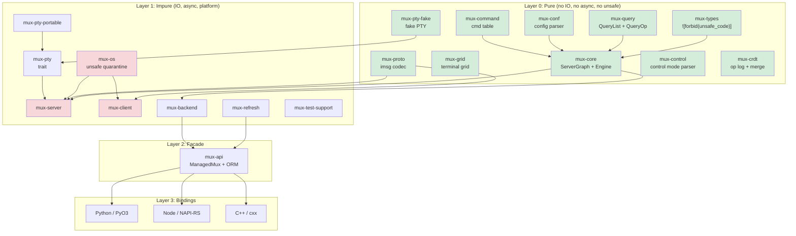

# TermForge: Rust Terminal Multiplexer Architecture (v4)

## Pass 1 -- Fresh Architectural Analysis

Date: 2026-02-10
Model: Claude Opus 4.6 (Pass 1 of 3-pass synthesis)
License: MIT OR Apache-2.0
Rust edition: 2024 (minimum 1.85)

---

## Table of Contents

1. [Project Name and Identity](#1-project-name-and-identity)
2. [Vision and Philosophy](#2-vision-and-philosophy)
3. [North Star Acceptance Criteria](#3-north-star-acceptance-criteria)
4. [High-Level Architecture](#4-high-level-architecture)
5. [Workspace Layout](#5-workspace-layout)
6. [Layering Contract](#6-layering-contract)
7. [Entity Model](#7-entity-model)
8. [Event/Effect Engine](#8-eventeffect-engine)
9. [Protocol Codec](#9-protocol-codec)
10. [ORM-like Query API](#10-orm-like-query-api)
11. [Runtime Architecture](#11-runtime-architecture)
12. [Language Bindings](#12-language-bindings)
13. [CRDT Transaction Layer](#13-crdt-transaction-layer)
14. [tmux Version Management](#14-tmux-version-management)
15. [Test Support Crate](#15-test-support-crate)
16. [Fake PTY Backend](#16-fake-pty-backend)
17. [Binding Test Frameworks](#17-binding-test-frameworks)
18. [Test Framework and Harness Design](#18-test-framework-and-harness-design)
19. [Visual Client (TUI)](#19-visual-client-tui)
20. [DOs and DON'Ts](#20-dos-and-donts)
21. [AGENTS.md Template](#21-agentsmd-template)
22. [Phased Implementation Plan](#22-phased-implementation-plan)
23. [Risks and Mitigations](#23-risks-and-mitigations)

---

## 1. Project Name and Identity

**Name:** `termforge`

**Crate prefix:** `mux-*` -- retains continuity with the proven vibe-tmux workspace (`mux-core`, `mux-proto`, `mux-api`, etc.). The `mux-` prefix is established in 20+ crates, downstream tooling, and CI pipelines.

**Binary names:** `mux-server`, `mux-client`, `mux-tui`

**Tagline:** "A deterministic multiplexer kernel with tmux wire-compatibility, ORM queries, and collaborative sessions."

**Repository layout:** Cargo workspace at root, bindings in `bindings/`, tools in `tools/`, fixtures in `fixtures/`.

---

## 2. Vision and Philosophy

### Core Thesis

TermForge is not a tmux port. It is a **new terminal multiplexer** that speaks tmux's binary protocol. The internal architecture is Rust-native: algebraic types, ownership-tracked state, pure-functional kernel, and async runtime -- while maintaining bit-for-bit compatibility with the tmux imsg wire format.

### Architectural Principles

1. **Pure/Impure Separation (Sans-IO):** The kernel (`mux-core`) is a pure `fn(state, event) -> (state, effects)` reducer. It never touches file descriptors, system calls, timers, or network. All IO happens in the runtime layer that interprets `Effect` variants.

2. **tmux is a Compatibility Profile, Not the Architecture:** tmux's `struct session`, `struct window`, `struct window_pane` inform our entity model but do not dictate it. Protocol adaptation lives in `mux-proto` and `mux-compat`; the kernel uses domain-native names.

3. **Snapshots are the Read Path:** The authoritative state lives in the `ServerGraph`. Readers (UI, bindings, query API) see immutable snapshots published via `ArcSwap`. Writers go through the event/effect engine. This eliminates read contention.

4. **ORM is a Facade:** `mux-api` translates user intent (`.new_session("work")`) into `Event` variants or backend commands. It never implements multiplexer logic.

5. **Layered Testing:** Every layer has its own test strategy. Pure core uses property testing and snapshot testing. Protocol uses fixture-driven roundtrip tests. Runtime uses hermetic servers with fake PTYs.

### Why This Architecture Beats a Direct Port

| Direct Port | TermForge |
|---|---|
| Platform code in the kernel | Platform code quarantined in `mux-os` |
| RB-tree state with manual memory management | SlotMap with generation-checked IDs |
| Libevent callback soup | Structured async with tokio tasks |
| CRDTs require invasive surgery | CRDTs compose on top of pure events |
| Testing requires real PTY and tmux binary | Fake PTY backend for deterministic tests |

---

## 3. North Star Acceptance Criteria

### 3.1 Compatibility Acceptance

| ID | Criterion | Verification |
|---|---|---|
| C1 | Real tmux 3.6+ client can attach to our server | Integration test with `tmux attach -t` |
| C2 | Our client can attach to real tmux 3.6+ server | Integration test via `mux-client` |
| C3 | Protocol v8 imsg framing: roundtrip all 35 `MsgType` variants | `proptest` with arbitrary payloads |
| C4 | Identify burst (13 message types) round-trips correctly | Fixture captures from real tmux |
| C5 | SCM_RIGHTS fd passing preserved through sniff proxy | `tmux-sniff` passthrough test |
| C6 | Command semantics match tmux's 144+ cmd_table entries | `tmux-command-audit` parity checks |

### 3.2 Architectural Acceptance

| ID | Criterion | Enforcement |
|---|---|---|
| A1 | `mux-core` has zero `unsafe`, zero `tokio`, zero `libc` | `#![forbid(unsafe_code)]` in crate root |
| A2 | `mux-os` is the sole `unsafe` quarantine | CI lint: `grep -r "unsafe" --include="*.rs"` |
| A3 | All state transitions are deterministic | Property: `apply_event(s, e)` produces same output for same input |
| A4 | No panics in protocol decode/encode paths | `#[deny(clippy::unwrap_used, clippy::expect_used)]` in hot crates |
| A5 | Bindings depend only on `mux-api`, never runtime internals | Cargo dependency check in CI |
| A6 | No `Arc<Mutex<_>>` in the read path | `ArcSwap`-based `StateHandle` |

### 3.3 Product Acceptance

| ID | Criterion |
|---|---|
| P1 | In-process embedding: create session, split, send keys, read grid -- all without spawning processes |
| P2 | Python `pytest` fixture: `server` -> `session` -> `window` -> `pane` in 4 lines |
| P3 | Snapshot test: feed VT100 input, assert grid state via `insta` |
| P4 | CRDT: two servers merge concurrent `new-session` without conflict |
| P5 | TUI client attaches to real tmux server and renders correctly |

---

## 4. High-Level Architecture

### The Layer Cake

```
Layer 0  PURE KERNEL     mux-types, mux-core, mux-query, mux-conf,
                          mux-command, mux-grid, mux-control, mux-pty-fake
                          mux-crdt, mux-proto

Layer 1  IMPURE RUNTIME  mux-os, mux-pty, mux-pty-portable, mux-client,
                          mux-server, mux-refresh, mux-backend

Layer 2  FACADE           mux-api (ManagedMux, ORM, SocketActor)

Layer 3  BINDINGS         bindings/python (PyO3), bindings/node (NAPI-RS),
                          crates/mux-cxx (cxx bridge)

Layer 4  TOOLS            tmux-sniff, tmux-vm, tmux-builder, tmux-worktrees,
                          mux-tui, mux-doctor, format-audit, regress-audit,
                          tmux-command-audit, tmux-lint, pty-report, pty-test,
                          pty-clean
```

### Mermaid Diagram



---

## 5. Workspace Layout

```
termforge/
  Cargo.toml                     # workspace root
  AGENTS.md                      # LLM development guide
  rust-toolchain.toml

  crates/
    mux-types/                   # Shared newtypes: SessionId, WindowId, PaneId, etc.
    mux-core/                    # Pure kernel: ServerGraph, Event, Effect, apply_event
      src/
        lib.rs
        graph.rs                 # ServerGraph (SlotMap-backed)
        session.rs               # Session + SessionId
        window.rs                # Window + WindowId
        pane.rs                  # Pane + PaneId + PaneSize
        client.rs                # Client + ClientId
        job.rs                   # Job + JobId
        buffer.rs                # Buffer + BufferId (paste buffers)
        event.rs                 # Event enum
        effect.rs                # Effect enum
        engine.rs                # apply_event() pure reducer
        context.rs               # ClientContext resolution
        state.rs                 # GraphState snapshots
        facade.rs                # ServerFacade (exec + graph handle)
        handle.rs                # GraphHandle (read-only accessor)
        layout.rs                # Rect, SplitDirection
    mux-query/                   # QueryList, QueryOp, Queryable derive
    mux-conf/                    # tmux.conf parser (PURE -- no file IO)
    mux-command/                 # Command table + dispatch
    mux-grid/                    # Terminal grid + VT100 state machine
    mux-control/                 # Control mode parser (%output, %begin, etc.)
    mux-proto/                   # imsg framing + MsgType + payload parsers
      src/
        lib.rs
        frame.rs                 # ImsgHdr (16-byte header)
        msg.rs                   # MsgType enum (35 variants)
        codec.rs                 # tokio Decoder/Encoder
        payload.rs               # Typed payload structs
        identify.rs              # IdentifyBurst builder
        fixture.rs               # Capture file loading
        error.rs                 # ProtocolError
    mux-crdt/                    # CrdtOp, HLC, merge semantics
    mux-pty/                     # PtyBackend trait
    mux-pty-fake/                # FakePty + FakePtyBackend (PURE)
    mux-pty-portable/            # portable-pty based backend
    mux-pty-diagnostics/         # leak detection, stale cleanup
    mux-os/                      # unsafe quarantine: SCM_RIGHTS, signals
    mux-server/                  # tokio runtime, socket accept loop
    mux-client/                  # client connection, control mode
    mux-backend/                 # Backend trait: Local + Tmux
    mux-refresh/                 # StateStore + ArcSwap + RefreshPlanner
    mux-view/                    # Immutable view types: ServerView, SessionRef, etc.
    mux-api/                     # ManagedMux, MuxBackend, ORM facade
    mux-cxx/                     # cxx bridge
    mux-test-support/            # TmuxTestServer, PathGuard, hermetic isolation
    mux-telemetry/               # tracing span context
    mux-otel/                    # OpenTelemetry integration

  tools/
    tmux-sniff/                  # Protocol sniffer with SCM_RIGHTS passthrough
    tmux-vm/                     # tmux version manager (ensure + exec)
    tmux-builder/                # Build tmux from source at any git ref
    tmux-worktrees/              # Git worktree manager for tmux source
    tmux-lint/                   # tmux.conf linter
    tmux-command-audit/          # Compare our commands vs tmux's cmd_table
    regress-audit/               # Run tmux regress suite against our server
    format-audit/                # Audit format.c expansion coverage
    mux-tui/                     # Rust-native TUI client
    mux-doctor/                  # Diagnostic tool
    pty-report/                  # PTY capability reporting
    pty-test/                    # PTY integration smoke test
    pty-clean/                   # Stale PTY cleaner

  bindings/
    python/
      Cargo.toml                 # PyO3 + maturin
      src/lib.rs
      python/termforge/
        __init__.py
        _native.pyi              # Type stubs
      tests/
        conftest.py              # pytest fixtures
        test_server.py
        test_session.py
        test_query.py
    node/
      Cargo.toml                 # NAPI-RS
      src/lib.rs
      __test__/
        server.spec.ts           # vitest tests
      package.json

  fixtures/
    captures/                    # Binary protocol captures from real tmux
    grids/                       # Terminal grid snapshots for insta
    configs/                     # tmux.conf samples for parser testing
```

---

## 6. Layering Contract

### Hard Boundaries

**Boundary A -- Core is Deterministic:**

The core never asks the operating system for anything. No `SystemTime::now()`, no `std::fs`, no `rand()`, no `std::thread`. If the core needs a timestamp, it receives one via an `Event` variant. If it needs randomness, it receives a seed.

```rust
// WRONG -- core asking the OS
pub fn create_session(graph: &mut ServerGraph) -> SessionId {
    let name = format!("session-{}", SystemTime::now().elapsed().unwrap().as_secs());
    graph.create_session(name)
}

// RIGHT -- core receiving information via events
pub fn apply_event(graph: &mut ServerGraph, event: Event) -> ApplyOutcome {
    match event {
        Event::CreateSession { name, created_at } => {
            let id = graph.create_session(name);
            ApplyOutcome { created_session: Some(id), ..Default::default() }
        }
        // ...
    }
}
```

**Boundary B -- Snapshots are the Read Path:**

The `ServerGraph` is mutated only through `apply_event()`. After mutation, the runtime publishes a `GraphState` snapshot through `ArcSwap`. All readers (UI, bindings, query API) read from the snapshot, never from the mutable graph.

```rust
// mux-refresh/src/lib.rs
pub struct StateStore<T> {
    inner: Arc<ArcSwap<T>>,
}

pub struct StateHandle<T> {
    inner: Arc<ArcSwap<T>>,
}

impl<T> StateHandle<T> {
    /// Lock-free read via ArcSwap::load()
    pub fn with_read<R>(&self, f: impl FnOnce(&T) -> R) -> R {
        let guard = self.inner.load();
        f(&guard)
    }
}
```

**Boundary C -- tmux Compatibility is an Adapter:**

The core uses domain-native names (`Session`, `Window`, `Pane`). tmux protocol specifics (`MsgType::IdentifyFlags`, `msg_command`, imsg framing) live entirely in `mux-proto`. The server runtime translates between the two:

```rust
// mux-server: translates protocol frame -> core event
fn translate_command(frame: &ImsgFrame) -> Result<Event, ProtocolError> {
    let args = parse_command_args(&frame.payload)?;
    Ok(Event::Command { name: args[0].clone(), args: args[1..].to_vec() })
}
```

**Boundary D -- ORM API is a Facade:**

The ORM translates intent into commands. It never implements window splitting, session creation logic, or layout algorithms. Those belong in the core.

```rust
// mux-api -- facade translates intent to events
impl MuxBackend {
    pub fn new_session(&mut self, name: &str) -> Result<ViewId, BackendError> {
        let output = self.cmd(&format!("new-session -d -s {name}"))?;
        // Refresh view to get the new session's ID
        let view = self.view()?;
        view.sessions().get_by_name(name)
            .map(|s| s.id())
            .ok_or(BackendError::NotFound)
    }
}
```

### Enforcement Rules

| Rule | Mechanism |
|---|---|
| Pure crates: no `tokio`, `async`, `unsafe` | `#![forbid(unsafe_code)]` + CI dep check |
| One-way deps: bindings -> api -> backend -> core | `cargo deny check` or `hakari` |
| No `Arc<Mutex>` on read path | Code review + `#[deny(clippy::mutex_guard_in_return)]` |
| No panics in protocol/server paths | `#[deny(clippy::unwrap_used, clippy::expect_used, clippy::panic)]` |
| `unsafe` only in `mux-os` | `grep -r "unsafe" --include="*.rs" crates/ | grep -v mux-os` must be empty |

---

## 7. Entity Model

### Design Rationale: SlotMap with Typed Keys

We use `slotmap::SlotMap` instead of `HashMap<u64, T>` or arena allocators because:

1. **Generation-checked IDs:** A `SessionId` from a deleted session will not accidentally resolve to a new session that reuses the same slot.
2. **O(1) lookup:** No hashing overhead.
3. **Compact iteration:** Dense storage with no tombstone gaps during iteration.
4. **Newtype safety:** Each entity type gets its own key type via `new_key_type!`, preventing accidental cross-entity lookups.

### Typed ID Declarations

```rust
// mux-core/src/session.rs
use slotmap::new_key_type;

new_key_type! {
    /// Unique identifier for a session within the server.
    /// Generation-checked: stale IDs safely return None.
    pub struct SessionId;
}

// Similarly for all entity types:
new_key_type! { pub struct WindowId; }
new_key_type! { pub struct PaneId; }
new_key_type! { pub struct ClientId; }
new_key_type! { pub struct JobId; }
new_key_type! { pub struct BufferId; }
```

### Entity Structs

```rust
/// mux-core/src/session.rs
#[derive(Debug, Clone)]
pub struct Session {
    pub name: String,
    pub cwd: String,
    pub windows: Vec<WindowId>,
    pub active_window: Option<WindowId>,
    pub last_window: Option<WindowId>,
    pub created_at: i64,          // unix millis, received via Event
    pub last_attached_at: i64,
    pub destroying: bool,
    pub options: SessionOptions,   // typed option bag
}

/// mux-core/src/window.rs
#[derive(Debug, Clone)]
pub struct Window {
    pub name: String,
    pub panes: Vec<PaneId>,
    pub active_pane: Option<PaneId>,
    pub last_active_pane: Option<PaneId>,
    pub layout_root: Option<LayoutNodeId>,
    pub size: WindowSize,
    pub flags: WindowFlags,
}

/// mux-core/src/pane.rs
#[derive(Debug, Clone)]
pub struct Pane {
    pub size: PaneSize,
    pub bounds: Option<Rect>,
    pub exited: bool,
    pub exit_status: Option<i32>,
    pub start_command: String,
    pub start_path: String,
    pub mode: PaneMode,           // Normal, Copy, View, etc.
}

#[derive(Debug, Clone, Copy, PartialEq, Eq)]
pub struct PaneSize {
    pub cols: u16,
    pub rows: u16,
}

impl PaneSize {
    pub const DEFAULT: Self = Self { cols: 80, rows: 24 };
}

/// mux-core/src/client.rs
#[derive(Debug, Clone)]
pub struct Client {
    pub name: String,
    pub session: Option<SessionId>,
    pub last_session: Option<SessionId>,
    pub tty_name: String,
    pub term_type: String,
    pub features: u32,
    pub flags: ClientFlags,
    pub size: PaneSize,
}

/// mux-core/src/job.rs
#[derive(Debug, Clone)]
pub struct Job {
    pub command: String,
    pub exit_status: Option<i32>,
}

/// mux-core/src/buffer.rs  (NEW -- paste buffers)
#[derive(Debug, Clone)]
pub struct Buffer {
    pub name: String,
    pub data: Vec<u8>,
    pub created_at: i64,
}
```

### The ServerGraph

```rust
// mux-core/src/graph.rs
#[derive(Debug, Default, Clone)]
pub struct ServerGraph {
    sessions: SlotMap<SessionId, Session>,
    windows:  SlotMap<WindowId, Window>,
    panes:    SlotMap<PaneId, Pane>,
    clients:  SlotMap<ClientId, Client>,
    jobs:     SlotMap<JobId, Job>,
    buffers:  SlotMap<BufferId, Buffer>,
}

impl ServerGraph {
    pub fn new() -> Self { Self::default() }

    // Creation
    pub fn create_session(&mut self, name: impl Into<String>) -> SessionId;
    pub fn create_window(&mut self, name: impl Into<String>) -> WindowId;
    pub fn create_pane(&mut self, size: PaneSize) -> PaneId;
    pub fn create_client(&mut self, name: impl Into<String>) -> ClientId;
    pub fn create_job(&mut self, command: impl Into<String>) -> JobId;
    pub fn create_buffer(&mut self, name: impl Into<String>, data: Vec<u8>) -> BufferId;

    // Lookup (O(1))
    pub fn session(&self, id: SessionId) -> Option<&Session>;
    pub fn session_mut(&mut self, id: SessionId) -> Option<&mut Session>;
    // ... same pattern for all entity types

    // Relationship management
    pub fn add_window_to_session(&mut self, session: SessionId, window: WindowId) -> bool;
    pub fn add_pane_to_window(&mut self, window: WindowId, pane: PaneId) -> bool;
    pub fn attach_client(&mut self, client: ClientId, session: SessionId) -> bool;

    // Context resolution
    pub fn client_context(&self, client: ClientId) -> ClientContext;

    // Snapshot (for read path)
    pub fn graph_state(&self) -> GraphState;
}
```

### Relationship Model

```
Server (implicit singleton)
  |-- sessions: SlotMap<SessionId, Session>
  |     |-- windows: Vec<WindowId>  (ordered, owned by session)
  |     |-- active_window: Option<WindowId>
  |     |-- last_window: Option<WindowId>
  |
  |-- windows: SlotMap<WindowId, Window>
  |     |-- panes: Vec<PaneId>  (ordered, owned by window)
  |     |-- active_pane: Option<PaneId>
  |     |-- layout_root: tree of LayoutNodeId
  |
  |-- panes: SlotMap<PaneId, Pane>
  |     (terminal state, size, exit status)
  |
  |-- clients: SlotMap<ClientId, Client>
  |     |-- session: Option<SessionId>  (attached session)
  |
  |-- jobs: SlotMap<JobId, Job>
  |-- buffers: SlotMap<BufferId, Buffer>
```

Key design: windows and panes store **only** forward references (parent owns child IDs). Reverse lookups (pane -> window, window -> session) are computed during `graph_state()` snapshot construction using HashMap building, not stored as back-pointers. This avoids the consistency burden of bidirectional links.

---

## 8. Event/Effect Engine

### Core Signature

```rust
/// Apply an event to the graph, returning effects for the runtime to execute.
///
/// This is the heart of the Sans-IO architecture:
/// - Pure: no IO, no async, no randomness
/// - Deterministic: same (graph, event) always produces same (graph', effects)
/// - Total: every Event variant is handled; unknown events return empty effects
pub fn apply_event(graph: &mut ServerGraph, event: Event) -> ApplyOutcome {
    match event {
        Event::CreateSession { .. } => { /* ... */ }
        Event::CreatePane { .. } => { /* ... */ }
        // ... exhaustive match
    }
}

#[derive(Debug, Default, Clone)]
pub struct ApplyOutcome {
    pub effects: Vec<Effect>,
    pub created_session: Option<SessionId>,
    pub created_window: Option<WindowId>,
    pub created_pane: Option<PaneId>,
    pub error: Option<CoreError>,
}
```

### Event Enum (Fresh Design)

```rust
#[derive(Debug, Clone)]
#[non_exhaustive]
pub enum Event {
    // === Lifecycle ===
    CreateSession { name: String, cwd: Option<String>, created_at: i64 },
    DestroySession { session_id: SessionId },
    CreateWindow { session_id: SessionId, name: String },
    DestroyWindow { window_id: WindowId },
    CreatePane { window_id: WindowId, size: PaneSize, command: Vec<String>, cwd: Option<String> },
    DestroyPane { pane_id: PaneId },

    // === Navigation ===
    SelectWindow { session_id: SessionId, window_id: WindowId },
    SelectWindowByIndex { session_id: SessionId, index: usize },
    NextWindow { session_id: SessionId },
    PreviousWindow { session_id: SessionId },
    SelectLastWindow { session_id: SessionId },
    SelectPane { window_id: WindowId, pane_id: PaneId },
    SelectNextPane { window_id: WindowId },
    SelectPrevPane { window_id: WindowId },
    SelectLastPane { window_id: WindowId },

    // === Mutation ===
    RenameSession { session_id: SessionId, name: String },
    RenameWindow { window_id: WindowId, name: String },
    ResizePane { pane_id: PaneId, size: PaneSize },
    MoveWindow { session_id: SessionId, window_id: WindowId, target_index: usize },
    SwapPane { pane_a: PaneId, pane_b: PaneId },
    SplitWindow { window_id: WindowId, direction: SplitDirection, size: PaneSize,
                  command: Vec<String>, cwd: Option<String> },

    // === Client ===
    ClientAttach { client_id: ClientId, session_id: SessionId },
    ClientDetach { client_id: ClientId },
    ClientResize { client_id: ClientId, size: PaneSize },

    // === IO Responses (runtime -> core) ===
    PaneExited { pane_id: PaneId, exit_status: i32 },
    PaneOutput { pane_id: PaneId, data: Vec<u8> },
    JobExited { job_id: JobId, exit_status: i32 },

    // === Input ===
    Key { client_id: ClientId, key: KeyCode },
    Command { name: String, args: Vec<String>, client_id: Option<ClientId> },

    // === Time (injected by runtime) ===
    Tick { now_millis: i64 },
}
```

**Fresh insight vs v3:** The `Tick` event and `created_at` timestamps make the core testable with reproducible time. The `PaneOutput` event allows the core to track dirty state for redraw without the core ever touching a PTY. The `#[non_exhaustive]` annotation enables adding variants without breaking downstream.

### Effect Enum

```rust
#[derive(Debug, Clone)]
#[non_exhaustive]
pub enum Effect {
    // === PTY ===
    SpawnPane { pane_id: PaneId, command: Vec<String>, cwd: Option<String>, size: PaneSize },
    KillPane { pane_id: PaneId, signal: i32 },
    WritePane { pane_id: PaneId, data: Vec<u8> },
    ResizePty { pane_id: PaneId, size: PaneSize },

    // === Display ===
    Redraw { scope: RedrawScope },

    // === Client ===
    NotifyClient { client_id: ClientId, message: String },
    SendToClient { client_id: ClientId, frame: FrameData },
    DisconnectClient { client_id: ClientId },

    // === Job ===
    StartJob { job_id: JobId, command: Vec<String> },
    StopJob { job_id: JobId },

    // === Server ===
    Shutdown,
    Log { level: LogLevel, message: String },
}

#[derive(Debug, Clone)]
pub enum RedrawScope {
    All,
    Session(SessionId),
    Window(WindowId),
    Pane(PaneId),
    StatusLine,
}
```

### Property Test Example

```rust
#[cfg(test)]
mod property_tests {
    use super::*;
    use proptest::prelude::*;

    fn arb_session_name() -> impl Strategy<Value = String> {
        "[a-z][a-z0-9-]{0,20}".prop_filter("non-empty", |s| !s.is_empty())
    }

    proptest! {
        /// Creating N sessions always results in N sessions in the graph.
        #[test]
        fn create_sessions_are_additive(names in prop::collection::vec(arb_session_name(), 1..50)) {
            let mut graph = ServerGraph::new();
            for name in &names {
                let _ = apply_event(&mut graph, Event::CreateSession {
                    name: name.clone(),
                    cwd: None,
                    created_at: 0,
                });
            }
            prop_assert_eq!(graph.session_ids().len(), names.len());
        }

        /// Applying the same event sequence to two fresh graphs produces identical state.
        #[test]
        fn engine_is_deterministic(
            names in prop::collection::vec(arb_session_name(), 1..10)
        ) {
            let events: Vec<_> = names.iter().map(|n| Event::CreateSession {
                name: n.clone(), cwd: None, created_at: 0,
            }).collect();

            let mut g1 = ServerGraph::new();
            let mut g2 = ServerGraph::new();

            for event in &events {
                let _ = apply_event(&mut g1, event.clone());
                let _ = apply_event(&mut g2, event.clone());
            }

            prop_assert_eq!(g1.graph_state(), g2.graph_state());
        }
    }
}
```

---

## 9. Protocol Codec

### Wire Format

tmux uses OpenBSD's imsg framing. Every message is:

```
+----------+----------+----------+----------+------------+
|  type    |   len    |  peerid  |   pid    |  payload   |
|  (u32)   |  (u32)   |  (u32)   |  (u32)   |  (var)     |
+----------+----------+----------+----------+------------+
    4          4          4          4       0..16368 bytes
```

All fields are **native endianness** (client and server always on same machine).

- `type`: `MsgType` discriminant (e.g., `MSG_VERSION = 12`, `MSG_COMMAND = 200`)
- `len`: Total length including 16-byte header. Range `[16, 16384]`. High bit (`0x8000_0000`) is `IMSG_FD_FLAG`.
- `peerid`: Protocol version in low 8 bits for `MSG_VERSION`.
- `pid`: Sender's PID.

### ImsgHdr

```rust
// mux-proto/src/frame.rs
pub const IMSG_HEADER_SIZE: usize = 16;
pub const IMSG_FD_FLAG: u32 = 0x8000_0000;

#[derive(Debug, Clone, Copy, PartialEq, Eq)]
pub struct ImsgHdr {
    pub msg_type: u32,
    pub len: u32,        // actual length (FD flag masked off)
    pub peerid: u32,
    pub pid: u32,
    pub has_fd: bool,
}

impl ImsgHdr {
    /// Decode from buffer. Handles both modern (u32 len + FD flag in high bit)
    /// and legacy (u16 len + u16 flags) formats.
    pub fn decode<B: Buf>(buf: &mut B) -> Result<Self, ProtocolError>;

    /// Encode to buffer using native endianness.
    pub fn encode<B: BufMut>(&self, buf: &mut B);

    pub const fn payload_len(&self) -> u32 { self.len - IMSG_HEADER_SIZE as u32 }
}
```

### Two-Phase Codec

```rust
// mux-proto/src/codec.rs
pub struct ImsgCodec {
    pending_header: Option<ImsgHdr>,
}

impl Decoder for ImsgCodec {
    type Item = ImsgFrame;
    type Error = io::Error;

    fn decode(&mut self, src: &mut BytesMut) -> Result<Option<ImsgFrame>, io::Error> {
        // Phase 1: decode header (16 bytes)
        let header = match self.pending_header.take() {
            Some(h) => h,
            None => {
                if src.len() < IMSG_HEADER_SIZE { return Ok(None); }
                let header_bytes = src.split_to(IMSG_HEADER_SIZE);
                ImsgHdr::decode(&mut &header_bytes[..])?
            }
        };

        // Phase 2: decode payload
        let payload_len = header.payload_len() as usize;
        if src.len() < payload_len {
            self.pending_header = Some(header);
            return Ok(None);
        }

        let payload = src.split_to(payload_len);
        Ok(Some(ImsgFrame { header, payload }))
    }
}
```

### MsgType Enum

35 variants matching `tmux-protocol.h`:

```rust
#[derive(Debug, Clone, Copy, PartialEq, Eq, Hash)]
#[repr(u32)]
pub enum MsgType {
    Version = 12,
    // Identify burst (100-112)
    IdentifyFlags = 100,
    IdentifyTerm = 101,
    IdentifyTtyname = 102,
    IdentifyOldcwd = 103,      // unused in v8
    IdentifyStdin = 104,       // has_fd = true
    IdentifyEnviron = 105,     // repeatable
    IdentifyDone = 106,
    IdentifyClientpid = 107,
    IdentifyCwd = 108,
    IdentifyFeatures = 109,
    IdentifyStdout = 110,      // has_fd = true
    IdentifyLongflags = 111,
    IdentifyTerminfo = 112,    // repeatable
    // Commands and responses (200-218)
    Command = 200,
    Detach = 201,
    // ... through Flags = 218
    // File I/O (300-307)
    ReadOpen = 300,
    // ... through ReadCancel = 307
}
```

### Fixture Testing Pattern

```rust
// mux-proto/src/fixture.rs
pub struct CaptureRecord {
    pub direction: Direction,
    pub timestamp: Duration,
    pub raw_bytes: Vec<u8>,
    pub fds: Vec<i32>,
}

pub fn read_capture(path: &Path) -> Result<Vec<CaptureRecord>, FixtureError>;

#[cfg(test)]
mod tests {
    use super::*;
    use insta::assert_yaml_snapshot;

    #[test]
    fn roundtrip_identify_burst_from_real_tmux() {
        let records = read_capture(Path::new("fixtures/captures/identify-burst-3.6a.bin"))
            .expect("fixture load");
        let mut codec = ImsgCodec::new();

        for record in &records {
            let mut buf = BytesMut::from(&record.raw_bytes[..]);
            let frame = codec.decode(&mut buf).expect("decode").expect("frame");

            // Re-encode and verify byte-for-byte match
            let mut re_encoded = BytesMut::new();
            codec.encode(frame.clone(), &mut re_encoded).expect("encode");
            assert_eq!(re_encoded.as_ref(), record.raw_bytes.as_slice());
        }
    }

    #[test]
    fn snapshot_parsed_identify_burst() {
        let records = read_capture(Path::new("fixtures/captures/identify-burst-3.6a.bin"))
            .expect("fixture load");
        let payloads: Vec<_> = records.iter()
            .filter_map(|r| { /* parse */ })
            .collect();
        assert_yaml_snapshot!(payloads);
    }
}
```

### Fuzz Testing

```rust
// mux-proto/fuzz/fuzz_targets/decode_frame.rs
#![no_main]
use libfuzzer_sys::fuzz_target;
use bytes::BytesMut;
use mux_proto::ImsgCodec;
use tokio_util::codec::Decoder;

fuzz_target!(|data: &[u8]| {
    let mut codec = ImsgCodec::new();
    let mut buf = BytesMut::from(data);
    // Must not panic, may return Ok(None), Ok(Some(_)), or Err(_)
    let _ = codec.decode(&mut buf);
});
```

---

## 10. ORM-like Query API

### Design Philosophy

Inspired by libtmux's Python API and Django's QuerySet, the query API provides typed, composable filtering over the object graph.

### QueryOp

```rust
// mux-query/src/lib.rs
#[derive(Debug, Clone, PartialEq, Eq)]
pub enum QueryOp {
    Exact,
    Contains,
    IContains,
    StartsWith,
    IStartsWith,
    EndsWith,
    IEndsWith,
    Regex,
    In,
    Gt,
    Gte,
    Lt,
    Lte,
    IsNone,
    IsSome,
}

#[derive(Debug, Clone)]
pub struct QuerySpec {
    pub field: String,
    pub op: QueryOp,
    pub value: QueryValue,
}

#[derive(Debug, Clone)]
pub enum QueryValue {
    String(String),
    Int(i64),
    Bool(bool),
    StringList(Vec<String>),
    Regex(String),  // compiled lazily
    None,
}
```

### QueryList

```rust
/// A filterable, sortable list of view references.
/// Equivalent to libtmux's QueryList.
#[derive(Debug, Clone)]
pub struct QueryList<T> {
    items: Vec<T>,
}

impl<T: Queryable> QueryList<T> {
    /// Filter items matching all specs (AND semantics).
    pub fn filter(&self, specs: &[QuerySpec]) -> Self {
        Self {
            items: self.items.iter()
                .filter(|item| specs.iter().all(|spec| item.matches(spec)))
                .cloned()
                .collect(),
        }
    }

    /// Get exactly one matching item, or error.
    pub fn get(&self, specs: &[QuerySpec]) -> Result<&T, QueryError> {
        let matches: Vec<_> = self.items.iter()
            .filter(|item| specs.iter().all(|spec| item.matches(spec)))
            .collect();
        match matches.len() {
            0 => Err(QueryError::DoesNotExist),
            1 => Ok(matches[0]),
            _ => Err(QueryError::MultipleObjectsReturned),
        }
    }

    pub fn first(&self) -> Option<&T> { self.items.first() }
    pub fn len(&self) -> usize { self.items.len() }
    pub fn is_empty(&self) -> bool { self.items.is_empty() }
    pub fn iter(&self) -> std::slice::Iter<'_, T> { self.items.iter() }
}
```

### Queryable Trait

```rust
/// Trait for entities that can be filtered by QuerySpec.
pub trait Queryable {
    /// Extract a field value by name for comparison.
    fn field_value(&self, field: &str) -> Option<QueryValue>;

    /// Check if this item matches a single spec.
    fn matches(&self, spec: &QuerySpec) -> bool {
        let Some(value) = self.field_value(&spec.field) else {
            return matches!(spec.op, QueryOp::IsNone);
        };
        apply_op(&spec.op, &value, &spec.value)
    }
}

/// Implementation for session view
impl Queryable for SessionRef<'_> {
    fn field_value(&self, field: &str) -> Option<QueryValue> {
        match field {
            "session_name" | "name" => Some(QueryValue::String(self.name().to_string())),
            "session_id" | "id" => Some(QueryValue::String(self.id().to_string())),
            "session_windows" => Some(QueryValue::Int(self.windows().len() as i64)),
            _ => None,
        }
    }
}
```

### Usage Patterns (libtmux equivalents)

```rust
// Python libtmux:
//   server.sessions.filter(session_name="work")
//   server.sessions.get(session_name__startswith="wo")
//   session.windows.filter(window_name__icontains="edit")

// Rust equivalent:
let view = server.view()?;
let sessions = view.sessions();

// Exact match
let work = sessions.filter(&[QuerySpec {
    field: "session_name".into(),
    op: QueryOp::Exact,
    value: QueryValue::String("work".into()),
}]);

// Startswith
let wo = sessions.get(&[QuerySpec {
    field: "session_name".into(),
    op: QueryOp::StartsWith,
    value: QueryValue::String("wo".into()),
}])?;

// Chained: session -> windows -> filter
let session = sessions.first().unwrap();
let editors = session.windows().filter(&[QuerySpec {
    field: "window_name".into(),
    op: QueryOp::IContains,
    value: QueryValue::String("edit".into()),
}]);
```

### Builder Syntax (Ergonomic Alternative)

```rust
// More ergonomic query builder
use mux_query::q;

let work_sessions = view.sessions()
    .filter(q("name").exact("work"));

let editors = session.windows()
    .filter(q("name").icontains("edit"));

let large_panes = window.panes()
    .filter(q("cols").gte(120));
```

---

## 11. Runtime Architecture

### Thread Model

```
+--------------------+     +-------------------+
|  Accept Thread     |     |  PTY Reader Pool  |
|  (tokio task)      |     |  (1 task/pane)    |
|  UnixListener      |     |  reads PTY fd     |
+--------+-----------+     +--------+----------+
         |                          |
         | new client conn          | PaneOutput events
         v                          v
+---------------------------------------------------+
|              State Actor (single task)              |
|                                                     |
|  loop {                                             |
|      event = recv(event_rx);                        |
|      outcome = apply_event(&mut graph, event);      |
|      for effect in outcome.effects {                |
|          dispatch_effect(effect, &tx_pool);          |
|      }                                              |
|      publish_snapshot(&graph, &state_store);         |
|  }                                                  |
+---------------------------------------------------+
         |                   |                |
         | SpawnPane         | WritePane      | NotifyClient
         v                   v                v
+----------------+  +----------------+  +----------------+
| PTY Spawner    |  | PTY Writers    |  | Client Writers |
| (tokio task)   |  | (tokio tasks)  |  | (tokio tasks)  |
+----------------+  +----------------+  +----------------+
```

### SocketActor (Managed Facade)

```rust
// mux-api/src/managed.rs
pub struct SocketActor {
    backend: Arc<Mutex<MuxBackend>>,
    state: StateHandle<Option<View>>,
    queue: MutationQueue<Option<View>>,
    error_state: StateHandle<Option<String>>,
    updates: RefreshBroadcaster,
    refresh: RefreshPlanner,
    control: Option<ControlLease>,
    control_active: bool,
    event_tx: Option<Sender<SocketEvent>>,
}

pub type ManagedMux = SocketActor;
```

### RefreshDriver

The `RefreshDriver` spawns three threads:

1. **Driver thread:** Listens for `SocketEvent`s, decides when to capture views.
2. **Control thread:** Reads control mode notifications from tmux.
3. **Timer thread:** Handles debounced refresh deadlines.

```rust
pub struct RefreshDriver {
    stop: Arc<AtomicBool>,
    handle: Option<JoinHandle<()>>,
    control_handle: Option<JoinHandle<()>>,
    timer_handle: Option<JoinHandle<()>>,
    event_tx: Sender<SocketEvent>,
}

impl RefreshDriver {
    pub fn spawn(managed: Arc<Mutex<SocketActor>>) -> Self;
    pub fn stop(&mut self);
}
```

### RefreshPlanner

The planner decides what to refresh based on control mode notifications:

```rust
pub struct RefreshPlanner {
    drift: bool,           // true = full refresh needed
    pending: RefreshSet,   // accumulated scoped refreshes
}

#[derive(Debug, Clone, Copy, PartialEq, Eq)]
pub struct RefreshSet {
    pub sessions: bool,
    pub windows: bool,
    pub panes: bool,
    pub clients: bool,
    pub jobs: bool,
}

impl RefreshPlanner {
    pub fn record_notification(&mut self, name: &str) {
        // Map tmux notification names to refresh scopes
        // e.g., "session-changed" -> sessions + windows + panes
    }

    pub fn plan_scope(&mut self) -> RefreshPlan {
        if self.drift { return RefreshPlan::Full; }
        // ...
    }
}
```

### StateHandle (Lock-Free Read)

```rust
// mux-refresh/src/lib.rs
use arc_swap::ArcSwap;

pub struct StateStore<T> {
    inner: Arc<ArcSwap<T>>,
}

impl<T> StateStore<T> {
    pub fn new(initial: T) -> Self {
        Self { inner: Arc::new(ArcSwap::from_pointee(initial)) }
    }

    pub fn split(self) -> (StateHandle<T>, MutationQueue<T>) {
        let handle = StateHandle { inner: Arc::clone(&self.inner) };
        let queue = MutationQueue { inner: self.inner };
        (handle, queue)
    }
}

pub struct StateHandle<T> {
    inner: Arc<ArcSwap<T>>,
}

impl<T> StateHandle<T> {
    /// Lock-free read. The returned guard holds an Arc to the snapshot.
    pub fn with_read<R>(&self, f: impl FnOnce(&T) -> R) -> R {
        let guard = self.inner.load();
        f(&guard)
    }

    pub fn try_with_read<R>(&self, f: impl FnOnce(&T) -> R) -> R {
        self.with_read(f)
    }
}

pub struct MutationQueue<T> {
    inner: Arc<ArcSwap<T>>,
}

impl<T: Clone> MutationQueue<T> {
    /// Submit a mutation. Clones current state, applies f, then swaps atomically.
    pub fn submit(&self, f: impl FnOnce(&mut T)) -> Result<(), anyhow::Error> {
        let current = self.inner.load();
        let mut next = (**current).clone();
        f(&mut next);
        self.inner.store(Arc::new(next));
        Ok(())
    }
}
```

---

## 12. Language Bindings

### Thin Wrapper Philosophy

Bindings expose:
1. **Object graph traversal:** `Server.sessions`, `Session.windows`, `Window.panes`
2. **Command execution:** `server.cmd("new-session -d -s work")`
3. **Query API:** `server.sessions.filter(name__startswith="wo")`
4. **Lifecycle management:** `ManagedMux`, refresh subscriptions

Bindings do NOT expose: frames, stores, planners, codec internals, or `ServerGraph` mutations.

### Python Bindings (PyO3)

```rust
// bindings/python/src/lib.rs
use pyo3::prelude::*;
use mux_api::{ManagedMux, MuxBackend, View};

#[pyclass(name = "Server")]
struct PyServer {
    inner: MuxBackend,
}

#[pymethods]
impl PyServer {
    #[new]
    #[pyo3(signature = (socket_name=None, socket_path=None))]
    fn new(socket_name: Option<&str>, socket_path: Option<&str>) -> PyResult<Self> {
        let backend = match (socket_path, socket_name) {
            (Some(path), _) => MuxBackend::tmux(Some(path.as_ref()), None, None)?,
            (_, Some(name)) => MuxBackend::tmux(None, Some(name), None)?,
            _ => MuxBackend::tmux_default()?,
        };
        Ok(Self { inner: backend })
    }

    /// Execute a tmux command string.
    fn cmd(&mut self, cmd: &str) -> PyResult<String> {
        let output = self.inner.cmd(cmd)?;
        Ok(output.stdout)
    }

    /// Return list of sessions.
    #[getter]
    fn sessions(&mut self) -> PyResult<Vec<PySession>> {
        let view = self.inner.view()?;
        Ok(view.sessions().iter().map(|s| PySession::from_view(s)).collect())
    }
}

#[pyclass(name = "Session")]
struct PySession {
    id: String,
    name: String,
    window_count: usize,
}

#[pymethods]
impl PySession {
    #[getter]
    fn session_name(&self) -> &str { &self.name }

    #[getter]
    fn session_id(&self) -> &str { &self.id }
}
```

### Node Bindings (NAPI-RS)

```rust
// bindings/node/src/lib.rs
use napi_derive::napi;
use mux_api::MuxBackend;

#[napi]
pub struct Server {
    inner: MuxBackend,
}

#[napi]
impl Server {
    #[napi(constructor)]
    pub fn new(socket_name: Option<String>) -> napi::Result<Self> {
        let backend = MuxBackend::tmux(None, socket_name.as_deref(), None)?;
        Ok(Self { inner: backend })
    }

    #[napi]
    pub fn cmd(&mut self, cmd: String) -> napi::Result<String> {
        let output = self.inner.cmd(&cmd)?;
        Ok(output.stdout)
    }

    #[napi(getter)]
    pub fn sessions(&mut self) -> napi::Result<Vec<SessionInfo>> {
        let view = self.inner.view()?;
        Ok(view.sessions().iter().map(SessionInfo::from_view).collect())
    }
}
```

### C++ Bindings (cxx)

```rust
// crates/mux-cxx/src/lib.rs
#[cxx::bridge]
mod ffi {
    struct SessionInfo {
        id: String,
        name: String,
    }

    extern "Rust" {
        type MuxServer;
        fn mux_server_new(socket_name: &str) -> Result<Box<MuxServer>>;
        fn cmd(self: &mut MuxServer, cmd: &str) -> Result<String>;
        fn sessions(self: &mut MuxServer) -> Result<Vec<SessionInfo>>;
    }
}
```

---

## 13. CRDT Transaction Layer

### Design Principle: Compose, Don't Retrofit

The CRDT layer sits above the pure core. It wraps events into operations with causal metadata, but the core's `apply_event()` function is unchanged. The CRDT layer is optional -- the kernel works without it.

### Architecture

```
             +------------------+
             |    CRDT Layer    |
             |   mux-crdt      |
             +--------+---------+
                      |
         wrap: Event -> CrdtOp
         unwrap: CrdtOp -> Event
                      |
             +--------v---------+
             |   Pure Core      |
             |   mux-core       |
             +------------------+
```

### Hybrid Logical Clock

```rust
// mux-crdt/src/hlc.rs
#[derive(Debug, Clone, Copy, PartialEq, Eq, PartialOrd, Ord, Hash)]
pub struct HybridTimestamp {
    /// Physical time in milliseconds since epoch.
    pub millis: u64,
    /// Logical counter for ordering events at the same millisecond.
    pub counter: u32,
    /// Node identifier for tie-breaking.
    pub node_id: NodeId,
}

#[derive(Debug, Clone, Copy, PartialEq, Eq, PartialOrd, Ord, Hash)]
pub struct NodeId(pub u64);

impl HybridTimestamp {
    pub fn now(node_id: NodeId, physical_millis: u64, last: &Self) -> Self {
        let millis = physical_millis.max(last.millis);
        let counter = if millis == last.millis { last.counter + 1 } else { 0 };
        Self { millis, counter, node_id }
    }

    /// Merge with a received timestamp.
    pub fn receive(self, remote: Self, physical_millis: u64) -> Self {
        let millis = physical_millis.max(self.millis).max(remote.millis);
        let counter = if millis == self.millis && millis == remote.millis {
            self.counter.max(remote.counter) + 1
        } else if millis == self.millis {
            self.counter + 1
        } else if millis == remote.millis {
            remote.counter + 1
        } else {
            0
        };
        Self { millis, counter, node_id: self.node_id }
    }
}
```

### CrdtOp

```rust
// mux-crdt/src/op.rs
#[derive(Debug, Clone)]
pub struct CrdtOp {
    /// Causal timestamp.
    pub timestamp: HybridTimestamp,
    /// The wrapped core event.
    pub event: Event,
    /// Entity this op targets (for conflict grouping).
    pub target: OpTarget,
}

#[derive(Debug, Clone, PartialEq, Eq, Hash)]
pub enum OpTarget {
    Server,
    Session(SessionId),
    Window(WindowId),
    Pane(PaneId),
    Client(ClientId),
}
```

### Merge Strategy

```rust
// mux-crdt/src/merge.rs
pub trait MergePolicy {
    /// Given concurrent ops targeting the same entity, pick a winner.
    fn resolve(&self, ops: &[CrdtOp]) -> Vec<CrdtOp>;
}

/// Last-Writer-Wins: highest timestamp wins for same-entity mutations.
pub struct LwwPolicy;

impl MergePolicy for LwwPolicy {
    fn resolve(&self, ops: &[CrdtOp]) -> Vec<CrdtOp> {
        // Group by target, keep highest timestamp per group
        let mut by_target: HashMap<OpTarget, CrdtOp> = HashMap::new();
        for op in ops {
            by_target.entry(op.target.clone())
                .and_modify(|existing| {
                    if op.timestamp > existing.timestamp {
                        *existing = op.clone();
                    }
                })
                .or_insert_with(|| op.clone());
        }
        let mut resolved: Vec<_> = by_target.into_values().collect();
        resolved.sort_by_key(|op| op.timestamp);
        resolved
    }
}
```

### OpLog

```rust
// mux-crdt/src/log.rs
pub struct OpLog {
    ops: Vec<CrdtOp>,
    clock: HybridTimestamp,
    node_id: NodeId,
}

impl OpLog {
    /// Record a local event as a CRDT operation.
    pub fn record(&mut self, event: Event, physical_millis: u64) -> CrdtOp {
        self.clock = HybridTimestamp::now(self.node_id, physical_millis, &self.clock);
        let op = CrdtOp {
            timestamp: self.clock,
            event,
            target: OpTarget::Server, // computed from event
        };
        self.ops.push(op.clone());
        op
    }

    /// Merge a remote op log segment.
    pub fn merge(&mut self, remote_ops: &[CrdtOp], policy: &dyn MergePolicy) -> Vec<Event> {
        let all_ops: Vec<_> = self.ops.iter().chain(remote_ops.iter()).cloned().collect();
        let resolved = policy.resolve(&all_ops);
        // Return events that need to be applied to reach merged state
        resolved.into_iter().map(|op| op.event).collect()
    }

    /// Snapshot: ops since a given timestamp (for delta sync).
    pub fn ops_since(&self, since: HybridTimestamp) -> &[CrdtOp] {
        let idx = self.ops.partition_point(|op| op.timestamp <= since);
        &self.ops[idx..]
    }
}
```

### Transport (Wire Format)

```rust
// mux-crdt/src/transport.rs
use serde::{Deserialize, Serialize};

#[derive(Debug, Clone, Serialize, Deserialize)]
pub enum SyncMessage {
    /// Full state snapshot (for new peers).
    Snapshot { ops: Vec<CrdtOp> },
    /// Delta since last sync point.
    Delta { since: HybridTimestamp, ops: Vec<CrdtOp> },
    /// Request full sync from peer.
    RequestSnapshot,
    /// Request delta since timestamp.
    RequestDelta { since: HybridTimestamp },
}
```

---

## 14. tmux Version Management

### tmux-vm (Version Manager)

```rust
// tools/tmux-vm/src/main.rs
/// Ensure a specific tmux version is available and optionally exec it.
///
/// Examples:
///   tmux-vm ensure 3.6a          # ensure 3.6a is built
///   tmux-vm exec 3.6a -- ls      # run `tmux ls` using tmux 3.6a
///   tmux-vm list                  # list installed versions
///   tmux-vm path 3.6a            # print path to tmux 3.6a binary

#[derive(clap::Parser)]
enum Cli {
    Ensure { version: String },
    Exec { version: String, #[arg(trailing_var_arg = true)] args: Vec<String> },
    List,
    Path { version: String },
    Clean { version: String },
}
```

### tmux-builder

```rust
// tools/tmux-builder/src/lib.rs
pub struct TmuxBuildConfig {
    pub source_dir: PathBuf,      // git checkout or worktree
    pub install_prefix: PathBuf,  // ~/.local/share/termforge/tmux/<version>
    pub git_ref: String,          // tag, branch, or commit
    pub configure_args: Vec<String>,
    pub make_jobs: Option<usize>,
}

pub fn build_tmux(config: &TmuxBuildConfig) -> Result<PathBuf, BuildError> {
    // 1. git checkout / worktree to source_dir
    // 2. sh autogen.sh (if configure doesn't exist)
    // 3. ./configure --prefix=<install_prefix> <configure_args>
    // 4. make -j<jobs>
    // 5. make install
    // 6. Return path to installed tmux binary
}
```

### tmux-worktrees

```rust
// tools/tmux-worktrees/src/main.rs
/// Manage git worktrees for tmux source.
///
/// Maintains a bare clone of tmux.git and creates worktrees for each version
/// being studied or built against.
///
/// Examples:
///   tmux-worktrees init            # clone tmux.git bare repo
///   tmux-worktrees add 3.6a        # create worktree at tag 3.6a
///   tmux-worktrees add master      # create worktree at master
///   tmux-worktrees list            # list active worktrees
///   tmux-worktrees remove 3.6a     # remove worktree
```

---

## 15. Test Support Crate

### TmuxTestServer

```rust
// crates/mux-test-support/src/lib.rs

/// A hermetic tmux server for testing. Automatically creates an isolated
/// socket in a temp directory and kills the server on drop.
pub struct TmuxTestServer {
    socket_path: PathBuf,
    temp_dir: PathGuard,
    tmux_bin: PathBuf,
    server_pid: Option<u32>,
}

impl TmuxTestServer {
    /// Create a new isolated test server.
    /// The server is NOT started until the first command is sent.
    pub fn new() -> Result<Self, TestError> {
        let temp_dir = PathGuard::new()?;
        let socket_path = temp_dir.path().join("test.sock");
        Ok(Self {
            socket_path,
            temp_dir,
            tmux_bin: find_tmux_binary()?,
            server_pid: None,
        })
    }

    /// Execute a tmux command against this server.
    pub fn cmd(&mut self, args: &str) -> Result<String, TestError> {
        let output = Command::new(&self.tmux_bin)
            .args(["-S", self.socket_path.to_str().unwrap()])
            .args(args.split_whitespace())
            .output()?;
        Ok(String::from_utf8_lossy(&output.stdout).into_owned())
    }

    /// Return the socket path for connecting.
    pub fn socket_path(&self) -> &Path { &self.socket_path }
}

impl Drop for TmuxTestServer {
    fn drop(&mut self) {
        // Kill the server process
        if let Some(pid) = self.server_pid {
            let _ = Command::new(&self.tmux_bin)
                .args(["-S", self.socket_path.to_str().unwrap(), "kill-server"])
                .output();
        }
        // PathGuard::drop() removes the temp directory
    }
}
```

### MuxServerTestServer

```rust
/// A hermetic mux-server instance for testing our native server.
pub struct MuxServerTestServer {
    socket_path: PathBuf,
    temp_dir: PathGuard,
    graph: ServerGraph,
}

impl MuxServerTestServer {
    pub fn new() -> Result<Self, TestError> {
        let temp_dir = PathGuard::new()?;
        let socket_path = temp_dir.path().join("mux-test.sock");
        Ok(Self {
            socket_path,
            temp_dir,
            graph: ServerGraph::new(),
        })
    }

    /// Apply an event and return effects (for pure testing).
    pub fn apply(&mut self, event: Event) -> ApplyOutcome {
        apply_event(&mut self.graph, event)
    }

    /// Get a snapshot of the current state.
    pub fn state(&self) -> GraphState {
        self.graph.graph_state()
    }
}
```

### PathGuard

```rust
/// RAII guard that creates a temp directory and removes it on drop.
/// Prevents test temp directory leaks.
pub struct PathGuard {
    path: PathBuf,
    _temp: tempfile::TempDir,
}

impl PathGuard {
    pub fn new() -> Result<Self, std::io::Error> {
        let temp = tempfile::Builder::new()
            .prefix("termforge-test-")
            .tempdir()?;
        let path = temp.path().to_path_buf();
        Ok(Self { path, _temp: temp })
    }

    pub fn path(&self) -> &Path { &self.path }
}
```

### Hermetic Isolation Rules

1. **Socket names:** Every test server uses a unique socket path in a temp directory. Never `$TMUX_TMPDIR/default`.
2. **Environment:** Tests clear `TMUX`, `TMUX_TMPDIR`, and `TMUX_PANE` before execution.
3. **PTY fds:** Tests using `FakePtyBackend` never allocate real PTYs.
4. **Cleanup:** `PathGuard` and `Drop` impls ensure no leaked sockets or temp dirs.
5. **Parallelism:** Tests are safe to run with `cargo test -j 8` because each gets its own namespace.

---

## 16. Fake PTY Backend

### Design: Fully Deterministic PTY

The fake PTY allows testing the entire event/effect pipeline without real PTY allocation, process spawning, or system call interaction.

### PtyBackend Trait

```rust
// crates/mux-pty/src/lib.rs
pub trait PtyBackend: Send {
    /// Spawn a process with a PTY.
    fn spawn(
        &mut self,
        pane_id: PaneId,
        command: &[String],
        cwd: Option<&str>,
        size: PaneSize,
    ) -> Result<PtyHandle, PtyError>;

    /// Write data to a pane's PTY.
    fn write(&mut self, handle: &PtyHandle, data: &[u8]) -> Result<usize, PtyError>;

    /// Read available data from a pane's PTY.
    fn read(&mut self, handle: &PtyHandle, buf: &mut [u8]) -> Result<usize, PtyError>;

    /// Resize a pane's PTY.
    fn resize(&mut self, handle: &PtyHandle, size: PaneSize) -> Result<(), PtyError>;

    /// Kill a pane's process.
    fn kill(&mut self, handle: &PtyHandle, signal: i32) -> Result<(), PtyError>;

    /// Check if a pane's process has exited.
    fn try_wait(&mut self, handle: &PtyHandle) -> Result<Option<i32>, PtyError>;
}

#[derive(Debug, Clone, PartialEq, Eq, Hash)]
pub struct PtyHandle(pub u64);  // opaque handle
```

### FakePty

```rust
// crates/mux-pty-fake/src/lib.rs
#![forbid(unsafe_code)]

use std::collections::{HashMap, VecDeque};
use mux_pty::{PtyBackend, PtyHandle, PtyError, PaneSize, PaneId};

/// A fake PTY for deterministic testing.
#[derive(Debug)]
pub struct FakePty {
    pub pane_id: PaneId,
    pub command: Vec<String>,
    pub cwd: String,
    pub size: PaneSize,
    pub input_buffer: VecDeque<u8>,   // data written to PTY (stdin)
    pub output_buffer: VecDeque<u8>,  // data to be read from PTY (stdout)
    pub exited: bool,
    pub exit_status: Option<i32>,
    pub resizes: Vec<PaneSize>,       // history of resize calls
}

/// Action queue for scripting fake PTY behavior.
#[derive(Debug, Clone)]
pub enum FakePtyAction {
    /// Produce output bytes when read.
    Output(Vec<u8>),
    /// Exit with status code.
    Exit(i32),
    /// Wait for N writes before producing output.
    WaitForInput { count: usize, then_output: Vec<u8> },
}

#[derive(Debug, Default)]
pub struct FakePtyBackend {
    next_handle: u64,
    ptys: HashMap<PtyHandle, FakePty>,
    action_queue: HashMap<PtyHandle, VecDeque<FakePtyAction>>,
}

impl FakePtyBackend {
    pub fn new() -> Self { Self::default() }

    /// Pre-script actions for a pane that will be spawned.
    pub fn script_actions(&mut self, handle: &PtyHandle, actions: Vec<FakePtyAction>) {
        self.action_queue
            .entry(handle.clone())
            .or_default()
            .extend(actions);
    }

    /// Inject output bytes into a fake PTY (simulates process output).
    pub fn inject_output(&mut self, handle: &PtyHandle, data: &[u8]) {
        if let Some(pty) = self.ptys.get_mut(handle) {
            pty.output_buffer.extend(data);
        }
    }

    /// Force a fake PTY to exit.
    pub fn force_exit(&mut self, handle: &PtyHandle, status: i32) {
        if let Some(pty) = self.ptys.get_mut(handle) {
            pty.exited = true;
            pty.exit_status = Some(status);
        }
    }

    /// Get a reference to a fake PTY's state (for assertions).
    pub fn pty(&self, handle: &PtyHandle) -> Option<&FakePty> {
        self.ptys.get(handle)
    }
}

impl PtyBackend for FakePtyBackend {
    fn spawn(
        &mut self,
        pane_id: PaneId,
        command: &[String],
        cwd: Option<&str>,
        size: PaneSize,
    ) -> Result<PtyHandle, PtyError> {
        let handle = PtyHandle(self.next_handle);
        self.next_handle += 1;
        self.ptys.insert(handle.clone(), FakePty {
            pane_id,
            command: command.to_vec(),
            cwd: cwd.unwrap_or("/").to_string(),
            size,
            input_buffer: VecDeque::new(),
            output_buffer: VecDeque::new(),
            exited: false,
            exit_status: None,
            resizes: Vec::new(),
        });
        Ok(handle)
    }

    fn write(&mut self, handle: &PtyHandle, data: &[u8]) -> Result<usize, PtyError> {
        let pty = self.ptys.get_mut(handle).ok_or(PtyError::NotFound)?;
        pty.input_buffer.extend(data);
        Ok(data.len())
    }

    fn read(&mut self, handle: &PtyHandle, buf: &mut [u8]) -> Result<usize, PtyError> {
        let pty = self.ptys.get_mut(handle).ok_or(PtyError::NotFound)?;
        let n = buf.len().min(pty.output_buffer.len());
        for b in buf.iter_mut().take(n) {
            *b = pty.output_buffer.pop_front().unwrap_or(0);
        }
        Ok(n)
    }

    fn resize(&mut self, handle: &PtyHandle, size: PaneSize) -> Result<(), PtyError> {
        let pty = self.ptys.get_mut(handle).ok_or(PtyError::NotFound)?;
        pty.size = size;
        pty.resizes.push(size);
        Ok(())
    }

    fn kill(&mut self, handle: &PtyHandle, _signal: i32) -> Result<(), PtyError> {
        let pty = self.ptys.get_mut(handle).ok_or(PtyError::NotFound)?;
        pty.exited = true;
        pty.exit_status = Some(-1);
        Ok(())
    }

    fn try_wait(&mut self, handle: &PtyHandle) -> Result<Option<i32>, PtyError> {
        let pty = self.ptys.get(handle).ok_or(PtyError::NotFound)?;
        Ok(pty.exit_status)
    }
}
```

### Deterministic Test Example

```rust
#[test]
fn pane_spawn_and_output_roundtrip() {
    let mut backend = FakePtyBackend::new();
    let mut graph = ServerGraph::new();

    // Create session/window/pane via pure core
    let session = graph.create_session("test");
    let window = graph.create_window("w1");
    graph.add_window_to_session(session, window);

    let outcome = apply_event(&mut graph, Event::CreatePane {
        window_id: window,
        size: PaneSize::DEFAULT,
        command: vec!["/bin/sh".into()],
        cwd: None,
    });

    // Effect tells runtime to spawn
    assert!(matches!(outcome.effects[0], Effect::SpawnPane { .. }));

    // Runtime interprets effect using fake backend
    if let Effect::SpawnPane { pane_id, command, cwd, size } = &outcome.effects[0] {
        let handle = backend.spawn(*pane_id, command, cwd.as_deref(), *size).unwrap();

        // Inject fake output
        backend.inject_output(&handle, b"\x1b[?1049h$ ");

        // Read it back
        let mut buf = [0u8; 256];
        let n = backend.read(&handle, &mut buf).unwrap();
        assert_eq!(&buf[..n], b"\x1b[?1049h$ ");
    }
}
```

---

## 17. Binding Test Frameworks

### Python pytest Plugin

```python
# bindings/python/python/termforge/pytest_plugin.py
import pytest
from termforge import Server

@pytest.fixture
def server(tmp_path):
    """Hermetic tmux server with isolated socket."""
    socket_path = str(tmp_path / "test.sock")
    srv = Server(socket_path=socket_path)
    yield srv
    srv.kill_server()

@pytest.fixture
def session(server):
    """Server with a single session."""
    server.cmd("new-session -d -s test")
    return server.sessions[0]

@pytest.fixture
def window(session):
    """Session with a single window."""
    return session.windows[0]

@pytest.fixture
def pane(window):
    """Window with a single pane."""
    return window.panes[0]
```

### Python Snapshot Testing

```python
# bindings/python/tests/test_server.py
def test_new_session_creates_session(server, snapshot):
    server.cmd("new-session -d -s work")
    sessions = server.sessions
    assert len(sessions) == 1
    snapshot.assert_match(
        {"name": sessions[0].session_name, "id": sessions[0].session_id},
        "new_session_snapshot"
    )

def test_query_filter(server):
    server.cmd("new-session -d -s alpha")
    server.cmd("new-session -d -s beta")
    server.cmd("new-session -d -s alpha-2")

    result = server.sessions.filter(session_name__startswith="alpha")
    assert len(result) == 2
    assert all(s.session_name.startswith("alpha") for s in result)
```

### Node vitest Plugin

```typescript
// bindings/node/__test__/fixtures.ts
import { Server } from '../index.js';
import { mkdtempSync, rmSync } from 'fs';
import { join } from 'path';
import { tmpdir } from 'os';

export function createTestServer(): { server: Server; cleanup: () => void } {
  const dir = mkdtempSync(join(tmpdir(), 'termforge-test-'));
  const socketPath = join(dir, 'test.sock');
  const server = new Server({ socketPath });

  return {
    server,
    cleanup: () => {
      server.killServer();
      rmSync(dir, { recursive: true });
    },
  };
}
```

```typescript
// bindings/node/__test__/server.spec.ts
import { describe, it, expect, beforeEach, afterEach } from 'vitest';
import { createTestServer } from './fixtures';

describe('Server', () => {
  let server: Server;
  let cleanup: () => void;

  beforeEach(() => {
    ({ server, cleanup } = createTestServer());
  });

  afterEach(() => cleanup());

  it('creates a session', () => {
    server.cmd('new-session -d -s work');
    const sessions = server.sessions;
    expect(sessions).toHaveLength(1);
    expect(sessions[0].name).toBe('work');
  });

  it('snapshot: session list', () => {
    server.cmd('new-session -d -s alpha');
    server.cmd('new-session -d -s beta');
    expect(server.sessions.map(s => s.name)).toMatchSnapshot();
  });
});
```

---

## 18. Test Framework and Harness Design

### Test Taxonomy

| Category | Crate(s) | Strategy | Dependencies |
|---|---|---|---|
| **Unit (pure)** | mux-core, mux-query, mux-grid | `#[test]` + proptest + insta | None (pure Rust) |
| **Unit (codec)** | mux-proto | Fixture roundtrip + fuzz | Fixture files |
| **Integration (local)** | mux-backend, mux-api | FakePty + MuxServerTestServer | mux-pty-fake |
| **Integration (tmux)** | mux-backend, mux-api | TmuxTestServer | Real tmux binary |
| **Parity** | regress-audit, tmux-command-audit | Run same ops on both servers, diff output | Real tmux + our server |
| **E2E** | mux-tui, bindings | Full stack with real/fake PTY | Full runtime |
| **Fuzz** | mux-proto, mux-grid | libfuzzer via cargo-fuzz | None |
| **Snapshot** | mux-grid, mux-proto, bindings | insta YAML/text snapshots | Fixture files |
| **Property** | mux-core, mux-crdt | proptest strategies | None |

### Test Organization

```
crates/mux-core/src/engine.rs        # unit tests inline
crates/mux-core/tests/               # integration tests
  session_lifecycle.rs
  window_navigation.rs
  command_dispatch.rs

crates/mux-proto/src/                 # unit tests inline
crates/mux-proto/tests/
  fixture_roundtrip.rs                # tests against captured bytes
  identify_burst.rs

crates/mux-proto/fuzz/
  fuzz_targets/
    decode_frame.rs
    decode_payload.rs

crates/mux-api/tests/
  local_backend.rs                    # tests with FakePty
  tmux_backend.rs                     # tests with real tmux (gated)

tools/regress-audit/tests/
  parity/                             # one test per tmux regress script
    attach_detach.rs
    new_session.rs
    split_window.rs
```

### Snapshot Testing Pattern

```rust
// crates/mux-grid/tests/grid_snapshots.rs
use insta::assert_snapshot;

#[test]
fn grid_after_hello_world() {
    let mut grid = Grid::new(80, 24);
    grid.feed_str("Hello, World!\r\n");
    grid.feed_str("Second line\r\n");
    assert_snapshot!(grid.to_string());
}

// This creates/updates a snapshot file at:
// crates/mux-grid/tests/snapshots/grid_snapshots__grid_after_hello_world.snap
```

### Property Testing: CRDT Convergence

```rust
#[cfg(test)]
mod crdt_property_tests {
    use super::*;
    use proptest::prelude::*;

    proptest! {
        /// Two nodes applying the same ops in any order converge to the same state.
        #[test]
        fn crdt_convergence(
            ops_a in prop::collection::vec(arb_crdt_op(), 1..20),
            ops_b in prop::collection::vec(arb_crdt_op(), 1..20),
        ) {
            let policy = LwwPolicy;

            // Node 1: apply A then merge B
            let mut log1 = OpLog::new(NodeId(1));
            for op in &ops_a { log1.record(op.event.clone(), op.timestamp.millis); }
            let events_1 = log1.merge(&ops_b, &policy);

            // Node 2: apply B then merge A
            let mut log2 = OpLog::new(NodeId(2));
            for op in &ops_b { log2.record(op.event.clone(), op.timestamp.millis); }
            let events_2 = log2.merge(&ops_a, &policy);

            // Apply to fresh graphs
            let mut g1 = ServerGraph::new();
            let mut g2 = ServerGraph::new();
            for e in events_1 { apply_event(&mut g1, e); }
            for e in events_2 { apply_event(&mut g2, e); }

            // Must converge
            prop_assert_eq!(g1.graph_state(), g2.graph_state());
        }
    }
}
```

### Parity Test Harness

```rust
// tools/regress-audit/src/lib.rs
pub struct ParityHarness {
    tmux_server: TmuxTestServer,
    mux_server: MuxServerTestServer,
}

impl ParityHarness {
    pub fn new() -> Result<Self, TestError> {
        Ok(Self {
            tmux_server: TmuxTestServer::new()?,
            mux_server: MuxServerTestServer::new()?,
        })
    }

    /// Run the same command on both servers and return outputs.
    pub fn run_parity(&mut self, cmd: &str) -> ParityResult {
        let tmux_output = self.tmux_server.cmd(cmd);
        let mux_output = self.mux_server.cmd(cmd);
        ParityResult { tmux_output, mux_output }
    }

    /// Assert outputs are identical.
    pub fn assert_parity(&mut self, cmd: &str) {
        let result = self.run_parity(cmd);
        assert_eq!(result.tmux_output, result.mux_output,
            "Parity failure for command: {cmd}");
    }
}
```

---

## 19. Visual Client (TUI)

### Decision: ratatui-based

We use ratatui because:
1. Mature ecosystem with 400+ widgets.
2. `Backend` trait enables testing with `TestBackend` (no real terminal).
3. Immediate-mode rendering aligns with our snapshot-based read path.
4. `Widget` and `StatefulWidget` traits are simple and composable.

### Architecture

```
mux-tui/
  src/
    main.rs           # CLI parsing, backend selection, event loop
    app.rs            # App state machine
    ui/
      mod.rs
      status_bar.rs   # tmux-compatible status line widget
      pane_view.rs    # Terminal content widget (StatefulWidget)
      border.rs       # Pane border rendering
      layout.rs       # Layout tree -> ratatui Rect mapping
    input/
      mod.rs
      key_map.rs      # tmux key binding -> Action mapping
    connection.rs     # ManagedMux or direct protocol connection
```

### Widget Design

```rust
// tools/mux-tui/src/ui/pane_view.rs
use ratatui::prelude::*;
use ratatui::widgets::StatefulWidget;

pub struct PaneWidget<'a> {
    grid: &'a Grid,
    focused: bool,
}

pub struct PaneWidgetState {
    scroll_offset: u16,
    cursor_visible: bool,
    cursor_pos: (u16, u16),
}

impl StatefulWidget for PaneWidget<'_> {
    type State = PaneWidgetState;

    fn render(self, area: Rect, buf: &mut Buffer, state: &mut Self::State) {
        // Render grid contents into ratatui buffer
        let visible_rows = area.height as usize;
        let start_row = state.scroll_offset as usize;

        for (y, row_idx) in (start_row..start_row + visible_rows).enumerate() {
            if let Some(row) = self.grid.row(row_idx) {
                for (x, cell) in row.cells().enumerate() {
                    if x >= area.width as usize { break; }
                    let ratatui_cell = buf.cell_mut(Position::new(
                        area.x + x as u16,
                        area.y + y as u16,
                    ));
                    if let Some(ratatui_cell) = ratatui_cell {
                        ratatui_cell.set_char(cell.ch)
                            .set_fg(convert_color(cell.fg))
                            .set_bg(convert_color(cell.bg));
                    }
                }
            }
        }

        // Render cursor
        if state.cursor_visible && self.focused {
            let (cx, cy) = state.cursor_pos;
            if cy >= state.scroll_offset {
                let screen_y = cy - state.scroll_offset;
                if let Some(cell) = buf.cell_mut(Position::new(
                    area.x + cx,
                    area.y + screen_y,
                )) {
                    cell.set_style(Style::default().reversed());
                }
            }
        }
    }
}
```

### Status Bar (tmux-compatible)

```rust
pub struct StatusBar<'a> {
    session_name: &'a str,
    windows: &'a [(String, bool)],  // (name, is_active)
    clock: &'a str,
}

impl Widget for StatusBar<'_> {
    fn render(self, area: Rect, buf: &mut Buffer) {
        // Left: [session_name] 0:window1  1:window2*  2:window3
        // Right: clock
        let left = format!("[{}] {}", self.session_name,
            self.windows.iter().enumerate()
                .map(|(i, (name, active))| {
                    if *active { format!("{i}:{name}*") }
                    else { format!("{i}:{name}") }
                })
                .collect::<Vec<_>>()
                .join("  ")
        );
        buf.set_string(area.x, area.y, &left, Style::default().bg(Color::Green).fg(Color::Black));
    }
}
```

### Testing with TestBackend

```rust
#[cfg(test)]
mod tests {
    use ratatui::backend::TestBackend;
    use ratatui::Terminal;

    #[test]
    fn status_bar_renders_session_name() {
        let backend = TestBackend::new(80, 1);
        let mut terminal = Terminal::new(backend).unwrap();

        terminal.draw(|frame| {
            let bar = StatusBar {
                session_name: "work",
                windows: &[("editor".into(), true), ("shell".into(), false)],
                clock: "12:34",
            };
            frame.render_widget(bar, frame.area());
        }).unwrap();

        let buf = terminal.backend().buffer().clone();
        assert!(buf.content().iter().any(|c| c.symbol() == "w"));
    }
}
```

---

## 20. DOs and DON'Ts

### DOs

1. **DO** use `#![forbid(unsafe_code)]` in every pure crate.
2. **DO** use `slotmap::new_key_type!` for all entity IDs. Never use raw `u64` or `usize` as IDs.
3. **DO** return `Result` from all fallible operations. Use `thiserror` for library errors, `anyhow` for application errors.
4. **DO** write `#[must_use]` on all pure functions that return values.
5. **DO** use `#[non_exhaustive]` on public enums that may grow (Event, Effect, QueryOp).
6. **DO** use `insta` for snapshot testing. Commit snapshot files to the repo.
7. **DO** use `proptest` for property testing, especially in mux-core and mux-crdt.
8. **DO** put all `unsafe` in `mux-os` with `// SAFETY:` comments on every block.
9. **DO** use `tracing` for structured logging. Never `println!` or `eprintln!` in library code.
10. **DO** test protocol parsing against real tmux captures, not hand-crafted bytes.
11. **DO** use `tempfile::TempDir` for test isolation. Never hardcode paths.
12. **DO** use `bytes::BytesMut` for zero-copy protocol handling.
13. **DO** use `const fn` where possible for compile-time evaluation.
14. **DO** run `cargo clippy --all-targets --all-features` with the workspace lint configuration.
15. **DO** use builder pattern for complex struct construction (e.g., `IdentifyBurstBuilder`).
16. **DO** prefer `SmallVec<[T; N]>` for collections that are almost always small (e.g., a window's pane list).
17. **DO** document the relationship between tmux source structures and our types with `///` doc comments citing `tmux.h` line numbers.
18. **DO** use typestate pattern for protocol state machines (e.g., connection handshake phases).

### DON'Ts

1. **DON'T** add `tokio`, `async`, or any IO dependency to pure crates.
2. **DON'T** use `unwrap()` or `expect()` in library code. These are `#[deny]`'d via clippy.
3. **DON'T** use `Arc<Mutex<_>>` on the read path. Use `ArcSwap` + `StateHandle`.
4. **DON'T** transmute or `#[repr(C)]` for protocol parsing. Use explicit field-by-field decoding.
5. **DON'T** store back-pointers in the entity model. Compute reverse lookups from snapshots.
6. **DON'T** put tmux protocol names in core types. The core uses `Session`, not `MSG_IDENTIFY_FLAGS`.
7. **DON'T** implement multiplexer logic in bindings. Bindings are thin wrappers over `mux-api`.
8. **DON'T** use `HashMap<String, Value>` for entity fields. Use typed structs.
9. **DON'T** allocate in the hot path of protocol decode. Use `BytesMut::split_to` for zero-copy.
10. **DON'T** test against the user's live tmux server. Always use isolated sockets.
11. **DON'T** use `std::process::exit()` in library code. Return errors to the caller.
12. **DON'T** add features gates to pure crates. They should compile identically everywhere.
13. **DON'T** use `Box<dyn Error>` as an error type. Use concrete `thiserror` types.
14. **DON'T** block the state actor thread. All IO happens in separate tasks.
15. **DON'T** add dependencies without checking they compile on the MSRV (1.85).
16. **DON'T** use `String` for fixed-vocabulary fields. Use enums.
17. **DON'T** commit `.env` files, credentials, or large binary fixtures without LFS.

---

## 21. AGENTS.md Template

```markdown
# AGENTS.md -- LLM Development Guide for TermForge

## Project Overview

TermForge is a Rust terminal multiplexer with tmux wire-protocol compatibility.
It is NOT a tmux port. The architecture is Rust-native with a pure deterministic
kernel and layered IO.

## Repository Structure

- `crates/mux-core/` -- Pure kernel (NO tokio, NO unsafe, NO IO)
- `crates/mux-proto/` -- tmux binary protocol codec
- `crates/mux-api/` -- ORM facade (ManagedMux, MuxBackend)
- `crates/mux-os/` -- Unsafe quarantine (ONLY place for unsafe)
- `crates/mux-server/` -- tokio runtime
- `crates/mux-client/` -- client connection
- `tools/` -- CLI tools (tmux-sniff, tmux-vm, mux-tui, etc.)
- `bindings/python/` -- PyO3 bindings
- `bindings/node/` -- NAPI-RS bindings
- `fixtures/` -- Protocol captures and grid snapshots

## Critical Rules

### Purity
- NEVER add `tokio`, `async`, `unsafe`, `libc`, or `nix` to any crate in Layer 0.
- Layer 0 crates: mux-core, mux-types, mux-query, mux-conf, mux-command,
  mux-grid, mux-proto, mux-control, mux-pty-fake, mux-crdt
- Verify: `#![forbid(unsafe_code)]` must be present in every Layer 0 crate root.

### Error Handling
- Library code: `thiserror` for typed errors
- Application code (tools, main.rs): `anyhow` for ad-hoc errors
- NEVER use `unwrap()` or `expect()` in library code
- NEVER use `panic!()` in library code

### Testing
- Use `insta` for snapshot tests, `proptest` for property tests
- All protocol tests must use fixture captures from real tmux
- Test servers must use isolated sockets in temp directories
- Tests must NEVER interfere with the user's live tmux session
- Run: `cargo test --workspace` to verify all tests pass

### Naming
- Entity types: Session, Window, Pane, Client, Job, Buffer
- ID types: SessionId, WindowId, PaneId, ClientId, JobId, BufferId
- Never use tmux protocol names (MSG_*, IMSG_*) in core types
- Crate prefix: `mux-` (e.g., `mux-core`, not `termforge-core`)

### Code Style
- Edition 2024 with Rust 1.85 MSRV
- All clippy lints from workspace Cargo.toml must pass
- `#[must_use]` on all pure functions returning values
- `#[non_exhaustive]` on public enums that may grow
- `/// SAFETY:` comment on every `unsafe` block (in mux-os only)

### Dependencies
- One-way: bindings -> mux-api -> mux-backend -> mux-core
- Pure crates NEVER depend on impure crates
- Check: `cargo tree -p mux-core` must show zero platform dependencies

### Git Workflow
- Commit messages: imperative mood, 72 char subject line
- One logical change per commit
- Tests must pass before committing

## Building

```sh
cargo build --workspace
cargo test --workspace
cargo clippy --workspace --all-targets
```

## Key Patterns

### Adding a new Event variant
1. Add variant to `Event` enum in `mux-core/src/event.rs`
2. Handle it in `apply_event()` in `mux-core/src/engine.rs`
3. Add unit test in `engine.rs` tests module
4. Add property test if applicable

### Adding a new Effect variant
1. Add variant to `Effect` enum in `mux-core/src/effect.rs`
2. Handle it in the runtime's effect dispatcher in `mux-server`
3. The core only DESCRIBES effects; the runtime EXECUTES them

### Adding a new MsgType
1. Add variant to `MsgType` enum in `mux-proto/src/msg.rs`
2. Add `from_u32` mapping
3. Add payload parser in `mux-proto/src/payload.rs`
4. Add roundtrip test with fixture capture
5. Add fuzz target if applicable
```

---

## 22. Phased Implementation Plan

### Phase 0: Foundation (Weeks 1-3)

**Goal:** Buildable workspace with core types, protocol codec, and test infrastructure.

| Task | Crate | Depends On |
|---|---|---|
| Workspace setup with lint config | root Cargo.toml | - |
| Entity types + SlotMap IDs | mux-types, mux-core | - |
| ServerGraph + basic CRUD | mux-core | Entity types |
| Event/Effect enums + apply_event | mux-core | ServerGraph |
| ImsgHdr decode/encode | mux-proto | - |
| MsgType enum (all 35 variants) | mux-proto | - |
| ImsgCodec (Decoder/Encoder) | mux-proto | ImsgHdr, MsgType |
| Identify payload parsers | mux-proto | ImsgCodec |
| PathGuard + TmuxTestServer | mux-test-support | - |
| Fixture capture tooling | mux-proto/fixture | - |
| CI: cargo test + clippy + fmt | CI config | All above |

**Milestone:** `cargo test --workspace` passes. Protocol codec round-trips real tmux captures.

### Phase 1: Pure Core (Weeks 4-7)

**Goal:** Feature-complete pure kernel with command dispatch, layout, and grid.

| Task | Crate | Depends On |
|---|---|---|
| Command table (new-session, split-window, etc.) | mux-command | mux-core |
| Config parser (tmux.conf subset) | mux-conf | mux-types |
| Terminal grid + VT100 parser | mux-grid | - |
| Layout tree (tiled/manual) | mux-core/layout | mux-core |
| QueryList + QueryOp | mux-query | mux-types |
| Queryable impls for all entities | mux-query | mux-core |
| PtyBackend trait | mux-pty | mux-types |
| FakePtyBackend | mux-pty-fake | mux-pty |
| Property tests for core engine | mux-core/tests | mux-core |
| Snapshot tests for grid | mux-grid/tests | mux-grid, insta |

**Milestone:** Pure core processes session/window/pane lifecycle. Grid parses VT100. FakePty enables deterministic tests.

### Phase 2: Runtime (Weeks 8-12)

**Goal:** Working server that accepts real tmux client connections.

| Task | Crate | Depends On |
|---|---|---|
| mux-os: SCM_RIGHTS, signal handling | mux-os | - |
| mux-pty-portable: real PTY spawning | mux-pty-portable | mux-pty, mux-os |
| Socket accept loop | mux-server | mux-proto, mux-os |
| Identify burst handling | mux-server | mux-proto |
| State actor loop | mux-server | mux-core |
| Effect dispatcher | mux-server | mux-pty-portable |
| Client connection | mux-client | mux-proto, mux-os |
| Control mode parser | mux-control | - |
| Backend trait: Local + Tmux | mux-backend | mux-client, mux-core |

**Milestone:** `tmux attach -S /tmp/termforge.sock` connects to our server and renders a shell.

### Phase 3: Facade + Bindings (Weeks 13-16)

**Goal:** ORM API, Python/Node bindings, managed facade.

| Task | Crate | Depends On |
|---|---|---|
| View types (ServerView, SessionRef, etc.) | mux-view | mux-core |
| StateStore + ArcSwap | mux-refresh | mux-view |
| RefreshPlanner + RefreshBroadcaster | mux-refresh | mux-refresh |
| SocketActor + ManagedMux | mux-api | mux-backend, mux-refresh |
| MuxBackend facade | mux-api | mux-backend |
| Python bindings (Server, Session, etc.) | bindings/python | mux-api |
| Node bindings (Server, Session, etc.) | bindings/node | mux-api |
| pytest plugin with fixtures | bindings/python | Python bindings |
| vitest plugin with fixtures | bindings/node | Node bindings |

**Milestone:** `pip install termforge && python -c "from termforge import Server; s=Server(); print(s.sessions)"` works.

### Phase 4: CRDT + Tools (Weeks 17-20)

**Goal:** CRDT layer, TUI client, and tooling ecosystem.

| Task | Crate | Depends On |
|---|---|---|
| HybridLogicalClock | mux-crdt | - |
| CrdtOp + OpLog | mux-crdt | mux-core |
| Merge policies (LWW) | mux-crdt | CrdtOp |
| Transport (delta sync) | mux-crdt | OpLog |
| TUI client (ratatui) | mux-tui | mux-api |
| tmux-sniff (protocol sniffer) | tmux-sniff | mux-proto, mux-os |
| tmux-vm (version manager) | tmux-vm | tmux-builder |
| tmux-builder | tmux-builder | - |
| mux-doctor | mux-doctor | mux-api |
| C++ bindings (cxx) | mux-cxx | mux-api |

**Milestone:** Two TermForge servers merge concurrent operations. TUI client renders real tmux sessions.

### Phase 5: Parity + Hardening (Weeks 21-26)

**Goal:** Production readiness. Full parity testing against tmux.

| Task | Crate | Depends On |
|---|---|---|
| regress-audit (run tmux regress suite) | tools/regress-audit | Phase 2 |
| tmux-command-audit (all 144+ commands) | tools/tmux-command-audit | mux-command |
| format-audit (format.c coverage) | tools/format-audit | mux-conf |
| Fuzz testing (protocol + grid) | mux-proto/fuzz, mux-grid/fuzz | Phase 1 |
| Performance benchmarks | benches/ | Phase 2 |
| OpenTelemetry integration | mux-otel | mux-telemetry |
| PTY diagnostics (leak detection) | mux-pty-diagnostics | mux-pty |
| Documentation | docs/ | All |

**Milestone:** All tmux regress tests pass. Protocol fuzzer finds no crashes after 1M iterations.

---

## 23. Risks and Mitigations

### R1: SCM_RIGHTS Complexity

**Risk:** File descriptor passing via Unix domain sockets is platform-specific and fragile. tmux relies on it for stdin/stdout fd passing during the identify burst.

**Mitigation:**
- Quarantine in `mux-os` with comprehensive `// SAFETY:` documentation.
- `tmux-sniff` preserves fd passing for integration testing.
- Fixture-based tests capture real tmux fd-passing sequences.
- Fallback: if fd passing fails, detect and fall back to pipe-based IO.

### R2: Protocol Undocumented Behaviors

**Risk:** tmux's protocol is not formally specified. Behaviors are defined by the C implementation, which has evolved over 17+ years.

**Mitigation:**
- Fixture captures from multiple tmux versions (3.2, 3.4, 3.6a).
- `tmux-sniff` can capture live traffic for analysis.
- Legacy header format support (u16 len + u16 flags for tmux <= 3.4).
- `tmux-command-audit` compares our command implementations against tmux's `cmd.c`.

### R3: Grid/VT100 State Machine Complexity

**Risk:** Terminal emulation is notoriously complex. Incorrect parsing leads to rendering bugs.

**Mitigation:**
- Snapshot testing with `insta` for every VT100 sequence class.
- Fuzz testing the grid parser with `cargo-fuzz`.
- Parity testing: same input to tmux and our server, compare grid output.
- Reference: vttest suite for standards compliance.

### R4: CRDT Convergence Guarantees

**Risk:** The merge function may produce inconsistent state if policies are wrong.

**Mitigation:**
- Property testing: any permutation of the same ops converges to the same state.
- Start with LWW (simplest policy), add more sophisticated policies incrementally.
- CRDT layer is optional -- the system works without it.
- Formal specification of merge semantics before implementation.

### R5: Binding Memory Safety

**Risk:** PyO3/NAPI-RS/cxx cross-language boundaries can introduce memory safety issues.

**Mitigation:**
- Bindings own data by value, not by reference. No borrowed data crosses FFI.
- `Clone` at the boundary: Python gets owned `String`, not `&str`.
- Snapshot tests in each language verify correct data flow.
- CI runs `miri` on the Rust side of bindings where feasible.

### R6: Test Isolation Failures

**Risk:** Tests accidentally interact with the user's live tmux server.

**Mitigation:**
- `TmuxTestServer` enforces unique socket paths in temp directories.
- `PathGuard` RAII ensures cleanup even on test failure.
- CI runs with `TMUX_TMPDIR` pointed to a CI-specific temp directory.
- Test framework clears `TMUX`, `TMUX_TMPDIR`, `TMUX_PANE` environment variables.

### R7: Workspace Build Times

**Risk:** 20+ crates with heavy dependencies (tokio, nix, PyO3) slow CI.

**Mitigation:**
- Pure crates have minimal dependencies (only `slotmap`, `smallvec`, `bitflags`).
- `cargo build --workspace` benefits from Cargo's incremental compilation.
- CI uses `sccache` and workspace-level caching.
- `[profile.test] opt-level = 1` for faster test compilation.
- Feature gating on heavy deps (e.g., `mux-otel` behind `otel` feature).

### R8: tmux Version Skew

**Risk:** Our server may not handle clients from older or newer tmux versions.

**Mitigation:**
- `tmux-vm` can build and test against multiple tmux versions.
- Protocol version negotiation is explicit (v8 currently).
- Legacy header format detection in `ImsgHdr::decode()`.
- CI matrix tests against tmux 3.2, 3.4, 3.6a.

### R9: Async Runtime Complexity

**Risk:** tokio task spawning, cancellation, and ordering bugs.

**Mitigation:**
- The state actor is the single serialization point -- no concurrent graph mutations.
- Effect dispatch is fire-and-forget with error reporting.
- `tracing` with structured spans for debugging async flows.
- Deterministic testing via FakePty eliminates async timing issues for core logic.

### R10: Feature Creep

**Risk:** The project scope (kernel + protocol + ORM + CRDT + bindings + TUI + tools) is very large.

**Mitigation:**
- Strict phased implementation with clear milestones.
- Each phase delivers independently useful functionality.
- Phase 0-1 (pure core + protocol) are useful even without the runtime.
- CRDT and TUI are explicitly Phase 4 -- they can be deferred.
- Each crate is independently publishable and useful.

---

## Appendix A: Error Handling Strategy

### Layer-by-Layer

| Layer | Error Type | Pattern |
|---|---|---|
| mux-core | `CoreError` (thiserror) | `fn apply_event() -> ApplyOutcome` (error in outcome) |
| mux-proto | `ProtocolError` (thiserror) | `fn decode() -> Result<T, ProtocolError>` |
| mux-query | `QueryError` (thiserror) | `fn get() -> Result<&T, QueryError>` |
| mux-pty | `PtyError` (thiserror) | `fn spawn() -> Result<PtyHandle, PtyError>` |
| mux-backend | `BackendError` (thiserror) | `fn cmd() -> Result<Output, BackendError>` |
| mux-api | `ManagedMuxError` (thiserror) | wraps BackendError + anyhow |
| mux-server | `anyhow::Error` | application boundary |
| bindings | language-native exceptions | Convert from `BackendError` |

### Error Type Design

```rust
// mux-proto/src/error.rs
#[derive(Debug, Clone, PartialEq, Eq, thiserror::Error)]
pub enum ProtocolError {
    #[error("incomplete: need more bytes")]
    Incomplete,

    #[error("length too small: {len} < {MIN_IMSG_SIZE}")]
    LengthTooSmall { len: u32 },

    #[error("length too large: {len} > {MAX_IMSG_SIZE}")]
    LengthTooLarge { len: u32 },

    #[error("unknown message type: {msg_type}")]
    UnknownMessageType { msg_type: u32 },

    #[error("not an identify message: type {msg_type}")]
    NotIdentifyMessage { msg_type: u32 },

    #[error("invalid payload: {reason}")]
    InvalidPayload { reason: &'static str },
}

pub const MIN_IMSG_SIZE: u32 = 16;
pub const MAX_IMSG_SIZE: u32 = 16384;
```

### Typestate for Connection Phases

```rust
// mux-client/src/connection.rs
pub struct Connection<S: ConnectionState> {
    stream: UnixStream,
    codec: ImsgCodec,
    _state: PhantomData<S>,
}

pub struct Connecting;
pub struct Identifying;
pub struct Ready;

// Only valid transitions are expressible in the type system:
impl Connection<Connecting> {
    pub async fn connect(path: &Path) -> Result<Connection<Identifying>, ConnectError>;
}

impl Connection<Identifying> {
    pub async fn identify(self, burst: IdentifyBurst) -> Result<Connection<Ready>, ProtocolError>;
}

impl Connection<Ready> {
    pub async fn send_command(&mut self, args: &[String]) -> Result<(), ProtocolError>;
    pub async fn recv_frame(&mut self) -> Result<ImsgFrame, ProtocolError>;
}
```

---

## Appendix B: Key Differences from v3 Synthesized Plan

| Aspect | v3 Plan | This v4 Document |
|---|---|---|
| Event timestamps | Not addressed | Explicit `created_at: i64` and `Tick` event for deterministic time |
| `#[non_exhaustive]` | Mentioned | Required on Event, Effect, QueryOp |
| PaneOutput event | Not in event enum | Added for core to track dirty state without touching PTY |
| Error handling strategy | Brief mention | Full appendix with per-layer types and typestate |
| Typestate pattern | Mentioned | Concrete `Connection<Connecting/Identifying/Ready>` example |
| Property testing | Mentioned | Concrete proptest strategies with runnable examples |
| Fuzz testing | Mentioned | Concrete fuzz target with libfuzzer |
| CRDT convergence proof | Asserted | Property test demonstrating any-order convergence |
| Builder pattern | Mentioned | `IdentifyBurstBuilder` referenced from existing code |
| `SmallVec` usage | Not mentioned | Recommended for small collections (pane lists) |
| Back-pointer avoidance | Not explicit | Explicit design decision: compute reverse lookups from snapshots |
| RedrawScope | Generic `Redraw` | Typed `RedrawScope` enum for targeted redraws |
| Buffer entity | Not in entity model | Added as `Buffer` + `BufferId` for paste buffers |
| PaneMode | Not in pane model | Added for Normal/Copy/View mode tracking |
| Connection typestate | Not shown | Full typestate example for protocol handshake |
