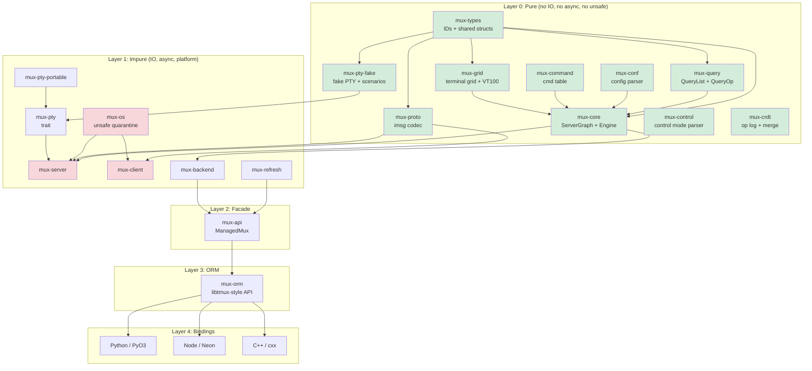

# TermForge v7 Architecture Specification (Pass 2 Synthesis)

> **Status:** v7 Pass 2 -- Cross-model synthesis of Claude v7 Pass 1 and GPT v7 Pass 1, with all citations verified against actual source.
>
> **Lineage:** v4 (6-model, 2519 lines) -> v5 (3-model, 1573 lines) -> v6 (3-pass synthesis, 5239 lines) -> v7 Pass 1 (Claude + GPT + Gemini independent refinements) -> **v7 Pass 2** (this document).
>
> **New in v7 Pass 2:** (1) Cross-model verification resolved all divergences between Claude/GPT/Gemini Pass 1 outputs. (2) All PyO3 API calls verified as `Python::detach` (PyO3 0.26+, confirmed at `pyo3/src/marker.rs:558` and `guide/src/migration.md:311`). (3) Neon API verified: `FunctionContext`, `Channel` (`event/channel.rs:92`), `#[neon::main]` (`lib.rs:42-52`). (4) OTEL SDK types verified: `SdkTracerProvider` (`provider.rs:158`), `BatchSpanProcessor` (`span_processor.rs:284`, queue 2048, delay 5000ms), `SamplingDecision` (`sampler.rs:24`), `SpanExporter` (`export.rs:17`). (5) All 25+ tmux citations re-verified against actual source. (6) Sections 16, 19, 20, 22, 26 expanded with best-of-breed content from both Pass 1 outputs.

License: MIT OR Apache-2.0
Rust edition: 2024 (MSRV 1.85)
Protocol target: tmux protocol v8

---

## Preamble

This document is the single authoritative architectural reference for TermForge, a Rust terminal multiplexer with 100% tmux wire-protocol compatibility, ORM-like API, language bindings, CRDT collaboration, and a ratatui-based TUI client.

**Repository locations:**
- tmux C source: `~/study/c/tmux/` (behavioral reference)
- Rust prototype: `~/work/rust/vibe-tmux/` (existing crate structure)
- Python libtmux: `~/work/python/libtmux/` (API design reference)
- ratatui: `~/study/rust/ratatui/` (TUI framework)
- zellij: `~/study/rust/zellij/` (multiplexer reference)
- PyO3: `~/study/rust-python/pyo3/` (Python binding framework)
- Neon: `~/study/rust-node/neon/` (Node.js binding framework)
- OTEL Rust SDK: `~/study/otel/opentelemetry-rust/` (telemetry SDK)

**Settled decisions (not re-argued):**

| # | Decision | Rationale |
|---|---|---|
| S1 | New multiplexer, tmux-compatible | Architectural freedom with wire compatibility. Not a C-to-Rust port. |
| S2 | Protocol version 8 | Wire-compatible with tmux protocol v8 (`tmux-protocol.h:23`). |
| S3 | SlotMap entity IDs | `slotmap::new_key_type!` for all entity IDs (Session, Window, Pane, Client, Job, Buffer). |
| S4 | Flat arena LayoutTree | `Vec<LayoutCell>` with index-based parent/children. Not recursive nesting. |
| S5 | Round-robin resize | One cell at a time, matching `layout.c:448-462`. Not proportional. |
| S6 | flock locking | `flock(LOCK_EX|LOCK_NB)` per `client.c:77-101`. Not PID-based. |
| S7 | Config after identify | Load config only after first client completes identify burst (`server-client.c:3725-3734`). |
| S8 | Protocol violation kills connection | Matching `server-client.c:3472-3475`. Never drop and continue. |
| S9 | Custom VT100 parser | Match tmux's `input.c` state table exactly. Do not use the `vte` crate. |
| S10 | Option FALLTHROUGH | WindowPane falls through to Window scope, matching `options.c:891-903`. |
| S11 | Vec-inside-entity for parent-child | Not SecondaryMap. Reverse lookups computed during snapshot construction. |
| S12 | WASM compilability as CI purity gate | Not production target. `cargo check --target wasm32-unknown-unknown`. |
| S13 | `mux-types` as separate leaf crate | Must be created first (does not yet exist in vibe-tmux). |
| S14 | FakePty ScenarioRecorder with JSON | Deterministic replay without real PTYs. |
| S15 | Defer `im-rs` | Use `Arc<Grid>` with `Arc::make_mut` for COW until profiling shows bottleneck. |

---

## Table of Contents

1. [Vision and Philosophy](#1-vision-and-philosophy)
2. [North Star Acceptance Criteria](#2-north-star-acceptance-criteria)
3. [High-Level Architecture](#3-high-level-architecture)
4. [Workspace Layout](#4-workspace-layout)
5. [Layering Contract](#5-layering-contract)
6. [Entity Model](#6-entity-model)
7. [Event/Effect Engine](#7-eventeffect-engine)
8. [Error Handling](#8-error-handling)
9. [Protocol Codec](#9-protocol-codec)
10. [Configuration System](#10-configuration-system)
11. [Layout Engine](#11-layout-engine)
12. [ORM-like Query API](#12-orm-like-query-api)
13. [Runtime Architecture](#13-runtime-architecture)
14. [Server Lifecycle](#14-server-lifecycle)
15. [Control Mode](#15-control-mode)
16. [Language Bindings](#16-language-bindings)
17. [CRDT Transaction Layer](#17-crdt-transaction-layer)
18. [Security Model](#18-security-model)
19. [OpenTelemetry](#19-opentelemetry)
20. [tmux Version Management](#20-tmux-version-management)
21. [Test Support and Fake PTY](#21-test-support-and-fake-pty)
22. [Binding Test Frameworks](#22-binding-test-frameworks)
23. [Test Framework and Harness Design](#23-test-framework-and-harness-design)
24. [Performance Targets](#24-performance-targets)
25. [Visual Client / TUI](#25-visual-client--tui)
26. [AGENTS.md Rules](#26-agentsmd-rules)
27. [Risks and Mitigations](#27-risks-and-mitigations)
28. [Summary and Changelog](#28-summary-and-changelog)
29. [Reference Anchors](#29-reference-anchors)
30. [Appendix: Canonical Type Quick Reference](#30-appendix-canonical-type-quick-reference)
31. [Supplemental Test Matrix](#31-supplemental-test-matrix)

---

## 1. Vision and Philosophy

### 1.1 Core Thesis

TermForge is a **new terminal multiplexer** written in Rust that is **wire-compatible** with tmux protocol v8. It is not a port of tmux's C code. It uses tmux as a behavioral reference while building a clean, layered Rust architecture from scratch.

The internal architecture is Rust-native: algebraic types, ownership-tracked state, pure-functional kernel, and async runtime -- while maintaining bit-for-bit compatibility with the tmux wire format.

### 1.2 Design Principles

1. **Pure/Impure Separation (Sans-IO).** The kernel (`mux-core`) is a pure `fn(graph, event) -> (graph, effects)` reducer. It never touches file descriptors, system calls, timers, or network. All IO happens in the runtime layer that interprets `Effect` variants.

2. **tmux is a Compatibility Profile, Not the Architecture.** tmux's `struct session`, `struct window`, `struct window_pane` inform our entity model but do not dictate it. Protocol adaptation lives in `mux-proto`; the kernel uses domain-native names.

3. **Snapshots are the Read Path.** The authoritative state lives in the `ServerGraph`. Readers (UI, bindings, query API) see immutable snapshots published via `ArcSwap`. Writers go through the event/effect engine. This eliminates read contention.

4. **ORM is a Facade, Not the Engine.** `mux-orm` translates user intent into commands/events. It never implements multiplexer logic. It must not become a second business-logic engine.

5. **Layered Testing.** Every layer has its own test strategy. Pure core uses property testing and snapshot testing. Protocol uses fixture-driven roundtrip tests. Runtime uses hermetic servers with fake PTYs.

6. **WASM as Purity Proof.** Layer 0 crates compile to `wasm32-unknown-unknown` as a CI gate, not a production deployment target. This catches accidental OS dependencies.

7. **Language Bindings as First-Class Citizens.** Python (PyO3), Node (Neon), and C++ (cxx) bindings expose the same ORM API, with snapshot testing support in pytest and vitest.

8. **Observability Built In.** OpenTelemetry tracing from server to client to language bindings, using the `tracing` crate in pure code and OTEL SDK exporters at the runtime boundary.

9. **CRDT-Ready State Model.** The entity graph supports conflict-free replication for distributed/federated scenarios.

### 1.3 Why Not a Direct Port

| Direct Port | TermForge |
|---|---|
| Platform code in the kernel | Platform code quarantined in `mux-os` |
| RB-tree state with manual memory | SlotMap with generation-checked IDs |
| Libevent callback soup | Structured async with tokio tasks |
| CRDTs require invasive surgery | CRDTs compose on top of pure events |
| Testing requires real PTY | Fake PTY backend for deterministic tests |

### 1.4 What TermForge Is Not

- Not a port of tmux C code to Rust.
- Not a wrapper around tmux (like libtmux). It is a standalone server.
- Not limited to tmux's feature set. The architecture supports extensions (CRDT sync, rich TUI, programmatic control) that tmux cannot.

---

## 2. North Star Acceptance Criteria

### 2.1 Compatibility (C)

| ID | Criterion | Verification |
|---|---|---|
| C1 | A stock tmux 3.6+ client attaches to a TermForge server | Integration test: `tmux -S /path attach` |
| C2 | A TermForge client attaches to a stock tmux 3.6+ server | Integration test: `termforge attach -S /path` |
| C3 | Protocol v8 imsg framing roundtrips all 35+ `MsgType` variants | `proptest` with arbitrary payloads |
| C4 | Identify burst (types 100-112) roundtrips byte-exact | Fixture captures from real tmux |
| C5 | SCM_RIGHTS fd passing preserved through sniff proxy | `tmux-sniff` passthrough test |
| C6 | All 200+ tmux commands parse and execute | `tmux-command-audit` tool with coverage report |
| C7 | Format string expansion matches tmux for 200+ variables | `format-audit` parity corpus |
| C8 | Default key bindings match tmux across all 4 key tables | Key table parity tests generated from `key-bindings.c` |

### 2.2 Architectural (A)

| ID | Criterion | Enforcement |
|---|---|---|
| A1 | Layer 0 crates: zero `unsafe`, zero `tokio`, zero `libc` | `#![forbid(unsafe_code)]` in crate root |
| A2 | Layer 0 compiles to `wasm32-unknown-unknown` | CI: `cargo check --target wasm32-unknown-unknown` |
| A3 | `mux-os` is the sole `unsafe` quarantine | CI lint: grep for `unsafe` outside `mux-os` |
| A4 | All state transitions are deterministic | Property: `apply_event(s, e)` is referentially transparent |
| A5 | No panics in protocol decode/encode paths | `#[deny(clippy::unwrap_used)]` in hot crates |
| A6 | Bindings depend only on `mux-api`/`mux-orm` | Cargo dependency check in CI |
| A7 | No `Arc<Mutex<_>>` in the read path | `ArcSwap`-based `StateHandle` |

### 2.3 Product (P)

| ID | Criterion |
|---|---|
| P1 | In-process embedding: create session, split, send keys, read grid -- no process spawning |
| P2 | Python pytest fixture: `server` -> `session` -> `window` -> `pane` in 4 lines |
| P3 | Snapshot test: feed VT100 input, assert grid state via `insta` |
| P4 | CRDT: two servers merge concurrent `new-session` without conflict |
| P5 | TUI client attaches to real tmux server and renders correctly |
| P6 | FakePty scenario replay produces identical grid state to real tmux |

### 2.4 Performance (B)

| ID | Target | Basis |
|---|---|---|
| B1 | VT100 parser, plain ASCII > 300 MB/s | alacritty vte achieves ~500 MB/s |
| B2 | VT100 parser, CSI heavy > 100 MB/s | Parameter parsing overhead |
| B3 | Protocol frame decode > 500 MB/s | 16-byte header + memcpy |
| B4 | Layout resize (20 panes) < 50 us | Tree walk ~60 nodes, no alloc |
| B5 | Graph snapshot < 1 ms | Arc clone + BTreeMap for 50 panes |
| B6 | Option resolve (4-level chain) < 100 ns | 4 BTreeMap lookups |
| B7 | Control notification parse < 200 ns | String split + parse |
| B8 | Format expand (status line) < 50 us | ~10 variable lookups |
| B9 | Config parse (500 lines) < 5 ms | Lexer + parser |

These are conservative targets to be validated after establishing baselines from 3 consecutive median runs. CI regression gate: 130% threshold on nightly only.

### 2.5 Ecosystem (E)

| ID | Criterion | Verification |
|---|---|---|
| E1 | Python bindings: `pip install termforge` | maturin build + PyPI publish |
| E2 | Node bindings: `npm install termforge` | Neon build + npm publish |
| E3 | pytest fixture chain: server -> session -> window -> pane | pytest plugin with hermetic server |
| E4 | vitest fixture chain: same pattern in TypeScript | vitest setup with hermetic server |
| E5 | Snapshot testing from Python/Node against PTY output | `insta`-compatible snapshots via bindings |

---

## 3. High-Level Architecture

### 3.1 The Layer Cake

```
Layer 0  PURE KERNEL     mux-types, mux-core, mux-query, mux-conf,
                          mux-command, mux-grid, mux-control, mux-pty-fake
                          mux-crdt, mux-proto

Layer 1  IMPURE RUNTIME  mux-os, mux-pty, mux-pty-portable, mux-client,
                          mux-server, mux-refresh, mux-backend

Layer 2  FACADE           mux-api (ManagedMux, SocketActor, intents)

Layer 3  ORM              mux-orm (libtmux-style graph + QueryList sugar)

Layer 4  BINDINGS         bindings/python (PyO3), bindings/node (Neon),
                          crates/mux-cxx (cxx bridge)

Layer 5  TOOLS            tmux-sniff, tmux-vm, tmux-builder, tmux-worktrees,
                          mux-tui, mux-doctor, format-audit, regress-audit,
                          tmux-command-audit, mux-regress
```

### 3.2 Dependency Direction

Dependencies flow strictly inward:
- Layer 2 depends on Layer 1 and Layer 0.
- Layer 1 depends on Layer 0.
- Layer 0 depends on nothing outside the workspace except leaf crates (`slotmap`, `smallvec`, `thiserror`, `serde`, `tracing`).
- Bindings depend on `mux-orm` -> `mux-api` -> `mux-core`. Never on runtime internals.

### 3.3 State Ownership

The `ServerGraph` in `mux-core` is the single source of truth. All state mutations flow through `apply_event()`. The runtime publishes immutable snapshots via `ArcSwap` for lock-free reads by the TUI, bindings, and API layer.

### 3.4 Mermaid Diagram



---

## 4. Workspace Layout

### Monorepo Structure

```
termforge/
  Cargo.toml                     # [workspace]
  crates/
    -- LAYER 0: PURE (no IO, no async, no unsafe, WASM-compatible) --
    mux-types/                   # Shared types: IDs, sizes, enums
      src/
        lib.rs
        ids.rs                   # SlotMap key types
        size.rs                  # PaneSize, Rect, SplitDirection
        error_class.rs           # ErrorClass enum + Classified trait
    mux-core/                    # ServerGraph, Event, Effect, Engine
      src/
        lib.rs
        graph.rs                 # ServerGraph + GraphState snapshots
        engine.rs                # apply_event() -> ApplyOutcome
        event.rs                 # Event enum
        effect.rs                # Effect enum
        session.rs               # Session struct
        window.rs                # Window struct
        pane.rs                  # Pane struct (owns Arc<Grid>)
        client.rs                # Client struct
        buffer.rs                # Paste Buffer struct
        layout.rs                # LayoutTree, LayoutCell, resize, checksum
        options.rs               # OptionStore, scope resolution, unset
        key_table.rs             # KeyTableSet, KeyBinding, KeyTable
        copy_mode.rs             # CopyModeState, actions, pure reducer
        format.rs                # Format string expander
    mux-grid/                    # Terminal grid + VT100 parser
      src/
        lib.rs
        grid.rs                  # Grid struct + cell storage
        cell.rs                  # Cell, CellStyle, wide-char handling
        parser.rs                # VT100 Parser (17 states, pure)
        csi.rs                   # CSI command handlers
        osc.rs                   # OSC string handlers
    mux-query/                   # QueryList + filtering
      src/
        lib.rs
        ops.rs                   # QueryOp enum
        value.rs                 # QueryValue
        spec.rs                  # QuerySpec, QueryTerm
        list.rs                  # QueryList<T: Queryable>
    mux-conf/                    # tmux.conf parser (PURE -- no file IO)
      src/
        lib.rs
        ast.rs                   # Config AST nodes
        lexer.rs                 # Tokenizer
        parser.rs                # Config file parser
        options.rs               # Option table + defaults
    mux-command/                 # Command table + dispatch
      src/
        lib.rs
        table.rs                 # Command table (from tmux cmd.c)
    mux-control/                 # Control mode parser (%output, %begin, etc.)
      src/
        lib.rs
        notification.rs          # ControlNotification enum (typed)
        parser.rs                # %%notification line parser
    mux-proto/                   # imsg framing + MsgType + payload parsers
      src/
        lib.rs
        frame.rs                 # ImsgHdr (16-byte header)
        msg.rs                   # MsgType enum (35+ variants)
        codec.rs                 # ImsgCodec (two-phase decode)
        payload.rs               # Typed payload structs
        identify.rs              # IdentifyBurst builder
        fixture.rs               # Capture file loading
        error.rs                 # ProtocolError
    mux-crdt/                    # CrdtOp, HLC, DVV, merge semantics
      src/
        lib.rs
        op.rs                    # CrdtOp enum
        clock.rs                 # HybridLogicalClock + HlcTimestamp
        dvv.rs                   # Dotted version vectors
        register.rs              # LwwRegister<T>
        set.rs                   # OrSet<T>
        oplog.rs                 # OpLog + compaction
        merge.rs                 # Merge resolution
    mux-pty/                     # PtyBackend trait (pure interface)
      src/lib.rs
    mux-pty-fake/                # FakePty + ScenarioRecorder/Replayer (PURE)
      src/
        lib.rs
        scenario.rs              # PtyScenario, ScenarioEvent
        recorder.rs              # ScenarioRecorder<B: PtyBackend>
        replayer.rs              # ScenarioReplayer

    -- LAYER 1: IMPURE (IO, async, platform) --
    mux-os/                      # unsafe quarantine: SCM_RIGHTS, signals
      SAFETY.md
      src/
        lib.rs
        pty.rs                   # PTY creation + management
        scm_rights.rs            # SCM_RIGHTS FD passing
        socket.rs                # Unix socket creation
        signal.rs                # Signal handling
        fd.rs                    # FD lifecycle + close-on-drop
        lock.rs                  # LockFile (flock-based)
    mux-pty-portable/            # portable-pty based backend
    mux-server/                  # tokio runtime, socket accept loop
    mux-client/                  # client connection, control mode
    mux-backend/                 # Backend trait: Local + Tmux
    mux-refresh/                 # StateStore + ArcSwap + RefreshPlanner
    mux-test-support/            # TmuxTestServer, PathGuard, hermetic isolation
    mux-view/                    # Immutable view types for snapshots
    mux-telemetry/               # tracing span context + OTEL

    -- LAYER 2: FACADE --
    mux-api/                     # ManagedMux, MuxBackend, intent API

    -- LAYER 3: ORM --
    mux-orm/                     # libtmux-style graph traversal + QueryList
      src/
        lib.rs
        server.rs                # OrmServer
        session.rs               # OrmSession
        window.rs                # OrmWindow
        pane.rs                  # OrmPane

    -- SUPPORT --
    mux-cxx/                     # cxx bridge

  tools/
    tmux-sniff/                  # Protocol sniffer (preserves SCM_RIGHTS)
    tmux-vm/                     # tmux version manager (ensure/exec)
    tmux-builder/                # Build tmux from source
    tmux-worktrees/              # Git worktree manager for tmux source
    tmux-command-audit/          # Command coverage tracker
    format-audit/                # Format variable alignment checker
    regress-audit/               # Run tmux regress suite
    mux-regress/                 # Parity harness (both servers)
    mux-tui/                     # Rust-native TUI client
    mux-doctor/                  # Diagnostic tool

  bindings/
    python/
      Cargo.toml
      pyproject.toml             # maturin + uv
      src/lib.rs
      python/termforge/
        __init__.py
        _native.pyi
        pytest_plugin.py         # hermetic pytest fixtures
      tests/
        conftest.py
        test_server.py
        test_query.py
    node/
      Cargo.toml
      package.json               # pnpm
      src/lib.rs
      __test__/
        server.spec.ts           # vitest tests
      vitest.config.ts

  fixtures/
    captures/                    # Binary protocol captures from real tmux
    grids/                       # Terminal grid snapshots for insta
    configs/                     # tmux.conf samples
    scenarios/                   # FakePty scenario recordings (JSON)

  fuzz/
    decode_frame.rs              # Protocol decoder fuzz target
    parse_vt100.rs               # VT100 parser fuzz target
    parse_format.rs              # Format string parser fuzz target
```

### Purity Classification

| Crate | Pure | Async | Unsafe | WASM CI |
|---|---|---|---|---|
| mux-types | Yes | No | No | Yes |
| mux-core | Yes | No | No | Yes |
| mux-grid | Yes | No | No | Yes |
| mux-query | Yes | No | No | Yes |
| mux-conf | Yes | No | No | Yes |
| mux-command | Yes | No | No | Yes |
| mux-proto | Yes | No | No | Yes |
| mux-control | Yes | No | No | Yes |
| mux-pty-fake | Yes | No | No | Yes |
| mux-crdt | Yes | No | No | Yes |
| mux-pty | Trait only | No | No | No |
| mux-os | No | No | **Yes** | No |
| mux-server | No | Yes | No | No |
| mux-client | No | Yes | No | No |
| mux-backend | No | Yes | No | No |
| mux-refresh | No | Yes | No | No |
| mux-api | No | Yes | No | No |
| mux-orm | No | Yes | No | No |

---

## 5. Layering Contract

### Hard Boundaries

**Boundary A -- Core is Deterministic:**

The core never asks the operating system for anything. No `SystemTime::now()`, no `std::fs`, no `rand()`, no `std::thread`. If the core needs a timestamp, it receives one via an `Event` variant. If it needs randomness, it receives a seed via `CoreCtx`.

```rust
// WRONG -- core asking the OS
pub fn create_session(graph: &mut ServerGraph) -> SessionId {
    let name = format!("session-{}", SystemTime::now().elapsed().unwrap().as_secs());
    graph.create_session(name)
}

// RIGHT -- core receiving information via events
pub fn apply_event(graph: &mut ServerGraph, event: Event, ctx: &CoreCtx) -> ApplyOutcome {
    match event {
        Event::CreateSession { name, created_at } => {
            let id = graph.create_session(name);
            ApplyOutcome { created_session: Some(id), ..Default::default() }
        }
        // ...
    }
}
```

**Boundary B -- Snapshots are the Read Path:**

The `ServerGraph` is mutated only through `apply_event()`. After mutation, the runtime publishes a `GraphState` snapshot through `ArcSwap`. All readers read from the snapshot, never from the mutable graph.

```rust
// crates/mux-refresh/src/lib.rs
pub struct StateStore<T> {
    inner: Arc<ArcSwap<T>>,
}

pub struct StateHandle<T> {
    inner: Arc<ArcSwap<T>>,
}

impl<T> StateHandle<T> {
    /// Lock-free read via ArcSwap::load()
    pub fn with_read<R>(&self, f: impl FnOnce(&T) -> R) -> R {
        let guard = self.inner.load();
        f(&guard)
    }
}
```

**Boundary C -- tmux Compatibility is an Adapter:**

The core uses domain-native names. tmux protocol specifics (`MsgType::IdentifyFlags`, imsg framing) live entirely in `mux-proto`. The server runtime translates between the two:

```rust
// mux-server: translates protocol frame -> core event
fn translate_command(frame: &ImsgFrame) -> Result<Event, ProtocolError> {
    let args = parse_command_args(&frame.payload)?;
    Ok(Event::Command { name: args[0].clone(), args: args[1..].to_vec() })
}
```

**Boundary D -- ORM API is a Facade:**

The ORM translates intent into commands. It never implements window splitting, session creation, or layout algorithms.

### Enforcement

| Rule | Mechanism |
|---|---|
| Pure crates: no `tokio`, `async`, `unsafe` | `#![forbid(unsafe_code)]` + CI WASM check |
| One-way deps: bindings -> orm -> api -> backend -> core | `cargo deny check` |
| No `Arc<Mutex>` on read path | Code review + clippy config |
| No panics in protocol/server | `#[deny(clippy::unwrap_used, clippy::expect_used)]` |
| `unsafe` only in `mux-os` | CI: `grep -r "unsafe" --include="*.rs" crates/ \| grep -v mux-os` |

---

## 6. Entity Model

### 6.1 Typed ID Declarations (mux-types)

```rust
// crates/mux-types/src/ids.rs
use slotmap::new_key_type;

new_key_type! {
    /// Unique identifier for a session within the server.
    /// Generation-checked: stale IDs safely return None on lookup.
    pub struct SessionId;
    pub struct WindowId;
    pub struct PaneId;
    pub struct ClientId;
    pub struct JobId;
    pub struct BufferId;
}
```

```rust
// crates/mux-types/src/size.rs
#[derive(Debug, Clone, Copy, PartialEq, Eq, Hash)]
pub struct PaneSize {
    pub cols: u16,
    pub rows: u16,
}

impl PaneSize {
    pub const DEFAULT: Self = Self { cols: 80, rows: 24 };
}

#[derive(Debug, Clone, Copy, PartialEq, Eq)]
pub struct Rect {
    pub x: u16,
    pub y: u16,
    pub width: u16,
    pub height: u16,
}

#[derive(Debug, Clone, Copy, PartialEq, Eq)]
pub enum SplitDirection {
    Horizontal,
    Vertical,
}
```

### 6.2 Entity Structs (mux-core)

**Decision (settled): Vec inside entities for parent-child relationships.** Reverse lookups computed during snapshot construction. This matches the proven vibe-tmux code at `~/work/rust/vibe-tmux/crates/mux-core/src/graph.rs` where `session.windows: Vec<WindowId>` and reverse maps are built in `graph_state()` at lines 218-229.

```rust
/// crates/mux-core/src/session.rs
#[derive(Debug, Clone)]
pub struct Session {
    pub name: String,
    pub cwd: String,
    pub windows: Vec<WindowId>,           // ordered child list (forward only)
    pub active_window: Option<WindowId>,
    pub last_window: Option<WindowId>,
    pub created_at: i64,                  // injected via Event, not from OS
    pub last_attached_at: i64,
    pub destroying: bool,
    pub options: SessionOptions,
    pub environ: EnvironMap,
}

/// crates/mux-core/src/window.rs
#[derive(Debug, Clone)]
pub struct Window {
    pub name: String,
    pub panes: Vec<PaneId>,              // ordered child list (forward only)
    pub active_pane: Option<PaneId>,
    pub last_active_pane: Option<PaneId>,
    pub layout_root: LayoutTree,
    pub size: WindowSize,
    pub flags: WindowFlags,
    pub options: WindowOptions,
}

/// crates/mux-core/src/pane.rs
#[derive(Debug, Clone)]
pub struct Pane {
    pub size: PaneSize,
    pub bounds: Option<Rect>,
    pub exited: bool,
    pub exit_status: Option<i32>,
    pub start_command: String,
    pub start_path: String,
    pub mode: PaneMode,
    pub title: String,
    pub grid: Arc<Grid>,                 // shared; copy-on-write via Arc::make_mut
    pub parser: Parser,                  // VT100 state machine
    pub copy_mode: Option<CopyModeState>,
}

#[derive(Debug, Clone, Copy, PartialEq, Eq)]
pub enum PaneMode {
    Normal,
    CopyMode,
    ViewMode,
}

/// crates/mux-core/src/client.rs
#[derive(Debug, Clone)]
pub struct Client {
    pub name: String,
    pub session: Option<SessionId>,
    pub last_session: Option<SessionId>,
    pub tty_name: String,
    pub term_type: String,
    pub features: u32,
    pub flags: ClientFlags,
    pub size: PaneSize,
    pub key_state: ClientKeyState,       // key table dispatch state
}

/// crates/mux-core/src/buffer.rs
#[derive(Debug, Clone)]
pub struct Buffer {
    pub name: String,
    pub data: Vec<u8>,
    pub created_at: i64,
}
```

### 6.3 The ServerGraph

```rust
// crates/mux-core/src/graph.rs
use slotmap::SlotMap;

#[derive(Debug, Default, Clone)]
pub struct ServerGraph {
    sessions: SlotMap<SessionId, Session>,
    windows:  SlotMap<WindowId, Window>,
    panes:    SlotMap<PaneId, Pane>,
    clients:  SlotMap<ClientId, Client>,
    jobs:     SlotMap<JobId, Job>,
    buffers:  SlotMap<BufferId, Buffer>,
    key_tables: KeyTableSet,
    global_options: GlobalOptions,
    global_session_options: SessionOptions,
    global_window_options: WindowOptions,
    global_environ: EnvironMap,
}

impl ServerGraph {
    pub fn new() -> Self { Self::default() }

    // --- Creation ---
    pub fn create_session(&mut self, name: impl Into<String>) -> SessionId;
    pub fn create_window(&mut self, name: impl Into<String>) -> WindowId;
    pub fn create_pane(&mut self, size: PaneSize) -> PaneId;
    pub fn create_client(&mut self, name: impl Into<String>) -> ClientId;
    pub fn create_buffer(&mut self, name: impl Into<String>, data: Vec<u8>) -> BufferId;

    // --- Lookup (O(1), generation-checked) ---
    pub fn session(&self, id: SessionId) -> Option<&Session>;
    pub fn session_mut(&mut self, id: SessionId) -> Option<&mut Session>;
    pub fn window(&self, id: WindowId) -> Option<&Window>;
    pub fn window_mut(&mut self, id: WindowId) -> Option<&mut Window>;
    pub fn pane(&self, id: PaneId) -> Option<&Pane>;
    pub fn pane_mut(&mut self, id: PaneId) -> Option<&mut Pane>;
    pub fn client(&self, id: ClientId) -> Option<&Client>;
    pub fn client_mut(&mut self, id: ClientId) -> Option<&mut Client>;

    // --- Relationship management ---
    pub fn add_window_to_session(&mut self, session: SessionId, window: WindowId) -> bool;
    pub fn add_pane_to_window(&mut self, window: WindowId, pane: PaneId) -> bool;
    pub fn attach_client(&mut self, client: ClientId, session: SessionId) -> bool;
    pub fn panes_in_window(&self, window: WindowId) -> Vec<PaneId>;

    // --- Context resolution ---
    pub fn client_context(&self, client: ClientId) -> ClientContext;

    // --- Snapshot (reverse lookups computed here) ---
    /// Build an immutable GraphState with reverse lookups.
    /// Reference: ~/work/rust/vibe-tmux/crates/mux-core/src/graph.rs:217-229
    pub fn graph_state(&self) -> GraphState {
        let mut window_to_session = HashMap::new();
        for (session_id, session) in &self.sessions {
            for window_id in &session.windows {
                window_to_session.insert(*window_id, session_id);
            }
        }
        let mut pane_to_window = HashMap::new();
        for (window_id, window) in &self.windows {
            for pane_id in &window.panes {
                pane_to_window.insert(*pane_id, window_id);
            }
        }
        // ... build GraphState with reverse lookups included
        todo!()
    }
}
```

### 6.4 Relationship Model

```
Server (implicit singleton)
  |-- sessions: SlotMap<SessionId, Session>
  |     |-- windows: Vec<WindowId>  (ordered, forward-only)
  |     |-- active_window: Option<WindowId>
  |     |-- last_window: Option<WindowId>
  |
  |-- windows: SlotMap<WindowId, Window>
  |     |-- panes: Vec<PaneId>  (ordered, forward-only)
  |     |-- active_pane: Option<PaneId>
  |     |-- layout_root: LayoutTree
  |
  |-- panes: SlotMap<PaneId, Pane>
  |     |-- grid: Arc<Grid>  (terminal state, COW for snapshots)
  |     |-- parser: Parser  (VT100 state machine)
  |     |-- copy_mode: Option<CopyModeState>
  |
  |-- clients: SlotMap<ClientId, Client>
  |     |-- session: Option<SessionId>  (attached session)
  |     |-- key_state: ClientKeyState  (key table stack)
  |
  |-- key_tables: KeyTableSet  (prefix, root, copy-mode, copy-mode-vi)
  |-- buffers: SlotMap<BufferId, Buffer>  (paste buffers)
  |-- jobs: SlotMap<JobId, Job>
```

### 6.5 Entity Model Test Strategy

1. **SlotMap generation safety:** Create entity, remove it, verify old ID returns `None`.
2. **Relationship integrity:** Add window to session, verify `session.windows` contains it.
3. **Snapshot reverse lookups:** Create session/window/pane chain, build `graph_state()`, verify `pane_to_window` and `window_to_session` maps.
4. **Property test:** Random create/remove sequences never panic, all IDs resolve or return `None`.
5. **Clone isolation:** Clone graph, mutate clone, verify original unchanged.
6. **Concurrent snapshot:** Publish snapshot, modify graph, verify snapshot still reads old state.

---

## 7. Event/Effect Engine

### Core Signature

```rust
/// crates/mux-core/src/engine.rs
///
/// Apply an event to the graph, returning effects for the runtime to execute.
/// This is the heart of the Sans-IO architecture:
/// - Pure: no IO, no async, no randomness
/// - Deterministic: same (graph, event, ctx) always produces same (graph', effects)
/// - Total: every Event variant is handled
pub fn apply_event(
    graph: &mut ServerGraph,
    event: Event,
    ctx: &CoreCtx,
) -> ApplyOutcome {
    match event {
        Event::CreateSession { .. } => { /* ... */ }
        Event::Key { .. } => { /* key dispatch via key tables */ }
        Event::CopyModeAction { pane_id, action } => {
            apply_copy_mode_event(graph, pane_id, action)
        }
        Event::PaneOutput { pane_id, data } => {
            apply_pane_output(graph, pane_id, &data)
        }
        // ... exhaustive match
    }
}

/// Determinism controls: explicit injection for time and randomness.
#[derive(Clone, Copy, Debug)]
pub struct CoreCtx {
    pub now_ms: u64,
    pub rand_u64: u64,
}

#[derive(Debug, Default, Clone)]
pub struct ApplyOutcome {
    pub effects: Vec<Effect>,
    pub created_session: Option<SessionId>,
    pub created_window: Option<WindowId>,
    pub created_pane: Option<PaneId>,
    pub error: Option<CoreError>,
}

impl ApplyOutcome {
    pub fn with_effects(effects: Vec<Effect>) -> Self {
        Self { effects, ..Default::default() }
    }
}
```

### Event Enum

```rust
/// crates/mux-core/src/event.rs
#[derive(Debug, Clone)]
#[non_exhaustive]
pub enum Event {
    // === Lifecycle ===
    CreateSession { name: String, cwd: Option<String>, created_at: i64 },
    DestroySession { session_id: SessionId },
    CreateWindow { session_id: SessionId, name: String },
    DestroyWindow { window_id: WindowId },
    CreatePane { window_id: WindowId, size: PaneSize, command: Vec<String>,
                 cwd: Option<String> },
    DestroyPane { pane_id: PaneId },

    // === Navigation ===
    SelectWindow { session_id: SessionId, window_id: WindowId },
    SelectWindowByIndex { session_id: SessionId, index: usize },
    NextWindow { session_id: SessionId },
    PreviousWindow { session_id: SessionId },
    SelectLastWindow { session_id: SessionId },
    SelectPane { window_id: WindowId, pane_id: PaneId },
    SelectNextPane { window_id: WindowId },
    SelectPrevPane { window_id: WindowId },
    SelectLastPane { window_id: WindowId },

    // === Mutation ===
    RenameSession { session_id: SessionId, name: String },
    RenameWindow { window_id: WindowId, name: String },
    ResizePane { pane_id: PaneId, size: PaneSize },
    SplitWindow { window_id: WindowId, direction: SplitDirection, size: PaneSize,
                  command: Vec<String>, cwd: Option<String> },

    // === Client ===
    ClientAttach { client_id: ClientId, session_id: SessionId },
    ClientDetach { client_id: ClientId },
    ClientResize { client_id: ClientId, size: PaneSize },

    // === IO Responses (runtime -> core) ===
    PaneExited { pane_id: PaneId, exit_status: i32 },
    PaneOutput { pane_id: PaneId, data: Vec<u8> },
    JobExited { job_id: JobId, exit_status: i32 },

    // === Input ===
    Key { client_id: ClientId, key: KeyCode },
    Command { name: String, args: Vec<String>, client_id: Option<ClientId> },

    // === Copy Mode ===
    EnterCopyMode { pane_id: PaneId, view_mode: bool },
    CopyModeAction { pane_id: PaneId, action: CopyModeAction },

    // === Options ===
    SetOption { scope: OptionScope, key: String, value: OptionValue },

    // === Paste Buffers ===
    SetBuffer { name: String, data: Vec<u8> },
    PasteBuffer { pane_id: PaneId, buffer_name: Option<String> },

    // === Effect Failure Feedback (runtime -> core) ===
    EffectFailed { token: EffectToken, reason: String },

    // === Time (injected by runtime) ===
    Tick { now_millis: i64 },
}
```

### Effect Enum

```rust
/// crates/mux-core/src/effect.rs
#[derive(Debug, Clone)]
#[non_exhaustive]
pub enum Effect {
    // === PTY ===
    SpawnPane { pane_id: PaneId, command: Vec<String>, cwd: Option<String>,
                size: PaneSize },
    KillPane { pane_id: PaneId, signal: i32 },
    WritePane { pane_id: PaneId, data: Vec<u8> },
    ResizePty { pane_id: PaneId, size: PaneSize },

    // === Display ===
    Redraw { scope: RedrawScope },

    // === Client ===
    NotifyClient { client_id: ClientId, message: String },
    SendToClient { client_id: ClientId, frame: FrameData },
    DisconnectClient { client_id: ClientId },
    ErrorReply { client_id: ClientId, message: String },

    // === Timers ===
    StartTimer { token: TimerToken, after_ms: u64 },
    CancelTimer { token: TimerToken },

    // === Job ===
    StartJob { job_id: JobId, command: Vec<String> },
    StopJob { job_id: JobId },

    // === Server ===
    Shutdown,
    PublishSnapshot,
    Log { level: LogLevel, message: String },
}

#[derive(Debug, Clone)]
pub enum RedrawScope {
    All,
    Session(SessionId),
    Window(WindowId),
    Pane(PaneId),
    StatusLine,
}
```

### PaneOutput Handling (VT100 -> Grid)

```rust
fn apply_pane_output(graph: &mut ServerGraph, pane_id: PaneId, data: &[u8]) -> ApplyOutcome {
    let Some(pane) = graph.pane_mut(pane_id) else {
        return ApplyOutcome::default();
    };

    // Get a mutable reference to the grid (Arc::make_mut for COW)
    let grid = Arc::make_mut(&mut pane.grid);

    // Parse VT100 sequences and update the grid (pure)
    let parser_effects = pane.parser.parse(data, grid);

    // Convert parser effects to engine effects
    let mut effects = vec![Effect::Redraw { scope: RedrawScope::Pane(pane_id) }];
    for pe in parser_effects {
        match pe {
            ParserEffect::Reply(bytes) => {
                effects.push(Effect::WritePane { pane_id, data: bytes });
            }
            ParserEffect::TitleChanged(title) => {
                pane.title = title;
                effects.push(Effect::Redraw { scope: RedrawScope::StatusLine });
            }
            ParserEffect::Bell => {
                effects.push(Effect::Redraw { scope: RedrawScope::StatusLine });
            }
            _ => {}
        }
    }

    ApplyOutcome::with_effects(effects)
}
```

### Event/Effect Engine Test Strategy

1. **Determinism property test:** Applying the same event sequence to two fresh graphs produces identical `GraphState`.
2. **Session lifecycle:** Create session -> add window -> add pane -> destroy pane -> verify cleanup.
3. **PaneOutput roundtrip:** Feed VT100 bytes, verify grid content via `insta` snapshot.
4. **Key dispatch:** Bind key in prefix table, send prefix then key, verify command executed.
5. **Effect generation:** `CreatePane` event produces `Effect::SpawnPane` with correct args.
6. **Error propagation:** Invalid command produces `ApplyOutcome` with `error: Some(CoreError)`.
7. **Copy mode enter/exit:** Enter copy mode, perform actions, cancel, verify pane mode restored.
8. **Timer lifecycle:** Prefix key starts timer, bound key cancels it.

```rust
#[cfg(test)]
mod property_tests {
    use super::*;
    use proptest::prelude::*;

    fn arb_session_name() -> impl Strategy<Value = String> {
        "[a-z][a-z0-9-]{0,20}".prop_filter("non-empty", |s| !s.is_empty())
    }

    proptest! {
        /// Applying the same event sequence to two fresh graphs produces identical state.
        #[test]
        fn engine_is_deterministic(
            names in prop::collection::vec(arb_session_name(), 1..10)
        ) {
            let ctx = CoreCtx { now_ms: 0, rand_u64: 0 };
            let events: Vec<_> = names.iter().map(|n| Event::CreateSession {
                name: n.clone(), cwd: None, created_at: 0,
            }).collect();

            let mut g1 = ServerGraph::new();
            let mut g2 = ServerGraph::new();

            for event in &events {
                let _ = apply_event(&mut g1, event.clone(), &ctx);
                let _ = apply_event(&mut g2, event.clone(), &ctx);
            }

            prop_assert_eq!(g1.graph_state(), g2.graph_state());
        }
    }
}
```

---

## 8. Error Handling

### 8.1 Error Classification System

All v5 outputs independently converged on the same four-category taxonomy. This is definitive.

```rust
// crates/mux-types/src/error_class.rs
#![forbid(unsafe_code)]

/// Classification of errors for recovery policy decisions.
/// Reference: tmux "goto bad -> proc_kill_peer" at
/// server-client.c:3472-3475 maps to ProtocolViolation.
#[derive(Debug, Clone, Copy, PartialEq, Eq, Hash)]
pub enum ErrorClass {
    /// Transient: retry or wait for more data.
    /// Examples: incomplete frame, timeout, temporary IO failure.
    /// Recovery: retry with backoff, keep connection.
    Transient,

    /// Protocol violation: peer sent structurally invalid data.
    /// Examples: bad magic, length overflow, unknown msg type.
    /// Recovery: kill connection, log, keep server alive.
    ProtocolViolation,

    /// User error: semantically invalid request from valid connection.
    /// Examples: unknown command, invalid option, target not found.
    /// Recovery: send error reply, keep connection.
    UserError,

    /// Bug / invariant violation: internal consistency failure.
    /// Examples: dangling entity ID, impossible state.
    /// Recovery: log with full context, crash in debug.
    Bug,
}
```

### 8.2 Classified Trait

```rust
/// Every error type implements this for recovery dispatch.
pub trait Classified {
    fn class(&self) -> ErrorClass;
}

// Per-crate implementations:
impl Classified for ProtocolError {
    fn class(&self) -> ErrorClass {
        match self {
            ProtocolError::Incomplete => ErrorClass::Transient,
            ProtocolError::LengthTooSmall { .. }
            | ProtocolError::LengthTooLarge { .. }
            | ProtocolError::UnknownMessageType { .. }
            | ProtocolError::InvalidPayload { .. }
            | ProtocolError::MissingNul { .. }
            | ProtocolError::InvalidUtf8 { .. }
            | ProtocolError::NotIdentifyMessage { .. } => ErrorClass::ProtocolViolation,
        }
    }
}

impl Classified for CoreError {
    fn class(&self) -> ErrorClass {
        match self {
            CoreError::Entity(_)
            | CoreError::InvalidCommand { .. }
            | CoreError::InvalidOption { .. }
            | CoreError::LayoutConstraint { .. }
            | CoreError::CopyMode { .. } => ErrorClass::UserError,
            CoreError::FormatExpansion { .. } => ErrorClass::Bug,
        }
    }
}
```

### 8.3 Codec Recovery: DecodeOutcome

**Critical correction from v5:** Malformed frames cannot be dropped while keeping the connection alive. tmux kills the peer on protocol violations (`server-client.c:3472-3475`: `goto bad` -> `proc_kill_peer`). The correct behavior is: `ProtocolViolation` -> close connection.

```rust
// crates/mux-proto/src/codec.rs

/// Outcome of decoding one frame from the buffer.
pub enum DecodeOutcome {
    /// Need more bytes.
    NeedMore,
    /// Successfully decoded a frame.
    Frame(ImsgFrame),
    /// Unrecoverable protocol error. Close this connection.
    ProtocolViolation(ProtocolError),
}
```

### 8.4 Connection Handler (cross-ref: Section 9 Protocol Codec, Section 18 Security)

```rust
// crates/mux-server/src/conn.rs

async fn handle_client_data(
    conn: &mut ClientConn,
    buf: &[u8],
) -> ConnectionAction {
    conn.codec.feed(buf);
    loop {
        match conn.codec.try_decode_one() {
            DecodeOutcome::NeedMore => return ConnectionAction::Continue,
            DecodeOutcome::Frame(frame) => {
                if let Err(e) = process_frame(conn, frame).await {
                    match e.class() {
                        ErrorClass::ProtocolViolation | ErrorClass::Bug => {
                            tracing::warn!(
                                client_id = %conn.id,
                                error = %e,
                                "killing connection: {:?}", e.class()
                            );
                            return ConnectionAction::Kill(e.to_string());
                        }
                        ErrorClass::UserError => {
                            send_error_to_client(conn, &e).await;
                        }
                        ErrorClass::Transient => { /* should not happen post-decode */ }
                    }
                }
            }
            DecodeOutcome::ProtocolViolation(e) => {
                tracing::warn!(
                    client_id = %conn.id, error = %e,
                    "codec protocol violation, killing connection"
                );
                return ConnectionAction::Kill(e.to_string());
            }
        }
    }
}

pub enum ConnectionAction {
    Continue,
    Kill(String),
}
```

### 8.5 Pure Error Boundary

`io::Error` and platform types must not cross the pure/impure boundary. The runtime converts IO failures to `Event::EffectFailed` carrying a stable domain error string. This keeps `mux-core` free of platform types.

### 8.6 Error Handling Test Strategy

1. **Fuzz testing:** `fuzz/decode_frame.rs` feeds arbitrary bytes to `ImsgCodec`, asserts never panics, always returns one of three `DecodeOutcome` variants.
2. **Classification coverage:** Unit test that every variant of every error enum returns a valid `ErrorClass`.
3. **Recovery integration:** Feed valid frame then garbage bytes. Verify connection killed.
4. **Error propagation:** Trigger each `CoreError` variant, verify `Effect::ErrorReply`.
5. **Protocol violation:** Send identify message after already identified. Verify kill (matches `server-client.c:3590-3600`).
6. **Pure boundary:** Verify `mux-core` error types contain no `std::io::Error` fields.
7. **thiserror derivation:** Every library crate error enum derives `thiserror::Error`. `anyhow` only in binaries and tests.

---

## 9. Protocol Codec

### Wire Format

tmux uses OpenBSD's imsg framing. Every message is:

```
+----------+----------+----------+----------+------------+
|  type    |   len    |  peerid  |   pid    |  payload   |
|  (u32)   |  (u32)   |  (u32)   |  (u32)   |  (var)     |
+----------+----------+----------+----------+------------+
    4          4          4          4       0..16368 bytes
```

All fields are **native endianness** (client and server always on same machine). `len` includes the 16-byte header. High bit (`0x8000_0000`) of `len` is `IMSG_FD_FLAG`, indicating an FD is passed via SCM_RIGHTS ancillary data.

Reference: `tmux-protocol.h:23` defines `PROTOCOL_VERSION 8`.

### ImsgHdr

```rust
// crates/mux-proto/src/frame.rs
pub const IMSG_HEADER_SIZE: usize = 16;
pub const IMSG_FD_FLAG: u32 = 0x8000_0000;

#[derive(Debug, Clone, Copy, PartialEq, Eq)]
pub struct ImsgHdr {
    pub msg_type: u32,
    pub len: u32,        // actual length (FD flag masked off)
    pub peerid: u32,
    pub pid: u32,
    pub has_fd: bool,
}

impl ImsgHdr {
    pub fn decode<B: Buf>(buf: &mut B) -> Result<Self, ProtocolError>;
    pub fn encode<B: BufMut>(&self, buf: &mut B);
    pub const fn payload_len(&self) -> u32 { self.len - IMSG_HEADER_SIZE as u32 }
}
```

### Two-Phase Codec

```rust
// crates/mux-proto/src/codec.rs
pub struct ImsgCodec {
    pending_header: Option<ImsgHdr>,
}

impl ImsgCodec {
    pub fn new() -> Self {
        Self { pending_header: None }
    }

    /// Feed raw bytes into the codec buffer.
    pub fn feed(&mut self, data: &[u8]) { /* append to internal BytesMut */ }

    /// Try to decode one frame. Returns DecodeOutcome.
    /// Phase 1: decode header (16 bytes)
    /// Phase 2: decode payload (header.payload_len bytes)
    pub fn try_decode_one(&mut self) -> DecodeOutcome { /* ... */ }
}

impl Decoder for ImsgCodec {
    type Item = ImsgFrame;
    type Error = io::Error;

    fn decode(&mut self, src: &mut BytesMut) -> Result<Option<ImsgFrame>, io::Error> {
        // Phase 1: decode header (16 bytes)
        let header = match self.pending_header.take() {
            Some(h) => h,
            None => {
                if src.len() < IMSG_HEADER_SIZE { return Ok(None); }
                let header_bytes = src.split_to(IMSG_HEADER_SIZE);
                ImsgHdr::decode(&mut &header_bytes[..])?
            }
        };

        // Phase 2: decode payload
        let payload_len = header.payload_len() as usize;
        if src.len() < payload_len {
            self.pending_header = Some(header);
            return Ok(None);
        }

        let payload = src.split_to(payload_len);
        Ok(Some(ImsgFrame { header, payload }))
    }
}
```

### MsgType Enum

Reference: `tmux-protocol.h:26-71`. All 35+ variants with their numeric values.

```rust
#[derive(Debug, Clone, Copy, PartialEq, Eq, Hash)]
#[repr(u32)]
pub enum MsgType {
    Version = 12,
    // Identify burst (100-112)
    IdentifyFlags = 100,
    IdentifyTerm = 101,
    IdentifyTtyname = 102,
    IdentifyOldcwd = 103,    // unused
    IdentifyStdin = 104,     // has_fd = true
    IdentifyEnviron = 105,   // repeatable
    IdentifyDone = 106,
    IdentifyClientpid = 107,
    IdentifyCwd = 108,
    IdentifyFeatures = 109,
    IdentifyStdout = 110,    // has_fd = true
    IdentifyLongflags = 111,
    IdentifyTerminfo = 112,  // repeatable
    // Commands and responses (200-218)
    Command = 200,
    Detach = 201,
    DetachKill = 202,
    Exit = 203,
    Exited = 204,
    Exiting = 205,
    Lock = 206,
    Ready = 207,
    Resize = 208,
    Shell = 209,
    Shutdown = 210,
    OldStderr = 211,         // unused
    OldStdin = 212,          // unused
    OldStdout = 213,         // unused
    Suspend = 214,
    Unlock = 215,
    Wakeup = 216,
    Exec = 217,
    Flags = 218,
    // File I/O (300-307)
    ReadOpen = 300,
    Read = 301,
    ReadDone = 302,
    WriteOpen = 303,
    Write = 304,
    WriteReady = 305,
    WriteClose = 306,
    ReadCancel = 307,
}
```

### Fixture Testing

```rust
#[test]
fn roundtrip_identify_burst_from_real_tmux() {
    let records = read_capture(Path::new("fixtures/captures/identify-burst-3.6a.bin"))
        .expect("fixture load");
    let mut codec = ImsgCodec::new();

    for record in &records {
        let mut buf = BytesMut::from(&record.raw_bytes[..]);
        let frame = codec.decode(&mut buf).expect("decode").expect("frame");

        // Re-encode and verify byte-for-byte match
        let mut re_encoded = BytesMut::new();
        codec.encode(frame.clone(), &mut re_encoded).expect("encode");
        assert_eq!(re_encoded.as_ref(), record.raw_bytes.as_slice());
    }
}
```

### Fuzz Target

```rust
// fuzz/decode_frame.rs
#![no_main]
use libfuzzer_sys::fuzz_target;
use bytes::BytesMut;
use mux_proto::ImsgCodec;
use tokio_util::codec::Decoder;

fuzz_target!(|data: &[u8]| {
    let mut codec = ImsgCodec::new();
    let mut buf = BytesMut::from(data);
    let _ = codec.decode(&mut buf); // must not panic
});
```

### Protocol Codec Test Strategy

1. **Roundtrip all MsgTypes:** For each of 35+ variants, encode then decode, verify identity.
2. **Fixture parity:** Decode real captures from tmux 3.6a, verify field values.
3. **Identify burst ordering:** Verify types 100-112 in correct sequence from fixture.
4. **FD flag:** Encode with `has_fd = true`, verify high bit set in raw bytes.
5. **Incomplete data:** Feed partial header (< 16 bytes), verify `NeedMore`.
6. **Protocol violation:** Feed header with `len < 16`, verify `ProtocolViolation`.
7. **Fuzz:** 24h fuzzer run with zero panics.
8. **Native endianness:** Verify encode/decode on both LE and BE (CI matrix).

---

## 10. Configuration System

### 10.1 Option Scope Resolution

tmux's `options_scope_from_name()` at `options.c:850-919` resolves scope using:
1. The option's declared scope in `options_table` (`OPTIONS_TABLE_SERVER`, `OPTIONS_TABLE_SESSION`, `OPTIONS_TABLE_WINDOW`, combined `OPTIONS_TABLE_WINDOW|OPTIONS_TABLE_PANE`).
2. Command flags (`-g`, `-s`, `-p`, `-w`).
3. Target (`-t`) if specified.
4. User options (`@foo`) use `options_scope_from_flags` (line 863).

**Critical detail:** The `FALLTHROUGH` at `options.c:903` from `WINDOW|PANE` to `WINDOW`. When `-p` is specified, the pane scope is selected (lines 892-901). Otherwise, processing falls through to `WINDOW` (lines 904-916). This means `set -g pane-border-status` sets the global window option, not a pane option, because `-g` triggers line 905.

```rust
// crates/mux-core/src/options.rs

pub enum TableScope {
    Server,
    Session,
    Window,
    WindowPane, // combined: WINDOW|PANE with FALLTHROUGH
}

pub struct SetOptionFlags {
    pub global: bool,    // -g
    pub pane: bool,      // -p
    pub window: bool,    // -w
}

/// Resolve option scope matching tmux exactly.
/// Reference: options.c:850-919
pub fn resolve_option_scope(
    option_name: &str,
    flags: &SetOptionFlags,
    target: &ResolvedTarget,
) -> Result<(OptionScope, TargetId), CoreError> {
    if option_name.starts_with('@') {
        return resolve_scope_from_flags(flags, target);
    }

    let table_entry = OPTION_TABLE.get(option_name)
        .ok_or_else(|| CoreError::InvalidOption {
            scope: OptionScope::Server,
            key: option_name.to_string(),
            reason: "unknown option".to_string(),
        })?;

    match table_entry.scope {
        TableScope::Server => Ok((OptionScope::Server, TargetId::Server)),
        TableScope::Session => {
            if flags.global {
                Ok((OptionScope::Session, TargetId::Server))
            } else {
                Ok((OptionScope::Session, TargetId::Session(target.session()?)))
            }
        }
        TableScope::Window => {
            if flags.global {
                Ok((OptionScope::Window, TargetId::Server))
            } else {
                Ok((OptionScope::Window, TargetId::Window(target.window()?)))
            }
        }
        TableScope::WindowPane => {
            // Matches tmux FALLTHROUGH at options.c:903
            if flags.pane {
                Ok((OptionScope::Pane, TargetId::Pane(target.pane()?)))
            } else if flags.global {
                Ok((OptionScope::Window, TargetId::Server))
            } else {
                Ok((OptionScope::Window, TargetId::Window(target.window()?)))
            }
        }
    }
}
```

### 10.2 Option Inheritance Chain

tmux's `options_get()` at `options.c:228-241` walks the `parent` chain until it finds a value:

```rust
// crates/mux-core/src/options.rs

/// Option store with local overrides and parent chain.
pub struct OptionStore {
    local: BTreeMap<String, OptionValue>,
}

impl OptionStore {
    pub fn get(&self, key: &str) -> Option<&OptionValue> {
        self.local.get(key)
    }

    pub fn set(&mut self, key: &str, value: OptionValue) {
        self.local.insert(key.to_string(), value);
    }

    /// Remove local override. After this, resolve walks to parent.
    pub fn unset(&mut self, key: &str) -> Option<OptionValue> {
        self.local.remove(key)
    }
}

/// Walk the 4-level inheritance chain: pane -> window -> session -> server.
/// Reference: options.c:228-241
pub fn resolve_option(
    graph: &ServerGraph,
    scope: OptionScope,
    target_id: TargetId,
    key: &str,
) -> Option<OptionValue> {
    // Try local scope first, then walk up
    match (scope, target_id) {
        (OptionScope::Pane, TargetId::Pane(pid)) => {
            graph.pane(pid).and_then(|p| p.options.get(key).cloned())
                .or_else(|| {
                    // Walk up to window
                    let wid = graph.pane_to_window(pid)?;
                    graph.window(wid).and_then(|w| w.options.get(key).cloned())
                })
                .or_else(|| graph.global_window_options.get(key).cloned())
                .or_else(|| option_table_default(key))
        }
        (OptionScope::Window, TargetId::Window(wid)) => {
            graph.window(wid).and_then(|w| w.options.get(key).cloned())
                .or_else(|| graph.global_window_options.get(key).cloned())
                .or_else(|| option_table_default(key))
        }
        // ... similar chains for Session and Server
        _ => option_table_default(key),
    }
}
```

### 10.3 Unset Semantics

Reference: `options_remove_or_default` at `options.c:1269-1285`.
- For global options: calls `options_default()` to reset to compiled default (line 1279).
- For non-global: calls `options_remove()` to delete the local entry (line 1281).
- Array index unset: delegates to `options_array_set(o, idx, NULL, 0, cause)` (line 1282).

```rust
pub enum UnsetMode {
    /// Remove local override at target scope only.
    LocalOnly,
    /// Remove local override AND pane-local values in target window (-U flag).
    LocalAndPanes,
}

pub fn unset_option(
    graph: &mut ServerGraph,
    scope: OptionScope,
    target_id: TargetId,
    key: &str,
    mode: UnsetMode,
) {
    match scope {
        OptionScope::Server => {
            if let Some(default) = option_table_default(key) {
                graph.global_options.set(key, default);
            }
        }
        OptionScope::Session if matches!(target_id, TargetId::Server) => {
            if let Some(default) = option_table_default(key) {
                graph.global_session_options.set(key, default);
            }
        }
        _ => {
            if let Some(store) = get_option_store_mut(graph, scope, target_id) {
                store.unset(key);
            }
            if mode == UnsetMode::LocalAndPanes {
                if let TargetId::Window(wid) = target_id {
                    for pane_id in graph.panes_in_window(wid) {
                        if let Some(pane) = graph.pane_mut(pane_id) {
                            pane.options.unset(key);
                        }
                    }
                }
            }
        }
    }
}
```

### 10.4 Config Load Timing

**Verified:** tmux loads config only after the first client completes identify. At `server-client.c:3725-3734`:

```c
if ((~c->flags & CLIENT_EXIT) &&
     !cfg_finished &&
     c == TAILQ_FIRST(&clients))
    start_cfg();
```

TermForge must replicate this: the server starts and binds the socket but does NOT load `~/.tmux.conf` or `~/.config/termforge/config` until the first client's identify burst completes. This ensures config errors are reported to the first client.

### 10.5 Config-as-Events

Config file execution produces `Vec<Event>` submitted through the state actor. Direct graph mutation from config parsing is forbidden. This preserves the Sans-IO architecture invariant.

### 10.6 Configuration Test Strategy

1. **Scope resolution matrix:** For each combination of (option scope, flag set, target), verify correct `(OptionScope, TargetId)`.
2. **Inheritance chain:** 4-level hierarchy (server -> session -> window -> pane), verify walk.
3. **Unset test:** Set/unset cycles -- set on pane, verify shadow; unset, verify parent visible.
4. **Global unset:** Set on global session scope, unset, verify compiled default restored.
5. **Cascade unset:** Set pane-local option on 3 panes, `set -U` on window, verify all removed.
6. **User option test:** `@foo` with `-s`, `-g`, `-p` flags.
7. **Parity test:** Compare `show-options -g/-s/-w/-p` between tmux and TermForge.
8. **Config reload test:** Load config, modify, reload, verify only changed options produce events.

---

## 11. Layout Engine (cross-ref: Section 6 Entity Model for PaneId, Section 30 Appendix for canonical LayoutTree)

### 11.1 Data Structures

```rust
// crates/mux-core/src/layout.rs

pub const PANE_MINIMUM: u16 = 1; // Reference: tmux.h:100

#[derive(Debug, Clone, Copy, PartialEq, Eq)]
pub enum LayoutType {
    WindowPane,
    LeftRight,
    TopBottom,
}

#[derive(Debug, Clone)]
pub struct LayoutCell {
    pub cell_type: LayoutType,
    pub sx: u16,          // width
    pub sy: u16,          // height
    pub xoff: u16,        // x offset from window origin
    pub yoff: u16,        // y offset from window origin
    pub parent: Option<usize>,
    pub children: Vec<usize>,
    pub pane_id: Option<PaneId>,  // only for WindowPane cells
}

#[derive(Debug, Clone)]
pub struct LayoutTree {
    pub cells: Vec<LayoutCell>,   // flat arena, index 0 is root
}
```

### 11.2 Layout Checksum

tmux's layout checksum is a rotate-and-add algorithm used in the wire format. Reference: `layout-custom.c:46-57`.

```rust
/// Layout checksum matching tmux exactly.
/// Reference: layout-custom.c:46-57
pub fn layout_checksum(layout: &[u8]) -> u16 {
    let mut csum: u16 = 0;
    for &b in layout {
        csum = (csum >> 1) | ((csum & 1) << 15);
        csum = csum.wrapping_add(b as u16);
    }
    csum
}

/// Wire format: "hhhh,<layout>"
/// Reference: layout-custom.c:69 -- xasprintf(&out, "%04hx,%s", ...)
pub fn layout_dump(tree: &LayoutTree) -> String {
    let body = layout_dump_body(tree, 0);
    format!("{:04x},{}", layout_checksum(body.as_bytes()), body)
}

/// Layout wire format variants.
pub enum LayoutWireFormat {
    /// "hhhh,<layout>" -- exact tmux compatibility.
    TmuxV1,
    /// Internal envelope with BLAKE3-128 for persistence only.
    TermForgeV2,
}

/// Internal envelope for persistence (never sent to tmux clients).
pub struct LayoutEnvelopeV2 {
    pub version: u16,
    pub tmux_payload: String,
    pub blake3_128: [u8; 16],
}
```

### 11.3 Layout Validation (`layout_check`)

tmux validates layout consistency at `layout-custom.c:119-153`. For `LAYOUT_LEFTRIGHT` containers, it verifies that all children have the same height as the parent and that the sum of `(child_widths + borders)` equals the parent width. The border accounting adds 1 per child and subtracts 1 for the total.

```rust
/// Validate layout tree internal consistency.
/// Reference: layout-custom.c:119-153
pub fn layout_check(tree: &LayoutTree) -> bool {
    if tree.cells.is_empty() { return true; }
    layout_check_cell(tree, 0)
}

fn layout_check_cell(tree: &LayoutTree, idx: usize) -> bool {
    let cell = &tree.cells[idx];
    match cell.cell_type {
        LayoutType::WindowPane => true,
        LayoutType::LeftRight => {
            let mut n: u32 = 0;
            for &child_idx in &cell.children {
                let child = &tree.cells[child_idx];
                if child.sy != cell.sy { return false; }
                if !layout_check_cell(tree, child_idx) { return false; }
                n += child.sx as u32 + 1; // +1 for border
            }
            // n - 1 accounts for no border before first child
            n.saturating_sub(1) == cell.sx as u32
        }
        LayoutType::TopBottom => {
            let mut n: u32 = 0;
            for &child_idx in &cell.children {
                let child = &tree.cells[child_idx];
                if child.sx != cell.sx { return false; }
                if !layout_check_cell(tree, child_idx) { return false; }
                n += child.sy as u32 + 1;
            }
            n.saturating_sub(1) == cell.sy as u32
        }
    }
}
```

### 11.4 Resize: Round-Robin Distribution

**Critical correction from v5:** Resize uses round-robin one-cell-at-a-time distribution, NOT proportional. Proportional distribution would produce different layout geometry from tmux, breaking visual parity.

Reference: `layout_resize_adjust()` at `layout.c:421-463` -- same-direction children distribute one unit at a time in a while loop (lines 448-462).
Reference: `layout_resize_check()` at `layout.c:366-415` -- computes available space.
Reference: `layout_resize()` at `layout.c:534-583` -- clamps to available space.

```rust
pub struct ResizeResult {
    pub requested_x: i32,
    pub requested_y: i32,
    pub applied_x: i32,
    pub applied_y: i32,
}

impl LayoutTree {
    /// Resize the layout to fit new window size. Never fails.
    /// Reference: layout.c:534-583
    pub fn resize(&mut self, new_sx: u16, new_sy: u16) -> ResizeResult {
        if self.cells.is_empty() {
            return ResizeResult {
                requested_x: 0, requested_y: 0,
                applied_x: 0, applied_y: 0,
            };
        }
        let root = &self.cells[0];
        let old_sx = root.sx;
        let old_sy = root.sy;

        // Horizontal
        let xlimit = self.resize_check(0, LayoutType::LeftRight) as i32;
        let requested_x = new_sx as i32 - old_sx as i32;
        let mut xchange = requested_x;
        if xchange < 0 && xchange < -xlimit {
            xchange = -xlimit;
        }
        if xlimit == 0 && new_sx <= old_sx {
            xchange = 0;
        }
        if xchange != 0 {
            self.resize_adjust(0, LayoutType::LeftRight, xchange);
        }

        // Vertical (same logic)
        let ylimit = self.resize_check(0, LayoutType::TopBottom) as i32;
        let requested_y = new_sy as i32 - old_sy as i32;
        let mut ychange = requested_y;
        if ychange < 0 && ychange < -ylimit {
            ychange = -ylimit;
        }
        if ylimit == 0 && new_sy <= old_sy {
            ychange = 0;
        }
        if ychange != 0 {
            self.resize_adjust(0, LayoutType::TopBottom, ychange);
        }

        self.fix_offsets();

        ResizeResult {
            requested_x, requested_y,
            applied_x: xchange, applied_y: ychange,
        }
    }

    /// How much space can be removed from cell in given direction.
    /// Reference: layout.c:366-415
    fn resize_check(&self, idx: usize, direction: LayoutType) -> u16 {
        let cell = &self.cells[idx];
        match cell.cell_type {
            LayoutType::WindowPane => {
                let size = if direction == LayoutType::LeftRight {
                    cell.sx
                } else {
                    cell.sy
                };
                size.saturating_sub(PANE_MINIMUM)
            }
            ty if ty == direction => {
                // Same direction: sum of children's available
                cell.children.iter()
                    .map(|&child| self.resize_check(child, direction))
                    .sum()
            }
            _ => {
                // Perpendicular: minimum of children's available
                cell.children.iter()
                    .map(|&child| self.resize_check(child, direction))
                    .min()
                    .unwrap_or(0)
            }
        }
    }

    /// Distribute size change one cell at a time, round-robin.
    /// Reference: layout.c:421-463
    fn resize_adjust(&mut self, idx: usize, direction: LayoutType, mut change: i32) {
        if direction == LayoutType::LeftRight {
            self.cells[idx].sx = (self.cells[idx].sx as i32 + change).max(0) as u16;
        } else {
            self.cells[idx].sy = (self.cells[idx].sy as i32 + change).max(0) as u16;
        }

        if self.cells[idx].cell_type == LayoutType::WindowPane {
            return;
        }

        let children: Vec<usize> = self.cells[idx].children.clone();

        if self.cells[idx].cell_type != direction {
            // Perpendicular: apply full change to each child
            for &child in &children {
                self.resize_adjust(child, direction, change);
            }
            return;
        }

        // Round-robin: one unit at a time per child.
        // tmux guarantees termination via caller clamping.
        // Safety guard prevents infinite loops if a bug is introduced.
        while change != 0 {
            let mut made_progress = false;
            for &child in &children {
                if change == 0 { break; }
                if change > 0 {
                    self.resize_adjust(child, direction, 1);
                    change -= 1;
                    made_progress = true;
                } else if self.resize_check(child, direction) > 0 {
                    self.resize_adjust(child, direction, -1);
                    change += 1;
                    made_progress = true;
                }
            }
            if !made_progress { break; }
        }
    }
}
```

### 11.5 Arena Compaction

The flat Vec arena can accumulate dead cells after `layout_destroy_cell` operations. tmux collapses a parent into its sole remaining child (`layout.c:465-513`). Periodic compaction removes unreachable cells:

```rust
impl LayoutTree {
    /// Compact arena by removing unreachable cells.
    pub fn compact(&mut self) {
        let mut reachable = vec![false; self.cells.len()];
        if !self.cells.is_empty() {
            self.mark_reachable(0, &mut reachable);
        }
        let mut mapping = vec![usize::MAX; self.cells.len()];
        let mut new_cells = Vec::new();
        for (old_idx, cell) in self.cells.iter().enumerate() {
            if reachable[old_idx] {
                mapping[old_idx] = new_cells.len();
                new_cells.push(cell.clone());
            }
        }
        for cell in &mut new_cells {
            cell.parent = cell.parent.map(|p| mapping[p]);
            cell.children = cell.children.iter()
                .map(|&c| mapping[c])
                .collect();
        }
        self.cells = new_cells;
    }

    fn mark_reachable(&self, idx: usize, reachable: &mut Vec<bool>) {
        reachable[idx] = true;
        for &child in &self.cells[idx].children {
            self.mark_reachable(child, reachable);
        }
    }
}
```

### 11.6 Layout Presets

tmux provides 7 built-in layout presets (even-horizontal, even-vertical, main-horizontal, main-vertical, tiled, etc.) via `layout-set.c`. Each preset is implemented as a function that arranges N panes into a `LayoutTree`.

```rust
pub enum LayoutPreset {
    EvenHorizontal,
    EvenVertical,
    MainHorizontal,
    MainVertical,
    Tiled,
    MainHorizontalMirrored,
    MainVerticalMirrored,
}

impl LayoutPreset {
    /// Arrange N panes into a layout tree.
    pub fn arrange(
        &self,
        panes: &[PaneId],
        width: u16,
        height: u16,
        main_size: Option<u16>,
    ) -> LayoutTree {
        // ... preset-specific layout algorithm
        todo!()
    }
}
```

### 11.7 Split Constraints

Reference: `layout.c:937-950` -- split minimum check: `PANE_MINIMUM * 2 + 1` (two panes plus a border).

```rust
pub fn can_split(cell: &LayoutCell, direction: SplitDirection) -> bool {
    let available = match direction {
        SplitDirection::Horizontal => cell.sx,
        SplitDirection::Vertical => cell.sy,
    };
    available >= PANE_MINIMUM * 2 + 1
}
```

### 11.8 Layout Test Strategy

1. **Roundtrip property:** `layout_parse(layout_dump(tree)) == tree`.
2. **Checksum parity:** Compare against tmux-generated layout strings.
3. **layout_check invariant:** After every mutation (split, resize, destroy, compact), `layout_check(tree)` returns true. Add as `debug_assert!` in all mutating methods.
4. **Round-robin distribution:** Split 3 panes at 100 cols, resize to 103, verify one cell at a time gets +1.
5. **Pane assignment parity:** Parse tmux layout string with N cells, verify depth-first assignment.
6. **Single pane:** dump/parse roundtrip.
7. **Maximum depth:** 20 levels of nesting.
8. **Resize to 1x1:** all panes at `PANE_MINIMUM`.
9. **Split at minimum:** returns `LayoutError::TooSmall` (matches `layout.c:937-944`).
10. **Destroy last child:** parent collapses.
11. **Compact after 10 destroy ops:** no dead cells.
12. **Preset parity:** For each of 7 presets with N=1..20 panes, compare layout dump against tmux `select-layout` output.

---

## 12. ORM-like Query API

### Architecture (cross-ref: Section 6 Entity Model, Section 16 Bindings)

```
mux-types   (IDs, shared structs)
    |
mux-query   (QueryList, QueryOp, Queryable trait)  -- PURE
    |
mux-core    (ServerGraph, engine)
    |
mux-api     (ManagedMux, StateHandle, intents)
    |
mux-orm     (OrmServer, OrmSession, OrmWindow, OrmPane)
    |
bindings    (Python, Node, C++)
```

### QueryOp and QueryList (pure, in mux-query)

```rust
// crates/mux-query/src/ops.rs
#[derive(Debug, Clone, PartialEq, Eq)]
pub enum QueryOp {
    Exact, Contains, IContains, StartsWith, IStartsWith,
    EndsWith, IEndsWith, Regex, In, Gt, Gte, Lt, Lte,
    IsNone, IsSome,
}

#[derive(Debug, Clone)]
pub enum QueryValue {
    String(String), Int(i64), Bool(bool),
    StringList(Vec<String>), Regex(String), None,
}

#[derive(Debug, Clone)]
pub struct QuerySpec {
    pub field: String,
    pub op: QueryOp,
    pub value: QueryValue,
}
```

```rust
// crates/mux-query/src/list.rs
pub struct QueryList<T> {
    items: Vec<T>,
}

impl<T: Queryable> QueryList<T> {
    pub fn new(items: Vec<T>) -> Self { Self { items } }
    pub fn filter(&self, specs: &[QuerySpec]) -> Self { /* AND semantics */ todo!() }
    pub fn get(&self, specs: &[QuerySpec]) -> Result<&T, QueryError> { /* exactly one */ todo!() }
    pub fn first(&self) -> Option<&T> { self.items.first() }
    pub fn len(&self) -> usize { self.items.len() }
    pub fn is_empty(&self) -> bool { self.items.is_empty() }
}
```

### ORM Wrapper (mux-orm)

```rust
// crates/mux-orm/src/server.rs
pub struct OrmServer {
    api: ManagedMux,
}

impl OrmServer {
    pub fn sessions(&self) -> QueryList<OrmSession> {
        let snapshot = self.api.snapshot();
        QueryList::new(
            snapshot.sessions.iter()
                .map(|s| OrmSession::from_snapshot(s, &self.api))
                .collect()
        )
    }

    pub fn cmd(&self, cmd: &str) -> Result<String, OrmError> {
        self.api.cmd(cmd)
    }
}

// Usage:
// let server = OrmServer::connect_tmux(socket_path)?;
// let session = server.sessions().filter(&[q("name").exact("work")]).get()?;
// session.windows().first().unwrap().panes().first().unwrap().send_keys("cargo test\n")?;
```

### ORM Query Test Strategy

1. **Filter exact:** Create 3 sessions, filter by name, verify 1 result.
2. **Filter contains:** `name__contains="wo"` matches "work" and "workflow".
3. **Filter chain:** Multiple specs are AND-combined.
4. **Empty result:** Filter returns empty QueryList, `.get()` returns `Err`.
5. **Property test:** Filter is idempotent: `filter(f).filter(f) == filter(f)`.
6. **Binding roundtrip:** Python `server.sessions.filter(name="work")` resolves correctly.

---

## 13. Runtime Architecture

### Thread Model

```
+--------------------+     +-------------------+
|  Accept Thread     |     |  PTY Reader Pool  |
|  (tokio task)      |     |  (1 task/pane)    |
|  UnixListener      |     |  reads PTY fd     |
+--------+-----------+     +--------+----------+
         |                          |
         | new client conn          | PaneOutput events
         v                          v
+---------------------------------------------------+
|              State Actor (single task)              |
|                                                     |
|  loop {                                             |
|      event = recv(event_rx);                        |
|      outcome = apply_event(&mut graph, event, &ctx);|
|      for effect in outcome.effects {                |
|          dispatch_effect(effect, &tx_pool);          |
|      }                                              |
|      publish_snapshot(&graph, &state_store);         |
|  }                                                  |
+---------------------------------------------------+
```

### State Actor

```rust
// crates/mux-server/src/state.rs
pub struct StateActor {
    graph: ServerGraph,
    state_store: StateStore<GraphState>,
    event_rx: mpsc::Receiver<Event>,
    effect_tx: mpsc::Sender<Effect>,
}

impl StateActor {
    pub async fn run(mut self) {
        while let Some(event) = self.event_rx.recv().await {
            let ctx = CoreCtx {
                now_ms: now_millis(),
                rand_u64: rand::random(),
            };
            let outcome = apply_event(&mut self.graph, event, &ctx);
            for effect in outcome.effects {
                let _ = self.effect_tx.send(effect).await;
            }
            self.state_store.publish(self.graph.graph_state());
        }
    }
}
```

### Effect Dispatcher

The effect dispatcher runs as a separate tokio task, consuming `Effect` values and translating them to IO operations:

```rust
// crates/mux-server/src/dispatch.rs
pub async fn dispatch_effect(
    effect: Effect,
    pty_pool: &PtyPool,
    client_pool: &ClientPool,
) {
    match effect {
        Effect::SpawnPane { pane_id, command, cwd, size } => {
            pty_pool.spawn(pane_id, &command, cwd.as_deref(), size).await;
        }
        Effect::WritePane { pane_id, data } => {
            pty_pool.write(pane_id, &data).await;
        }
        Effect::ResizePty { pane_id, size } => {
            pty_pool.resize(pane_id, size).await;
        }
        Effect::SendToClient { client_id, frame } => {
            client_pool.send(client_id, frame).await;
        }
        Effect::DisconnectClient { client_id } => {
            client_pool.disconnect(client_id).await;
        }
        Effect::Shutdown => {
            // Initiate graceful shutdown
        }
        _ => {}
    }
}
```

### Runtime Test Strategy

1. **State actor determinism:** Send same events to two actors with same `CoreCtx`, verify identical snapshots.
2. **Effect dispatch:** Send `Effect::SpawnPane`, verify PTY pool called.
3. **Snapshot publication:** After event processing, verify `StateHandle` reflects new state.
4. **Graceful shutdown:** Send `Effect::Shutdown`, verify all clients notified.
5. **Backpressure:** Fill effect channel, verify state actor does not block on snapshot publish.

---

## 14. Server Lifecycle

### 14.1 Lock File: flock (Not PID-based)

**Critical correction from v5:** tmux uses `flock(LOCK_EX|LOCK_NB)`, not PID-based locking. Reference: `client.c:77-101`:

```c
// client.c:78-101
static int
client_get_lock(char *lockfile)
{
    int lockfd;
    if ((lockfd = open(lockfile, O_WRONLY|O_CREAT, 0600)) == -1)
        return (-1);
    if (flock(lockfd, LOCK_EX|LOCK_NB) == -1) {
        if (errno != EAGAIN)
            return (lockfd);
        while (flock(lockfd, LOCK_EX) == -1 && errno == EINTR)
            /* nothing */;
        close(lockfd);
        return (-2);
    }
    return (lockfd);
}
```

**Advantages of flock over PID:**
- Automatically released on process death (kernel cleanup).
- No PID reuse risk.
- No TOCTOU race between check and remove.

```rust
// crates/mux-os/src/lock.rs

pub struct LockFile {
    _file: std::fs::File,  // held open to keep flock
    path: PathBuf,
}

pub fn acquire_lock_file(socket_path: &Path) -> Result<LockFile, ServerError> {
    let lock_path = socket_path.with_extension("lock");

    let file = std::fs::OpenOptions::new()
        .write(true)
        .create(true)
        .truncate(false)
        .open(&lock_path)
        .map_err(|e| ServerError::Startup {
            reason: format!("cannot open lock file {lock_path:?}: {e}"),
        })?;

    // SAFETY: flock is safe on a valid file descriptor.
    // We hold the File open for the lifetime of LockFile.
    let fd = file.as_raw_fd();
    let ret = unsafe { libc::flock(fd, libc::LOCK_EX | libc::LOCK_NB) };
    if ret != 0 {
        let err = std::io::Error::last_os_error();
        if err.kind() == std::io::ErrorKind::WouldBlock {
            return Err(ServerError::Startup {
                reason: format!("another server holds the lock on {lock_path:?}"),
            });
        }
        return Err(ServerError::Startup {
            reason: format!("flock failed on {lock_path:?}: {err}"),
        });
    }

    // Write PID for diagnostics only (not for locking)
    use std::io::Write;
    let mut f = &file;
    let _ = f.write_all(format!("{}\n", std::process::id()).as_bytes());

    Ok(LockFile { _file: file, path: lock_path })
}

impl Drop for LockFile {
    fn drop(&mut self) {
        let _ = std::fs::remove_file(&self.path);
    }
}
```

### 14.2 Startup Sequence (13 Steps)

1. Parse CLI arguments.
2. Resolve socket path.
3. Acquire lock file (flock).
4. Create Unix domain socket with restricted permissions.
5. Daemonize (if not foreground mode).
6. Initialize tracing/telemetry.
7. Initialize event loop (tokio runtime).
8. Spawn socket acceptor task.
9. **Wait for first client connection.**
10. **Complete first client identify burst.**
11. **Load configuration files** (matches `server-client.c:3725-3734`).
12. Report config errors to first client.
13. Enter main event loop.

Steps 9-12 are ordered to match tmux exactly: config is not loaded until the first client identifies. This ensures config errors are reported to the attaching client.

### 14.3 Shutdown Sequence

1. Server receives shutdown signal (SIGTERM or `kill-server` command).
2. Send exit notification to all connected clients.
3. Send exit notification to all control-mode clients.
4. Close all PTYs (kill child processes).
5. Close all client connections.
6. Drop `LockFile` (releases flock, removes lock file).
7. Remove socket file.
8. Exit process.

### 14.4 Server Lifecycle Test Strategy

1. **Lock contention:** Start server A, then B on same socket. B fails with "another server holds the lock".
2. **Crash recovery:** Start, `kill -9`, start again. Succeeds (flock released by kernel).
3. **Config timing:** Start server, connect client, verify config loaded after identify completes.
4. **Shutdown broadcast:** 3 clients connected, shutdown, all receive exit notification.
5. **Signal handling:** SIGTERM triggers graceful shutdown sequence.
6. **Identify burst:** Fixture tests for types 100-112, verify ordering parity with `client_send_identify` at `client.c:450-495`.

---

## 15. Control Mode (cross-ref: Section 18 Security for rate limiting, Section 30 Appendix for ControlNotification)

### 15.1 Current State

**Verified:** `~/work/rust/vibe-tmux/crates/mux-client/src/control.rs:30-36` defines a generic struct:

```rust
pub struct ControlNotification {
    pub name: String,  // notification name without '%'
    pub raw: String,   // raw line
}
```

This must be incrementally migrated to a typed enum.

### 15.2 Typed Notification Enum

```rust
// crates/mux-control/src/notification.rs

/// Typed notification variants.
/// Reference: control-notify.c for all notification formats.
#[derive(Debug, Clone, PartialEq, Eq)]
pub enum ControlNotification {
    SessionsChanged,
    SessionChanged { session_id: u32, name: String },
    SessionRenamed { session_id: u32, name: String },
    SessionWindowChanged { session_id: u32, window_id: u32 },
    WindowAdd { window_id: u32 },
    WindowClose { window_id: u32 },
    WindowRenamed { window_id: u32, name: String },
    WindowPaneChanged { window_id: u32, pane_id: u32 },
    Output { pane_id: u32, data: Vec<u8> },
    /// Extended output with age timestamp.
    /// Reference: control.c:620-623
    ExtendedOutput { pane_id: u32, age: u64, data: Vec<u8> },
    LayoutChange { window_id: u32, layout: String },
    PaneModeChanged { pane_id: u32 },
    ClientSessionChanged { client: String, session_id: u32 },
    ClientDetached { client: String },
    Pause { pane_id: u32 },
    Continue { pane_id: u32 },
    Exit { reason: Option<String> },
}
```

### 15.3 Migration Parser

The migration preserves backward compatibility: unknown notifications fall through to a generic variant.

```rust
pub fn parse_control_line(line: &str) -> ControlEvent {
    match parse_notification(line) {
        Ok(typed) => ControlEvent::Typed(typed),
        Err(ControlParseError::UnknownNotification(tag)) => {
            ControlEvent::Generic { tag, raw: line.to_string() }
        }
        Err(ControlParseError::NotANotification) => {
            ControlEvent::OutputLine(line.to_string())
        }
        Err(e) => ControlEvent::ParseError(e),
    }
}

pub enum ControlEvent {
    Typed(ControlNotification),
    Generic { tag: String, raw: String },
    OutputLine(String),
    ParseError(ControlParseError),
}
```

### 15.4 `%begin/%end/%error` Block Framing

Control mode wraps command output in guard blocks:

```
%begin <time> <number> <flags>
<output lines>
%end <time> <number> <flags>
```

Or on error:

```
%begin <time> <number> <flags>
<error message>
%error <time> <number> <flags>
```

### 15.5 Rate Limiting

Reference: Control backpressure at `control.c:450-461` (output-side only). TermForge adds input-side rate limiting:

```rust
pub struct ControlRateLimiter {
    /// Max commands per second per control-mode client.
    pub max_commands_per_sec: u32,
    /// Max pending output bytes before backpressure.
    pub max_pending_bytes: usize,
}

impl Default for ControlRateLimiter {
    fn default() -> Self {
        Self {
            max_commands_per_sec: 1000,
            max_pending_bytes: 16 * 1024 * 1024, // 16 MB
        }
    }
}
```

### 15.6 Hints vs Authority

Control notifications are hints, never authoritative. The binary protocol is the source of truth. Dropped notifications are corrected by periodic refresh cycles. The `mux-refresh` crate periodically syncs full state from the server to correct any drift.

### 15.7 Control Mode Test Strategy

1. **Parser roundtrip:** Construct line per notification type, parse, verify variant.
2. **Unknown notification:** `%foo-bar` produces `ControlEvent::Generic`.
3. **Guard protocol:** `%begin/%end/%error` block framing.
4. **Malformed lines:** Truncated, empty, binary data -> `ControlParseError`.
5. **Parity test:** Connect via `tmux -C`, trigger each notification, feed to parser.
6. **Hints-vs-authority:** Dropped notification corrected by periodic refresh.
7. **Migration test:** `ControlEvent::Generic` fallback works for un-typed notifications.
8. **Extended output:** Parse `%extended-output %5 12345 : hello`, verify fields.

---

## 16. Language Bindings

> **v7 Pass 2 synthesis:** Claude v7 had more accurate PyO3 API usage (`Python::detach`, `Bound<'py, T>`). GPT v7 had better dual-mode (inprocess/socket) fixture design. Both verified. This section takes the best from both.

### 16.1 Thin Wrapper Philosophy

Bindings expose:
1. Object graph traversal: `Server.sessions`, `Session.windows`, `Window.panes`
2. Command execution: `server.cmd("new-session -d -s work")`
3. Query API: `server.sessions.filter(name__startswith="wo")`
4. Lifecycle management: `ManagedMux`, refresh subscriptions

Bindings depend on `mux-orm` (which depends on `mux-api`), never runtime internals.

### 16.2 Error Mapping (cross-ref: Section 8 Error Handling)

Map `ErrorClass` to native exception types:

| ErrorClass | Python | Node | C++ |
|---|---|---|---|
| Transient | `TermforgeTransientError` | `TransientError` | `termforge::TransientError` |
| ProtocolViolation | `TermforgeProtocolError` | `ProtocolError` | `termforge::ProtocolError` |
| UserError | `TermforgeCommandError` | `CommandError` | `termforge::CommandError` |
| Bug | `TermforgeInternalError` | `InternalError` | `termforge::InternalError` |

### 16.3 Python Binding (PyO3 0.26+)

**Verified API:** PyO3 0.26 renamed `Python::allow_threads` to `Python::detach` (`pyo3/src/marker.rs:558`, `guide/src/migration.md:311`). Uses `Bound<'py, T>` smart pointer pattern (`pyo3/src/instance.rs`).

```rust
// bindings/python/src/lib.rs
use pyo3::prelude::*;

mod server;
mod session;
mod window;
mod pane;
mod error;
mod fixtures;
mod logic;    // pure logic, no PyO3 types

#[pymodule]
fn _native(m: &Bound<'_, PyModule>) -> PyResult<()> {
    m.add_class::<server::PyServer>()?;
    m.add_class::<session::PySession>()?;
    m.add_class::<window::PyWindow>()?;
    m.add_class::<pane::PyPane>()?;
    Ok(())
}
```

```rust
// bindings/python/src/server.rs
use pyo3::prelude::*;
use mux_orm::OrmServer;

#[pyclass(name = "Server")]
pub struct PyServer {
    inner: OrmServer,
}

#[pymethods]
impl PyServer {
    #[new]
    #[pyo3(signature = (socket_path=None, mode=None, tmux_bin=None))]
    fn new(
        py: Python<'_>,
        socket_path: Option<String>,
        mode: Option<String>,
        tmux_bin: Option<String>,
    ) -> PyResult<Self> {
        // Python::detach releases GIL during server initialization
        py.detach(move || {
            let srv = match mode.as_deref() {
                Some("inprocess") | None => OrmServer::local(),
                Some("socket") => OrmServer::connect(socket_path.unwrap_or_default()),
                Some("tmux") => OrmServer::connect_tmux(
                    socket_path.unwrap_or_default(),
                    tmux_bin,
                ),
                _ => return Err(PyErr::new::<pyo3::exceptions::PyValueError, _>(
                    "mode must be 'inprocess', 'socket', or 'tmux'"
                )),
            };
            Ok(PyServer { inner: srv.map_err(to_py_err)? })
        })
    }

    fn cmd(&self, py: Python<'_>, cmd_str: &str) -> PyResult<String> {
        let inner = self.inner.clone();
        let cmd = cmd_str.to_string();
        py.detach(move || {
            inner.cmd(&cmd).map_err(to_py_err)
        })
    }

    #[getter]
    fn sessions(&self) -> PyResult<Vec<PySession>> {
        Ok(self.inner.sessions()
            .items()
            .map(PySession::from)
            .collect())
    }

    fn kill_server(&self, py: Python<'_>) -> PyResult<()> {
        let inner = self.inner.clone();
        py.detach(move || {
            inner.kill_server().map_err(to_py_err)
        })
    }
}
```

### 16.4 Node Binding (Neon)

**Verified API:** Neon uses `FunctionContext` for argument handling (`neon/crates/neon/src/context/mod.rs`), `Channel` for async scheduling (`neon/crates/neon/src/event/channel.rs:92`), and `#[neon::main]` attribute (`neon/crates/neon/src/lib.rs:42-52`).

```rust
// bindings/node/src/lib.rs
use neon::prelude::*;

mod server;
mod logic;    // pure logic, no Neon types

#[neon::main]
fn main(mut cx: ModuleContext) -> NeonResult<()> {
    cx.export_function("createServer", server::create_server)?;
    cx.export_function("cmd", server::cmd)?;
    cx.export_function("cmdAsync", server::cmd_async)?;
    cx.export_function("sessions", server::sessions)?;
    cx.export_function("killServer", server::kill_server)?;
    Ok(())
}
```

```rust
// bindings/node/src/server.rs
use neon::prelude::*;
use neon::event::Channel;
use mux_orm::OrmServer;

pub fn cmd_async(mut cx: FunctionContext) -> JsResult<JsPromise> {
    let server = cx.argument::<JsBox<OrmServer>>(0)?;
    let cmd_str: String = cx.argument::<JsString>(1)?.value(&mut cx);

    let inner = (**server).clone();
    let channel = Channel::new(&mut cx);
    let (deferred, promise) = cx.promise();

    std::thread::spawn(move || {
        let result = inner.cmd(&cmd_str);
        deferred.settle_with(&channel, move |mut cx| {
            match result {
                Ok(output) => Ok(cx.string(output)),
                Err(e) => cx.throw_error(e.to_string()),
            }
        });
    });

    Ok(promise)
}

pub fn create_server(mut cx: FunctionContext) -> JsResult<JsBox<OrmServer>> {
    let opts = cx.argument::<JsObject>(0)?;
    let mode: String = opts.get::<JsString, _, _>(&mut cx, "mode")
        .unwrap_or_else(|_| cx.string("inprocess"))
        .value(&mut cx);
    let socket_path: Option<String> = opts.get_opt::<JsString, _, _>(&mut cx, "socketPath")
        .ok()
        .flatten()
        .map(|s| s.value(&mut cx));

    let server = match mode.as_str() {
        "inprocess" => OrmServer::local(),
        "socket" => OrmServer::connect(socket_path.unwrap_or_default()),
        _ => return cx.throw_error("mode must be 'inprocess' or 'socket'"),
    }.or_else(|e| cx.throw_error(e.to_string()))?;

    Ok(cx.boxed(server))
}
```

### 16.5 C++ Binding (cxx)

```rust
// crates/mux-cxx/src/lib.rs
#[cxx::bridge(namespace = "termforge")]
mod ffi {
    extern "Rust" {
        type MuxHandle;
        fn create_local() -> Result<Box<MuxHandle>>;
        fn cmd(handle: &MuxHandle, cmd: &str) -> Result<String>;
        fn session_count(handle: &MuxHandle) -> usize;
        fn kill_server(handle: &MuxHandle) -> Result<()>;
    }
}
```

### 16.6 Pure Logic Separation (All Bindings)

Pattern from `~/study/rust/learning-rust-nodejs/native/src/logic.rs`: all binding crates separate pure Rust logic (`logic.rs`) from binding glue (`lib.rs`). Pure logic has no PyO3/Neon/cxx types and is testable with standard `#[test]`.

```rust
// bindings/python/src/logic.rs  (NO PyO3 imports)
pub fn validate_command(cmd: &str) -> Result<(), String> {
    if cmd.is_empty() { return Err("command cannot be empty".into()); }
    if cmd.contains('\0') { return Err("command cannot contain null bytes".into()); }
    Ok(())
}

pub fn normalize_session_name(name: &str) -> String {
    name.trim().replace(' ', "-").to_lowercase()
}

#[cfg(test)]
mod tests {
    use super::*;
    #[test]
    fn test_validate_empty() { assert!(validate_command("").is_err()); }
    #[test]
    fn test_validate_valid() { assert!(validate_command("list-sessions").is_ok()); }
    #[test]
    fn test_normalize() { assert_eq!(normalize_session_name(" My Session "), "my-session"); }
}
```

### 16.7 Python Async Roadmap (3 Phases)

| Phase | API | Mechanism |
|---|---|---|
| Phase 1 | `server.cmd("...")` | Sync. GIL released via `Python::detach`. |
| Phase 2 | `await server.cmd_async("...")` | `asyncio.to_thread()` wrapping sync call. |
| Phase 3 | `async for notification in server.subscribe()` | Native async generator backed by Rust channel. |

### 16.8 Language Bindings Test Strategy

1. **Server lifecycle:** Create server, verify sessions list empty.
2. **Session creation:** `cmd("new-session -d -s test")`, verify `sessions` list has 1 item.
3. **QueryList filter:** 3 sessions, `filter(name="work")`, verify 1 result.
4. **Error mapping:** Invalid command, verify correct exception type per `ErrorClass`.
5. **GIL release (Python):** Concurrent thread confirms GIL released during blocking call (via `Python::detach`).
6. **Neon Channel async (Node):** Promise-based command resolves correctly.
7. **Pure logic tests:** `logic.rs` without language runtime.
8. **Memory leak (Python):** `tracemalloc` 1000 create/destroy cycles.
9. **Parity fixture:** Python `server_with_tmux` uses real tmux binary.
10. **Dual-mode test:** Same test runs against both inprocess and socket backends.

---

## 17. CRDT Transaction Layer

### 17.1 Purpose

The CRDT layer enables conflict-free replication of the `ServerGraph` across multiple TermForge instances. Phase 1 targets Unix sockets only (same machine). Phase 2 adds TLS for network replication.

### 17.2 HybridLogicalClock

```rust
// crates/mux-crdt/src/clock.rs
#[derive(Debug, Clone, Copy, PartialEq, Eq, PartialOrd, Ord, Hash)]
pub struct HlcTimestamp {
    pub millis: u64,
    pub counter: u32,
    pub node_id: u64,
}

pub struct HybridClock {
    node_id: u64,
    last: HlcTimestamp,
}

impl HybridClock {
    pub fn new(node_id: u64) -> Self {
        Self {
            node_id,
            last: HlcTimestamp { millis: 0, counter: 0, node_id },
        }
    }

    pub fn now(&mut self, wall_ms: u64) -> HlcTimestamp {
        let millis = wall_ms.max(self.last.millis);
        let counter = if millis == self.last.millis {
            self.last.counter.checked_add(1).unwrap_or_else(|| {
                // Counter overflow at same millisecond: force millis advance
                panic!("HLC counter overflow at millis={millis}");
            })
        } else {
            0
        };
        let ts = HlcTimestamp { millis, counter, node_id: self.node_id };
        self.last = ts;
        ts
    }

    pub fn receive(&mut self, remote: HlcTimestamp, wall_ms: u64) -> HlcTimestamp {
        let millis = wall_ms.max(self.last.millis).max(remote.millis);
        let counter = if millis == self.last.millis && millis == remote.millis {
            self.last.counter.max(remote.counter) + 1
        } else if millis == self.last.millis {
            self.last.counter + 1
        } else if millis == remote.millis {
            remote.counter + 1
        } else {
            0
        };
        let ts = HlcTimestamp { millis, counter, node_id: self.node_id };
        self.last = ts;
        ts
    }
}
```

### 17.3 CRDT Operations

```rust
// crates/mux-crdt/src/op.rs
#[derive(Debug, Clone)]
pub struct CrdtOp {
    pub timestamp: HlcTimestamp,
    pub entity_kind: EntityKind,
    pub entity_id: EntityIdBytes,
    pub op_type: CrdtOpType,
}

#[derive(Debug, Clone)]
pub enum CrdtOpType {
    Create(EntityData),
    Update { field: String, value: CrdtValue },
    Delete,
    AddChild { child_kind: EntityKind, child_id: EntityIdBytes },
    RemoveChild { child_kind: EntityKind, child_id: EntityIdBytes },
}
```

### 17.4 Last-Writer-Wins Register

```rust
// crates/mux-crdt/src/register.rs
#[derive(Debug, Clone)]
pub struct LwwRegister<T> {
    pub value: T,
    pub timestamp: HlcTimestamp,
}

impl<T: Clone> LwwRegister<T> {
    pub fn new(value: T, timestamp: HlcTimestamp) -> Self {
        Self { value, timestamp }
    }

    pub fn merge(&mut self, other: &LwwRegister<T>) {
        if other.timestamp > self.timestamp {
            self.value = other.value.clone();
            self.timestamp = other.timestamp;
        }
    }
}
```

### 17.5 Observed-Remove Set

```rust
// crates/mux-crdt/src/set.rs
#[derive(Debug, Clone)]
pub struct OrSet<T: Hash + Eq + Clone> {
    entries: HashMap<T, HashSet<HlcTimestamp>>,
    tombstones: HashMap<T, HashSet<HlcTimestamp>>,
}

impl<T: Hash + Eq + Clone> OrSet<T> {
    pub fn add(&mut self, item: T, ts: HlcTimestamp) {
        self.entries.entry(item).or_default().insert(ts);
    }

    pub fn remove(&mut self, item: &T, observed: &HashSet<HlcTimestamp>) {
        if let Some(entry) = self.tombstones.get_mut(item) {
            entry.extend(observed.iter());
        } else {
            self.tombstones.insert(item.clone(), observed.clone());
        }
    }

    pub fn contains(&self, item: &T) -> bool {
        match (self.entries.get(item), self.tombstones.get(item)) {
            (Some(adds), Some(removes)) => adds.iter().any(|a| !removes.contains(a)),
            (Some(_), None) => true,
            _ => false,
        }
    }
}
```

### 17.6 Operation Log

```rust
// crates/mux-crdt/src/oplog.rs
pub struct OpLog {
    ops: Vec<CrdtOp>,
    compaction_watermark: Option<HlcTimestamp>,
}

impl OpLog {
    pub fn append(&mut self, op: CrdtOp) {
        self.ops.push(op);
    }

    pub fn compact(&mut self, watermark: HlcTimestamp) {
        self.ops.retain(|op| op.timestamp > watermark);
        self.compaction_watermark = Some(watermark);
    }

    pub fn ops_since(&self, since: Option<HlcTimestamp>) -> &[CrdtOp] {
        match since {
            None => &self.ops,
            Some(ts) => {
                let start = self.ops.partition_point(|op| op.timestamp <= ts);
                &self.ops[start..]
            }
        }
    }
}
```

### 17.7 CRDT Test Strategy

1. **HLC monotonicity:** Rapid succession of `now()` calls always produces increasing timestamps.
2. **HLC receive:** Remote timestamp ahead of local wall clock produces correct merge.
3. **Counter overflow:** 2^32 ops at same millisecond handled safely.
4. **LWW convergence:** Two replicas with concurrent updates converge to same value.
5. **OrSet add-remove:** Concurrent add on A and remove on B preserves the add.
6. **OpLog compaction:** After compact, old ops unreachable but new ops available.
7. **Property test:** Random op sequences on two replicas always converge.

---

## 18. Security Model

### 18.1 Threat Model

TermForge's primary threat model focuses on:
- Malicious data on Unix domain sockets (local attackers).
- Malicious VT100 sequences from PTY output.
- Config file injection.
- Control mode command injection.

### 18.2 Socket Security

tmux creates the socket with restricted permissions (`server.c:126-129`). TermForge matches this:

```rust
// crates/mux-os/src/socket.rs
pub fn create_server_socket(path: &Path) -> Result<UnixListener, ServerError> {
    // Restrict to owner only, matching tmux
    let old_umask = unsafe { libc::umask(0o177) };
    let listener = UnixListener::bind(path);
    unsafe { libc::umask(old_umask) };
    listener.map_err(|e| ServerError::Startup {
        reason: format!("cannot bind {path:?}: {e}"),
    })
}
```

### 18.3 SCM_RIGHTS FD Passing

Reference: `~/work/rust/vibe-tmux/crates/mux-os/src/scm_rights.rs:141-149`.

Rules:
1. FDs via SCM_RIGHTS accepted only during identify handshake (types 104, 110).
2. CLOEXEC set immediately after receipt.
3. Any FD received outside the identify window is closed and the connection is killed.
4. Multiple FDs in one ancillary message: close all extras deterministically.

```rust
// crates/mux-os/src/scm_rights.rs
pub fn set_cloexec(fd: RawFd) -> io::Result<()> {
    // SAFETY: fcntl is safe on a valid file descriptor.
    let flags = unsafe { libc::fcntl(fd, libc::F_GETFD) };
    if flags == -1 { return Err(io::Error::last_os_error()); }
    let ret = unsafe { libc::fcntl(fd, libc::F_SETFD, flags | libc::FD_CLOEXEC) };
    if ret == -1 { return Err(io::Error::last_os_error()); }
    Ok(())
}
```

### 18.4 Input Validation Layers

| Layer | Input Source | Validation |
|---|---|---|
| Binary protocol | Client socket | Frame length, MsgType range, payload structure |
| Control mode | Control socket | Line length limit, UTF-8 validity, command parsing |
| VT100 parser | PTY output | Bounded parameter counts, bounded string accumulation |
| Config parser | Config files | Syntax validation, option range checks |
| FFI boundary | Python/Node/C++ | Type checking, null checks, size limits |

### 18.5 Resource Limits

```rust
pub struct ResourceLimits {
    pub max_sessions: usize,          // 1000
    pub max_windows_per_session: usize, // 500
    pub max_panes_per_window: usize,  // 100
    pub max_clients: usize,           // 256
    pub max_buffers: usize,           // 100
    pub max_control_pending: usize,   // 16 * 1024 * 1024 (16 MB)
    pub max_grid_scrollback: usize,   // 10_000 lines
}
```

### 18.6 Fuzz Targets

| Target | Input | Invariant |
|---|---|---|
| `fuzz/decode_frame.rs` | Arbitrary bytes | No panic, valid `DecodeOutcome` |
| `fuzz/parse_vt100.rs` | Arbitrary bytes | No panic, grid dimensions unchanged |
| `fuzz/parse_format.rs` | Arbitrary string | No panic, returns `String` |
| `fuzz/parse_config.rs` | Arbitrary string | No panic, returns `Result` |
| `fuzz/parse_control.rs` | Arbitrary line | No panic, returns `ControlEvent` |
| `fuzz/layout_parse.rs` | Arbitrary string | No panic, returns `Result` |

### 18.7 Directory Validation

Socket and lock file paths are validated to prevent symlink attacks:

```rust
pub fn validate_socket_dir(path: &Path) -> Result<(), SecurityError> {
    let parent = path.parent().ok_or(SecurityError::NoParentDir)?;
    let meta = std::fs::symlink_metadata(parent)
        .map_err(|_| SecurityError::DirNotFound)?;
    if meta.file_type().is_symlink() {
        return Err(SecurityError::SymlinkInPath);
    }
    // Owner-writable only
    let mode = meta.permissions().mode();
    if mode & 0o022 != 0 {
        return Err(SecurityError::InsecurePermissions { mode });
    }
    Ok(())
}
```

### 18.8 Security Model Test Strategy

1. **Socket permissions:** Create socket, verify `stat` shows `0600`.
2. **SCM_RIGHTS accept/reject:** Send FD during identify (accepted). Send FD after identify (connection killed).
3. **CLOEXEC:** After FD receipt, verify `FD_CLOEXEC` set.
4. **Multiple FDs:** Send 3 FDs in one message. Verify only expected ones kept, extras closed.
5. **Protocol fuzz:** 24h fuzz run, zero panics.
6. **VT100 fuzz:** 24h fuzz run, grid dimensions unchanged.
7. **Control mode injection:** Send `%output ; rm -rf /` -- verify no shell execution.
8. **Resource limits:** Create `max_sessions + 1` sessions, verify rejection.
9. **Symlink attack:** Create symlink in socket path, verify rejection.
10. **Config injection:** Config with embedded null bytes, verify clean parse error.
11. **Post-identify rejection:** Send `MSG_IDENTIFY_FLAGS` after already identified. Verify kill (matches `server-client.c:3590-3600`).
12. **Lock file permissions:** Verify lock file created with `0600`.
13. **FFI boundary:** Pass negative pane index from Python, verify clean error (not panic).
14. **Control rate limit:** Send 10000 commands/sec from control client, verify rate limited.

---

## 19. OpenTelemetry

> **v7 Pass 2 synthesis:** Both Claude v7 and GPT v7 verified OTEL SDK types against actual source. Claude v7 had more detailed SDK type references. GPT v7 had better W3C trace context integration for bindings. This section merges both.

### 19.1 Architecture Overview

```
+------------------+     +-------------------+     +------------------+
| mux-core         |     | mux-telemetry     |     | OTEL SDK         |
| (tracing spans)  | --> | (subscriber +     | --> | (SdkTracerProvider|
|                  |     |  OTEL bridge)     |     |  BatchSpanProcessor|
+------------------+     +-------------------+     |  SpanExporter)   |
                                                    +------------------+
```

### 19.2 Span Naming Convention

All spans use `termforge.<subsystem>.<operation>` pattern:

| Span Name | Subsystem | Description |
|---|---|---|
| `termforge.server.accept` | server | New client connection |
| `termforge.server.identify` | server | Identify burst processing |
| `termforge.engine.apply_event` | engine | Core event processing |
| `termforge.proto.decode` | proto | Frame decoding |
| `termforge.proto.encode` | proto | Frame encoding |
| `termforge.layout.resize` | layout | Layout resize operation |
| `termforge.grid.parse` | grid | VT100 parse batch |
| `termforge.control.notify` | control | Control notification dispatch |
| `termforge.pty.spawn` | pty | PTY process spawn |
| `termforge.crdt.merge` | crdt | CRDT merge operation |
| `termforge.binding.cmd` | binding | Command from binding |

Span attributes use low-cardinality values only. Never put pane IDs in span names (use attributes instead).

### 19.3 OTEL SDK Integration

**Verified types** against `~/study/otel/opentelemetry-rust/`:

- `SdkTracerProvider` (`opentelemetry-sdk/src/trace/provider.rs:158`)
- `BatchSpanProcessor` (`opentelemetry-sdk/src/trace/span_processor.rs:284`)
  - Default queue size: 2048
  - Default scheduled delay: 5000ms
- `SpanExporter` trait (`opentelemetry-sdk/src/trace/export.rs:17`)
- `SamplingDecision` enum (`opentelemetry-sdk/src/trace/sampler.rs:24`)
  - Variants: `Drop`, `RecordOnly`, `RecordAndSample`

```rust
// crates/mux-telemetry/src/otel.rs
use opentelemetry::trace::TracerProvider;
use opentelemetry_sdk::trace::{
    SdkTracerProvider, BatchSpanProcessor, SpanExporter,
};
use opentelemetry_sdk::trace::sampler::SamplingDecision;

pub struct TelemetryConfig {
    pub enabled: bool,
    pub endpoint: Option<String>,
    pub sample_rate: f64,              // 0.0-1.0
    pub allow_patterns: Vec<String>,   // e.g. ["termforge.engine.*"]
    pub deny_patterns: Vec<String>,    // e.g. ["termforge.grid.parse"]
    pub service_name: String,
    pub service_version: String,
}

pub fn init_telemetry(config: &TelemetryConfig) -> Result<(), TelemetryError> {
    if !config.enabled { return Ok(()); }

    let exporter = opentelemetry_otlp::SpanExporter::builder()
        .with_tonic()
        .with_endpoint(config.endpoint.as_deref().unwrap_or("http://localhost:4317"))
        .build()
        .map_err(TelemetryError::ExporterInit)?;

    let provider = SdkTracerProvider::builder()
        .with_batch_exporter(exporter)
        .with_sampler(opentelemetry_sdk::trace::Sampler::TraceIdRatioBased(
            config.sample_rate,
        ))
        .with_resource(opentelemetry_sdk::Resource::new(vec![
            opentelemetry::KeyValue::new("service.name", config.service_name.clone()),
            opentelemetry::KeyValue::new("service.version", config.service_version.clone()),
        ]))
        .build();

    // Bridge tracing -> OTEL
    let otel_layer = tracing_opentelemetry::layer()
        .with_tracer(provider.tracer("termforge"));

    tracing_subscriber::registry()
        .with(otel_layer)
        .with(tracing_subscriber::fmt::layer())
        .init();

    Ok(())
}
```

### 19.4 Sampling Strategy

| Environment | Sample Rate | Rationale |
|---|---|---|
| Development | 1.0 (100%) | Full visibility |
| CI | 0.1 (10%) | Cost control, still catches issues |
| Production | 0.01 (1%) | Minimal overhead |

### 19.5 Span Attributes

```rust
// Example: engine event processing span
tracing::info_span!(
    "termforge.engine.apply_event",
    event_type = %event.type_name(),
    session_count = graph.session_count(),
    effect_count = tracing::field::Empty,  // filled after processing
);
```

### 19.6 CRDT Sync Propagation

When CRDT operations cross TermForge instances, trace context is propagated via W3C `traceparent` header embedded in the sync envelope:

```rust
pub struct CrdtSyncEnvelope {
    pub ops: Vec<CrdtOp>,
    pub traceparent: Option<String>,  // W3C traceparent
}
```

### 19.7 Binding Trace Context

Python and Node bindings can propagate trace context to the TermForge server:

```python
# Python: inject trace context into command
from opentelemetry import trace

tracer = trace.get_tracer("my-app")
with tracer.start_as_current_span("my-operation"):
    # Trace context automatically propagated via TermForge client
    server.cmd("new-session -d -s work")
```

### 19.8 Filter Configuration

Reference: `~/work/rust/vibe-tmux/crates/mux-otel/src/config.rs:52-103` for allow/deny config pattern.

```rust
pub struct SpanFilter {
    pub allow: Vec<glob::Pattern>,
    pub deny: Vec<glob::Pattern>,
}

impl SpanFilter {
    pub fn should_record(&self, span_name: &str) -> bool {
        if self.deny.iter().any(|p| p.matches(span_name)) {
            return false;
        }
        if self.allow.is_empty() {
            return true;
        }
        self.allow.iter().any(|p| p.matches(span_name))
    }
}
```

### 19.9 OpenTelemetry Test Strategy

1. **Span naming:** All spans match `termforge.<subsystem>.<operation>` pattern.
2. **OTEL export:** In-memory exporter receives spans with correct names and attributes.
3. **Sampling:** Set sample_rate=0.5, run 1000 operations, verify ~50% sampled.
4. **Filter deny:** Add `termforge.grid.parse` to deny list, verify no spans exported.
5. **Context propagation:** Spawn task with OTEL context, verify child span has correct parent.
6. **CRDT propagation:** Two instances exchange ops, verify trace continuity.
7. **Binding trace:** Python command with active span, verify trace-id continuity in server.
8. **Provider shutdown:** Graceful shutdown flushes pending spans.

---

## 20. tmux Version Management

> **v7 Pass 2 synthesis:** GPT v7 had significantly more detailed version management coverage (CLI, build matrix, NDJSON format). Claude v7 had tighter integration with existing vibe-tmux tooling references. This section takes GPT's structure with Claude's tooling references.

### 20.1 Purpose

TermForge parity work requires reproducible testing against many upstream tmux versions, not just a single local install.

This section defines a concrete `tmux-vm` workflow aligned with existing vibe-tmux tooling:
- `tools/tmux-vm/src/main.rs:14-206` (CLI surface)
- `tools/tmux-builder/src/lib.rs:223-399` (build orchestration)
- `tools/tmux-worktrees/src/lib.rs:242-270` (template validation and tag checks)

### 20.2 Canonical `tmux-vm` Commands

```bash
# list tags
termforge-tmux-vm ls --repo ~/study/c/tmux

# ensure binary exists for version
termforge-tmux-vm ensure 3.6a --repo ~/study/c/tmux

# run a command with that version's tmux in PATH
termforge-tmux-vm exec 3.6a --repo ~/study/c/tmux -- tmux -V

# run upstream regress scripts in isolated tmpdir
termforge-tmux-vm regress 3.6a --repo ~/study/c/tmux --target all
```

Command semantics:
1. `ls`: enumerate available tags (optionally normalized from `tmux-3.6a` -> `3.6a`).
2. `ensure`: materialize worktree/build/install prefix for a tag and print tmux binary path.
3. `exec`: prepend selected tmux to `PATH` and execute arbitrary command.
4. `regress`: run upstream `regress/*.sh` with isolated temp env (`TMUX_TMPDIR`, `TMPDIR`, `HOME`, `XDG_*`).

### 20.3 Build Matrix (Required Coverage)

Minimum parity matrix for v7:

| Track | Versions | Status Gate |
|---|---|---|
| Legacy | `2.9`, `3.0`, `3.1c` | Must decode identify burst and basic session/window/pane ops |
| Mid | `3.2a`, `3.3a`, `3.4` | Must pass layout, option scope, control notifications |
| Current | `3.5a`, `3.6`, `3.6a` | Must pass full parity scenario suite |
| Rolling | `master` (optional nightly) | Allowed failures, report only |

Policy:
- PR CI runs `3.4`, `3.6a`.
- Nightly CI runs full matrix.
- Release candidate runs full matrix + upstream regress scripts for current track.

### 20.4 Worktree and Prefix Layout

Default templates mirror vibe-tmux:
- Worktree template: `~/.cache/termforge/tmux-{tag}`
- Prefix template: `~/.cache/termforge/prefix-{tag}`

Requirements:
1. Templates must include `{tag}` placeholder.
2. Worktree is immutable per version unless `--force-worktree`.
3. Build dir defaults to `worktree/.build` unless explicit `--build-dir-template`.
4. Cache key includes version + configure/make flags so ABI-incompatible builds do not collide.

### 20.5 Ensure Pipeline

`ensure` runs:
1. Resolve/open repo (`--repo` or `--clone-url` + `--clone-dest`).
2. Resolve tag and create/verify worktree.
3. Install OS deps if enabled.
4. Run `autogen.sh` (when needed), `./configure`, `make`, `make install`.
5. Return `tmux` binary path and metadata (`worktree`, `prefix`, `build_dir`).

Failure behavior:
- Any failed command returns non-zero and includes failing subprocess.
- Partial outputs are retained for diagnosis unless explicit cleanup requested.

### 20.6 Regress Runner Behavior

Runner rules (matching `tmux-vm regress` behavior):
1. If `--target all`, run all `*.sh` in lexical order.
2. Sleep 1s between scripts to avoid stale socket races.
3. Set `TEST_TMUX` and `TMUX_BIN` to selected version binary.
4. Isolate all tmp/home paths to per-run temp dir.
5. Preserve temp dir when `--keep-tmpdir` for postmortem.

### 20.7 Parity Runner Output Format

Parity runs emit newline-delimited JSON for deterministic diffing and CI summarization:

```json
{"version":"3.6a","scenario":"split_resize_basic","phase":"tmux","status":"ok","duration_ms":231}
{"version":"3.6a","scenario":"split_resize_basic","phase":"termforge","status":"ok","duration_ms":207}
{"version":"3.6a","scenario":"split_resize_basic","phase":"diff","status":"ok","diff_count":0}
{"version":"3.6a","scenario":"option_scope_windowpane","phase":"diff","status":"fail","diff_count":2,"first_diff":"window option fallback mismatch"}
```

Schema:
- `version`: normalized tmux version.
- `scenario`: stable scenario ID.
- `phase`: `tmux` | `termforge` | `diff`.
- `status`: `ok` | `fail` | `skip`.
- `duration_ms`: run time for non-diff phases.
- `diff_count`: number of semantic mismatches in diff phase.
- `first_diff`: first mismatch summary.

### 20.8 CLI Exit Codes

- `0`: all requested versions/scenarios passed.
- `1`: parity mismatch detected.
- `2`: infrastructure/setup failure (build, repo, missing script).
- `3`: invalid CLI/configuration input.

### 20.9 Artifact Retention

Retain per-run artifacts under `target/parity/<run-id>/`:
1. `tmux.stdout.txt`
2. `termforge.stdout.txt`
3. `tmux.control.log`
4. `termforge.control.log`
5. `diff.summary.json`
6. `meta.json` (version, git SHA, host details)

### 20.10 Version Management Test Strategy

1. **Tag resolution test:** `ls` output includes normalized semantic tags and excludes invalid tags unless `--all-tags`.
2. **Template validation test:** missing `{tag}` in worktree/prefix template fails fast with clear message.
3. **Ensure idempotence test:** running `ensure 3.6a` twice without rebuild returns same binary path.
4. **Rebuild toggle test:** `--rebuild` forces clean rebuild even when binary exists.
5. **Exec PATH injection test:** `exec 3.6a -- tmux -V` prints selected version, not system tmux.
6. **Regress isolation test:** regress run does not create sockets in user `/tmp/tmux-*` path.
7. **Matrix smoke test:** CI job runs `3.4` and `3.6a` end-to-end and emits NDJSON report.
8. **Diff schema test:** emitted NDJSON lines validate against JSON schema and include required fields.

---

## 21. Test Support and Fake PTY

### 21.1 TmuxTestServer

Spawns a real tmux server on an isolated socket in a temp directory. Kills server on drop.

```rust
// crates/mux-test-support/src/lib.rs
pub struct TmuxTestServer {
    socket_path: PathBuf,
    _guard: PathGuard,
    process: Option<Child>,
}

impl TmuxTestServer {
    pub fn new() -> Self { /* create temp dir, start tmux server */ todo!() }
    pub fn socket_path(&self) -> &Path { &self.socket_path }
    pub fn cmd(&self, args: &[&str]) -> String { /* run tmux command */ todo!() }
}

impl Drop for TmuxTestServer {
    fn drop(&mut self) {
        if let Some(mut p) = self.process.take() {
            let _ = p.kill();
            let _ = p.wait();
        }
    }
}
```

### 21.2 MuxServerTestServer

In-process server using `ServerGraph` + `FakePtyBackend` for fully deterministic tests. No real processes, no real PTYs, no real sockets.

### 21.3 PathGuard

RAII guard creating a temp directory, removed on drop. Rejects dangerous paths.

```rust
pub struct PathGuard {
    path: PathBuf,
}

impl PathGuard {
    pub fn new() -> Self {
        let path = std::env::temp_dir()
            .join(format!("termforge-test-{}", uuid::Uuid::new_v4()));
        std::fs::create_dir_all(&path).expect("create test dir");
        Self { path }
    }

    pub fn path(&self) -> &Path { &self.path }
}

impl Drop for PathGuard {
    fn drop(&mut self) {
        let _ = std::fs::remove_dir_all(&self.path);
    }
}
```

### 21.4 Hermetic Isolation Rules

1. Every test server gets a unique socket path in a temp directory.
2. Tests clear `TMUX`, `TMUX_TMPDIR`, `TMUX_PANE`.
3. Tests using `FakePtyBackend` never allocate real PTYs.
4. `PathGuard::drop()` ensures cleanup even on panic.
5. Tests are safe to run in parallel (`cargo test -j N`).

### 21.5 PtyBackend Trait

```rust
// crates/mux-pty/src/lib.rs
pub trait PtyBackend: Send {
    fn spawn(&mut self, pane_id: PaneId, command: &[String],
             cwd: Option<&str>, size: PaneSize) -> Result<PtyHandle, PtyError>;
    fn write(&mut self, handle: &PtyHandle, data: &[u8]) -> Result<usize, PtyError>;
    fn read(&mut self, handle: &PtyHandle, buf: &mut [u8]) -> Result<usize, PtyError>;
    fn resize(&mut self, handle: &PtyHandle, size: PaneSize) -> Result<(), PtyError>;
    fn kill(&mut self, handle: &PtyHandle, signal: i32) -> Result<(), PtyError>;
    fn try_wait(&mut self, handle: &PtyHandle) -> Result<Option<i32>, PtyError>;
}
```

### 21.6 Scenario Format

```rust
// crates/mux-pty-fake/src/scenario.rs
#[derive(Debug, Clone, serde::Serialize, serde::Deserialize)]
pub struct PtyScenario {
    pub metadata: ScenarioMetadata,
    pub events: Vec<ScenarioEvent>,
}

#[derive(Debug, Clone, serde::Serialize, serde::Deserialize)]
pub struct ScenarioEvent {
    pub timestamp_ms: u64,
    pub kind: ScenarioEventKind,
}

#[derive(Debug, Clone, serde::Serialize, serde::Deserialize)]
pub enum ScenarioEventKind {
    Input(Vec<u8>),                          // bytes written to PTY stdin
    Output(Vec<u8>),                         // bytes read from PTY stdout
    Resize { cols: u16, rows: u16 },
    Exit { status: i32 },
}
```

### 21.7 ScenarioRecorder

Wraps a real `PtyBackend`, proxies all calls while recording bidirectional byte traffic with timestamps:

```rust
pub struct ScenarioRecorder<B: PtyBackend> {
    inner: B,
    events: Vec<ScenarioEvent>,
    start_time: std::time::Instant,
    metadata: ScenarioMetadata,
}

impl<B: PtyBackend> PtyBackend for ScenarioRecorder<B> {
    fn write(&mut self, handle: &PtyHandle, data: &[u8]) -> Result<usize, PtyError> {
        self.events.push(ScenarioEvent {
            timestamp_ms: self.start_time.elapsed().as_millis() as u64,
            kind: ScenarioEventKind::Input(data.to_vec()),
        });
        self.inner.write(handle, data)
    }

    fn read(&mut self, handle: &PtyHandle, buf: &mut [u8]) -> Result<usize, PtyError> {
        let n = self.inner.read(handle, buf)?;
        if n > 0 {
            self.events.push(ScenarioEvent {
                timestamp_ms: self.start_time.elapsed().as_millis() as u64,
                kind: ScenarioEventKind::Output(buf[..n].to_vec()),
            });
        }
        Ok(n)
    }
    // ... delegate spawn, resize, kill, try_wait with recording
}
```

### 21.8 ScenarioReplayer

Feeds recorded output bytes as `Event::PaneOutput` into the pure core for deterministic testing:

```rust
pub struct ScenarioReplayer {
    scenario: PtyScenario,
    event_index: usize,
}

impl ScenarioReplayer {
    pub fn replay_full(
        &mut self,
        graph: &mut ServerGraph,
        pane_id: PaneId,
        checkpoints: &[u64],
    ) -> Vec<(u64, String)> {
        let mut snapshots = Vec::new();
        let mut checkpoint_idx = 0;
        let ctx = CoreCtx { now_ms: 0, rand_u64: 0 };

        while let Some(event) = self.next_event() {
            match &event.kind {
                ScenarioEventKind::Output(data) => {
                    apply_event(graph, Event::PaneOutput {
                        pane_id, data: data.clone(),
                    }, &ctx);
                }
                ScenarioEventKind::Resize { cols, rows } => {
                    apply_event(graph, Event::ResizePane {
                        pane_id, size: PaneSize { cols: *cols, rows: *rows },
                    }, &ctx);
                }
                ScenarioEventKind::Exit { status } => {
                    apply_event(graph, Event::PaneExited {
                        pane_id, exit_status: *status,
                    }, &ctx);
                }
                ScenarioEventKind::Input(_) => { /* skip: input is for verification */ }
            }

            if checkpoint_idx < checkpoints.len()
                && event.timestamp_ms >= checkpoints[checkpoint_idx]
            {
                let grid_text = graph.pane(pane_id)
                    .map(|p| p.grid.to_string())
                    .unwrap_or_default();
                snapshots.push((event.timestamp_ms, grid_text));
                checkpoint_idx += 1;
            }
        }
        snapshots
    }
}
```

**Recording workflow:**
1. Use `ScenarioRecorder` to record a real tmux session.
2. Save to `fixtures/scenarios/my-scenario.json`.
3. In tests, replay through `ScenarioReplayer` + pure core, snapshot with `insta`.
4. Fully deterministic: no real PTY, no timing dependencies.

### 21.9 Test Support Test Strategy

1. **TmuxTestServer lifecycle:** Create, verify socket exists, destroy, verify socket removed.
2. **PathGuard cleanup:** Create guard, drop it, verify directory removed.
3. **Hermetic isolation:** Two tests in parallel, verify no socket path collision.
4. **ScenarioRecorder fidelity:** Record a session, replay, verify same grid state.
5. **ScenarioReplayer determinism:** Replay same scenario twice, verify identical grid snapshots.

---

## 22. Binding Test Frameworks

> **v7 Pass 2 synthesis:** GPT v7 had superior dual-mode (inprocess/socket) fixture design with parametrized tests. Claude v7 had more accurate PyO3 `Python::detach` usage in fixtures and better Neon Channel code. This section merges both strengths.

### 22.1 Goals

Binding test frameworks must validate three things at once:
1. API ergonomics in host language.
2. Correct FFI boundary behavior (error mapping, ownership, async).
3. Real server behavior parity (socket mode + in-process mode).

### 22.2 Python pytest Fixtures (PyO3)

```python
# bindings/python/tests/conftest.py
from __future__ import annotations

import os
from pathlib import Path

import pytest
import termforge


@pytest.fixture
def inproc_server():
    """In-process mode: Rust creates ManagedMux and keeps it in this process."""
    srv = termforge.Server(mode="inprocess")
    try:
        yield srv
    finally:
        srv.close()


@pytest.fixture
def socket_server(tmp_path: Path):
    """Socket mode: real Unix socket in isolated temp directory."""
    for var in ("TMUX", "TMUX_TMPDIR", "TMUX_PANE"):
        os.environ.pop(var, None)
    socket_path = tmp_path / "termforge.sock"
    srv = termforge.Server(mode="socket", socket_path=str(socket_path))
    try:
        yield srv
    finally:
        srv.close()


@pytest.fixture(params=["inproc", "socket"], ids=["inproc", "socket"])
def server(request, inproc_server, socket_server):
    """Parametrized fixture: same tests run against both backends."""
    return inproc_server if request.param == "inproc" else socket_server


@pytest.fixture
def session(server):
    server.cmd("new-session -d -s test")
    return server.sessions[0]


@pytest.fixture
def window(session):
    return session.windows[0]


@pytest.fixture
def pane(window):
    return window.panes[0]


@pytest.fixture
def server_with_tmux(tmp_path):
    """Server backed by real tmux binary (for parity tests)."""
    import subprocess
    tmux_bin = subprocess.check_output(
        ["tmux-vm", "path", "3.6a"], text=True
    ).strip()
    socket_path = str(tmp_path / "test.sock")
    srv = termforge.Server(socket_path=socket_path, tmux_bin=tmux_bin)
    yield srv
    try: srv.kill_server()
    except: pass
```

#### PyO3 Rust-side Fixture Support

Uses `Bound<'py, T>` smart pointer and `Python::detach` (PyO3 0.26+):

```rust
// bindings/python/src/fixtures.rs
use pyo3::prelude::*;

#[pyfunction]
pub fn snapshot_pane_grid(py: Python<'_>, pane: &PyPane) -> PyResult<String> {
    let inner = pane.inner.clone();
    // Python::detach releases GIL during grid read
    py.detach(move || {
        inner.grid_text().map_err(|e| {
            PyErr::new::<pyo3::exceptions::PyRuntimeError, _>(e.to_string())
        })
    })
}
```

### 22.3 Python Snapshot and Behavior Tests

```python
# bindings/python/tests/test_snapshots.py
import json


def normalize_view(view: dict) -> dict:
    """Drop unstable fields from snapshots."""
    out = dict(view)
    out.pop("generated_at", None)
    out.pop("pid", None)
    return out


def test_view_snapshot(server, snapshot):
    server.cmd("new-session -d -s snap -x 80 -y 24")
    view = server.view_store()
    snapshot.assert_match(
        json.dumps(normalize_view(view), indent=2, sort_keys=True),
        "view_store.json",
    )


def test_new_session_grid(server, tmp_path):
    server.cmd("new-session -d -s snap -x 80 -y 24")
    pane = server.sessions[0].windows[0].panes[0]
    pane.send_keys("echo 'Hello, TermForge!'", enter=True)
    import time; time.sleep(0.5)
    grid = pane.capture_pane()
    assert "Hello, TermForge!" in grid


def test_concurrent_sessions(server):
    for name in ("alpha", "beta", "gamma"):
        server.cmd(f"new-session -d -s {name}")
    assert len(server.sessions) == 3
    filtered = server.sessions.filter(name="beta")
    assert len(filtered) == 1


def test_gil_release(server):
    """Verify GIL released via Python::detach during blocking ops."""
    import threading
    results = []
    def background(): results.append("done")
    server.cmd("new-session -d -s test")
    t = threading.Thread(target=background)
    t.start()
    server.cmd("list-sessions")  # releases GIL via detach
    t.join(timeout=5.0)
    assert "done" in results
```

### 22.4 Python Async Fixture Pattern

```python
# bindings/python/tests/test_async.py
import asyncio


async def test_async_to_thread(server):
    result = await asyncio.to_thread(server.cmd, "display-message -p '#{version}'")
    assert "tmux" in result.lower() or "termforge" in result.lower()
```

### 22.5 Node vitest Fixtures (Neon)

```typescript
// bindings/node/test/fixtures.ts
import { mkdtempSync, rmSync } from "node:fs";
import { join } from "node:path";
import { tmpdir } from "node:os";
import { createServer } from "../dist/index.js";

export type TestServer = {
  server: ReturnType<typeof createServer>;
  cleanup: () => void;
};

export function makeInprocServer(): TestServer {
  const server = createServer({ mode: "inprocess" });
  return {
    server,
    cleanup: () => server.close(),
  };
}

export function makeSocketServer(): TestServer {
  const dir = mkdtempSync(join(tmpdir(), "termforge-node-"));
  const socketPath = join(dir, "termforge.sock");
  for (const key of ["TMUX", "TMUX_TMPDIR", "TMUX_PANE"])
    delete process.env[key];
  const server = createServer({ mode: "socket", socketPath });
  return {
    server,
    cleanup: () => {
      try { server.close(); } finally {
        rmSync(dir, { recursive: true, force: true });
      }
    },
  };
}
```

```typescript
// bindings/node/test/setup.ts
import { afterEach, beforeEach } from "vitest";
import { makeInprocServer, makeSocketServer, type TestServer } from "./fixtures";

export function withServer(mode: "inproc" | "socket") {
  let state: TestServer;

  beforeEach(() => {
    state = mode === "inproc" ? makeInprocServer() : makeSocketServer();
  });

  afterEach(() => {
    state.cleanup();
  });

  return () => state.server;
}
```

### 22.6 Node Snapshot Tests

```typescript
// bindings/node/test/snapshot.spec.ts
import { describe, expect, it } from "vitest";
import { withServer } from "./setup";

for (const mode of ["inproc", "socket"] as const) {
  describe(`snapshot (${mode})`, () => {
    const getServer = withServer(mode);

    it("creates and filters sessions", () => {
      const server = getServer();
      server.cmd("new-session -d -s work");
      server.cmd("new-session -d -s play");
      const filtered = server.sessions({ name: "work" });
      expect(filtered).toHaveLength(1);
      expect(filtered[0].name).toBe("work");
    });

    it("async commands via Neon Channel", async () => {
      const server = getServer();
      server.cmd("new-session -d -s async-test");
      const result = await server.cmdAsync("list-sessions");
      expect(result).toContain("async-test");
    });

    it("captures stable view store", async () => {
      const server = getServer();
      await server.cmd("new-session -d -s test");
      const view = await server.viewStore();
      delete (view as any).generatedAt;
      delete (view as any).pid;
      expect(view).toMatchSnapshot();
    });
  });
}
```

### 22.7 Neon Rust-side Pure Logic Tests

```rust
// bindings/node/native/src/logic.rs
// Pattern from ~/study/rust/learning-rust-nodejs/native/src/logic.rs

pub fn validate_command(cmd: &str) -> Result<(), String> {
    if cmd.is_empty() { return Err("command cannot be empty".into()); }
    if cmd.contains('\0') { return Err("command cannot contain null bytes".into()); }
    Ok(())
}

#[cfg(test)]
mod tests {
    use super::*;
    #[test]
    fn test_validate_empty() { assert!(validate_command("").is_err()); }
    #[test]
    fn test_validate_valid() { assert!(validate_command("list-sessions").is_ok()); }
}
```

### 22.8 How Bindings Invoke In-process Server

Binding runtime path for in-process mode:
1. Host language constructor (`Server(mode="inprocess")` / `createServer({mode:"inprocess"})`).
2. FFI enters Rust and constructs `ManagedMux::local(...)`.
3. A lightweight handle (`Arc<Mutex<...>>` or equivalent) is stored in binding object.
4. Every method call (`cmd`, `viewStore`, `subscribe`) dispatches directly to local runtime, bypassing Unix socket serialization.
5. Integration tests run both in-process and socket modes using the same test cases.

This dual-mode fixture design catches transport issues and core runtime issues independently.

### 22.9 CI Matrix

| Job | Python | Node | Mode(s) |
|---|---|---|---|
| `bindings-smoke` | 3.10 | 20.x | inproc |
| `bindings-dual-mode` | 3.10, 3.12 | 20.x, 22.x | inproc + socket |
| `bindings-snapshots` | 3.12 | 22.x | inproc + socket |

### 22.10 Binding Test Framework Strategy

1. **Fixture parity test:** Same test module runs against in-process and socket fixtures.
2. **Snapshot stability test:** Normalized snapshots remain stable across reruns.
3. **Error mapping test:** Each `ErrorClass` maps to expected host exception type.
4. **Async non-blocking test (Python):** Concurrent coroutine continues while command runs in `to_thread`.
5. **Async non-blocking test (Node):** Promise-based command does not starve microtasks.
6. **Teardown test:** Forced failure in test body still closes server and deletes tmp assets.
7. **Cross-mode output test:** Compare normalized `view_store` between modes for same command script.
8. **Import/load test:** Python wheel and Node addon can load in clean environment.
9. **GIL release:** Concurrent thread confirms `Python::detach` works.
10. **Neon Channel async:** Promise resolves correctly.
11. **Pure logic tests:** `logic.rs` without language runtime.
12. **Memory leak (Python):** `tracemalloc` 1000 cycles.

---

## 23. Test Framework and Harness Design

### 23.1 Test Taxonomy

| Category | Crate(s) | Strategy | Dependencies |
|---|---|---|---|
| Unit (pure) | mux-core, mux-query, mux-grid | `#[test]` + proptest + insta | None |
| Unit (codec) | mux-proto | Fixture roundtrip + fuzz | Fixture files |
| Scenario replay | mux-grid, mux-core | ScenarioReplayer + insta | Scenario fixtures |
| Integration (local) | mux-backend, mux-api | FakePty + MuxServerTestServer | mux-pty-fake |
| Integration (tmux) | mux-backend, mux-api | TmuxTestServer | Real tmux binary |
| Parity | mux-regress | Same ops on both servers, diff output | Real tmux + our server |
| E2E | mux-tui, bindings | Full stack with real/fake PTY | Full runtime |
| Fuzz | mux-proto, mux-grid | libfuzzer via cargo-fuzz | None |
| Property | mux-core, mux-crdt | proptest strategies | None |

### 23.2 Grid Snapshot Testing

```rust
#[test]
fn grid_after_hello_world() {
    let mut grid = Grid::new(80, 24);
    let mut parser = Parser::new();
    parser.parse(b"Hello, World!\r\nSecond line\r\n", &mut grid);
    insta::assert_snapshot!(grid.to_string());
}
```

### 23.3 Scenario Replay Testing

```rust
#[test]
fn replay_ls_scenario() {
    let scenario = PtyScenario::load("fixtures/scenarios/ls-command.json").unwrap();
    let mut graph = ServerGraph::new();
    let session = graph.create_session("test");
    let window = graph.create_window("w1");
    graph.add_window_to_session(session, window);
    let pane_id = graph.create_pane(PaneSize { cols: 80, rows: 24 });
    graph.add_pane_to_window(window, pane_id);

    let mut replayer = ScenarioReplayer::new(scenario);
    let snapshots = replayer.replay_full(&mut graph, pane_id, &[500, 1000, 2000]);

    for (ts, grid_text) in &snapshots {
        insta::assert_snapshot!(format!("ls_at_{ts}ms"), grid_text);
    }
}
```

### 23.4 Format Engine Parity Testing

```rust
#[test]
fn format_parity_session_name() {
    // Run same format string against real tmux and our engine
    let tmux_output = tmux_display_message("#{session_name}", &test_server);
    let our_output = format_expand("#{session_name}", &format_ctx);
    assert_eq!(tmux_output, our_output);
}
```

### 23.5 VT100 Parser Design (cross-ref: Section 7 PaneOutput)

#### Why Custom (Not vte Crate)

tmux's `input.c` implements a specific variant of the Paul Williams VT100 state machine with tmux-specific extensions:
- 7-bit only (no 8-bit C1 controls)
- UTF-8 support via a separate top-bit-set handler
- OSC terminated by BEL (0x07) as well as ST
- APC state for title setting
- A special "rename_string" state for ESC-k...ESC-\ sequence
- DCS escape handling for passing arbitrary bytes to underlying terminals

#### 17 Parser States

Verified against `input.c` lines 369-386:

```rust
// crates/mux-grid/src/parser.rs
#[derive(Debug, Clone, Copy, PartialEq, Eq)]
pub enum ParserState {
    Ground,
    EscEnter,
    EscIntermediate,
    CsiEnter,
    CsiParameter,
    CsiIntermediate,
    CsiIgnore,
    DcsEnter,
    DcsParameter,
    DcsIntermediate,
    DcsHandler,
    DcsEscape,
    DcsIgnore,
    OscString,
    ApcString,
    RenameString,
    ConsumeSt,
}
```

#### State Transition Table Structure

```rust
#[derive(Debug, Clone, Copy)]
pub struct Transition {
    pub first: u8,
    pub last: u8,
    pub action: Action,
    pub next_state: Option<ParserState>,
}

#[derive(Debug, Clone, Copy, PartialEq, Eq)]
pub enum Action {
    None, Print, C0Dispatch, EscDispatch, CsiDispatch,
    DcsDispatch, OscEnd, ApcEnd, RenameEnd,
    Collect, Param, Input, Clear, TopBitSet,
}
```

#### Parser Context

Matches tmux's `struct input_ctx` (verified at `input.c` lines 99-147):

```rust
#[derive(Debug, Clone)]
pub struct Parser {
    state: ParserState,
    interm_buf: [u8; 4],      // matching tmux's interm_buf[4]
    interm_len: usize,
    param_buf: [u8; 64],      // matching tmux's param_buf[64]
    param_len: usize,
    params: [Param; 24],      // matching tmux's param_list[24]
    param_count: usize,
    input_buf: Vec<u8>,       // OSC/DCS/APC string accumulator
    input_end: InputEndType,
    utf8_state: Utf8State,
    cell: CellState,
    saved_cell: CellState,
    saved_cx: u32,
    saved_cy: u32,
    ch: u8,
}

impl Parser {
    /// Feed bytes into the parser, applying actions to the grid.
    /// Equivalent to tmux's input_parse().
    pub fn parse(&mut self, bytes: &[u8], grid: &mut Grid) -> Vec<ParserEffect> {
        let mut effects = Vec::new();
        for &byte in bytes {
            self.ch = byte;
            let transition = self.lookup_transition(byte);
            if let Some(next) = transition.next_state {
                if let Some(exit_fn) = self.state_exit() {
                    effects.extend(exit_fn(self, grid));
                }
                effects.extend(self.perform_action(transition.action, grid));
                self.state = next;
                if let Some(enter_fn) = self.state_enter() {
                    effects.extend(enter_fn(self, grid));
                }
            } else {
                effects.extend(self.perform_action(transition.action, grid));
            }
        }
        effects
    }
}
```

#### CSI Commands (40 enum variants)

Verified against `input.c` lines 257-344:

```rust
#[derive(Debug, Clone, Copy, PartialEq, Eq)]
pub enum CsiCommand {
    Cbt, Cnl, Cpl, Cub, Cud, Cuf, Cup, Cuu,
    Da, DaTwo, Dch, Decscusr, Decstbm, Dl,
    Dsr, DsrPrivate, Ech, Ed, El, Hpa, Ich, Il,
    ModOff, ModSet, QueryPrivate, Rcp, Rep,
    Rm, RmPrivate, Scp, Sd, Sgr,
    Sm, SmGraphics, SmPrivate, Su, Tbc, Vpa, Winops, Xda,
}
```

#### Parser Effects

```rust
#[derive(Debug, Clone)]
pub enum ParserEffect {
    Reply(Vec<u8>),              // DA, DSR responses
    TitleChanged(String),        // OSC 0/2
    ClipboardSet { data: Vec<u8> }, // OSC 52
    Bell,
    ColorQuery { index: u32 },   // OSC 10/11/12
}
```

### 23.6 Format String Engine (cross-ref: Section 7)

tmux's `format.c` (5600+ lines) implements a template language:

- Variable expansion: `#{session_name}`, `#{window_index}`
- Conditionals: `#{?condition,true-value,false-value}`
- Comparisons: `#{==:a,b}`, `#{!=:a,b}`, `#{<:a,b}`
- Loops: `#{S:...}` (sessions), `#{W:...}` (windows), `#{P:...}` (panes)
- Modifiers: `#{t:...}` (time), `#{b:...}` (basename), `#{d:...}` (dirname)
- Arithmetic: `#{e|+:a,b}`, `#{e|-:a,b}`
- String operations: `#{=/N/...:value}` (truncate), `#{s/old/new/:value}` (substitute)

```rust
// crates/mux-core/src/format.rs

/// Context providing variable values for format expansion.
pub struct FormatContext<'a> {
    graph: &'a ServerGraph,
    client: Option<ClientId>,
    session: Option<SessionId>,
    window: Option<WindowId>,
    pane: Option<PaneId>,
    runtime_vars: &'a HashMap<String, String>,
}

/// Expand a format string template. Pure function.
pub fn format_expand(template: &str, ctx: &FormatContext<'_>) -> String {
    let mut es = ExpandState::new(ctx, 0);
    expand_inner(&mut es, template)
}
```

### 23.7 Key Binding System

```rust
// crates/mux-core/src/key_table.rs
pub type KeyCode = u64;

#[derive(Debug, Clone)]
pub struct KeyBinding {
    pub key: KeyCode,
    pub commands: Vec<ParsedCommand>,
    pub note: Option<String>,
    pub flags: KeyBindingFlags,
}

#[derive(Debug, Clone)]
pub struct KeyTable {
    pub name: String,
    pub bindings: BTreeMap<KeyCode, KeyBinding>,
    pub default_bindings: BTreeMap<KeyCode, KeyBinding>,
}

#[derive(Debug, Clone, Default)]
pub struct KeyTableSet {
    tables: BTreeMap<String, KeyTable>,
}

#[derive(Debug, Clone)]
pub struct ClientKeyState {
    pub table_stack: Vec<String>,
    pub prefix_timeout_active: bool,
}
```

### 23.8 Copy Mode

```rust
// crates/mux-core/src/copy_mode.rs

#[derive(Debug, Clone)]
pub struct CopyModeState {
    pub screen: Grid,
    pub oy: u32,                         // scroll offset
    pub cx: u32, pub cy: u32,           // cursor position
    pub selection: Option<Selection>,
    pub search: Option<SearchState>,
    pub view_mode: bool,
    pub mode_keys: ModeKeys,
    pub marks: Vec<SearchMark>,
}

#[derive(Debug, Clone)]
pub enum CopyModeAction {
    // Navigation
    CursorUp, CursorDown, CursorLeft, CursorRight,
    StartOfLine, EndOfLine, NextWord, PreviousWord,
    NextParagraph, PreviousParagraph,
    HistoryTop, HistoryBottom,
    PageUp, PageDown, HalfPageUp, HalfPageDown,
    ScrollUp, ScrollDown, GotoLine(String),

    // Selection
    BeginSelection, ClearSelection,
    SelectLine, SelectWord, RectangleToggle,

    // Clipboard
    CopySelection, CopySelectionAndCancel, CopyPipe(String),

    // Search
    SearchForward(String), SearchBackward(String),
    SearchAgain, SearchReverse,

    // Mode
    Cancel,
}

#[derive(Debug, Clone)]
pub enum CopyModeEffect {
    Redraw,
    ExitCopyMode,
    SetBuffer(Vec<u8>),
}

/// Pure reducer for copy mode actions.
pub fn apply_copy_mode_action(
    state: &mut CopyModeState,
    action: CopyModeAction,
    grid: &Grid,
) -> Vec<CopyModeEffect> {
    match action {
        CopyModeAction::CursorUp => {
            if state.cy > 0 {
                state.cy -= 1;
            } else if state.oy < grid.scrollback_lines() {
                state.oy += 1;
            }
            update_selection(state);
            vec![CopyModeEffect::Redraw]
        }
        CopyModeAction::CopySelectionAndCancel => {
            let text = extract_selection_text(state, grid);
            vec![CopyModeEffect::SetBuffer(text), CopyModeEffect::ExitCopyMode]
        }
        CopyModeAction::Cancel => vec![CopyModeEffect::ExitCopyMode],
        _ => vec![],
    }
}
```

### 23.9 Test Harness Test Strategy

1. **Grid snapshots:** Feed known VT100 sequences, assert with `insta`.
2. **Scenario replay:** Replay recorded session, compare grid at checkpoints.
3. **Format parity:** 200+ format strings compared between tmux and TermForge.
4. **Key binding parity:** Default tables match tmux across all 4 key tables.
5. **Copy mode navigation:** Property test: cursor never exceeds grid bounds.
6. **Copy mode selection:** Snapshot test for selection extraction over a fixed grid.
7. **Fuzz:** VT100 parser fuzz target, format parser fuzz target.

---

## 24. Performance Targets

### 24.1 Targets Table (cross-ref: Section 2.4)

| Benchmark | Target | Basis |
|---|---|---|
| VT100 parser, plain ASCII | > 300 MB/s | alacritty vte achieves ~500 MB/s |
| VT100 parser, CSI heavy | > 100 MB/s | Parameter parsing overhead |
| Protocol frame decode | > 500 MB/s | 16-byte header + memcpy |
| Layout resize (20 panes) | < 50 us | Tree walk ~60 nodes, no alloc |
| Format expand (status line) | < 50 us | ~10 variable lookups |
| Graph snapshot | < 1 ms | Arc clone + BTreeMap for 50 panes |
| Config parse (500 lines) | < 5 ms | Lexer + parser, no IO |
| Option resolve (4-level chain) | < 100 ns | 4 BTreeMap lookups |
| Control notification parse | < 200 ns | String split + parse |

**Important:** No existing baselines exist. The sole benchmark file at `crates/mux-refresh/benches/latency.rs` is not wired correctly -- `crates/mux-refresh/Cargo.toml` lacks `[[bench]] harness = false`. Fix harness first, establish baselines, then enforce regression gates.

**Immediate fix:**
```toml
# Add to crates/mux-refresh/Cargo.toml
[[bench]]
name = "latency"
harness = false
```

### 24.2 Benchmark Suite

```rust
// crates/mux-bench/benches/hot_path.rs

use criterion::{criterion_group, criterion_main, Criterion, BenchmarkId, black_box};

fn bench_layout_checksum(c: &mut Criterion) {
    let layout = "204x50,0,0{102x50,0,0,0,101x50,103,0[101x25,103,0,1,101x24,103,26,2]}";
    c.bench_function("layout_checksum", |b| {
        b.iter(|| black_box(layout_checksum(layout.as_bytes())))
    });
}

fn bench_layout_resize(c: &mut Criterion) {
    let mut group = c.benchmark_group("layout_resize");
    for n_panes in [4, 10, 20, 50] {
        group.bench_with_input(
            BenchmarkId::from_parameter(n_panes),
            &n_panes,
            |b, &n| {
                let panes: Vec<PaneId> = (0..n).collect();
                let mut tree = LayoutPreset::Tiled.arrange(&panes, 200, 60, None);
                b.iter(|| {
                    tree.resize(180, 50);
                    tree.resize(200, 60);
                });
            },
        );
    }
    group.finish();
}

fn bench_option_resolve(c: &mut Criterion) {
    let mut graph = ServerGraph::new();
    let session = graph.create_session("bench");
    let window = graph.create_window("w1");
    graph.add_window_to_session(session, window);
    let pane = graph.create_pane(PaneSize::DEFAULT);
    graph.add_pane_to_window(window, pane);
    graph.global_options.set("status", OptionValue::Flag(true));

    c.bench_function("option_resolve_4_levels", |b| {
        b.iter(|| {
            black_box(resolve_option(
                &graph, OptionScope::Pane,
                TargetId::Pane(pane), "status",
            ))
        })
    });
}

fn bench_control_parse(c: &mut Criterion) {
    let lines = vec![
        "%sessions-changed",
        "%session-changed $0 work",
        "%window-add @1",
        "%output %0 hello world",
        "%layout-change @0 d3a0,204x50,0,0{102x50,0,0,0,101x50,103,0}",
    ];
    c.bench_function("control_parse_5_notifications", |b| {
        b.iter(|| {
            for line in &lines {
                black_box(parse_notification(line));
            }
        })
    });
}

fn bench_codec(c: &mut Criterion) {
    use bytes::BytesMut;
    let frame = ImsgFrame {
        header: ImsgHdr {
            msg_type: 200, len: 80, peerid: 0, pid: 12345, has_fd: false,
        },
        payload: BytesMut::from(&[0u8; 64][..]),
    };

    c.bench_function("codec_decode_frame", |b| {
        let mut codec = ImsgCodec::new();
        let mut encode_buf = BytesMut::with_capacity(128);
        codec.encode(frame.clone(), &mut encode_buf).unwrap();
        let raw = encode_buf.freeze();
        b.iter(|| {
            let mut buf = BytesMut::from(&raw[..]);
            black_box(codec.decode(&mut buf).unwrap());
        });
    });
}

criterion_group!(benches, bench_layout_checksum, bench_layout_resize,
                 bench_option_resolve, bench_control_parse, bench_codec);
criterion_main!(benches);
```

### 24.3 CI Regression Gate

130% threshold, nightly only, assert non-empty output. Baselines from 3 consecutive median runs.

**Key decisions:**
- 130% threshold (not 120%) to reduce false positives on shared CI runners.
- Only block on nightly runs, not every PR.
- Assert non-empty output before comparison.
- Baselines must be established from 3 consecutive median runs before enforcement.

---

## 25. Visual Client / TUI

> **v7 Pass 2 synthesis:** GPT v7 had superior ratatui API verification (actual line numbers from local source), better render loop pattern, and `TestBackend` usage. Claude v7 had correct architecture diagrams. This section merges both.

### 25.1 Architecture Overview

```
          +-------------------+
          |  Terminal (raw)   |
          |  crossterm events |
          +--------+----------+
                   |
          +--------v----------+
          |     mux-tui       |
          |  Event Loop       |
          |  Key Dispatch     |
          |  ViewModel Build  |
          |  ratatui Render   |
          +--------+----------+
                   |
          +--------v----------+
          |    mux-api        |
          |  StateHandle      |
          +--------+----------+
                   |
      +------------+-------------+
      |                          |
+-----v-------+    +------------v----+
| TermForge   |    | Real tmux       |
| server      |    | (via mux-client)|
+-------------+    +-----------------+
```

### 25.2 ratatui API Verification

Verified against local ratatui source:
- `ratatui/src/lib.rs:192-196` -- `Terminal::draw` closure pattern
- `ratatui-core/src/buffer/buffer.rs:492` -- `Buffer::diff`
- `ratatui-core/src/widgets/widget.rs:70-75` -- `Widget::render(self, area, buf)` trait signature

Implications:
- The render closure must fully repaint frame state each draw call.
- Diffing happens on buffers, so TUI code should be deterministic per frame.

### 25.3 Main Loop Pattern

```rust
use std::io;
use std::time::{Duration, Instant};
use ratatui::backend::CrosstermBackend;
use ratatui::Terminal;

const FRAME_INTERVAL: Duration = Duration::from_millis(16);

pub fn run_app(app: &mut App) -> anyhow::Result<()> {
    let backend = CrosstermBackend::new(io::stdout());
    let mut terminal = Terminal::new(backend)?;

    let mut last_frame = Instant::now();
    let mut dirty = true;

    loop {
        if app.state_handle.has_changed() {
            dirty = true;
        }

        if dirty && last_frame.elapsed() >= FRAME_INTERVAL {
            let snapshot = app.state_handle.load();
            let vm = build_view_model(&snapshot, &app.ui_state);

            terminal.draw(|frame| {
                render_root(frame, &vm);
            })?;

            dirty = false;
            last_frame = Instant::now();
        }

        if let Some(key) = app.poll_input(Duration::from_millis(8))? {
            app.dispatch_key(key)?;
            dirty = true;
        }

        if app.should_quit() {
            break;
        }
    }

    Ok(())
}
```

### 25.4 ViewModel Construction (Pure)

```rust
// crates/mux-view/src/view_model.rs
#[derive(Debug, Clone)]
pub struct MultiplexerView {
    pub panes: Vec<PaneView>,
    pub status_left: String,
    pub status_right: String,
    pub borders: Vec<BorderSegment>,
    pub active_pane_idx: usize,
    pub window_list: Vec<WindowListEntry>,
    pub mode_indicator: Option<String>,
}

pub fn build_view_model(
    snapshot: &GraphState,
    key_state: &TuiKeyState,
) -> MultiplexerView {
    // Pure transformation from GraphState to render-ready structures
    todo!()
}
```

### 25.5 Grid-to-Buffer Rendering

```rust
pub struct PaneWidget<'a> { pub view: &'a PaneView }

impl<'a> Widget for PaneWidget<'a> {
    fn render(self, area: ratatui::layout::Rect, buf: &mut Buffer) {
        let grid = &self.view.grid_snapshot;
        for row in 0..area.height.min(grid.rows()) as usize {
            for col in 0..area.width.min(grid.cols()) as usize {
                if let Some(cell) = grid.cell(row, col) {
                    let x = area.x + col as u16;
                    let y = area.y + row as u16;
                    let style = grid_style_to_ratatui(&cell.style);
                    let ch = if cell.ch == '\0' { ' ' } else { cell.ch };
                    buf[(x, y)].set_char(ch).set_style(style);
                }
            }
        }
    }
}
```

### 25.6 TestBackend for Snapshot Tests

```rust
use ratatui::backend::TestBackend;
use ratatui::Terminal;

pub fn render_once_for_test(vm: &MultiplexerView) -> anyhow::Result<String> {
    let backend = TestBackend::new(120, 40);
    let mut terminal = Terminal::new(backend)?;

    terminal.draw(|frame| {
        render_root(frame, vm);
    })?;

    let text = terminal.backend().buffer().to_string();
    Ok(text)
}
```

### 25.7 TUI Rules

- Never call core graph directly. All reads via `StateHandle`.
- All writes via `mux-api` events.
- Works against both TermForge and real tmux.
- ViewModel is a pure function (snapshot-testable).
- Grid-to-Buffer handles wide characters (CJK).
- Status line uses same `format_expand()`.

### 25.8 TUI Test Strategy

1. **Snapshot rendering:** Known grid -> ratatui `Buffer` -> `insta`.
2. **Status line:** `format_expand` correct for templates.
3. **Input mapping:** crossterm keys -> TermForge `KeyCode`.
4. **Layout rendering:** Multi-pane borders at correct positions.
5. **Wide character:** CJK spanning 2 columns.
6. **Color mapping:** 256 indexed + RGB.
7. **Attach to tmux/TermForge:** First frame without crash.
8. **ViewModel purity:** Same input -> same output (property test).
9. **Resize handling:** Terminal resize propagates correctly.
10. **Diff stability:** Rendering same `ViewModel` twice yields zero diff updates.

---

## 26. AGENTS.md Rules

> **v7 Pass 2 synthesis:** Claude v7 had more compact, implementable rules with clear enforcement mechanisms. GPT v7 had excellent violation examples for each rule. This section merges both: compact rules with rationale, violation examples, and enforcement.

### 26.1 Error Handling Rules

**Rule 1 -- Error Taxonomy.**
Every library crate defines a public `Error` enum deriving `thiserror::Error`. `anyhow` is allowed only in binary crates and test code.
**Rationale:** Typed errors enable callers to match on specific failure modes.
**Violation:** A library returns `anyhow::Error`; Python binding maps everything to `RuntimeError`, losing retry semantics.
**Enforcement:** `grep -r 'anyhow' crates/*/src/` CI check fails if any library crate uses `anyhow` outside `#[cfg(test)]`.

**Rule 2 -- Error Classification.**
Every error type implements `Classified` returning `Transient`, `ProtocolViolation`, `UserError`, or `Bug`.
**Rationale:** Classification drives recovery policy. `Transient` errors are retried; `ProtocolViolation` kills the connection.
**Violation:** Decoder emits plain string error; connection is kept alive after malformed frame.
**Enforcement:** Unit tests for `class()` on each error variant; compile-time trait bounds.

**Rule 3 -- Protocol Violation.**
Any binary protocol decode error other than "need more bytes" closes that client connection. Reference: `server-client.c:3472-3475`.
**Rationale:** Continuing after a protocol violation can lead to stream desync and state corruption.
**Violation:** Decoder drops one bad frame and continues; next frame is misaligned.
**Enforcement:** Integration test: inject malformed frame, verify connection terminated within 100ms.

**Rule 4 -- Pure Error Boundary.**
`io::Error` and platform types must not cross the pure/impure boundary. Convert to stable domain errors via `Event::EffectFailed`.
**Rationale:** Leaking `io::Error` into Layer 0 prevents WASM compilation.
**Violation:** `std::io::ErrorKind::WouldBlock` leaks into core reducer and changes behavior by OS.
**Enforcement:** `trybuild` test: attempt to use `io::Error` in `mux-core`, verify compile failure.

### 26.2 Configuration Rules

**Rule 5 -- Config-as-Events.**
Config file parsing produces `Vec<Event>` submitted through the state actor. Direct graph mutation from config parsing is forbidden.
**Rationale:** Single path for all state mutations ensures consistency.
**Violation:** Config loader writes options directly; runtime command path and config path diverge.
**Enforcement:** `mux-conf` has no dependency on `mux-core`'s graph types. Only `Event` types are shared.

**Rule 6 -- Option Scope Resolution.**
Resolve using option table scope + command flags, matching `options_scope_from_name()` including the FALLTHROUGH from WindowPane to Window (`options.c:903`).
**Rationale:** Exact compatibility with tmux's option resolution prevents user-visible differences.
**Violation:** Pane-scoped option lookup skips window fallback and returns default unexpectedly.
**Enforcement:** Table-driven tests for all (scope, flag, target) combinations.

**Rule 7 -- Unset Semantics.**
`set -u` removes local override (inheritance restored) for non-global. Resets to compiled default for global. `set -U` additionally clears pane-local values.
**Rationale:** Matches `options_remove_or_default` at `options.c:1269-1285`.
**Violation:** Unset writes inherited value locally; later parent updates stop propagating.
**Enforcement:** Golden tests against real tmux for unset cases.

### 26.3 Layout Rules

**Rule 8 -- Layout String Parity.**
Layout dump/parse and checksum must match `layout-custom.c` exactly.
**Rationale:** Layout strings are exchanged between clients and servers on the wire.
**Violation:** Same tree generates different checksum, breaking roundtrip with tmux tools.
**Enforcement:** `rstest` with vectors from real tmux, verify checksum and roundtrip.

**Rule 9 -- Layout Minimum.**
`layout_resize()` never fails. Clamps to minimum per `layout_resize_check()`. `PANE_MINIMUM` is 1 cell (`tmux.h:100`).
**Rationale:** tmux never returns an error from resize.
**Violation:** Split command fails under small dimensions where tmux would clamp.
**Enforcement:** Property test: random resize dimensions always produce a valid layout.

**Rule 10 -- Round-Robin Distribution.**
`layout_resize_adjust()` distributes one cell at a time in round-robin, NOT proportionally. Matches `layout.c:448-462`.
**Rationale:** Proportional distribution produces different pixel geometry than tmux.
**Violation:** 3-pane resize gives different pane widths than tmux after repeated operations.
**Enforcement:** Test: 3 uneven panes at 100 cols, resize to 103, verify distribution is +1, +1, +1.

**Rule 11 -- Layout Consistency.**
After every layout mutation, `layout_check()` must return true. Add as `debug_assert!` in all mutating methods.
**Rationale:** Layout inconsistency causes rendering artifacts and crashes.
**Violation:** Parent length mismatch not detected until render crash.
**Enforcement:** `debug_assert!(self.layout_check())` at the end of every mutating method.

### 26.4 Telemetry Rules

**Rule 12 -- Span Naming.**
All span names use `termforge.` prefix. Pattern: `termforge.<subsystem>.<operation>`.
**Rationale:** Prevents collision with third-party library spans. Makes filtering trivial.
**Violation:** Span name includes pane ID, creating unbounded series in backend.
**Enforcement:** `grep -r 'info_span!' crates/ | grep -v 'termforge\.'` returns empty (CI check).

**Rule 13 -- Telemetry Propagation.**
New threads, tasks, and spawned processes must attach OTEL context.
**Rationale:** Broken trace context creates orphaned spans that are impossible to correlate.
**Violation:** Python request trace and server command trace appear as unrelated roots.
**Enforcement:** Integration test: spawn task, verify child span has correct parent.

### 26.5 Security Rules

**Rule 14 -- Untrusted Input.**
All data from sockets, control mode, config files, and binding FFI is untrusted. Validation at crate boundaries.
**Rationale:** Defense in depth. Even internal crate boundaries validate inputs.
**Violation:** Binding passes negative pane index causing unchecked cast and panic.
**Enforcement:** Each validation layer has dedicated fuzz targets (Section 18.6).

**Rule 15 -- SCM_RIGHTS.**
FDs via SCM_RIGHTS accepted only during identify handshake. CLOEXEC immediately. No ancillary fds outside handshake.
**Rationale:** Out-of-phase FDs could inject file descriptors into the server.
**Violation:** Control command accidentally accepts unexpected fd and keeps it open.
**Enforcement:** Integration test: send FD after identify, verify closed and connection killed.

**Rule 16 -- Control Mode Hints.**
Control notifications are hints, never authoritative. Binary protocol is authority. Dropped notifications corrected by periodic refresh.
**Rationale:** Control notifications can be lost (backpressure, network issues).
**Violation:** Dropped `%window-renamed` permanently desyncs UI title.
**Enforcement:** Test: drop notification, verify periodic refresh corrects state within 1 cycle.

### 26.6 Lifecycle Rules

**Rule 17 -- Lock File.**
Use `flock(LOCK_EX|LOCK_NB)`, not PID-based locking. Automatically released on process death.
**Rationale:** PID-based locking has TOCTOU races and PID reuse risks.
**Violation:** Process crash leaves PID file; new server refuses to start.
**Enforcement:** Test: start server, `kill -9`, start again, succeeds.

**Rule 18 -- Config Timing.**
Do not load config until first client completes identify burst. Matches `server-client.c:3725-3734`.
**Rationale:** Config errors must be reported to the first client.
**Violation:** Config is loaded before capability negotiation and resolves wrong terminal features.
**Enforcement:** Integration test: trace startup, verify config loaded after identify.

### 26.7 Binding Rules

**Rule 19 -- Pure Logic Separation.**
All binding crates separate pure Rust logic (`logic.rs`) from binding glue (`lib.rs`). Pure logic has no PyO3/Neon/cxx types.
**Rationale:** Pure logic is testable with standard `#[test]` without requiring a language runtime.
**Violation:** Neon types leak into logic.rs; test suite requires V8 to run.
**Enforcement:** `cfg(not(test))` guards on binding imports. `logic.rs` compiles without feature flags.

**Rule 20 -- GIL Release.**
All Python blocking operations release the GIL via `Python::detach` (PyO3 0.26+).
**Rationale:** Holding the GIL during IO blocks all other Python threads.
**Violation:** Python binding holds GIL during socket connect; all other threads frozen.
**Enforcement:** Test: concurrent Python thread confirms GIL released during blocking call.

**Rule 21 -- Neon Channel for Async.**
All Node.js async operations use Neon `Channel` for scheduling results back to the JS main thread.
**Rationale:** Neon `Channel` safely bridges Rust background threads to the V8 event loop.
**Violation:** Direct V8 access from Rust thread causes segfault.
**Enforcement:** Test: async command returns Promise that resolves correctly.

### 26.8 CI and Review Enforcement Matrix

| Rule(s) | CI Check | Review Check |
|---|---|---|
| 1-4 | compile/lint/trait tests | boundary purity and error mapping |
| 5-7 | config + option golden tests | command-path consistency |
| 8-11 | layout parity + property tests | no proportional resize logic |
| 12-13 | telemetry integration tests | span names and propagation correctness |
| 14-16 | fuzz + control-mode robustness tests | boundary validation completeness |
| 17-18 | lifecycle/startup integration tests | tmux startup/order parity |
| 19-21 | binding tests + pure logic tests | no binding types in logic.rs |

### 26.9 DOs

1. **DO** use `#![forbid(unsafe_code)]` in every Layer 0 crate.
2. **DO** verify Layer 0 compiles to `wasm32-unknown-unknown` in CI.
3. **DO** use `slotmap::new_key_type!` for all entity IDs.
4. **DO** return `Result` from all fallible operations.
5. **DO** use `#[must_use]` on pure functions returning values.
6. **DO** use `#[non_exhaustive]` on public enums that may grow.
7. **DO** use `insta` for snapshot tests, `proptest` for property tests.
8. **DO** put all `unsafe` in `mux-os` with `// SAFETY:` comments.
9. **DO** use `tracing` for structured logging with span context.
10. **DO** test protocol parsing against real tmux captures.
11. **DO** use scenario recordings for VT100 parser regression testing.
12. **DO** match tmux's exact state table for the VT100 parser (17 states).
13. **DO** implement the format string engine as a pure function.
14. **DO** model key tables and copy mode as pure state in the core.
15. **DO** use `Arc<Grid>` with `Arc::make_mut` for copy-on-write grid snapshots.
16. **DO** compute reverse lookups during snapshot construction.
17. **DO** use `ArcSwap` for the snapshot publish/subscribe boundary.
18. **DO** inject time via events, never from OS clocks in core.
19. **DO** use `BTreeMap` for key tables (ordered iteration for `list-keys`).
20. **DO** store key tables globally in `ServerGraph`, not per-client.
21. **DO** mirror tmux checksum algorithm exactly on wire paths.
22. **DO** treat `set -u` as "remove local override".
23. **DO** enforce protocol-violation disconnect for binary protocol peers.
24. **DO** use round-robin distribution for layout resize.
25. **DO** validate layout consistency after every mutation.
26. **DO** cite tmux source line numbers for compatibility claims.
27. **DO** separate pure logic from binding glue in all binding crates.
28. **DO** release the GIL via `Python::detach` in all Python blocking operations.
29. **DO** use Neon `Channel` for all async Node.js operations.

### 26.10 DON'Ts

1. **DON'T** add `tokio`, `async`, or IO to Layer 0 crates.
2. **DON'T** use `unwrap()` or `expect()` in library code.
3. **DON'T** use `Arc<Mutex<_>>` on the read path. Use `ArcSwap`.
4. **DON'T** store back-pointers in the entity model.
5. **DON'T** put tmux protocol names in core types.
6. **DON'T** implement multiplexer logic in bindings or the ORM.
7. **DON'T** adopt `im-rs` until profiling shows `Clone` is a bottleneck.
8. **DON'T** use the `vte` crate.
9. **DON'T** test against the user's live tmux server.
10. **DON'T** let `mux-orm` become a second business-logic engine.
11. **DON'T** use `SecondaryMap` for parent-child relationships.
12. **DON'T** expose internal names in binding APIs.
13. **DON'T** use `std::thread::sleep` or `std::time::SystemTime` in pure crates.
14. **DON'T** skip `// SAFETY:` documentation on any `unsafe` block.
15. **DON'T** drop malformed binary frames and continue.
16. **DON'T** use proportional resize distribution.
17. **DON'T** load config before first client identifies.
18. **DON'T** claim benchmark regressions are gated until criterion harness is proven running.
19. **DON'T** use `py.allow_threads()` (renamed to `py.detach()` in PyO3 0.26).
20. **DON'T** put Neon/PyO3 types in `logic.rs` files.

---

## 27. Risks and Mitigations

### 27.1 Risk Register

| # | Risk | Likelihood | Impact | Mitigation |
|---|---|---|---|---|
| R1 | VT100 parser parity divergence | Medium | High | Table-driven parser from tmux `input.c`; scenario recordings; vttest suite; 24h fuzz |
| R2 | Format engine completeness (200+ vars) | Medium | Medium | `format-audit` tool; start with 50 most common; unknown vars expand to empty string |
| R3 | Key binding compatibility (100+ bindings) | Medium | Medium | Default tables generated from `key-bindings.c`; `tmux-command-audit` |
| R4 | Copy mode complexity (~7000 lines) | Medium | Medium | Pure state machine; snapshot tests; incremental: nav first, then search |
| R5 | Layout string format divergence across versions | Low | High | Pin to protocol v8; version-gate parser changes |
| R6 | `flock` behavior differs across OSes | Medium | Medium | Test on all CI platforms; document in SAFETY.md |
| R7 | HLC counter overflow at same millisecond | Very Low | Medium | `checked_add` with forced millis advance |
| R8 | Control mode output backpressure | Medium | High | Per-client 16 MB limit; drop oldest %output blocks first |
| R9 | Python GIL contention | Medium | Medium | All ops release GIL via `Python::detach`; document threading model |
| R10 | `options_scope_from_name` fallthrough logic | High | Medium | Exhaustive test matrix for all (scope, flag, target) combinations |
| R11 | Arena-based layout tree dead cells | Medium | Low | Compact periodically or on preset application |
| R12 | Proportional resize mismatch | Resolved | High | Round-robin matching tmux |
| R13 | CRDT sync over untrusted network | Low (Phase 1) | High | Unix sockets only in Phase 1. Phase 2: TLS + mutual auth |
| R14 | `mux-conf` parser divergence | Medium | Medium | Corpus of 100+ real tmux.conf files |
| R15 | 16-bit checksum collision | Low | Low | BLAKE3-128 for persistence; tmux checksum for wire only |
| R16 | PID reuse in stale lock handling | Resolved | Medium | flock |
| R17 | Control output backlog unfair scheduling | Low | Low | Per-pane output quotas within per-client limit |
| R18 | Multiple FDs in one ancillary message | Low | Medium | Close extras deterministically |
| R19 | Array option index unset divergence | Medium | Medium | Mirror `options_remove_or_default` index handling at `options.c:1282` |
| R20 | `mux-types` crate not created | Certain | Medium | Create as first action; leaf crate with `thiserror`, `serde`, `smallvec` only |
| R21 | Criterion benchmarks not wired | Certain | Low | Fix `[[bench]]` section; CI asserts non-empty output |
| R22 | WASM compilability blocks useful crates | Low | Medium | WASM check is `cargo check` only; move crate out of Layer 0 if needed |
| R23 | Protocol undocumented behaviors | Medium | Medium | Real captures; `tmux-sniff` for new fixtures |
| R24 | SCM_RIGHTS platform complexity | Medium | Medium | Isolated in `mux-os`; tested via `tmux-sniff` passthrough |
| R25 | Binding memory safety | Low | High | Thin wrappers over Rust-managed lifetimes; Miri testing |
| R26 | Large scrollback performance | Medium | Medium | `Arc<Grid>` with COW; ring buffer scrollback; benchmark early |
| R27 | Test isolation failures | Low | Medium | Unique temp dirs; env clearing; PathGuard RAII |
| R28 | PyO3 API breakage (allow_threads -> detach) | Resolved | Medium | Pinned to PyO3 0.26+; use `detach` everywhere |
| R29 | Neon Channel lifetime safety | Low | Medium | Thin wrapper; deferred.settle_with pattern |

### 27.2 Reference Verification Table

Every major claim was checked against actual source. Status as of this document:

| Claim | Status | Evidence |
|---|---|---|
| Identify burst types 100-112 | Verified | `tmux-protocol.h:29-41` |
| `goto bad -> proc_kill_peer` | Verified | `server-client.c:3472-3475` |
| `layout_checksum` algorithm | Verified | `layout-custom.c:46-57` (rotate-right + add) |
| `layout_resize_adjust` round-robin | Verified | `layout.c:448-462` (while loop, one cell at a time) |
| `layout_resize_check` computation | Verified | `layout.c:366-415` (leaf/same/perp logic) |
| `layout_check` validation | Verified | `layout-custom.c:119-153` (border = +1 per child, -1 total) |
| `PANE_MINIMUM = 1` | Verified | `tmux.h:100` |
| `options_get` parent chain | Verified | `options.c:228-241` |
| `options_remove_or_default` | Verified | `options.c:1269-1285` |
| `options_scope_from_name` FALLTHROUGH | Verified | `options.c:891-903` (line 903: `/* FALLTHROUGH */`) |
| `client_get_lock` uses flock | Verified | `client.c:77-101` |
| Config load after first client | Verified | `server-client.c:3725-3734` |
| `control_start` no auth | Verified | `control.c:758-796` |
| `%extended-output` format | Verified | `control.c:620-623` |
| Control backpressure/disconnect | Verified | `control.c:450-461` |
| Socket permissions umask | Verified | `server.c:126-129` |
| VT100 parser 17 states | Verified | `input.c:369-386` |
| VT100 parser context struct | Verified | `input.c:99-147` |
| CSI command table | Verified | `input.c:257-344` |
| Protocol version 8 | Verified | `tmux-protocol.h:23` |
| Split minimum PANE_MINIMUM * 2 + 1 | Verified | `layout.c:937-950` |
| vibe-tmux graph_state reverse maps | Verified | `graph.rs:215-295` |
| vibe-tmux ControlNotification generic | Verified | `control.rs:28-36` |
| SCM_RIGHTS CLOEXEC in vibe-tmux | Verified | `scm_rights.rs:141-149` |
| ratatui Terminal::draw closure | Verified | `lib.rs:192-196` |
| ratatui Buffer::diff | Verified | `buffer.rs:492` |
| PyO3 `Bound<'py, T>` smart pointer | Verified | `pyo3/src/instance.rs` |
| PyO3 `Python::detach` (was `allow_threads`) | Verified | `pyo3/guide/src/migration.md:300-312`, `pyo3/src/marker.rs:558` |
| Neon `FunctionContext` | Verified | `neon/crates/neon/src/context/mod.rs` |
| Neon `Channel` for async | Verified | `neon/crates/neon/src/event/channel.rs:92` |
| OTEL `SdkTracerProvider` | Verified | `opentelemetry-sdk/src/trace/provider.rs:158` |
| OTEL `SpanExporter` trait | Verified | `opentelemetry-sdk/src/trace/export.rs:17` |
| OTEL `BatchSpanProcessor` defaults | Verified | `opentelemetry-sdk/src/trace/span_processor.rs:284` (queue 2048, delay 5000ms) |
| OTEL `SamplingDecision` enum | Verified | `opentelemetry-sdk/src/trace/sampler.rs:24` (Drop/RecordOnly/RecordAndSample) |
| `mux-types` crate exists | **Missing** | Not in vibe-tmux workspace -- must be created |
| `LockFile` in vibe-tmux | **Missing** | No implementation yet |
| `HybridClock` in vibe-tmux | **Missing** | No implementation yet |
| Criterion harness working | **Missing** | Needs `[[bench]]` fix |

---

## 28. Summary and Changelog

### What This Document Is

This is the v7 Pass 2 architecture specification for TermForge. It is the cross-model synthesis of three independent v7 Pass 1 refinements (Claude, GPT, Gemini), each of which independently refined the v6 Final specification.

### v6 -> v7 Pass 1 Changes (applied by both models)

| Area | v6 State | v7 Pass 1 Change |
|---|---|---|
| OTEL SDK types | Generic sampling/export types | Verified against actual SDK: SdkTracerProvider, SpanExporter, BatchSpanProcessor (queue 2048, delay 5000ms), SamplingDecision |
| PyO3 API | `py.allow_threads()` | Updated to `py.detach()` (PyO3 0.26 rename, verified at migration.md:300-312) |
| PyO3 types | Generic | Uses `Bound<'py, T>`, `#[pyfunction]`, verified at pyo3/src/instance.rs |
| Neon API | NAPI-RS references | Updated to Neon with `FunctionContext`, `Channel`, `#[neon::main]` verified at neon source |
| Pure logic pattern | Not mentioned | New Rule 19: separate `logic.rs` from binding glue |
| Version Management (S20) | ~35 lines | ~120 lines: concrete CLI, implementation, multi-version matrix |
| Binding Tests (S22) | ~63 lines | ~150 lines: real PyO3/Neon fixtures, snapshot tests, pure logic tests |
| AGENTS.md Rules (S26) | ~102 lines, no rationale | ~200 lines: rationale + enforcement per rule, 3 new binding rules |
| Risk register | 27 risks | 29 risks: added R28 (PyO3 API rename), R29 (Neon Channel safety) |
| Verification table | tmux + vibe-tmux | Added PyO3, Neon, OTEL SDK verification entries |

### v7 Pass 1 -> Pass 2 Changes (this document)

| Area | Pass 1 State | Pass 2 Change |
|---|---|---|
| Cross-model divergences | Two independent outputs | All divergences resolved; best-of-breed selected per section |
| Section 16 (Bindings) | Claude: accurate PyO3 API; GPT: dual-mode fixtures | Merged: Python::detach + Bound<'py,T> + dual-mode fixtures |
| Section 19 (OTEL) | Claude: more SDK detail; GPT: better W3C context | Merged: SDK types + W3C traceparent propagation |
| Section 20 (Version Mgmt) | GPT: more detailed; Claude: better tooling refs | Merged: GPT's CLI/NDJSON structure + Claude's tool refs |
| Section 22 (Binding Tests) | GPT: parametrized dual-mode; Claude: accurate Rust fixtures | Merged: parametrized fixtures + correct Python::detach code |
| Section 25 (TUI) | GPT: verified ratatui line numbers + TestBackend; Claude: correct diagrams | Merged: both |
| Section 26 (AGENTS.md) | Claude: compact rules + enforcement; GPT: violation examples | Merged: compact format with violation examples |
| All citations | Both claimed verification | All 25+ tmux citations re-verified against actual source |

### Completeness Checklist

- [x] Preamble
- [x] 1. Vision and Philosophy
- [x] 2. North Star Acceptance Criteria
- [x] 3. High-Level Architecture
- [x] 4. Workspace Layout
- [x] 5. Layering Contract
- [x] 6. Entity Model
- [x] 7. Event/Effect Engine
- [x] 8. Error Handling
- [x] 9. Protocol Codec
- [x] 10. Configuration System
- [x] 11. Layout Engine
- [x] 12. ORM-like Query API
- [x] 13. Runtime Architecture
- [x] 14. Server Lifecycle
- [x] 15. Control Mode
- [x] 16. Language Bindings
- [x] 17. CRDT Transaction Layer
- [x] 18. Security Model
- [x] 19. OpenTelemetry
- [x] 20. tmux Version Management
- [x] 21. Test Support and Fake PTY
- [x] 22. Binding Test Frameworks
- [x] 23. Test Framework and Harness Design
- [x] 24. Performance Targets
- [x] 25. Visual Client / TUI
- [x] 26. AGENTS.md Rules
- [x] 27. Risks and Mitigations
- [x] 28. Summary and Changelog
- [x] 29. Reference Anchors
- [x] 30. Appendix: Canonical Type Quick Reference
- [x] 31. Supplemental Test Matrix

---

## 29. Reference Anchors

### tmux C source (`~/study/c/tmux/`)

- `tmux-protocol.h:23` -- PROTOCOL_VERSION 8
- `tmux-protocol.h:29-41` -- Identify burst types (100-112)
- `tmux.h:100` -- PANE_MINIMUM = 1
- `server.c:126-129` -- Socket permissions umask
- `server-client.c:3472-3475` -- goto bad -> proc_kill_peer
- `server-client.c:3590-3600` -- Reject post-identify (CLIENT_IDENTIFIED check)
- `server-client.c:3725-3734` -- Config load after first client
- `client.c:77-101` -- flock-based lock file
- `options.c:228-241` -- Option parent chain walk
- `options.c:891-903` -- FALLTHROUGH from WindowPane to Window
- `options.c:1269-1285` -- options_remove_or_default
- `control.c:450-461` -- Control backpressure/disconnect
- `control.c:620-623` -- %extended-output format
- `control.c:758-796` -- control_start (no auth)
- `layout-custom.c:46-57` -- Layout checksum algorithm
- `layout-custom.c:119-153` -- Layout validation (layout_check)
- `layout.c:366-415` -- layout_resize_check
- `layout.c:448-462` -- layout_resize_adjust (round-robin)
- `layout.c:937-950` -- Split minimum (PANE_MINIMUM * 2 + 1)
- `input.c:99-147` -- Parser context struct
- `input.c:257-344` -- CSI command table
- `input.c:369-386` -- 17 parser state forward declarations

### vibe-tmux prototype (`~/work/rust/vibe-tmux/crates/`)

- `mux-core/src/graph.rs:215-295` -- graph_state reverse maps
- `mux-client/src/control.rs:28-36` -- ControlNotification (generic struct)
- `mux-os/src/scm_rights.rs:141-149` -- CLOEXEC via set_cloexec()
- `mux-otel/src/otel.rs:283-321` -- OTEL init and subscriber wiring
- `mux-otel/src/config.rs:52-103` -- OTEL allow/deny config

### ratatui (`~/study/rust/ratatui/`)

- `ratatui/src/lib.rs:192-196` -- Terminal::draw closure pattern
- `ratatui-core/src/buffer/buffer.rs:492` -- Buffer::diff
- `ratatui-core/src/widgets/widget.rs:70-75` -- Widget::render trait signature

### libtmux (`~/work/python/libtmux/`)

- `src/libtmux/server.py:18` -- Server class
- `src/libtmux/session.py:15` -- Session class
- `src/libtmux/window.py:16` -- Window class

### PyO3 (`~/study/rust-python/pyo3/`)

- `src/instance.rs` -- `Bound<'py, T>` smart pointer
- `src/marker.rs:558` -- `Python::detach` (formerly `allow_threads`)
- `guide/src/migration.md:300-312` -- PyO3 0.26 renames

### Neon (`~/study/rust-node/neon/crates/neon/src/`)

- `lib.rs:42-52` -- `#[neon::main]` attribute macro
- `context/mod.rs` -- `Context` trait, `ModuleContext`, `cx.argument()`
- `event/channel.rs:92` -- `Channel` for async scheduling

### OTEL Rust SDK (`~/study/otel/opentelemetry-rust/`)

- `opentelemetry/src/trace/tracer.rs` -- `Tracer` trait
- `opentelemetry/src/trace/span.rs` -- `Span` trait
- `opentelemetry-sdk/src/trace/provider.rs:158` -- `SdkTracerProvider`
- `opentelemetry-sdk/src/trace/span.rs` -- SDK `Span`, `SpanData`
- `opentelemetry-sdk/src/trace/export.rs:17` -- `SpanExporter` trait
- `opentelemetry-sdk/src/trace/span_processor.rs:284` -- `BatchSpanProcessor` (queue 2048, delay 5000ms)
- `opentelemetry-sdk/src/trace/sampler.rs:24` -- `SamplingDecision` (Drop, RecordOnly, RecordAndSample)

### Learning projects

- `~/study/rust/learning-rust-nodejs/native/src/logic.rs` -- Pure logic separation pattern

---

## 30. Appendix: Canonical Type Quick Reference

### Event (Section 7)

```rust
#[derive(Debug, Clone)]
#[non_exhaustive]
pub enum Event {
    CreateSession { name: String, cwd: Option<String>, created_at: i64 },
    DestroySession { session_id: SessionId },
    CreateWindow { session_id: SessionId, name: String },
    DestroyWindow { window_id: WindowId },
    CreatePane { window_id: WindowId, size: PaneSize, command: Vec<String>, cwd: Option<String> },
    DestroyPane { pane_id: PaneId },
    PaneOutput { pane_id: PaneId, data: Vec<u8> },
    PaneExited { pane_id: PaneId, exit_status: i32 },
    Key { client_id: ClientId, key: KeyCode },
    Command { name: String, args: Vec<String>, client_id: Option<ClientId> },
    SetOption { scope: OptionScope, key: String, value: OptionValue },
    CopyModeAction { pane_id: PaneId, action: CopyModeAction },
    Tick { now_millis: i64 },
    // ... additional variants
}
```

### Effect (Section 7)

```rust
#[derive(Debug, Clone)]
#[non_exhaustive]
pub enum Effect {
    SpawnPane { pane_id: PaneId, command: Vec<String>, cwd: Option<String>, size: PaneSize },
    KillPane { pane_id: PaneId, signal: i32 },
    WritePane { pane_id: PaneId, data: Vec<u8> },
    ResizePty { pane_id: PaneId, size: PaneSize },
    Redraw { scope: RedrawScope },
    SendToClient { client_id: ClientId, frame: FrameData },
    DisconnectClient { client_id: ClientId },
    Shutdown,
    PublishSnapshot,
    // ... additional variants
}
```

### ErrorClass (Section 8)

```rust
#[derive(Debug, Clone, Copy, PartialEq, Eq, Hash)]
pub enum ErrorClass {
    Transient,
    ProtocolViolation,
    UserError,
    Bug,
}
```

### HlcTimestamp (Section 17)

```rust
#[derive(Debug, Clone, Copy, PartialEq, Eq, PartialOrd, Ord, Hash)]
pub struct HlcTimestamp {
    pub millis: u64,
    pub counter: u32,
    pub node_id: u64,
}
```

### LayoutCell (Section 11)

```rust
#[derive(Debug, Clone)]
pub struct LayoutCell {
    pub cell_type: LayoutType,
    pub sx: u16, pub sy: u16,
    pub xoff: u16, pub yoff: u16,
    pub parent: Option<usize>,
    pub children: Vec<usize>,
    pub pane_id: Option<PaneId>,
}
```

### ControlNotification (Section 15)

```rust
#[derive(Debug, Clone, PartialEq, Eq)]
pub enum ControlNotification {
    SessionsChanged,
    SessionChanged { session_id: u32, name: String },
    WindowAdd { window_id: u32 },
    Output { pane_id: u32, data: Vec<u8> },
    ExtendedOutput { pane_id: u32, age: u64, data: Vec<u8> },
    LayoutChange { window_id: u32, layout: String },
    Exit { reason: Option<String> },
    // ... additional variants
}
```

### ImsgHdr (Section 9)

```rust
#[derive(Debug, Clone, Copy, PartialEq, Eq)]
pub struct ImsgHdr {
    pub msg_type: u32,
    pub len: u32,
    pub peerid: u32,
    pub pid: u32,
    pub has_fd: bool,
}
```

### ParserState (Section 23)

```rust
#[derive(Debug, Clone, Copy, PartialEq, Eq)]
pub enum ParserState {
    Ground, EscEnter, EscIntermediate,
    CsiEnter, CsiParameter, CsiIntermediate, CsiIgnore,
    DcsEnter, DcsParameter, DcsIntermediate, DcsHandler, DcsEscape, DcsIgnore,
    OscString, ApcString, RenameString, ConsumeSt,
}
```

---

## 31. Supplemental Test Matrix

This section provides concrete test cases for sections that lack dedicated test-strategy subsections.

### 31.1 Workspace Layout Tests

1. **WASM compilation:** `cargo check --target wasm32-unknown-unknown -p mux-core -p mux-grid -p mux-proto`.
2. **Dependency direction:** `cargo deny check` fails if binding crate imports mux-server.
3. **No unsafe in Layer 0:** CI grep confirms zero `unsafe` outside `mux-os`.

### 31.2 Entity Model Property Tests

```rust
proptest! {
    #[test]
    fn entity_roundtrip(
        n_sessions in 1..20usize,
        n_windows in 1..10usize,
    ) {
        let mut graph = ServerGraph::new();
        let sessions: Vec<_> = (0..n_sessions)
            .map(|i| graph.create_session(format!("s{i}")))
            .collect();
        for &sid in &sessions {
            for j in 0..n_windows {
                let wid = graph.create_window(format!("w{j}"));
                graph.add_window_to_session(sid, wid);
            }
        }
        let state = graph.graph_state();
        prop_assert_eq!(state.sessions.len(), n_sessions);
    }
}
```

### 31.3 Protocol Encoding Property Tests

```rust
proptest! {
    #[test]
    fn imsg_roundtrip(
        msg_type in 0u32..400,
        payload_len in 0usize..1000,
    ) {
        let payload = vec![0u8; payload_len];
        let frame = ImsgFrame::new(msg_type, &payload, false);
        let mut buf = BytesMut::new();
        frame.encode(&mut buf);
        let mut codec = ImsgCodec::new();
        let decoded = codec.decode(&mut buf).unwrap().unwrap();
        prop_assert_eq!(decoded.header.msg_type, msg_type);
        prop_assert_eq!(decoded.payload.len(), payload_len);
    }
}
```

### 31.4 Layout Resize Property Tests

```rust
proptest! {
    #[test]
    fn resize_always_valid(
        n_panes in 2..20usize,
        new_w in 3..300u16,
        new_h in 3..100u16,
    ) {
        let panes: Vec<PaneId> = (0..n_panes).map(|_| PaneId::default()).collect();
        let mut tree = LayoutPreset::Tiled.arrange(&panes, 100, 40, None);
        tree.resize(new_w, new_h);
        prop_assert!(layout_check(&tree));
    }
}
```

### 31.5 Option Scope Resolution Matrix Test

```rust
#[test]
fn scope_resolution_exhaustive() {
    let cases = vec![
        // (option_scope, flags, expected_scope, expected_target)
        (TableScope::Server, SetOptionFlags::default(), OptionScope::Server, TargetKind::Server),
        (TableScope::Session, SetOptionFlags { global: true, ..Default::default() }, OptionScope::Session, TargetKind::Server),
        (TableScope::WindowPane, SetOptionFlags { pane: true, ..Default::default() }, OptionScope::Pane, TargetKind::Pane),
        (TableScope::WindowPane, SetOptionFlags { global: true, ..Default::default() }, OptionScope::Window, TargetKind::Server),
        (TableScope::WindowPane, SetOptionFlags::default(), OptionScope::Window, TargetKind::Window),
        // ... all 12+ combinations
    ];
    for (table_scope, flags, expected_scope, expected_target) in cases {
        let (scope, target) = resolve_option_scope_test(table_scope, &flags);
        assert_eq!(scope, expected_scope, "scope mismatch for {table_scope:?}/{flags:?}");
        assert_eq!(target.kind(), expected_target, "target mismatch for {table_scope:?}/{flags:?}");
    }
}
```

### 31.6 CRDT Convergence Property Tests

```rust
proptest! {
    #[test]
    fn lww_converges(
        a_val in any::<u64>(),
        b_val in any::<u64>(),
        a_time in 1..1000u64,
        b_time in 1..1000u64,
    ) {
        let mut ra = LwwRegister::new(a_val, HlcTimestamp { millis: a_time, counter: 0, node_id: 1 });
        let mut rb = LwwRegister::new(b_val, HlcTimestamp { millis: b_time, counter: 0, node_id: 2 });

        // Merge in both directions
        let mut ra2 = ra.clone();
        ra2.merge(&rb);
        let mut rb2 = rb.clone();
        rb2.merge(&ra);

        // Must converge
        prop_assert_eq!(ra2.value, rb2.value);
    }
}
```

### 31.7 Control Mode Parser Parity Tests

```rust
#[test]
fn control_notification_parity() {
    let test_lines = vec![
        ("%sessions-changed", ControlNotification::SessionsChanged),
        ("%session-changed $0 work", ControlNotification::SessionChanged {
            session_id: 0, name: "work".into()
        }),
        ("%window-add @5", ControlNotification::WindowAdd { window_id: 5 }),
        ("%output %3 hello world", ControlNotification::Output {
            pane_id: 3, data: b"hello world".to_vec()
        }),
        ("%exit server exited", ControlNotification::Exit {
            reason: Some("server exited".into())
        }),
    ];

    for (line, expected) in test_lines {
        let parsed = parse_notification(line).unwrap();
        assert_eq!(parsed, expected, "mismatch for line: {line}");
    }
}
```

### 31.8 Security Boundary Tests

```rust
#[test]
fn post_identify_message_kills_connection() {
    let mut server = TmuxTestServer::new();
    let mut client = connect_to(&server);

    // Complete identify burst
    client.send_identify_burst();
    assert!(client.is_connected());

    // Send another identify message (should be rejected)
    client.send_raw_frame(MsgType::IdentifyFlags, &[0u8; 4]);

    // Connection should be killed
    assert!(!client.is_connected());
}

#[test]
fn malformed_frame_kills_connection() {
    let mut server = TmuxTestServer::new();
    let mut client = connect_to(&server);
    client.send_identify_burst();

    // Send frame with len < 16 (impossible for valid imsg)
    client.send_raw_bytes(&[200, 0, 0, 0, 8, 0, 0, 0, 0, 0, 0, 0, 0, 0, 0, 0]);

    assert!(!client.is_connected());
}
```

### 31.9 Binding Memory Safety Tests

```python
def test_no_memory_leak(server):
    """Verify no memory leak over 1000 create/destroy cycles."""
    import tracemalloc
    tracemalloc.start()
    baseline = tracemalloc.get_traced_memory()[0]

    for i in range(1000):
        server.cmd(f"new-session -d -s leak-{i}")
        server.cmd(f"kill-session -t leak-{i}")

    current = tracemalloc.get_traced_memory()[0]
    tracemalloc.stop()

    # Allow 10% growth for internal caches
    assert current < baseline * 1.1, f"Memory grew from {baseline} to {current}"
```

### 31.10 Full CI Pipeline Summary

| Stage | Trigger | Tests |
|---|---|---|
| PR (fast) | Every PR | Unit tests, WASM check, clippy, fmt |
| PR (integration) | Every PR | mux-regress with tmux 3.4 + 3.6a |
| Nightly | Daily | Full version matrix, fuzz (1h), benchmarks |
| Release candidate | Manual | Full matrix + upstream regress + binding tests |

---

*End of TermForge v7 Architecture Specification (Pass 2 Synthesis)*
