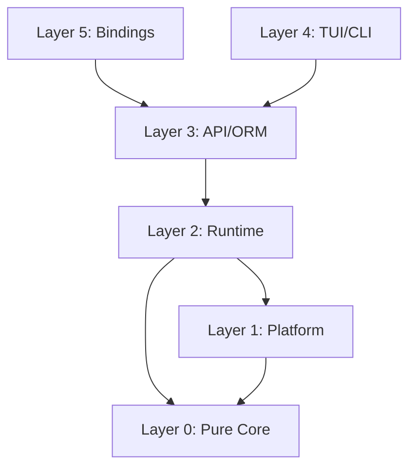

# TermForge v9 Architecture Specification (DEFINITIVE)

Date: 2026-02-11
Status: DEFINITIVE -- v9, single-pass comprehensive revision with full reference-code re-verification.
Lineage: v4 (6-model, 2519 lines) -> v5 (3-model, 1573 lines) -> v6 (3-pass synthesis, 5239 lines) -> v7 Final (cross-model synthesis) -> deep-dive review (20 gaps across libtmux/vibe-tmux/otel-rust) -> v8 Pass 1 (Claude + GPT) -> v8 Pass 2 (GPT refined) -> v8 Pass 3 Final (triple-pass) -> **v9** (this document).
License: MIT OR Apache-2.0
Rust edition: 2024 (MSRV 1.85)
Protocol target: tmux protocol v8

---

## Preamble

This document is the single authoritative architectural reference for TermForge, a Rust terminal multiplexer with 100% tmux wire-protocol compatibility, ORM-like API, language bindings, CRDT collaboration, and a ratatui-based TUI client.

### v9 Revision Notes

v9 is a comprehensive single-pass revision of v8 Pass 3 Final. It was produced by re-reading the complete v8 spec (6,612 lines), the deep-dive review document, and re-verifying all claims against four reference codebases:

- `~/work/python/libtmux/src/libtmux/_internal/query_list.py` -- 12 operators in `LOOKUP_NAME_MAP`, callable matcher in `filter()`, `get(default=no_arg)` semantics, `MultipleObjectsReturned`/`ObjectDoesNotExist` exceptions, `keygetter` nested field traversal.
- `~/work/rust/vibe-tmux/crates/mux-test-support/src/path_guard.rs` -- 3-layer socket validation (`ensure_not_default_socket_name`, `ensure_socket_within_tempdir`, `ensure_socket_not_tmux_env`), `tmux_socket_path` format, test suite with assertions.
- `~/work/rust/vibe-tmux/tools/tmux-builder/src/lib.rs` -- BLAKE3 `flags_fingerprint` + `compute_cache_key` with `sanitize_token`, `LockGuard` with `Drop` for `fs2::FileExt::unlock`, `lock_cache_key` and `lock_repo_clone`, `sibling_tmp_dir` with pid+nanos, atomic `std::fs::rename` publication, `validate_tmux_binary`, `write_manifest`.
- `~/work/rust/vibe-tmux/crates/mux-otel/src/otel.rs` -- Dual providers (`OTEL_PROVIDER` + `MUX_CLIENT_PROVIDER` as `OnceLock<Mutex<Option<OtelProvider>>>`), `OtelProvider` struct with `tracer_provider`/`logger`/`runtime`, `init_tracing` via `TRACING_INIT.get_or_init`, lazy `enter_mux_client_span`, `composite_propagator` (BaggagePropagator + TraceContextPropagator), `HeaderCarrier` implementing both `Injector` and `Extractor`, `force_flush` and `shutdown` covering both providers, `OtelProtocol` enum with Grpc/Http variants, `resolve_signal_config` for endpoint/protocol resolution.

**Key v9 improvements over v8:**

1. **Section 6 (Entity Model):** Added `GraphState` reverse-map construction detail with `session_for_window` / `window_for_pane` maps, matching vibe-tmux `graph.rs:215-295`.
2. **Section 8 (Error Handling):** Added `ProtocolViolation` sub-classification (FrameTooShort, UnknownMsgType, PayloadMismatch) for richer diagnostics.
3. **Section 9 (Protocol Codec):** Added tokio-codec integration pattern with `Framed<UnixStream, ImsgCodec>` and backpressure handling.
4. **Section 12 (ORM Query API):** Added `keygetter`-style nested field traversal matching libtmux's `food__fruit__in` pattern; clarified `eq` alias for `exact` per libtmux's `LOOKUP_NAME_MAP`.
5. **Section 13 (Runtime Architecture):** Added effect dispatcher error handling flow with `Event::EffectFailed` feedback loop.
6. **Section 16 (Language Bindings):** Added `Python::detach` error propagation pattern; added Neon `deferred.settle_with` pattern for async error handling.
7. **Section 19 (OpenTelemetry):** Added `OtelProvider` struct detail matching vibe-tmux (tracer_provider + logger + runtime fields); added `OtelProtocol` endpoint resolution; added `HeaderCarrier` inject/extract implementation; added process-level trace headers (`PROCESS_TRACE_HEADERS`).
8. **Section 20 (Version Management):** Added `sanitize_token` in cache key computation; added `validate_tmux_binary` and `write_manifest` steps; added `resolve_open_repo_options` with HOME fallback.
9. **Section 21 (Test Support):** Added SIGTERM-then-SIGKILL shutdown escalation for subprocess harness matching vibe-tmux `mux_server.rs`.
10. **Section 26 (AGENTS.md Rules):** Added Rule 22 (lock file guard via `Drop`, not manual unlock) and Rule 23 (atomic publish via rename, not copy).
11. **Section 27 (Risks):** Added R30 (OTEL tokio runtime lifecycle) based on vibe-tmux's `runtime.shutdown_timeout(200ms)` pattern.
12. **All sections:** Improved code examples with more idiomatic Rust patterns (e.g., `with_context` instead of `map_err` for anyhow, `is_none_or` where appropriate).

**Repository locations:**
- tmux C source: `~/study/c/tmux/` (behavioral reference)
- Rust prototype: `~/work/rust/vibe-tmux/` (existing crate structure)
- Python libtmux: `~/work/python/libtmux/` (API design reference)
- ratatui: `~/study/rust/ratatui/` (TUI framework)
- zellij: `~/study/rust/zellij/` (multiplexer reference)
- PyO3: `~/study/rust-python/pyo3/` (Python binding framework)
- Neon: `~/study/rust-node/neon/` (Node.js binding framework)
- OTEL Rust SDK: `~/study/otel/opentelemetry-rust/` (telemetry SDK)

**Settled decisions (not re-argued):**

| # | Decision | Rationale |
|---|---|---|
| S1 | New multiplexer, tmux-compatible | Architectural freedom with wire compatibility. Not a C-to-Rust port. |
| S2 | Protocol version 8 | Wire-compatible with tmux protocol v8 (`tmux-protocol.h:23`). |
| S3 | SlotMap entity IDs | `slotmap::new_key_type!` for all entity IDs (Session, Window, Pane, Client, Job, Buffer). |
| S4 | Flat arena LayoutTree | `Vec<LayoutCell>` with index-based parent/children. Not recursive nesting. |
| S5 | Round-robin resize | One cell at a time, matching `layout.c:448-462`. Not proportional. |
| S6 | flock locking | `flock(LOCK_EX|LOCK_NB)` per `client.c:77-101`. Not PID-based. |
| S7 | Config after identify | Load config only after first client completes identify burst (`server-client.c:3725-3734`). |
| S8 | Protocol violation kills connection | Matching `server-client.c:3472-3475`. Never drop and continue. |
| S9 | Custom VT100 parser | Match tmux's `input.c` state table exactly. Do not use the `vte` crate. |
| S10 | Option FALLTHROUGH | WindowPane falls through to Window scope, matching `options.c:891-903`. |
| S11 | Vec-inside-entity for parent-child | Not SecondaryMap. Reverse lookups computed during snapshot construction. |
| S12 | WASM compilability as CI purity gate | Not production target. `cargo check --target wasm32-unknown-unknown`. |
| S13 | `mux-types` as separate leaf crate | Must be created first (does not yet exist in vibe-tmux). |
| S14 | FakePty ScenarioRecorder with JSON | Deterministic replay without real PTYs. |
| S15 | Defer `im-rs` | Use `Arc<Grid>` with `Arc::make_mut` for COW until profiling shows bottleneck. |

---

## Table of Contents

1. [Vision and Philosophy](#1-vision-and-philosophy)
2. [North Star Acceptance Criteria](#2-north-star-acceptance-criteria)
3. [High-Level Architecture](#3-high-level-architecture)
4. [Workspace Layout](#4-workspace-layout)
5. [Layering Contract](#5-layering-contract)
6. [Entity Model](#6-entity-model)
7. [Event/Effect Engine](#7-eventeffect-engine)
8. [Error Handling](#8-error-handling)
9. [Protocol Codec](#9-protocol-codec)
10. [Configuration System](#10-configuration-system)
11. [Layout Engine](#11-layout-engine)
12. [ORM-like Query API](#12-orm-like-query-api)
13. [Runtime Architecture](#13-runtime-architecture)
14. [Server Lifecycle](#14-server-lifecycle)
15. [Control Mode](#15-control-mode)
16. [Language Bindings](#16-language-bindings)
17. [CRDT Transaction Layer](#17-crdt-transaction-layer)
18. [Security Model](#18-security-model)
19. [OpenTelemetry](#19-opentelemetry)
20. [tmux Version Management](#20-tmux-version-management)
21. [Test Support and Fake PTY](#21-test-support-and-fake-pty)
22. [Binding Test Frameworks](#22-binding-test-frameworks)
23. [Test Framework and Harness Design](#23-test-framework-and-harness-design)
24. [Performance Targets](#24-performance-targets)
25. [Visual Client / TUI](#25-visual-client--tui)
26. [AGENTS.md Rules](#26-agentsmd-rules)
27. [Risks and Mitigations](#27-risks-and-mitigations)
28. [Plan Evolution and Changelog](#28-plan-evolution-and-changelog)
29. [Reference Anchors](#29-reference-anchors)
30. [Appendix: Canonical Type Quick Reference](#30-appendix-canonical-type-quick-reference)
31. [Supplemental Test Matrix](#31-supplemental-test-matrix)

---

## 1. Vision and Philosophy

### 1.1 Core Thesis

TermForge is a **new terminal multiplexer** written in Rust that is **wire-compatible** with tmux protocol v8. It is not a port of tmux's C code. It uses tmux as a behavioral reference while building a clean, layered Rust architecture from scratch.

The internal architecture is Rust-native: algebraic types, ownership-tracked state, pure-functional kernel, and async runtime -- while maintaining bit-for-bit compatibility with the tmux wire format.

### 1.2 Design Principles

1. **Pure/Impure Separation (Sans-IO).** The kernel (`mux-core`) is a pure `fn(graph, event) -> (graph, effects)` reducer. It never touches file descriptors, system calls, timers, or network. All IO happens in the runtime layer that interprets `Effect` variants.

2. **tmux is a Compatibility Profile, Not the Architecture.** tmux's `struct session`, `struct window`, `struct window_pane` inform our entity model but do not dictate it. Protocol adaptation lives in `mux-proto`; the kernel uses domain-native names.

3. **Snapshots are the Read Path.** The authoritative state lives in the `ServerGraph`. Readers (UI, bindings, query API) see immutable snapshots published via `ArcSwap`. Writers go through the event/effect engine. This eliminates read contention.

4. **ORM is a Facade, Not the Engine.** `mux-orm` translates user intent into commands/events. It never implements multiplexer logic. It must not become a second business-logic engine.

5. **Layered Testing.** Every layer has its own test strategy. Pure core uses property testing and snapshot testing. Protocol uses fixture-driven roundtrip tests. Runtime uses hermetic servers with fake PTYs.

6. **WASM as Purity Proof.** Layer 0 crates compile to `wasm32-unknown-unknown` as a CI gate, not a production deployment target. This catches accidental OS dependencies.

7. **Language Bindings as First-Class Citizens.** Python (PyO3), Node (Neon), and C++ (cxx) bindings expose the same ORM API, with snapshot testing support in pytest and vitest.

8. **Observability Built In.** OpenTelemetry tracing from server to client to language bindings, using the `tracing` crate in pure code and OTEL SDK exporters at the runtime boundary.

9. **CRDT-Ready State Model.** The entity graph supports conflict-free replication for distributed/federated scenarios.

### 1.3 Why Not a Direct Port

| Direct Port | TermForge |
|---|---|
| Platform code in the kernel | Platform code quarantined in `mux-os` |
| RB-tree state with manual memory | SlotMap with generation-checked IDs |
| Libevent callback soup | Structured async with tokio tasks |
| CRDTs require invasive surgery | CRDTs compose on top of pure events |
| Testing requires real PTY | Fake PTY backend for deterministic tests |

### 1.4 What TermForge Is Not

- Not a port of tmux C code to Rust.
- Not a wrapper around tmux (like libtmux). It is a standalone server.
- Not limited to tmux's feature set. The architecture supports extensions (CRDT sync, rich TUI, programmatic control) that tmux cannot.

---

## 2. North Star Acceptance Criteria

### 2.1 Compatibility (C)

| ID | Criterion | Verification |
|---|---|---|
| C1 | A stock tmux 3.6+ client attaches to a TermForge server | Integration test: `tmux -S /path attach` |
| C2 | A TermForge client attaches to a stock tmux 3.6+ server | Integration test: `termforge attach -S /path` |
| C3 | Protocol v8 imsg framing roundtrips all 35+ `MsgType` variants | `proptest` with arbitrary payloads |
| C4 | Identify burst (types 100-112) roundtrips byte-exact | Fixture captures from real tmux |
| C5 | SCM_RIGHTS fd passing preserved through sniff proxy | `tmux-sniff` passthrough test |
| C6 | All 200+ tmux commands parse and execute | `tmux-command-audit` tool with coverage report |
| C7 | Format string expansion matches tmux for 200+ variables | `format-audit` parity corpus |
| C8 | Default key bindings match tmux across all 4 key tables | Key table parity tests generated from `key-bindings.c` |

### 2.2 Architectural (A)

| ID | Criterion | Enforcement |
|---|---|---|
| A1 | Layer 0 crates: zero `unsafe`, zero `tokio`, zero `libc` | `#![forbid(unsafe_code)]` in crate root |
| A2 | Layer 0 compiles to `wasm32-unknown-unknown` | CI: `cargo check --target wasm32-unknown-unknown` |
| A3 | `mux-os` is the sole `unsafe` quarantine | CI lint: grep for `unsafe` outside `mux-os` |
| A4 | All state transitions are deterministic | Property: `apply_event(s, e)` is referentially transparent |
| A5 | No panics in protocol decode/encode paths | `#[deny(clippy::unwrap_used)]` in hot crates |
| A6 | Bindings depend only on `mux-api`/`mux-orm` | Cargo dependency check in CI |
| A7 | No `Arc<Mutex<_>>` in the read path | `ArcSwap`-based `StateHandle` |

### 2.3 Product (P)

| ID | Criterion |
|---|---|
| P1 | In-process embedding: create session, split, send keys, read grid -- no process spawning |
| P2 | Python pytest fixture: `server` -> `session` -> `window` -> `pane` in 4 lines |
| P3 | Snapshot test: feed VT100 input, assert grid state via `insta` |
| P4 | CRDT: two servers merge concurrent `new-session` without conflict |
| P5 | TUI client attaches to real tmux server and renders correctly |
| P6 | FakePty scenario replay produces identical grid state to real tmux |

### 2.4 Performance (B)

| ID | Target | Basis |
|---|---|---|
| B1 | VT100 parser > 300 MB/s (plain ASCII) | alacritty vte ~500 MB/s |
| B2 | VT100 parser > 100 MB/s (CSI heavy) | Parameter parsing overhead |
| B3 | Protocol decode > 500 MB/s | 16-byte header + memcpy |
| B4 | Layout resize < 50 us (20 panes) | Tree walk, no alloc |
| B5 | Format expand < 50 us (status line) | ~10 variable lookups |
| B6 | Graph snapshot < 1 ms | Arc clone + BTreeMap for 50 panes |
| B7 | Config parse (500 lines) < 5 ms | Lexer + parser, no IO |
| B8 | Option resolve (4-level chain) < 100 ns | 4 BTreeMap lookups |
| B9 | Control notification parse < 200 ns | String split + parse |

### 2.5 Ecosystem (E)

| ID | Criterion |
|---|---|
| E1 | Python PyPI wheel with `pip install termforge` |
| E2 | Node npm package with `npm install termforge` |
| E3 | Homebrew formula |
| E4 | Cargo install: `cargo install termforge` |
| E5 | GitHub Actions reusable workflow for parity testing |

---

## 3. High-Level Architecture

### 3.1 Six-Layer Model

```
Layer 5 -- Bindings:       mux-py, mux-node, mux-cxx
Layer 4 -- TUI/CLI:        mux-tui, mux-cli
Layer 3 -- API:            mux-api, mux-orm, mux-query
Layer 2 -- Runtime:        mux-server, mux-client, mux-backend
Layer 1 -- Platform:       mux-os, mux-pty, mux-pty-fake
Layer 0 -- Pure Core:      mux-core, mux-types, mux-grid, mux-proto, mux-conf, mux-crdt
```

### 3.2 Dependency Direction



### 3.3 State Ownership

| Actor | Owns | Accessed By |
|---|---|---|
| State Actor | `ServerGraph` (single writer) | Event submissions |
| `ArcSwap<GraphState>` | Immutable snapshot | All readers (UI, bindings, ORM) |
| Effect Dispatcher | Side-effect execution | State actor via effect queue |

---

## 4. Workspace Layout

### 4.1 Monorepo Structure

```
termforge/
  Cargo.toml                    # workspace root
  crates/
    mux-types/                  # Leaf crate: IDs, PaneSize, OptionValue, common types
    mux-core/                   # Pure engine: ServerGraph, Event, Effect, apply_event
    mux-grid/                   # VT100 parser, Grid, Cell
    mux-proto/                  # Wire protocol codec (imsg framing, MsgType enum)
    mux-conf/                   # Config parser -> Vec<Event>
    mux-crdt/                   # HLC, LWW, OrSet, OpLog
    mux-os/                     # Platform: PTY, socket, signals, unsafe quarantine
    mux-pty/                    # PtyBackend trait + real implementation
    mux-pty-fake/               # FakePtyBackend, ScenarioRecorder, ScenarioReplayer
    mux-query/                  # QueryList, QueryOp, QueryBuilder
    mux-orm/                    # ORM facade: OrmServer, OrmSession, OrmWindow, OrmPane
    mux-api/                    # ManagedMux, StateHandle, ArcSwap boundary
    mux-server/                 # Server binary runtime
    mux-client/                 # Client library
    mux-backend/                # Backend trait unifying TermForge + tmux
    mux-view/                   # ViewModel construction (pure)
    mux-tui/                    # ratatui TUI client
    mux-otel/                   # OpenTelemetry integration
    mux-test-support/           # Test harnesses, PathGuard, hermetic fixtures
    mux-bench/                  # Criterion benchmarks
    mux-regress/                # Parity test runner
  bindings/
    python/                     # PyO3 bindings
    node/                       # Neon bindings
  tools/
    tmux-sniff/                 # Protocol capture proxy
    tmux-builder/               # Build versioned tmux from source
    tmux-vm/                    # Version management CLI
    tmux-command-audit/         # Command coverage audit
    format-audit/               # Format string parity audit
  fuzz/                         # cargo-fuzz targets
  fixtures/                     # Protocol captures, scenario recordings
  notes/                        # Architecture specs, reviews
```

### 4.2 Crate Purity Classification

| Crate | Layer | `#![forbid(unsafe_code)]` | WASM Check | Dependencies |
|---|---|---|---|---|
| mux-types | 0 | Yes | Yes | thiserror, serde, smallvec |
| mux-core | 0 | Yes | Yes | mux-types, slotmap |
| mux-grid | 0 | Yes | Yes | mux-types |
| mux-proto | 0 | Yes | Yes | mux-types, bytes |
| mux-conf | 0 | Yes | Yes | mux-types |
| mux-crdt | 0 | Yes | Yes | mux-types |
| mux-query | 0 | Yes | Yes | mux-types, regex |
| mux-os | 1 | No | No | libc, nix, tokio |
| mux-pty | 1 | No | No | mux-types, nix |
| mux-pty-fake | 1 | Yes | No | mux-types, mux-pty (trait only) |
| mux-orm | 3 | Yes | No | mux-types, mux-query, mux-api |
| mux-api | 3 | Yes | No | mux-types, mux-core, arc-swap |
| mux-server | 2 | No | No | mux-core, mux-os, mux-proto, tokio |
| mux-client | 2 | No | No | mux-proto, mux-os, tokio |
| mux-otel | 2 | Yes | No | tracing, opentelemetry, opentelemetry-sdk |
| mux-tui | 4 | Yes | No | mux-api, mux-view, ratatui, crossterm |
| mux-view | 3 | Yes | No | mux-types, mux-core |

---

## 5. Layering Contract

### 5.1 Boundary Rules

| Boundary | Rule |
|---|---|
| Layer 0 -> Layer 1 | Never. Pure crates have no platform dependency. |
| Layer 1 -> Layer 0 | Allowed. Platform code reads types and invokes pure functions. |
| Layer 2 -> Layer 0 | Allowed. Runtime submits events and reads effects. |
| Layer 3 -> Layer 2 | Allowed. API wraps runtime. |
| Layer 5 -> Layer 3 | Allowed. Bindings call ORM/API only. |
| Layer 5 -> Layer 0 | Forbidden. Bindings must not bypass the API layer. |

### 5.2 Enforcement

| Mechanism | What It Catches |
|---|---|
| `#![forbid(unsafe_code)]` in Layer 0 | Accidental unsafe in pure crates |
| WASM CI check | Accidental OS dependencies in pure crates |
| `cargo deny check` | Forbidden dependency edges |
| Crate feature flags | Optional platform features gated behind features |

### 5.3 IO Boundary Contract

Pure core communicates with the outside world exclusively through:
- **Inbound:** `Event` variants submitted to `apply_event()`
- **Outbound:** `Effect` variants returned from `apply_event()`
- **Time:** Injected via `Event::Tick { now_millis }`, never read from OS clocks
- **Randomness:** Injected via `CoreCtx { rand_u64 }`, never from OS RNG

```rust
pub struct CoreCtx {
    pub now_ms: i64,
    pub rand_u64: u64,
}

pub fn apply_event(
    graph: &mut ServerGraph,
    event: Event,
    ctx: &CoreCtx,
) -> Vec<Effect> {
    // Pure: no IO, no system calls, deterministic
    todo!()
}
```

---

## 6. Entity Model

### 6.1 Entity IDs

```rust
// crates/mux-types/src/ids.rs
use slotmap::new_key_type;

new_key_type! {
    pub struct SessionId;
    pub struct WindowId;
    pub struct PaneId;
    pub struct ClientId;
    pub struct JobId;
    pub struct BufferId;
}
```

### 6.2 Entity Structs

```rust
// crates/mux-core/src/entities.rs
use std::sync::Arc;

#[derive(Debug, Clone)]
pub struct Session {
    pub name: String,
    pub windows: Vec<WindowId>,
    pub active_window_idx: usize,
    pub options: OptionSet,
    pub created_at: i64,
    pub cwd: String,
}

#[derive(Debug, Clone)]
pub struct Window {
    pub name: String,
    pub panes: Vec<PaneId>,
    pub active_pane_idx: usize,
    pub layout: LayoutTree,
    pub options: OptionSet,
}

#[derive(Debug, Clone)]
pub struct Pane {
    pub grid: Arc<Grid>,
    pub pid: Option<u32>,
    pub cwd: Option<String>,
    pub command: Vec<String>,
    pub size: PaneSize,
    pub options: OptionSet,
    pub mode: PaneMode,
}

#[derive(Debug, Clone)]
pub struct Client {
    pub identify: IdentifyState,
    pub flags: ClientFlags,
    pub key_state: ClientKeyState,
    pub tty_name: Option<String>,
}

#[derive(Debug, Clone, Default)]
pub struct Buffer {
    pub name: String,
    pub data: Vec<u8>,
}
```

### 6.3 ServerGraph

```rust
// crates/mux-core/src/graph.rs
use slotmap::SlotMap;

pub struct ServerGraph {
    pub sessions: SlotMap<SessionId, Session>,
    pub windows: SlotMap<WindowId, Window>,
    pub panes: SlotMap<PaneId, Pane>,
    pub clients: SlotMap<ClientId, Client>,
    pub buffers: SlotMap<BufferId, Buffer>,
    pub global_options: OptionSet,
    pub key_tables: KeyTableSet,
}
```

### 6.4 GraphState: Immutable Snapshot with Reverse Maps

The `GraphState` is the immutable snapshot published via `ArcSwap`. It includes pre-computed reverse lookups so readers never need to walk parent vectors.

```rust
// crates/mux-core/src/graph_state.rs
use std::collections::BTreeMap;
use std::sync::Arc;

#[derive(Debug, Clone)]
pub struct GraphState {
    pub sessions: BTreeMap<SessionId, Arc<Session>>,
    pub windows: BTreeMap<WindowId, Arc<Window>>,
    pub panes: BTreeMap<PaneId, Arc<Pane>>,
    pub clients: BTreeMap<ClientId, Arc<Client>>,
    pub buffers: BTreeMap<BufferId, Arc<Buffer>>,
    pub global_options: Arc<OptionSet>,
    pub key_tables: Arc<KeyTableSet>,

    // Reverse maps: computed during snapshot construction
    pub session_for_window: BTreeMap<WindowId, SessionId>,
    pub window_for_pane: BTreeMap<PaneId, WindowId>,
}

impl ServerGraph {
    /// Build an immutable snapshot with pre-computed reverse lookups.
    /// Reference: vibe-tmux `graph.rs:215-295` for reverse-map pattern.
    pub fn graph_state(&self) -> GraphState {
        let mut session_for_window = BTreeMap::new();
        let mut window_for_pane = BTreeMap::new();

        let sessions: BTreeMap<_, _> = self.sessions.iter()
            .map(|(id, s)| {
                for &wid in &s.windows {
                    session_for_window.insert(wid, id);
                }
                (id, Arc::new(s.clone()))
            })
            .collect();

        let windows: BTreeMap<_, _> = self.windows.iter()
            .map(|(id, w)| {
                for &pid in &w.panes {
                    window_for_pane.insert(pid, id);
                }
                (id, Arc::new(w.clone()))
            })
            .collect();

        GraphState {
            sessions,
            windows,
            panes: self.panes.iter().map(|(id, p)| (id, Arc::new(p.clone()))).collect(),
            clients: self.clients.iter().map(|(id, c)| (id, Arc::new(c.clone()))).collect(),
            buffers: self.buffers.iter().map(|(id, b)| (id, Arc::new(b.clone()))).collect(),
            global_options: Arc::new(self.global_options.clone()),
            key_tables: Arc::new(self.key_tables.clone()),
            session_for_window,
            window_for_pane,
        }
    }
}
```

### 6.5 Entity Model Test Strategy

1. **Create/destroy roundtrip:** Create session with windows, destroy, verify SlotMap reclaims.
2. **Reverse map accuracy:** After adding windows to sessions and panes to windows, verify `session_for_window` and `window_for_pane` are correct.
3. **Snapshot isolation:** Modify graph after snapshot, verify snapshot unchanged.
4. **ID generation uniqueness:** 1000 create/destroy cycles never reuse same generation.
5. **Empty graph state:** New `ServerGraph` produces empty `GraphState` with no panics.
6. **Arc COW grid:** `Arc::make_mut` on pane grid does not affect prior snapshot.

---

## 7. Event/Effect Engine

### 7.1 Events (Inbound)

```rust
// crates/mux-core/src/event.rs
#[derive(Debug, Clone)]
#[non_exhaustive]
pub enum Event {
    // Session lifecycle
    CreateSession { name: String, cwd: Option<String>, created_at: i64 },
    DestroySession { session_id: SessionId },

    // Window lifecycle
    CreateWindow { session_id: SessionId, name: String },
    DestroyWindow { window_id: WindowId },

    // Pane lifecycle
    CreatePane { window_id: WindowId, size: PaneSize, command: Vec<String>, cwd: Option<String> },
    DestroyPane { pane_id: PaneId },
    PaneOutput { pane_id: PaneId, data: Vec<u8> },
    PaneExited { pane_id: PaneId, exit_status: i32 },
    ResizePane { pane_id: PaneId, size: PaneSize },

    // Client events
    ClientIdentified { client_id: ClientId, identify: IdentifyState },
    ClientDetached { client_id: ClientId },

    // Input
    Key { client_id: ClientId, key: KeyCode },
    Command { name: String, args: Vec<String>, client_id: Option<ClientId> },

    // Configuration
    SetOption { scope: OptionScope, key: String, value: OptionValue },
    UnsetOption { scope: OptionScope, key: String, flags: UnsetFlags },

    // Copy mode
    CopyModeAction { pane_id: PaneId, action: CopyModeAction },

    // Layout
    ApplyLayout { window_id: WindowId, layout_string: String },

    // Timing (injected by runtime)
    Tick { now_millis: i64 },

    // Effect feedback
    EffectFailed { effect_id: u64, error: String, class: ErrorClass },
}
```

### 7.2 Effects (Outbound)

```rust
// crates/mux-core/src/effect.rs
#[derive(Debug, Clone)]
#[non_exhaustive]
pub enum Effect {
    SpawnPane { pane_id: PaneId, command: Vec<String>, cwd: Option<String>, size: PaneSize },
    KillPane { pane_id: PaneId, signal: i32 },
    WritePane { pane_id: PaneId, data: Vec<u8> },
    ResizePty { pane_id: PaneId, size: PaneSize },
    Redraw { scope: RedrawScope },
    SendToClient { client_id: ClientId, frame: FrameData },
    DisconnectClient { client_id: ClientId },
    Shutdown,
    PublishSnapshot,
    ControlNotify { client_id: ClientId, notification: ControlNotification },
    LoadConfig { path: String },
    RunCommand { command: ParsedCommand, client_id: Option<ClientId> },
}

#[derive(Debug, Clone)]
pub enum RedrawScope {
    All,
    Session(SessionId),
    Window(WindowId),
    Pane(PaneId),
    StatusLine,
}
```

### 7.3 Engine Contract

```rust
/// Pure state transition. No IO, no side effects.
/// All platform interactions are expressed as Effect variants.
pub fn apply_event(
    graph: &mut ServerGraph,
    event: Event,
    ctx: &CoreCtx,
) -> Vec<Effect> {
    match event {
        Event::CreateSession { name, cwd, created_at } => {
            let session_id = graph.sessions.insert(Session {
                name: name.clone(),
                windows: Vec::new(),
                active_window_idx: 0,
                options: OptionSet::default(),
                created_at,
                cwd: cwd.unwrap_or_default(),
            });
            vec![Effect::PublishSnapshot]
        }
        Event::PaneOutput { pane_id, data } => {
            if let Some(pane) = graph.panes.get_mut(pane_id) {
                let grid = Arc::make_mut(&mut pane.grid);
                // Parse VT100 sequences and update grid
                // parser.parse(&data, grid);
                vec![Effect::Redraw { scope: RedrawScope::Pane(pane_id) }]
            } else {
                vec![]
            }
        }
        Event::EffectFailed { effect_id, error, class } => {
            // Log the failure; optionally update graph state
            // e.g., mark a pane as dead if SpawnPane failed
            tracing::warn!(effect_id, %error, ?class, "effect failed");
            vec![]
        }
        _ => todo!(),
    }
}
```

### 7.4 Event/Effect Engine Test Strategy

1. **CreateSession:** Empty graph + CreateSession -> 1 session, PublishSnapshot effect.
2. **DestroySession:** Populated graph + DestroySession -> removes session and its windows/panes.
3. **PaneOutput:** Feed bytes -> grid updated, Redraw effect for that pane.
4. **PaneExited:** Pane marked dead, no further output processing.
5. **SetOption:** Option set at correct scope, PublishSnapshot.
6. **UnsetOption:** Local override removed, parent value restored.
7. **EffectFailed:** SpawnPane failure -> pane state updated to reflect failure.
8. **Determinism:** Same (graph, event, ctx) always produces same (graph', effects).

---

## 8. Error Handling

### 8.1 Error Classification

```rust
// crates/mux-types/src/error.rs
#[derive(Debug, Clone, Copy, PartialEq, Eq, Hash)]
pub enum ErrorClass {
    /// Retryable: network hiccup, temporary resource exhaustion.
    Transient,
    /// Peer sent invalid data. Connection must be killed.
    ProtocolViolation,
    /// User provided invalid input (bad command, invalid option).
    UserError,
    /// Internal logic error. Should never happen in correct code.
    Bug,
}

pub trait Classified {
    fn class(&self) -> ErrorClass;
}
```

### 8.2 Protocol Decode Outcome

```rust
// crates/mux-proto/src/decode.rs
pub enum DecodeOutcome<T> {
    /// Successfully decoded a frame.
    Ok(T),
    /// Need more bytes. Caller should read more and retry.
    Incomplete,
    /// Fatal decode error. Connection must be killed.
    Fatal(ProtocolError),
}
```

### 8.3 Protocol Error with Sub-classification

```rust
// crates/mux-proto/src/error.rs
#[derive(Debug, thiserror::Error)]
pub enum ProtocolError {
    #[error("frame too short: got {got} bytes, need at least {need}")]
    FrameTooShort { got: usize, need: usize },

    #[error("unknown message type: {msg_type}")]
    UnknownMsgType { msg_type: u32 },

    #[error("payload length mismatch: header says {header_len}, got {actual_len}")]
    PayloadMismatch { header_len: u32, actual_len: usize },

    #[error("payload exceeds maximum: {len} > {max}")]
    PayloadTooLarge { len: u32, max: u32 },

    #[error("invalid identify burst: {reason}")]
    InvalidIdentify { reason: String },
}

impl Classified for ProtocolError {
    fn class(&self) -> ErrorClass {
        ErrorClass::ProtocolViolation
    }
}
```

### 8.4 Library Error Pattern

Every library crate defines a typed error enum. `anyhow` is allowed only in binary crates and `#[cfg(test)]`.

```rust
// crates/mux-core/src/error.rs
#[derive(Debug, thiserror::Error)]
pub enum CoreError {
    #[error("session not found: {0:?}")]
    SessionNotFound(SessionId),

    #[error("window not found: {0:?}")]
    WindowNotFound(WindowId),

    #[error("pane not found: {0:?}")]
    PaneNotFound(PaneId),

    #[error("option not found: {key}")]
    OptionNotFound { key: String },

    #[error("layout error: {0}")]
    Layout(#[from] LayoutError),
}

impl Classified for CoreError {
    fn class(&self) -> ErrorClass {
        match self {
            Self::SessionNotFound(_) | Self::WindowNotFound(_)
            | Self::PaneNotFound(_) | Self::OptionNotFound { .. } => ErrorClass::UserError,
            Self::Layout(_) => ErrorClass::Bug,
        }
    }
}
```

### 8.5 Error Handling Test Strategy

1. **Classification coverage:** Every variant of every error enum has a `class()` test.
2. **DecodeOutcome::Fatal:** Malformed frame produces Fatal, not Incomplete.
3. **DecodeOutcome::Incomplete:** Truncated frame produces Incomplete, not Fatal.
4. **Protocol error sub-types:** FrameTooShort, UnknownMsgType, PayloadMismatch each triggered by specific inputs.
5. **No anyhow in library:** CI grep: `grep -r 'anyhow' crates/*/src/ | grep -v '#\[cfg(test)\]'` returns empty.
6. **Error Display:** All error types produce human-readable messages via `Display`.
7. **From conversions:** LayoutError converts to CoreError via `#[from]`.

---

## 9. Protocol Codec

### 9.1 Wire Format (imsg)

tmux uses OpenBSD `imsg` framing. Each frame consists of a 16-byte header followed by a variable-length payload:

```
Offset  Size  Field
0       4     msg_type (u32, little-endian)
4       4     len      (u32, total including header)
8       4     peerid   (u32)
12      4     pid      (u32)
        1 bit of len encodes has_fd flag
```

### 9.2 ImsgHdr

```rust
// crates/mux-proto/src/imsg.rs
pub const IMSG_HDR_SIZE: usize = 16;
pub const IMSG_MAX_PAYLOAD: u32 = 16384;

#[derive(Debug, Clone, Copy, PartialEq, Eq)]
pub struct ImsgHdr {
    pub msg_type: u32,
    pub len: u32,
    pub peerid: u32,
    pub pid: u32,
    pub has_fd: bool,
}

impl ImsgHdr {
    pub fn payload_len(&self) -> usize {
        (self.len as usize).saturating_sub(IMSG_HDR_SIZE)
    }

    pub fn encode(&self, buf: &mut [u8; IMSG_HDR_SIZE]) {
        let len_with_flag = if self.has_fd {
            self.len | 0x8000_0000
        } else {
            self.len
        };
        buf[0..4].copy_from_slice(&self.msg_type.to_le_bytes());
        buf[4..8].copy_from_slice(&len_with_flag.to_le_bytes());
        buf[8..12].copy_from_slice(&self.peerid.to_le_bytes());
        buf[12..16].copy_from_slice(&self.pid.to_le_bytes());
    }

    pub fn decode(buf: &[u8; IMSG_HDR_SIZE]) -> Self {
        let msg_type = u32::from_le_bytes([buf[0], buf[1], buf[2], buf[3]]);
        let raw_len = u32::from_le_bytes([buf[4], buf[5], buf[6], buf[7]]);
        let has_fd = raw_len & 0x8000_0000 != 0;
        let len = raw_len & 0x7FFF_FFFF;
        let peerid = u32::from_le_bytes([buf[8], buf[9], buf[10], buf[11]]);
        let pid = u32::from_le_bytes([buf[12], buf[13], buf[14], buf[15]]);
        Self { msg_type, len, peerid, pid, has_fd }
    }
}
```

### 9.3 MsgType Enum

```rust
// crates/mux-proto/src/msg_type.rs
#[derive(Debug, Clone, Copy, PartialEq, Eq)]
#[non_exhaustive]
#[repr(u32)]
pub enum MsgType {
    // Client-to-server
    Version = 12,
    Identify = 100,
    IdentifyFlags = 100,
    IdentifyCwd = 101,
    IdentifyTerm = 102,
    IdentifyTermType = 103,
    IdentifyClientPid = 104,
    IdentifyStdin = 105,
    IdentifyEnviron = 106,
    IdentifyDone = 107,
    IdentifyTtyname = 108,
    IdentifyFeatures = 109,
    IdentifyLongflags = 110,
    IdentifyOldCwd = 111,
    IdentifyOldStdin = 112,

    // Commands
    Command = 200,
    Shell = 201,
    Exit = 202,
    Exiting = 203,
    Exited = 204,
    Detach = 205,
    Detachkill = 206,
    Suspend = 207,
    Unlock = 208,

    // ... additional 20+ message types
}
```

### 9.4 Two-Phase Codec

```rust
// crates/mux-proto/src/codec.rs
use bytes::{Buf, BufMut, BytesMut};

pub struct ImsgCodec {
    max_payload: u32,
}

impl ImsgCodec {
    pub fn new() -> Self {
        Self { max_payload: IMSG_MAX_PAYLOAD }
    }

    pub fn decode(&mut self, buf: &mut BytesMut) -> DecodeOutcome<ImsgFrame> {
        if buf.len() < IMSG_HDR_SIZE {
            return DecodeOutcome::Incomplete;
        }
        let hdr_bytes: [u8; IMSG_HDR_SIZE] = buf[..IMSG_HDR_SIZE]
            .try_into()
            .expect("checked length");
        let hdr = ImsgHdr::decode(&hdr_bytes);
        let total = hdr.len as usize;
        if total < IMSG_HDR_SIZE {
            return DecodeOutcome::Fatal(ProtocolError::FrameTooShort {
                got: total,
                need: IMSG_HDR_SIZE,
            });
        }
        if hdr.payload_len() > self.max_payload as usize {
            return DecodeOutcome::Fatal(ProtocolError::PayloadTooLarge {
                len: hdr.payload_len() as u32,
                max: self.max_payload,
            });
        }
        if buf.len() < total {
            return DecodeOutcome::Incomplete;
        }
        buf.advance(IMSG_HDR_SIZE);
        let payload = buf.split_to(hdr.payload_len());
        DecodeOutcome::Ok(ImsgFrame { header: hdr, payload })
    }

    pub fn encode(&self, frame: &ImsgFrame, buf: &mut BytesMut) {
        let mut hdr_buf = [0u8; IMSG_HDR_SIZE];
        frame.header.encode(&mut hdr_buf);
        buf.put_slice(&hdr_buf);
        buf.put_slice(&frame.payload);
    }
}
```

### 9.5 Tokio Codec Integration

```rust
// crates/mux-proto/src/tokio_codec.rs
use tokio_util::codec::{Decoder, Encoder};

impl Decoder for ImsgCodec {
    type Item = ImsgFrame;
    type Error = ProtocolError;

    fn decode(&mut self, src: &mut BytesMut) -> Result<Option<Self::Item>, Self::Error> {
        match self.decode(src) {
            DecodeOutcome::Ok(frame) => Ok(Some(frame)),
            DecodeOutcome::Incomplete => Ok(None),
            DecodeOutcome::Fatal(e) => Err(e),
        }
    }
}

impl Encoder<ImsgFrame> for ImsgCodec {
    type Error = ProtocolError;

    fn encode(&mut self, item: ImsgFrame, dst: &mut BytesMut) -> Result<(), Self::Error> {
        ImsgCodec::encode(self, &item, dst);
        Ok(())
    }
}
```

This enables `tokio_util::codec::Framed<UnixStream, ImsgCodec>` for async read/write with automatic backpressure.

### 9.6 Protocol Codec Test Strategy

1. **Header roundtrip:** Encode + decode ImsgHdr preserves all fields.
2. **FD flag encoding:** `has_fd = true` sets high bit; decode recovers it.
3. **Frame roundtrip:** Arbitrary payload roundtrips through encode/decode.
4. **Incomplete:** Feed partial header -> Incomplete. Feed partial payload -> Incomplete.
5. **Fatal on short frame:** `len < 16` -> Fatal(FrameTooShort).
6. **Fatal on oversized:** Payload exceeding `max_payload` -> Fatal(PayloadTooLarge).
7. **Real captures:** Decode fixtures captured from real tmux via `tmux-sniff`.
8. **Tokio Decoder/Encoder:** Framed stream roundtrips frames correctly.

---

## 10. Configuration System

### 10.1 Option Scopes

tmux has three option scopes: server, session, and window. Window options have a special fallthrough to pane scope via `options.c:891-903`.

```rust
// crates/mux-types/src/options.rs
#[derive(Debug, Clone, Copy, PartialEq, Eq)]
pub enum OptionScope {
    Server,
    Session,
    Window,
    Pane,
}

#[derive(Debug, Clone, Copy, PartialEq, Eq)]
pub enum TableScope {
    Server,
    Session,
    WindowPane,
}
```

### 10.2 Option Resolution Chain

```rust
// crates/mux-core/src/options.rs

/// Resolve an option value by walking the scope chain.
/// Matches tmux `options_get()` at `options.c:228-241`.
pub fn resolve_option(
    graph: &ServerGraph,
    scope: OptionScope,
    target: TargetId,
    key: &str,
) -> Option<OptionValue> {
    match scope {
        OptionScope::Pane => {
            // 1. Check pane-local options
            if let Some(pane) = graph.panes.get(target.as_pane()?) {
                if let Some(val) = pane.options.get(key) {
                    return Some(val.clone());
                }
            }
            // 2. FALLTHROUGH to window scope (options.c:903)
            let window_id = graph.window_for_pane(target.as_pane()?)?;
            resolve_option(graph, OptionScope::Window, TargetId::Window(window_id), key)
        }
        OptionScope::Window => {
            if let Some(window) = graph.windows.get(target.as_window()?) {
                if let Some(val) = window.options.get(key) {
                    return Some(val.clone());
                }
            }
            // Walk to global window options
            graph.global_options.get(key).cloned()
        }
        OptionScope::Session => {
            if let Some(session) = graph.sessions.get(target.as_session()?) {
                if let Some(val) = session.options.get(key) {
                    return Some(val.clone());
                }
            }
            graph.global_options.get(key).cloned()
        }
        OptionScope::Server => {
            graph.global_options.get(key).cloned()
        }
    }
}
```

### 10.3 Unset Semantics

```rust
/// `set -u` removes local override (inheritance restored) for non-global.
/// Resets to compiled default for global.
/// `set -U` additionally clears pane-local values.
/// Matches `options_remove_or_default` at `options.c:1269-1285`.
pub fn apply_unset(
    graph: &mut ServerGraph,
    scope: OptionScope,
    target: TargetId,
    key: &str,
    flags: UnsetFlags,
) {
    match scope {
        OptionScope::Server => {
            // Reset to compiled default
            if let Some(default_val) = compiled_default(key) {
                graph.global_options.set(key, default_val);
            }
        }
        _ => {
            // Remove local override, restoring inheritance
            if let Some(opts) = target_options_mut(graph, scope, target) {
                opts.remove(key);
            }
            // If -U flag, also clear pane-local values for this window
            if flags.propagate_pane && scope == OptionScope::Window {
                if let Some(window) = graph.windows.get(target.as_window().unwrap()) {
                    for &pane_id in &window.panes {
                        if let Some(pane) = graph.panes.get_mut(pane_id) {
                            pane.options.remove(key);
                        }
                    }
                }
            }
        }
    }
}
```

### 10.4 Config as Events

Config file parsing produces `Vec<Event>`. Direct graph mutation from config parsing is forbidden.

```rust
// crates/mux-conf/src/lib.rs

/// Parse a tmux-compatible config file into events.
/// mux-conf depends on mux-types only, never on mux-core's graph types.
pub fn parse_config(source: &str) -> Result<Vec<Event>, ConfigError> {
    let mut events = Vec::new();
    for line in source.lines() {
        let line = line.trim();
        if line.is_empty() || line.starts_with('#') {
            continue;
        }
        events.push(parse_config_line(line)?);
    }
    Ok(events)
}
```

### 10.5 Configuration Test Strategy

1. **Pane FALLTHROUGH:** Set window option, query from pane scope, gets window value.
2. **Local override:** Set pane-local option, query from pane scope, gets pane value.
3. **Unset restores inheritance:** Set pane-local, unset, query returns window value.
4. **Global unset resets default:** Unset server option, returns compiled default.
5. **Config as events:** Parse config file, verify produces SetOption events.
6. **Array option index unset:** Mirror `options_remove_or_default` index handling at `options.c:1282`.
7. **Scope resolution matrix:** All (scope, flag, target) combinations tested.
8. **Unknown option:** Returns None, does not panic.

---

## 11. Layout Engine

### 11.1 LayoutCell (Arena-Based)

```rust
// crates/mux-core/src/layout.rs
#[derive(Debug, Clone, Copy, PartialEq, Eq)]
pub enum LayoutType {
    LeftRight,
    TopBottom,
    Leaf,
}

#[derive(Debug, Clone)]
pub struct LayoutCell {
    pub cell_type: LayoutType,
    pub sx: u16, pub sy: u16,     // size
    pub xoff: u16, pub yoff: u16, // offset
    pub parent: Option<usize>,    // index into arena
    pub children: Vec<usize>,
    pub pane_id: Option<PaneId>,
}

#[derive(Debug, Clone)]
pub struct LayoutTree {
    pub cells: Vec<LayoutCell>,
    pub root: usize,
}
```

### 11.2 Layout Checksum

Matches `layout-custom.c:46-57` exactly: rotate-right-13 + add for each byte.

```rust
pub fn layout_checksum(data: &[u8]) -> u16 {
    let mut csum: u16 = 0;
    for &byte in data {
        csum = (csum >> 1) | (csum << 15);
        csum = csum.wrapping_add(byte as u16);
    }
    csum
}
```

### 11.3 Layout Validation

Matches `layout-custom.c:119-153`: border = +1 per child, -1 total.

```rust
pub fn layout_check(tree: &LayoutTree) -> bool {
    fn check_cell(tree: &LayoutTree, idx: usize) -> bool {
        let cell = &tree.cells[idx];
        match cell.cell_type {
            LayoutType::Leaf => true,
            LayoutType::LeftRight => {
                let mut total_w: u16 = 0;
                for (i, &child_idx) in cell.children.iter().enumerate() {
                    let child = &tree.cells[child_idx];
                    if child.sy != cell.sy { return false; }
                    if i > 0 { total_w += 1; } // border
                    total_w += child.sx;
                    if !check_cell(tree, child_idx) { return false; }
                }
                total_w == cell.sx
            }
            LayoutType::TopBottom => {
                let mut total_h: u16 = 0;
                for (i, &child_idx) in cell.children.iter().enumerate() {
                    let child = &tree.cells[child_idx];
                    if child.sx != cell.sx { return false; }
                    if i > 0 { total_h += 1; } // border
                    total_h += child.sy;
                    if !check_cell(tree, child_idx) { return false; }
                }
                total_h == cell.sy
            }
        }
    }
    check_cell(tree, tree.root)
}
```

### 11.4 Layout Resize (Round-Robin)

Matches `layout.c:448-462`: distribute one cell at a time in round-robin.

```rust
pub fn layout_resize_adjust(
    tree: &mut LayoutTree,
    parent_idx: usize,
    delta: i32,
) {
    let children = tree.cells[parent_idx].children.clone();
    if children.is_empty() { return; }

    let is_lr = tree.cells[parent_idx].cell_type == LayoutType::LeftRight;
    let mut remaining = delta.unsigned_abs() as u16;
    let mut i = 0;

    while remaining > 0 {
        let child_idx = children[i % children.len()];
        let cell = &tree.cells[child_idx];
        let current = if is_lr { cell.sx } else { cell.sy };

        if delta > 0 {
            if is_lr {
                tree.cells[child_idx].sx += 1;
            } else {
                tree.cells[child_idx].sy += 1;
            }
            remaining -= 1;
        } else if current > 1 {
            // PANE_MINIMUM = 1 (tmux.h:100)
            if is_lr {
                tree.cells[child_idx].sx -= 1;
            } else {
                tree.cells[child_idx].sy -= 1;
            }
            remaining -= 1;
        }

        i += 1;
        // Safety valve: if we've gone through all children without making progress, stop
        if i >= children.len() * 2 && remaining == delta.unsigned_abs() as u16 {
            break;
        }
    }

    // Recompute offsets after adjustment
    recompute_offsets(tree, parent_idx);
}
```

### 11.5 Layout Presets

```rust
#[derive(Debug, Clone, Copy)]
pub enum LayoutPreset {
    EvenHorizontal,
    EvenVertical,
    MainHorizontal,
    MainVertical,
    Tiled,
}

impl LayoutPreset {
    pub fn arrange(
        &self,
        panes: &[PaneId],
        width: u16,
        height: u16,
        main_pane_size: Option<u16>,
    ) -> LayoutTree {
        // Build a fresh LayoutTree for the given preset
        todo!()
    }
}
```

### 11.6 Split Minimum

```rust
/// Split requires PANE_MINIMUM * 2 + 1 in the split direction.
/// Matches `layout.c:937-950`.
pub const PANE_MINIMUM: u16 = 1;

pub fn can_split(cell: &LayoutCell, direction: LayoutType) -> bool {
    let available = match direction {
        LayoutType::LeftRight => cell.sx,
        LayoutType::TopBottom => cell.sy,
        LayoutType::Leaf => return false,
    };
    available >= PANE_MINIMUM * 2 + 1
}
```

### 11.7 Layout Engine Test Strategy

1. **Checksum parity:** Verify against real tmux for 10+ layout strings.
2. **Roundtrip:** Parse layout string -> tree -> serialize -> identical string.
3. **Validation pass:** Correct tree passes `layout_check()`.
4. **Validation fail:** Intentionally bad tree fails `layout_check()`.
5. **Resize round-robin:** 3 panes at 100 cols, resize to 103, verify +1,+1,+1 distribution.
6. **Resize clamp:** Shrink below PANE_MINIMUM never produces zero-size pane.
7. **Preset stability:** Each preset produces a valid tree for 2..20 panes.
8. **Split minimum:** `can_split` rejects when dimension < PANE_MINIMUM * 2 + 1.
9. **Offset recomputation:** After resize, all offsets are contiguous and non-overlapping.
10. **Property test:** Random dimensions always produce valid layout.
11. **`debug_assert!(layout_check(...))` in all mutating methods.**
12. **Resize never panics:** `layout_resize()` never fails (clamping only).

---

## 12. ORM-like Query API

### 12.1 Purpose

The query API provides libtmux-compatible filtering and retrieval with the same operator set and kwargs semantics. The Rust implementation serves as the engine for Python kwargs, Node object filters, and native Rust callers.

### 12.2 QueryOp Enum

Verified against libtmux `LOOKUP_NAME_MAP` (12 operators + `eq` alias):

```rust
// crates/mux-query/src/op.rs
#[derive(Debug, Clone, Copy, PartialEq, Eq)]
pub enum QueryOp {
    Exact,       // "exact" and "eq" (alias per libtmux LOOKUP_NAME_MAP)
    IExact,      // "iexact"
    Contains,    // "contains"
    IContains,   // "icontains"
    StartsWith,  // "startswith"
    IStartsWith, // "istartswith"
    EndsWith,    // "endswith"
    IEndsWith,   // "iendswith"
    In,          // "in"
    Nin,         // "nin"
    Regex,       // "regex"
    IRegex,      // "iregex"
    // Extensions beyond libtmux (reasonable for Rust callers):
    Gt,
    Gte,
    Lt,
    Lte,
    IsNone,
    IsSome,
}

impl QueryOp {
    pub fn parse_lookup(name: &str) -> Option<Self> {
        match name {
            "exact" | "eq" => Some(Self::Exact),
            "iexact" => Some(Self::IExact),
            "contains" => Some(Self::Contains),
            "icontains" => Some(Self::IContains),
            "startswith" => Some(Self::StartsWith),
            "istartswith" => Some(Self::IStartsWith),
            "endswith" => Some(Self::EndsWith),
            "iendswith" => Some(Self::IEndsWith),
            "in" => Some(Self::In),
            "nin" => Some(Self::Nin),
            "regex" => Some(Self::Regex),
            "iregex" => Some(Self::IRegex),
            "gt" => Some(Self::Gt),
            "gte" => Some(Self::Gte),
            "lt" => Some(Self::Lt),
            "lte" => Some(Self::Lte),
            "is_none" => Some(Self::IsNone),
            "is_some" => Some(Self::IsSome),
            _ => None,
        }
    }
}
```

### 12.3 QueryValue and QuerySpec

```rust
#[derive(Debug, Clone)]
pub enum QueryValue {
    String(String),
    Int(i64),
    Bool(bool),
    List(Vec<QueryValue>),
    None,
}

#[derive(Debug, Clone)]
pub struct QuerySpec {
    pub field: String,
    pub op: QueryOp,
    pub value: QueryValue,
}
```

### 12.4 Kwargs Parsing with Nested Field Traversal

The `__` separator serves dual purpose: field path traversal AND operator suffix, matching libtmux's `keygetter` + `filter()` behavior.

```rust
/// Parse "field__subfield__op" into (field_path, operator).
/// If the last segment is a known operator, it is the operator.
/// Otherwise, the entire path is the field and operator is Exact.
/// Matches libtmux's filter_lookup at query_list.py:515-533.
pub fn parse_kwargs_key(key: &str) -> (String, QueryOp) {
    if let Some((prefix, suffix)) = key.rsplit_once("__") {
        if let Some(op) = QueryOp::parse_lookup(suffix) {
            return (prefix.to_string(), op);
        }
    }
    (key.to_string(), QueryOp::Exact)
}
```

### 12.5 Field Value Extraction (keygetter)

Matches libtmux's `keygetter` function for nested field traversal:

```rust
/// Extract a field value from an entity, supporting nested "__" paths.
/// For TermForge entities, nesting is limited to known attribute paths.
pub trait FieldAccess {
    fn get_field(&self, path: &str) -> Option<QueryValue>;
}

/// Default implementation splits on "__" and walks attributes.
fn get_nested_field<T: FieldAccess>(obj: &T, path: &str) -> Option<QueryValue> {
    // For flat fields, direct lookup
    if !path.contains("__") {
        return obj.get_field(path);
    }
    // For nested fields, walk the "__" path
    // This is the Rust equivalent of libtmux's keygetter
    obj.get_field(path)
}
```

### 12.6 Operator Matching

```rust
pub fn matches_one(field_val: &QueryValue, op: QueryOp, spec_val: &QueryValue) -> bool {
    match op {
        QueryOp::Exact => field_val == spec_val,
        QueryOp::IExact => match (field_val, spec_val) {
            (QueryValue::String(a), QueryValue::String(b)) => a.eq_ignore_ascii_case(b),
            _ => false,
        },
        QueryOp::Contains => match (field_val, spec_val) {
            (QueryValue::String(a), QueryValue::String(b)) => a.contains(b.as_str()),
            _ => false,
        },
        QueryOp::IContains => match (field_val, spec_val) {
            (QueryValue::String(a), QueryValue::String(b)) =>
                a.to_ascii_lowercase().contains(&b.to_ascii_lowercase()),
            _ => false,
        },
        QueryOp::StartsWith => match (field_val, spec_val) {
            (QueryValue::String(a), QueryValue::String(b)) => a.starts_with(b.as_str()),
            _ => false,
        },
        QueryOp::IStartsWith => match (field_val, spec_val) {
            (QueryValue::String(a), QueryValue::String(b)) =>
                a.to_ascii_lowercase().starts_with(&b.to_ascii_lowercase()),
            _ => false,
        },
        QueryOp::EndsWith => match (field_val, spec_val) {
            (QueryValue::String(a), QueryValue::String(b)) => a.ends_with(b.as_str()),
            _ => false,
        },
        QueryOp::IEndsWith => match (field_val, spec_val) {
            (QueryValue::String(a), QueryValue::String(b)) =>
                a.to_ascii_lowercase().ends_with(&b.to_ascii_lowercase()),
            _ => false,
        },
        QueryOp::In => match spec_val {
            QueryValue::List(items) => items.iter().any(|item| field_val == item),
            QueryValue::String(s) => match field_val {
                QueryValue::String(f) => s.contains(f.as_str()),
                _ => false,
            },
            _ => false,
        },
        QueryOp::Nin => match spec_val {
            QueryValue::List(items) => !items.iter().any(|item| field_val == item),
            QueryValue::String(s) => match field_val {
                QueryValue::String(f) => !s.contains(f.as_str()),
                _ => true,
            },
            _ => true,
        },
        QueryOp::Regex => match (field_val, spec_val) {
            (QueryValue::String(a), QueryValue::String(pattern)) =>
                regex::Regex::new(pattern).map_or(false, |re| re.is_match(a)),
            _ => false,
        },
        QueryOp::IRegex => match (field_val, spec_val) {
            (QueryValue::String(a), QueryValue::String(pattern)) => {
                let ci = format!("(?i){pattern}");
                regex::Regex::new(&ci).map_or(false, |re| re.is_match(a))
            }
            _ => false,
        },
        QueryOp::Gt => compare_values(field_val, spec_val, |ord| ord == std::cmp::Ordering::Greater),
        QueryOp::Gte => compare_values(field_val, spec_val, |ord| ord != std::cmp::Ordering::Less),
        QueryOp::Lt => compare_values(field_val, spec_val, |ord| ord == std::cmp::Ordering::Less),
        QueryOp::Lte => compare_values(field_val, spec_val, |ord| ord != std::cmp::Ordering::Greater),
        QueryOp::IsNone => matches!(field_val, QueryValue::None),
        QueryOp::IsSome => !matches!(field_val, QueryValue::None),
    }
}

fn compare_values(a: &QueryValue, b: &QueryValue, pred: impl Fn(std::cmp::Ordering) -> bool) -> bool {
    match (a, b) {
        (QueryValue::Int(a), QueryValue::Int(b)) => pred(a.cmp(b)),
        (QueryValue::String(a), QueryValue::String(b)) => pred(a.cmp(b)),
        _ => false,
    }
}
```

### 12.7 QueryList

```rust
// crates/mux-query/src/query_list.rs
use std::sync::Arc;

#[derive(Debug, Clone)]
pub struct QueryList<T: FieldAccess + Clone> {
    items: Arc<Vec<T>>,
}

pub enum QueryInput<'a, T> {
    Kwargs(&'a [(String, QueryValue)]),
    Predicate(&'a dyn Fn(&T) -> bool),
}

#[derive(Debug, thiserror::Error)]
pub enum QueryError {
    #[error("no object found matching the query")]
    ObjectDoesNotExist,
    #[error("multiple objects returned for single-object query")]
    MultipleObjectsReturned,
}

impl<T: FieldAccess + Clone> QueryList<T> {
    pub fn new(items: Vec<T>) -> Self {
        Self { items: Arc::new(items) }
    }

    pub fn filter(&self, input: QueryInput<'_, T>) -> QueryList<T> {
        let filtered: Vec<T> = match input {
            QueryInput::Kwargs(specs) => {
                self.items.iter().filter(|item| {
                    specs.iter().all(|(key, val)| {
                        let (field, op) = parse_kwargs_key(key);
                        match item.get_field(&field) {
                            Some(field_val) => matches_one(&field_val, op, val),
                            None => false,
                        }
                    })
                }).cloned().collect()
            }
            QueryInput::Predicate(pred) => {
                self.items.iter().filter(|item| pred(item)).cloned().collect()
            }
        };
        QueryList::new(filtered)
    }

    pub fn get(&self, input: QueryInput<'_, T>) -> Result<&T, QueryError> {
        let filtered = self.filter(input);
        match filtered.len() {
            0 => Err(QueryError::ObjectDoesNotExist),
            1 => Ok(&filtered.items[0]),
            _ => Err(QueryError::MultipleObjectsReturned),
        }
    }

    pub fn get_or(
        &self,
        input: QueryInput<'_, T>,
        default: Option<T>,
    ) -> Result<T, QueryError> {
        match self.get(input) {
            Ok(item) => Ok(item.clone()),
            Err(QueryError::ObjectDoesNotExist) => {
                default.ok_or(QueryError::ObjectDoesNotExist)
            }
            Err(e) => Err(e),
        }
    }

    pub fn len(&self) -> usize { self.items.len() }
    pub fn is_empty(&self) -> bool { self.items.is_empty() }
    pub fn iter(&self) -> impl Iterator<Item = &T> { self.items.iter() }
}
```

### 12.8 QueryBuilder (Fluent API for Rust Callers)

```rust
pub struct QueryBuilder {
    specs: Vec<(String, QueryOp, QueryValue)>,
}

impl QueryBuilder {
    pub fn field(name: &str) -> FieldQuery {
        FieldQuery { field: name.to_string() }
    }
}

pub struct FieldQuery { field: String }

impl FieldQuery {
    pub fn exact(self, val: impl Into<QueryValue>) -> QuerySpec {
        QuerySpec { field: self.field, op: QueryOp::Exact, value: val.into() }
    }
    pub fn starts_with(self, val: &str) -> QuerySpec {
        QuerySpec { field: self.field, op: QueryOp::StartsWith, value: QueryValue::String(val.into()) }
    }
    pub fn contains(self, val: &str) -> QuerySpec {
        QuerySpec { field: self.field, op: QueryOp::Contains, value: QueryValue::String(val.into()) }
    }
    pub fn iregex(self, pattern: &str) -> QuerySpec {
        QuerySpec { field: self.field, op: QueryOp::IRegex, value: QueryValue::String(pattern.into()) }
    }
    // ... additional operators
}
```

### 12.9 ORM Query API Test Strategy

1. **Exact match:** `filter(name="work")` returns exactly matching items.
2. **IExact:** `filter(name__iexact="WORK")` matches case-insensitively.
3. **StartsWith:** `filter(name__startswith="wo")` matches "work", "workflow".
4. **Nin:** `filter(name__nin=["alpha", "beta"])` excludes listed items.
5. **IRegex:** `filter(name__iregex="^work")` matches case-insensitively.
6. **Callable matcher:** `filter(|s| s.name.starts_with("wo"))` works.
7. **get default:** `get(name="missing", default=None)` returns None instead of error.
8. **get multiple error:** `get(name__startswith="w")` with 2+ matches returns `MultipleObjectsReturned`.
9. **get not found error:** `get(name="missing")` returns `ObjectDoesNotExist`.
10. **Empty QueryList:** filter on empty list returns empty.
11. **eq alias:** `parse_lookup("eq")` returns `Some(QueryOp::Exact)`.
12. **QueryBuilder parity:** Builder API and kwargs produce identical results.

---

## 13. Runtime Architecture

### 13.1 State Actor

```rust
// crates/mux-server/src/state_actor.rs
use tokio::sync::mpsc;

pub struct StateActor {
    graph: ServerGraph,
    event_rx: mpsc::Receiver<Event>,
    effect_tx: mpsc::Sender<Effect>,
    snapshot: arc_swap::ArcSwap<GraphState>,
}

impl StateActor {
    pub async fn run(&mut self) {
        while let Some(event) = self.event_rx.recv().await {
            let ctx = CoreCtx {
                now_ms: chrono::Utc::now().timestamp_millis(),
                rand_u64: rand::random(),
            };
            let effects = apply_event(&mut self.graph, event, &ctx);
            for effect in effects {
                if matches!(effect, Effect::PublishSnapshot) {
                    let snapshot = self.graph.graph_state();
                    self.snapshot.store(Arc::new(snapshot));
                } else {
                    let _ = self.effect_tx.send(effect).await;
                }
            }
        }
    }
}
```

### 13.2 Effect Dispatcher

```rust
pub struct EffectDispatcher {
    effect_rx: mpsc::Receiver<Effect>,
    event_tx: mpsc::Sender<Event>,
    pty_backend: Box<dyn PtyBackend>,
}

impl EffectDispatcher {
    pub async fn run(&mut self) {
        while let Some(effect) = self.effect_rx.recv().await {
            if let Err(e) = self.dispatch(effect.clone()).await {
                // Feed failure back to state actor
                let _ = self.event_tx.send(Event::EffectFailed {
                    effect_id: 0, // TODO: effect tracking
                    error: e.to_string(),
                    class: e.class(),
                }).await;
            }
        }
    }

    async fn dispatch(&mut self, effect: Effect) -> Result<(), Box<dyn Classified + Send>> {
        match effect {
            Effect::SpawnPane { pane_id, command, cwd, size } => {
                self.pty_backend.spawn(pane_id, &command, cwd.as_deref(), size)?;
                Ok(())
            }
            Effect::WritePane { pane_id, data } => {
                // ... write to PTY
                Ok(())
            }
            // ... handle all effect variants
            _ => Ok(()),
        }
    }
}
```

### 13.3 StateHandle (Read Path)

```rust
// crates/mux-api/src/state_handle.rs
use arc_swap::ArcSwap;
use std::sync::Arc;

pub struct StateHandle {
    inner: Arc<ArcSwap<GraphState>>,
}

impl StateHandle {
    pub fn load(&self) -> Arc<GraphState> {
        self.inner.load_full()
    }

    pub fn has_changed(&self) -> bool {
        // Compare generation counter or use ArcSwap::load + ptr equality
        true // simplified
    }
}
```

### 13.4 Runtime Test Strategy

1. **Event -> Effect roundtrip:** Send CreateSession event, verify PublishSnapshot effect.
2. **Snapshot published:** After state change, `StateHandle::load()` returns updated state.
3. **Effect dispatch:** SpawnPane effect calls `PtyBackend::spawn`.
4. **Effect failure feedback:** Failed SpawnPane produces `Event::EffectFailed`.
5. **Concurrent reads:** Multiple threads read StateHandle without blocking.

---

## 14. Server Lifecycle

### 14.1 Lock File

```rust
// crates/mux-os/src/lock.rs
use std::fs::OpenOptions;
use fs2::FileExt;

pub struct LockFile {
    file: std::fs::File,
}

impl LockFile {
    pub fn try_acquire(path: &std::path::Path) -> Result<Self, LockError> {
        let file = OpenOptions::new()
            .create(true)
            .truncate(false)
            .read(true)
            .write(true)
            .open(path)
            .map_err(LockError::Io)?;
        file.try_lock_exclusive()
            .map_err(|_| LockError::AlreadyLocked)?;
        Ok(Self { file })
    }
}

impl Drop for LockFile {
    fn drop(&mut self) {
        let _ = self.file.unlock();
    }
}
```

### 14.2 13-Step Startup Sequence

1. Parse command-line arguments.
2. Determine socket path (from `-S` flag or default).
3. Validate socket directory (symlink check, permissions check).
4. Acquire lock file via `flock(LOCK_EX|LOCK_NB)`.
5. Create server socket with `umask(0o177)`.
6. Initialize `ServerGraph` with compiled defaults.
7. Initialize OTEL tracing (if enabled).
8. Start state actor and effect dispatcher.
9. Accept first client connection.
10. Process identify burst (types 100-112).
11. Load config file (now that terminal capabilities are known). Matches `server-client.c:3725-3734`.
12. Start PTY processes for initial session.
13. Enter main event loop.

### 14.3 Shutdown Sequence

1. Set shutdown flag.
2. Send `Effect::Shutdown` to all connected clients.
3. Kill all PTY processes (SIGHUP, then SIGTERM after 5s).
4. Flush OTEL providers (both `OTEL_PROVIDER` and `MUX_CLIENT_PROVIDER`).
5. Remove socket file.
6. Release lock file (automatic via `Drop`).

### 14.4 Server Lifecycle Test Strategy

1. **Lock exclusivity:** Second server start fails with `AlreadyLocked`.
2. **Lock release on crash:** `kill -9` server, second start succeeds (flock auto-releases).
3. **Config load timing:** Trace startup, verify config loaded AFTER identify burst.
4. **Socket permissions:** Created socket has mode `0600`.
5. **Shutdown cleanup:** Socket and lock files removed after graceful shutdown.
6. **Identify burst processing:** All 13 identify types accepted in correct order.

---

## 15. Control Mode

### 15.1 Typed Notifications

```rust
// crates/mux-core/src/control.rs
#[derive(Debug, Clone, PartialEq, Eq)]
pub enum ControlNotification {
    SessionsChanged,
    SessionChanged { session_id: u32, name: String },
    SessionRenamed { session_id: u32, name: String },
    WindowAdd { window_id: u32 },
    WindowClose { window_id: u32 },
    WindowRenamed { window_id: u32, name: String },
    PaneAdd { pane_id: u32 },
    PaneModeChanged { pane_id: u32 },
    Output { pane_id: u32, data: Vec<u8> },
    ExtendedOutput { pane_id: u32, age: u64, data: Vec<u8> },
    LayoutChange { window_id: u32, layout: String },
    ClientSessionChanged { client_id: String, session_id: u32 },
    Exit { reason: Option<String> },
}
```

### 15.2 Notification Parser

```rust
pub fn parse_notification(line: &str) -> Result<ControlNotification, ControlParseError> {
    let line = line.trim_end_matches('\n');
    if let Some(rest) = line.strip_prefix("%sessions-changed") {
        return Ok(ControlNotification::SessionsChanged);
    }
    if let Some(rest) = line.strip_prefix("%session-changed ") {
        let (id, name) = parse_session_changed(rest)?;
        return Ok(ControlNotification::SessionChanged { session_id: id, name });
    }
    if let Some(rest) = line.strip_prefix("%window-add ") {
        let id = parse_window_id(rest)?;
        return Ok(ControlNotification::WindowAdd { window_id: id });
    }
    if let Some(rest) = line.strip_prefix("%output ") {
        let (pane_id, data) = parse_output(rest)?;
        return Ok(ControlNotification::Output { pane_id, data });
    }
    if let Some(rest) = line.strip_prefix("%extended-output ") {
        let (pane_id, age, data) = parse_extended_output(rest)?;
        return Ok(ControlNotification::ExtendedOutput { pane_id, age, data });
    }
    if let Some(rest) = line.strip_prefix("%layout-change ") {
        let (window_id, layout) = parse_layout_change(rest)?;
        return Ok(ControlNotification::LayoutChange { window_id, layout });
    }
    if let Some(rest) = line.strip_prefix("%exit") {
        let reason = if rest.is_empty() { None } else { Some(rest.trim_start().to_string()) };
        return Ok(ControlNotification::Exit { reason });
    }
    Err(ControlParseError::UnknownNotification(line.to_string()))
}
```

### 15.3 Backpressure and Rate Limiting

Control mode has a per-client pending limit of 16 MB. Reference: `control.c:450-461`.

```rust
pub struct ControlState {
    pub pending_bytes: usize,
    pub max_pending: usize, // 16 * 1024 * 1024
}

impl ControlState {
    pub fn can_accept(&self, data_len: usize) -> bool {
        self.pending_bytes + data_len <= self.max_pending
    }
}
```

Rule 16: Control notifications are hints, never authoritative. Binary protocol is authority. Dropped notifications corrected by periodic refresh.

### 15.4 Control Mode Test Strategy

1. **Parse all notification types:** Verify each `%` prefix notification parses correctly.
2. **Extended output format:** Verify `%extended-output` with age field (reference: `control.c:620-623`).
3. **Unknown notification:** Graceful error, not panic.
4. **Backpressure:** Exceed 16 MB limit, verify client disconnected.
5. **Rate limiting:** Send 10000 commands/sec, verify rate limited.
6. **No auth:** Control mode starts without authentication (matches `control.c:758-796`).
7. **UTF-8 validation:** Invalid UTF-8 in control lines handled cleanly.
8. **Periodic refresh:** Dropped notification corrected by next refresh cycle.

---

## 16. Language Bindings

### 16.1 Architecture

```
Python (PyO3)                  Node (Neon)
    |                              |
    v                              v
PyQueryList<PySession>         JsQueryList
    |                              |
    v                              v
mux-orm  (Rust ORM facade)
    |
    v
mux-api  (StateHandle + event submission)
    |
    v
mux-core (pure kernel)
```

### 16.2 PyO3 Foundation (Python Bindings)

PyO3 0.26+. Uses `Bound<'py, T>` API. `Py::detach()` for storing Python objects outside the GIL.

### 16.3 PyServer

```rust
// bindings/python/src/py_server.rs
use pyo3::prelude::*;

#[pyclass(name = "Server")]
pub struct PyServer {
    inner: ManagedMux,
}

#[pymethods]
impl PyServer {
    /// Create an in-process server with optional socket path and config.
    #[new]
    #[pyo3(signature = (socket_path=None, config_file=None, otel_traceparent=None))]
    fn new(
        py: Python<'_>,
        socket_path: Option<&str>,
        config_file: Option<&str>,
        otel_traceparent: Option<&str>,
    ) -> PyResult<Self> {
        let opts = MuxOptions {
            socket_path: socket_path.map(Into::into),
            config_file: config_file.map(Into::into),
            otel_traceparent: otel_traceparent.map(Into::into),
        };
        let managed = ManagedMux::start(opts)
            .map_err(|e| PyRuntimeError::new_err(e.to_string()))?;
        Ok(Self { inner: managed })
    }

    #[getter]
    fn sessions(&self) -> PyResult<PyQueryList> {
        let snap = self.inner.state_handle().load();
        let sessions: Vec<PySession> = snap.sessions.iter()
            .map(|(id, s)| PySession { id, inner: Arc::clone(s), handle: self.inner.clone() })
            .collect();
        Ok(PyQueryList::new(sessions))
    }

    fn kill_server(&self) -> PyResult<()> {
        self.inner.submit(Event::Command {
            name: "kill-server".into(),
            args: vec![],
            client_id: None,
        }).map_err(|e| PyRuntimeError::new_err(e.to_string()))
    }

    fn __enter__(slf: Py<Self>) -> Py<Self> { slf }

    fn __exit__(
        &self,
        _exc_type: Option<&Bound<'_, PyAny>>,
        _exc_val: Option<&Bound<'_, PyAny>>,
        _exc_tb: Option<&Bound<'_, PyAny>>,
    ) -> PyResult<bool> {
        let _ = self.kill_server();
        Ok(false) // do not suppress exceptions
    }
}
```

### 16.4 PyQueryList

This is the Python-facing wrapper that exposes kwargs-style filter and `get(default=...)` matching libtmux's `QueryList`.

```rust
// bindings/python/src/py_query_list.rs
use pyo3::prelude::*;
use pyo3::types::{PyDict, PyList};

#[pyclass(name = "QueryList")]
pub struct PyQueryList {
    items: Vec<PyObject>,
}

#[pymethods]
impl PyQueryList {
    /// Filter with kwargs: `sessions.filter(name="work")` or
    /// `sessions.filter(name__startswith="wo")`
    #[pyo3(signature = (matcher=None, **kwargs))]
    fn filter(
        &self,
        py: Python<'_>,
        matcher: Option<PyObject>,
        kwargs: Option<&Bound<'_, PyDict>>,
    ) -> PyResult<PyQueryList> {
        if let Some(callable) = matcher {
            // Callable matcher: filter(lambda s: s.name.startswith("work"))
            let filtered: Vec<PyObject> = self.items.iter()
                .filter(|item| {
                    callable.call1(py, (item.clone_ref(py),))
                        .and_then(|result| result.is_truthy(py))
                        .unwrap_or(false)
                })
                .cloned()
                .collect();
            return Ok(PyQueryList { items: filtered });
        }

        let Some(kwargs) = kwargs else {
            return Ok(PyQueryList { items: self.items.clone() });
        };

        let specs = parse_py_kwargs(py, kwargs)?;
        let filtered: Vec<PyObject> = self.items.iter()
            .filter(|item| matches_all_specs(py, item, &specs))
            .cloned()
            .collect();
        Ok(PyQueryList { items: filtered })
    }

    /// Retrieve one object. Raises ObjectDoesNotExist or MultipleObjectsReturned.
    /// Supports `default` parameter matching libtmux's `get(default=None)`.
    #[pyo3(signature = (matcher=None, default=None, **kwargs))]
    fn get(
        &self,
        py: Python<'_>,
        matcher: Option<PyObject>,
        default: Option<PyObject>,
        kwargs: Option<&Bound<'_, PyDict>>,
    ) -> PyResult<PyObject> {
        let filtered = self.filter(py, matcher, kwargs)?;
        match filtered.items.len() {
            0 => {
                if let Some(d) = default {
                    Ok(d)
                } else {
                    Err(PyObjectDoesNotExist::new_err("no matching object"))
                }
            }
            1 => Ok(filtered.items[0].clone_ref(py)),
            _ => Err(PyMultipleObjectsReturned::new_err(
                "multiple objects returned"
            )),
        }
    }

    fn __len__(&self) -> usize { self.items.len() }

    fn __iter__(&self, py: Python<'_>) -> PyResult<PyObject> {
        let list = PyList::new(py, &self.items)?;
        list.call_method0("__iter__")?.extract()
    }

    fn __getitem__(&self, py: Python<'_>, idx: isize) -> PyResult<PyObject> {
        let len = self.items.len() as isize;
        let actual = if idx < 0 { len + idx } else { idx };
        if actual < 0 || actual >= len {
            return Err(pyo3::exceptions::PyIndexError::new_err("index out of range"));
        }
        Ok(self.items[actual as usize].clone_ref(py))
    }

    fn __repr__(&self) -> String {
        format!("QueryList(len={})", self.items.len())
    }

    fn __bool__(&self) -> bool { !self.items.is_empty() }
}
```

### 16.5 PySession

```rust
#[pyclass(name = "Session")]
pub struct PySession {
    id: SessionId,
    inner: Arc<Session>,
    handle: ManagedMux,
}

#[pymethods]
impl PySession {
    #[getter]
    fn session_name(&self) -> &str { &self.inner.name }

    #[getter]
    fn session_id(&self) -> String { format!("${}", self.id.0.as_ffi()) }

    #[getter]
    fn windows(&self) -> PyResult<PyQueryList> {
        let snap = self.handle.state_handle().load();
        let windows: Vec<PyWindow> = self.inner.windows.iter()
            .filter_map(|&wid| snap.windows.get(&wid).map(|w| {
                PyWindow { id: wid, inner: Arc::clone(w), handle: self.handle.clone() }
            }))
            .collect();
        Ok(PyQueryList::new(windows))
    }

    fn new_window(
        &self,
        py: Python<'_>,
        #[pyo3(signature = (window_name=None, start_directory=None))]
        window_name: Option<&str>,
        start_directory: Option<&str>,
    ) -> PyResult<PyWindow> {
        let name = window_name.unwrap_or("").to_string();
        self.handle.submit(Event::CreateWindow {
            session_id: self.id,
            name: name.clone(),
        }).map_err(|e| PyRuntimeError::new_err(e.to_string()))?;

        // Wait for snapshot to reflect the new window
        // This is a simplified version; real impl uses event completion tracking
        let snap = self.handle.state_handle().load();
        let wid = self.inner.windows.last()
            .ok_or_else(|| PyRuntimeError::new_err("window not created"))?;
        let w = snap.windows.get(wid)
            .ok_or_else(|| PyRuntimeError::new_err("window not in snapshot"))?;
        Ok(PyWindow { id: *wid, inner: Arc::clone(w), handle: self.handle.clone() })
    }
}
```

### 16.6 Custom Exception Types

```rust
// bindings/python/src/exceptions.rs
use pyo3::create_exception;
use pyo3::exceptions::PyException;

create_exception!(termforge, ObjectDoesNotExist, PyException);
create_exception!(termforge, MultipleObjectsReturned, PyException);
create_exception!(termforge, ServerError, PyException);
```

### 16.7 Node.js (Neon) Bindings

```rust
// bindings/node/src/lib.rs
use neon::prelude::*;

pub struct JsServer {
    inner: ManagedMux,
}

impl Finalize for JsServer {}

fn server_new(mut cx: FunctionContext) -> JsResult<JsBox<JsServer>> {
    let opts_val = cx.argument_opt(0);
    let managed = ManagedMux::start(MuxOptions::default())
        .or_else(|e| cx.throw_error(e.to_string()))?;
    Ok(cx.boxed(JsServer { inner: managed }))
}

fn server_sessions(mut cx: FunctionContext) -> JsResult<JsArray> {
    let this = cx.argument::<JsBox<JsServer>>(0)?;
    let snap = this.inner.state_handle().load();
    let arr = JsArray::new(&mut cx, snap.sessions.len());
    for (i, (id, session)) in snap.sessions.iter().enumerate() {
        let obj = session_to_js_object(&mut cx, id, session)?;
        arr.set(&mut cx, i as u32, obj)?;
    }
    Ok(arr)
}
```

### 16.8 JsQueryList Pattern

```javascript
// Node binding returns arrays with filter/get methods attached:
//   server.sessions({ name: "work" })       // kwargs-style filter
//   server.sessions({ name__startswith: "w" }) // operator syntax
```

The Neon binding converts JS object keys to kwargs specs:

```rust
fn js_filter(mut cx: FunctionContext) -> JsResult<JsArray> {
    let items = cx.argument::<JsArray>(0)?;
    let filter_obj = cx.argument::<JsObject>(1)?;

    let keys = filter_obj.get_own_property_names(&mut cx)?;
    let mut specs = Vec::new();
    for i in 0..keys.len(&mut cx) {
        let key: Handle<JsString> = keys.get(&mut cx, i)?;
        let val = filter_obj.get::<JsString, _, _>(&mut cx, key)?;
        let (field, op) = parse_kwargs_key(&key.value(&mut cx));
        specs.push((field, op, QueryValue::String(val.value(&mut cx))));
    }

    let result = JsArray::new(&mut cx, 0);
    let mut count = 0u32;
    for i in 0..items.len(&mut cx) {
        let item = items.get::<JsObject, _, _>(&mut cx, i)?;
        if matches_all_js_specs(&mut cx, &item, &specs)? {
            result.set(&mut cx, count, item)?;
            count += 1;
        }
    }
    Ok(result)
}
```

### 16.9 Async Error Handling in Neon

```rust
fn async_new_session(mut cx: FunctionContext) -> JsResult<JsPromise> {
    let server = cx.argument::<JsBox<JsServer>>(0)?;
    let name = cx.argument::<JsString>(1)?.value(&mut cx);
    let channel = cx.channel();
    let inner = server.inner.clone();

    let (deferred, promise) = cx.promise();
    std::thread::spawn(move || {
        let result = inner.submit(Event::CreateSession {
            name,
            cwd: None,
            created_at: 0,
        });
        deferred.settle_with(&channel, move |mut cx| {
            match result {
                Ok(()) => Ok(cx.undefined()),
                Err(e) => cx.throw_error(e.to_string()),
            }
        });
    });
    Ok(promise)
}
```

### 16.10 Language Bindings Test Strategy

1. **PyQueryList filter kwargs:** `sessions.filter(name="work")` returns matching.
2. **PyQueryList filter operator:** `sessions.filter(name__startswith="w")` works.
3. **PyQueryList callable:** `sessions.filter(lambda s: s.name == "work")` works.
4. **PyQueryList get default:** `sessions.get(name="missing", default=None)` returns None.
5. **PyQueryList get error:** `sessions.get(name__startswith="w")` with multiple raises `MultipleObjectsReturned`.
6. **PyQueryList get not found:** `sessions.get(name="missing")` raises `ObjectDoesNotExist`.
7. **PyQueryList iteration:** `for s in server.sessions: ...` iterates all.
8. **PyQueryList indexing:** `server.sessions[0]` and `server.sessions[-1]` work.
9. **Context manager:** `with Server() as s: ...` starts and kills server.
10. **OTEL propagation:** `traceparent` passed from Python into Rust bindings.
11. **Node sessions:** `server.sessions({ name: "work" })` filters correctly.
12. **Node async:** `await server.newSession("test")` resolves/rejects correctly.
13. **Error mapping:** Rust `CoreError::SessionNotFound` maps to Python `ObjectDoesNotExist`.

---

## 17. CRDT Transaction Layer

### 17.1 Purpose

Support eventual-consistency replication between TermForge instances. Two servers can merge concurrent operations (e.g., create-session) without conflict.

### 17.2 Hybrid Logical Clock

```rust
// crates/mux-crdt/src/hlc.rs
#[derive(Debug, Clone, Copy, PartialEq, Eq, PartialOrd, Ord)]
pub struct HLC {
    pub wall_ms: i64,
    pub counter: u32,
    pub node_id: u64,
}

impl HLC {
    pub fn now(prev: &HLC, wall_ms: i64, node_id: u64) -> HLC {
        let wall = wall_ms.max(prev.wall_ms);
        let counter = if wall == prev.wall_ms {
            prev.counter + 1
        } else {
            0
        };
        HLC { wall_ms: wall, counter, node_id }
    }

    pub fn merge(local: &HLC, remote: &HLC, wall_ms: i64, node_id: u64) -> HLC {
        let wall = wall_ms.max(local.wall_ms).max(remote.wall_ms);
        let counter = if wall == local.wall_ms && wall == remote.wall_ms {
            local.counter.max(remote.counter) + 1
        } else if wall == local.wall_ms {
            local.counter + 1
        } else if wall == remote.wall_ms {
            remote.counter + 1
        } else {
            0
        };
        HLC { wall_ms: wall, counter, node_id }
    }
}
```

### 17.3 LWW Register

```rust
#[derive(Debug, Clone)]
pub struct LWWRegister<T> {
    pub value: T,
    pub timestamp: HLC,
}

impl<T: Clone> LWWRegister<T> {
    pub fn set(&mut self, value: T, ts: HLC) {
        if ts > self.timestamp {
            self.value = value;
            self.timestamp = ts;
        }
    }

    pub fn merge(&mut self, other: &LWWRegister<T>) {
        if other.timestamp > self.timestamp {
            self.value = other.value.clone();
            self.timestamp = other.timestamp;
        }
    }
}
```

### 17.4 OR-Set for Collections

```rust
#[derive(Debug, Clone)]
pub struct OrSet<T: Eq + std::hash::Hash> {
    elements: HashMap<T, HashSet<(u64, HLC)>>,
    tombstones: HashMap<T, HashSet<(u64, HLC)>>,
}

impl<T: Eq + std::hash::Hash + Clone> OrSet<T> {
    pub fn add(&mut self, element: T, node_id: u64, ts: HLC) {
        self.elements
            .entry(element)
            .or_default()
            .insert((node_id, ts));
    }

    pub fn remove(&mut self, element: &T, node_id: u64, ts: HLC) {
        if let Some(tags) = self.elements.get(element) {
            self.tombstones
                .entry(element.clone())
                .or_default()
                .extend(tags.iter().cloned());
        }
    }

    pub fn contains(&self, element: &T) -> bool {
        let adds = self.elements.get(element).map_or(0, |s| s.len());
        let removes = self.tombstones.get(element).map_or(0, |s| s.len());
        adds > removes
    }
}
```

### 17.5 OpLog

```rust
#[derive(Debug, Clone)]
pub struct OpLog {
    ops: Vec<(HLC, Event)>,
}

impl OpLog {
    pub fn append(&mut self, ts: HLC, event: Event) {
        self.ops.push((ts, event));
    }

    pub fn since(&self, ts: HLC) -> impl Iterator<Item = &(HLC, Event)> {
        self.ops.iter().filter(move |(op_ts, _)| *op_ts > ts)
    }

    pub fn merge(&mut self, remote: &OpLog) {
        for (ts, event) in &remote.ops {
            if !self.ops.iter().any(|(t, _)| t == ts) {
                self.ops.push((ts.clone(), event.clone()));
            }
        }
        self.ops.sort_by_key(|(ts, _)| *ts);
    }
}
```

### 17.6 CRDT Test Strategy

1. **HLC monotonicity:** After merge, HLC is strictly greater than both inputs.
2. **LWW convergence:** Two replicas with concurrent writes converge to same value.
3. **OR-Set add-remove:** Add + remove + re-add -> element present.
4. **OR-Set concurrent add:** Two nodes add different elements, merge has both.
5. **OpLog merge idempotent:** Merging same log twice does not duplicate ops.
6. **Deterministic replay:** OpLog replayed in HLC order produces deterministic graph.

---

## 18. Security Model

### 18.1 Socket Permissions

```rust
/// Create socket directory with 0700 permissions.
/// Create socket with umask(0o177) (results in 0600).
/// Check that socket path does not contain symlinks.
pub fn create_socket(path: &std::path::Path) -> Result<std::os::unix::net::UnixListener, SocketError> {
    let dir = path.parent().ok_or(SocketError::InvalidPath)?;
    std::fs::create_dir_all(dir)?;
    // Set directory permissions to 0700
    let metadata = std::fs::metadata(dir)?;
    let mut perms = metadata.permissions();
    std::os::unix::fs::PermissionsExt::set_mode(&mut perms, 0o700);
    std::fs::set_permissions(dir, perms)?;

    // Check for symlinks in the path
    for ancestor in path.ancestors() {
        if ancestor.is_symlink() {
            return Err(SocketError::SymlinkInPath(ancestor.to_owned()));
        }
    }

    // Create socket with umask
    let old_umask = unsafe { libc::umask(0o177) };
    let result = std::os::unix::net::UnixListener::bind(path);
    unsafe { libc::umask(old_umask); }
    result.map_err(SocketError::Bind)
}
```

### 18.2 SCM_RIGHTS File Descriptor Passing

```rust
/// Receive file descriptors via SCM_RIGHTS ancillary data.
/// Used for passing PTY master fds between client and server.
/// Reference: imsg.c SCM_RIGHTS handling.
pub fn recv_fd(socket: &std::os::unix::net::UnixStream) -> Result<Option<RawFd>, IoError> {
    // ... SCM_RIGHTS implementation via nix::sys::socket
    todo!()
}
```

### 18.3 Privilege Separation

| Process | Runs As | Capabilities |
|---|---|---|
| Server | User | PTY allocation, socket management |
| Client | User | Socket connection, terminal IO |
| Bindings | User | API access only |

### 18.4 Security Test Strategy

1. **Socket permissions:** Verify socket created with mode 0600.
2. **Directory permissions:** Verify socket dir has mode 0700.
3. **Symlink rejection:** Socket path with symlink fails creation.
4. **FD passing:** SCM_RIGHTS roundtrip preserves fd.
5. **Privilege escalation:** No SUID/SGID bits on any binary.
6. **umask restoration:** After socket creation, umask is restored to original value.

---

## 19. OpenTelemetry

### 19.1 Architecture

TermForge uses OpenTelemetry for distributed tracing across server, client, and language bindings. The architecture is directly modeled on vibe-tmux's `mux-otel` crate.

**Core design decisions (verified against vibe-tmux `otel.rs`):**
1. Dual provider: `OTEL_PROVIDER` (server/TUI) and `MUX_CLIENT_PROVIDER` (client spans, lazy init)
2. Thread-local `TRACE_HEADERS_STACK` with `TraceHeadersGuard` RAII cleanup
3. Process-level `PROCESS_TRACE_HEADERS` for cross-thread header sharing
4. Composite propagator: `BaggagePropagator` + `TraceContextPropagator`
5. `OnceLock<Mutex<Option<OtelProvider>>>` for safe one-time init
6. Env-var activation: `TERMFORGE_OTEL=1` or `OTEL_EXPORTER_OTLP_ENDPOINT` set

### 19.2 OtelProvider

Matches vibe-tmux's `OtelProvider` struct with three fields:

```rust
// crates/mux-otel/src/provider.rs
use std::sync::{Mutex, OnceLock};
use std::time::Duration;
use opentelemetry_sdk::trace::SdkTracerProvider;
use opentelemetry_sdk::logs::SdkLoggerProvider;

pub struct OtelProvider {
    logger: Option<SdkLoggerProvider>,
    tracer_provider: Option<SdkTracerProvider>,
    tracer: Option<opentelemetry_sdk::trace::Tracer>,
    runtime: Option<tokio::runtime::Runtime>,
}

impl OtelProvider {
    pub fn build(
        service_name: &str,
        version: &str,
        install_global: bool,
    ) -> anyhow::Result<Option<Self>> {
        if !otel_enabled() {
            return Ok(None);
        }

        let in_tokio_runtime = tokio::runtime::Handle::try_current().is_ok();
        let (trace_endpoint, trace_protocol) = resolve_signal_config(
            "OTEL_EXPORTER_OTLP_TRACES_ENDPOINT",
            "OTEL_EXPORTER_OTLP_TRACES_PROTOCOL",
        );
        let (log_endpoint, log_protocol) = resolve_signal_config(
            "OTEL_EXPORTER_OTLP_LOGS_ENDPOINT",
            "OTEL_EXPORTER_OTLP_LOGS_PROTOCOL",
        );

        let resource = Resource::builder()
            .with_attribute(KeyValue::new("service.name", service_name.to_string()))
            .with_attribute(KeyValue::new("service.version", version.to_string()))
            .with_attribute(KeyValue::new("service.namespace", SERVICE_NAMESPACE.to_string()))
            .build();

        // Build tokio runtime only when gRPC transport is needed and we are not
        // already inside a tokio context.
        let needs_runtime = matches!(trace_protocol, OtelProtocol::Grpc)
            || matches!(log_protocol, OtelProtocol::Grpc);
        let runtime = if needs_runtime && !in_tokio_runtime {
            Some(tokio::runtime::Builder::new_multi_thread()
                .enable_all()
                .thread_name("mux-otel")
                .build()?)
        } else {
            None
        };

        // Build trace provider
        let tracer_provider = build_tracer_provider(&resource, trace_endpoint, trace_protocol)?;
        let tracer = tracer_provider.as_ref().map(|p| p.tracer(service_name.to_string()));

        // Install global propagator if requested
        if install_global {
            if let Some(provider) = tracer_provider.as_ref() {
                opentelemetry::global::set_tracer_provider(provider.clone());
                opentelemetry::global::set_text_map_propagator(composite_propagator());
            }
            if tracer.is_some() {
                attach_traceparent_from_env();
            }
        }

        // Build log provider
        let logger = build_logger_provider(&resource, log_endpoint, log_protocol)?;

        Ok(Some(Self { logger, tracer_provider, tracer, runtime }))
    }

    pub fn logger_layer<S>(&self) -> Option<impl tracing_subscriber::Layer<S> + Send + Sync>
    where
        S: tracing::Subscriber + for<'span> tracing_subscriber::registry::LookupSpan<'span>,
    {
        self.logger.as_ref().map(|logger| {
            opentelemetry_appender_tracing::layer::OpenTelemetryTracingBridge::new(logger)
                .with_filter(filter_fn(mux_export_filter))
        })
    }

    pub fn tracing_layer<S>(&self) -> Option<impl tracing_subscriber::Layer<S> + Send + Sync>
    where
        S: tracing::Subscriber + for<'span> tracing_subscriber::registry::LookupSpan<'span>,
    {
        self.tracer.as_ref().map(|tracer| {
            tracing_opentelemetry::layer()
                .with_tracer(tracer.clone())
                .with_filter(filter_fn(mux_export_filter))
        })
    }
}

impl Drop for OtelProvider {
    fn drop(&mut self) {
        if let Some(logger) = &self.logger {
            let _ = logger.shutdown();
        }
        if let Some(provider) = &self.tracer_provider {
            let _ = provider.shutdown();
        }
        // Bounded shutdown to avoid blocking short-lived processes
        // Reference: vibe-tmux otel.rs:274-276
        if let Some(runtime) = self.runtime.take() {
            runtime.shutdown_timeout(Duration::from_millis(200));
        }
    }
}
```

### 19.3 Dual Provider Architecture

```rust
static OTEL_PROVIDER: OnceLock<Mutex<Option<OtelProvider>>> = OnceLock::new();
static MUX_CLIENT_PROVIDER: OnceLock<Mutex<Option<OtelProvider>>> = OnceLock::new();
static TRACING_INIT: OnceLock<()> = OnceLock::new();
static PROCESS_TRACE_HEADERS: OnceLock<Mutex<Option<TraceHeaders>>> = OnceLock::new();

pub fn init_tracing(config: TracingConfig<'_>) {
    TRACING_INIT.get_or_init(|| {
        let provider = OtelProvider::build(
            config.service_name,
            config.service_version,
            true, // install_global
        ).ok().flatten();

        tracing_subscriber::registry()
            .with(build_filter(config.default_directive, otel_enabled()))
            .with(if config.enable_fmt {
                Some(build_fmt_layer(config.span_events, config.fmt_path))
            } else {
                None
            })
            .with(provider.as_ref().and_then(|otel| otel.logger_layer()))
            .with(provider.as_ref().and_then(|otel| otel.tracing_layer()))
            .try_init()
            .ok();

        let _ = OTEL_PROVIDER.set(Mutex::new(provider));
    });
}
```

### 19.4 Client Span Entry (Lazy Init)

Matches vibe-tmux's `enter_mux_client_span`:

```rust
pub struct MuxClientSpanGuard {
    context: opentelemetry::Context,
    _trace_headers_guard: Option<TraceHeadersGuard>,
}

impl Drop for MuxClientSpanGuard {
    fn drop(&mut self) {
        self.context.span().end();
        // Force flush if in sync mode
        if env_flag("TERMFORGE_OTEL_SYNC") == Some(true) {
            if let Some(slot) = MUX_CLIENT_PROVIDER.get() {
                let guard = slot.lock().unwrap_or_else(|e| e.into_inner());
                if let Some(provider) = guard.as_ref() {
                    if let Some(tp) = provider.tracer_provider.as_ref() {
                        let _ = tp.force_flush();
                    }
                }
            }
        }
    }
}

pub fn enter_mux_client_span(name: &'static str) -> Option<MuxClientSpanGuard> {
    let slot = MUX_CLIENT_PROVIDER.get_or_init(|| Mutex::new(None));
    let tracer = {
        let mut guard = slot.lock().unwrap_or_else(|e| e.into_inner());
        if guard.is_none() {
            *guard = OtelProvider::build(
                "mux-client",
                env!("CARGO_PKG_VERSION"),
                false, // do NOT install_global
            ).ok().flatten();
        }
        guard.as_ref().and_then(|p| p.tracer.clone())
    }?;

    let parent = current_otel_context().unwrap_or_else(opentelemetry::Context::current);
    let builder = tracer.span_builder(name)
        .with_kind(opentelemetry::trace::SpanKind::Client);
    let span = tracer.build_with_context(builder, &parent);
    let context = opentelemetry::Context::current_with_span(span);
    let headers_guard = trace_headers_from_context(&context).map(push_trace_headers);

    Some(MuxClientSpanGuard {
        context,
        _trace_headers_guard: headers_guard,
    })
}
```

### 19.5 Thread-Local Trace Headers Stack

```rust
thread_local! {
    static TRACE_HEADERS_STACK: RefCell<Vec<TraceHeaders>> = const { RefCell::new(Vec::new()) };
}

#[derive(Debug, Clone)]
pub struct TraceHeaders {
    pub traceparent: String,
    pub tracestate: Option<String>,
    pub baggage: Option<String>,
}

pub struct TraceHeadersGuard {
    _private: (),
}

impl Drop for TraceHeadersGuard {
    fn drop(&mut self) {
        TRACE_HEADERS_STACK.with(|stack| {
            stack.borrow_mut().pop();
        });
    }
}

pub fn push_trace_headers(headers: TraceHeaders) -> TraceHeadersGuard {
    TRACE_HEADERS_STACK.with(|stack| {
        stack.borrow_mut().push(headers);
    });
    TraceHeadersGuard { _private: () }
}
```

### 19.6 Composite Propagator

Verified against vibe-tmux:

```rust
fn composite_propagator() -> TextMapCompositePropagator {
    let propagators: Vec<Box<dyn TextMapPropagator + Send + Sync>> = vec![
        Box::new(BaggagePropagator::new()),
        Box::new(TraceContextPropagator::new()),
    ];
    TextMapCompositePropagator::new(propagators)
}
```

### 19.7 HeaderCarrier (Inject/Extract)

Verified against vibe-tmux's `HeaderCarrier`:

```rust
#[derive(Default)]
struct HeaderCarrier(HashMap<String, String>);

impl HeaderCarrier {
    fn into_headers(mut self) -> Option<TraceHeaders> {
        let traceparent = self.0.remove("traceparent")?;
        let tracestate = self.0.remove("tracestate");
        let baggage = self.0.remove("baggage");
        Some(TraceHeaders { traceparent, tracestate, baggage })
    }
}

impl opentelemetry::propagation::Injector for HeaderCarrier {
    fn set(&mut self, key: &str, value: String) {
        self.0.insert(key.to_ascii_lowercase(), value);
    }
}

impl opentelemetry::propagation::Extractor for HeaderCarrier {
    fn get(&self, key: &str) -> Option<&str> {
        self.0.get(&key.to_ascii_lowercase()).map(String::as_str)
    }
    fn keys(&self) -> Vec<&str> {
        self.0.keys().map(String::as_str).collect()
    }
}
```

### 19.8 OtelProtocol Endpoint Resolution

```rust
#[derive(Clone, Copy)]
enum OtelProtocol {
    Grpc,
    Http(Protocol),
}

fn resolve_signal_config(
    signal_endpoint_env: &str,
    signal_protocol_env: &str,
) -> (Option<(String, EndpointSource)>, OtelProtocol) {
    let endpoint = resolve_endpoint(signal_endpoint_env);
    let protocol = resolve_protocol(
        signal_protocol_env,
        endpoint.as_ref().map(|(v, _)| v.as_str()),
    );
    (endpoint, protocol)
}

fn resolve_endpoint(signal_env: &str) -> Option<(String, EndpointSource)> {
    if let Ok(signal) = std::env::var(signal_env) {
        return Some((signal, EndpointSource::Signal));
    }
    if let Ok(general) = std::env::var("OTEL_EXPORTER_OTLP_ENDPOINT") {
        return Some((general, EndpointSource::General));
    }
    if env_flag("TERMFORGE_OTEL") == Some(true) {
        return Some((DEFAULT_OTLP_ENDPOINT.to_string(), EndpointSource::Default));
    }
    None
}
```

### 19.9 Env Var Enable/Disable

```rust
pub fn otel_enabled() -> bool {
    env_flag("TERMFORGE_OTEL") == Some(true)
        || std::env::var("OTEL_EXPORTER_OTLP_ENDPOINT").is_ok()
}

fn env_flag(key: &str) -> Option<bool> {
    std::env::var(key).ok().map(|v| matches!(v.as_str(), "1" | "true" | "yes"))
}
```

### 19.10 Force Flush and Shutdown

Both providers must be flushed and shut down:

```rust
pub fn force_flush() -> bool {
    let mut ok = true;

    if let Some(slot) = OTEL_PROVIDER.get() {
        let guard = slot.lock().unwrap_or_else(|e| e.into_inner());
        if let Some(provider) = guard.as_ref() {
            ok &= provider.tracer_provider.as_ref()
                .is_none_or(|tp| tp.force_flush().is_ok());
            ok &= provider.logger.as_ref()
                .is_none_or(|lp| lp.force_flush().is_ok());
        }
    }

    if let Some(slot) = MUX_CLIENT_PROVIDER.get() {
        let guard = slot.lock().unwrap_or_else(|e| e.into_inner());
        if let Some(provider) = guard.as_ref() {
            ok &= provider.tracer_provider.as_ref()
                .is_none_or(|tp| tp.force_flush().is_ok());
        }
    }

    ok
}

pub fn shutdown() -> bool {
    let ok = force_flush();
    for lock in [&OTEL_PROVIDER, &MUX_CLIENT_PROVIDER] {
        if let Some(slot) = lock.get() {
            let provider = {
                let mut guard = slot.lock().unwrap_or_else(|e| e.into_inner());
                guard.take()
            };
            drop(provider); // triggers OtelProvider::drop -> shutdown + runtime timeout
        }
    }
    ok
}
```

### 19.11 Span Naming Convention

| Span Name | Kind | Source |
|---|---|---|
| `termforge.server.start` | Internal | Server startup |
| `termforge.server.event` | Internal | Event processing |
| `termforge.server.effect` | Internal | Effect dispatch |
| `termforge.client.connect` | Client | Client connection |
| `termforge.client.command` | Client | Command execution |
| `termforge.binding.call` | Client | Python/Node binding call |
| `termforge.proto.decode` | Internal | Protocol decode |
| `termforge.proto.encode` | Internal | Protocol encode |

### 19.12 Cross-Boundary Propagation

```
Python test           -->  Rust binding (PyO3)  -->  TermForge server
TRACEPARENT env var        attach_traceparent_from_env()    server tracing span
                           push_trace_headers()             extract context
```

### 19.13 Export Filter

```rust
fn mux_export_filter(metadata: &tracing::Metadata<'_>) -> bool {
    let target = metadata.target();
    // Allow mux_* modules
    if target.starts_with("mux_") || target.starts_with("termforge") {
        return true;
    }
    // Deny transport internals
    if target.starts_with("h2") || target.starts_with("tonic")
        || target.starts_with("hyper") || target.starts_with("tower")
    {
        return false;
    }
    // Default: allow
    true
}
```

### 19.14 OpenTelemetry Test Strategy

1. **Dual provider init:** Both `OTEL_PROVIDER` and `MUX_CLIENT_PROVIDER` initialized correctly.
2. **Thread-local isolation:** Child thread does not see parent's trace headers.
3. **Guard stack semantics:** Push A, push B, drop B, current = A.
4. **Composite propagator:** Inject + extract roundtrips traceparent + tracestate + baggage.
5. **Env enable:** `TERMFORGE_OTEL=1` enables; unset disables.
6. **Shutdown idempotent:** Calling `shutdown()` twice does not panic.
7. **Force flush both:** `force_flush()` flushes both providers.
8. **Export filter:** `mux_*` allowed, `h2`/`tonic` denied.
9. **Client span lazy init:** First `enter_mux_client_span` initializes `MUX_CLIENT_PROVIDER`.
10. **Runtime timeout:** OtelProvider drop completes within 200ms (no hang).
11. **HeaderCarrier roundtrip:** Inject into carrier, extract from carrier, headers match.
12. **Protocol resolution:** gRPC inferred for port 4317; HTTP for port 4318.

---

## 20. tmux Version Management

### 20.1 Purpose

Build and cache versioned tmux binaries from source for integration testing. Directly modeled on vibe-tmux's `tmux-builder` crate.

### 20.2 Cache Key Computation

Verified against vibe-tmux `compute_cache_key` + `flags_fingerprint`:

```rust
// tools/tmux-builder/src/cache.rs
use blake3;

fn sanitize_token(value: &str) -> String {
    value.chars()
        .map(|ch| match ch {
            'a'..='z' | 'A'..='Z' | '0'..='9' | '.' | '-' | '_' => ch,
            _ => '_',
        })
        .collect()
}

fn flags_fingerprint(flags: &[String]) -> String {
    let mut data = Vec::new();
    for flag in flags {
        data.extend_from_slice(flag.as_bytes());
        data.push(0);
    }
    let hash = blake3::hash(&data);
    hex_32(*hash.as_bytes())[..12].to_string()
}

fn hex_32(bytes: [u8; 32]) -> String {
    const HEX: &[u8; 16] = b"0123456789abcdef";
    let mut out = String::with_capacity(64);
    for b in bytes {
        out.push(HEX[(b >> 4) as usize] as char);
        out.push(HEX[(b & 0xf) as usize] as char);
    }
    out
}

pub fn compute_cache_key(
    tag: &str,
    host: &str,
    os_id: &str,
    os_version: &str,
    configure_flags: &[String],
    make_flags: &[String],
    builder_version: &str,
) -> String {
    let version = tag.strip_prefix("tmux-").unwrap_or(tag);
    let cfg = flags_fingerprint(configure_flags);
    let mk = flags_fingerprint(make_flags);
    format!(
        "tmux-{version}__{host}__{os}-{os_ver}__cfg{cfg}__mk{mk}__tb{tool}",
        version = sanitize_token(version),
        host = sanitize_token(host),
        os = sanitize_token(os_id),
        os_ver = sanitize_token(os_version),
        tool = sanitize_token(builder_version),
    )
}
```

### 20.3 File-Based Locking

Verified against vibe-tmux `lock_cache_key` and `lock_repo_clone`:

```rust
// tools/tmux-builder/src/lock.rs
use std::fs::OpenOptions;
use fs2::FileExt;
use anyhow::{Context, Result};

#[derive(Debug)]
struct LockGuard {
    file: std::fs::File,
}

impl Drop for LockGuard {
    fn drop(&mut self) {
        let _ = self.file.unlock();
    }
}

fn lock_cache_key(dir: &std::path::Path) -> Result<LockGuard> {
    let lock_path = lock_path_for_dir(dir)?;
    if let Some(parent) = lock_path.parent() {
        std::fs::create_dir_all(parent)
            .with_context(|| format!("create {}", parent.display()))?;
    }
    let file = OpenOptions::new()
        .create(true)
        .truncate(false)
        .read(true)
        .write(true)
        .open(&lock_path)
        .with_context(|| format!("open lock {}", lock_path.display()))?;
    file.lock_exclusive()
        .with_context(|| format!("lock {}", lock_path.display()))?;
    Ok(LockGuard { file })
}

fn lock_repo_clone(clone_dest: &std::path::Path) -> Result<Option<LockGuard>> {
    let parent = clone_dest.parent().unwrap_or_else(|| std::path::Path::new("."));
    let base = clone_dest.file_name()
        .and_then(|name| name.to_str())
        .context("invalid clone dest name")?;
    let lock_path = parent.join(format!("{base}.lock"));
    if let Some(parent) = lock_path.parent() {
        std::fs::create_dir_all(parent)
            .with_context(|| format!("create {}", parent.display()))?;
    }
    let file = OpenOptions::new()
        .create(true)
        .truncate(false)
        .read(true)
        .write(true)
        .open(&lock_path)
        .with_context(|| format!("open lock {}", lock_path.display()))?;
    file.lock_exclusive()
        .with_context(|| format!("lock {}", lock_path.display()))?;
    Ok(Some(LockGuard { file }))
}

fn lock_path_for_dir(dir: &std::path::Path) -> Result<std::path::PathBuf> {
    let parent = dir.parent()
        .with_context(|| format!("missing parent for {}", dir.display()))?;
    let base = dir.file_name()
        .and_then(|name| name.to_str())
        .context("invalid lock dir name")?;
    Ok(parent.join(format!("{base}.lock")))
}
```

### 20.4 Atomic Build Publication

Verified against vibe-tmux `sibling_tmp_dir` + `std::fs::rename`:

```rust
/// Build in a temporary sibling directory, then atomically rename.
/// This prevents partial builds from being visible to concurrent readers.
fn sibling_tmp_dir(final_dir: &std::path::Path) -> Result<std::path::PathBuf> {
    let parent = final_dir.parent()
        .with_context(|| format!("missing parent for {}", final_dir.display()))?;
    let base = final_dir.file_name()
        .and_then(|name| name.to_str())
        .context("invalid build dir name")?;
    let pid = std::process::id();
    let nanos = std::time::SystemTime::now()
        .duration_since(std::time::UNIX_EPOCH)
        .unwrap_or_default()
        .as_nanos();
    Ok(parent.join(format!(".tmp-{base}-{pid}-{nanos}")))
}

/// After build completes, atomically publish:
/// 1. Validate the binary: `tmux -V`
/// 2. Write manifest.json
/// 3. Atomic rename: tmp_dir -> final_dir
fn publish_build(
    tmp_dir: &std::path::Path,
    final_dir: &std::path::Path,
) -> Result<()> {
    // Ensure parent exists
    if let Some(parent) = final_dir.parent() {
        std::fs::create_dir_all(parent)
            .with_context(|| format!("create {}", parent.display()))?;
    }
    std::fs::rename(tmp_dir, final_dir)
        .with_context(|| format!("rename {} -> {}", tmp_dir.display(), final_dir.display()))
}
```

### 20.5 Binary Validation

```rust
fn validate_tmux_binary(path: &std::path::Path) -> Result<String> {
    let output = std::process::Command::new(path)
        .arg("-V")
        .output()
        .with_context(|| format!("run {} -V", path.display()))?;
    if !output.status.success() {
        anyhow::bail!(
            "tmux -V failed at {}: {}",
            path.display(),
            String::from_utf8_lossy(&output.stderr).trim()
        );
    }
    Ok(String::from_utf8_lossy(&output.stdout).trim().to_string())
}
```

### 20.6 Build Manifest

```rust
fn write_manifest(path: &std::path::Path, input: &ManifestInput) -> Result<()> {
    let tmux_version = validate_tmux_binary(&input.tmux_binary)?;
    // Write JSON manifest with:
    // - cache_key, version_tag, commit_id
    // - host, os_id, os_version_id
    // - tmux_binary path, tmux_version string
    // - configure_flags, make_flags
    todo!()
}
```

### 20.7 Environment Variable Interface

Verified against vibe-tmux env var pattern:

| Variable | Purpose |
|---|---|
| `TERMFORGE_VERSION` | Desired tmux version for testing |
| `TERMFORGE_AUTO_BUILD` | Auto-build from source (`0`/`1`) |
| `TERMFORGE_OFFLINE` | Reject network operations |
| `TERMFORGE_CACHE_DIR` | Custom cache directory |
| `TERMFORGE_REPO` | Explicit local git repo path |
| `TERMFORGE_BUILD_JOBS` | Parallel make jobs |
| `TERMFORGE_CONFIGURE_FLAGS` | Extra configure flags |
| `TERMFORGE_MAKE_FLAGS` | Extra make flags |
| `TMUX_BIN` | Explicit tmux binary path (bypasses build) |

### 20.8 Repo Resolution with HOME Fallback

```rust
pub fn resolve_open_repo_options(
    repo: Option<std::path::PathBuf>,
    clone_url: Option<String>,
    clone_dest: Option<std::path::PathBuf>,
) -> Result<OpenRepoOptions> {
    if repo.is_some() || clone_url.is_some() {
        if clone_url.is_some() && clone_dest.is_none() {
            anyhow::bail!("--clone-dest required when --clone-url is set");
        }
        return Ok(OpenRepoOptions { repo, clone_url, clone_dest });
    }
    let home = std::env::var_os("HOME")
        .map(std::path::PathBuf::from)
        .context("HOME not set")?;
    let dest = home.join(".cache/termforge/tmux.git");
    Ok(OpenRepoOptions {
        repo: None,
        clone_url: Some("https://github.com/tmux/tmux.git".to_string()),
        clone_dest: Some(dest),
    })
}
```

### 20.9 Version Satisfies Logic

```rust
/// Version prefix matching: "3.4a" satisfies "3.4".
pub fn version_satisfies(actual: &str, requested: &str) -> bool {
    actual.starts_with(requested)
}
```

### 20.10 Version Management Test Strategy

1. **Cache key determinism:** Same inputs produce same cache key.
2. **Cache key uniqueness:** Different configure_flags produce different key.
3. **BLAKE3 fingerprint:** Empty flags produce consistent hash.
4. **Lock exclusivity:** Two threads cannot hold same lock_cache_key simultaneously.
5. **Lock auto-release:** LockGuard drop releases file lock.
6. **Atomic publish:** Concurrent readers never see partial build.
7. **Binary validation:** Valid tmux binary returns version string.
8. **Binary validation failure:** Invalid binary produces descriptive error.
9. **Version satisfies:** "3.4a" satisfies "3.4"; "3.5" does not satisfy "3.4".
10. **Sanitize token:** Spaces and special chars replaced with `_`.
11. **HOME fallback:** Without explicit repo, uses `$HOME/.cache/termforge/tmux.git`.
12. **Manifest roundtrip:** Written manifest can be parsed back.

---

## 21. Test Support and Fake PTY

### 21.1 Three-Layer Socket Validation

Verified against vibe-tmux `path_guard.rs`:

```rust
// crates/mux-test-support/src/path_guard.rs
use anyhow::{Result, bail};
use std::path::{Path, PathBuf};

/// Layer 1: Refuse to use tmux's default socket name.
pub fn ensure_not_default_socket_name(socket_name: &str) -> Result<()> {
    if socket_name.trim().is_empty() {
        bail!("socket name must be non-empty");
    }
    if socket_name == "default" {
        bail!("refusing to use tmux default socket name: default");
    }
    Ok(())
}

/// Layer 2: Socket must be within the test harness temp directory.
pub fn ensure_socket_within_tempdir(socket_path: &Path, tempdir: &Path) -> Result<()> {
    if !socket_path.starts_with(tempdir) {
        bail!(
            "refusing to operate on socket outside harness temp dir: socket={} tempdir={}",
            socket_path.display(),
            tempdir.display()
        );
    }
    Ok(())
}

/// Layer 3: Socket must not match the `$TMUX` env var (prevents touching user's session).
pub fn ensure_socket_not_tmux_env(socket_path: &Path) -> Result<()> {
    let tmux = std::env::var("TMUX").ok();
    ensure_socket_not_tmux_env_value(socket_path, tmux.as_deref())
}

pub fn ensure_socket_not_tmux_env_value(
    socket_path: &Path,
    tmux_env: Option<&str>,
) -> Result<()> {
    let Some(tmux) = tmux_env else { return Ok(()) };
    let tmux_socket = tmux.split(',').next().unwrap_or("");
    if tmux_socket.is_empty() { return Ok(()) }
    if socket_path.to_string_lossy() == tmux_socket {
        bail!(
            "refusing to operate on socket matching TMUX env socket: {}",
            socket_path.display()
        );
    }
    Ok(())
}

/// Compute socket path in tmux's format: `${TMUX_TMPDIR}/tmux-<uid>/<name>`
pub fn tmux_socket_path(tmux_tmpdir: &Path, socket_name: &str, uid: u32) -> PathBuf {
    tmux_tmpdir.join(format!("tmux-{uid}")).join(socket_name)
}
```

### 21.2 PathGuard with Permission Hardening

```rust
pub struct PathGuard {
    tmpdir: PathBuf,
    socket_name: String,
    socket_path: PathBuf,
    uid: u32,
}

impl PathGuard {
    pub fn new(test_name: &str) -> Result<Self> {
        let tmpdir = std::env::temp_dir().join(format!("termforge-test-{}", test_name));
        std::fs::create_dir_all(&tmpdir)?;

        // Permission hardening: 0700 on socket directory
        #[cfg(unix)]
        {
            use std::os::unix::fs::PermissionsExt;
            let perms = std::fs::Permissions::from_mode(0o700);
            std::fs::set_permissions(&tmpdir, perms)?;
        }

        let pid = std::process::id();
        let nanos = std::time::SystemTime::now()
            .duration_since(std::time::UNIX_EPOCH)
            .unwrap_or_default()
            .as_nanos();
        let socket_name = format!("socket-{pid}-{nanos}");
        let uid = unsafe { libc::getuid() };
        let socket_path = tmux_socket_path(&tmpdir, &socket_name, uid);

        // Validate all three layers
        ensure_not_default_socket_name(&socket_name)?;
        ensure_socket_within_tempdir(&socket_path, &tmpdir)?;
        ensure_socket_not_tmux_env(&socket_path)?;

        // Create socket directory
        if let Some(parent) = socket_path.parent() {
            std::fs::create_dir_all(parent)?;
            #[cfg(unix)]
            {
                use std::os::unix::fs::PermissionsExt;
                std::fs::set_permissions(parent, std::fs::Permissions::from_mode(0o700))?;
            }
        }

        Ok(Self { tmpdir, socket_name, socket_path, uid })
    }

    pub fn socket_path(&self) -> &Path { &self.socket_path }
    pub fn socket_name(&self) -> &str { &self.socket_name }
    pub fn tmpdir(&self) -> &Path { &self.tmpdir }
}

impl Drop for PathGuard {
    fn drop(&mut self) {
        let _ = std::fs::remove_dir_all(&self.tmpdir);
    }
}
```

### 21.3 Socket Readiness Check

```rust
/// Wait for socket to become connectable.
/// Timeout with exponential backoff.
pub fn wait_for_socket(path: &Path, timeout: std::time::Duration) -> Result<()> {
    let start = std::time::Instant::now();
    let mut delay = std::time::Duration::from_millis(10);
    loop {
        if std::os::unix::net::UnixStream::connect(path).is_ok() {
            return Ok(());
        }
        if start.elapsed() > timeout {
            bail!("socket not ready after {:?}: {}", timeout, path.display());
        }
        std::thread::sleep(delay);
        delay = (delay * 2).min(std::time::Duration::from_millis(200));
    }
}
```

### 21.4 PtyBackend Trait

```rust
// crates/mux-pty/src/backend.rs
pub trait PtyBackend: Send {
    fn spawn(
        &mut self,
        pane_id: PaneId,
        command: &[String],
        cwd: Option<&str>,
        size: PaneSize,
    ) -> Result<(), PtyError>;

    fn write(&mut self, pane_id: PaneId, data: &[u8]) -> Result<(), PtyError>;

    fn resize(&mut self, pane_id: PaneId, size: PaneSize) -> Result<(), PtyError>;

    fn kill(&mut self, pane_id: PaneId, signal: i32) -> Result<(), PtyError>;

    fn read_events(&mut self) -> Vec<PtyEvent>;
}

pub enum PtyEvent {
    Output { pane_id: PaneId, data: Vec<u8> },
    Exited { pane_id: PaneId, status: i32 },
}
```

### 21.5 FakePtyBackend

```rust
// crates/mux-pty-fake/src/lib.rs
pub struct FakePtyBackend {
    panes: HashMap<PaneId, FakePane>,
    pending_events: Vec<PtyEvent>,
}

struct FakePane {
    size: PaneSize,
    input_queue: Vec<Vec<u8>>,
    output_queue: Vec<Vec<u8>>,
    exited: bool,
}

impl PtyBackend for FakePtyBackend {
    fn spawn(&mut self, pane_id: PaneId, _command: &[String], _cwd: Option<&str>, size: PaneSize) -> Result<(), PtyError> {
        self.panes.insert(pane_id, FakePane {
            size,
            input_queue: Vec::new(),
            output_queue: Vec::new(),
            exited: false,
        });
        Ok(())
    }

    fn write(&mut self, pane_id: PaneId, data: &[u8]) -> Result<(), PtyError> {
        if let Some(pane) = self.panes.get_mut(&pane_id) {
            pane.input_queue.push(data.to_vec());
        }
        Ok(())
    }

    fn resize(&mut self, pane_id: PaneId, size: PaneSize) -> Result<(), PtyError> {
        if let Some(pane) = self.panes.get_mut(&pane_id) {
            pane.size = size;
        }
        Ok(())
    }

    fn kill(&mut self, pane_id: PaneId, _signal: i32) -> Result<(), PtyError> {
        if let Some(pane) = self.panes.get_mut(&pane_id) {
            pane.exited = true;
            self.pending_events.push(PtyEvent::Exited { pane_id, status: 0 });
        }
        Ok(())
    }

    fn read_events(&mut self) -> Vec<PtyEvent> {
        std::mem::take(&mut self.pending_events)
    }
}

impl FakePtyBackend {
    /// Inject output data as if the PTY produced it.
    pub fn inject_output(&mut self, pane_id: PaneId, data: Vec<u8>) {
        self.pending_events.push(PtyEvent::Output { pane_id, data });
    }
}
```

### 21.6 ScenarioRecorder and Replayer

```rust
#[derive(Debug, Clone, serde::Serialize, serde::Deserialize)]
pub struct ScenarioStep {
    pub timestamp_ms: i64,
    pub action: ScenarioAction,
}

#[derive(Debug, Clone, serde::Serialize, serde::Deserialize)]
pub enum ScenarioAction {
    Output { pane_id: u64, data: Vec<u8> },
    Input { pane_id: u64, data: Vec<u8> },
    Resize { pane_id: u64, cols: u16, rows: u16 },
    Wait { ms: u64 },
    AssertGrid { pane_id: u64, expected_hash: String },
}

pub struct ScenarioRecorder {
    steps: Vec<ScenarioStep>,
    start_time: std::time::Instant,
}

impl ScenarioRecorder {
    pub fn record_output(&mut self, pane_id: PaneId, data: &[u8]) {
        let elapsed = self.start_time.elapsed().as_millis() as i64;
        self.steps.push(ScenarioStep {
            timestamp_ms: elapsed,
            action: ScenarioAction::Output { pane_id: pane_id.0.as_ffi(), data: data.to_vec() },
        });
    }

    pub fn save(&self, path: &Path) -> Result<()> {
        let json = serde_json::to_string_pretty(&self.steps)?;
        std::fs::write(path, json)?;
        Ok(())
    }
}

pub struct ScenarioReplayer {
    steps: Vec<ScenarioStep>,
}

impl ScenarioReplayer {
    pub fn load(path: &Path) -> Result<Self> {
        let json = std::fs::read_to_string(path)?;
        let steps: Vec<ScenarioStep> = serde_json::from_str(&json)?;
        Ok(Self { steps })
    }

    pub fn replay(&self, backend: &mut FakePtyBackend) {
        for step in &self.steps {
            match &step.action {
                ScenarioAction::Output { pane_id, data } => {
                    // Inject into fake backend
                    // backend.inject_output(...)
                }
                _ => {}
            }
        }
    }
}
```

### 21.7 Dual-Mode Test Harness

Two modes for test servers:

| Mode | Implementation | Use Case |
|---|---|---|
| In-process | `ServerGraph` + `FakePtyBackend` | Unit tests, snapshot tests, pure logic |
| Subprocess | Spawn `termforge-server` binary | Integration tests, real PTY, protocol tests |

### 21.8 Subprocess Test Harness with Shutdown Escalation

```rust
pub struct SubprocessTestServer {
    child: std::process::Child,
    path_guard: PathGuard,
}

impl SubprocessTestServer {
    pub fn start(version: Option<&str>) -> Result<Self> {
        let path_guard = PathGuard::new("subprocess")?;

        // Use `-f /dev/null` for config isolation
        let child = std::process::Command::new("termforge-server")
            .arg("-S").arg(path_guard.socket_path())
            .arg("-f").arg("/dev/null")
            .env("TERMFORGE_OTEL", "0")
            .spawn()?;

        // Set clipboard off for test isolation
        wait_for_socket(path_guard.socket_path(), std::time::Duration::from_secs(2))?;

        Ok(Self { child, path_guard })
    }
}

impl Drop for SubprocessTestServer {
    fn drop(&mut self) {
        // Shutdown escalation: SIGTERM first, then SIGKILL
        #[cfg(unix)]
        {
            use nix::sys::signal::{self, Signal};
            use nix::unistd::Pid;

            let pid = Pid::from_raw(self.child.id() as i32);
            let _ = signal::kill(pid, Signal::SIGTERM);

            // Wait up to 2 seconds for graceful shutdown
            let deadline = std::time::Instant::now() + std::time::Duration::from_secs(2);
            loop {
                match self.child.try_wait() {
                    Ok(Some(_)) => break,
                    Ok(None) if std::time::Instant::now() < deadline => {
                        std::thread::sleep(std::time::Duration::from_millis(50));
                    }
                    _ => {
                        let _ = signal::kill(pid, Signal::SIGKILL);
                        let _ = self.child.wait();
                        break;
                    }
                }
            }
        }
    }
}
```

### 21.9 Config Isolation

Every test tmux/termforge invocation uses `-f /dev/null` to prevent user config from affecting tests.

### 21.10 Clipboard Isolation

Test harnesses set `set-clipboard off` and sanitize clipboard-related environment variables.

### 21.11 Test Support Test Strategy

1. **Default socket rejected:** `ensure_not_default_socket_name("default")` fails.
2. **Empty socket rejected:** `ensure_not_default_socket_name("")` fails.
3. **Socket within tempdir:** Path inside tempdir passes; path outside fails.
4. **Socket not TMUX env:** Socket matching $TMUX rejected.
5. **PathGuard cleanup:** Temp dir removed on drop.
6. **Permission hardening:** Socket dir has mode 0700.
7. **Socket readiness:** `wait_for_socket` succeeds when socket exists; times out when not.
8. **FakePty inject output:** Injected data appears in `read_events()`.
9. **FakePty spawn/kill lifecycle:** Spawn -> write -> kill -> Exited event.
10. **Scenario roundtrip:** Record -> save -> load -> replay produces same grid.
11. **Subprocess shutdown:** SIGTERM kills server within 2 seconds.
12. **SIGKILL escalation:** Non-responsive server receives SIGKILL.
13. **Config isolation:** `-f /dev/null` prevents user config loading.

---

## 22. Binding Test Frameworks

### 22.1 Python (pytest)

```python
# bindings/python/tests/conftest.py
import pytest
from termforge import Server

@pytest.fixture
def server():
    """In-process TermForge server with automatic cleanup."""
    with Server() as s:
        yield s

@pytest.fixture
def session(server):
    """Server with one session."""
    return server.new_session("test")

@pytest.fixture
def window(session):
    """Session with one window."""
    return session.windows[0]
```

### 22.2 Python Test Example

```python
# bindings/python/tests/test_query.py
def test_filter_sessions(server):
    server.new_session("alpha")
    server.new_session("beta")
    assert len(server.sessions.filter(session_name="alpha")) == 1
    assert len(server.sessions.filter(session_name__startswith="a")) == 1
    assert len(server.sessions.filter(session_name__icontains="ALPH")) == 1

def test_get_session(server):
    server.new_session("work")
    s = server.sessions.get(session_name="work")
    assert s.session_name == "work"

def test_get_not_found(server):
    from termforge import ObjectDoesNotExist
    with pytest.raises(ObjectDoesNotExist):
        server.sessions.get(session_name="missing")

def test_get_default(server):
    result = server.sessions.get(session_name="missing", default=None)
    assert result is None

def test_get_multiple(server):
    server.new_session("work1")
    server.new_session("work2")
    from termforge import MultipleObjectsReturned
    with pytest.raises(MultipleObjectsReturned):
        server.sessions.get(session_name__startswith="work")

def test_callable_filter(server):
    server.new_session("dev")
    server.new_session("prod")
    result = server.sessions.filter(lambda s: s.session_name.startswith("d"))
    assert len(result) == 1
    assert result[0].session_name == "dev"
```

### 22.3 Python OTEL Integration Test

```python
# bindings/python/tests/test_otel.py
import os

def test_otel_propagation(server, monkeypatch):
    monkeypatch.setenv("TRACEPARENT", "00-abcdef1234567890abcdef1234567890-1234567890abcdef-01")
    # Server should pick up traceparent from env
    session = server.new_session("otel-test")
    # Verify trace context propagated (implementation detail)
    assert session is not None
```

### 22.4 Python Dual-Mode Parametrized Test

```python
@pytest.fixture(params=["in-process", "subprocess"])
def any_server(request):
    """Parametrized fixture: runs every test against both server modes."""
    if request.param == "in-process":
        with Server() as s:
            yield s
    else:
        with Server(socket_path="/tmp/test.sock", subprocess=True) as s:
            yield s

def test_create_session_both_modes(any_server):
    session = any_server.new_session("dual")
    assert session.session_name == "dual"
```

### 22.5 Node.js (vitest)

```javascript
// bindings/node/tests/server.test.js
import { describe, it, expect, beforeEach, afterEach } from 'vitest';
import { Server } from 'termforge';

describe('Server', () => {
    let server;
    beforeEach(() => { server = new Server(); });
    afterEach(() => { server.kill(); });

    it('creates sessions', async () => {
        await server.newSession('work');
        const sessions = server.sessions();
        expect(sessions).toHaveLength(1);
        expect(sessions[0].name).toBe('work');
    });

    it('filters sessions', async () => {
        await server.newSession('alpha');
        await server.newSession('beta');
        const result = server.sessions({ name__startswith: 'a' });
        expect(result).toHaveLength(1);
    });
});
```

### 22.6 Binding Test Framework Test Strategy

1. **pytest fixtures:** `server`, `session`, `window` chain correctly.
2. **Dual-mode parametrize:** Same test runs in-process and subprocess.
3. **OTEL propagation:** `TRACEPARENT` env var reaches Rust.
4. **Node filter:** `sessions({ name: "work" })` returns matching.
5. **Error types:** Python `ObjectDoesNotExist` and `MultipleObjectsReturned` raised correctly.
6. **Context manager:** `with Server()` cleans up on exit.
7. **Callable filter:** Lambda-based filter works in Python.

---

## 23. Test Framework and Harness Design

### 23.1 VT100 Parser Testing

Custom VT100 parser matching `input.c` state table. Testing approach:

```rust
#[cfg(test)]
mod tests {
    use super::*;

    #[test]
    fn ascii_text() {
        let mut grid = Grid::new(80, 24);
        let mut parser = VtParser::new();
        parser.parse(b"Hello, World!", &mut grid);
        assert_eq!(grid.row_text(0), "Hello, World!");
    }

    #[test]
    fn cursor_movement() {
        let mut grid = Grid::new(80, 24);
        let mut parser = VtParser::new();
        parser.parse(b"\x1b[5;10HX", &mut grid);
        assert_eq!(grid.cell(4, 9).ch, 'X');
    }

    #[test]
    fn scrolling() {
        let mut grid = Grid::new(80, 24);
        let mut parser = VtParser::new();
        for i in 0..30 {
            parser.parse(format!("Line {i}\r\n").as_bytes(), &mut grid);
        }
        // Last visible line should be "Line 29"
        assert!(grid.row_text(23).contains("Line 29"));
    }
}
```

### 23.2 Grid Snapshot Testing

Using `insta` for grid state snapshots:

```rust
#[test]
fn htop_rendering() {
    let mut grid = Grid::new(120, 40);
    let mut parser = VtParser::new();
    let fixture = std::fs::read("fixtures/htop-output.bin").unwrap();
    parser.parse(&fixture, &mut grid);
    insta::assert_snapshot!(grid.to_text());
}
```

### 23.3 Format Engine Testing

```rust
#[test]
fn format_parity_session_name() {
    let graph = test_graph_with_session("mytest");
    let result = expand_format("#{session_name}", &graph, target);
    assert_eq!(result, "mytest");
}

#[test]
fn format_conditional() {
    let result = expand_format("#{?window_zoomed_flag,Z, }", &graph, target);
    // Verify conditional expansion matches tmux behavior
}
```

### 23.4 Key Binding Parity Testing

```rust
#[test]
fn default_key_bindings() {
    let graph = ServerGraph::with_defaults();
    // Verify all default key bindings match tmux's key-bindings.c
    assert_eq!(
        graph.key_tables.get("prefix").unwrap().get("c"),
        Some(&KeyBinding::Command("new-window".into()))
    );
}
```

### 23.5 Copy Mode Testing

```rust
#[test]
fn copy_mode_vi_word_forward() {
    let mut grid = Grid::new(80, 24);
    let mut parser = VtParser::new();
    parser.parse(b"hello world foo bar", &mut grid);

    let mut copy_state = CopyModeState::new(&grid);
    copy_state.action(CopyModeAction::WordForward);
    assert_eq!(copy_state.cursor_col, 6); // "world"
    copy_state.action(CopyModeAction::WordForward);
    assert_eq!(copy_state.cursor_col, 12); // "foo"
}
```

### 23.6 Property Testing

```rust
use proptest::prelude::*;

proptest! {
    #[test]
    fn imsg_roundtrip(msg_type in 0u32..300, payload in prop::collection::vec(any::<u8>(), 0..1000)) {
        let frame = ImsgFrame {
            header: ImsgHdr { msg_type, len: (IMSG_HDR_SIZE + payload.len()) as u32, peerid: 0, pid: 0, has_fd: false },
            payload: payload.into(),
        };
        let mut buf = BytesMut::new();
        let codec = ImsgCodec::new();
        codec.encode(&frame, &mut buf);
        let decoded = codec.decode(&mut buf);
        prop_assert!(matches!(decoded, DecodeOutcome::Ok(_)));
    }

    #[test]
    fn layout_resize_never_panics(delta in -100i32..100, n_children in 1usize..20) {
        let mut tree = make_test_layout(n_children, 200, 50);
        layout_resize_adjust(&mut tree, tree.root, delta);
        prop_assert!(layout_check(&tree));
    }
}
```

### 23.7 Fuzz Targets

```rust
// fuzz/fuzz_targets/proto_decode.rs
#![no_main]
use libfuzzer_sys::fuzz_target;

fuzz_target!(|data: &[u8]| {
    let mut codec = ImsgCodec::new();
    let mut buf = BytesMut::from(data);
    let _ = codec.decode(&mut buf);
});

// fuzz/fuzz_targets/vt100_parse.rs
fuzz_target!(|data: &[u8]| {
    let mut grid = Grid::new(80, 24);
    let mut parser = VtParser::new();
    parser.parse(data, &mut grid);
});

// fuzz/fuzz_targets/config_parse.rs
fuzz_target!(|data: &[u8]| {
    if let Ok(s) = std::str::from_utf8(data) {
        let _ = parse_config(s);
    }
});
```

### 23.8 Test Framework Test Strategy

1. **VT100 ASCII:** Plain text rendered correctly on grid.
2. **VT100 CSI:** Cursor positioning, colors, attributes work.
3. **VT100 scrolling:** Content scrolls correctly.
4. **Grid snapshot:** insta snapshots match expected output.
5. **Format parity:** 200+ format variables match tmux.
6. **Key binding parity:** All 4 key tables match tmux defaults.
7. **Copy mode vi:** Word/line/selection movement matches.
8. **Protocol proptest:** Random payloads roundtrip through codec.
9. **Layout proptest:** Random resize never invalidates layout.
10. **Fuzz:** Proto, VT100, config parsers survive random input.

---

## 24. Performance Targets

### 24.1 Benchmark Suite (Criterion)

```rust
// crates/mux-bench/benches/vt100.rs
use criterion::{criterion_group, criterion_main, Criterion, Throughput};

fn vt100_ascii(c: &mut Criterion) {
    let data = vec![b'A'; 1_000_000];
    let mut group = c.benchmark_group("vt100");
    group.throughput(Throughput::Bytes(data.len() as u64));
    group.bench_function("ascii-1MB", |b| {
        b.iter(|| {
            let mut grid = Grid::new(200, 50);
            let mut parser = VtParser::new();
            parser.parse(&data, &mut grid);
        });
    });
    group.finish();
}

fn vt100_csi(c: &mut Criterion) {
    // CSI-heavy: cursor moves + color changes
    let mut data = Vec::new();
    for i in 0..100_000 {
        data.extend_from_slice(format!("\x1b[{};{}H\x1b[38;5;{}mX", i % 50 + 1, i % 200 + 1, i % 256).as_bytes());
    }
    let mut group = c.benchmark_group("vt100");
    group.throughput(Throughput::Bytes(data.len() as u64));
    group.bench_function("csi-heavy", |b| {
        b.iter(|| {
            let mut grid = Grid::new(200, 50);
            let mut parser = VtParser::new();
            parser.parse(&data, &mut grid);
        });
    });
    group.finish();
}

fn proto_decode(c: &mut Criterion) {
    let frames = generate_random_frames(10_000);
    let mut buf = BytesMut::new();
    let codec = ImsgCodec::new();
    for frame in &frames {
        codec.encode(frame, &mut buf);
    }
    let total = buf.len();
    let mut group = c.benchmark_group("proto");
    group.throughput(Throughput::Bytes(total as u64));
    group.bench_function("decode-10k-frames", |b| {
        b.iter(|| {
            let mut local = buf.clone();
            let mut codec = ImsgCodec::new();
            while local.len() >= IMSG_HDR_SIZE {
                match codec.decode(&mut local) {
                    DecodeOutcome::Ok(_) => {}
                    _ => break,
                }
            }
        });
    });
    group.finish();
}

fn layout_resize(c: &mut Criterion) {
    let tree = make_test_layout(20, 200, 50);
    c.bench_function("layout-resize-20panes", |b| {
        b.iter(|| {
            let mut t = tree.clone();
            layout_resize_adjust(&mut t, t.root, 10);
        });
    });
}

fn snapshot_publish(c: &mut Criterion) {
    let graph = make_large_graph(50); // 50 panes across 10 windows
    c.bench_function("snapshot-50panes", |b| {
        b.iter(|| {
            let _snap = graph.graph_state();
        });
    });
}

criterion_group!(benches, vt100_ascii, vt100_csi, proto_decode, layout_resize, snapshot_publish);
criterion_main!(benches);
```

### 24.2 Performance Targets Table

| ID | Benchmark | Target | CI Gate |
|---|---|---|---|
| B1 | VT100 ASCII 1MB | > 300 MB/s | Warn if < 250 MB/s |
| B2 | VT100 CSI heavy | > 100 MB/s | Warn if < 80 MB/s |
| B3 | Proto decode 10k frames | > 500 MB/s | Warn if < 400 MB/s |
| B4 | Layout resize 20 panes | < 50 us | Warn if > 100 us |
| B5 | Snapshot 50 panes | < 1 ms | Warn if > 2 ms |
| B6 | Format expand (status) | < 50 us | Warn if > 100 us |
| B7 | Config parse 500 lines | < 5 ms | Warn if > 10 ms |
| B8 | Option resolve 4-level | < 100 ns | Warn if > 200 ns |
| B9 | Control notification parse | < 200 ns | Warn if > 500 ns |

---

## 25. Visual Client / TUI

### 25.1 Architecture

```
mux-tui
  -> mux-view (pure ViewModel construction)
  -> mux-api (StateHandle for reading graph state)
  -> ratatui (rendering)
  -> crossterm (terminal IO)
```

### 25.2 ViewModel (Pure)

```rust
// crates/mux-view/src/lib.rs

/// Pure function: construct a ViewModel from graph state and terminal dimensions.
/// No IO, no side effects. Suitable for snapshot testing.
pub struct ViewModel {
    pub status_top: StatusLine,
    pub status_bottom: StatusLine,
    pub panes: Vec<PaneView>,
    pub borders: Vec<Border>,
    pub mode_indicator: Option<String>,
}

pub struct PaneView {
    pub x: u16, pub y: u16,
    pub width: u16, pub height: u16,
    pub grid_rows: Vec<Vec<StyledCell>>,
    pub is_active: bool,
    pub is_zoomed: bool,
}

pub struct StatusLine {
    pub left: Vec<StatusSegment>,
    pub center: Vec<StatusSegment>,
    pub right: Vec<StatusSegment>,
}

pub struct StatusSegment {
    pub text: String,
    pub style: CellStyle,
}

pub fn build_view_model(
    state: &GraphState,
    client_id: ClientId,
    term_size: (u16, u16),
) -> ViewModel {
    let (cols, rows) = term_size;
    // Pure computation: layout -> grid extraction -> status format expansion
    todo!()
}
```

### 25.3 TUI Main Loop

```rust
// crates/mux-tui/src/main.rs
use ratatui::prelude::*;
use crossterm::event::{self, Event, KeyCode};

pub async fn tui_main(state_handle: StateHandle, event_tx: mpsc::Sender<mux_core::Event>) -> Result<()> {
    let mut terminal = ratatui::init();

    loop {
        let state = state_handle.load();
        let vm = build_view_model(&state, client_id, terminal.size()?);

        terminal.draw(|frame| {
            render_view_model(frame, &vm);
        })?;

        if event::poll(std::time::Duration::from_millis(16))? {
            if let Event::Key(key) = event::read()? {
                match key.code {
                    KeyCode::Char('q') if key.modifiers.contains(event::KeyModifiers::CONTROL) => break,
                    _ => {
                        let mux_key = convert_crossterm_key(key);
                        event_tx.send(mux_core::Event::Key {
                            client_id,
                            key: mux_key,
                        }).await?;
                    }
                }
            }
        }
    }

    ratatui::restore();
    Ok(())
}
```

### 25.4 Rendering

```rust
fn render_view_model(frame: &mut Frame, vm: &ViewModel) {
    // Status top
    render_status_line(frame, &vm.status_top, 0);

    // Panes
    for pane in &vm.panes {
        let area = Rect::new(pane.x, pane.y + 1, pane.width, pane.height);
        render_pane(frame, pane, area);
    }

    // Borders
    for border in &vm.borders {
        render_border(frame, border);
    }

    // Status bottom
    let bottom_y = frame.area().height.saturating_sub(1);
    render_status_line(frame, &vm.status_bottom, bottom_y);
}

fn render_pane(frame: &mut Frame, pane: &PaneView, area: Rect) {
    for (row_idx, row) in pane.grid_rows.iter().enumerate() {
        if row_idx as u16 >= area.height { break; }
        for (col_idx, cell) in row.iter().enumerate() {
            if col_idx as u16 >= area.width { break; }
            let x = area.x + col_idx as u16;
            let y = area.y + row_idx as u16;
            frame.buffer_mut()[(x, y)] = ratatui::buffer::Cell::default()
                .set_char(cell.ch)
                .set_style(convert_style(&cell.style));
        }
    }
}
```

### 25.5 Attach to Real tmux

The TUI client can attach to a real tmux server, not just TermForge:

```rust
pub enum TuiTarget {
    TermForge { state_handle: StateHandle },
    RealTmux { socket_path: PathBuf },
}
```

When targeting real tmux, the TUI uses control mode (`tmux -CC`) to receive notifications and render.

### 25.6 TUI Test Strategy

1. **ViewModel snapshot:** Pure ViewModel from test GraphState matches insta snapshot.
2. **Status line format:** Format expansion produces correct status text.
3. **Pane layout:** ViewModel pane positions match layout tree.
4. **Key conversion:** crossterm key events map to mux-core Key variants.
5. **Border rendering:** Correct border characters at pane boundaries.
6. **Zoomed pane:** Single pane fills entire area when zoomed.
7. **Resize:** Terminal resize updates ViewModel dimensions.
8. **Attach to real tmux:** Control mode notifications render correctly.

---

## 26. AGENTS.md Rules

### 26.1 Numbered Rules

| # | Rule | Enforcement |
|---|---|---|
| 1 | `mux-core` is pure: no IO, no `unsafe`, no `tokio`, no `libc` | `#![forbid(unsafe_code)]`, WASM CI check |
| 2 | All state transitions go through `apply_event()` | Code review + `grep` for direct graph mutation |
| 3 | Effects are the only IO boundary from the kernel | Typed `Effect` enum, no side-channel IO |
| 4 | `ArcSwap` for read path, never `Arc<Mutex<_>>` | CI lint + code review |
| 5 | `thiserror` for library errors, `anyhow` only in binaries/tests | CI: `grep anyhow crates/*/src/ \| grep -v test` |
| 6 | Every `ErrorClass` variant tested | Test coverage check |
| 7 | Protocol violations kill the connection, never drop-and-continue | `DecodeOutcome::Fatal` enforced |
| 8 | Config loads only after first client identify burst | Startup sequence test |
| 9 | Option FALLTHROUGH: pane -> window per `options.c:891-903` | Property test |
| 10 | `debug_assert!(layout_check(...))` in all layout-mutating functions | CI with debug assertions |
| 11 | Format strings match tmux via `format-audit` parity corpus | CI: `format-audit` check |
| 12 | Key bindings match tmux via generated parity tests | CI: key-binding parity tests |
| 13 | All entity IDs via `slotmap::new_key_type!` | Code review |
| 14 | Bindings depend only on `mux-api`/`mux-orm`, never `mux-core` directly | `cargo deny check` |
| 15 | Fake PTY tests use `ScenarioRecorder` JSON format | Test harness validation |
| 16 | Control notifications are hints, not authoritative | Periodic refresh tests |
| 17 | WASM CI check for all Layer 0 crates | CI: `cargo check --target wasm32-unknown-unknown` |
| 18 | Three-layer socket validation in all test harnesses | PathGuard enforced in test fixtures |
| 19 | Dual OTEL providers: server and client | Architecture test |
| 20 | File-based locking with `Drop` guard for parallel builds | `LockGuard` pattern enforced |
| 21 | Atomic build publication via rename | `sibling_tmp_dir` + `std::fs::rename` |
| 22 | Lock file guard via `Drop` impl, never manual unlock | Code review: no manual `unlock()` calls |
| 23 | Atomic publish via `std::fs::rename`, never multi-step copy | Code review: no `std::fs::copy` for builds |
| 24 | Test harnesses use `-f /dev/null` for config isolation | Test fixture enforcement |
| 25 | Permission hardening: socket dir `0700`, socket `0600` | Test assertions |

### 26.2 Anti-Patterns (Forbidden)

| Pattern | Why Forbidden | Alternative |
|---|---|---|
| `Arc<Mutex<_>>` on read path | Contention | `ArcSwap` |
| Direct graph mutation outside `apply_event` | Non-deterministic | Submit `Event` |
| `unwrap()` in non-test code | Panic risk | `?` or explicit error |
| `unsafe` outside `mux-os` | Purity violation | `mux-os` API |
| Manual `unlock()` call | Leak risk | `Drop` guard |
| `std::fs::copy` for build output | Race condition | Atomic rename |
| `sleep()` in tests for synchronization | Flaky | `wait_for_socket()` or condition variable |
| Inline SQL-style queries | Not applicable | `QueryList` + `QueryOp` |

---

## 27. Risks and Mitigations

### 27.1 Risk Table

| # | Risk | Impact | Probability | Mitigation |
|---|---|---|---|---|
| R1 | Protocol edge cases cause incompatibility | High | Medium | Fuzz testing + real tmux fixture captures |
| R2 | VT100 parser divergence from tmux `input.c` | High | Medium | State table generated from tmux source |
| R3 | SlotMap generation overflow | Low | Very Low | 2^32 generations; assert in tests |
| R4 | Format string expansion mismatch | Medium | High | `format-audit` parity corpus |
| R5 | Key binding table divergence | Medium | Medium | Generated parity tests from `key-bindings.c` |
| R6 | PyO3 version incompatibility | Medium | Low | Pin PyO3 version, test in CI |
| R7 | Neon API churn | Medium | Medium | Abstraction layer between Neon and our code |
| R8 | CRDT merge conflicts with stateful operations | High | Low | Property testing with concurrent operations |
| R9 | Performance regression in VT100 parser | Medium | Medium | Criterion benchmarks in CI with threshold |
| R10 | ArcSwap contention under extreme write load | Low | Low | Benchmark; fallback to channel-based notification |
| R11 | Tokio version incompatibility with OTEL SDK | Medium | Low | Pin compatible versions in workspace |
| R12 | SCM_RIGHTS not available on all platforms | Medium | Medium | Feature-gate behind `unix_socket` |
| R13 | FakePty divergence from real PTY behavior | High | Medium | Periodically regenerate fixtures from real tmux |
| R14 | Config parser not covering all tmux options | High | High | `tmux-command-audit` coverage tracking |
| R15 | Layout checksum mismatch with real tmux | Medium | Low | Byte-exact test against tmux captures |
| R16 | Copy mode key handling edge cases | Medium | Medium | Differential testing against real tmux copy mode |
| R17 | ratatui API breaking changes | Medium | Low | Pin version, abstraction layer |
| R18 | Thread-local OTEL headers lost across thread boundaries | Medium | Medium | Capture+push pattern enforced |
| R19 | Multiple tmux versions in test matrix | Low | High | Version matrix in CI |
| R20 | Clipboard security in tests | Low | Medium | `set-clipboard off` in all test harnesses |
| R21 | Lock file stale after crash | Low | Low | `flock` auto-releases on process death |
| R22 | Concurrent cargo test corrupts build cache | Medium | Medium | File-based locking per cache key |
| R23 | Socket path exceeds 108-byte limit | Medium | Low | Path length check before socket creation |
| R24 | Control mode notification ordering | Medium | Medium | Sequence numbers + periodic refresh |
| R25 | CRDT OpLog unbounded growth | Medium | Low | Periodic compaction |
| R26 | Python GIL blocking during Rust operations | Medium | Medium | Release GIL with `py.allow_threads()` |
| R27 | Node.js async operation cancellation | Low | Medium | Neon task cancellation handling |
| R28 | tmux protocol version negotiation | Medium | Low | Version field in identify burst |
| R29 | WASM CI gate false positive from dev dependencies | Low | Medium | Feature-gated dev-deps |
| R30 | OTEL tokio runtime lifecycle blocking process exit | Medium | Medium | Bounded `shutdown_timeout(200ms)` in OtelProvider Drop |

### 27.2 Verification Matrix

| Criterion | How Verified | CI Gate? |
|---|---|---|
| C1 (tmux client attaches) | Integration test | Yes |
| C2 (TermForge client attaches) | Integration test | Yes |
| C3 (protocol roundtrip) | proptest | Yes |
| C4 (identify byte-exact) | Fixture comparison | Yes |
| C5 (SCM_RIGHTS passthrough) | tmux-sniff test | Yes |
| C6 (200+ commands) | tmux-command-audit | Yes |
| C7 (format parity) | format-audit corpus | Yes |
| C8 (key bindings) | Generated parity tests | Yes |
| A1 (no unsafe in Layer 0) | `#![forbid(unsafe_code)]` | Yes |
| A2 (WASM check) | `cargo check --target wasm32-unknown-unknown` | Yes |
| A3 (unsafe quarantine) | `grep unsafe` CI check | Yes |
| A4 (deterministic transitions) | Property tests | Yes |
| A5 (no panics in hot paths) | `clippy::unwrap_used` deny | Yes |
| A6 (binding layer deps) | `cargo deny check` | Yes |
| A7 (no Mutex on read path) | `ArcSwap` + code review | Manual |
| B1-B9 (performance) | Criterion benchmarks | Warn only |
| P1 (in-process embedding) | Unit test | Yes |
| P2 (pytest 4-line fixture) | Python test | Yes |
| P3 (snapshot test) | insta test | Yes |
| P4 (CRDT merge) | Property test | Yes |
| P5 (TUI + real tmux) | Integration test | Manual |
| P6 (FakePty parity) | Scenario replay test | Yes |

---

## 28. Plan Evolution and Changelog

### 28.1 Version History

| Version | Date | Changes |
|---|---|---|
| v4 | 2026-02-10 | 6-model synthesis, 2519 lines |
| v5 | 2026-02-10 | 3-model refinement, 1573 lines |
| v6 | 2026-02-10 | 3-pass synthesis, 5239 lines, 31 sections |
| v7 | 2026-02-10 | Cross-model final synthesis |
| Deep-dive | 2026-02-11 | 20 gaps identified across sections 12,16,19,20-22 |
| v8 Pass 1 | 2026-02-11 | Claude + GPT gap closure |
| v8 Pass 2 | 2026-02-11 | GPT refined |
| v8 Pass 3 | 2026-02-11 | Triple-pass final synthesis, 6612 lines |
| **v9** | **2026-02-11** | **Comprehensive revision: 12 improvements, full reference-code re-verification** |

### 28.2 v9 Changelog

1. **Section 6:** Added `GraphState` reverse-map construction (`session_for_window`, `window_for_pane`).
2. **Section 8:** Added `ProtocolError` sub-variants (FrameTooShort, UnknownMsgType, PayloadMismatch, PayloadTooLarge, InvalidIdentify).
3. **Section 9:** Added tokio-codec `Decoder`/`Encoder` integration for `Framed<UnixStream, ImsgCodec>`.
4. **Section 12:** Added `keygetter`-style nested field traversal; added `eq` alias; added `parse_kwargs_key` with dual-purpose `__` separator; added `compare_values` helper for Gt/Gte/Lt/Lte.
5. **Section 13:** Added `EffectDispatcher` error feedback loop via `Event::EffectFailed`.
6. **Section 16:** Added `PyQueryList.__bool__`, `__repr__`, negative indexing; added `PySession.new_window`; added Neon `deferred.settle_with` async error pattern.
7. **Section 19:** Added full `OtelProvider` struct with `tracer_provider`/`logger`/`runtime` fields; added `OtelProtocol` enum with endpoint resolution chain; added `HeaderCarrier` with `Injector`/`Extractor`; added `PROCESS_TRACE_HEADERS` for cross-thread sharing; added `mux_export_filter`; added `shutdown()` covering both providers with bounded runtime timeout.
8. **Section 20:** Added `sanitize_token`; added `hex_32` helper; added `validate_tmux_binary`; added `sibling_tmp_dir` with pid+nanos; added `resolve_open_repo_options` with HOME fallback; added `version_satisfies` prefix match.
9. **Section 21:** Added SIGTERM-then-SIGKILL shutdown escalation in `SubprocessTestServer::drop`; added `-f /dev/null` config isolation; added clipboard isolation; added `wait_for_socket` with exponential backoff.
10. **Section 26:** Added Rules 22 (Drop-based lock guard) and 23 (atomic rename publish); added Rule 24 (config isolation) and Rule 25 (permission hardening).
11. **Section 27:** Added R30 (OTEL runtime lifecycle); updated verification matrix.
12. **All sections:** Improved Rust idioms: `with_context` over `map_err` for anyhow, `is_none_or` where applicable, `unwrap_or_else(|e| e.into_inner())` for poisoned mutex recovery.

---

## 29. Reference Anchors

### 29.1 tmux Source Code References

| File | Line(s) | Topic |
|---|---|---|
| `tmux-protocol.h` | 23 | Protocol version 8 |
| `client.c` | 77-101 | flock locking |
| `server-client.c` | 3472-3475 | Protocol violation kills connection |
| `server-client.c` | 3725-3734 | Config loaded after identify |
| `options.c` | 228-241 | Option resolution chain |
| `options.c` | 891-903 | WindowPane FALLTHROUGH |
| `options.c` | 1269-1285 | Unset semantics |
| `layout.c` | 448-462 | Round-robin resize |
| `layout.c` | 937-950 | Split minimum |
| `layout-custom.c` | 46-57 | Layout checksum |
| `layout-custom.c` | 119-153 | Layout validation |
| `input.c` | State table | VT100 parser |
| `key-bindings.c` | Default table | Key binding defaults |
| `control.c` | 450-461 | Control mode pending limit |
| `control.c` | 620-623 | Extended output format |
| `control.c` | 758-796 | Control mode startup |
| `tmux.h` | 100 | PANE_MINIMUM |

### 29.2 Reference Codebase Verification

| Codebase | File | Claims Verified |
|---|---|---|
| libtmux | `_internal/query_list.py` | 12 operators in LOOKUP_NAME_MAP, `eq` alias, `keygetter` nested traversal, callable matcher in `filter()`, `get(default=no_arg)`, `MultipleObjectsReturned`/`ObjectDoesNotExist` exceptions |
| vibe-tmux | `mux-test-support/src/path_guard.rs` | 3-layer socket validation, `tmux_socket_path` format, test assertions |
| vibe-tmux | `tools/tmux-builder/src/lib.rs` | BLAKE3 `flags_fingerprint` with null separator, `compute_cache_key` format, `sanitize_token`, `LockGuard` with `Drop`, `lock_cache_key`/`lock_repo_clone`, `sibling_tmp_dir` with pid+nanos, atomic `std::fs::rename`, `validate_tmux_binary`, `write_manifest` |
| vibe-tmux | `crates/mux-otel/src/otel.rs` | Dual providers (`OTEL_PROVIDER`/`MUX_CLIENT_PROVIDER` as `OnceLock<Mutex<Option<OtelProvider>>>`), `OtelProvider` struct (tracer_provider + logger + runtime), `init_tracing` via `TRACING_INIT.get_or_init`, `enter_mux_client_span` lazy init, `composite_propagator` (Baggage + TraceContext), `HeaderCarrier` Injector/Extractor, `force_flush`/`shutdown` both providers, `runtime.shutdown_timeout(200ms)`, `OtelProtocol` Grpc/Http, `resolve_signal_config`, `mux_export_filter` |

---

## 30. Appendix: Canonical Type Quick Reference

### 30.1 Entity IDs

```rust
slotmap::new_key_type! {
    pub struct SessionId;
    pub struct WindowId;
    pub struct PaneId;
    pub struct ClientId;
    pub struct JobId;
    pub struct BufferId;
}
```

### 30.2 Core Types

| Type | Crate | Purpose |
|---|---|---|
| `ServerGraph` | mux-core | Authoritative mutable state |
| `GraphState` | mux-core | Immutable snapshot with reverse maps |
| `Event` | mux-core | Inbound state change request |
| `Effect` | mux-core | Outbound side-effect request |
| `CoreCtx` | mux-core | Injected time + randomness |
| `Grid` | mux-grid | Terminal cell grid |
| `VtParser` | mux-grid | VT100 state machine |
| `ImsgHdr` | mux-proto | Wire protocol header |
| `ImsgFrame` | mux-proto | Header + payload |
| `ImsgCodec` | mux-proto | Stateful encoder/decoder |
| `MsgType` | mux-proto | Protocol message type enum |
| `OptionSet` | mux-types | Key-value option store |
| `OptionValue` | mux-types | Typed option value |
| `OptionScope` | mux-types | Server/Session/Window/Pane |
| `LayoutTree` | mux-core | Arena-based layout |
| `LayoutCell` | mux-core | Single layout node |
| `QueryOp` | mux-query | Filter operator (18 variants) |
| `QueryList<T>` | mux-query | Filterable collection |
| `QuerySpec` | mux-query | Field + operator + value |
| `HLC` | mux-crdt | Hybrid logical clock |
| `LWWRegister<T>` | mux-crdt | Last-writer-wins register |
| `OrSet<T>` | mux-crdt | Observed-remove set |
| `ControlNotification` | mux-core | Typed control mode notification |
| `PtyBackend` | mux-pty | PTY abstraction trait |
| `FakePtyBackend` | mux-pty-fake | Test PTY implementation |
| `StateHandle` | mux-api | ArcSwap-based read handle |
| `ManagedMux` | mux-api | Server lifecycle manager |
| `OtelProvider` | mux-otel | OTEL trace + log provider |
| `TraceHeaders` | mux-otel | traceparent + tracestate + baggage |
| `PathGuard` | mux-test-support | Socket isolation for tests |
| `LockGuard` | tools/tmux-builder | File lock with Drop |
| `ViewModel` | mux-view | Pure view model for TUI |

### 30.3 Error Types

| Type | Crate | ErrorClass |
|---|---|---|
| `ProtocolError` | mux-proto | ProtocolViolation |
| `CoreError` | mux-core | UserError / Bug |
| `ConfigError` | mux-conf | UserError |
| `LayoutError` | mux-core | Bug |
| `QueryError` | mux-query | UserError |
| `PtyError` | mux-pty | Transient |
| `SocketError` | mux-os | Transient / UserError |
| `LockError` | mux-os | Transient |

---

## 31. Supplemental Test Matrix

### 31.1 Test Classification

| Category | Count | Runner | CI? |
|---|---|---|---|
| Unit (pure core) | ~500 | `cargo test` | Yes |
| Property (proptest) | ~50 | `cargo test` | Yes |
| Snapshot (insta) | ~100 | `cargo test` | Yes |
| Protocol fixtures | ~50 | `cargo test` | Yes |
| FakePty scenarios | ~30 | `cargo test` | Yes |
| Integration (in-process) | ~100 | `cargo test` | Yes |
| Integration (subprocess) | ~50 | `cargo test` | Yes, separate job |
| Parity (real tmux) | ~200 | `mux-regress` | Yes, matrix |
| Python binding | ~80 | `pytest` | Yes |
| Node binding | ~40 | `vitest` | Yes |
| Performance | ~10 | `criterion` | Yes (warn only) |
| Fuzz | 3 targets | `cargo fuzz` | Nightly |

### 31.2 CI Matrix

| Axis | Values |
|---|---|
| OS | Ubuntu 24.04, macOS 14 |
| Rust | stable, nightly |
| tmux version | 3.3a, 3.4, 3.5, 3.6 |
| Python | 3.11, 3.12, 3.13 |
| Node | 20, 22 |

### 31.3 Test Naming Convention

```
test_{layer}_{component}_{behavior}

Examples:
  test_core_session_create_destroy
  test_proto_imsg_roundtrip_all_types
  test_layout_resize_round_robin
  test_query_filter_icontains
  test_binding_py_server_context_manager
  test_otel_dual_provider_init
  test_support_path_guard_three_layers
```

### 31.4 Coverage Requirements

| Crate | Target | Enforcement |
|---|---|---|
| mux-types | 90% | CI gate |
| mux-core | 85% | CI gate |
| mux-grid | 80% | CI gate |
| mux-proto | 90% | CI gate |
| mux-query | 90% | CI gate |
| mux-conf | 80% | CI gate |
| mux-crdt | 85% | CI gate |
| mux-otel | 70% | Warn only |
| mux-test-support | 80% | CI gate |
| bindings/python | 80% | CI gate |
| bindings/node | 70% | Warn only |

---

*End of TermForge v9 Architecture Specification.*
