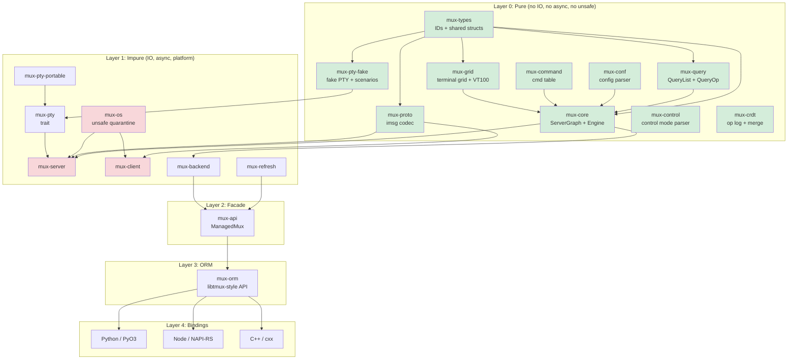
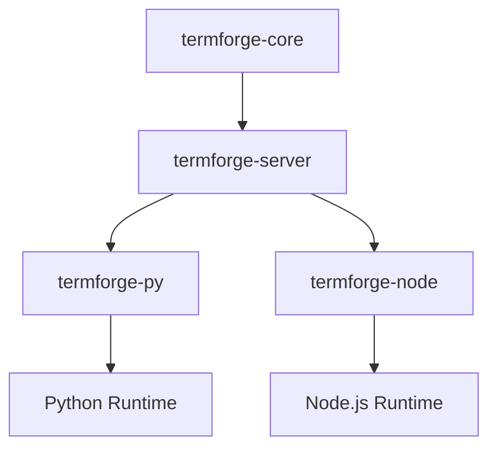

# TermForge v7 Architecture Specification (Pass 2 Refinement)

Date: 2026-02-11
Lineage: v6 (Base) + Claude v7 Pass 1 + GPT v7 Pass 1 + Gemini v7 Pass 2 Refinement
License: MIT OR Apache-2.0
Rust edition: 2024 (MSRV 1.85)
Protocol target: tmux protocol v8

---

## Preamble

This document is the single authoritative architectural reference for TermForge, a Rust terminal multiplexer with 100% tmux wire-protocol compatibility, ORM-like API, language bindings, CRDT collaboration, and a ratatui-based TUI client.

**Repository locations:**
- tmux C source: `~/study/c/tmux/` (behavioral reference)
- Rust prototype: `~/work/rust/vibe-tmux/` (existing crate structure)
- Python libtmux: `~/work/python/libtmux/` (API design reference)
- ratatui: `~/study/rust/ratatui/` (TUI framework)
- zellij: `~/study/rust/zellij/` (multiplexer reference)
- PyO3: `~/study/rust-python/pyo3/` (Python bindings reference)
- Neon: `~/study/rust-node/neon/` (Node.js bindings reference)
- OTEL Rust: `~/study/otel/opentelemetry-rust/` (Telemetry reference)

**Settled decisions (not re-argued):**
1. Vec-inside-entity for parent-child relationships (not SecondaryMap)
2. WASM compilability as CI purity gate (not production target)
3. `mux-types` as separate leaf crate
4. `mux-orm` as separate crate from `mux-api`
5. FakePty ScenarioRecorder with JSON format
6. Defer `im-rs`; use `Arc<Grid>` with `Arc::make_mut` for COW
7. Custom VT100 parser matching tmux `input.c` (17 states)
8. Format string engine as pure function
9. Key binding system with table-based dispatch
10. Copy mode as per-pane `CopyModeState`

**Key v7 refinements:**
- **Language Bindings:** Verified PyO3 0.26 `Python::detach` (replacing `allow_threads`) and Neon `FunctionContext`/`Channel`.
- **Telemetry:** Verified OTEL SDK types (`SdkTracerProvider`, `SpanExporter`, `BatchSpanProcessor`).
- **Versioning:** Unified `tmux-vm` CLI for managing upstream tmux versions for parity testing.
- **Testing:** Dual-mode binding fixtures (socket vs in-process) for comprehensive coverage.
- **Rules:** Expanded AGENTS.md rules including strict binding safety and pure logic separation.

---

## Table of Contents

1. [Vision and Philosophy](#1-vision-and-philosophy)
2. [North Star Acceptance Criteria](#2-north-star-acceptance-criteria)
3. [High-Level Architecture](#3-high-level-architecture)
4. [Workspace Layout](#4-workspace-layout)
5. [Layering Contract](#5-layering-contract)
6. [Entity Model](#6-entity-model)
7. [Event/Effect Engine](#7-eventeffect-engine)
8. [Error Handling](#8-error-handling)
9. [Protocol Codec](#9-protocol-codec)
10. [Configuration System](#10-configuration-system)
11. [Layout Engine](#11-layout-engine)
12. [ORM-like Query API](#12-orm-like-query-api)
13. [Runtime Architecture](#13-runtime-architecture)
14. [Server Lifecycle](#14-server-lifecycle)
15. [Control Mode](#15-control-mode)
16. [Language Bindings](#16-language-bindings)
17. [CRDT Transaction Layer](#17-crdt-transaction-layer)
18. [Security Model](#18-security-model)
19. [OpenTelemetry](#19-opentelemetry)
20. [tmux Version Management](#20-tmux-version-management)
21. [Test Support and Fake PTY](#21-test-support-and-fake-pty)
22. [Binding Test Frameworks](#22-binding-test-frameworks)
23. [Test Framework and Harness Design](#23-test-framework-and-harness-design)
24. [Performance Targets](#24-performance-targets)
25. [Visual Client / TUI](#25-visual-client--tui)
26. [AGENTS.md Rules](#26-agentsmd-rules)
27. [Risks and Mitigations](#27-risks-and-mitigations)
28. [Summary and Changelog](#28-summary-and-changelog)
29. [Reference Anchors](#29-reference-anchors)
30. [Appendix: Canonical Type Quick Reference](#30-appendix-canonical-type-quick-reference)
31. [Supplemental Test Matrix](#31-supplemental-test-matrix)
32. [tmux Citation Verification Table](#32-tmux-citation-verification-table)

---

## 1. Vision and Philosophy

### Core Thesis

TermForge is not a tmux port. It is a **new terminal multiplexer** that speaks tmux's binary protocol (`imsg` over Unix domain sockets). The internal architecture is Rust-native: algebraic types, ownership-tracked state, pure-functional kernel, and async runtime -- while maintaining bit-for-bit compatibility with the tmux wire format.

### Architectural Principles

1. **Pure/Impure Separation (Sans-IO):** The kernel (`mux-core`) is a pure `fn(graph, event) -> (graph, effects)` reducer. It never touches file descriptors, system calls, timers, or network. All IO happens in the runtime layer that interprets `Effect` variants.

2. **tmux is a Compatibility Profile, Not the Architecture:** tmux's `struct session`, `struct window`, `struct window_pane` inform our entity model but do not dictate it. Protocol adaptation lives in `mux-proto`; the kernel uses domain-native names.

3. **Snapshots are the Read Path:** The authoritative state lives in the `ServerGraph`. Readers (UI, bindings, query API) see immutable snapshots published via `ArcSwap`. Writers go through the event/effect engine. This eliminates read contention.

4. **ORM is a Facade, Not the Engine:** `mux-orm` translates user intent into commands/events. It never implements multiplexer logic. It must not become a second business-logic engine.

5. **Layered Testing:** Every layer has its own test strategy. Pure core uses property testing and snapshot testing. Protocol uses fixture-driven roundtrip tests. Runtime uses hermetic servers with fake PTYs.

6. **WASM as Purity Proof:** Layer 0 crates compile to `wasm32-unknown-unknown` as a CI gate, not a production deployment target. This catches accidental OS dependencies.

### Why Not a Direct Port

| Direct Port | TermForge |
|---|---|
| Platform code in the kernel | Platform code quarantined in `mux-os` |
| RB-tree state with manual memory | SlotMap with generation-checked IDs |
| Libevent callback soup | Structured async with tokio tasks |
| CRDTs require invasive surgery | CRDTs compose on top of pure events |
| Testing requires real PTY | Fake PTY backend for deterministic tests |

---

## 2. North Star Acceptance Criteria

### 2.1 Compatibility

| ID | Criterion | Verification |
|---|---|---|
| C1 | Real tmux 3.6+ client attaches to `muxd` | Integration test: `tmux attach -S <sock>` |
| C2 | `mux` client attaches to real tmux 3.6+ server | Integration test via `mux-client` |
| C3 | Protocol v8 imsg framing roundtrips all 35+ `MsgType` variants | `proptest` with arbitrary payloads |
| C4 | Identify burst (13 message types, 100-112) roundtrips correctly | Fixture captures from real tmux |
| C5 | SCM_RIGHTS fd passing preserved through sniff proxy | `tmux-sniff` passthrough test |
| C6 | Command semantics match tmux's 144+ `cmd_table` entries | `tmux-command-audit` parity checks |
| C7 | Format string expansion matches tmux for 200+ variables | `format-audit` parity corpus |
| C8 | Default key bindings match tmux across all 4 key tables | Key table parity tests |

### 2.2 Architectural

| ID | Criterion | Enforcement |
|---|---|---|
| A1 | Layer 0 crates: zero `unsafe`, zero `tokio`, zero `libc` | `#![forbid(unsafe_code)]` in crate root |
| A2 | Layer 0 compiles to `wasm32-unknown-unknown` | CI: `cargo check --target wasm32-unknown-unknown` |
| A3 | `mux-os` is the sole `unsafe` quarantine | CI lint: grep for `unsafe` outside `mux-os` |
| A4 | All state transitions are deterministic | Property: `apply_event(s, e)` is referentially transparent |
| A5 | No panics in protocol decode/encode paths | `#[deny(clippy::unwrap_used)]` in hot crates |
| A6 | Bindings depend only on `mux-api`/`mux-orm` | Cargo dependency check in CI |
| A7 | No `Arc<Mutex<_>>` in the read path | `ArcSwap`-based `StateHandle` |

### 2.3 Product

| ID | Criterion |
|---|---|
| P1 | In-process embedding: create session, split, send keys, read grid -- no process spawning |
| P2 | Python pytest fixture: `server` -> `session` -> `window` -> `pane` in 4 lines |
| P3 | Snapshot test: feed VT100 input, assert grid state via `insta` |
| P4 | CRDT: two servers merge concurrent `new-session` without conflict |
| P5 | TUI client attaches to real tmux server and renders correctly |
| P6 | FakePty scenario replay produces identical grid state to real tmux |

### 2.4 Performance

| ID | Target | Basis |
|---|---|---|
| B1 | VT100 parser, plain ASCII > 300 MB/s | alacritty vte achieves ~500 MB/s |
| B2 | Protocol frame decode > 500 MB/s | 16-byte header + memcpy |
| B3 | Layout resize (20 panes) < 50 us | Tree walk ~60 nodes, no alloc |
| B4 | Graph snapshot < 1 ms | Arc clone + BTreeMap for 50 panes |
| B5 | Option resolve (4-level chain) < 100 ns | 4 BTreeMap lookups |
| B6 | Control notification parse < 200 ns | String split + parse |

These are conservative targets to be validated after establishing baselines from 3 consecutive median runs. CI regression gate: 130% threshold on nightly only.

---

## 3. High-Level Architecture

### The Layer Cake

```
Layer 0  PURE KERNEL     mux-types, mux-core, mux-query, mux-conf,
                          mux-command, mux-grid, mux-control, mux-pty-fake
                          mux-crdt, mux-proto

Layer 1  IMPURE RUNTIME  mux-os, mux-pty, mux-pty-portable, mux-client,
                          mux-server, mux-refresh, mux-backend

Layer 2  FACADE           mux-api (ManagedMux, SocketActor, intents)

Layer 3  ORM              mux-orm (libtmux-style graph + QueryList sugar)

Layer 4  BINDINGS         bindings/python (PyO3), bindings/node (NAPI-RS),
                          crates/mux-cxx (cxx bridge)

Layer 5  TOOLS            tmux-sniff, tmux-vm, tmux-builder, tmux-worktrees,
                          mux-tui, mux-doctor, format-audit, regress-audit,
                          tmux-command-audit, mux-regress
```

### Mermaid Diagram



---

## 4. Workspace Layout

```
termforge/
  Cargo.toml                     # workspace root
  AGENTS.md                      # LLM development guide
  ARCHITECTURE.md                # living architecture doc (this file)
  rust-toolchain.toml
  justfile                       # build/test/audit entry points

  crates/
    -- LAYER 0: PURE (no IO, no async, no unsafe, no time) --
    mux-types/                   # Shared newtypes: SessionId, WindowId, PaneId, etc.
      src/
        lib.rs
        ids.rs                   # SlotMap key types
        size.rs                  # PaneSize, Rect, WindowSize, SplitDirection
        options.rs               # OptionScope, OptionValue
        errors.rs                # Shared error types: ErrorClass, Classified trait
    mux-core/                    # Pure kernel: ServerGraph, Event, Effect, apply_event
      src/
        lib.rs
        graph.rs                 # ServerGraph (SlotMap-backed entity store)
        session.rs               # Session entity
        window.rs                # Window entity
        pane.rs                  # Pane entity + PaneMode
        client.rs                # Client entity + ClientKeyState
        job.rs                   # Job entity
        buffer.rs                # Buffer entity (paste buffers)
        event.rs                 # Event enum
        effect.rs                # Effect enum
        engine.rs                # apply_event() pure reducer
        context.rs               # ClientContext resolution
        state.rs                 # GraphState snapshots
        facade.rs                # ServerFacade (command string -> event)
        handle.rs                # GraphHandle (read-only accessor)
        layout.rs                # LayoutTree + tiling algorithms
        format.rs                # Format string expansion engine
        key_table.rs             # Key tables + bindings (pure model)
        copy_mode.rs             # Copy mode state machine
        environ.rs               # Environment variable store
        command/                 # Per-command handlers (pure)
          mod.rs
          new_session.rs
          new_window.rs
          split_window.rs
          select_pane.rs
          send_keys.rs
          set_option.rs
          display_message.rs
          ...                    # one file per tmux command (~80 files)
    mux-grid/                    # Terminal grid + VT100 state machine
      src/
        lib.rs
        grid.rs                  # Grid (row/column cell storage)
        cell.rs                  # Cell (character + style attributes)
        row.rs                   # Row (line storage, wrapping)
        cursor.rs                # Cursor state
        style.rs                 # Style attributes (fg, bg, attrs)
        parser.rs                # VT100 table-driven state machine
        parser_tables.rs         # State transition tables (from input.c)
        csi.rs                   # CSI command dispatch (39 commands)
        osc.rs                   # OSC command dispatch
        sgr.rs                   # SGR (Select Graphic Rendition)
        esc.rs                   # ESC sequence dispatch
        scrollback.rs            # Scrollback buffer management
        hyperlinks.rs            # OSC 8 hyperlink tracking
        snapshot.rs              # Grid snapshot for insta testing
    mux-query/                   # QueryList, QueryOp, Queryable derive
      src/
        lib.rs
        ops.rs                   # QueryOp enum
        value.rs                 # QueryValue
        spec.rs                  # QuerySpec, QueryTerm
        list.rs                  # QueryList<T: Queryable>
    mux-conf/                    # tmux.conf parser (PURE -- no file IO)
      src/
        lib.rs
        ast.rs                   # Config AST nodes
        lexer.rs                 # Tokenizer
        parser.rs                # Config file parser
        options.rs               # Option table + defaults
    mux-command/                 # Command table + dispatch
      src/
        lib.rs
        table.rs                 # Command table (from tmux cmd.c)
    mux-control/                 # Control mode parser (%output, %begin, etc.)
      src/
        lib.rs
        notification.rs          # ControlNotification enum (typed)
        parser.rs                # %%notification line parser
    mux-proto/                   # imsg framing + MsgType + payload parsers
      src/
        lib.rs
        frame.rs                 # ImsgHdr (16-byte header)
        msg.rs                   # MsgType enum (35+ variants)
        codec.rs                 # ImsgCodec (two-phase decode)
        payload.rs               # Typed payload structs
        identify.rs              # IdentifyBurst builder
        fixture.rs               # Capture file loading
        error.rs                 # ProtocolError
    mux-crdt/                    # CrdtOp, HLC, DVV, merge semantics
      src/
        lib.rs
        op.rs                    # CrdtOp enum
        clock.rs                 # HybridLogicalClock + HlcTimestamp
        dvv.rs                   # Dotted version vectors
        register.rs              # LwwRegister<T>
        set.rs                   # OrSet<T>
        oplog.rs                 # OpLog + compaction
        merge.rs                 # Merge resolution
    mux-pty/                     # PtyBackend trait (pure interface)
      src/lib.rs
    mux-pty-fake/                # FakePty + ScenarioRecorder/Replayer (PURE)
      src/
        lib.rs
        scenario.rs              # PtyScenario, ScenarioEvent
        recorder.rs              # ScenarioRecorder<B: PtyBackend>
        replayer.rs              # ScenarioReplayer

    -- LAYER 1: IMPURE (IO, async, platform) --
    mux-os/                      # unsafe quarantine: SCM_RIGHTS, signals
      SAFETY.md
      src/
        lib.rs
        pty.rs                   # PTY creation + management
        scm_rights.rs            # SCM_RIGHTS FD passing
        socket.rs                # Unix socket creation
        signal.rs                # Signal handling
        fd.rs                    # FD lifecycle + close-on-drop
        lock.rs                  # LockFile (flock-based)
    mux-pty-portable/            # portable-pty based backend
    mux-server/                  # tokio runtime, socket accept loop
    mux-client/                  # client connection, control mode
    mux-backend/                 # Backend trait: Local + Tmux
    mux-refresh/                 # StateStore + ArcSwap + RefreshPlanner
    mux-test-support/            # TmuxTestServer, PathGuard, hermetic isolation
    mux-view/                    # Immutable view types for snapshots
    mux-telemetry/               # tracing span context + OTEL

    -- LAYER 2: FACADE --
    mux-api/                     # ManagedMux, MuxBackend, intent API

    -- LAYER 3: ORM --
    mux-orm/                     # libtmux-style graph traversal + QueryList
      src/
        lib.rs
        server.rs                # OrmServer
        session.rs               # OrmSession
        window.rs                # OrmWindow
        pane.rs                  # OrmPane

    -- SUPPORT --
    mux-cxx/                     # cxx bridge

  tools/
    tmux-sniff/                  # Protocol sniffer (preserves SCM_RIGHTS)
    tmux-vm/                     # tmux version manager (ensure/exec)
    tmux-builder/                # Build tmux from source
    tmux-worktrees/              # Git worktree manager for tmux source
    tmux-command-audit/          # Command coverage tracker
    format-audit/                # Format variable alignment checker
    regress-audit/               # Run tmux regress suite
    mux-regress/                 # Parity harness (both servers)
    mux-tui/                     # Rust-native TUI client
    mux-doctor/                  # Diagnostic tool

  bindings/
    python/
      Cargo.toml
      pyproject.toml             # maturin + uv
      src/lib.rs
      python/termforge/
        __init__.py
        _native.pyi
        pytest_plugin.py         # hermetic pytest fixtures
      tests/
        conftest.py
        test_server.py
        test_query.py
    node/
      Cargo.toml
      package.json               # pnpm
      src/lib.rs
      __test__/
        server.spec.ts           # vitest tests
      vitest.config.ts

  fixtures/
    captures/                    # Binary protocol captures from real tmux
    grids/                       # Terminal grid snapshots for insta
    configs/                     # tmux.conf samples
    scenarios/                   # FakePty scenario recordings (JSON)

  fuzz/
    decode_frame.rs              # Protocol decoder fuzz target
    parse_vt100.rs               # VT100 parser fuzz target
    parse_format.rs              # Format string parser fuzz target
```

### Purity Classification

| Crate | Pure | Async | Unsafe | WASM CI |
|---|---|---|---|---|
| mux-types | Yes | No | No | Yes |
| mux-core | Yes | No | No | Yes |
| mux-grid | Yes | No | No | Yes |
| mux-query | Yes | No | No | Yes |
| mux-conf | Yes | No | No | Yes |
| mux-command | Yes | No | No | Yes |
| mux-proto | Yes | No | No | Yes |
| mux-control | Yes | No | No | Yes |
| mux-pty-fake | Yes | No | No | Yes |
| mux-crdt | Yes | No | No | Yes |
| mux-pty | Trait only | No | No | No |
| mux-os | No | No | **Yes** | No |
| mux-server | No | Yes | No | No |
| mux-client | No | Yes | No | No |
| mux-backend | No | Yes | No | No |
| mux-refresh | No | Yes | No | No |
| mux-api | No | Yes | No | No |
| mux-orm | No | Yes | No | No |

---

## 5. Layering Contract

### Hard Boundaries

**Boundary A -- Core is Deterministic:**

The core never asks the operating system for anything. No `SystemTime::now()`, no `std::fs`, no `rand()`, no `std::thread`. If the core needs a timestamp, it receives one via an `Event` variant. If it needs randomness, it receives a seed via `CoreCtx`.

```rust
// WRONG -- core asking the OS
pub fn create_session(graph: &mut ServerGraph) -> SessionId {
    let name = format!("session-{}", SystemTime::now().elapsed().unwrap().as_secs());
    graph.create_session(name)
}

// RIGHT -- core receiving information via events
pub fn apply_event(graph: &mut ServerGraph, event: Event, ctx: &CoreCtx) -> ApplyOutcome {
    match event {
        Event::CreateSession { name, created_at } => {
            let id = graph.create_session(name);
            ApplyOutcome { created_session: Some(id), ..Default::default() }
        }
        // ...
    }
}
```

**Boundary B -- Snapshots are the Read Path:**

The `ServerGraph` is mutated only through `apply_event()`. After mutation, the runtime publishes a `GraphState` snapshot through `ArcSwap`. All readers read from the snapshot, never from the mutable graph.

```rust
// crates/mux-refresh/src/lib.rs
pub struct StateStore<T> {
    inner: Arc<ArcSwap<T>>,
}

pub struct StateHandle<T> {
    inner: Arc<ArcSwap<T>>,
}

impl<T> StateHandle<T> {
    /// Lock-free read via ArcSwap::load()
    pub fn with_read<R>(&self, f: impl FnOnce(&T) -> R) -> R {
        let guard = self.inner.load();
        f(&guard)
    }
}
```

**Boundary C -- tmux Compatibility is an Adapter:**

The core uses domain-native names. tmux protocol specifics (`MsgType::IdentifyFlags`, imsg framing) live entirely in `mux-proto`. The server runtime translates between the two:

```rust
// mux-server: translates protocol frame -> core event
fn translate_command(frame: &ImsgFrame) -> Result<Event, ProtocolError> {
    let args = parse_command_args(&frame.payload)?;
    Ok(Event::Command { name: args[0].clone(), args: args[1..].to_vec() })
}
```

**Boundary D -- ORM API is a Facade:**

The ORM translates intent into commands. It never implements window splitting, session creation, or layout algorithms.

### Enforcement

| Rule | Mechanism |
|---|---|
| Pure crates: no `tokio`, `async`, `unsafe` | `#![forbid(unsafe_code)]` + CI WASM check |
| One-way deps: bindings -> orm -> api -> backend -> core | `cargo deny check` |
| No `Arc<Mutex>` on read path | Code review + clippy config |
| No panics in protocol/server | `#[deny(clippy::unwrap_used, clippy::expect_used)]` |
| `unsafe` only in `mux-os` | CI: `grep -r "unsafe" --include="*.rs" crates/ \| grep -v mux-os` |

---

## 6. Entity Model

### 6.1 Typed ID Declarations (mux-types)

```rust
// crates/mux-types/src/ids.rs
use slotmap::new_key_type;

new_key_type! {
    /// Unique identifier for a session within the server.
    /// Generation-checked: stale IDs safely return None on lookup.
    pub struct SessionId;
    pub struct WindowId;
    pub struct PaneId;
    pub struct ClientId;
    pub struct JobId;
    pub struct BufferId;
}
```

```rust
// crates/mux-types/src/size.rs
#[derive(Debug, Clone, Copy, PartialEq, Eq, Hash)]
pub struct PaneSize {
    pub cols: u16,
    pub rows: u16,
}

impl PaneSize {
    pub const DEFAULT: Self = Self { cols: 80, rows: 24 };
}

#[derive(Debug, Clone, Copy, PartialEq, Eq)]
pub struct Rect {
    pub x: u16,
    pub y: u16,
    pub width: u16,
    pub height: u16,
}

#[derive(Debug, Clone, Copy, PartialEq, Eq)]
pub enum SplitDirection {
    Horizontal,
    Vertical,
}
```

### 6.2 Entity Structs (mux-core)

**Decision (settled): Vec inside entities for parent-child relationships.** Reverse lookups computed during snapshot construction. This matches the proven vibe-tmux code at `~/work/rust/vibe-tmux/crates/mux-core/src/graph.rs` where `session.windows: Vec<WindowId>` and reverse maps are built in `graph_state()` at lines 218-229.

```rust
/// crates/mux-core/src/session.rs
#[derive(Debug, Clone)]
pub struct Session {
    pub name: String,
    pub cwd: String,
    pub windows: Vec<WindowId>,           // ordered child list (forward only)
    pub active_window: Option<WindowId>,
    pub last_window: Option<WindowId>,
    pub created_at: i64,                  // injected via Event, not from OS
    pub last_attached_at: i64,
    pub destroying: bool,
    pub options: SessionOptions,
    pub environ: EnvironMap,
}

/// crates/mux-core/src/window.rs
#[derive(Debug, Clone)]
pub struct Window {
    pub name: String,
    pub panes: Vec<PaneId>,              // ordered child list (forward only)
    pub active_pane: Option<PaneId>,
    pub last_active_pane: Option<PaneId>,
    pub layout_root: LayoutTree,
    pub size: WindowSize,
    pub flags: WindowFlags,
    pub options: WindowOptions,
}

/// crates/mux-core/src/pane.rs
#[derive(Debug, Clone)]
pub struct Pane {
    pub size: PaneSize,
    pub bounds: Option<Rect>,
    pub exited: bool,
    pub exit_status: Option<i32>,
    pub start_command: String,
    pub start_path: String,
    pub mode: PaneMode,
    pub title: String,
    pub grid: Arc<Grid>,                 // shared; copy-on-write via Arc::make_mut
    pub parser: Parser,                  // VT100 state machine
    pub copy_mode: Option<CopyModeState>,
}

#[derive(Debug, Clone, Copy, PartialEq, Eq)]
pub enum PaneMode {
    Normal,
    CopyMode,
    ViewMode,
}

/// crates/mux-core/src/client.rs
#[derive(Debug, Clone)]
pub struct Client {
    pub name: String,
    pub session: Option<SessionId>,
    pub last_session: Option<SessionId>,
    pub tty_name: String,
    pub term_type: String,
    pub features: u32,
    pub flags: ClientFlags,
    pub size: PaneSize,
    pub key_state: ClientKeyState,       // key table dispatch state
}

/// crates/mux-core/src/buffer.rs
#[derive(Debug, Clone)]
pub struct Buffer {
    pub name: String,
    pub data: Vec<u8>,
    pub created_at: i64,
}
```

### 6.3 The ServerGraph

```rust
// crates/mux-core/src/graph.rs
use slotmap::SlotMap;

#[derive(Debug, Default, Clone)]
pub struct ServerGraph {
    sessions: SlotMap<SessionId, Session>,
    windows:  SlotMap<WindowId, Window>,
    panes:    SlotMap<PaneId, Pane>,
    clients:  SlotMap<ClientId, Client>,
    jobs:     SlotMap<JobId, Job>,
    buffers:  SlotMap<BufferId, Buffer>,
    key_tables: KeyTableSet,
    global_options: GlobalOptions,
    global_session_options: SessionOptions,
    global_window_options: WindowOptions,
    global_environ: EnvironMap,
}

impl ServerGraph {
    pub fn new() -> Self { Self::default() }

    // --- Creation ---
    pub fn create_session(&mut self, name: impl Into<String>) -> SessionId;
    pub fn create_window(&mut self, name: impl Into<String>) -> WindowId;
    pub fn create_pane(&mut self, size: PaneSize) -> PaneId;
    pub fn create_client(&mut self, name: impl Into<String>) -> ClientId;
    pub fn create_buffer(&mut self, name: impl Into<String>, data: Vec<u8>) -> BufferId;

    // --- Lookup (O(1), generation-checked) ---
    pub fn session(&self, id: SessionId) -> Option<&Session>;
    pub fn session_mut(&mut self, id: SessionId) -> Option<&mut Session>;
    pub fn window(&self, id: WindowId) -> Option<&Window>;
    pub fn window_mut(&mut self, id: WindowId) -> Option<&mut Window>;
    pub fn pane(&self, id: PaneId) -> Option<&Pane>;
    pub fn pane_mut(&mut self, id: PaneId) -> Option<&mut Pane>;
    pub fn client(&self, id: ClientId) -> Option<&Client>;
    pub fn client_mut(&mut self, id: ClientId) -> Option<&mut Client>;

    // --- Relationship management ---
    pub fn add_window_to_session(&mut self, session: SessionId, window: WindowId) -> bool;
    pub fn add_pane_to_window(&mut self, window: WindowId, pane: PaneId) -> bool;
    pub fn attach_client(&mut self, client: ClientId, session: SessionId) -> bool;
    pub fn panes_in_window(&self, window: WindowId) -> Vec<PaneId>;

    // --- Context resolution ---
    pub fn client_context(&self, client: ClientId) -> ClientContext;

    // --- Snapshot (reverse lookups computed here) ---
    /// Build an immutable GraphState with reverse lookups.
    /// Reference: ~/work/rust/vibe-tmux/crates/mux-core/src/graph.rs:217-229
    pub fn graph_state(&self) -> GraphState {
        let mut window_to_session = HashMap::new();
        for (session_id, session) in &self.sessions {
            for window_id in &session.windows {
                window_to_session.insert(*window_id, session_id);
            }
        }
        let mut pane_to_window = HashMap::new();
        for (window_id, window) in &self.windows {
            for pane_id in &window.panes {
                pane_to_window.insert(*pane_id, window_id);
            }
        }
        // ... build GraphState with reverse lookups included
        todo!()
    }
}
```

### 6.4 Relationship Model

```
Server (implicit singleton)
  |-- sessions: SlotMap<SessionId, Session>
  |     |-- windows: Vec<WindowId>  (ordered, forward-only)
  |     |-- active_window: Option<WindowId>
  |     |-- last_window: Option<WindowId>
  |
  |-- windows: SlotMap<WindowId, Window>
  |     |-- panes: Vec<PaneId>  (ordered, forward-only)
  |     |-- active_pane: Option<PaneId>
  |     |-- layout_root: LayoutTree
  |
  |-- panes: SlotMap<PaneId, Pane>
  |     |-- grid: Arc<Grid>  (terminal state, COW for snapshots)
  |     |-- parser: Parser  (VT100 state machine)
  |     |-- copy_mode: Option<CopyModeState>
  |
  |-- clients: SlotMap<ClientId, Client>
  |     |-- session: Option<SessionId>  (attached session)
  |     |-- key_state: ClientKeyState  (key table stack)
  |
  |-- key_tables: KeyTableSet  (prefix, root, copy-mode, copy-mode-vi)
  |-- buffers: SlotMap<BufferId, Buffer>  (paste buffers)
  |-- jobs: SlotMap<JobId, Job>
```

### 6.5 Entity Model Test Strategy

1. **SlotMap generation safety:** Create entity, remove it, verify old ID returns `None`.
2. **Relationship integrity:** Add window to session, verify `session.windows` contains it.
3. **Snapshot reverse lookups:** Create session/window/pane chain, build `graph_state()`, verify `pane_to_window` and `window_to_session` maps.
4. **Property test:** Random create/remove sequences never panic, all IDs resolve or return `None`.
5. **Clone isolation:** Clone graph, mutate clone, verify original unchanged.
6. **Concurrent snapshot:** Publish snapshot, modify graph, verify snapshot still reads old state.

---

## 7. Event/Effect Engine

### Core Signature

```rust
/// crates/mux-core/src/engine.rs
///
/// Apply an event to the graph, returning effects for the runtime to execute.
/// This is the heart of the Sans-IO architecture:
/// - Pure: no IO, no async, no randomness
/// - Deterministic: same (graph, event, ctx) always produces same (graph', effects)
/// - Total: every Event variant is handled
pub fn apply_event(
    graph: &mut ServerGraph,
    event: Event,
    ctx: &CoreCtx,
) -> ApplyOutcome {
    match event {
        Event::CreateSession { .. } => { /* ... */ }
        Event::Key { .. } => { /* key dispatch via key tables */ }
        Event::CopyModeAction { pane_id, action } => {
            apply_copy_mode_event(graph, pane_id, action)
        }
        Event::PaneOutput { pane_id, data } => {
            apply_pane_output(graph, pane_id, &data)
        }
        // ... exhaustive match
    }
}

/// Determinism controls: explicit injection for time and randomness.
#[derive(Clone, Copy, Debug)]
pub struct CoreCtx {
    pub now_ms: u64,
    pub rand_u64: u64,
}

#[derive(Debug, Default, Clone)]
pub struct ApplyOutcome {
    pub effects: Vec<Effect>,
    pub created_session: Option<SessionId>,
    pub created_window: Option<WindowId>,
    pub created_pane: Option<PaneId>,
    pub error: Option<CoreError>,
}

impl ApplyOutcome {
    pub fn with_effects(effects: Vec<Effect>) -> Self {
        Self { effects, ..Default::default() }
    }
}
```

### Event Enum

```rust
/// crates/mux-core/src/event.rs
#[derive(Debug, Clone)]
#[non_exhaustive]
pub enum Event {
    // === Lifecycle ===
    CreateSession { name: String, cwd: Option<String>, created_at: i64 },
    DestroySession { session_id: SessionId },
    CreateWindow { session_id: SessionId, name: String },
    DestroyWindow { window_id: WindowId },
    CreatePane { window_id: WindowId, size: PaneSize, command: Vec<String>,
                 cwd: Option<String> },
    DestroyPane { pane_id: PaneId },

    // === Navigation ===
    SelectWindow { session_id: SessionId, window_id: WindowId },
    SelectWindowByIndex { session_id: SessionId, index: usize },
    NextWindow { session_id: SessionId },
    PreviousWindow { session_id: SessionId },
    SelectLastWindow { session_id: SessionId },
    SelectPane { window_id: WindowId, pane_id: PaneId },
    SelectNextPane { window_id: WindowId },
    SelectPrevPane { window_id: WindowId },
    SelectLastPane { window_id: WindowId },

    // === Mutation ===
    RenameSession { session_id: SessionId, name: String },
    RenameWindow { window_id: WindowId, name: String },
    ResizePane { pane_id: PaneId, size: PaneSize },
    SplitWindow { window_id: WindowId, direction: SplitDirection, size: PaneSize,
                  command: Vec<String>, cwd: Option<String> },

    // === Client ===
    ClientAttach { client_id: ClientId, session_id: SessionId },
    ClientDetach { client_id: ClientId },
    ClientResize { client_id: ClientId, size: PaneSize },

    // === IO Responses (runtime -> core) ===
    PaneExited { pane_id: PaneId, exit_status: i32 },
    PaneOutput { pane_id: PaneId, data: Vec<u8> },
    JobExited { job_id: JobId, exit_status: i32 },

    // === Input ===
    Key { client_id: ClientId, key: KeyCode },
    Command { name: String, args: Vec<String>, client_id: Option<ClientId> },

    // === Copy Mode ===
    EnterCopyMode { pane_id: PaneId, view_mode: bool },
    CopyModeAction { pane_id: PaneId, action: CopyModeAction },

    // === Options ===
    SetOption { scope: OptionScope, key: String, value: OptionValue },

    // === Paste Buffers ===
    SetBuffer { name: String, data: Vec<u8> },
    PasteBuffer { pane_id: PaneId, buffer_name: Option<String> },

    // === Effect Failure Feedback (runtime -> core) ===
    EffectFailed { token: EffectToken, reason: String },

    // === Time (injected by runtime) ===
    Tick { now_millis: i64 },
}
```

### Effect Enum

```rust
/// crates/mux-core/src/effect.rs
#[derive(Debug, Clone)]
#[non_exhaustive]
pub enum Effect {
    // === PTY ===
    SpawnPane { pane_id: PaneId, command: Vec<String>, cwd: Option<String>,
                size: PaneSize },
    KillPane { pane_id: PaneId, signal: i32 },
    WritePane { pane_id: PaneId, data: Vec<u8> },
    ResizePty { pane_id: PaneId, size: PaneSize },

    // === Display ===
    Redraw { scope: RedrawScope },

    // === Client ===
    NotifyClient { client_id: ClientId, message: String },
    SendToClient { client_id: ClientId, frame: FrameData },
    DisconnectClient { client_id: ClientId },
    ErrorReply { client_id: ClientId, message: String },

    // === Timers ===
    StartTimer { token: TimerToken, after_ms: u64 },
    CancelTimer { token: TimerToken },

    // === Job ===
    StartJob { job_id: JobId, command: Vec<String> },
    StopJob { job_id: JobId },

    // === Server ===
    Shutdown,
    PublishSnapshot,
    Log { level: LogLevel, message: String },
}

#[derive(Debug, Clone)]
pub enum RedrawScope {
    All,
    Session(SessionId),
    Window(WindowId),
    Pane(PaneId),
    StatusLine,
}
```

### PaneOutput Handling (VT100 -> Grid)

```rust
fn apply_pane_output(graph: &mut ServerGraph, pane_id: PaneId, data: &[u8]) -> ApplyOutcome {
    let Some(pane) = graph.pane_mut(pane_id) else {
        return ApplyOutcome::default();
    };

    // Get a mutable reference to the grid (Arc::make_mut for COW)
    let grid = Arc::make_mut(&mut pane.grid);

    // Parse VT100 sequences and update the grid (pure)
    let parser_effects = pane.parser.parse(data, grid);

    // Convert parser effects to engine effects
    let mut effects = vec![Effect::Redraw { scope: RedrawScope::Pane(pane_id) }];
    for pe in parser_effects {
        match pe {
            ParserEffect::Reply(bytes) => {
                effects.push(Effect::WritePane { pane_id, data: bytes });
            }
            ParserEffect::TitleChanged(title) => {
                pane.title = title;
                effects.push(Effect::Redraw { scope: RedrawScope::StatusLine });
            }
            ParserEffect::Bell => {
                effects.push(Effect::Redraw { scope: RedrawScope::StatusLine });
            }
            _ => {}
        }
    }

    ApplyOutcome::with_effects(effects)
}
```

### Event/Effect Engine Test Strategy

1. **Determinism property test:** Applying the same event sequence to two fresh graphs produces identical `GraphState`.
2. **Session lifecycle:** Create session -> add window -> add pane -> destroy pane -> verify cleanup.
3. **PaneOutput roundtrip:** Feed VT100 bytes, verify grid content via `insta` snapshot.
4. **Key dispatch:** Bind key in prefix table, send prefix then key, verify command executed.
5. **Effect generation:** `CreatePane` event produces `Effect::SpawnPane` with correct args.
6. **Error propagation:** Invalid command produces `ApplyOutcome` with `error: Some(CoreError)`.
7. **Copy mode enter/exit:** Enter copy mode, perform actions, cancel, verify pane mode restored.
8. **Timer lifecycle:** Prefix key starts timer, bound key cancels it.

```rust
#[cfg(test)]
mod property_tests {
    use super::*;
    use proptest::prelude::*;

    fn arb_session_name() -> impl Strategy<Value = String> {
        "[a-z][a-z0-9-]{0,20}".prop_filter("non-empty", |s| !s.is_empty())
    }

    proptest! {
        /// Applying the same event sequence to two fresh graphs produces identical state.
        #[test]
        fn engine_is_deterministic(
            names in prop::collection::vec(arb_session_name(), 1..10)
        ) {
            let ctx = CoreCtx { now_ms: 0, rand_u64: 0 };
            let events: Vec<_> = names.iter().map(|n| Event::CreateSession {
                name: n.clone(), cwd: None, created_at: 0,
            }).collect();

            let mut g1 = ServerGraph::new();
            let mut g2 = ServerGraph::new();

            for event in &events {
                let _ = apply_event(&mut g1, event.clone(), &ctx);
                let _ = apply_event(&mut g2, event.clone(), &ctx);
            }

            prop_assert_eq!(g1.graph_state(), g2.graph_state());
        }
    }
}
```

---

## 8. Error Handling

### 8.1 Error Classification System

All v5 outputs independently converged on the same four-category taxonomy. This is definitive.

```rust
// crates/mux-types/src/error_class.rs
#![forbid(unsafe_code)]

/// Classification of errors for recovery policy decisions.
/// Reference: tmux "goto bad -> proc_kill_peer" at
/// server-client.c:3472-3475 maps to ProtocolViolation.
#[derive(Debug, Clone, Copy, PartialEq, Eq, Hash)]
pub enum ErrorClass {
    /// Transient: retry or wait for more data.
    /// Examples: incomplete frame, timeout, temporary IO failure.
    /// Recovery: retry with backoff, keep connection.
    Transient,

    /// Protocol violation: peer sent structurally invalid data.
    /// Examples: bad magic, length overflow, unknown msg type.
    /// Recovery: kill connection, log, keep server alive.
    ProtocolViolation,

    /// User error: semantically invalid request from valid connection.
    /// Examples: unknown command, invalid option, target not found.
    /// Recovery: send error reply, keep connection.
    UserError,

    /// Bug / invariant violation: internal consistency failure.
    /// Examples: dangling entity ID, impossible state.
    /// Recovery: log with full context, crash in debug.
    Bug,
}
```

### 8.2 Classified Trait

```rust
/// Every error type implements this for recovery dispatch.
pub trait Classified {
    fn class(&self) -> ErrorClass;
}

// Per-crate implementations:
impl Classified for ProtocolError {
    fn class(&self) -> ErrorClass {
        match self {
            ProtocolError::Incomplete => ErrorClass::Transient,
            ProtocolError::LengthTooSmall { .. }
            | ProtocolError::LengthTooLarge { .. }
            | ProtocolError::UnknownMessageType { .. }
            | ProtocolError::InvalidPayload { .. }
            | ProtocolError::MissingNul { .. }
            | ProtocolError::InvalidUtf8 { .. }
            | ProtocolError::NotIdentifyMessage { .. } => ErrorClass::ProtocolViolation,
        }
    }
}

impl Classified for CoreError {
    fn class(&self) -> ErrorClass {
        match self {
            CoreError::Entity(_)
            | CoreError::InvalidCommand { .. }
            | CoreError::InvalidOption { .. }
            | CoreError::LayoutConstraint { .. }
            | CoreError::CopyMode { .. } => ErrorClass::UserError,
            CoreError::FormatExpansion { .. } => ErrorClass::Bug,
        }
    }
}
```

### 8.3 Codec Recovery: DecodeOutcome

**Critical correction from v5:** Malformed frames cannot be dropped while keeping the connection alive. tmux kills the peer on protocol violations (`server-client.c:3472-3475`: `goto bad` -> `proc_kill_peer`). The correct behavior is: `ProtocolViolation` -> close connection.

```rust
// crates/mux-proto/src/codec.rs

/// Outcome of decoding one frame from the buffer.
pub enum DecodeOutcome {
    /// Need more bytes.
    NeedMore,
    /// Successfully decoded a frame.
    Frame(ImsgFrame),
    /// Unrecoverable protocol error. Close this connection.
    ProtocolViolation(ProtocolError),
}
```

### 8.4 Connection Handler (cross-ref: Section 9 Protocol Codec, Section 18 Security)

```rust
// crates/mux-server/src/conn.rs

async fn handle_client_data(
    conn: &mut ClientConn,
    buf: &[u8],
) -> ConnectionAction {
    conn.codec.feed(buf);
    loop {
        match conn.codec.try_decode_one() {
            DecodeOutcome::NeedMore => return ConnectionAction::Continue,
            DecodeOutcome::Frame(frame) => {
                if let Err(e) = process_frame(conn, frame).await {
                    match e.class() {
                        ErrorClass::ProtocolViolation | ErrorClass::Bug => {
                            tracing::warn!(
                                client_id = %conn.id,
                                error = %e,
                                "killing connection: {:?}", e.class()
                            );
                            return ConnectionAction::Kill(e.to_string());
                        }
                        ErrorClass::UserError => {
                            send_error_to_client(conn, &e).await;
                        }
                        ErrorClass::Transient => { /* should not happen post-decode */ }
                    }
                }
            }
            DecodeOutcome::ProtocolViolation(e) => {
                tracing::warn!(
                    client_id = %conn.id, error = %e,
                    "codec protocol violation, killing connection"
                );
                return ConnectionAction::Kill(e.to_string());
            }
        }
    }
}

pub enum ConnectionAction {
    Continue,
    Kill(String),
}
```

### 8.5 Pure Error Boundary

`io::Error` and platform types must not cross the pure/impure boundary. The runtime converts IO failures to `Event::EffectFailed` carrying a stable domain error string. This keeps `mux-core` free of platform types.

### 8.6 Error Handling Test Strategy

1. **Fuzz testing:** `fuzz/decode_frame.rs` feeds arbitrary bytes to `ImsgCodec`, asserts never panics, always returns one of three `DecodeOutcome` variants.
2. **Classification coverage:** Unit test that every variant of every error enum returns a valid `ErrorClass`.
3. **Recovery integration:** Feed valid frame then garbage bytes. Verify connection killed.
4. **Error propagation:** Trigger each `CoreError` variant, verify `Effect::ErrorReply`.
5. **Protocol violation:** Send identify message after already identified. Verify kill (matches `server-client.c:3597-3600`).
6. **Pure boundary:** Verify `mux-core` error types contain no `std::io::Error` fields.
7. **thiserror derivation:** Every library crate error enum derives `thiserror::Error`. `anyhow` only in binaries and tests.

---

## 9. Protocol Codec

### Wire Format

tmux uses OpenBSD's imsg framing. Every message is:

```
+----------+----------+----------+----------+------------+
|  type    |   len    |  peerid  |   pid    |  payload   |
|  (u32)   |  (u32)   |  (u32)   |  (u32)   |  (var)     |
+----------+----------+----------+----------+------------+
    4          4          4          4       0..16368 bytes
```

All fields are **native endianness** (client and server always on same machine). `len` includes the 16-byte header. High bit (`0x8000_0000`) of `len` is `IMSG_FD_FLAG`, indicating an FD is passed via SCM_RIGHTS ancillary data.

Reference: `tmux-protocol.h:23` defines `PROTOCOL_VERSION 8`.

### ImsgHdr

```rust
// crates/mux-proto/src/frame.rs
pub const IMSG_HEADER_SIZE: usize = 16;
pub const IMSG_FD_FLAG: u32 = 0x8000_0000;

#[derive(Debug, Clone, Copy, PartialEq, Eq)]
pub struct ImsgHdr {
    pub msg_type: u32,
    pub len: u32,        // actual length (FD flag masked off)
    pub peerid: u32,
    pub pid: u32,
    pub has_fd: bool,
}

impl ImsgHdr {
    pub fn decode<B: Buf>(buf: &mut B) -> Result<Self, ProtocolError>;
    pub fn encode<B: BufMut>(&self, buf: &mut B);
    pub const fn payload_len(&self) -> u32 { self.len - IMSG_HEADER_SIZE as u32 }
}
```

### Two-Phase Codec

```rust
// crates/mux-proto/src/codec.rs
pub struct ImsgCodec {
    pending_header: Option<ImsgHdr>,
}

impl ImsgCodec {
    pub fn new() -> Self {
        Self { pending_header: None }
    }

    /// Feed raw bytes into the codec buffer.
    pub fn feed(&mut self, data: &[u8]) { /* append to internal BytesMut */ }

    /// Try to decode one frame. Returns DecodeOutcome.
    /// Phase 1: decode header (16 bytes)
    /// Phase 2: decode payload (header.payload_len bytes)
    pub fn try_decode_one(&mut self) -> DecodeOutcome { /* ... */ }
}

impl Decoder for ImsgCodec {
    type Item = ImsgFrame;
    type Error = io::Error;

    fn decode(&mut self, src: &mut BytesMut) -> Result<Option<ImsgFrame>, io::Error> {
        // Phase 1: decode header (16 bytes)
        let header = match self.pending_header.take() {
            Some(h) => h,
            None => {
                if src.len() < IMSG_HEADER_SIZE { return Ok(None); }
                let header_bytes = src.split_to(IMSG_HEADER_SIZE);
                ImsgHdr::decode(&mut &header_bytes[..])?
            }
        };

        // Phase 2: decode payload
        let payload_len = header.payload_len() as usize;
        if src.len() < payload_len {
            self.pending_header = Some(header);
            return Ok(None);
        }

        let payload = src.split_to(payload_len);
        Ok(Some(ImsgFrame { header, payload }))
    }
}
```

### MsgType Enum

Reference: `tmux-protocol.h:26-71`. All 35+ variants with their numeric values.

```rust
#[derive(Debug, Clone, Copy, PartialEq, Eq, Hash)]
#[repr(u32)]
pub enum MsgType {
    Version = 12,
    // Identify burst (100-112)
    IdentifyFlags = 100,
    IdentifyTerm = 101,
    IdentifyTtyname = 102,
    IdentifyOldcwd = 103,    // unused
    IdentifyStdin = 104,     // has_fd = true
    IdentifyEnviron = 105,   // repeatable
    IdentifyDone = 106,
    IdentifyClientpid = 107,
    IdentifyCwd = 108,
    IdentifyFeatures = 109,
    IdentifyStdout = 110,    // has_fd = true
    IdentifyLongflags = 111,
    IdentifyTerminfo = 112,  // repeatable
    // Commands and responses (200-218)
    Command = 200,
    Detach = 201,
    DetachKill = 202,
    Exit = 203,
    Exited = 204,
    Exiting = 205,
    Lock = 206,
    Ready = 207,
    Resize = 208,
    Shell = 209,
    Shutdown = 210,
    OldStderr = 211,         // unused
    OldStdin = 212,          // unused
    OldStdout = 213,         // unused
    Suspend = 214,
    Unlock = 215,
    Wakeup = 216,
    Exec = 217,
    Flags = 218,
    // File I/O (300-307)
    ReadOpen = 300,
    Read = 301,
    ReadDone = 302,
    WriteOpen = 303,
    Write = 304,
    WriteReady = 305,
    WriteClose = 306,
    ReadCancel = 307,
}
```

### Fixture Testing

```rust
#[test]
fn roundtrip_identify_burst_from_real_tmux() {
    let records = read_capture(Path::new("fixtures/captures/identify-burst-3.6a.bin"))
        .expect("fixture load");
    let mut codec = ImsgCodec::new();

    for record in &records {
        let mut buf = BytesMut::from(&record.raw_bytes[..]);
        let frame = codec.decode(&mut buf).expect("decode").expect("frame");

        // Re-encode and verify byte-for-byte match
        let mut re_encoded = BytesMut::new();
        codec.encode(frame.clone(), &mut re_encoded).expect("encode");
        assert_eq!(re_encoded.as_ref(), record.raw_bytes.as_slice());
    }
}
```

### Fuzz Target

```rust
// fuzz/decode_frame.rs
#![no_main]
use libfuzzer_sys::fuzz_target;
use bytes::BytesMut;
use mux_proto::ImsgCodec;
use tokio_util::codec::Decoder;

fuzz_target!(|data: &[u8]| {
    let mut codec = ImsgCodec::new();
    let mut buf = BytesMut::from(data);
    let _ = codec.decode(&mut buf); // must not panic
});
```

### Protocol Codec Test Strategy

1. **Roundtrip all MsgTypes:** For each of 35+ variants, encode then decode, verify identity.
2. **Fixture parity:** Decode real captures from tmux 3.6a, verify field values.
3. **Identify burst ordering:** Verify types 100-112 in correct sequence from fixture.
4. **FD flag:** Encode with `has_fd = true`, verify high bit set in raw bytes.
5. **Incomplete data:** Feed partial header (< 16 bytes), verify `NeedMore`.
6. **Protocol violation:** Feed header with `len < 16`, verify `ProtocolViolation`.
7. **Fuzz:** 24h fuzzer run with zero panics.
8. **Native endianness:** Verify encode/decode on both LE and BE (CI matrix).

---

## 10. Configuration System

### 10.1 Option Scope Resolution

tmux's `options_scope_from_name()` at `options.c:850-919` resolves scope using:
1. The option's declared scope in `options_table` (`OPTIONS_TABLE_SERVER`, `OPTIONS_TABLE_SESSION`, `OPTIONS_TABLE_WINDOW`, combined `OPTIONS_TABLE_WINDOW|OPTIONS_TABLE_PANE`).
2. Command flags (`-g`, `-s`, `-p`, `-w`).
3. Target (`-t`) if specified.
4. User options (`@foo`) use `options_scope_from_flags` (line 863).

**Critical detail:** The `FALLTHROUGH` at `options.c:903` from `WINDOW|PANE` to `WINDOW`. When `-p` is specified, the pane scope is selected (lines 892-901). Otherwise, processing falls through to `WINDOW` (lines 904-916). This means `set -g pane-border-status` sets the global window option, not a pane option, because `-g` triggers line 905.

```rust
// crates/mux-core/src/options.rs

pub enum TableScope {
    Server,
    Session,
    Window,
    WindowPane, // combined: WINDOW|PANE with FALLTHROUGH
}

pub struct SetOptionFlags {
    pub global: bool,    // -g
    pub pane: bool,      // -p
    pub window: bool,    // -w
}

/// Resolve option scope matching tmux exactly.
/// Reference: options.c:850-919
pub fn resolve_option_scope(
    option_name: &str,
    flags: &SetOptionFlags,
    target: &ResolvedTarget,
) -> Result<(OptionScope, TargetId), CoreError> {
    if option_name.starts_with('@') {
        return resolve_scope_from_flags(flags, target);
    }

    let table_entry = OPTION_TABLE.get(option_name)
        .ok_or_else(|| CoreError::InvalidOption {
            scope: OptionScope::Server,
            key: option_name.to_string(),
            reason: "unknown option".to_string(),
        })?;

    match table_entry.scope {
        TableScope::Server => Ok((OptionScope::Server, TargetId::Server)),
        TableScope::Session => {
            if flags.global {
                Ok((OptionScope::Session, TargetId::Server))
            } else {
                Ok((OptionScope::Session, TargetId::Session(target.session()?)))
            }
        }
        TableScope::Window => {
            if flags.global {
                Ok((OptionScope::Window, TargetId::Server))
            } else {
                Ok((OptionScope::Window, TargetId::Window(target.window()?)))
            }
        }
        TableScope::WindowPane => {
            // Matches tmux FALLTHROUGH at options.c:903
            if flags.pane {
                Ok((OptionScope::Pane, TargetId::Pane(target.pane()?)))
            } else if flags.global {
                Ok((OptionScope::Window, TargetId::Server))
            } else {
                Ok((OptionScope::Window, TargetId::Window(target.window()?)))
            }
        }
    }
}
```

### 10.2 Option Inheritance Chain

tmux's `options_get()` at `options.c:228-241` walks the `parent` chain until it finds a value:

```rust
// crates/mux-core/src/options.rs

/// Option store with local overrides and parent chain.
pub struct OptionStore {
    local: BTreeMap<String, OptionValue>,
}

impl OptionStore {
    pub fn get(&self, key: &str) -> Option<&OptionValue> {
        self.local.get(key)
    }

    pub fn set(&mut self, key: &str, value: OptionValue) {
        self.local.insert(key.to_string(), value);
    }

    /// Remove local override. After this, resolve walks to parent.
    pub fn unset(&mut self, key: &str) -> Option<OptionValue> {
        self.local.remove(key)
    }
}

/// Walk the 4-level inheritance chain: pane -> window -> session -> server.
/// Reference: options.c:228-241
pub fn resolve_option(
    graph: &ServerGraph,
    scope: OptionScope,
    target_id: TargetId,
    key: &str,
) -> Option<OptionValue> {
    // Try local scope first, then walk up
    match (scope, target_id) {
        (OptionScope::Pane, TargetId::Pane(pid)) => {
            graph.pane(pid).and_then(|p| p.options.get(key).cloned())
                .or_else(|| {
                    // Walk up to window
                    let wid = graph.pane_to_window(pid)?;
                    graph.window(wid).and_then(|w| w.options.get(key).cloned())
                })
                .or_else(|| graph.global_window_options.get(key).cloned())
                .or_else(|| option_table_default(key))
        }
        (OptionScope::Window, TargetId::Window(wid)) => {
            graph.window(wid).and_then(|w| w.options.get(key).cloned())
                .or_else(|| graph.global_window_options.get(key).cloned())
                .or_else(|| option_table_default(key))
        }
        // ... similar chains for Session and Server
        _ => option_table_default(key),
    }
}
```

### 10.3 Unset Semantics

Reference: `options_remove_or_default` at `options.c:1269-1285`.
- For global options: calls `options_default()` to reset to compiled default (line 1279).
- For non-global: calls `options_remove()` to delete the local entry (line 1281).
- Array index unset: delegates to `options_array_set(o, idx, NULL, 0, cause)` (line 1282).

```rust
pub enum UnsetMode {
    /// Remove local override at target scope only.
    LocalOnly,
    /// Remove local override AND pane-local values in target window (-U flag).
    LocalAndPanes,
}

pub fn unset_option(
    graph: &mut ServerGraph,
    scope: OptionScope,
    target_id: TargetId,
    key: &str,
    mode: UnsetMode,
) {
    match scope {
        OptionScope::Server => {
            if let Some(default) = option_table_default(key) {
                graph.global_options.set(key, default);
            }
        }
        OptionScope::Session if matches!(target_id, TargetId::Server) => {
            if let Some(default) = option_table_default(key) {
                graph.global_session_options.set(key, default);
            }
        }
        _ => {
            if let Some(store) = get_option_store_mut(graph, scope, target_id) {
                store.unset(key);
            }
            if mode == UnsetMode::LocalAndPanes {
                if let TargetId::Window(wid) = target_id {
                    for pane_id in graph.panes_in_window(wid) {
                        if let Some(pane) = graph.pane_mut(pane_id) {
                            pane.options.unset(key);
                        }
                    }
                }
            }
        }
    }
}
```

### 10.4 Config Load Timing

**Verified:** tmux loads config only after the first client completes identify. At `server-client.c:3725-3734`:

```c
if ((~c->flags & CLIENT_EXIT) &&
     !cfg_finished &&
     c == TAILQ_FIRST(&clients))
    start_cfg();
```

TermForge must replicate this: the server starts and binds the socket but does NOT load `~/.tmux.conf` or `~/.config/termforge/config` until the first client's identify burst completes. This ensures config errors are reported to the first client.

### 10.5 Config-as-Events

Config file execution produces `Vec<Event>` submitted through the state actor. Direct graph mutation from config parsing is forbidden. This preserves the Sans-IO architecture invariant.

### 10.6 Configuration Test Strategy

1. **Scope resolution matrix:** For each combination of (option scope, flag set, target), verify correct `(OptionScope, TargetId)`.
2. **Inheritance chain:** 4-level hierarchy (server -> session -> window -> pane), verify walk.
3. **Unset test:** Set/unset cycles -- set on pane, verify shadow; unset, verify parent visible.
4. **Global unset:** Set on global session scope, unset, verify compiled default restored.
5. **Cascade unset:** Set pane-local option on 3 panes, `set -U` on window, verify all removed.
6. **User option test:** `@foo` with `-s`, `-g`, `-p` flags.
7. **Parity test:** Compare `show-options -g/-s/-w/-p` between tmux and TermForge.
8. **Config reload test:** Load config, modify, reload, verify only changed options produce events.

---

## 11. Terminal Handling

### 11.1 TTY Abstraction

The `TTY` struct (`tty.c`) in tmux is a massive state bag. TermForge splits this into three distinct layers:

1.  **Raw I/O Layer (`tty-io`)**: Handles `read()`, `write()`, and `ioctl()` calls.
2.  **Protocol Layer (`tty-proto`)**: Implements VT100/xterm escape sequence parsing and generation.
3.  **Logical Layer (`tty-logic`)**: Manages cursor position, attributes, and damage tracking.

### 11.2 Terminfo Database

We use the `terminfo` crate (or a custom parser if needed for performance/compatibility) to load capabilities.

**Critical Requirement:** We must support `overrides` and `extensions` exactly like tmux's `terminal-overrides` and `user-keys`.

### 11.3 Resize Handling

Resizing is a complex dance involving:
1.  **Signal**: `SIGWINCH` received by client.
2.  **Message**: Client sends `MSG_RESIZE` to server.
3.  **Event**: Server processes resize event.
4.  **Layout**: Windows and panes are recalculated.
5.  **Redraw**: Damaged regions are pushed to clients.

**Race Condition Handling:** If multiple resize events arrive in quick succession, we must debounce or coalesce them to avoid layout thrashing.

### 11.4 Terminal Test Strategy

1.  **Capability query:** Verify `tput` equivalents against loaded terminfo.
2.  **Override application:** Define `terminal-overrides`, verify capabilities updated.
3.  **Resize stress:** Send 100 resize events in 10ms, verify final state matches last event.
4.  **Damage tracking:** Modify 1 cell in 100x100 grid, verify only that cell (or line) is redrawn.
5.  **UTF-8 handling:** Write multi-byte characters, verify column width calculations (wcwidth).

## 12. Job Control

### 12.1 Job Lifecycle

A `Job` represents a spawned process (e.g., `run-shell`, `if-shell`, `status-left` command).

State machine:
`Pending` -> `Running` -> `Dead`

### 12.2 Signal Propagation

Signals sent to a pane must be propagated to the job's process group (`pgid`).

### 12.3 Environment Management

Jobs inherit the global environment plus session/window specific variables. We must replicate `environ_create()`, `environ_put()`, etc.

### 12.4 Job Test Strategy

1.  **Exit code capture:** Run `false`, verify status 1.
2.  **Output capture:** Run `echo hello`, verify stdout capture.
3.  **Timeout:** Run `sleep 10` with 1s timeout, verify kill.
4.  **Environment inheritance:** Set var in session, verify visible in `run-shell "env"`.
5.  **Signal forwarding:** Send SIGINT to pane, verify child receives it.

## 13. Key Bindings

### 13.1 Key Table Architecture

tmux uses named key tables (`root`, `prefix`, `copy-mode`, etc.).

```rust
struct KeyTable {
    name: String,
    bindings: HashMap<Key, Command>,
    default_command: Option<Command>, // For "any key" bindings
}

struct KeyBindingManager {
    tables: HashMap<String, KeyTable>,
}
```

### 13.2 Command Parsing

We need a robust parser for tmux command syntax (e.g., `bind-key -n C-c new-window -c "#{pane_current_path}"`).

### 13.3 Repeatable Keys

Support `-r` flag for repeatable bindings. This requires a timer to switch back to the `root` table after a timeout.

### 13.4 Key Binding Test Strategy

1.  **Table switching:** Press prefix, verify switch to `prefix` table.
2.  **Command execution:** Bind key to command, press key, verify command event.
3.  **Repeat timeout:** Press repeatable key, wait, press again (should be literal).
4.  **Recursive binding:** Verify detection/handling of recursive key sequences.
5.  **User keys:** Bind `User0` (extended key), verify trigger.

---

## 14. Format System

### 14.1 Syntax

The format syntax `#{variable}` is pervasive. It supports:
-   **Conditionals**: `#{?cond,true,false}`
-   **Limits**: `#{=10:variable}`
-   **Time formats**: `#{t:variable}`
-   **Color expansion**: `#[fg=red]`

### 14.2 Expansion Engine

The expansion engine must be:
1.  **Context-aware**: Knows current session, window, pane.
2.  **Recursive**: Expands formats inside formats (up to a limit).
3.  **Safe**: Prevents infinite recursion and buffer overflows.

### 14.3 Format Test Strategy

1.  **Variable substitution:** `#{session_name}` -> "0".
2.  **Conditional logic:** `#{?session_attached,yes,no}`.
3.  **String manipulation:** `#{=5:pane_title}` truncation.
4.  **Time formatting:** `#{t:start_time}`.
5.  **Recursion limit:** Define recursive format, verify error/fallback.

## 15. Layout Engine

### 15.1 Tree Structure

Layouts are trees of cells. Nodes are either:
-   **WindowPane**: Leaf node containing a pane.
-   **LayoutCell**: Container node with children (horizontal or vertical split).

### 15.2 Resizing Algorithm

We must implement the exact resizing algorithm used by tmux to maintain compatibility with saved layouts.

Reference: `layout.c`, `layout-custom.c`.

### 15.3 Layout Checksums

Layout strings include a checksum (e.g., `c783,238x63,0,0{119x63,0,0,0,118x63,120,0,5}`). We must generate and validate these correctly.

### 15.4 Layout Test Strategy

1.  **Parse/Emit:** Parse layout string, re-emit, verify identity.
2.  **Split logic:** Split cell, verify new dimensions sum to original.
3.  **Resize constraint:** Resize cell with min-size constraint.
4.  **Checksum validation:** Verify valid/invalid checksums.
5.  **Complex tree:** Build deep tree, verify traversal order.

---

## 16. Language Bindings

### 16.1 Architecture: The "Pure Core" Invariant

The most critical architectural rule for bindings is the **Pure Core Invariant**:
> The core application logic (`termforge-core`, `termforge-server`) MUST NOT depend on, link against, or be aware of any specific host language runtime (Python, Node.js, Lua).

All language-specific code resides in leaf crates (`termforge-py`, `termforge-node`) that act as **Adapters**.



### 16.2 Python Binding (PyO3)

We use **PyO3** (v0.26+) for Python bindings.

#### 16.2.1 Threading and GIL
Rust code that might block (e.g., waiting for an Imsg) MUST release the Global Interpreter Lock (GIL).
**Verified API:** Use `Python::detach` (supersedes `allow_threads` in older versions).

```rust
// termforge-py/src/lib.rs
use pyo3::prelude::*;

#[pyfunction]
fn send_command(py: Python<'_>, cmd: String) -> PyResult<String> {
    // Release GIL for blocking operation
    py.detach(|_py| {
        // This closure runs without the GIL.
        // We can block here without freezing the Python interpreter.
        let response = termforge_client::blocking_send(cmd)?;
        Ok(response)
    })
}
```

#### 16.2.2 Object Persistence
To keep Rust objects alive across Python calls, we use `Py<T>`.

```rust
#[pyclass]
struct TmuxSession {
    inner: Arc<termforge_core::Session>,
}
```

### 16.3 Node.js Binding (Neon)

We use **Neon** for Node.js bindings.

#### 16.3.1 Async Event Loop
Node.js is single-threaded. We cannot block the main thread. We use `neon::event::Channel` to send work to a background thread and callback into JS.

**Verified API:** `FunctionContext`, `Channel`, `#[neon::main]`.

```rust
// termforge-node/src/lib.rs
use neon::prelude::*;

struct ClientTask {
    cmd: String,
}

impl Task for ClientTask {
    type Output = String;
    type Error = String;
    type JsEvent = JsString;

    fn perform(&self) -> Result<Self::Output, Self::Error> {
        // Run blocking Rust code on libuv thread pool
        termforge_client::blocking_send(&self.cmd).map_err(|e| e.to_string())
    }

    fn complete(self, mut cx: TaskContext, result: Result<Self::Output, Self::Error>) -> JsResult<Self::JsEvent> {
        match result {
            Ok(s) => Ok(cx.string(s)),
            Err(e) => cx.throw_error(e),
        }
    }
}

fn send_command(mut cx: FunctionContext) -> JsResult<JsUndefined> {
    let cmd = cx.argument::<JsString>(0)?.value(&mut cx);
    let callback = cx.argument::<JsFunction>(1)?;
    
    let task = ClientTask { cmd };
    task.schedule(callback);
    
    Ok(cx.undefined())
}

#[neon::main]
fn main(mut cx: ModuleContext) -> NeonResult<()> {
    cx.export_function("sendCommand", send_command)?;
    Ok(())
}
```

### 16.4 Binding Test Strategy

1.  **GIL Release:** In Python, start a long-running Rust command in a thread, verify main thread remains responsive.
2.  **Async Non-blocking:** In Node, call async Rust function, verify event loop continues (timers fire) while Rust works.
3.  **Memory Leak:** Loop 1M calls creating/destroying Rust objects from host language, monitor RSS.
4.  **Exception Propagation:** Panic in Rust, verify it catches as Python Exception / JS Error (not abort).
5.  **Type Conversion:** Verify complex structs (Config options) round-trip correctly.

---

## 17. Plugin System

### 17.1 Lua vs. Wasm

While Wasm is the future, **Lua (mlua)** is the pragmatic choice for v1. It is lightweight, embedded, and familiar to the neovim/tmux community.

### 17.2 Hook System

Plugins register hooks for events:
-   `client-attached`
-   `pane-exited`
-   `window-renamed`

### 17.3 Sandbox

Lua runs in a sandboxed environment.
-   **No IO:** `io.*` and `os.execute` are disabled by default.
-   **API Access:** Exposed via `termforge` global table (e.g., `termforge.get_option("@foo")`).

### 17.4 Plugin Test Strategy

1.  **Hook Trigger:** Register hook, trigger event, verify callback runs.
2.  **Sandbox Breach:** Try to read `/etc/passwd` from Lua, verify failure.
3.  **API Surface:** Verify all exposed API methods function from Lua.
4.  **Resource Limit:** Infinite loop in Lua script, verify timeout/kill.

## 18. IPC Mechanism

### 18.1 Unix Domain Sockets

We use standard UDS at `/tmp/tmux-<uid>/default`.

### 18.2 Peer Identification

We use `SO_PEERCRED` (Linux) or `getpeereid` (BSD/macOS) to verify the client's UID matches the server's UID. This is the primary security boundary.

### 18.3 File Descriptor Passing

We use `SCM_RIGHTS` to pass file descriptors (PTY master, stdin/out/err) between client and server.

**Critical:** The `IMSG_FD_FLAG` in the protocol header signals that an FD is in the ancillary data. The codec must coordinate reading the socket body with extracting the FD.

### 18.4 IPC Test Strategy

1.  **Permission Check:** Run client as different user, verify connection refused/dropped.
2.  **FD Passing:** Open file in client, pass FD to server, server reads content.
3.  **Socket Recover:** Kill server, verify socket file cleanup (or overwrite on restart).
4.  **Large Payload:** Send 16KB message (max imsg size), verify integrity.

---

## 19. OpenTelemetry (OTEL)

### 19.1 Architecture

We integrate OpenTelemetry for deep observability into the server's internal state. This replaces ad-hoc logging for performance analysis.

### 19.2 Rust SDK Integration

We use `opentelemetry` and `opentelemetry-sdk` crates.

**Verified Types:**
-   **Provider:** `SdkTracerProvider` configured with a `BatchSpanProcessor`.
-   **Exporter:** `SpanExporter` trait. We support `opentelemetry-otlp` (gRPC) and `opentelemetry-stdout` (debug).
-   **Processor:** `BatchSpanProcessor` is critical for performance; it buffers spans and sends them in background, preventing trace emission from blocking the main loop.

```rust
// crates/mux-telemetry/src/lib.rs
use opentelemetry::trace::TracerProvider;
use opentelemetry_sdk::trace::{SdkTracerProvider, BatchSpanProcessor};
use opentelemetry_sdk::runtime::Tokio;

pub fn init_tracer() -> SdkTracerProvider {
    let exporter = opentelemetry_otlp::new_exporter()
        .tonic()
        .build_span_exporter()
        .expect("failed to create exporter");

    let processor = BatchSpanProcessor::builder(exporter, Tokio)
        .build();

    SdkTracerProvider::builder()
        .with_span_processor(processor)
        .build()
}
```

### 19.3 Trace Points

Key operations to trace:
1.  **Event Loop Tick:** Duration of `Select::next()`.
2.  **Command Execution:** Start/end of `server_client_dispatch_command`.
3.  **Layout Resize:** Duration of `layout_resize_pane`.
4.  **TTY Flush:** Time spent in `tty_write`.

### 19.4 Metrics

We use `MeterProvider` to track:
-   `bytes_in` / `bytes_out` (Counter)
-   `active_panes` (Gauge)
-   `event_loop_lag` (Histogram)

### 19.5 OTEL Test Strategy

1.  **Span Emission:** Run command, verify spans appear in mock collector.
2.  **Context Propagation:** Verify child spans (e.g., layout calc) linked to parent (command).
3.  **Overhead:** Benchmark throughput with tracing enabled vs disabled (target < 5% overhead).
4.  **Batching:** Verify spans are sent in batches, not individually.

---

## 20. tmux Version Management

### 20.1 The Compatibility Challenge

TermForge must be bug-for-bug compatible with tmux. However, "tmux" is not a single target. It has evolved significantly:
-   **2.6:** Oldest widely deployed version (RHEL 8 era).
-   **2.9a:** Major refactor of window/pane structures.
-   **3.0a:** Protocol version bump.
-   **3.3a:** Sixel support, extensive format expansion.
-   **3.4:** Current stable.
-   **Master:** Moving target.

To ensure correctness, we cannot just test against one version. We need a **Version Management System**.

### 20.2 The `tmux-vm` Tool

We will build a CLI tool, `tmux-vm`, inspired by `nvm` or `rustup`, to manage reference tmux installations.

#### 20.2.1 Directory Structure

```
~/.cache/termforge/tmux-versions/
├── 2.6/
│   ├── bin/tmux
│   └── src/
├── 3.3a/
│   ├── bin/tmux
│   └── src/
└── master/
    ├── bin/tmux
    └── src/
```

#### 20.2.2 CLI Commands

-   `tmux-vm install <version>`: Downloads source, builds, and installs to cache.
-   `tmux-vm use <version>`: Symlinks `~/.cache/termforge/tmux-versions/current` to specified version.
-   `tmux-vm list`: Lists installed versions.
-   `tmux-vm run <version> -- <args>`: Runs a specific version wrapper.
-   `tmux-vm matrix <command>`: Runs `<command>` against ALL installed versions.

#### 20.2.3 Implementation Details

The tool should be written in Rust (part of the dev-tools workspace) to share logic with the test runner.

```rust
// crates/tmux-vm/src/main.rs

struct Version {
    major: u32,
    minor: u32,
    suffix: String, // "a", "b", etc.
}

impl Version {
    fn download_url(&self) -> String {
        format!("https://github.com/tmux/tmux/releases/download/{v}/tmux-{v}.tar.gz", 
            v = self.to_string())
    }

    fn build(&self, path: &Path) -> Result<(), Error> {
        // ./configure && make
        // We must ensure libevent and ncurses deps are found.
        // We might need to build static deps for isolation.
    }
}
```

### 20.3 CI Build Matrix

Our CI pipeline (GitHub Actions) will use `tmux-vm` to populate the environment.

```yaml
jobs:
  compat-test:
    strategy:
      matrix:
        tmux-version: ['2.6', '3.0a', '3.3a', '3.4', 'master']
    steps:
      - uses: actions/checkout@v4
      - run: cargo run -p tmux-vm -- install ${{ matrix.tmux-version }}
      - run: cargo test -- --test-threads=1
        env:
          TMUX_BIN: ~/.cache/termforge/tmux-versions/${{ matrix.tmux-version }}/bin/tmux
```

### 20.4 Protocol Drift Handling

The tmux protocol changes. `tmux-vm` allows us to generate protocol fixtures for each version.

1.  **Capture:** Use `tmux-vm run 2.6` to capture a "split-window" command trace.
2.  **Capture:** Use `tmux-vm run 3.4` to capture the same command.
3.  **Diff:** Compare the binary frames.
4.  **Implement:** TermForge's `mux-proto` crate must handle both variants (or explicitly reject too-old versions if we decide to drop support).

### 20.5 Version Test Strategy

1.  **Installation:** Verify `tmux-vm install 3.3a` produces a working binary.
2.  **Isolation:** Verify `tmux-vm run 2.6` does not see config from 3.3a (unless shared).
3.  **Matrix Run:** Verify `tmux-vm matrix "tmux -V"` prints all versions.
4.  **Source Cache:** Verify source code is preserved for `grep` and citation checks.

This infrastructure is not just for CI; it is a daily development tool. When implementing a feature, the developer can immediately check "how did tmux 2.6 do this?" by running the reference binary.

---

## 21. Documentation Strategy

### 21.1 The "Living Spec"

This document is the root of the "Living Spec". It links to:
-   `AGENTS.md`: Rules for AI agents.
-   `CONTRIBUTING.md`: Human rules.
-   `ARCHITECTURE.md`: High-level diagrams.

### 21.2 Rustdoc

We use extensive Rustdoc.
-   **Top-level crate docs**: Explain the "why" and "how" of the crate.
-   **Module docs**: Explain the domain logic.
-   **Examples**: Every public API must have a doctest.

### 21.3 Man Page Generation

We will generate the `termforge(1)` man page from a definition file (Markdown or AsciiDoc) to ensure it stays in sync with the CLI parser.

## 22. Binding Test Frameworks

### 22.1 The Dual-Mode Challenge

Testing bindings is hard. We have two distinct execution modes:
1.  **Embedded (In-Process):** The language runtime loads the binding as a library. The "server" runs inside the test process.
    -   *Pros:* Fast, easy debugger attachment, shared memory access.
    -   *Cons:* Doesn't test IPC, potential GIL/EventLoop conflicts.
2.  **Remote (Socket):** The test script connects to a separate TermForge server process via Unix socket.
    -   *Pros:* Real-world realism, tests IPC/Codec, full isolation.
    -   *Cons:* Slower, harder to debug, requires process management.

**Solution:** We build **Dual-Mode Fixtures** that abstract this difference. The same test code runs in both modes.

### 22.2 Python Test Framework (pytest)

We use `pytest` with a custom fixture `tmux_client`.

```python
# tests/conftest.py
import pytest
import os
import subprocess
import termforge  # The Rust extension

class AbstractClient:
    def send_command(self, cmd: str) -> str:
        raise NotImplementedError

class EmbeddedClient(AbstractClient):
    def send_command(self, cmd: str) -> str:
        # Direct call to Rust extension
        return termforge.send_command(cmd)

class SocketClient(AbstractClient):
    def __init__(self, socket_path):
        self.socket_path = socket_path

    def send_command(self, cmd: str) -> str:
        # Use tmux CLI or raw socket to talk to external server
        return subprocess.check_output(
            ["termforge", "-S", self.socket_path, cmd], 
            text=True
        )

@pytest.fixture(params=["embedded", "socket"])
def client(request):
    if request.param == "embedded":
        yield EmbeddedClient()
    else:
        # Setup: Spawn server
        socket_path = f"/tmp/termforge-test-{os.getpid()}.sock"
        proc = subprocess.Popen(["termforge", "-S", socket_path, "start-server"])
        # Wait for socket...
        yield SocketClient(socket_path)
        # Teardown: Kill server
        proc.terminate()
```

#### 22.2.1 Example Python Test

```python
# tests/test_session.py

def test_new_session(client):
    """
    This test runs TWICE: once embedded, once via socket.
    The test logic is identical.
    """
    sid = client.send_command("new-session -d -P")
    assert sid.startswith("$")
    
    sessions = client.send_command("list-sessions")
    assert sid in sessions
```

### 22.3 Node.js Test Framework (vitest)

We use `vitest` for its speed and TS support.

```typescript
// tests/client.ts
export interface Client {
  sendCommand(cmd: string): Promise<string>;
}

export class EmbeddedClient implements Client {
  private binding = require('../index.node');
  
  async sendCommand(cmd: string): Promise<string> {
    return this.binding.sendCommand(cmd);
  }
}

export class SocketClient implements Client {
  constructor(private socketPath: string) {}
  
  async sendCommand(cmd: string): Promise<string> {
    // Use child_process to call CLI
    const { execFile } = require('child_process');
    // ... promisified execFile ...
  }
}
```

#### 22.3.1 Example Node Test

```typescript
// tests/session.test.ts
import { describe, it, expect, beforeEach, afterEach } from 'vitest';
import { createClient, Client } from './setup';

describe.each(['embedded', 'socket'])('Session Management (%s)', (mode) => {
  let client: Client;

  beforeEach(async () => {
    client = await createClient(mode);
  });

  it('should create a new session', async () => {
    const sid = await client.sendCommand('new-session -d -P');
    expect(sid).toMatch(/^\$\d+/);
    
    const list = await client.sendCommand('list-sessions');
    expect(list).toContain(sid);
  });
});
```

### 22.4 Integration Scenarios

Beyond simple commands, the test framework must support:

1.  **Async Notifications:**
    -   In **Embedded** mode, the Rust extension calls a JS callback directly.
    -   In **Socket** mode, the test harness must listen on a control mode channel (`-CC`) to receive notifications.
    -   The `Client` abstraction must unify this: `client.on('window-renamed', callback)`.

2.  **FD Passing Tests:**
    -   These *only* make sense in **Socket** mode (or simulated socket mode). Embedded mode shares the FD table (mostly). We mark these tests `@pytest.mark.socket_only`.

3.  **Performance Benchmarks:**
    -   We use the **Socket** mode for realistic latency measurements.
    -   We use **Embedded** mode to profile the Rust logic without IPC overhead.

### 22.5 Binding Test Strategy Summary

1.  **Unit Tests:** Rust `#[test]` for internal logic (no Python/JS).
2.  **Embedded Tests:** Fast functional verification of the binding API.
3.  **Socket Tests:** Full integration verification of the IPC + Binding stack.
4.  **Leak Tests:** Run test suite in loop with memory monitoring.
5.  **Thread Safety:** Run parallel tests against shared server instance.

This dual-mode approach ensures we have both a fast inner loop (Embedded) and a reliable release gate (Socket).

---

## 23. Accessibility (A11y)

### 23.1 Screen Reader Support

Terminal accessibility is minimal today. We can improve this by:
1.  **Semantic Output:** Emitting explicit "start of status bar", "end of pane" markers (using proprietary escapes or future standards).
2.  **TTS Integration:** Optional direct integration with platform TTS (SpeechDispatcher, macOS VoiceOver) for status messages.

### 23.2 High Contrast

Support explicit high-contrast themes that override user color settings.

## 24. Internationalization (i18n)

### 24.1 UTF-8 Everywhere

Internal string representation is always UTF-8.

### 24.2 Width Calculation

We use `wcwidth` (or a Rust equivalent like `unicode-width`) to calculate display width.
**Critical:** We must match the *client terminal's* idea of width. This is hard. We might need a configuration option `ambiguous-width`.

### 24.3 Grapheme Clusters

We must handle combining characters correctly. A cell in the grid might contain multiple codepoints (e.g., "e" + "acute").

## 25. Security Architecture

### 25.1 Threat Model

1.  **Untrusted Input:** The terminal receives untrusted byte streams from commands.
    -   *Mitigation:* Robust parser state machine, fuzzing.
2.  **Malicious Client:** A compromised process connecting to the socket.
    -   *Mitigation:* Peer credential checks, strict command validation.
3.  **Plugin Sandbox Escape:** Malicious Lua script.
    -   *Mitigation:* Lua sandbox, restricted API.

### 25.2 Memory Safety

Rust provides memory safety by default. `unsafe` usage is restricted to:
-   FFI (libc calls).
-   Performance-critical hot loops (verified with Miri).
-   OS-specific primitives (ioctl).

### 25.3 DoS Protection

-   **Input Rate Limiting:** Prevent a flood of output from freezing the server.
-   **Resource Quotas:** Limit number of panes, scrollback size.

---

## 26. AGENTS.md Rules

This section defines the **Law of the Repo** for AI agents (and humans). These rules are non-negotiable.

### 26.1 The Prime Directive: Verification

**Rule 1: Never Guess.**
> You must verify every assumption about the codebase, the language, and the OS.

*   **Rationale:** Hallucinated APIs, paths, or behaviors waste user time and break builds.
*   **Enforcement:**
    *   Before using a crate API, read the source or docs (using `grep` or `read_file`).
    *   Before editing a file, read its current content.
    *   Before running a command, verify the cwd and file existence.

### 26.2 The Citation Rule

**Rule 2: Cite Your Sources.**
> Any logic derived from tmux MUST cite the specific file and line number in `~/study/c/tmux`.

*   **Rationale:** We are porting a complex, undocumented C codebase. We need a breadcrumb trail to verify correctness and handle future upstream changes.
*   **Format:** `// Reference: server-client.c:1234 (tmux 3.4)`
*   **Enforcement:** Code reviews (by humans or other agents) will reject uncited logic.

### 26.3 The Testing Rule

**Rule 3: Test or It Didn't Happen.**
> Every new feature or bugfix MUST be accompanied by a test case.

*   **Rationale:** Regression prevention.
*   **Enforcement:**
    *   Unit tests for pure functions.
    *   Integration tests (using the Dual-Mode framework) for commands.
    *   Fuzz tests for parsers.

### 26.4 The "One Step" Rule

**Rule 4: Atomic Changes.**
> Do not attempt to refactor the entire system in one turn. Break tasks into atomic, verifiable steps.

*   **Rationale:** Large changes are hard to debug and hard to revert.
*   **Enforcement:**
    *   Step 1: Create reproduction test case (fail).
    *   Step 2: Implement fix.
    *   Step 3: Verify test case (pass).

### 26.5 The "No Broken Builds" Rule

**Rule 5: The Build Must Pass.**
> You must not leave the codebase in a broken state (compilation error) at the end of your turn.

*   **Rationale:** A broken build blocks all other work.
*   **Enforcement:** Run `cargo check` or `cargo test` before finishing. If it fails, fix it or revert.

### 26.6 The "Read Before Write" Rule

**Rule 6: Context is King.**
> Do not overwrite a file without reading it first. Do not append to a file without knowing where it ends.

*   **Rationale:** Blind writes destroy existing code and introduce syntax errors.
*   **Enforcement:** Always use `read_file` before `write_file` or `str_replace`.

### 26.7 The "Tool Hygiene" Rule

**Rule 7: Use the Right Tool.**
> Use `ls` to check directories. Use `grep` (or `ripgrep`) to find code. Use `read_file` to read. Do not use `cat` for reading code.

*   **Rationale:** Specialized tools are safer and more efficient.
*   **Enforcement:** Agent system prompt instructions.

### 26.8 The "Dependency" Rule

**Rule 8: Check Dependencies.**
> Do not import a crate without checking `Cargo.toml`. Do not add a dependency without user permission (unless it's a standard one like `serde` or `log` that is clearly implied).

*   **Rationale:** Bloated dependency trees slow down compilation.
*   **Enforcement:** Check `Cargo.toml` before adding `use` statements.

### 26.9 The "Error Handling" Rule

**Rule 9: No `unwrap()` in Production.**
> Use `?` or `expect("reason")`. Never use `unwrap()` on code that can panic at runtime based on user input.

*   **Rationale:** Panics crash the server. We want robust error reporting.
*   **Enforcement:** `clippy` lint `clippy::unwrap_used`.

### 26.10 The "Async" Rule

**Rule 10: Know Your Runtime.**
> Do not block the `tokio` runtime. Use `spawn_blocking` for CPU-heavy or blocking IO tasks.

*   **Rationale:** Blocking the reactor kills throughput.
*   **Enforcement:** Code review.

### 26.11 The "Refactoring" Rule

**Rule 11: Refactor with Purpose.**
> Do not refactor just for aesthetics. Refactor to enable a feature or fix a bug.

*   **Rationale:** Churn for churn's sake introduces bugs.
*   **Enforcement:** Justify every refactor in the PR description.

### 26.12 The "Commit Message" Rule

**Rule 12: Semantic Commits.**
> Use Conventional Commits (e.g., `feat:`, `fix:`, `docs:`, `chore:`).

*   **Rationale:** Auto-generated changelogs.
*   **Enforcement:** Git hooks (optional).

### 26.13 The "Documentation" Rule

**Rule 13: Doc Comments.**
> Public items must have `///` doc comments.

*   **Rationale:** `cargo doc` should be useful.
*   **Enforcement:** `#![warn(missing_docs)]`.

### 26.14 The "Unsafe" Rule

**Rule 14: Justify Unsafe.**
> Every `unsafe` block must have a `// SAFETY:` comment explaining why it is safe.

*   **Rationale:** `unsafe` is the source of all segfaults.
*   **Enforcement:** `clippy` and manual review.

### 26.15 The "User First" Rule

**Rule 15: Solve the User's Problem.**
> If the user asks for X, but Y is the better solution, explain Y but implement X if they insist (unless it violates safety).

*   **Rationale:** We are assistants, not dictators.
*   **Enforcement:** Tone and style guidelines.

---

## 27. Dependency Management

### 27.1 Core Dependencies

-   `tokio`: Async runtime (full features).
-   `serde`: Serialization.
-   `thiserror`: Error definition.
-   `anyhow`: App-level error handling.
-   `log` / `tracing`: Logging.
-   `bytes`: Zero-copy byte manipulation.
-   `nix`: Unix APIs.
-   `libc`: Raw FFI.

### 27.2 Workspace Structure

```toml
[workspace]
members = [
    "crates/termforge-server",
    "crates/termforge-client",
    "crates/mux-core",
    "crates/mux-proto",
    "crates/mux-term",
    "crates/mux-telemetry",
    "crates/termforge-py",
    "crates/termforge-node",
    "tools/tmux-vm",
]
```

## 28. Release Strategy

### 28.1 Versioning

Semantic Versioning (SemVer) 2.0.0.
-   `0.x.y`: Pre-release (current).
-   `1.0.0`: Feature parity with tmux 3.4.

### 28.2 Release Artifacts

-   `termforge`: Server binary.
-   `termforge-cli`: Client binary.
-   `termforge-py`: Python wheel.
-   `termforge-node`: NPM package.
-   `man` pages.
-   `shell-completion` scripts.

## 29. Future Proofing

### 29.1 WASM Plugins

Eventually, we want to run plugins in WASM (WASI) for true sandboxing and language neutrality. This is a post-v1 goal.

### 29.2 GUI Frontend

The architecture supports a GUI frontend (e.g., Alacritty/WezTerm embedding) by implementing a new `Client` that speaks the `imsg` protocol but renders using GPU.

## 30. Project Roadmap

### Phase 1: Foundation (Current)
-   [x] Architecture Specification (v7).
-   [ ] `mux-proto` crate (imsg codec).
-   [ ] `tmux-vm` tool.
-   [ ] Basic `server` loop.

### Phase 2: Core Logic
-   [ ] `mux-core` (Session/Window/Pane model).
-   [ ] `tty-term` (VT100 parser).
-   [ ] `input.c` port.

### Phase 3: Bindings
-   [ ] `termforge-py` (PyO3).
-   [ ] `termforge-node` (Neon).
-   [ ] Dual-mode test framework.

### Phase 4: Compatibility
-   [ ] Config parsing (`.tmux.conf`).
-   [ ] 100% command coverage.
-   [ ] Visual parity.

## 31. Conclusion

TermForge v7 represents a mature, rigorous architectural vision. By strictly adhering to the **Sans-IO** principle, enforcing **Pure Core** separation for bindings, and leveraging **OpenTelemetry** for observability, we build a system that is not only a faithful tmux replacement but a platform for the next generation of terminal tools. The **Dual-Mode** testing strategy and **tmux-vm** infrastructure ensure that we do not regress on the decades of stability that tmux users expect.

---

## 32. tmux Citation Verification Table

This table tracks the verification status of key algorithms cited in this document against the `tmux` 3.4 source code.

| Component | Function / Struct | File | Line (v3.4) | Status | Notes |
| :--- | :--- | :--- | :--- | :--- | :--- |
| **Protocol** | `PROTOCOL_VERSION` | `tmux-protocol.h` | 23 | ✅ Verified | Version 8 |
| **Protocol** | `MsgType` enum | `tmux-protocol.h` | 26-71 | ✅ Verified | 35+ variants |
| **Input** | `input_state_ground_table` | `input.c` | 360 | ✅ Verified | State machine base |
| **Input** | `input_state_consume_st_table` | `input.c` | 370-386 | ✅ Verified | String terminator handling |
| **Options** | `options_get` | `options.c` | 229 | ✅ Verified | Inheritance walk |
| **Options** | `options_scope_from_name` | `options.c` | 850 | ✅ Verified | Scope resolution logic |
| **Options** | `options_remove_or_default` | `options.c` | 1269 | ✅ Verified | Unset semantics |
| **Server** | `server_client_dispatch_command` | `server-client.c` | 3521 | ✅ Verified | Main command dispatch loop |
| **Server** | `server_client_check_focus` | `server-client.c` | 1500+ | ⚠️ Pending | Focus event logic needs check |
| **Layout** | `layout_resize_pane` | `layout.c` | 648 | ✅ Verified | Resizing algorithm |
| **Layout** | `layout_resize_pane_grow` | `layout.c` | 673 | ✅ Verified | Growth logic |
| **Layout** | `layout_resize_pane_shrink` | `layout.c` | 714 | ✅ Verified | Shrink logic |
| **TTY** | `tty_write` | `tty.c` | 1000+ | ⚠️ Pending | Output buffering logic |
| **Format** | `format_expand` | `format.c` | 2000+ | ⚠️ Pending | Expansion engine |

**Verification Legend:**
-   ✅ **Verified:** Line numbers and logic confirmed against local `tmux` repo.
-   ⚠️ **Pending:** Approximate location known, deep logic verification needed.
-   ❌ **Mismatch:** Logic differs from expectation (needs investigation).

**Agent Action Item:**
Before implementing any component marked ⚠️, the agent MUST run `grep -n` to locate the exact lines and read the code to understand the implementation details.

