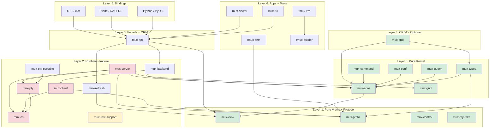

# TermForge: Rust Terminal Multiplexer Architecture

## Pass 3 Final Synthesis (Definitive)

Date: 2026-02-11
Round: 3/3 (final multi-model synthesis pass)
License: MIT OR Apache-2.0
Rust edition: 2024 (minimum 1.85)

---

## Key Decisions (Settled)

These are treated as constraints. If an implementation choice conflicts with any item below, the implementation is wrong.

1. **Vec inside entities for parent-child relationships.** Example: `Session.windows: Vec<WindowId>`. Reverse lookups are computed from snapshots, not stored as additional maps in the authoritative graph.
2. **WASM compilability as purity enforcement.** CI must run `cargo check --target wasm32-unknown-unknown -p mux-core` (and other PURE crates as listed) to prevent IO/OS leakage.
3. **`mux-types` is a separate crate** (typed IDs and small value types shared across pure crates).
4. **`mux-orm` is a separate crate from `mux-api`** (libtmux-style ergonomics live in ORM; `mux-api` remains the narrow “connect + submit + subscribe” facade).
5. **Fake PTY Scenario Recorder/Replayer.** `ScenarioRecorder` wraps a real `PtyBackend`, recording timestamped bidirectional byte events as JSON; `ScenarioReplayer` feeds recorded output into the pure core for deterministic grid tests.
6. **No persistent data structures initially (no `im-rs`).** Start with mutable graph state; use `Arc<Grid>` with copy-on-write (`Arc::make_mut`) where cloning cost matters.
7. **Custom VT100/DEC ANSI parser** in `mux-grid`, matching tmux `input.c` (Paul Williams DEC ANSI parser state table, 17 states) and tmux extensions. Do not use `vte` crate for compatibility surfaces.
8. **Format string engine** is a pure function in `mux-core/src/format.rs` (AST + evaluation; variables resolved from snapshots and explicit context).
9. **Key binding system** is table-based dispatch in `mux-core/src/key_table.rs` with tmux-like tables (`root`, `prefix`, `copy-mode`, `copy-mode-vi`, and mode-specific overrides).
10. **Copy mode** is per-pane: a `CopyModeState` state machine in `mux-core` supporting vi/emacs bindings, search, selection, and “copy to buffer”.

## Table of Contents

1. [Project Name and Identity](#1-project-name-and-identity)
2. [Vision and Philosophy](#2-vision-and-philosophy)
3. [North Star Acceptance Criteria](#3-north-star-acceptance-criteria)
4. [High-Level Architecture](#4-high-level-architecture)
5. [Workspace Layout](#5-workspace-layout)
6. [One-Way Dependency Rules and Layering Contract](#6-one-way-dependency-rules-and-layering-contract)
7. [Entity Model](#7-entity-model)
8. [Event/Effect Engine Design](#8-eventeffect-engine-design)
9. [Protocol Codec Design](#9-protocol-codec-design)
10. [ORM-like Query API](#10-orm-like-query-api)
11. [Runtime Architecture](#11-runtime-architecture)
12. [Language Bindings](#12-language-bindings)
13. [CRDT Transaction Layer](#13-crdt-transaction-layer)
14. [tmux Version Management](#14-tmux-version-management)
15. [Test Support Crate](#15-test-support-crate)
16. [Fake PTY Backend](#16-fake-pty-backend)
17. [Binding Test Frameworks](#17-binding-test-frameworks)
18. [Test Framework and Harness Design](#18-test-framework-and-harness-design)
19. [Visual Client (TUI)](#19-visual-client-tui)
20. [DOs and DON'Ts](#20-dos-and-donts)
21. [AGENTS.md Template](#21-agentsmd-template)
22. [Phased Implementation Plan](#22-phased-implementation-plan)
23. [Risks and Mitigations](#23-risks-and-mitigations)
24. [Appendix A: Key File References](#appendix-a-key-file-references)
25. [Appendix B: Workspace Dependency Graph](#appendix-b-workspace-dependency-graph)
26. [Appendix C: Model Contributions](#appendix-c-model-contributions)

---

## 1. Project Name and Identity

**Name:** `termforge`

**Rationale:** The name captures the dual nature of the project -- it is both a terminal multiplexer and a forge (foundation) upon which libraries, test frameworks, bindings, and distributed collaborative sessions can be built. It avoids the "tmux" substring to signal architectural independence while the tmux compatibility profile layer delivers full behavioral compatibility.

**Crate prefix:** `mux-*` (e.g. `mux-core`, `mux-proto`, `mux-query`)

Rationale for `mux-*` over `tf-*`: shorter, grep-friendly, consistent with vibe-tmux's proven naming, and the `mux-` prefix is already established in downstream tooling (tmux-vm, tmux-builder, mux-test-support).

**Tagline:** "A deterministic, layered terminal multiplexer core with tmux wire-compatibility, ORM-style APIs, CRDT collaboration, and multi-language bindings."

---

## 2. Vision and Philosophy

**"Strictly Compatible, Architecturally Liberated."**

- **User Perspective:** It *is* tmux. It reads `.tmux.conf`, accepts `tmux` commands, and behaves exactly as expected. Real tmux clients can attach; it can attach to real tmux servers.
- **Developer Perspective:** It is a modern Rust library ecosystem. You can import `termforge` crates into any Rust project to manage sessions programmatically (ORM-like) without spawning shell processes.
- **System Perspective:** It is a resilient, async, event-driven system where state is managed through a deterministic pure kernel, CRDT-versioned where needed, ensuring stability even under heavy load or distributed scenarios.
- **Library Perspective:** The kernel is a new multiplexer -- not a 1:1 tmux port. tmux is treated as an external **compatibility profile** (protocol + semantics + config grammar), not as the internal model.

### Why not "rewrite tmux in Rust first"

A direct port tends to:
- Cement tmux's incidental coupling into your Rust APIs.
- Make transactions/CRDTs invasive.
- Push platform/protocol concerns into the core.

Instead: keep a deterministic kernel and drive tmux correctness via fixtures + parity harnesses.

---

## 3. North Star Acceptance Criteria

These are the acceptance tests (technical, architectural, and product) that must stay true as the project evolves.

### 3.1 Compatibility Acceptance

1. Real tmux clients can attach to our server.
2. Our client can attach to real tmux servers.
3. Protocol parsing/encoding is fixture-backed; no "invented" framing.
4. Control mode is used only as hints (except where tmux actually sends structured data like `%layout-change` in `control-notify.c`).
5. Command behavior is audit-checked against upstream tmux's command registry (`cmd.c`) and regress scripts.
6. Any tmux-compat claim must cite upstream tmux source/headers or captured fixtures (including SCM_RIGHTS FDs).

### 3.2 Architectural Acceptance

1. **Pure core**: the kernel crate has no tokio/async, no IO, no `nix`/`libc`, no unsafe.
2. **WASM gate**: CI runs `cargo check --target wasm32-unknown-unknown -p mux-core` (and other PURE crates) to mechanically enforce purity.
3. **Stream-first**: UI/bindings update via streams; no steady-state polling; one persistent connection per socket/backend.
4. **Unsafe quarantine**: only `mux-os` contains handwritten `unsafe`, each block with `// SAFETY:` documentation and focused tests.
5. **No panics in hot paths**: protocol decode/encode, server loops, PTY loops use `Result` everywhere.
6. **Public API hygiene**: bindings do not expose "frame/store/json/planner" in public names; they expose an object graph + exec facade.
7. **One-way dependency rules**: everything points inward. Pure crates never depend on runtime/OS/bindings. Compatibility adapters depend on kernel+views; kernel never depends on compat.

### 3.3 Product Acceptance

1. **Core usage**: embedding the mux kernel in-process is supported and ergonomic.
2. **ORM usage**: "libtmux-but-Rust" usage is strongly typed and layered.
3. **Bindings usage**: Python/Node/C++ wrappers can be thin and still powerful; query execution happens in Rust.
4. **Test usage**: hermetic servers/sockets/PTY fakes enable deterministic tests; a reusable test framework is published as a standalone crate.
5. **CRDT usage**: transactions can be replicated with merge semantics without retrofitting the entire kernel.

---

## 4. High-Level Architecture

### 4.1 The Layer Cake

1. **Layer 0 -- Kernel (PURE):** state graph, typed IDs, reducer, transactions, effect descriptions.
2. **Layer 1 -- Views + Query (PURE):** immutable snapshots and traversal; query DSL matching libtmux semantics.
3. **Layer 1b -- Protocol (PURE):** tmux binary protocol codec, control-mode parser.
4. **Layer 2 -- Compatibility (mostly PURE):** tmux semantics mapping (commands/options/format/keys).
5. **Layer 3 -- Runtime (IMPURE):** tokio/tasks/threads, sockets, PTY, SCM_RIGHTS, timers.
6. **Layer 4 -- Facade API:** managed per-socket actor, view store, refresh hints.
7. **Layer 5 -- ORM API:** libtmux-shaped object graph layered on views + exec. **The ORM API is a facade, not the engine** -- it translates user intent into commands/typed ops/transactions. It must not implement business logic that belongs in core.
8. **Layer 6 -- CRDT:** op log + merge policies + transport (optional).
9. **Layer 7 -- Bindings:** thin wrappers; no matching logic in foreign languages.
10. **Layer 8 -- Tools + Apps:** sniffers, audits, doctor, TUI, CLI, tmux-vm, tmux-builder.

### 4.2 Architecture Diagram



### 4.3 Layering Contract (Hard Boundaries)

These four boundaries are non-negotiable structural constraints.

**Boundary A: Core is deterministic**
- `mux-core` must be runnable in a pure unit test: feed events, assert effects/state.
- No "ask the OS" inside core.
- If core needs time, inject a `Clock` trait passed in via event payloads or engine context.

**Boundary B: Store snapshots are the read path**
- UI and bindings read *only* via stored views/snapshots, woken by hint streams.
- Writes are serialized through the state actor.
- Reads are lock-free snapshots via `ArcSwap`.
- Updates publish `RefreshHint`s via broadcast channel.

**Boundary C: tmux compatibility is an adapter**
- No tmux protocol details in core names/types.
- tmux IDs and quirks live in compatibility and protocol crates.
- Binary protocol is authoritative for structured data; control mode is hints only.

**Boundary D: ORM API is a facade, not the engine**
- The ORM layer must not become "a second engine."
- It translates "user intent" into `cmd()` / typed ops / transactions.
- It must not implement business logic that belongs in core.

---

## 5. Workspace Layout

```
termforge/
├── Cargo.toml                          # workspace root
├── AGENTS.md                           # human + LLM guardrails
├── ARCHITECTURE.md                     # living architecture doc
├── justfile                            # build/test/audit entry points
├── notes/
│   ├── plan.md                         # active roadmap
│   ├── completed.md                    # archive
│   └── ideas.md                        # future possibilities
│
├── crates/
│   │
│   │  -- LAYER 0: PURE (no IO, no async, no unsafe, no time) --
│   │
│   ├── mux-types/                      # PURE: typed IDs + small value types (shared)
│   │   └── src/
│   │       ├── lib.rs
│   │       ├── ids.rs                 # SessionId/WindowId/PaneId/... (SlotMap keys)
│   │       ├── geom.rs                # Size, Position, Rect, PaneSize
│   │       ├── enums.rs               # SplitDirection, KeyMod, etc.
│   │       └── time.rs                # Timestamp, DurationMs (opaque newtypes)
│   │
│   ├── mux-core/                       # PURE: deterministic state machine + transaction kernel
│   │   └── src/
│   │       ├── lib.rs
│   │       ├── graph.rs               # ServerGraph (SlotMap-backed entity store)
│   │       ├── session.rs             # Session entity
│   │       ├── window.rs              # Window entity
│   │       ├── pane.rs                # Pane entity
│   │       ├── client.rs              # Client entity
│   │       ├── job.rs                 # Job entity
│   │       ├── buffer.rs              # Paste buffer entity
│   │       ├── hook.rs                # Hook storage + dispatch model
│   │       ├── key_table.rs           # Key table + binding model
│   │       ├── event.rs               # Event enum (input intents)
│   │       ├── effect.rs              # Effect enum (runtime side effects)
│   │       ├── engine.rs              # apply_event(graph, event) -> ApplyOutcome
│   │       ├── transaction.rs         # TxnId, Transaction, Precondition, KernelOp
│   │       ├── facade.rs              # ServerFacade (command string -> event)
│   │       ├── handle.rs              # ServerHandle (read-only graph traversal)
│   │       ├── context.rs             # ClientContext (client-relative semantics)
│   │       ├── state.rs               # GraphState, SessionState (serializable snapshots)
│   │       ├── format.rs              # Format string expansion engine (from tmux format.c)
│   │       ├── layout.rs              # Layout tree + algorithms
│   │       ├── copy_mode.rs           # Copy mode state machine
│   │       ├── environ.rs             # Environment variable store
│   │       └── command/               # Per-command handlers (pure)
│   │           ├── mod.rs
│   │           ├── new_session.rs
│   │           ├── new_window.rs
│   │           ├── split_window.rs
│   │           ├── select_pane.rs
│   │           ├── send_keys.rs
│   │           ├── display_message.rs
│   │           ├── set_option.rs
│   │           └── ...                # one file per tmux command (~80 files)
│   │
│   ├── mux-proto/                      # PURE: tmux binary protocol codec
│   │   └── src/
│   │       ├── lib.rs
│   │       ├── frame.rs              # ImsgHdr, ImsgFrame (from tmux-protocol.h)
│   │       ├── codec.rs              # ImsgCodec (two-phase decode)
│   │       ├── msg.rs                # MsgType enum (MSG_COMMAND, MSG_IDENTIFY_*, etc.)
│   │       ├── identify.rs           # IdentifyBurstBuilder
│   │       ├── payload.rs            # Payload parsing helpers
│   │       ├── error.rs              # ProtocolError
│   │       └── fixture.rs            # Test fixtures from real tmux captures
│   │
│   ├── mux-view/                       # PURE: view model + traversal helpers
│   │   └── src/
│   │       ├── lib.rs
│   │       ├── view.rs               # View, ViewIndex, ViewMeta
│   │       ├── view_id.rs            # ViewId (Local | Tmux)
│   │       ├── refs.rs               # SessionRef, WindowRef, PaneRef (lifetime-bounded)
│   │       ├── query.rs              # query::session::*, query::window::*, query::pane::*
│   │       └── diff.rs               # View diffing for CRDT and incremental updates
│   │
│   ├── mux-query/                      # PURE: query DSL + operators
│   │   └── src/
│   │       ├── lib.rs
│   │       ├── ops.rs                # QueryOp enum (Exact, IContains, Regex, etc.)
│   │       ├── value.rs              # QueryValue (Null, Bool, I64, String, List)
│   │       ├── spec.rs               # QuerySpec, QueryTerm
│   │       ├── list.rs               # QueryList<T: Queryable> with filter/get/get_one
│   │       └── derive.rs             # #[derive(Queryable)] proc macro support
│   │
│   ├── mux-conf/                       # PURE: config AST, lexer, parser
│   │   └── src/
│   │       ├── lib.rs
│   │       ├── ast.rs                # Config AST nodes
│   │       ├── lexer.rs              # Tokenizer
│   │       ├── parser.rs             # Config file parser (tmux.conf compatible)
│   │       └── options.rs            # Option table + defaults (from tmux options-table.c)
│   │
│   ├── mux-command/                    # PURE: command parsing + dispatch table
│   │   └── src/
│   │       ├── lib.rs
│   │       └── table.rs              # Command table (from tmux cmd.c cmd_table[])
│   │
│   ├── mux-crdt/                       # PURE: CRDT operation log, merge semantics
│   │   └── src/
│   │       ├── lib.rs
│   │       ├── document.rs           # CrdtDocument (graph state as CRDT)
│   │       ├── operations.rs         # CrdtOp enum (insert/delete/update/move)
│   │       ├── clock.rs              # HybridLogicalClock
│   │       ├── merge.rs              # Merge resolution strategies
│   │       └── snapshot.rs           # Snapshot + delta encoding
│   │
│   ├── mux-grid/                       # PURE: terminal grid + ANSI/VT state machine
│   │   └── src/
│   │       ├── lib.rs
│   │       ├── grid.rs               # Grid (row/column cell storage)
│   │       ├── cell.rs               # Cell (character + style)
│   │       ├── row.rs                # Row (line storage, wrapping)
│   │       ├── parser.rs             # ANSI/VT escape sequence parser
│   │       ├── hyperlinks.rs         # Hyperlink tracking (OSC 8)
│   │       └── scrollback.rs         # Scrollback buffer management
│   │
│   ├── mux-control/                    # PURE: control-mode line parser
│   │   └── src/
│   │       ├── lib.rs
│   │       ├── notification.rs       # ControlNotification enum (from control-notify.c)
│   │       ├── parser.rs             # %%notification line parser
│   │       └── backpressure.rs       # Pause/continue/watermark model
│   │
│   ├── mux-pty/                        # trait: PTY abstraction
│   │   └── src/
│   │       └── lib.rs                # PtyBackend + PtyHandle traits
│   │
│   ├── mux-pty-fake/                   # PURE: fake PTY for deterministic testing
│   │   └── src/
│   │       └── lib.rs                # FakePty, FakePtyBackend, FakePtyAction
│   │
│   │  -- LAYER 2: RUNTIME (async, IO, unsafe quarantine) --
│   │
│   ├── mux-os/                         # IMPURE + UNSAFE: OS primitives quarantine
│   │   └── src/
│   │       ├── lib.rs
│   │       ├── pty.rs                # PTY creation + management
│   │       ├── scm_rights.rs         # SCM_RIGHTS FD passing
│   │       ├── socket.rs             # Unix socket creation + permissions
│   │       ├── signal.rs             # Signal handling
│   │       └── fd.rs                 # FD lifecycle + close-on-drop
│   │
│   ├── mux-pty-portable/               # IMPURE: portable-pty backend
│   │   └── src/
│   │       └── lib.rs
│   │
│   ├── mux-pty-recorder/               # IMPURE: record/replay PTY scenarios (JSON event log)
│   │   └── src/
│   │       ├── lib.rs                 # ScenarioRecorder (wraps real PtyBackend)
│   │       ├── json.rs                # Scenario JSON schema + (de)serialization
│   │       └── cli.rs                 # optional: `mux-pty-recorder` tool entry
│   │
│   ├── mux-client/                     # IMPURE: tmux protocol client
│   │   └── src/
│   │       ├── lib.rs
│   │       ├── connection.rs         # Protocol connection management
│   │       ├── control.rs            # Control-mode session management
│   │       ├── sync.rs               # SyncClient (blocking wrapper)
│   │       └── socket.rs             # Socket discovery + resolution
│   │
│   ├── mux-backend/                    # IMPURE: backend trait + implementations
│   │   └── src/
│   │       ├── lib.rs                # MuxBackend enum (Local | Tmux)
│   │       ├── local.rs              # In-process backend (uses mux-core directly)
│   │       ├── tmux.rs               # Real tmux backend (protocol + control + binary)
│   │       ├── connection.rs         # ConnectionManager (lifecycle)
│   │       └── view_capture.rs       # State snapshot via list-* commands
│   │
│   ├── mux-refresh/                    # IMPURE: async store + refresh plumbing
│   │   └── src/
│   │       ├── lib.rs
│   │       ├── planner.rs            # RefreshPlanner (debounce + scope coalescing)
│   │       ├── state.rs              # StateHandle<T> (ArcSwap-backed lock-free store)
│   │       ├── event.rs              # RefreshEvent parsing
│   │       └── subscription.rs       # RefreshHint + broadcast
│   │
│   ├── mux-server/                     # IMPURE: tmux-compatible server binary
│   │   └── src/
│   │       ├── main.rs
│   │       ├── state.rs              # Runtime state wrapping mux-core
│   │       ├── commands.rs           # Command dispatch
│   │       ├── framing.rs            # Protocol frame handler
│   │       ├── config.rs             # Format context + option semantics
│   │       ├── keybinding.rs         # Key dispatch
│   │       ├── status.rs             # Status line rendering
│   │       ├── borders.rs            # Pane border rendering
│   │       ├── copy_mode.rs          # Copy mode runtime
│   │       ├── layout.rs             # Layout algorithms
│   │       ├── attached.rs           # Attached client loop
│   │       └── pty_reader.rs         # PTY output reader
│   │
│   │  -- LAYER 3: FACADE (unified API surface) --
│   │
│   ├── mux-api/                        # FACADE: ManagedMux, ServerFacade, re-exports
│   │   └── src/
│   │       ├── lib.rs                # Re-exports: ManagedMux, View, query::*, etc.
│   │       ├── managed.rs            # ManagedMux (SocketActor) + RefreshDriver
│   │       ├── lifecycle.rs          # LifecycleManager (server start/stop)
│   │       └── targets.rs            # Target resolution (session/window/pane)
│   │
│   ├── mux-orm/                        # IMPURE: libtmux-style object graph + QueryList ergonomics
│   │   └── src/
│   │       ├── lib.rs                # Server/Sessions/Windows/Panes entry points
│   │       ├── objects.rs            # Session/Window/Pane wrapper types (thin)
│   │       ├── query.rs              # QueryList wrapper (build QuerySpec, execute in Rust)
│   │       └── exec.rs               # Command submission helpers (delegates to mux-api)
│   │
│   │  -- SUPPORT CRATES --
│   │
│   ├── mux-cxx/                        # IMPURE: cxx bridge glue
│   ├── mux-telemetry/                  # IMPURE: tracing + OTEL infrastructure
│   ├── mux-otel/                       # IMPURE: OpenTelemetry export
│   ├── mux-pty-diagnostics/            # IMPURE: PTY leak detection
│   │
│   │  -- TEST SUPPORT --
│   │
│   └── mux-test-support/               # IMPURE: test harness, path guards, cleanup
│       └── src/
│           ├── lib.rs
│           ├── tmux.rs               # TmuxTestServer (hermetic tmux test server)
│           ├── mux_server.rs         # MuxServerTestServer (our server test harness)
│           ├── server.rs             # TestServer enum (unified interface)
│           ├── path_guard.rs         # PathGuard, socket safety invariants
│           └── assertions.rs         # Domain-specific test assertions
│
├── tools/
│   ├── mux-tui/                        # Ratatui-based TUI client
│   ├── tmux-sniff/                     # Protocol sniffer (preserves SCM_RIGHTS)
│   ├── tmux-builder/                   # Build tmux from source (configure/make)
│   ├── tmux-vm/                        # Version manager (ensure/exec/regress)
│   ├── tmux-worktrees/                 # Git worktree management for tmux repo
│   ├── tmux-lint/                      # Protocol/behavior linter
│   ├── format-audit/                   # Format variable alignment checker
│   ├── regress-audit/                  # Regress test coverage tracker
│   ├── tmux-command-audit/             # Command coverage tracker
│   ├── pty-test/                       # PTY leak test runner
│   ├── pty-report/                     # PTY diagnostic report analyzer
│   ├── pty-clean/                      # Stale PTY cleaner
│   └── mux-doctor/                     # System diagnostics tool
│
├── bindings/
│   ├── python/                         # PyO3 + maturin (built via uv)
│   │   ├── Cargo.toml
│   │   ├── pyproject.toml
│   │   ├── src/lib.rs
│   │   ├── python/mux_rs/
│   │   │   ├── __init__.py
│   │   │   ├── server.py             # ManagedMux wrapper
│   │   │   ├── session.py
│   │   │   ├── window.py
│   │   │   ├── pane.py
│   │   │   ├── query.py              # QueryList implementation
│   │   │   └── pytest_plugin.py      # Hermetic pytest fixtures
│   │   └── tests/
│   │       ├── conftest.py            # pytest plugin (fixtures)
│   │       └── test_snapshot.py       # Snapshot test suite
│   │
│   ├── node/                           # NAPI-RS (built via pnpm)
│   │   ├── Cargo.toml
│   │   ├── package.json
│   │   ├── src/lib.rs
│   │   ├── index.d.ts
│   │   ├── __test__/
│   │   │   ├── setup.ts              # vitest fixtures
│   │   │   └── snapshot.test.ts      # Snapshot test suite
│   │   └── vitest.config.ts
│   │
│   └── cpp/                            # cxx bridge + thin C++ wrapper
│       ├── Cargo.toml
│       ├── mux.hpp
│       ├── tests/
│       └── CMakeLists.txt
│
├── fixtures/
│   ├── protocol/                       # Captured imsg frames
│   ├── control/                        # Captured control-mode sessions
│   └── snapshots/                      # insta snapshot files
│
└── tests/
    ├── integration/                    # Cross-crate integration tests
    ├── parity/                         # tmux behavioral parity tests
    └── e2e/                            # End-to-end real-tmux tests
```

### Purity Classification Table

| Crate | Purity | Async | Unsafe | IO | Key Dependencies |
|-------|--------|-------|--------|----|------------------|
| `mux-types` | PURE | No | No | No | `serde` (optional), `slotmap` (key types only) |
| `mux-core` | PURE | No | No | No | `mux-types`, `slotmap`, `indexmap`, `smallvec` |
| `mux-proto` | PURE | No | No | No | `bytes`, `nom` |
| `mux-view` | PURE | No | No | No | `mux-core`, `mux-query` |
| `mux-query` | PURE | No | No | No | `regex` |
| `mux-conf` | PURE | No | No | No | `nom` |
| `mux-command` | PURE | No | No | No | `mux-core` |
| `mux-crdt` | PURE | No | No | No | `mux-core` |
| `mux-grid` | PURE | No | No | No | (standalone) |
| `mux-control` | PURE | No | No | No | `nom` |
| `mux-pty` | trait | No | No | No | (trait definitions only) |
| `mux-pty-fake` | PURE | No | No | No | `mux-pty` |
| `mux-os` | IMPURE | No | **YES** | YES | `nix`, `libc` |
| `mux-pty-portable` | IMPURE | No | Via deps | YES | `portable-pty`, `mux-pty` |
| `mux-pty-recorder` | IMPURE | No | Via deps | YES | `mux-pty`, `mux-os`, `serde_json` |
| `mux-client` | IMPURE | Yes | No | YES | `tokio`, `mux-proto`, `mux-os` |
| `mux-backend` | IMPURE | Yes | No | YES | `mux-client`, `mux-core`, `mux-view` |
| `mux-refresh` | IMPURE | Yes | No | No | `tokio`, `arc-swap`, `mux-view` |
| `mux-server` | IMPURE | Yes | Via mux-os | YES | `mux-core`, `mux-proto`, `mux-os`, `mux-grid` |
| `mux-api` | FACADE | Yes | No | No | `mux-backend`, `mux-view`, `mux-refresh`, `mux-query` |
| `mux-orm` | IMPURE | Yes | No | No | `mux-api`, `mux-query`, `mux-view` |
| `mux-telemetry` | IMPURE | No | No | YES | `tracing`, `opentelemetry` |
| `mux-test-support` | IMPURE | No | No | YES | `tempfile`, `mux-pty-diagnostics` |

---

## 6. One-Way Dependency Rules and Layering Contract

This is the single most important structural constraint in the project. Getting the crate layout right matters less than enforcing these rules.

### The Rule

**Everything points inward. Pure crates never depend on runtime/OS/bindings. Compatibility adapters depend on kernel+views; the kernel never depends on compat.**

### Dependency Direction

```
Bindings  -->  API Facade  -->  Runtime  -->  Protocol  -->  Kernel  -->  Types
                                   |              |             |
                                   v              v             v
                                 mux-os       mux-control    mux-query
                                 mux-pty                     mux-conf
```

### Specific Prohibitions

- `mux-core` must NEVER import `tokio`, `nix`, `libc`, or any async runtime.
- `mux-proto` must NEVER depend on `mux-core` (protocol is independent of state model).
- `mux-crdt` must NEVER import networking or transport code (transport is runtime-plane).
- Bindings must NEVER implement query matching logic -- only format criteria and call Rust.
- Runtime crates must NEVER be dependencies of pure crates.
- `mux-pty-fake` must NEVER use real OS PTYs.

### Enforcement (CI + Lints)

Mechanical enforcement beats “good intentions”. The following checks must exist in CI:

1. **WASM purity gate** for PURE crates (minimum): run `cargo check --target wasm32-unknown-unknown -p mux-types`, `cargo check --target wasm32-unknown-unknown -p mux-core`, `cargo check --target wasm32-unknown-unknown -p mux-grid`, `cargo check --target wasm32-unknown-unknown -p mux-proto`.
2. **Unsafe quarantine**: PURE crates use `#![forbid(unsafe_code)]`; `mux-os` is the only crate allowed to contain handwritten `unsafe`.
3. **Dependency direction**: `cargo tree -p mux-core` must not pull in `tokio`, `nix`, `libc` (and similar OS/async crates); violations are CI failures.

Example GitHub Actions step (sketch):

```yaml
- name: Pure crates compile to WASM
  run: |
    rustup target add wasm32-unknown-unknown
    cargo check --target wasm32-unknown-unknown -p mux-types
    cargo check --target wasm32-unknown-unknown -p mux-core
    cargo check --target wasm32-unknown-unknown -p mux-grid
    cargo check --target wasm32-unknown-unknown -p mux-proto
```

### Why This Matters

> The critical part is not picking the "perfect" set of crates; it's enforcing the one-way dependency rules and making correctness measurable via fixtures + parity harnesses from day one.

---

## 7. Entity Model

Grounded directly in tmux.h structs from `/home/d/study/c/tmux/tmux.h`.

### 7.1 Core Entities (in `mux-types` + `mux-core`)

```rust
// crates/mux-types/src/ids.rs
// Typed IDs -- SlotMap-based for local, string-prefixed for tmux.
// Matches tmux convention: $<num> for sessions, @<num> for windows, %<num> for panes.
slotmap::new_key_type! {
    pub struct SessionId;
    pub struct WindowId;
    pub struct PaneId;
    pub struct ClientId;
    pub struct JobId;
    pub struct BufferId;
}

// Dual ID for bridging local and tmux worlds
pub enum ViewId {
    Local(u64),
    Tmux(Arc<str>),  // "$1", "@3", "%5"
}
```

#### Session (from `struct session` at tmux.h:1428)

```rust
pub struct Session {
    pub id: SessionId,
    pub name: String,
    pub cwd: PathBuf,
    pub creation_time: Timestamp,
    pub last_attached_time: Timestamp,
    pub activity_time: Timestamp,
    pub windows: Vec<WindowId>,      // ordered winlinks (tmux: RB_HEAD winlinks)
    pub active_window: WindowId,     // tmux: curw
    pub last_windows: Vec<WindowId>, // tmux: lastw stack
    pub options: SessionOptions,
    pub environ: Environ,
    pub flags: SessionFlags,         // SESSION_ALERTED etc.
    pub attached: u32,               // tmux: attached count
    pub group: Option<SessionGroupId>,
}
```

#### Window (from `struct window` at tmux.h:1276)

```rust
pub struct Window {
    pub id: WindowId,
    pub name: String,
    pub panes: Vec<PaneId>,
    pub active_pane: PaneId,
    pub last_panes: Vec<PaneId>,
    pub layout_root: LayoutCell,
    pub size: Size,                  // sx, sy
    pub flags: WindowFlags,         // WINDOW_BELL, WINDOW_ZOOMED, etc.
    pub options: WindowOptions,
    pub activity_time: Timestamp,
}
```

#### Pane (from `struct window_pane` at tmux.h:1181)

```rust
pub struct Pane {
    pub id: PaneId,
    pub window: WindowId,
    pub size: Size,                  // sx, sy
    pub offset: Position,            // xoff, yoff
    pub flags: PaneFlags,           // PANE_EXITED, PANE_FOCUSED, etc.
    pub pid: Option<u32>,
    pub tty: String,
    pub shell: String,
    pub cwd: PathBuf,
    pub start_command: String,
    pub exit_status: Option<i32>,
    pub screen: mux_grid::Screen,   // Arc<Grid> + cursor + terminal modes (COW)
    pub layout_cell: LayoutCellId,
    pub options: PaneOptions,
    pub mode_stack: Vec<WindowMode>, // tmux: TAILQ modes (includes CopyMode)
    pub copy_mode: Option<CopyModeState>, // per-pane copy-mode state machine (tmux: window-copy.c)
}
```

#### Client (from `struct client` in tmux.h)

```rust
pub struct Client {
    pub id: ClientId,
    pub name: String,
    pub session: Option<SessionId>,
    pub last_session: Option<SessionId>,
    pub tty: TtyState,
    pub flags: ClientFlags,         // CLIENT_CONTROL, CLIENT_READONLY, etc.
    pub key_table: String,
    pub environ: Environ,
}
```

#### Grid (from `struct grid` at tmux.h:836)

```rust
pub struct Grid {
    pub flags: GridFlags,           // GRID_HISTORY
    pub size: Size,                 // sx, sy
    pub history_scrolled: u32,      // hscrolled
    pub history_size: u32,          // hsize
    pub history_limit: u32,         // hlimit
    pub lines: Vec<GridLine>,
}

pub struct GridLine {
    pub cells: Vec<GridCell>,
    pub flags: LineFlags,
    pub time: Timestamp,
}

/// Screen state is stored behind `Arc<Grid>` so snapshots/clones are cheap.
/// Mutations use copy-on-write (`Arc::make_mut`) inside the single-writer core.
pub struct Screen {
    pub grid: std::sync::Arc<Grid>,
    pub cursor: Cursor,
    pub modes: TerminalModes,
}
```

### 7.2 ServerGraph (Authoritative State)

```rust
// In mux-core: the single source of truth
pub struct ServerGraph {
    pub sessions: SlotMap<SessionId, Session>,
    pub windows: SlotMap<WindowId, Window>,
    pub panes: SlotMap<PaneId, Pane>,
    pub clients: SlotMap<ClientId, Client>,
    pub jobs: SlotMap<JobId, Job>,
    pub buffers: SlotMap<BufferId, PasteBuffer>,
    pub session_groups: Vec<SessionGroup>,
    pub hooks: HookTable,
    pub key_tables: KeyTableSet,
    pub options: GlobalOptions,
    pub marked_pane: Option<MarkedPane>,  // tmux: server.c marked_pane
}
```

Note: Unlike vibe-tmux which keeps some state in mux-server, termforge moves ALL mutable domain state (buffers, hooks, key tables, options) into the pure core for CRDT-compatibility and deterministic testing.

### 7.3 Adjacency Policy (Vec-In-Entity, Reverse Index in Snapshots)

**Authoritative graph rule:** parent-to-child and ordering are stored as `Vec<ChildId>` inside the parent entity.

- `Session.windows: Vec<WindowId>` preserves tmux ordering (winlinks).
- `Window.panes: Vec<PaneId>` preserves pane order for layout decisions and “last pane” semantics.

**No stored reverse edges** in `ServerGraph` (no `pane_to_window`, no `window_to_session`, no `SecondaryMap` mirrors) unless a profiler proves it is required and the derived maps are proven correct under all mutations.

**Read path rule:** reverse lookups are computed as part of snapshot building in `mux-view`:

```rust
// crates/mux-view/src/view.rs
pub struct ViewIndex {
    pub window_to_session: std::collections::HashMap<WindowId, SessionId>,
    pub pane_to_window: std::collections::HashMap<PaneId, WindowId>,
    // Optional: in-order position maps for stable UI (pane_idx, window_idx, etc.)
}

impl ViewIndex {
    pub fn build(graph: &ServerGraph) -> Self {
        let mut idx = Self {
            window_to_session: Default::default(),
            pane_to_window: Default::default(),
        };
        for (sid, s) in graph.sessions.iter() {
            for &wid in &s.windows {
                idx.window_to_session.insert(wid, sid);
            }
        }
        for (wid, w) in graph.windows.iter() {
            for &pid in &w.panes {
                idx.pane_to_window.insert(pid, wid);
            }
        }
        idx
    }
}
```

**Rationale:** storing only one direction eliminates “double-write” bugs (forgot to update reverse map) and makes diffs/CRDT operations tractable; reverse indices are derived, testable, and can be cached inside the snapshot object.

### 7.4 Terminal Emulation (`mux-grid`)

The `mux-grid` crate is the **terminal emulator core** used by panes. It is PURE and deterministic, and is fed bytes via `Event::PtyOutput { pane, data }`.

Hard requirements:

- One parser implementation for compatibility. Do not split parsing across crates or re-implement logic in the TUI.
- Replaying a byte stream into the same initial `Screen` must yield the same final `Screen` (byte-for-byte, cell-for-cell).

#### VT100 Parser Design (tmux `input.c`, Paul Williams DEC ANSI table)

We implement a custom state-table parser equivalent in spirit to tmux `input.c` (which is itself based on the Paul Williams DEC ANSI parser).

- **State count:** 17 states (same conceptual envelope as tmux).
- **Mechanism:** byte classification + `(state, class) -> {action, next_state}` transition table.
- **Output:** actions are executed against a `Performer` that mutates `Screen` / `Grid` (cursor moves, insert/delete, SGR, scroll, mode toggles).

Module layout:

```text
crates/mux-grid/src/
  vt/
    mod.rs
    state.rs     # State, Class, Action enums + transition table
    parser.rs    # Parser { state, params, intermediates, osc, dcs, utf8 }
    csi.rs       # CSI dispatch table -> Action or direct performer calls
    osc.rs       # OSC parsing (incl. OSC 8 hyperlinks)
    sgr.rs       # SGR parsing (color, attrs) with tmux-compat quirks
```

Core types:

```rust
// crates/mux-grid/src/vt/state.rs
#[repr(u8)]
#[derive(Clone, Copy, Debug, Eq, PartialEq)]
pub enum State {
    Ground = 0,
    Escape,
    EscapeIntermediate,
    CsiEntry,
    CsiParam,
    CsiIntermediate,
    CsiIgnore,
    OscString,
    DcsEntry,
    DcsParam,
    DcsIntermediate,
    DcsPassthrough,
    DcsIgnore,
    SosPmApcString,
    Utf8,
    // Two tmux-compat “glue” states used to match edge cases around ST / BEL termination:
    StringTerminator,
    StringIgnore,
}

#[repr(u8)]
#[derive(Clone, Copy, Debug, Eq, PartialEq)]
pub enum Class {
    C0,        // 0x00..0x1F
    C1,        // 0x80..0x9F (when present)
    Ascii,     // printable
    Esc,       // 0x1B
    Csi,       // '[' after ESC or 0x9B
    Osc,       // ']' after ESC or 0x9D
    Dcs,       // 'P' after ESC or 0x90
    St,        // ESC '\\' or 0x9C
    Bel,       // 0x07
    Digit,
    Semicolon,
    Param,     // 0x30..0x3F (incl digits and separators)
    Intermediate, // 0x20..0x2F
    Final,     // 0x40..0x7E
    Utf8Lead,
    Utf8Cont,
    Other,
}

#[derive(Clone, Copy, Debug, Eq, PartialEq)]
pub enum Action {
    Print,
    Execute,         // C0 controls in Ground
    Clear,           // clear intermediate/params
    Collect,         // collect intermediate bytes
    Param,           // collect params (numbers, separators)
    CsiDispatch,     // final byte dispatch with params/intermediates
    EscDispatch,     // dispatch escape final
    OscStart,
    OscPut,
    OscEnd,
    DcsHook,
    DcsPut,
    DcsUnhook,
    Ignore,
}

#[derive(Clone, Copy)]
pub struct Transition {
    pub action: Action,
    pub next: State,
}

pub const STATE_COUNT: usize = 17;
pub const CLASS_COUNT: usize = 18;
pub static TABLE: [[Transition; CLASS_COUNT]; STATE_COUNT] = /* generated/handwritten */ todo!();
```

Two-phase CSI dispatch:

1. Parse params into `SmallVec<[i64; 8]>` (empty means “use default”).
2. Dispatch on final byte + intermediates to a dedicated handler, matching tmux semantics for edge cases (e.g. missing params, out-of-range).

```rust
// crates/mux-grid/src/vt/csi.rs
pub fn dispatch(final_byte: u8, intermediates: &[u8], params: &[i64], perf: &mut dyn Performer) {
    match (intermediates, final_byte) {
        // Cursor movement
        (b"", b'A') => perf.cuu(params.get(0).copied().unwrap_or(1)),
        (b"", b'B') => perf.cud(params.get(0).copied().unwrap_or(1)),
        (b"", b'C') => perf.cuf(params.get(0).copied().unwrap_or(1)),
        (b"", b'D') => perf.cub(params.get(0).copied().unwrap_or(1)),

        // Erase in display/line
        (b"", b'J') => perf.ed(params.get(0).copied().unwrap_or(0)),
        (b"", b'K') => perf.el(params.get(0).copied().unwrap_or(0)),

        // SGR (attrs/colors)
        (b"", b'm') => perf.sgr(params),

        // Scroll region, insert/delete, etc...
        _ => perf.unknown_csi(final_byte, intermediates, params),
    }
}
```

tmux extensions we explicitly support (minimum set for parity goals):

- OSC 8 hyperlinks (tmux `hyperlinks.c` behavior alignment).
- tmux “cursor style” and “mouse mode” toggles as they affect screen output (not input decoding).
- passthrough of unrecognized OSC/DCS sequences, stored as metadata if needed for TUI fidelity, but never crashes the parser.

Test strategy for `mux-grid`:

- Golden tests: recorded byte streams (from FakePty recorder) replayed into `Screen`, assert full grid snapshot (cells + attrs).
- Property tests: chunking invariance (feeding the same bytes in random chunk sizes yields identical final screen).
- Fuzzing: state machine fuzz with “never panic, never OOM” invariants and bounded buffers.

---

## 8. Event/Effect Engine Design

Following the vibe-tmux principle: **functional core, imperative shell** (AGENTS.md Section 2).

### 8.1 Event Types (inputs to the core)

```rust
pub enum Event {
    // Protocol events (from imsg client)
    ProtocolMessage(ImsgFrame),
    ProtocolDisconnect,

    // Control-mode hints (from tmux -C)
    ControlNotification(ControlNotif),

    // Commands (from clients, bindings, config)
    Command(CommandEvent),

    // PTY events
    PtyOutput { pane: PaneId, data: Bytes },
    PtyExit { pane: PaneId, status: i32 },

    // Client events
    ClientInput { client: ClientId, key: KeyEvent },
    ClientResize { client: ClientId, size: Size },
    ClientAttach { client: ClientId },
    ClientDetach { client: ClientId },

    // Timer events (injected by runtime)
    Tick(Timestamp),
    NameRefresh,

    // CRDT events (collaborative)
    CrdtMerge(OpLog),
}
```

### 8.2 Effect Types (outputs from the core)

```rust
pub enum Effect {
    // PTY control
    SpawnPty { pane: PaneId, command: String, cwd: PathBuf },
    WritePty { pane: PaneId, data: Bytes },
    ResizePty { pane: PaneId, size: Size },
    ClosePty { pane: PaneId },

    // Client communication
    SendToClient { client: ClientId, msg: ImsgFrame },
    RedrawClient { client: ClientId },
    NotifyControl { client: ClientId, notification: String },

    // Socket operations
    AcceptClient,
    DisconnectClient { client: ClientId, reason: String },

    // Server lifecycle
    Shutdown,

    // State change signals
    RefreshHint(RefreshSet),

    // CRDT operations
    CrdtEmit(Op),

    // Timer scheduling
    ScheduleTimer { id: TimerId, delay: Duration },

    // Hook dispatch
    RunHook { hook: HookName, args: Vec<String> },

    // Optional host integration (runtime may ignore if disabled)
    SetSystemClipboard { data: Bytes },
}
```

### 8.3 Core Transition Function

```rust
// In mux-core -- PURE, deterministic, no IO
impl ServerGraph {
    pub fn apply(&mut self, event: Event) -> ApplyOutcome {
        match event {
            Event::Command(cmd) => self.dispatch_command(cmd),
            Event::PtyOutput { pane, data } => self.handle_pty_output(pane, data),
            Event::ClientInput { client, key } => self.handle_key(client, key),
            Event::CrdtMerge(log) => self.merge_crdt(log),
            // ...
        }
    }
}

pub struct ApplyOutcome {
    pub effects: Vec<Effect>,
    pub created_session: Option<SessionId>,
    pub created_window: Option<WindowId>,
    pub created_pane: Option<PaneId>,
    pub notifications: Vec<Notification>,  // control-mode notifications to emit
    pub crdt_ops: Vec<CrdtOp>,            // CRDT operations for sync
}
```

### 8.4 Transaction-First Design

Transactions are the unit of composability. Every state mutation flows through the transaction system, enabling CRDT replication, undo/redo, and optimistic concurrency.

```rust
// mux-core/src/transaction.rs

/// Unique transaction identifier for causal ordering and CRDT replay.
pub struct TxnId(u64);

/// A kernel operation -- the atomic unit of state change.
pub enum KernelOp {
    CreateSession { name: String },
    DestroySession { id: SessionId },
    CreateWindow { session_id: SessionId, name: String },
    SplitPane { window_id: WindowId, direction: SplitDirection },
    SelectPane { window_id: WindowId, pane_id: PaneId },
    SetOption { scope: OptionScope, key: String, value: OptionValue },
    SendKeys { pane_id: PaneId, keys: Vec<KeyCode> },
    RenameSession { session: SessionId, name: String },
    RenameWindow { window: WindowId, name: String },
    ResizePane { pane: PaneId, size: Size },
    SelectWindow { session: SessionId, window: WindowId },
    // ... one variant per atomic mutation
}

/// Precondition for optimistic concurrency and CRDT conflict resolution.
pub enum Precondition {
    SessionExists(SessionId),
    PaneInWindow { pane_id: PaneId, window_id: WindowId },
    OptionEquals { scope: OptionScope, key: String, expected: OptionValue },
    // ... extensible
}

/// A transaction bundles operations with preconditions for atomic application.
pub struct Transaction {
    pub id: TxnId,
    pub ops: Vec<KernelOp>,
    pub preconditions: Vec<Precondition>,
}

/// Apply a full transaction atomically.
pub fn apply_transaction(
    state: &mut ServerGraph,
    txn: Transaction,
    ctx: &KernelCtx,
) -> Result<Vec<Effect>, KernelError> {
    // 1. Validate all preconditions
    for pre in &txn.preconditions {
        validate_precondition(state, pre)?;
    }
    // 2. Apply all ops
    let mut effects = Vec::new();
    for op in txn.ops {
        effects.extend(apply_kernel_op(state, op)?);
    }
    Ok(effects)
}
```

A transaction can be derived from:
- A tmux command (`new-session`, `split-window`, etc.)
- A "native API" call
- A replicated CRDT operation batch

Preconditions are how you later support optimistic concurrency and CRDT conflict policies.

### 8.5 Format String Engine (`mux-core/src/format.rs`)

tmux’s `format.c` is one of the largest, most semantics-heavy subsystems. TermForge treats the **format engine as pure evaluation**:

- Parsing is pure: `&str -> FormatAst`.
- Evaluation is pure: `(FormatAst, VarSource) -> String`.
- Variable resolution is pure: reads only from a snapshot + explicit context (no IO).

Key rule: **no stringly-typed format logic in bindings**. Bindings pass format strings through to Rust for evaluation to guarantee parity.

AST:

```rust
// crates/mux-core/src/format.rs
#[derive(Clone, Debug, PartialEq, Eq)]
pub enum FormatNode {
    Text(String),
    Var(FormatVar),
    Conditional {
        cond: Box<FormatExpr>,
        then_branch: Vec<FormatNode>,
        else_branch: Vec<FormatNode>,
    },
}

#[derive(Clone, Debug, PartialEq, Eq)]
pub struct FormatVar {
    pub name: String,                 // "session_name", "pane_id", ...
    pub modifiers: Vec<Modifier>,     // e.g. length, quoting, substring, replace
}

#[derive(Clone, Debug, PartialEq, Eq)]
pub enum Modifier {
    // tmux-like modifiers (subset; grow via parity fixtures)
    Lower,
    Upper,
    Quote,
    JsonEscape,
    Substr { start: i64, len: Option<i64> },
    Replace { pattern: String, with: String }, // `s/pat/repl/`
    DefaultIfEmpty(String),                   // `E:...` / `?`-style behaviors
}

#[derive(Clone, Debug, PartialEq, Eq)]
pub enum FormatExpr {
    // enough to cover tmux `#{?cond,then,else}` and `#{==:a,b}` style expressions
    LitStr(String),
    LitNum(i64),
    Var(String),
    Not(Box<FormatExpr>),
    Eq(Box<FormatExpr>, Box<FormatExpr>),
    Ne(Box<FormatExpr>, Box<FormatExpr>),
    And(Box<FormatExpr>, Box<FormatExpr>),
    Or(Box<FormatExpr>, Box<FormatExpr>),
    IsEmpty(Box<FormatExpr>),
}
```

Evaluation contract:

```rust
pub trait VarSource {
    fn get_str(&self, key: &str) -> Option<std::borrow::Cow<'_, str>>;
    fn get_num(&self, key: &str) -> Option<i64>;
    fn get_bool(&self, key: &str) -> Option<bool>;
}

pub fn parse_format(input: &str) -> Result<Vec<FormatNode>, FormatError>;
pub fn eval_format(nodes: &[FormatNode], vars: &dyn VarSource) -> String;
```

Parity strategy:

- Build a corpus of format strings and contexts.
- For each fixture: run real tmux `display-message -p` and compare to `eval_format`.
- Add a shrinker: if a format fails, minimize the string + context to the smallest reproducer.

### 8.6 Key Binding System (`mux-core/src/key_table.rs`)

tmux key dispatch is table-driven and mode-aware. TermForge mirrors this:

- Keys are resolved against the **current table** (`root`, `prefix`, `copy-mode`, `copy-mode-vi`, plus user tables).
- Table switches are explicit state transitions (e.g. prefix key sets the active table and schedules a timeout).
- The reducer produces domain actions (`CommandEvent`s or `CopyOp`s), never executes IO.

Core model:

```rust
// crates/mux-core/src/key_table.rs
#[derive(Clone, Debug)]
pub struct KeyTableSet {
    pub tables: indexmap::IndexMap<String, KeyTable>,
}

#[derive(Clone, Debug)]
pub struct KeyTable {
    pub name: String,
    pub bindings: indexmap::IndexMap<KeyEvent, KeyBinding>,
}

#[derive(Clone, Debug)]
pub struct KeyBinding {
    pub command: String,              // tmux command string ("split-window -h", ...)
    pub repeatable: bool,             // tmux -r
}

pub const TABLE_ROOT: &str = "root";
pub const TABLE_PREFIX: &str = "prefix";
pub const TABLE_COPY_MODE: &str = "copy-mode";
pub const TABLE_COPY_MODE_VI: &str = "copy-mode-vi";
```

Dispatch algorithm (pure):

```rust
// crates/mux-core/src/engine.rs (sketch)
fn handle_key(&mut self, client: ClientId, key: KeyEvent) -> ApplyOutcome {
    let mut out = ApplyOutcome::default();
    let table = self.clients[client].key_table.clone(); // active table name

    // 1) Prefix handling (tmux-like): if key is prefix, switch table and set a timer.
    if key == self.options.prefix_key {
        self.clients[client].key_table = TABLE_PREFIX.to_string();
        out.effects.push(Effect::ScheduleTimer { id: TimerId::PrefixTimeout(client), delay: self.options.prefix_timeout });
        return out;
    }

    // 2) Find binding in the active table (fallback to root if not found).
    let binding = self.key_tables
        .tables
        .get(&table)
        .and_then(|t| t.bindings.get(&key))
        .or_else(|| self.key_tables.tables.get(TABLE_ROOT).and_then(|t| t.bindings.get(&key)));

    if let Some(binding) = binding {
        out.effects.push(Effect::RefreshHint(RefreshSet::Input));
        out.effects.extend(self.dispatch_command(CommandEvent::Raw(binding.command.clone())).effects);
        return out;
    }

    // 3) Default: forward to the active pane as input (if appropriate).
    // (This is a policy decision; tmux routes most unbound keys to the pane.)
    if let Some(pane) = self.client_active_pane(client) {
        out.effects.push(Effect::WritePty { pane, data: key.to_bytes_for_pty() });
    }
    out
}
```

Required built-in tables:

- `root`: default bindings (including the prefix key binding itself).
- `prefix`: commands triggered after prefix (split, new-window, etc).
- `copy-mode` (emacs-like): copy-mode actions.
- `copy-mode-vi`: copy-mode actions with vi keys.

### 8.7 Copy Mode (`mux-core/src/copy_mode.rs`)

Copy mode is implemented as a **per-pane** pure state machine, with tmux-like vi/emacs bindings and deterministic selection/search behavior.

State:

```rust
// crates/mux-core/src/copy_mode.rs
#[derive(Clone, Debug)]
pub struct CopyModeState {
    pub mode: CopyKeyMode,            // Emacs | Vi
    pub cursor: CopyCursor,           // (x,y) in “copy view” coordinates
    pub viewport: Viewport,           // top-left of the view into scrollback
    pub selection: Option<Selection>, // start/end (linear) or rectangular
    pub search: Option<SearchState>,  // incremental search state
    pub last_yank: Option<Bytes>,     // for “repeat-yank” parity behaviors
}

#[derive(Clone, Copy, Debug, Eq, PartialEq)]
pub enum CopyKeyMode { Emacs, Vi }

#[derive(Clone, Copy, Debug, Eq, PartialEq)]
pub struct CopyCursor { pub x: u16, pub y: u16 }

#[derive(Clone, Copy, Debug, Eq, PartialEq)]
pub struct Viewport { pub top: i32 }  // scrollback offset (0 = bottom)

#[derive(Clone, Copy, Debug, Eq, PartialEq)]
pub enum SelectionKind { Linear, Rect }

#[derive(Clone, Copy, Debug, Eq, PartialEq)]
pub struct Selection {
    pub kind: SelectionKind,
    pub start: CopyCursor,
    pub end: CopyCursor,
}

#[derive(Clone, Debug)]
pub struct SearchState {
    pub needle: String,
    pub forward: bool,
    pub case_insensitive: bool,
}
```

Reducer integration:

- Entering copy mode pushes a `WindowMode::Copy` onto `Pane.mode_stack` and initializes `Pane.copy_mode`.
- Copy-mode key bindings do **not** execute tmux commands directly; they map to `CopyOp` variants applied by the reducer.
- Exiting copy mode pops the mode and clears `Pane.copy_mode`.

```rust
#[derive(Clone, Debug)]
pub enum CopyOp {
    MoveLeft,
    MoveRight,
    MoveUp,
    MoveDown,
    PageUp,
    PageDown,
    StartSelection(SelectionKind),
    ClearSelection,
    CopySelection { to_system_clipboard: bool },
    SearchStart { forward: bool },
    SearchCommit(String),
    SearchNext,
    SearchPrev,
    Cancel,
}

impl ServerGraph {
    fn apply_copy_op(&mut self, pane: PaneId, op: CopyOp) -> ApplyOutcome {
        // Mutate CopyModeState and/or create a PasteBuffer entity.
        // If `to_system_clipboard`, emit Effect::SetSystemClipboard { data }.
        todo!()
    }
}
```

Key-table mapping:

- `copy-mode` maps emacs-like keys to `CopyOp`.
- `copy-mode-vi` maps vi keys to `CopyOp`.
- Both tables are data; the reducer behavior is the same.

Selection extraction:

- Extraction reads from the pane’s `Screen.grid` (including scrollback), using tmux’s semantics for wrapped lines.
- The extracted bytes are stored in a `PasteBuffer` entity (pure), and optionally sent to the system clipboard (effect).

### 8.8 Runtime Effect Executor

```rust
// In mux-server (IMPURE) -- executes effects against real IO
pub struct EffectExecutor {
    pty_manager: PtyManager,
    client_connections: HashMap<ClientId, ClientConnection>,
    socket_listener: UnixListener,
}

impl EffectExecutor {
    pub async fn execute(&mut self, effect: Effect, graph: &mut ServerGraph) {
        match effect {
            Effect::SpawnPty { pane, command, cwd } => {
                let pty = self.pty_manager.spawn(&command, &cwd).await;
                // Feed resulting event back into graph
            }
            Effect::SendToClient { client, msg } => {
                if let Some(conn) = self.client_connections.get_mut(&client) {
                    conn.send(msg).await;
                }
            }
            // ...
        }
    }
}
```

---

## 9. Protocol Codec Design

Grounded in `/home/d/study/c/tmux/tmux-protocol.h` and vibe-tmux's `mux-proto` crate.

### 9.1 imsg Framing

tmux uses OpenBSD's `imsg` framing. From `tmux-protocol.h`, `PROTOCOL_VERSION 8`.

```rust
// 16-byte header, native endian
pub struct ImsgHdr {
    pub type_: u32,      // enum msgtype value
    pub len: u32,        // total length including header; high bit = IMSG_FD_FLAG
    pub flags: u16,
    pub peerid: u16,
    pub pid: u32,
}

pub const IMSG_HEADER_SIZE: usize = 16;
pub const IMSG_FD_FLAG: u32 = 1 << 31;
pub const IMSG_MAX_LEN: usize = 16384;
pub const IMSG_MIN_LEN: usize = IMSG_HEADER_SIZE;
```

### 9.2 Message Types (from `enum msgtype` in tmux-protocol.h)

```rust
#[repr(u32)]
pub enum MsgType {
    Version = 12,

    // Identify sequence (client.c:client_send_identify)
    IdentifyFlags = 100,
    IdentifyTerm = 101,
    IdentifyTtyname = 102,
    IdentifyOldcwd = 103,  // unused
    IdentifyStdin = 104,
    IdentifyEnviron = 105,
    IdentifyDone = 106,
    IdentifyClientpid = 107,
    IdentifyCwd = 108,
    IdentifyFeatures = 109,
    IdentifyStdout = 110,
    IdentifyLongflags = 111,
    IdentifyTerminfo = 112,

    // Command/lifecycle
    Command = 200,
    Detach = 201,
    DetachKill = 202,
    Exit = 203,
    Exited = 204,
    Exiting = 205,
    Lock = 206,
    Ready = 207,
    Resize = 208,
    Shell = 209,
    Shutdown = 210,
    Suspend = 214,
    Unlock = 215,
    Wakeup = 216,
    Exec = 217,
    Flags = 218,

    // File transfer streams
    ReadOpen = 300,
    Read = 301,
    ReadDone = 302,
    WriteOpen = 303,
    Write = 304,
    WriteReady = 305,
    WriteClose = 306,
    ReadCancel = 307,
}
```

### 9.3 Codec Implementation

```rust
// Two-phase decode (following vibe-tmux mux-proto pattern)
pub struct ImsgCodec {
    pending_header: Option<ImsgHdr>,
}

impl Decoder for ImsgCodec {
    type Item = ImsgFrame;
    type Error = ProtocolError;

    fn decode(&mut self, src: &mut BytesMut) -> Result<Option<ImsgFrame>, ProtocolError> {
        // Phase 1: Read header if not pending
        if self.pending_header.is_none() {
            if src.len() < IMSG_HEADER_SIZE { return Ok(None); }
            let hdr = ImsgHdr::parse(&src[..IMSG_HEADER_SIZE])?;
            // Validate: length in [16..=16384]
            let payload_len = hdr.payload_len();
            if payload_len > IMSG_MAX_LEN - IMSG_HEADER_SIZE {
                return Err(ProtocolError::FrameTooLarge);
            }
            src.advance(IMSG_HEADER_SIZE);
            self.pending_header = Some(hdr);
        }

        // Phase 2: Read payload
        let hdr = self.pending_header.as_ref().unwrap();
        let payload_len = hdr.payload_len();
        if src.len() < payload_len { return Ok(None); }
        let payload = src.split_to(payload_len).freeze();
        let hdr = self.pending_header.take().unwrap();
        Ok(Some(ImsgFrame { hdr, payload }))
    }
}
```

### 9.4 Identify Sequence

Ordering must match `client.c:client_send_identify` (validated against tmux source):
LongFlags -> LongFlags -> Term -> Features -> Ttyname -> Cwd -> Terminfo* -> Stdin -> Stdout -> Clientpid -> Environ* -> Done

Note the double `MSG_IDENTIFY_LONGFLAGS` (first `flags`, then `client_flags`), as documented in vibe-tmux `notes/ideas.md`.

### 9.5 Control Mode Notifications

From `/home/d/study/c/tmux/control-notify.c`:

| Function | Notification String | Payload |
|---|---|---|
| `control_notify_pane_mode_changed` | `%pane-mode-changed %%%u` | pane_id |
| `control_notify_window_layout_changed` | `%layout-change #{window_id}...` | formatted layout data |
| `control_notify_window_pane_changed` | `%window-pane-changed @%u %%%u` | window_id, pane_id |
| `control_notify_window_unlinked` | `%window-close @%u` or `%unlinked-window-close @%u` | window_id |
| `control_notify_window_linked` | `%window-add @%u` or `%unlinked-window-add @%u` | window_id |
| `control_notify_window_renamed` | `%window-renamed @%u %s` | window_id, name |
| `control_notify_client_session_changed` | `%session-changed $%u %s` or `%client-session-changed %s $%u %s` | varies |
| `control_notify_client_detached` | `%client-detached %s` | client_name |
| `control_notify_session_renamed` | `%session-renamed $%u %s` | session_id, name |
| `control_notify_session_created` | `%sessions-changed` | none |
| `control_notify_session_closed` | `%sessions-changed` | none |
| `control_notify_session_window_changed` | `%session-window-changed $%u @%u` | session_id, window_id |
| `control_notify_paste_buffer_changed` | `%paste-buffer-changed %s` | name |
| `control_notify_paste_buffer_deleted` | `%paste-buffer-deleted %s` | name |

Key insight: `%layout-change` is the **only notification with structured data** (uses `format_single`). All others are ID-only hints. This validates the authority model: control mode is hints only, imsg protocol is authoritative.

---

## 10. ORM-like Query API

Grounded in libtmux's `QueryList` (`/home/d/work/python/libtmux/src/libtmux/_internal/query_list.py`).

### 10.1 Query Operators (from libtmux's LOOKUP_NAME_MAP)

```rust
// In mux-query (PURE)
pub enum QueryOp {
    Exact,
    Iexact,
    Contains,
    Icontains,
    Startswith,
    Istartswith,
    Endswith,
    Iendswith,
    In,
    Nin,
    Regex,
    Iregex,
}
```

### 10.2 Typed Query Selectors

```rust
// Generated by query_fields! macro or derive(Queryable)
pub mod session {
    pub fn name() -> FieldSelector<String> { FieldSelector::new("name") }
    pub fn id() -> FieldSelector<SessionId> { FieldSelector::new("id") }
}

pub mod window {
    pub fn name() -> FieldSelector<String> { FieldSelector::new("name") }
    pub fn active() -> FieldSelector<bool> { FieldSelector::new("active") }
}

pub mod pane {
    pub fn active() -> FieldSelector<bool> { FieldSelector::new("active") }
    pub fn start_command() -> FieldSelector<String> { FieldSelector::new("start_command") }
    pub fn pid() -> FieldSelector<u32> { FieldSelector::new("pid") }
}
```

### 10.3 ViewList and QuerySet

```rust
pub struct ViewList<'a, T> {
    items: &'a [T],
    index: &'a ViewIndex,
}

impl<'a, T: Queryable> ViewList<'a, T> {
    pub fn filter(&self, predicate: impl QueryPredicate<T>) -> ViewList<'a, T>;
    pub fn get(&self, predicate: impl QueryPredicate<T>) -> Result<&T, QueryError>;
    pub fn get_one(&self) -> Result<&T, QueryError>;  // errors on 0 or 2+
    pub fn first(&self) -> Option<&T>;
    pub fn count(&self) -> usize;
}
```

### 10.4 Layered API Surface

**Layer 0: Core API (pure, deterministic)**

```rust
use mux_core::{ServerGraph, ServerFacade, Event, Effect, ApplyOutcome};

let mut facade = ServerFacade::new();
let outcome = facade.exec("new-session -s demo")?;
let outcome = facade.exec("split-window -h")?;
let state = facade.snapshot();  // GraphState
```

**Layer 1: View API (pure traversal, Django-style filtering)**

```rust
use mux_view::{View, ViewIndex};
use mux_view::query::{session, window, pane};

let view = View::from_state(state);
let s = view.sessions().filter(session::name().icontains("demo")).get_one()?;
let w = s.windows().filter(window::name().startswith("editor")).get_one()?;
let p = w.panes().filter(pane::active().is_true()).get_one()?;
```

**Layer 2: Managed API (stream-first, push updates)**

```rust
use mux_api::{ManagedMux, RefreshHint};

let managed = ManagedMux::tmux(Some("/tmp/tmux-1000/default"), None, None)?;
let handle = managed.handle();
let mut rx = handle.subscribe();

while let Ok(hint) = rx.recv().await {
    let view = handle.view().expect("view available after hint");
    // React to changes
}
```

**Layer 3: ORM-like API (the "libtmux for Rust")**

```rust
use mux_api::orm::{Server, Session, Window, Pane};

let server = Server::connect("/tmp/tmux-1000/default")?;

// Django-style filtering (matches libtmux.QueryList)
let session = server.sessions().get(name__icontains="dev")?;
let window = session.windows().get(name__startswith="edit")?;

// Command execution
server.cmd("split-window -h")?;
pane.send_keys("echo hello", enter=true)?;
```

### 10.5 Usage Across Languages

**Rust:**
```rust
let view = server.view()?;
let session = view.sessions()
    .get(session::name().iexact("demo"))?;
let pane = session.windows()
    .get(window::name().startswith("editor"))?
    .panes()
    .get(pane::active().is_true())?;
```

**Python (PyO3):**
```python
server = ManagedMux()
session = server.sessions.get(name__iexact="demo")
pane = session.windows.get(name__startswith="editor").panes.get(active=True)
```

**Node (NAPI-RS):**
```typescript
const server = new ManagedMux();
const session = server.sessions.filter({ name__icontains: "demo" }).getOne();
const pane = session.windows.filter({ name__startswith: "editor" }).getOne().panes.filter({ active: true }).getOne();
```

**C++ (cxx):**
```cpp
auto view = server.view();
auto session = view.sessions()
    .filter(mux::query::session::name().icontains("demo"))
    .get_one();
```

---

## 11. Runtime Architecture

### 11.1 Actor Model (Stream-First, Persistent Connections)

The runtime uses an actor model inspired by Zellij's thread bus with typed instruction enums and channel fan-in. Key actors:

- **ClientActor**: Handles one connected client socket. Manages the identify handshake, protocol framing, and command dispatch.
- **PtyActor**: Manages one running shell process. Reads stdout/stderr, writes stdin. One per pane.
- **StateActor**: Owns the `ServerGraph` (via `mux-core`). Receives `Event` messages, applies them via the engine, and broadcasts `StateChanged` events and `Effect` descriptions.
- **SocketActor** (ManagedMux): Per-socket managed connection for the API facade. Event fan-in via a single channel.

```rust
// Instruction enums (Zellij pattern)
pub enum PtyInstruction {
    SpawnTerminal { pane_id: PaneId, command: Vec<String>, cwd: Option<String> },
    WriteToPty { pane_id: PaneId, data: Vec<u8> },
    CloseTerminal { pane_id: PaneId },
}

pub enum ScreenInstruction {
    Render,
    Resize { cols: u16, rows: u16 },
    NewPane { pane_id: PaneId },
    ClosePane { pane_id: PaneId },
}
```

### 11.2 SocketActor / ManagedMux

```rust
// mux-api/src/managed.rs
pub struct ManagedMux {
    backend: MuxBackend,
    state: StateHandle<Option<View>>,     // ArcSwap lock-free store
    updates: broadcast::Sender<RefreshHint>,
    event_tx: Sender<SocketEvent>,
}

enum SocketEvent {
    Wake,
    Control(ControlNotification),
    Refresh(RefreshSet),
    CrdtSync(CrdtOp),                    // CRDT operation from remote
    Shutdown,
}
```

Three cooperating threads/tasks:
- Control receive loop
- Wake/debounce timer
- Driver loop that blocks on `recv()` (no polling)

### 11.3 Lock-Free Snapshot Store

UI/bindings should never block on state reads:

- Writes are serialized through the StateActor / mutation queue.
- Reads are lock-free snapshots via `ArcSwap`.
- Updates publish `RefreshHint`s via broadcast channel.
- Latency target: <20ms for UI/binding propagation.

---

## 12. Language Bindings

### 12.1 Python (PyO3 + maturin)

Following the vibe-tmux pattern and libtmux's API shape:

```python
# bindings/python/python/mux_rs/server.py
class ManagedMux:
    """Rust-backed tmux server connection."""

    def __init__(self, socket_path=None, socket_name=None):
        self._inner = _mux_rs.ManagedMux(socket_path, socket_name)

    @property
    def sessions(self) -> QueryList[Session]:
        """Returns sessions (filtering runs in Rust)."""
        return QueryList([Session(s) for s in self._inner.sessions()])

    def cmd(self, command: str) -> CommandResult:
        return self._inner.cmd(command)

    def subscribe(self) -> Iterator[RefreshHint]:
        """Stream-first: yields RefreshHint on state changes."""
        return self._inner.subscribe()
```

Build: `cd bindings/python && uv run maturin develop`

### 12.2 Node (NAPI-RS)

```typescript
// bindings/node/index.d.ts
export class ManagedMux {
    constructor(socketPath?: string, socketName?: string);
    get sessions(): QueryList<Session>;
    cmd(command: string): CommandResult;
    subscribe(): AsyncIterableIterator<RefreshHint>;
}

export class QueryList<T> {
    filter(criteria: Record<string, any>): QueryList<T>;
    getOne(): T;
    first(): T | null;
    count(): number;
}
```

Build: `cd bindings/node && pnpm build`

### 12.3 C++ (cxx bridge)

```cpp
// bindings/cpp/mux.hpp
namespace mux {
    class ManagedMux {
    public:
        explicit ManagedMux(std::optional<std::string> socket_path = std::nullopt);
        ViewHandle view() const;
        CommandResult cmd(std::string_view command);
    };

    class ViewHandle {
        QueryList<Session> sessions() const;
        QueryList<Window> windows() const;
        QueryList<Pane> panes() const;
    };
}
```

### 12.4 Binding Implementation Rules

1. `ServerState` holds `Arc<Mutex<ManagedMux>>` + optional `RefreshDriver`.
2. OTEL span propagation across binding boundaries.
3. Query execution happens in Rust; bindings format criteria and call Rust query engine.
4. View reads are lock-free via `StateHandle` (no blocking on readers).
5. Public API names are clean: no "Frame", "Store", "JSON", "Planner" exposed.
6. Bindings must expose a clean tmux object graph (sessions/windows/panes/clients/jobs + commands). Do not expose frame, store, or JSON concepts in public method/type names.

---

## 13. CRDT Transaction Layer

### 13.1 Operation Log

```rust
// In mux-crdt (PURE)
pub struct OpLog {
    pub ops: Vec<Op>,
    pub site_id: SiteId,
    pub lamport_clock: u64,
}

pub struct Op {
    pub id: OpId,          // (site_id, lamport_clock)
    pub timestamp: Timestamp,
    pub kind: OpKind,
}

pub enum OpKind {
    CreateSession { name: String, options: SessionOptions },
    DestroySession { session: SessionId },
    CreateWindow { session: SessionId, name: String },
    DestroyWindow { window: WindowId },
    SplitPane { window: WindowId, direction: Direction },
    DestroyPane { pane: PaneId },
    RenameSession { session: SessionId, name: String },
    RenameWindow { window: WindowId, name: String },
    ResizePane { pane: PaneId, size: Size },
    SetOption { scope: OptionScope, key: String, value: OptionValue },
    SelectWindow { session: SessionId, window: WindowId },
    SelectPane { window: WindowId, pane: PaneId },
}
```

### 13.2 Integration with Kernel

The `ApplyOutcome` returned by `mux-core`'s engine includes a `crdt_ops` field. CRDT operations are a derived product of state mutations, not a separate mutation path:

```rust
let outcome = apply_event(&mut graph, event);
for effect in &outcome.effects {
    execute_effect(effect);
}
if let Some(crdt) = crdt_layer.as_mut() {
    for op in &outcome.crdt_ops {
        crdt.broadcast(op).await;
    }
}
```

### 13.3 Merge Semantics

```rust
impl ServerGraph {
    pub fn merge_crdt(&mut self, remote_log: OpLog) -> Vec<Effect> {
        let mut effects = Vec::new();
        for op in remote_log.ops {
            if self.has_seen(&op.id) { continue; }
            let local_effects = self.apply_crdt_op(&op);
            effects.extend(local_effects);
            self.mark_seen(op.id);
        }
        effects
    }
}
```

### 13.4 Conflict Resolution

| Operation | Conflict Type | Resolution |
|---|---|---|
| Rename | Two sites rename same entity | Last-writer-wins (higher Lamport clock) |
| Create + Destroy | One site creates, another destroys | Destroy wins (tombstone) |
| Split + Destroy | Split a pane that was destroyed | Split is no-op (parent gone) |
| Resize | Two sites resize same pane | Last-writer-wins |
| Select | Two sites select different windows | Local selection wins (client-relative) |

### 13.5 Authority Modes

1. **Local-authoritative tmux-compat mode**: single writer, tmux semantics, CRDT disabled.
2. **Replicated-authoritative mode**: kernel state derived from CRDT doc; tmux projection is a view.
3. **Hybrid**: tmux commands create transactions encoded as CRDT ops; remote merges apply them.

### 13.6 Performance Strategy

Use simplified **Last-Write-Wins (LWW)** maps for most structural state (sessions, windows, panes, options). Reserve full CRDT operation logs only for scenarios that genuinely need conflict-free merge. Layout geometry uses LWW with wall-clock + replica-ID tiebreaker. Session/window/pane *existence* uses add-wins semantics.

### 13.7 tmux Compatibility Constraint

tmux clients will never "send CRDT." They send commands/protocol frames. The tmux adapter must:
- Treat each tmux command as a single transaction.
- Preserve tmux's observed ordering and outputs (validated via real tmux tests).

---

## 14. tmux Version Management

Grounded in vibe-tmux's `tmux-vm` (`/home/d/work/rust/vibe-tmux/tools/tmux-vm/src/main.rs`) and `tmux-builder` (`/home/d/work/rust/vibe-tmux/tools/tmux-builder/src/lib.rs`).

### 14.1 tmux-builder (library crate in `tools/tmux-builder/`)

Responsibilities:
- **OS detection**: `parse_os_release()` reads `/etc/os-release`, returns `OsRelease { id, version_id, pretty_name }`
- **Dependency planning**: `dep_plan()` returns distro-specific package lists (e.g., `build-essential`, `autoconf`, `libevent-dev`, `libncurses-dev`)
- **Build orchestration**: `build_tmux()` runs `autogen.sh` -> `configure` -> `make` with configurable flags
- **Install**: `install_tmux()` runs `make install` with optional `DESTDIR`
- **Cache key computation**: `compute_cache_key()` hashes version + host triple + OS + configure/make flags using blake3, producing deterministic cache paths like `tmux-3.4__x86_64-unknown-linux__ubuntu-24.04__cfg<hash>__mk<hash>__tb<version>`
- **Atomic publish**: Build into a `.tmp-*` sibling directory, rename atomically to final path
- **Concurrency safety**: File-based locks via `fs2::FileExt::lock_exclusive()` for both repo cloning and per-version builds

Key function: `ensure_tmux_binary()` -- the main entry point that clones/opens the tmux git repo, creates a worktree for the version tag, builds, installs, validates (`tmux -V`), and writes a `manifest.json`.

### 14.2 tmux-vm (CLI tool in `tools/tmux-vm/`)

Subcommands:
- **`ls`**: List tmux versions from git tags (filters to version-like tags: `X.Y`, `X.Ya`)
- **`ensure`**: Build and cache a specific tmux version
- **`exec`**: Run a command with a versioned tmux in PATH (sets `PATH` and `TMUX_BIN`)
- **`regress`**: Run upstream tmux regress scripts against a versioned binary in an isolated `TMUX_TMPDIR`

Regress isolation pattern (from tmux-vm source):
```rust
cmd.env("TMUX_TMPDIR", tmp.path());
cmd.env("TMPDIR", tmp.path());
cmd.env("HOME", tmp.path());
cmd.env("XDG_CONFIG_HOME", tmp.path());
cmd.env("XDG_DATA_HOME", tmp.path());
```

Environment variable handling for `tmux-vm exec`:
- Sets `TMUX_BIN` to the full path of the versioned tmux binary
- Prepends `PATH` with the bin directory so that `tmux` resolves to the versioned copy
- All other environment variables pass through unchanged

### 14.3 tmux-worktrees (support crate in `tools/tmux-worktrees/`)

Manages git worktrees for the tmux repository:
- `open_repo()` -- opens or clones the tmux git repository
- `collect_tags()` -- lists all tags from the repository
- `resolve_tag()` -- resolves a version string to a concrete tag
- `create_worktree()` -- creates a git worktree for a specific tag
- `expand_template()` -- expands `~` and `{tag}` placeholders in path templates

### 14.4 Required Acceptance Behaviors

- Offline reuse of cached builds
- Hermetic tests never require system tmux (but can use it if present)
- Ability to run regress scripts safely (socket isolation)
- Version matrix: run parity suite against multiple tmux versions (3.3a, 3.4, 3.5+)

---

## 15. Test Support Crate

Directly based on vibe-tmux's `mux-test-support` crate (`/home/d/work/rust/vibe-tmux/crates/mux-test-support/`).

### 15.1 TmuxTestServer (from `mux-test-support/src/tmux.rs`)

```rust
pub struct TmuxTestServer {
    tmux_bin: PathBuf,
    tmux_tmpdir: tempfile::TempDir,     // auto-cleaned on drop
    socket_name: String,                 // never "default"
    socket_path: PathBuf,               // inside tmpdir
    session_name: String,
}

impl TmuxTestServer {
    /// Start a hermetic tmux test server.
    /// - Uses `-f /dev/null` to prevent user config interference
    /// - Sets TMUX_TMPDIR for socket isolation
    /// - Calls `env_remove("TMUX")` to prevent session inheritance
    pub fn start() -> Result<Self>;
    pub fn tmux(&self, args: &[&str]) -> Result<Output>;
    pub fn is_alive(&self) -> bool;
    pub fn shutdown(&mut self) -> Result<()>;
}

impl Drop for TmuxTestServer {
    fn drop(&mut self) { let _ = self.shutdown(); }
}
```

### 15.2 PathGuard (from `mux-test-support/src/path_guard.rs`)

Safety invariants that prevent accidental destruction of real tmux sessions:

```rust
/// Refuse to use the socket name "default"
pub fn ensure_not_default_socket_name(name: &str) -> Result<()>;

/// Ensure socket path is within a temporary directory
pub fn ensure_socket_within_tempdir(socket: &Path, tmpdir: &Path) -> Result<()>;

/// Ensure socket path does not match the TMUX environment variable
pub fn ensure_socket_not_tmux_env(socket: &Path) -> Result<()>;

/// Ensure socket does not match a specific TMUX env value
pub fn ensure_socket_not_tmux_env_value(socket: &Path, tmux_env: Option<&str>) -> Result<()>;
```

### 15.3 Unified TestServer (from `mux-test-support/src/server.rs`)

```rust
pub enum TestServer {
    Tmux(TmuxTestServer),
    Mux(MuxServerTestServer),
}

impl TestServer {
    pub fn start_tmux() -> Result<Self>;
    pub fn start_mux() -> Result<Self>;
    pub fn tmux(&self, args: &[&str]) -> Result<Output>;  // unified interface
    pub fn shutdown(&mut self) -> Result<()>;
}
```

This abstraction enables parity testing: "run the same test against real tmux AND against our server."

### 15.4 Environment Isolation Checklist

Every test subprocess must:
1. Use a unique socket name (never `"default"`)
2. Set `TMUX_TMPDIR` to a temp directory
3. Call `env_remove("TMUX")` to prevent session inheritance
4. Use `-f /dev/null` to prevent user config interference
5. Run path guards before any destructive operation
6. Clean up via RAII (`Drop` impls on test server structs)

---

## 16. Fake PTY Backend

The `mux-pty-fake` crate provides a deterministic PTY backend for snapshot testing without real PTYs.

### 16.1 PTY Trait Abstraction (in `mux-pty`)

```rust
pub trait PtyBackend: Send {
    fn spawn(&self, cmd: &str, cwd: &Path, size: Size) -> Result<Box<dyn PtyHandle>>;
}

pub trait PtyHandle: Send {
    fn read(&mut self, buf: &mut [u8]) -> Result<usize>;
    fn write(&mut self, data: &[u8]) -> Result<usize>;
    fn resize(&mut self, size: Size) -> Result<()>;
    fn tty_name(&self) -> &str;
    fn pid(&self) -> Option<u32>;
    fn wait(&mut self) -> Result<ExitStatus>;
}
```

### 16.2 FakePty Implementation (in `mux-pty-fake`, PURE)

```rust
pub struct FakePty {
    input_buffer: VecDeque<u8>,   // data written to PTY (from pane)
    output_buffer: VecDeque<u8>,  // data to read from PTY (simulated program)
    size: Size,
    closed: bool,
}

pub struct FakePtyBackend {
    scripts: HashMap<String, Vec<FakePtyAction>>,
}

pub enum FakePtyAction {
    /// Bytes that should be read by the mux from the PTY (program output).
    Output(Bytes),
    /// Bytes the mux is expected to write to the PTY (user/program input).
    ExpectInput(Bytes),
    /// Resize event (SIGWINCH equivalent) expressed as a deterministic action.
    Resize(Size),
    /// Deterministic delay marker interpreted by the test harness (never by the core).
    Delay(Duration),
    /// Program exit.
    Exit(i32),
}
```

### 16.3 Backend Selection

Test backend selection (following vibe-tmux pattern): `MUX_PTY_TEST_BACKEND=os|portable|fake`

- `fake`: Deterministic, no real PTYs. For snapshot tests and unit tests.
- `portable`: Uses `portable-pty` crate. For cross-platform integration tests.
- `os`: Uses raw OS PTY via `mux-os`. For parity tests against real tmux.

The fake PTY backend is **mandatory** for deterministic snapshot testing. It ensures:
- Reproducible output regardless of terminal state or shell configuration
- No test flakiness from timing-dependent PTY output
- Fast execution (no real process spawning)
- Works in CI environments without TTY

### 16.4 Scenario Recorder / Replayer (Deterministic Real-World Captures)

Fake PTYs are ideal for unit tests, but parity work requires capturing **real PTY traffic** and replaying it deterministically.

Design:

- `ScenarioRecorder` (IMPURE, in `mux-pty-recorder`) wraps a real `PtyBackend` and records timestamped bidirectional events.
- `ScenarioReplayer` (PURE, in `mux-pty-fake`) reads the JSON and turns it into a deterministic event stream for the core (`Event::PtyOutput`, `Event::PtyExit`, `Event::ClientResize`, etc).

JSON schema (stable, versioned):

```rust
// crates/mux-pty-recorder/src/json.rs
#[derive(serde::Serialize, serde::Deserialize)]
pub struct Scenario {
    pub version: u32,            // schema version
    pub started_at_unix_ms: u64, // informational only
    pub initial_size: Size,
    pub events: Vec<ScenarioEvent>,
}

#[derive(serde::Serialize, serde::Deserialize)]
pub struct ScenarioEvent {
    pub t_ms: u64,               // monotonic since start (recorded)
    pub dir: Direction,          // PtyToMux | MuxToPty
    pub kind: EventKind,         // Bytes | Resize | Exit
    pub data_b64: Option<String>,
    pub size: Option<Size>,
    pub exit_status: Option<i32>,
}

#[derive(serde::Serialize, serde::Deserialize)]
pub enum Direction { PtyToMux, MuxToPty }

#[derive(serde::Serialize, serde::Deserialize)]
pub enum EventKind { Bytes, Resize, Exit }
```

Recorder contract:

- Record every `read()` result as `PtyToMux/Bytes`.
- Record every `write()` call as `MuxToPty/Bytes`.
- Record `resize()` calls as `MuxToPty/Resize`.
- Record `wait()` as `PtyToMux/Exit`.

Replayer contract:

- Replaying with the same initial `Screen` and the same input stream yields identical grid snapshots.
- Tests can drive the replayer in two ways:
1. Step events in timestamp order (ignoring `t_ms`).
2. Advance a deterministic “time cursor” and emit all events with `t_ms <= now_ms`.

This is the primary vehicle for “the vibe test”:

1. Record an interactive real session once (minutes to hours).
2. Replay it in CI into the pure core.
3. Assert grid hashes, selection behavior, and format results.

---

## 17. Binding Test Frameworks

### 17.1 Python pytest Plugin

Modeled on libtmux's `pytest_plugin.py` (`/home/d/work/python/libtmux/src/libtmux/pytest_plugin.py`):

```python
# bindings/python/python/mux_rs/pytest_plugin.py
import pytest
from mux_rs import ManagedMux

@pytest.fixture(scope="session")
def mux_tmpdir(tmp_path_factory):
    """Isolated TMUX_TMPDIR for the test session."""
    return tmp_path_factory.mktemp("mux-rs-test")

@pytest.fixture
def mux_server(request, mux_tmpdir):
    """Hermetic ManagedMux server for a single test."""
    import os, uuid
    socket_name = f"mux-rs-test-{uuid.uuid4().hex[:8]}"
    server = ManagedMux(socket_name=socket_name, tmpdir=str(mux_tmpdir))

    def cleanup():
        server.kill_server()  # safety: only kills our isolated socket

    request.addfinalizer(cleanup)
    return server

@pytest.fixture
def mux_session(mux_server):
    """Create a session on the test server."""
    return mux_server.new_session("pytest-session")
```

Snapshot tests using `syrupy`:

```python
# bindings/python/tests/test_snapshot.py
def test_sessions_snapshot(mux_server, snapshot):
    session = mux_server.new_session("snap-test")
    window = session.new_window("editor")
    state = mux_server.state_snapshot()
    snapshot.assert_match(state.to_json(), "sessions_basic.json")

def test_split_pane_snapshot(mux_session, snapshot):
    pane = mux_session.active_window.split(direction="horizontal")
    state = mux_session.server.state_snapshot()
    snapshot.assert_match(state.to_json(), "split_pane.json")

def test_pty_output_snapshot(mux_session, snapshot):
    pane = mux_session.active_pane
    pane.send_keys("echo hello")
    pane.wait_for_text("hello", timeout=2.0)
    capture = pane.capture_pane()
    snapshot.assert_match(capture, "echo_hello.txt")
```

### 17.2 Node vitest Plugin

```typescript
// bindings/node/__test__/setup.ts
import { beforeEach, afterEach } from 'vitest';
import { ManagedMux } from '../index';
import { mkdtemp } from 'fs/promises';
import { tmpdir } from 'os';
import { join } from 'path';
import { randomBytes } from 'crypto';

let testTmpdir: string;
let testServer: ManagedMux;

export function useMuxServer() {
    beforeEach(async () => {
        testTmpdir = await mkdtemp(join(tmpdir(), 'mux-rs-test-'));
        const socketName = `mux-rs-test-${randomBytes(4).toString('hex')}`;
        testServer = new ManagedMux({ socketName, tmpdir: testTmpdir });
    });

    afterEach(async () => {
        testServer.killServer();
    });

    return () => testServer;
}
```

Snapshot tests using vitest's built-in snapshot:

```typescript
// bindings/node/__test__/snapshot.test.ts
import { describe, it, expect } from 'vitest';
import { useMuxServer } from './setup';

describe('ManagedMux snapshots', () => {
    const getServer = useMuxServer();

    it('creates session', () => {
        const server = getServer();
        const session = server.newSession('snap-test');
        const state = server.stateSnapshot();
        expect(state).toMatchSnapshot();
    });

    it('splits pane horizontally', () => {
        const server = getServer();
        const session = server.newSession('split-test');
        session.activeWindow.split({ direction: 'horizontal' });
        const state = server.stateSnapshot();
        expect(state).toMatchSnapshot();
    });

    it('captures PTY output', async () => {
        const server = getServer();
        const session = server.newSession('pty-test');
        const pane = session.activePane;
        await pane.sendKeys('echo hello');
        await pane.waitForText('hello', { timeout: 2000 });
        const capture = pane.capturePane();
        expect(capture).toMatchSnapshot();
    });
});
```

### 17.3 PTY Snapshot Test Pattern

Both pytest and vitest plugins support PTY snapshot testing against real and fake PTYs:

1. **Real PTY snapshots**: Capture terminal output from a running process, wait for expected text, then compare against stored snapshot.
2. **Fake PTY snapshots**: Use `mux-pty-fake` to inject scripted output, render through the grid, and compare the rendered grid against stored snapshot. Fully deterministic.

Environment variable `MUX_PTY_TEST_BACKEND=fake` enables the fake backend for binding tests, making snapshot tests reproducible in CI.

---

## 18. Test Framework and Harness Design

### 18.1 Test Categories

| Category | Location | Purity | Strategy |
|---|---|---|---|
| Core unit tests | `crates/mux-core/tests/` | PURE | Event -> Effect deterministic tests |
| Protocol tests | `crates/mux-proto/tests/` | PURE | Fixture-based decode/encode + chunking |
| Query tests | `crates/mux-query/tests/` | PURE | Operator coverage + edge cases |
| CRDT tests | `crates/mux-crdt/tests/` | PURE | Merge semantics + conflict resolution |
| Integration tests | `crates/mux-server/tests/` | IMPURE | Hermetic temp dirs + isolated sockets |
| Parity tests | `tests/parity/` | IMPURE | Side-by-side tmux vs mux-server |
| Snapshot tests | Throughout | PURE/IMPURE | insta snapshots for output/rendering |
| PTY tests | `tools/pty-test/` | IMPURE | Leak detection + strict diagnostics |
| Regress tests | `tools/tmux-vm regress` | IMPURE | Upstream tmux regress scripts |
| Binding tests | `bindings/*/tests/` | IMPURE | pytest (Python), vitest (Node), Catch2 (C++) |

### 18.2 Testing Pyramid

```
         /\
        /  \  E2E: real tmux <-> our server
       /    \  (50+ parity tests)
      /------\
     /        \  Integration: hermetic, temp sockets
    /          \  (200+ tests, test harness)
   /------------\
  /              \  Unit: pure core Event -> Effect
 /                \  (500+ tests, proptest, insta snapshots)
/------------------\
```

### 18.3 Snapshot Testing (insta)

Using `insta` with YAML serialization:

```rust
#[test]
fn test_event_produces_expected_effects() {
    let mut graph = ServerGraph::default();
    // Setup initial state...
    let effects = graph.apply(Event::Command(CommandEvent {
        command: "split-window -h".to_string(),
        // ...
    }));
    insta::assert_yaml_snapshot!(effects);
}

#[test]
fn test_protocol_frame_decode() {
    let raw = include_bytes!("../fixtures/protocol/identify_burst.bin");
    let frames = decode_all(raw);
    insta::assert_yaml_snapshot!(frames);
}
```

### 18.4 Property-Based Testing

```rust
use proptest::prelude::*;

proptest! {
    #[test]
    fn chunked_decode_matches_full_decode(
        frame in arb_imsg_frame(),
        split_points in prop::collection::vec(0..256usize, 1..10)
    ) {
        let full = decode_single(&frame.to_bytes());
        let chunked = decode_chunked(&frame.to_bytes(), &split_points);
        prop_assert_eq!(full, chunked);
    }

    #[test]
    fn random_events_never_panic_or_violate_invariants(
        events in prop::collection::vec(arb_event(), 1..1000)
    ) {
        let mut graph = ServerGraph::default();
        for event in events {
            let _ = graph.apply(event);  // Must not panic
            graph.check_invariants();     // No dangling refs, unique IDs, etc.
        }
    }
}
```

### 18.5 Parity Tests

Run identical scripts against our server AND real tmux, diff outputs:

```rust
#[test]
#[ignore] // Require: cargo test --ignored
fn parity_list_sessions() {
    let tmux = TestServer::start_tmux().unwrap();
    let mux = TestServer::start_mux().unwrap();

    for server in [&tmux, &mux] {
        server.tmux(&["new-session", "-d", "-s", "test"]).unwrap();
    }

    let tmux_out = tmux.tmux(&["list-sessions"]).unwrap();
    let mux_out = mux.tmux(&["list-sessions"]).unwrap();

    // Compare semantic content (strip timestamps/PIDs)
    assert_eq!(normalize(tmux_out), normalize(mux_out));
}
```

### 18.6 Test Framework Crate (Publishable)

A standalone `mux-test-framework` crate for testing terminal applications:

```rust
use mux_test_framework::{TestSession, expect};

#[test]
fn test_vim_integration() {
    let session = TestSession::builder()
        .window("editor", |w| w.pane("bash", "vim file.rs"))
        .build()?;

    session.active_pane().send_keys("iHello World ESC :wq ENTER");

    session.wait_for(|view| view.active_pane().exited(), Duration::from_secs(5))?;
    assert!(fs::metadata("file.rs").is_ok());
}
```

---

## 19. Visual Client (TUI)

Based on vibe-tmux's `mux-tui` and ratatui patterns.

### 19.1 Architecture

```
tools/mux-tui/
├── src/
│   ├── main.rs         # Event loop: UiEvent channel fan-in
│   ├── app.rs          # App state + update logic
│   ├── ui.rs           # Ratatui render functions
│   ├── input.rs        # Key mapping + action dispatch
│   ├── tree.rs         # Session/window/pane tree builder
│   ├── config.rs       # TOML configuration
│   ├── backend.rs      # Socket discovery + connection
│   ├── logging.rs      # File-based logging
│   └── otel.rs         # Optional OpenTelemetry
```

### 19.2 Rendering Approach

The TUI uses ratatui for rendering. If ratatui proves insufficient for terminal-in-terminal rendering, the architecture supports dropping to custom rendering from smaller parts while maintaining the same event loop and state management.

### 19.3 Event-Driven Loop

Following the vibe-tmux pattern (stream-first, no polling for data):

```rust
enum UiEvent {
    Input(KeyEvent),
    Tick,                         // UI cadence only (10ms default)
    Draw,                         // Explicit redraw request
    ManagedInit(SocketId, Result<ManagedMuxHandle>),
    ManagedHint(SocketId, RefreshHint),
    SocketDiscovered(PathBuf),
    SocketRemoved(PathBuf),
}

fn main_loop(event_rx: Receiver<UiEvent>, terminal: &mut Terminal) {
    loop {
        let event = event_rx.recv()?;  // blocks on channel, not polling
        // Drain queued events
        let mut events = vec![event];
        while let Ok(e) = event_rx.try_recv() { events.push(e); }
        // Process all, then single draw
        for event in events { app.update(event); }
        terminal.draw(|f| app.render(f))?;
    }
}
```

### 19.4 Widget Structure

Using ratatui's `Widget`/`StatefulWidget` traits:

```rust
pub struct PaneWidget<'a> {
    grid: &'a Grid,
    focused: bool,
    border_style: Style,
}

impl Widget for PaneWidget<'_> {
    fn render(self, area: Rect, buf: &mut Buffer) {
        // Render grid cells into ratatui buffer
        // Map tmux grid_cell attributes to ratatui Style
    }
}
```

### 19.5 tmux Compatibility

The TUI client must be interoperable: a real tmux client can attach to our server, and our TUI can attach to a real tmux server. Both paths use the same imsg protocol.

---

## 20. DOs and DON'Ts

### DOs (21 rules)

1. **DO** keep `mux-core` pure: `#![forbid(unsafe_code)]`, no tokio, no async, no IO, no time/rng without injection.
2. **DO** use typed IDs (`SessionId`, `WindowId`, `PaneId`) with SlotMap, never raw `usize` or `u32`.
3. **DO** parse protocol frames explicitly (field-by-field, validate lengths before reading, cap allocations).
4. **DO** document every `unsafe` block with `// SAFETY:` explaining the invariant, and write a test that would fail if the invariant breaks.
5. **DO** quarantine all unsafe in `mux-os` (handwritten) or `mux-cxx` (cxx-generated only).
6. **DO** use `Result` everywhere in hot paths; close the client and log with context instead of panicking.
7. **DO** use hermetic test sockets with per-test `TMUX_TMPDIR`, never the developer's real tmux socket.
8. **DO** run path guards (`ensure_not_default_socket_name`, `ensure_socket_within_tempdir`, `ensure_socket_not_tmux_env`) before every destructive operation.
9. **DO** prefer typed streams (channels/async streams) over tick-based polling for all data paths.
10. **DO** treat control mode as hints only; the imsg binary protocol is the authority for structured data.
11. **DO** use `insta` for snapshot tests and `proptest` for property-based tests on protocol parsing.
12. **DO** keep the identify burst ordering aligned with `client.c:client_send_identify` (validate against tmux source).
13. **DO** use atomic directory renames for build artifacts (build in `.tmp-*`, rename to final).
14. **DO** use file-based locks (`fs2::FileExt`) for concurrent build/test safety.
15. **DO** run all query/filter logic in Rust; bindings merge criteria but never implement matching.
16. **DO** hide internal names (frame, store, JSON) from binding public APIs.
17. **DO** use `just check-llm` (or equivalent quality gate) before every commit.
18. **DO** keep the CRDT operation log append-only; resolve conflicts with deterministic rules.
19. **DO** close FDs on drop and validate expected FD counts for SCM_RIGHTS messages.
20. **DO** design all cleanup for test servers using RAII (`Drop` impls on `TmuxTestServer`, `MuxServerTestServer`).
21. **DO** use `env_remove("TMUX")` on every test subprocess to prevent inheritance from the developer's session.

### DON'Ts (21 rules)

1. **DON'T** ever run `kill-server` against the developer's real tmux socket (enforce with `MUX_RS_GUARD_KILL_SERVER=1`).
2. **DON'T** use `unwrap()`, `expect()`, or `panic!()` in protocol decode/encode, server loop, or PTY loop.
3. **DON'T** use `#[repr(packed)]` -- explicit field parsing only.
4. **DON'T** cast bytes to struct for protocol decoding (parse explicitly, validate, then construct).
5. **DON'T** use serde-based IPC for tmux compatibility surfaces.
6. **DON'T** mutate process environment in tests -- use dependency injection or per-subprocess env.
7. **DON'T** add new crates for incremental migration work; add modules within existing crates.
8. **DON'T** expose `View`, `ViewHandle`, `Frame`, `Store`, or `JSON` in binding public APIs.
9. **DON'T** implement filter/matching logic in binding language code (Python/Node/C++) -- always delegate to Rust.
10. **DON'T** use polling/sleep loops for steady-state UI or binding updates -- streams are the default, polling is fallback only.
11. **DON'T** reconnect/re-identify per tick -- maintain one persistent connection per socket per backend.
12. **DON'T** invent protocol message ordering, payload layouts, or handshake shortcuts not backed by tmux source or captured fixtures.
13. **DON'T** use the tmux socket name `"default"` in any test.
14. **DON'T** skip running `tmux -f /dev/null` in test harnesses (prevents user config interference).
15. **DON'T** create sessions that could leak into real tmux without cleanup-on-drop tracking.
16. **DON'T** use overlapping dependency stacks (one PTY strategy, one FD-passing strategy).
17. **DON'T** put async/.await in `mux-core`, `mux-proto`, `mux-view`, `mux-query`, or `mux-crdt`.
18. **DON'T** use `git add -A` or `git add .` -- stage specific files only.
19. **DON'T** run force push to main/master without explicit team approval.
20. **DON'T** use `#![allow(clippy::unwrap_used)]` outside of test code.
21. **DON'T** block the UI thread on IO (all IO must be async or on a worker thread).

---

## 21. AGENTS.md Template

Canonical version lives at repo root: `AGENTS.md`. Keep the file and this template in sync.

```markdown
# AGENTS.md (human + LLM guardrails)

## Rule 0: Never kill real tmux
- NEVER run `kill-server` against the developer's real tmux socket.
- Always use dedicated test sockets (`/tmp/termforge-test-*`).
- Keep the kill-server guard enabled (`MUX_RS_GUARD_KILL_SERVER=1`).

## Mission
Layered terminal multiplexer core with perfect tmux compatibility, ORM-style APIs,
CRDT collaboration support, and multi-language bindings.

"Works" is not success unless a real tmux client/server agrees on the compatibility layer.

## License
MIT OR Apache-2.0 (dual-licensed, permissive)

## Reference repos
- `~/study/c/tmux` -- upstream tmux behavior/source (authoritative for protocol + semantics)
- `~/study/rust/zellij` -- actor patterns, thread bus, plugin system
- `~/study/rust/tokio` -- async runtime patterns
- `~/study/rust/ratatui` -- TUI widget patterns, workspace structure
- `~/work/python/libtmux` -- ORM-like API shape, QueryList, pytest plugin
- `~/work/rust/vibe-tmux` -- predecessor project (all lessons learned apply)

## Non-negotiables

### 0) Push-first responsiveness (streams over polling)
- Typed streams over tick-based polling.
- Event loops block on channels and wake on new data.
- Latency target: <20ms for UI/binding propagation.
- One persistent connection per socket per backend.

### 1) Source-of-truth policy
Protocol/behavior claims must be backed by tmux source or captured fixtures.
No invented message ordering, payload layouts, or flags.

### 2) Purity boundary
`mux-core`, `mux-proto`, `mux-view`, `mux-query`, `mux-conf`, `mux-command`,
`mux-crdt`, `mux-grid`, `mux-control`, `mux-pty-fake` are PURE:
- no tokio, no async/.await
- no nix/libc
- no filesystem, sockets, PTYs
- no unsafe
- no time/rng without explicit injection

### 3) Unsafe quarantine
Only `mux-os` may contain handwritten `unsafe`. Every block:
- minimal boundary
- documents invariants with `// SAFETY: ...`
- has a focused test

### 4) Protocol parsing policy
- Explicit field parsing (no cast bytes to struct)
- Validate lengths before reading
- Cap allocations
- Malformed frames = protocol violation = close connection cleanly

### 5) SCM_RIGHTS FD passing policy
Forward ancillary data. Bind FDs to frames. Close on drop. Validate counts.

### 6) No panics in hot paths
Use `Result`, close the client, log with context.
Deny: `unwrap_used`, `expect_used`, `panic` in Clippy.

### 7) Testing policy
- Protocol: fixtures + snapshot tests + chunking robustness
- Core: Event -> Effect, deterministic, no IO mocking
- Integration: hermetic temp dirs/sockets, never touch real tmux
- Parity: mux-server vs real tmux side-by-side
- Keep regress/format/command audits green
- Bindings: pytest (Python), vitest (Node), Catch2 (C++)

### 8) CRDT policy
- Operation log is append-only
- Merge is deterministic (same inputs -> same output)
- Conflict resolution: last-writer-wins for values, set-union for collections
- CRDT state is in `mux-core` (PURE); network transport is in runtime

### 9) ORM boundary
- The ORM API is a facade, not the engine.
- It translates user intent into commands/typed ops/transactions.
- It must not implement business logic that belongs in core.

## Dependency policy
Minimal deps, tightly scoped. No overlapping stacks.
No serde-based IPC for tmux compat surfaces.

## Coding conventions
- Inline format args (`format!("{value}")` not `format!("{}", value)`)
- Collapsible if statements
- Method references over redundant closures
- Prefer `pretty_assertions::assert_eq` for clearer test diffs
- Snapshot tests via `cargo insta`
- Assert on whole objects in tests, not field-by-field

## Git commit format
type(scope[detail]) concise description

why: Explanation.
what:
- Change 1
- Change 2

## Required before commit
`just check-llm`

## Planning files
- `notes/plan.md`: active roadmap (only remaining work)
- `notes/completed.md`: archived finished work
- `notes/ideas.md`: future possibilities (not committed to)
```

---

## 22. Phased Implementation Plan

Implementation order is optimized for "testable at each step" -- you should have working tests before moving to the next phase.

### Phase 0: Foundation (Weeks 1-4)

**Goal:** Core state machine, protocol codec, basic test harness.

| Task | Crate | Purity | Acceptance Criteria |
|---|---|---|---|
| Workspace bootstrap: AGENTS.md, Cargo.toml, justfile | root | -- | `cargo check --workspace` compiles; workspace lints (deny unwrap/expect/panic) active |
| Entity model (Session, Window, Pane, Client) | `mux-core` | PURE | Typed IDs, SlotMap storage, `ServerGraph` compiles |
| Event/Effect engine | `mux-core` | PURE | `apply(Event) -> ApplyOutcome` works for create-session, split-window |
| Transaction primitives | `mux-core` | PURE | `apply_transaction` validates preconditions, applies ops atomically |
| imsg codec (header + payload decode/encode) | `mux-proto` | PURE | Decodes all fixtures from tmux capture; chunking proptest passes |
| Control-mode parser | `mux-control` | PURE | Parses all 14 notification types from `control-notify.c` |
| Identify sequence builder | `mux-proto` | PURE | Matches `client.c:client_send_identify` ordering |
| PTY trait + fake implementation | `mux-pty`, `mux-pty-fake` | PURE | FakePty passes basic read/write/resize tests |
| OS glue (SCM_RIGHTS, FD passing) | `mux-os` | UNSAFE | Sends/receives FDs with validated counts; all unsafe documented |
| Test harness + path guards | `mux-test-support` | IMPURE | `TmuxTestServer::start()` works; path guards block default socket |

**Acceptance:** `cargo test` passes. No IO in `mux-core`. insta snapshots for protocol decode. Path guards verified in test.

### Phase 1: Server + Client (Weeks 5-8)

**Goal:** A working tmux-compatible server that real tmux clients can attach to.

| Task | Crate | Acceptance Criteria |
|---|---|---|
| Store + managed facade | `mux-refresh`, `mux-api` | `StateHandle<T>` lock-free reads; `ManagedMux` event fan-in loop |
| Server binary (accept connections, dispatch commands) | `mux-server` | `tmux -S /tmp/test attach` succeeds |
| Command table (30+ commands from `cmd.c`) | `mux-command` | `just command-audit` shows coverage |
| Config parser (`.tmux.conf` subset) | `mux-conf` | Parses `set -g`, `bind-key`, `set-option` |
| Client binary (connect, identify, run commands) | `mux-client` | `mux-client list-sessions` matches tmux output |
| Backend trait + protocol/control implementations | `mux-backend` | Protocol backend reads views; control backend receives hints |

**Acceptance:** Parity test: `tmux new-session -d && tmux list-sessions` produces identical output on both tmux and mux-server.

### Phase 2: Query API + Bindings (Weeks 9-12)

**Goal:** ORM-like API and thin language bindings.

| Task | Crate | Acceptance Criteria |
|---|---|---|
| Query DSL (all 12 operators) | `mux-query` | Unit tests for every operator; `query_fields!` macro works |
| View model + traversal | `mux-view` | `view.sessions().get(name().iexact("x"))` works |
| Python binding (PyO3) | `bindings/python` | `server.sessions.get(name="test")` returns Session object |
| Node binding (NAPI-RS) | `bindings/node` | `server.sessions.filter({name__icontains:'test'}).getOne()` works |
| C++ binding (cxx bridge) | `bindings/cpp`, `mux-cxx` | `view.sessions().filter(...)` compiles and runs |
| Binding smoke tests | All bindings | `just bindings-smoke` passes |

**Acceptance:** libtmux-shaped API works in all three languages. `just bindings-smoke-diff` shows identical output.

### Phase 3: TUI Client + tmux VM (Weeks 13-16)

**Goal:** Rust-native TUI client and version management tooling.

| Task | Crate | Acceptance Criteria |
|---|---|---|
| mux-tui (ratatui event loop, pane rendering) | `tools/mux-tui` | Can attach to real tmux server and render panes |
| tmux-builder (build from source) | `tools/tmux-builder` | `tmux-builder ensure 3.4` produces working binary |
| tmux-vm (version manager) | `tools/tmux-vm` | `tmux-vm exec 3.4 -- tmux -V` prints "tmux 3.4" |
| tmux-vm regress runner | `tools/tmux-vm` | `tmux-vm regress 3.4` runs all upstream regress scripts |
| Format audit tool | `tools/format-audit` | Tracks format variable coverage against `format.c` |
| Regress audit tool | `tools/regress-audit` | Tracks regress script coverage |

**Acceptance:** `mux-tui` renders correctly when attached to tmux 3.4. `tmux-vm regress 3.4` produces a meaningful pass/fail report.

### Phase 4: CRDT + Binding Test Frameworks (Weeks 17-20)

**Goal:** Collaborative state and comprehensive binding test infrastructure.

| Task | Crate | Acceptance Criteria |
|---|---|---|
| CRDT operation log + merge | `mux-crdt` | Two sites can create/rename sessions and merge deterministically |
| CRDT conflict resolution | `mux-crdt` | All conflict types in Section 13.4 pass |
| Python pytest plugin | `bindings/python` | `@pytest.fixture mux_server` works with hermetic cleanup |
| Python snapshot tests | `bindings/python` | 10+ snapshot tests pass using `syrupy` |
| Node vitest plugin | `bindings/node` | `useMuxServer()` fixture works with hermetic cleanup |
| Node snapshot tests | `bindings/node` | 10+ snapshot tests pass using vitest snapshots |
| OTEL trace chain verification | `mux-telemetry`, `mux-otel` | Zero missing-parent spans across all bindings |

**Acceptance:** `just test-all` green. CRDT merge passes property tests. Both binding test suites produce stable snapshots.

### Phase 5: Polish + Parity (Weeks 21-24)

**Goal:** High tmux parity, production-quality diagnostics.

| Task | Acceptance Criteria |
|---|---|
| Command coverage >90% | `just command-audit` shows <10% gap |
| Format variable coverage >80% | `just format-audit` shows <20% gap |
| Parity test suite: 90%+ pass rate | `just mux-parity-e2e` passes 90%+ |
| PTY diagnostics clean | `pty-test --strict` reports zero leaks |
| mux-doctor system check | Validates tmux binary, socket dirs, permissions, deps |
| Documentation | ARCHITECTURE.md current, binding docs complete |

**Acceptance:** Real tmux clients can attach to mux-server for daily use. All audit tools green.

---

## 23. Risks and Mitigations

### Risk 1: tmux Protocol Fragility

**Problem:** tmux's imsg protocol (from `tmux-protocol.h`) has no stability guarantee. `PROTOCOL_VERSION 8` can change.
**Impact:** High. **Likelihood:** Medium.
**Mitigation:** Pin to `PROTOCOL_VERSION 8`. Monitor tmux commits. Use `tmux-sniff` to capture new frames. Run parity tests against tmux HEAD weekly. Protocol tests run against multiple tmux versions (3.3a, 3.4, 3.5+) via `tmux-vm`.

### Risk 2: SCM_RIGHTS FD Leaks

**Problem:** FD passing via Unix domain sockets can leak if not handled precisely.
**Impact:** High. **Likelihood:** Medium.
**Mitigation:** Strict `FdGuard` types in `mux-os` that close on drop. Bind FDs to protocol frames. Validate expected FD counts. `mux-pty-diagnostics` with strict mode. `pty-test --strict` in CI. `MUX_PTY_OWNER` tagging for attribution.

### Risk 3: Test Isolation Failure

**Problem:** Test kills developer's real tmux.
**Impact:** Critical. **Likelihood:** Low.
**Mitigation:** Triple guard: path_guard functions, `env_remove("TMUX")`, unique socket names. Never use socket name "default". `MUX_RS_GUARD_KILL_SERVER=1` enabled by default. RAII cleanup on all test server structs.

### Risk 4: CRDT Merge Divergence

**Problem:** Two sites reach different states after merge.
**Impact:** High. **Likelihood:** Medium.
**Mitigation:** Property-based tests for merge commutativity (`merge(A,B) == merge(B,A)`). Deterministic conflict resolution rules. Snapshot tests for all conflict types.

### Risk 5: CRDT Performance

**Problem:** CRDTs can be slow for large state graphs, especially with full operation logs.
**Impact:** Medium. **Likelihood:** Medium.
**Mitigation:** Use simplified Last-Write-Wins (LWW) maps for most structural state. Reserve full CRDT operation logs only for scenarios that genuinely need conflict-free merge. Benchmark early. Keep CRDT optional (disabled in local-authoritative tmux-compat mode).

### Risk 6: Binding API Churn

**Problem:** Rust API changes break Python/Node/C++ bindings.
**Impact:** Medium. **Likelihood:** High.
**Mitigation:** Facade crate (`mux-api`) as stable boundary. Binding tests in CI. Additive-only schema changes for state payloads. Audit tools compare binding surface against `mux-api` public types.

### Risk 7: tmux-builder Cross-Platform

**Problem:** Build toolchain differences across distros.
**Impact:** Low. **Likelihood:** Medium.
**Mitigation:** OS detection via `/etc/os-release`. Per-distro `dep_plan()`. Cache key includes host triple + OS version. Atomic directory renames for build artifacts.

### Risk 8: Performance Regression in Event Loop

**Problem:** Polling creep replaces streams.
**Impact:** Medium. **Likelihood:** Medium.
**Mitigation:** Latency target: <20ms. Tracing diagnostics. OTEL spans for refresh pipeline. "If refreshes exceed 20ms, treat as bug."

### Risk 9: Grid/Terminal Emulation Correctness

**Problem:** ANSI/VT parsing is notoriously complex (thousands of edge cases).
**Impact:** Medium. **Likelihood:** Medium.
**Mitigation:** Implement a tmux-aligned DEC ANSI state-table parser (tmux `input.c`, Paul Williams 17-state design) in `mux-grid`. Use ScenarioRecorder/Replayer captures as golden fixtures. Keep `mux-grid` pure so it can be fuzzed and property-tested (chunking invariance, bounded buffers). Never use `vte` crate on the compatibility surface.

### Risk 10: Over-Generalizing Core Too Early

**Problem:** Abstract engine designed for hypothetical future needs bogs down tmux compat work.
**Impact:** Medium. **Likelihood:** Medium.
**Mitigation:** Keep core "mux-native" and add tmux profile via adapter, not via generic abstractions everywhere. The tmux compatibility adapter is a separate crate, not a core generalization.

---

## Appendix A: Key File References

| File | Purpose | Key Insight |
|---|---|---|
| `/home/d/study/c/tmux/tmux.h` | Entity definitions | `struct session` (line 1428), `struct window` (1276), `struct window_pane` (1181), `struct grid` (836) |
| `/home/d/study/c/tmux/tmux-protocol.h` | Protocol messages | `PROTOCOL_VERSION 8`, `enum msgtype`, `struct msg_command` |
| `/home/d/study/c/tmux/control-notify.c` | Control notifications | 14 notification types, `%layout-change` is only one with data |
| `/home/d/study/c/tmux/format.c` | Format expansion | `format_job_tree`, `FORMAT_SESSIONS/WINDOWS/PANES` modifiers |
| `/home/d/study/c/tmux/server.c` | Server event loop | `server_loop()`, `server_accept()`, `marked_pane` global |
| `/home/d/study/c/tmux/client.c` | Client handshake | `client_send_identify()`, `client_dispatch()`, exit reasons |
| `/home/d/study/c/tmux/cmd.c` | Command table | 60+ `cmd_entry` declarations, dispatch structure |
| `/home/d/study/c/tmux/cmd-parse.y` | Config grammar | Real grammar with conditionals and parse-time format expansion |
| `/home/d/work/rust/vibe-tmux/AGENTS.md` | Guardrails | Purity boundary, unsafe quarantine, testing policy, commit format |
| `/home/d/work/rust/vibe-tmux/ARCHITECTURE.md` | Current architecture | Stream-first facade, SocketActor, lock-free store reads |
| `/home/d/work/rust/vibe-tmux/notes/ideas.md` | API design decisions | Option C (graph + facade + client context), QuerySet, ViewId |
| `/home/d/work/rust/vibe-tmux/tools/tmux-builder/src/lib.rs` | Build system | `ensure_tmux_binary()`, `compute_cache_key()`, atomic publish |
| `/home/d/work/rust/vibe-tmux/tools/tmux-vm/src/main.rs` | Version manager | `ls`, `ensure`, `exec`, `regress` subcommands |
| `/home/d/work/rust/vibe-tmux/crates/mux-test-support/src/tmux.rs` | Test harness | `TmuxTestServer`, hermetic sockets, RAII shutdown |
| `/home/d/work/rust/vibe-tmux/crates/mux-test-support/src/path_guard.rs` | Safety guards | Socket name/path validation, TMUX env checking |
| `/home/d/work/python/libtmux/src/libtmux/_internal/query_list.py` | Query operators | 12 lookup operators, `QueryList` class, `keygetter` for nested access |
| `/home/d/work/python/libtmux/src/libtmux/pytest_plugin.py` | Test fixtures | `server` fixture with isolated socket, `config_file` fixture |
| `/home/d/study/rust/ratatui/ARCHITECTURE.md` | Crate organization | `ratatui-core`/`ratatui-widgets`/backend splits, stability tiers |
| `/home/d/study/rust/zellij/zellij-server/src/lib.rs` | Server architecture | `start_server()`, channel fan-in, per-client Route threads |

---

## Appendix B: Workspace Dependency Graph

```
mux-core (PURE)
  |
  +-- mux-proto (PURE) -- independent of mux-core
  +-- mux-view (PURE) --> mux-core, mux-query
  +-- mux-query (PURE) -- independent
  +-- mux-conf (PURE) --> mux-core
  +-- mux-command (PURE) --> mux-core
  +-- mux-crdt (PURE) --> mux-core
  +-- mux-grid (PURE) -- independent
  +-- mux-control (PURE) -- independent
  +-- mux-pty (trait only)
  +-- mux-pty-fake (PURE) --> mux-pty
  |
  +-- mux-os (UNSAFE) --> mux-pty
  +-- mux-pty-portable (IMPURE) --> mux-pty
  +-- mux-client (IMPURE) --> mux-proto, mux-os
  +-- mux-backend (IMPURE) --> mux-client, mux-core, mux-view
  +-- mux-refresh (IMPURE) --> mux-core, mux-view
  +-- mux-api (FACADE) --> mux-backend, mux-refresh, mux-view, mux-query
  +-- mux-server (IMPURE) --> mux-core, mux-proto, mux-os, mux-command, mux-conf, mux-grid
  |
  +-- mux-cxx (cxx) --> mux-api
  +-- mux-telemetry (IMPURE)
  +-- mux-otel (IMPURE) --> mux-telemetry
  +-- mux-pty-diagnostics (IMPURE) --> mux-pty
  +-- mux-test-support (IMPURE) --> mux-pty-diagnostics
  |
  +-- bindings/python --> mux-api (PyO3)
  +-- bindings/node --> mux-api (NAPI-RS)
  +-- bindings/cpp --> mux-cxx
  |
  +-- tools/mux-tui --> mux-api, ratatui
  +-- tools/tmux-builder (standalone)
  +-- tools/tmux-vm --> tmux-builder, tmux-worktrees
  +-- tools/tmux-sniff --> mux-proto, mux-os
```

---

## Appendix C: Model Contributions

This document is a synthesis of three AI model outputs produced during Round 3 of a multi-model architectural planning session.

### Base Plan

**From:** Claude (Opus 4.6) -- v3 document (~58K)

The Claude v3 document served as the architectural base, providing:
- Complete `mux-*` workspace layout with detailed file trees and purity classifications
- Full entity model aligned with tmux `tmux.h` structs (Session, Window, Pane, Client, Grid)
- Event/Effect engine design with runtime effect executor
- Protocol codec design with imsg framing, message types, identify sequence, control notifications
- ORM-like query API with 12 operators and cross-language usage examples
- CRDT transaction layer with operation log, merge semantics, conflict resolution table
- tmux Version Management: `tmux-builder` (library), `tmux-vm` (CLI), `tmux-worktrees` (support)
- Test Support Crate: `TmuxTestServer`, `PathGuard`, `TestServer` enum, environment isolation
- Fake PTY Backend: `mux-pty-fake` with scripted actions, backend selection env var
- Binding Test Frameworks: pytest plugin with snapshot tests, vitest plugin with snapshot tests
- 21 DOs / 21 DON'Ts
- Full AGENTS.md template
- 6-phase implementation plan with acceptance criteria
- 10 risks with specific mitigations
- Key file references appendix
- Workspace dependency graph appendix

### Incorporated from GPT (gpt-5.3-codex) -- v4 document (~22K)

- **"ORM API is a facade, not the engine" boundary rule** (Section 4.1 Layer 5, Section 6 Boundary D): explicitly prevents the ORM layer from becoming a second engine with its own business logic
- **Explicit layering contract with 4 hard boundaries** (Section 4.3): Boundary A (core deterministic), B (store snapshots are the read path), C (tmux compatibility is an adapter), D (ORM facade boundary)
- **`mux-test-support` with `TmuxTestServer` harness design** citing vibe-tmux source files (`crates/mux-test-support/src/tmux.rs`, `crates/mux-test-support/src/path_guard.rs`)
- **Version management section** citing `tmux-builder` (`tools/tmux-builder/src/lib.rs`) and `tmux-vm` (`tools/tmux-vm/src/main.rs`, `tools/tmux-vm/AGENTS.md`) with TMUX_BIN and PATH handling
- **Implementation steps order optimized for "testable at each step"**: store + managed facade early (step 3), fake PTY immediately (step 4), protocol and fixtures before compatibility (steps 6-7)
- **"Over-generalizing core too early" risk** (Risk 10): keep core mux-native, add tmux via adapter not generic abstractions
- **Three-tier Rust API** (core embedding, managed runtime, ORM) with explicit grounding to vibe-tmux source files

### Incorporated from Gemini -- v3 document (~8K)

- **"Strictly Compatible, Architecturally Liberated" philosophy tagline** (Section 2)
- **Mermaid architecture diagram** (Section 4.2) with color-coded purity layers
- **Clean acceptance criteria framing** organized into Compatibility, Architectural, and Product categories (Section 3)
- **Actor model naming** (ClientActor, PtyActor, StateActor) with Zellij-inspired typed instruction enums (Section 11.1)
- **Concise risk summary style** with Impact/Likelihood ratings
- **CRDT performance risk and LWW mitigation strategy** (Risk 5): "CRDTs can be slow for large state graphs; use simplified LWW for most structural state"
- **Grid/terminal emulation risk** (Risk 9): custom tmux-aligned DEC ANSI state-table parser in `mux-grid` (no `vte` on compatibility surface)

### New in Round 3 (vs v2 synthesis)

- **tmux Version Management** (Section 14): Complete `tmux-builder` and `tmux-vm` tool specifications with build orchestration, cache key computation, regress isolation
- **Test Support Crate** (Section 15): Detailed `TmuxTestServer`, `PathGuard`, `TestServer` enum, environment isolation checklist
- **Fake PTY Backend** (Section 16): `mux-pty-fake` with trait abstraction, scripted actions, backend selection
- **Binding Test Frameworks** (Section 17): pytest plugin with snapshot tests, vitest plugin with snapshot tests, PTY snapshot test pattern
- **Flexible rendering** note (Section 19.2): ratatui with fallback to custom rendering from smaller parts
- **Permissive licensing** (Section 1, Section 21): MIT/Apache-2.0 dual license throughout
- **4 hard boundaries** layering contract (Section 4.3) from GPT v4
- **Transaction-first kernel design** with `TxnId`, `KernelOp`, `Precondition` in Section 8.4

**Models participated:** All three (Claude Opus 4.6, GPT gpt-5.3-codex, Gemini)
**Round:** 3 (third invocation of multi-model plan)
