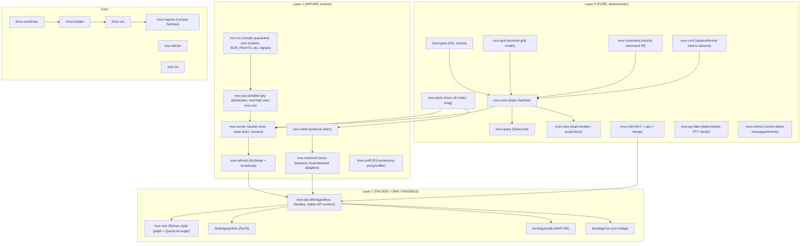

```markdown
# Project: **Ilex Mux** (`mux-*`)
**Tagline:** A new terminal multiplexer ecosystem in Rust that speaks tmux’s wire protocol perfectly, while keeping a fully deterministic core.

---

## 1. Project Name and Identity
- **Project name:** Ilex Mux
- **Crate prefix:** `mux-`
- **Binary names:** `muxd` (server), `mux` (CLI/client), `mux-tui` (visual client)
- **Compatibility goal:** **100% tmux protocol compatibility** for **tmux imsg-based protocol v8** (server side and client side).
- **Non-goal:** a tmux source port or ABI-compatible reimplementation.

---

## 2. Vision and Philosophy
tmux is a mature product with an intentionally C-shaped architecture: RB-trees of objects (`struct session`, `struct window`, `struct window_pane`), a libevent loop, a command queue (`cmd_queue`), and deep entanglement between protocol, runtime, and state. We want a different system:

- **Protocol compatibility, architectural independence:** tmux is treated as a *network protocol* (over UNIX domain sockets using imsg + FD passing), not as an internal design blueprint.
- **Deterministic kernel:** the multiplexer engine is a pure state machine: it processes `Event`s and returns `Effect`s. No IO. No `async`. No `unsafe`. No OS queries. No hidden clocks.
- **Hard layering:** protocol details stay in adapters. The core model uses neutral names/types (no `window_pane` nomenclature leaks).
- **Two interoperabilities:**
  1. Real tmux clients can attach to **our** server.
  2. Our client can attach to a **real tmux server** (for parity testing and as a backend).

The system is designed so an LLM or contributor can implement features by adding deterministic events and effects, without “reaching into the OS” from the core.

---

## 3. North Star Acceptance Criteria

### Compatibility Acceptance (tmux protocol v8)
- `tmux -L <sock> attach` can attach to `muxd` and:
  - list sessions/windows/panes, rename them, create/kill them
  - interactively run `split-window`, `new-window`, `select-pane`, `resize-pane`
  - see correct redraws and cursor movement, including alternate screen and basic termcap behaviors
- `mux` can connect to a real `tmux` server and execute:
  - `list-sessions`, `list-windows`, `list-panes`
  - create/rename/kill operations and receive refreshes
- Full fidelity for:
  - imsg framing and message ordering
  - SCM_RIGHTS FD passing for PTY/master FDs (sniffer preserves it)
  - protocol error behavior (disconnect on malformed frames; exact-ish tmux semantics where observable)

### Architectural Acceptance
- Layer 0 crates compile with:
  - `#![forbid(unsafe_code)]`
  - `#![deny(async_fn_in_trait)]` (and no `tokio` deps)
  - no dependencies on `libc`, `nix`, `rustix`, `mio`, `tokio`, `std::net`, `std::fs`
- Core behavior is:
  - deterministic (no time, randomness, thread scheduling, OS)
  - testable purely from `(state, events) -> (state, effects)`

### Product Acceptance
- A hermetic test harness can:
  - start a tmux server on an isolated socket and run compatibility checks
  - start `muxd` with a fake PTY backend and run deterministic snapshot tests (`insta`)
  - never touch the user’s live tmux server (`$TMUX`, default socket names, default TMPDIR paths)

---

## 4. High-Level Architecture (Layer Cake)

**Narrative:** everything points inward. Pure core owns truth; runtime owns IO and serialization; facade exposes stable APIs; ORM provides ergonomic traversal; CRDT is optional and layers above the pure core via event sourcing.



---

## 5. Workspace Layout (Full Tree)

```text
.
├─ Cargo.toml                         # workspace
├─ AGENTS.md                          # repo-wide agent rules (see template below)
├─ crates/
│  ├─ mux-types/
│  │  ├─ Cargo.toml
│  │  └─ src/
│  │     ├─ lib.rs                    # typed IDs, entity structs
│  │     ├─ ids.rs                    # SlotMap key types
│  │     ├─ model.rs                  # core entity model
│  │     └─ errors.rs
│  ├─ mux-grid/
│  │  └─ src/                         # terminal grid + diff-friendly snapshots
│  ├─ mux-command/
│  │  └─ src/                         # neutral command IR (no tmux names)
│  ├─ mux-conf/
│  │  └─ src/                         # options schema + format token registry
│  ├─ mux-query/
│  │  └─ src/                         # QueryList + lookups
│  ├─ mux-view/
│  │  └─ src/                         # projections / read models
│  ├─ mux-crdt/
│  │  └─ src/                         # HLC + ops + merge logic (pure)
│  ├─ mux-control/
│  │  └─ src/                         # control-plane events/effects (pure)
│  ├─ mux-pty-fake/
│  │  └─ src/                         # FakePty backend (pure)
│  ├─ mux-proto/
│  │  └─ src/                         # tmux v8 codec, imsg framing (pure)
│  ├─ mux-test-support/
│  │  └─ src/                         # hermetic servers, PathGuard, fixtures
│  ├─ mux-os/                          # IMPURE (unsafe quarantine)
│  │  ├─ SAFETY.md
│  │  └─ src/
│  │     ├─ uds.rs                    # unix sockets + SCM_RIGHTS
│  │     ├─ pty.rs                    # openpty/forkpty or platform equivalents
│  │     ├─ proc.rs                   # spawn/kill helpers
│  │     └─ fd.rs                     # OwnedFd wrappers
│  ├─ mux-pty-portable/                # IMPURE safe abstraction
│  │  └─ src/
│  ├─ mux-client/                      # IMPURE tmux client
│  │  └─ src/
│  ├─ mux-backend/                     # IMPURE backend adapters (local/tmux)
│  │  └─ src/
│  ├─ mux-refresh/                     # IMPURE ArcSwap snapshots + broadcast
│  │  └─ src/
│  ├─ mux-server/                      # IMPURE server runtime
│  │  └─ src/
│  ├─ mux-api/                         # FACADE: stable public API for bindings
│  │  └─ src/
│  ├─ mux-orm/                         # ORM-like graph traversal + QueryList sugar
│  │  └─ src/
│  └─ mux-tui/                         # Rust-native visual client (ratatui or custom)
│     └─ src/
├─ tools/
│  ├─ tmux-vm/
│  │  └─ src/
│  ├─ tmux-builder/
│  │  └─ src/
│  ├─ tmux-worktrees/
│  │  └─ src/
│  ├─ tmux-sniff/
│  │  └─ src/
│  ├─ mux-doctor/
│  │  └─ src/
│  ├─ mux-regress/
│  │  └─ src/
│  └─ mux-audit/                       # format/command audit tools
│     └─ src/
├─ bindings/
│  ├─ python/
│  │  ├─ pyproject.toml                # maturin + uv
│  │  ├─ src/                          # python package
│  │  ├─ tests/                        # pytest snapshots
│  │  └─ rust/                         # PyO3 crate
│  ├─ node/
│  │  ├─ package.json                  # pnpm workspace
│  │  ├─ src/
│  │  ├─ tests/                        # vitest snapshots
│  │  └─ rust/                         # napi-rs crate
│  └─ cxx/
│     ├─ include/
│     ├─ tests/
│     └─ rust/                         # cxx bridge crate
├─ fixtures/
│  ├─ proto/                           # golden imsg frames
│  ├─ grids/                           # insta baselines for terminal grids
│  └─ scripts/
└─ docs/
   ├─ architecture.md                  # (this document, canonical)
   ├─ protocol.md                      # deeper protocol notes
   └─ contributing.md
```

---

## 6. Layering Contract (Hard Boundaries A–D)

### A. Core is deterministic
Rules:
- Layer 0 cannot:
  - open sockets, read files, inspect env vars, access time, spawn processes
  - allocate real PTYs
- Layer 0 can:
  - transform bytes to/from protocol structs (`mux-proto`) purely
  - compute layout, grid changes, command planning, event emission

Enforcement:
- In every Layer 0 crate:
  - `#![forbid(unsafe_code)]`
  - deny IO by convention and CI lint (ban `std::fs`, `std::net`, `std::process`, `std::time::SystemTime`)
- “Clock/time” is an `Event::ClockTick { now: LogicalTime }` produced by runtime, never pulled by core.

### B. Store snapshots are the read path
Rules:
- All readers (UI, bindings, tools) read immutable snapshots (`Arc<Snapshot>`) via `ArcSwap`.
- All writes funnel through a single serialized writer: the **StateActor**.

Enforcement:
- `mux-api` exposes read-only snapshots and intent methods; it never hands out mutable core state.
- Runtime prohibits direct mutation outside actor, even internally.

### C. tmux compatibility is an adapter
Rules:
- No tmux protocol enums/types in core entity names.
- Core works in neutral terms (`Split`, `Layout`, `Viewport`, `InputBytes`, `PaneSurface`).
- `mux-proto` maps tmux wire messages into neutral `Event`s and `Effect`s.

Enforcement:
- `mux-core` must compile without `mux-proto`.
- The only crates that “say tmux” are: `mux-proto`, `mux-client` (tmux backend), `tmux-* tools`, and compatibility tests.

### D. ORM API is a facade, not the engine
Rules:
- ORM provides traversal/query ergonomics and translates to typed “intent” operations.
- ORM never encodes runtime policies (socket loop, PTY management, refresh cadence).
- ORM never holds internal locks to core; it is snapshot-based.

Enforcement:
- Bindings depend only on `mux-api` (and optionally `mux-orm`), never on runtime crates.

---

## 7. Entity Model (SlotMap-backed typed IDs)

### Typed IDs (SlotMap keys)
In `mux-types/src/ids.rs`:

```rust
use slotmap::{new_key_type, Key};

new_key_type! { pub struct ServerId; }
new_key_type! { pub struct ClientId; }
new_key_type! { pub struct SessionId; }
new_key_type! { pub struct WindowId; }
new_key_type! { pub struct PaneId; }
new_key_type! { pub struct JobId; }
new_key_type! { pub struct BufferId; }
```

### Core graph (bidirectional)
In tmux C, the canonical objects live roughly as:
- `struct session { ... struct winlink *windows; ... }`
- `struct window { ... struct window_pane *panes; ... }`
- `struct window_pane { ... int fd; struct screen screen; ... }`

We mirror the *relationships* but keep naming neutral:

```rust
pub struct Server {
  pub id: ServerId,
  pub sessions: Vec<SessionId>,
  pub clients: Vec<ClientId>,
  pub buffers: Vec<BufferId>,
  pub jobs: Vec<JobId>,
  pub options: OptionsMap,
}

pub struct Client {
  pub id: ClientId,
  pub server: ServerId,
  pub attached_session: Option<SessionId>,
  pub active_window: Option<WindowId>,
  pub active_pane: Option<PaneId>,
  pub term: TermInfo,                // declared by runtime, interpreted by core
  pub last_activity: LogicalTime,     // injected
  pub flags: ClientFlags,
}

pub struct Session {
  pub id: SessionId,
  pub server: ServerId,
  pub name: String,
  pub windows: Vec<WindowId>,
  pub active_window: WindowId,
  pub created_at: LogicalTime,
  pub options: OptionsMap,
}

pub struct Window {
  pub id: WindowId,
  pub session: SessionId,            // strong parent link (simplifies traversal)
  pub name: String,
  pub panes: Vec<PaneId>,
  pub active_pane: PaneId,
  pub layout: LayoutTree,
  pub options: OptionsMap,
}

pub struct Pane {
  pub id: PaneId,
  pub window: WindowId,
  pub title: String,
  pub cwd: Option<String>,           // runtime-provided; core stores last-known
  pub grid: GridSnapshot,            // from mux-grid
  pub cursor: Cursor,
  pub mode: PaneMode,                // copy-mode, etc.
  pub input: InputState,
  pub pty: PtyRef,                   // opaque handle; runtime resolves to real FD
  pub flags: PaneFlags,
}

pub struct Job {
  pub id: JobId,
  pub server: ServerId,
  pub kind: JobKind,                 // spawn cmd, etc.
  pub status: JobStatus,
}

pub struct Buffer {
  pub id: BufferId,
  pub server: ServerId,
  pub name: String,
  pub bytes: Vec<u8>,
}
```

### Storage
`mux-core` holds:

```rust
pub struct Graph {
  pub server: Server,
  pub clients: slotmap::SlotMap<ClientId, Client>,
  pub sessions: slotmap::SlotMap<SessionId, Session>,
  pub windows: slotmap::SlotMap<WindowId, Window>,
  pub panes: slotmap::SlotMap<PaneId, Pane>,
  pub jobs: slotmap::SlotMap<JobId, Job>,
  pub buffers: slotmap::SlotMap<BufferId, Buffer>,
}
```

---

## 8. Event/Effect Engine

### Signature (canonical)
```rust
pub fn apply_event(g: &Graph, e: Event) -> (Graph, Vec<Effect>);
```

### Event (selected, representative)
Events are **neutral** and originate from:
- protocol decode (`mux-proto`)
- runtime IO (PTY read, socket read/write completion)
- control plane (API intents)

```rust
pub enum Event {
  // Lifecycle
  ServerStart { now: LogicalTime },
  ClientConnected { client: ClientId, now: LogicalTime, term: TermInfo },
  ClientDisconnected { client: ClientId, reason: DisconnectReason },

  // Attach / detach
  ClientAttach { client: ClientId, session: SessionId },
  ClientDetach { client: ClientId },

  // Topology (like tmux new-session/new-window/split-window/kill-pane)
  SessionCreate { name: String, opts: OptionsDelta },
  SessionKill { session: SessionId },
  WindowCreate { session: SessionId, name: String },
  WindowKill { window: WindowId },
  PaneSplit { window: WindowId, target: PaneId, direction: SplitDir, size: SplitSize },
  PaneKill { pane: PaneId },
  PaneSelect { window: WindowId, pane: PaneId },
  PaneResize { pane: PaneId, delta: (i16, i16) },

  // Input/output
  PaneInputBytes { pane: PaneId, bytes: Vec<u8> },          // from client key input
  PtyOutputBytes { pane: PaneId, bytes: Vec<u8> },          // from PTY read
  Tick { now: LogicalTime },                                // from runtime

  // Query/format relevant
  OptionSet { scope: OptionScope, key: String, value: OptionValue },
  BufferSet { buffer: BufferId, bytes: Vec<u8> },

  // Protocol-level (used only in adapters; core still sees them as events)
  ProtocolViolation { client: ClientId, detail: String },
}
```

### Effect (selected, representative)
Effects are instructions for impure layers:

```rust
pub enum Effect {
  // Socket/protocol
  SendToClient { client: ClientId, msg: ProtoOut },   // mux-proto serializes
  DisconnectClient { client: ClientId, reason: DisconnectReason },

  // PTY
  PtySpawn { pane: PaneId, cmd: CommandSpec, initial_size: (u16, u16) },
  PtyWrite { pane: PaneId, bytes: Vec<u8> },
  PtyResize { pane: PaneId, size: (u16, u16) },
  PtyKill { pane: PaneId },

  // Rendering / refresh
  MarkDirty { scope: DirtyScope },                    // triggers projection recompute
  PublishSnapshot,                                    // runtime pushes ArcSwap snapshot

  // Jobs
  JobSpawn { job: JobId, cmd: CommandSpec },
  JobKill { job: JobId },
}
```

### Determinism rules
- `apply_event` must be total and deterministic:
  - no panics on untrusted input (return `Effect::DisconnectClient` or `ProtocolViolation`)
  - all randomness replaced by runtime-injected IDs/times *or* deterministic ID allocators stored in state

---

## 9. Protocol Codec (tmux imsg v8)

### Frame model
tmux uses an imsg-like envelope over UNIX sockets and passes FDs via SCM_RIGHTS for certain operations. We model the protocol in two layers:

1. **Transport envelope** (imsg-ish):
   - header: fixed-size (includes type, length, peerid/pid-ish fields depending on version)
   - payload: message-specific bytes
   - optional ancillary FDs (SCM_RIGHTS)

2. **Message payload**:
   - typed structs for protocol v8 messages (capabilities, commands, stdin bytes, redraw notifications)

> Design note: exact C struct layouts vary by tmux version; `mux-proto` must target **protocol v8** precisely and include golden fixtures extracted from real tmux traffic (see testing below).

### `mux-proto` API (pure)
```rust
pub struct ImsgFrame<'a> {
  pub msg_type: MsgType,
  pub flags: u16,
  pub peer_id: u32,
  pub payload: &'a [u8],
  pub fds: SmallVec<[u32; 2]>, // decoded as integers in pure layer; runtime owns real FDs
}

pub enum DecodeStep {
  NeedMore(usize),
  Frame(ImsgFrameOwned),
  Error(ProtoError),
}

pub struct Decoder { /* incremental state */ }

impl Decoder {
  pub fn push(&mut self, bytes: &[u8]) -> Vec<DecodeStep>;
}
```

### Two-phase decode
- **Phase 1 (framing):** parse imsg header and collect payload bytes; associate FD-count metadata (but not OS FDs).
- **Phase 2 (payload):** decode payload into `ProtoIn` message enums that map to neutral `Event`s.

```rust
pub enum ProtoIn {
  Identify { /* ... */ },
  Command { argv: Vec<String> },
  Stdin { bytes: Vec<u8> },
  Resize { cols: u16, rows: u16 },
  // ...
}

pub enum ProtoOut {
  Print { text: String },
  Redraw { /* ... */ },
  Exit { code: i32 },
  // ...
}
```

### Fixture testing (critical)
- `fixtures/proto/*.bin`: captured imsg frames from real tmux v8 sessions (including fd-passing events).
- `mux-proto` tests:
  - round-trip encode/decode for known messages
  - decode robustness: truncation, garbage bytes, oversized length, invalid UTF-8 rules (if tmux rejects/accepts)

---

## 10. ORM-like Query API (libtmux-inspired)

### Goals
- Mirror libtmux ergonomics: `Server -> Session -> Window -> Pane` traversal.
- Provide Django-style `QueryList.filter(...)` with lookups:
  - `exact`, `iexact`, `contains`, `icontains`, `startswith`, `istartswith`, `endswith`, `iendswith`, `regex`
- Work with two backends:
  1. **Local backend:** in-process `mux-core` via `mux-api`
  2. **tmux backend:** connects to real tmux via `mux-client`

### Snapshot-first design
- `mux-refresh` publishes `Arc<Snapshot>` via `ArcSwap`.
- ORM objects are lightweight handles with `(backend, id)` and pull fields from snapshot.

### Core types (`mux-query`)
```rust
pub enum Lookup {
  Exact, IExact,
  Contains, IContains,
  StartsWith, IStartsWith,
  EndsWith, IEndsWith,
  Regex,
}

pub struct QueryOp {
  pub field: &'static str,
  pub lookup: Lookup,
  pub value: QueryValue,
}

pub struct QueryList<T> {
  items: Vec<T>,
}

impl<T> QueryList<T> {
  pub fn filter(self, ops: &[QueryOp]) -> Self { /* pure */ }
  pub fn get(self, ops: &[QueryOp]) -> Result<T, QueryError> { /* 0/1 semantics */ }
}
```

### `Queryable` derive (optional but recommended)
In `mux-query`, a derive macro can generate field accessors and registry for filtering.

```rust
#[derive(Queryable)]
pub struct PaneView {
  pub id: PaneId,
  pub title: String,
  pub active: bool,
  pub index: u32,
}
```

### libtmux-equivalent examples (`mux-orm`)
```rust
// Python/libtmux style:
// server.sessions.filter(session_name__icontains="dev").get()

let mux = ManagedMux::connect_local().await?; // runtime call (impure)
let server = mux.server();                    // facade handle
let sessions = server.sessions().refresh().await?;
let dev = sessions
  .filter(&[q("name", IContains, "dev")])
  .get(&[])?;

// Bidirectional traversal:
let w = dev.windows().filter(&[q("name", Exact, "editor")]).get(&[])?;
let p = w.panes().filter(&[q("active", Exact, true)]).get(&[])?;
p.send_keys("cargo test\n").await?;
```

---

## 11. Runtime Architecture

### Actors (SocketActor + StateActor)
- **SocketActor (per connection):**
  - owns the OS socket
  - reads bytes + ancillary FDs
  - uses `mux-proto::Decoder` (pure)
  - translates `ProtoIn -> Event` and sends to StateActor
  - receives `Effect::SendToClient { msg }` and writes encoded bytes + ancillary FDs

- **StateActor (single writer):**
  - owns `Graph`
  - applies `apply_event`
  - emits `Effect`s to:
    - SocketActors
    - PtyDriver
    - RefreshDriver

### Refresh system (lock-free reads)
- **RefreshDriver:**
  - recomputes projections (`mux-view`) when `Effect::MarkDirty` or time-based policies
  - publishes `Arc<Snapshot>` through `ArcSwap<Snapshot>`
  - emits to `broadcast::Sender<SnapshotEvent>` for bindings/subscribers

- **RefreshPlanner:**
  - coalesces dirty scopes, avoids redundant recompute
  - enforces refresh budgets (important for large sessions)

### Key runtime handles (`mux-api`)
```rust
pub struct ManagedMux {
  state: StateHandle,
  refresh: RefreshHandle,
  backend: BackendHandle, // local or tmux
}

pub struct StateHandle {
  pub fn submit(&self, intent: Intent) -> impl Future<Output = Result<()>>;
  pub fn snapshot(&self) -> Arc<Snapshot>; // ArcSwap load
}

pub struct RefreshHandle {
  pub fn subscribe(&self) -> broadcast::Receiver<SnapshotEvent>;
}
```

### SocketActor pattern for managed per-socket connections
- `ManagedMux::connect_tmux(socket_path)` spawns a SocketActor for that socket.
- Multiple sockets mean multiple actors, each with:
  - independent protocol state
  - shared snapshot cache (optional) or per-connection snapshot depending on backend semantics

---

## 12. Language Bindings

### Philosophy: thin wrappers over `mux-api`
- Bindings expose:
  - connection management (`ManagedMux`)
  - snapshot objects (`ServerSnapshot`, `SessionSnapshot`, etc.)
  - intent methods (create/kill/split/select/send-keys)
  - subscriptions (snapshot update stream)
- Bindings do **not** expose:
  - internal actors, sockets, FD types, PTY internals
  - core `Graph` mutation

### Python (PyO3 + maturin, built via uv)
- `bindings/python/rust` depends on `mux-api` only
- Expose:
  - `ManagedMux.connect_local()`, `ManagedMux.connect_tmux(socket)`
  - `Server.sessions()`, `Session.windows()`, `Window.panes()`
  - `QueryList.filter(...)` with `field__lookup="value"` parsing

Testing:
- `pytest` with plugin fixtures (see section 17)
- snapshot testing: compare `GridSnapshot` JSON or compact text dumps

### Node (NAPI-RS, built via pnpm)
- `bindings/node/rust` depends on `mux-api` only
- Expose:
  - async methods for intents
  - event emitter / async iterator for snapshot updates

Testing:
- `vitest` fixtures + snapshot patterns (see section 17)

### C++ (cxx bridge)
- `bindings/cxx/rust` depends on `mux-api`
- Expose:
  - stable C++ structs for snapshots (POD-friendly)
  - explicit lifetime model (copy snapshots, avoid borrowing across the boundary)

---

## 13. CRDT Transaction Layer (Optional, No Kernel Retrofit)

### Goal
Support collaborative sessions by replicating *operations* (events/intents) rather than replicating raw mutable state. Core remains unchanged; CRDT is an overlay:

- Local user action => `Intent` => `Event` => `apply_event`
- CRDT layer logs a **CrdtOp** corresponding to the intent/event
- Remote ops merge into a single ordered stream and are re-applied as events

### Pure CRDT core (`mux-crdt`)
```rust
pub struct HybridLogicalClock {
  pub wall: u64,   // runtime-injected wall component
  pub logical: u32,
  pub node: u16,
}

pub enum CrdtOp {
  CreateSession { id: SessionId, name: String },
  KillSession { id: SessionId },
  CreateWindow { id: WindowId, session: SessionId, name: String },
  SplitPane { id: PaneId, window: WindowId, target: PaneId, dir: SplitDir, size: SplitSize },
  SendKeys { pane: PaneId, bytes: Vec<u8> },
  SetOption { scope: OptionScope, key: String, value: OptionValue },
  // ...
}

pub struct OpEnvelope {
  pub hlc: HybridLogicalClock,
  pub op: CrdtOp,
}
```

### Merge strategies
- **Causal ordering:** sort by `(hlc.wall, hlc.logical, node)`; detect and preserve causality where possible.
- **Conflict policy:** deterministic resolution:
  - name conflicts: last-writer-wins by HLC
  - topology conflicts (kill vs write): kill wins; subsequent writes become no-ops
  - ID allocation: prefer runtime-allocated IDs encoded into ops; never “guess” IDs

### Snapshot + delta encoding
- Periodic snapshot of op log state:
  - `Snapshot { graph_hash, last_hlc, compacted_ids, ... }`
- Deltas:
  - varint encoding for repeated IDs
  - dictionary encoding for common strings (session/window names)

### Transport
- Not mandated: could be WebRTC, TCP, or file-based replication.
- The only contract: produce merged `OpEnvelope`s that convert into `Event`s.

---

## 14. tmux Version Management (vm/builder/worktrees)

### `tmux-worktrees`
- Manages git worktrees for tmux:
  - `tmux-worktrees add <ref> -> ~/.cache/ilex-mux/tmux-worktrees/<ref>/`
  - fast switching between tags/commits for protocol regression

### `tmux-builder`
- Builds tmux from a worktree at any git ref:
  - runs `sh autogen.sh` / `configure` / `make`
  - captures build metadata (commit hash, config flags, libevent version)
  - stores resulting `tmux` binary in versioned cache

### `tmux-vm`
- Version manager and executor:
  - `tmux-vm ensure 3.4` (or a git ref)
  - `tmux-vm exec 3.4 -- tmux -L testsock new-session ...`
- Must support hermetic sockets:
  - always pass `-L` or `-S` and set `TMUX_TMPDIR` to an isolated directory

### Regress/format/command audit tools
- `mux-regress`:
  - runs parity scripts against many tmux versions (matrix)
- `mux-audit`:
  - audits supported command set vs tmux `cmd_table[]` and known format variables (from `format.c` behavior as observed)

---

## 15. Test Support Crate (`mux-test-support`)

### Hermetic server harness
- `TmuxTestServer`:
  - spawns a real tmux server at an isolated socket
  - provides helper methods: `run_tmux(args)`, `socket_path()`, cleanup
- `MuxServerTestServer`:
  - spawns `muxd` with fake PTY backend by default (deterministic)
  - optionally spawns real PTY backend for end-to-end tests

### `PathGuard` safety
- Creates unique temp roots:
  - socket dir
  - `TMUX_TMPDIR`
  - logs and dumps
- Ensures cleanup, even on panic/test failure.

### Isolation rules (never conflict with live tmux)
- Always set:
  - `TMUX=`
  - `TMUX_TMPDIR=<temp>/tmux-tmp`
  - tmux socket via `-L <unique>` or `-S <temp>/sock`
- Never use default socket names.
- Never read user’s `~/.tmux.conf` (set `-f /dev/null` unless the test explicitly includes a fixture config).

---

## 16. Fake PTY Backend (`mux-pty-fake`)

### Purpose
Deterministic tests without allocating real PTYs or touching the OS.

### Model
```rust
pub struct FakePty {
  pub id: u32,
  pub size: (u16, u16),
  pub in_buf: Vec<u8>,   // bytes written to PTY (from mux)
  pub out_buf: Vec<u8>,  // bytes read from PTY (to mux)
}

pub enum FakePtyAction {
  Spawn { pane: PaneId, size: (u16,u16) },
  Write { pane: PaneId, bytes: Vec<u8> },
  Resize { pane: PaneId, size: (u16,u16) },
  Kill { pane: PaneId },
  InjectOutput { pane: PaneId, bytes: Vec<u8> }, // test driver simulates program output
}

pub struct FakePtyBackend {
  pub ptys: BTreeMap<PaneId, FakePty>,
}
```

### Deterministic testing workflow
- test applies events
- collects effects
- feeds PTY effects into `FakePtyBackend` which produces follow-up events (`Event::PtyOutputBytes`)
- snapshot the resulting `GridSnapshot` via `insta`

---

## 17. Binding Test Frameworks

### Python pytest plugin
- Provide `pytest` plugin in `bindings/python/src/mux_pytest_plugin.py`:
  - fixtures: `server`, `session`, `window`, `pane`, `mux`
  - all fixtures use `mux-test-support` to create isolated sockets/dirs

Snapshot patterns:
- assert stable grid dumps:
  - `pane.grid_text()` returns compact text with visible cursor marker
- subscribe tests:
  - `mux.subscribe()` yields snapshot events; verify ordering and coalescing

### Node vitest plugin
- Provide `vitest` helpers in `bindings/node/src/test/fixtures.ts`:
  - `withMux(async (mux) => { ... })`
  - `createSession`, `createWindow`, `createPane`
  - `expectGrid(pane).toMatchSnapshot()`

---

## 18. Test Framework and Harness Design

### Test categories
- **Pure unit tests (Layer 0):**
  - `mux-core`: event/effect correctness
  - `mux-grid`: terminal parsing + snapshot correctness
  - `mux-proto`: decode/encode fixtures
  - `mux-query`: lookup semantics
  - `mux-crdt`: merge correctness

- **Integration tests (Layer 1):**
  - local backend with fake PTY: protocol loop + snapshot refresh
  - socket actor tests (without touching real tmux)

- **Parity tests (tooling):**
  - `mux-regress` runs the same scenario scripts against:
    - our server with a real tmux client
    - real tmux server with our client
  - compare observable outputs:
    - list commands output
    - grid snapshots (where meaningful)
    - protocol traces from `tmux-sniff`

- **E2E tests (optional, slower):**
  - real PTY backend, spawn a real shell, run minimal commands, validate redraw

### Organization
- `crates/*/tests/` for crate-local tests
- `tools/mux-regress/` hosts scenario scripts and golden outputs
- `fixtures/` stores captured protocol frames and grid baselines

---

## 19. Visual Client (TUI)

### Decision: ratatui vs custom
- Use **ratatui** for:
  - fast iteration, stable widgets, cross-platform terminal backend
  - easy snapshot testing via buffer diffs if we isolate rendering
- Build custom rendering only for:
  - tmux-accurate layout edge cases
  - extremely high throughput redraw optimization

### Rendering pipeline
1. Read snapshot (`ArcSwap` load) from `mux-api`
2. Compute `ViewModel` (pure-ish; can live in `mux-view`)
3. Render:
   - panes laid out by `LayoutTree`
   - each pane uses `GridSnapshot` with minimal diffs
4. Input:
   - translate key events to neutral `Intent::SendKeys` or pane selection intents
5. Optional: use tmux protocol directly to connect to tmux or muxd (client mode)

### Testing
- snapshot test the ratatui buffer (or a custom “render dump”) for known layouts.
- never rely on the user’s terminal state; use fixed terminal sizes in tests.

---

## 20. DOs and DON’Ts (Contributor + LLM Rules)

### DO
- Keep Layer 0 pure and deterministic:
  - add new behaviors by extending `Event`/`Effect` and `apply_event`
- Add protocol features in `mux-proto` and map them to neutral events/effects.
- Use typed IDs everywhere (SlotMap keys).
- Use `ArcSwap` snapshots for reads; serialize all writes through the StateActor.
- Add fixtures whenever you touch protocol decoding/encoding.
- Add hermetic tests that set explicit tmux socket paths and temp roots.

### DON’T
- Don’t import `tokio`, `libc`, `nix`, `rustix`, `std::fs`, `std::net` into Layer 0 crates.
- Don’t let tmux naming leak into core types (no `window_pane` in `mux-core`).
- Don’t mutate core state from outside StateActor.
- Don’t connect to default tmux sockets in tests.
- Don’t rely on `~/.tmux.conf` or user environment in tests unless explicitly required by a fixture.
- Don’t expose runtime internals through bindings.

---

## 21. AGENTS.md Template (Repo-Ready)

```markdown
# AGENTS.md

## Mission
Build Ilex Mux: a Rust terminal multiplexer ecosystem with perfect tmux protocol v8 compatibility, while preserving a fully deterministic pure core.

## Non-Negotiables
- Layer 0 crates are PURE:
  - no async, no IO, no unsafe, no libc/nix/rustix, no tokio
  - deterministic: core only transforms (state, event) -> (state, effects)
- tmux protocol details live in mux-proto/mux-client only. No protocol naming leaks into mux-core entity/types.
- Reads are snapshot-based via ArcSwap. Writes are serialized through the StateActor.
- Tests must be hermetic and must not touch the user’s live tmux server:
  - always use isolated socket paths (-L/-S) and isolated TMUX_TMPDIR
  - never assume default tmux socket names

## Workspace Map (summary)
- Pure: mux-types, mux-core, mux-grid, mux-query, mux-view, mux-command, mux-conf, mux-crdt, mux-control, mux-pty-fake, mux-proto
- Impure: mux-os (unsafe quarantine), mux-pty-portable, mux-client, mux-backend, mux-refresh, mux-server
- Facade: mux-api, mux-orm
- Tools: tmux-vm, tmux-builder, tmux-worktrees, tmux-sniff, mux-regress, mux-doctor, mux-audit
- Bindings: python (PyO3), node (NAPI-RS), cxx (cxx)

## How To Add Features
1. Identify the user-visible behavior (command, key, redraw, API call).
2. Add/extend a neutral `Event` and `Effect` in mux-core.
3. Implement behavior in `apply_event`.
4. If protocol-related:
   - add decode/encode support in mux-proto
   - map `ProtoIn -> Event` and `Effect::SendToClient -> ProtoOut`
5. Add tests:
   - pure unit tests first (event/effect + grid snapshot)
   - protocol fixture tests if framing changes
   - integration/parity tests only after pure correctness

## Testing Rules
- Use mux-test-support PathGuard for temp roots and socket naming.
- Always set TMUX= empty and pass -L/-S in any tmux invocation.
- Prefer mux-pty-fake for deterministic tests.

## Safety Rules (mux-os)
- All unsafe code must live in mux-os and be documented in SAFETY.md.
- Provide safe wrappers for:
  - UNIX sockets + SCM_RIGHTS
  - PTY allocation
  - process spawning
- Never expose raw FDs beyond mux-os except via OwnedFd wrappers.

## Review Checklist
- Layering: dependencies point inward.
- Purity: no forbidden imports in Layer 0.
- Determinism: no hidden clocks/randomness.
- Fixtures: protocol changes have golden tests.
- Hermeticity: tests can’t collide with user tmux.
```

---

## 22. Phased Implementation Plan

### Phase 0: Scaffolding + Contracts
- Create workspace crates with Layer 0 purity guards.
- Define typed IDs and `Graph` skeleton.
- Implement minimal snapshot structs and `ArcSwap` publishing.

### Phase 1: Deterministic Kernel MVP
- Implement `apply_event` for:
  - create session/window/pane
  - select pane/window
  - split/resize
- Implement `mux-grid` minimal terminal interpretation sufficient for basic redraw snapshots.
- Implement `mux-pty-fake` loop to drive `PtyOutputBytes`.

### Phase 2: tmux Protocol v8 Codec (fixtures first)
- Build `mux-proto` framing + message enums.
- Capture golden fixtures via `tmux-sniff` + real tmux v8.
- Pass fixture-based decode/encode tests.

### Phase 3: Runtime Server (muxd)
- Implement StateActor + SocketActor.
- Implement refresh driver and snapshot publication.
- Accept real tmux client attach and basic commands.

### Phase 4: Client + tmux backend
- Implement `mux-client` that can attach to real tmux.
- Implement `mux-backend` with:
  - local backend (in-process)
  - tmux backend (remote)

### Phase 5: ORM + Bindings
- Implement `mux-api` stable surface and `mux-orm` QueryList sugar.
- Add Python/Node/C++ bindings and their snapshot test frameworks.

### Phase 6: CRDT Overlay (optional)
- Implement `mux-crdt` ops + HLC + merge.
- Add transport-agnostic op log integration in `mux-api` (event sourcing).
- Add collaborative session parity tests (merge determinism).

### Phase 7: Visual Client + Tooling Hardening
- Implement `mux-tui` with robust rendering pipeline.
- Expand `tmux-vm/builder/worktrees` and `mux-regress` to cover a tmux version matrix.
- Add `mux-doctor` diagnostics and stale PTY cleanup tools.

---

## 23. Risks and Mitigations

- **Risk: protocol v8 edge cases (imsg layout, message ordering, fd passing).**
  - Mitigation: fixture-first development, sniffer tool, parity tests across tmux versions, strict decode fuzz tests (pure).

- **Risk: terminal emulation mismatch (grid behavior vs tmux).**
  - Mitigation: isolate `mux-grid` with extensive insta snapshots; compare against tmux-captured screen states where feasible.

- **Risk: performance regressions due to snapshot recompute.**
  - Mitigation: dirty-scope planning, coalescing refresh, incremental projections in `mux-view`.

- **Risk: layering erosion (protocol leaking into core, runtime calls from pure).**
  - Mitigation: CI checks for forbidden imports, crate dependency lint, explicit “tmux words banned” grep in core.

- **Risk: tests colliding with user tmux / leaking processes/ptys.**
  - Mitigation: PathGuard, unique sockets, forced TMUX_TMPDIR, leak detection + cleanup tooling, default fake PTY.

- **Risk: bindings become de facto API surface and freeze internals.**
  - Mitigation: bindings depend only on `mux-api`; `mux-api` uses stable snapshots + intents; keep internals private.

- **Risk: CRDT complexity infects the kernel.**
  - Mitigation: CRDT is event sourcing overlay; core remains unchanged; CRDT ops map to existing intents/events.

---
```
