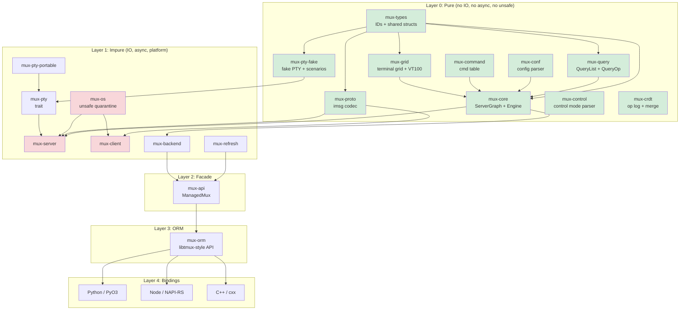

# TermForge v6 Definitive Architecture Specification

## Preamble (license, MSRV, edition, protocol target)
- License: MIT (or dual MIT/Apache-2.0, final choice fixed in workspace root).
- Rust edition: 2024.
- MSRV: 1.84.0.
- Protocol target: exact tmux wire compatibility across `enum msgtype` and identify/control sequencing (`tmux-protocol.h:26-70`, `client.c:460-494`, `server-client.c:3385-3474`).
- Runtime target: Unix domain socket server with tmux-compatible startup/lock/config semantics (`client.c:78-98`, `client.c:137-168`, `server.c:176-234`).

## 1. Vision and Philosophy (from v4 §2, refined)

### Core Thesis

TermForge is not a tmux port. It is a **new terminal multiplexer** that speaks tmux's binary protocol (`imsg` over Unix domain sockets). The internal architecture is Rust-native: algebraic types, ownership-tracked state, pure-functional kernel, and async runtime -- while maintaining bit-for-bit compatibility with the tmux wire format.

### Architectural Principles

1. **Pure/Impure Separation (Sans-IO):** The kernel (`mux-core`) is a pure `fn(graph, event) -> (graph, effects)` reducer. It never touches file descriptors, system calls, timers, or network. All IO happens in the runtime layer that interprets `Effect` variants.

2. **tmux is a Compatibility Profile, Not the Architecture:** tmux's `struct session`, `struct window`, `struct window_pane` inform our entity model but do not dictate it. Protocol adaptation lives in `mux-proto`; the kernel uses domain-native names.

3. **Snapshots are the Read Path:** The authoritative state lives in the `ServerGraph`. Readers (UI, bindings, query API) see immutable snapshots published via `ArcSwap`. Writers go through the event/effect engine. This eliminates read contention.

4. **ORM is a Facade, Not the Engine:** `mux-orm` translates user intent into commands/events. It never implements multiplexer logic. It must not become a second business-logic engine.

5. **Layered Testing:** Every layer has its own test strategy. Pure core uses property testing and snapshot testing. Protocol uses fixture-driven roundtrip tests. Runtime uses hermetic servers with fake PTYs.

6. **WASM as Purity Proof:** Layer 0 crates compile to `wasm32-unknown-unknown` as a CI gate, not a production deployment target. This catches accidental OS dependencies.

### Why Not a Direct Port

| Direct Port | TermForge |
|---|---|
| Platform code in the kernel | Platform code quarantined in `mux-os` |
| RB-tree state with manual memory | SlotMap with generation-checked IDs |
| Libevent callback soup | Structured async with tokio tasks |
| CRDTs require invasive surgery | CRDTs compose on top of pure events |
| Testing requires real PTY | Fake PTY backend for deterministic tests |

---


## 2. North Star Acceptance Criteria (from v4 §3, refined with v5 performance targets)

### 3.1 Compatibility

| ID | Criterion | Verification |
|---|---|---|
| C1 | Real tmux 3.6+ client attaches to `muxd` | Integration test: `tmux attach -S <sock>` |
| C2 | `mux` client attaches to real tmux 3.6+ server | Integration test via `mux-client` |
| C3 | Protocol v8 imsg framing roundtrips all 35 `MsgType` variants | `proptest` with arbitrary payloads |
| C4 | Identify burst (13 message types) roundtrips correctly | Fixture captures from real tmux |
| C5 | SCM_RIGHTS fd passing preserved through sniff proxy | `tmux-sniff` passthrough test |
| C6 | Command semantics match tmux's 144+ `cmd_table` entries | `tmux-command-audit` parity checks |
| C7 | Format string expansion matches tmux for 200+ variables | `format-audit` parity corpus |
| C8 | Default key bindings match tmux across all 4 key tables | Key table parity tests |

### 3.2 Architectural

| ID | Criterion | Enforcement |
|---|---|---|
| A1 | Layer 0 crates: zero `unsafe`, zero `tokio`, zero `libc` | `#![forbid(unsafe_code)]` in crate root |
| A2 | Layer 0 compiles to `wasm32-unknown-unknown` | CI: `cargo check --target wasm32-unknown-unknown` |
| A3 | `mux-os` is the sole `unsafe` quarantine | CI lint: grep for `unsafe` outside `mux-os` |
| A4 | All state transitions are deterministic | Property: `apply_event(s, e)` is referentially transparent |
| A5 | No panics in protocol decode/encode paths | `#[deny(clippy::unwrap_used)]` in hot crates |
| A6 | Bindings depend only on `mux-api`/`mux-orm` | Cargo dependency check in CI |
| A7 | No `Arc<Mutex<_>>` in the read path | `ArcSwap`-based `StateHandle` |

### 3.3 Product

| ID | Criterion |
|---|---|
| P1 | In-process embedding: create session, split, send keys, read grid -- no process spawning |
| P2 | Python pytest fixture: `server` -> `session` -> `window` -> `pane` in 4 lines |
| P3 | Snapshot test: feed VT100 input, assert grid state via `insta` |
| P4 | CRDT: two servers merge concurrent `new-session` without conflict |
| P5 | TUI client attaches to real tmux server and renders correctly |
| P6 | FakePty scenario replay produces identical grid state to real tmux |

---

### v6 Performance Refinement (from v5 §J)

### J.1 Benchmark Suite

```rust
// crates/mux-bench/benches/hot_path.rs

use criterion::{criterion_group, criterion_main, Criterion, BenchmarkId, black_box};

fn bench_layout_checksum(c: &mut Criterion) {
    let layout = "204x50,0,0{102x50,0,0,0,101x50,103,0[101x25,103,0,1,101x24,103,26,2]}";
    c.bench_function("layout_checksum", |b| {
        b.iter(|| black_box(layout_checksum(layout.as_bytes())))
    });
}

fn bench_layout_parse(c: &mut Criterion) {
    let s = "d3a0,204x50,0,0{102x50,0,0,0,101x50,103,0[101x25,103,0,1,101x24,103,26,2]}";
    c.bench_function("layout_parse", |b| {
        b.iter(|| black_box(layout_parse(s)))
    });
}

fn bench_layout_dump(c: &mut Criterion) {
    let panes: Vec<PaneId> = (0..10).collect();
    let tree = LayoutPreset::Tiled.arrange(&panes, 200, 60, None);
    c.bench_function("layout_dump_10_panes", |b| {
        b.iter(|| black_box(layout_dump(&tree)))
    });
}

fn bench_layout_resize(c: &mut Criterion) {
    let mut group = c.benchmark_group("layout_resize");
    for n_panes in [4, 10, 20, 50] {
        group.bench_with_input(
            BenchmarkId::from_parameter(n_panes),
            &n_panes,
            |b, &n| {
                let panes: Vec<PaneId> = (0..n).collect();
                let mut tree = LayoutPreset::Tiled.arrange(&panes, 200, 60, None);
                b.iter(|| {
                    tree.resize(180, 50);
                    tree.resize(200, 60);
                });
            },
        );
    }
    group.finish();
}

fn bench_option_resolve(c: &mut Criterion) {
    let mut graph = ServerGraph::new();
    let session = graph.create_session("bench");
    let window = graph.create_window("w1");
    graph.add_window_to_session(session, window);
    let pane = graph.create_pane(PaneSize::DEFAULT);
    graph.add_pane_to_window(window, pane);
    graph.global_options.set("status", OptionValue::Flag(true));

    c.bench_function("option_resolve_4_levels", |b| {
        b.iter(|| {
            black_box(resolve_option(
                &graph, OptionScope::Pane,
                TargetId::Pane(pane), "status",
            ))
        })
    });
}

fn bench_control_parse(c: &mut Criterion) {
    let lines = vec![
        "%sessions-changed",
        "%session-changed $0 work",
        "%window-add @1",
        "%output %0 hello world",
        "%layout-change @0 d3a0,204x50,0,0{102x50,0,0,0,101x50,103,0}",
    ];
    c.bench_function("control_parse_5_notifications", |b| {
        b.iter(|| {
            for line in &lines {
                black_box(parse_notification(line));

## 3. High-Level Architecture (from v4 §4, layer cake + mermaid diagram)

### The Layer Cake

```
Layer 0  PURE KERNEL     mux-types, mux-core, mux-query, mux-conf,
                          mux-command, mux-grid, mux-control, mux-pty-fake
                          mux-crdt, mux-proto

Layer 1  IMPURE RUNTIME  mux-os, mux-pty, mux-pty-portable, mux-client,
                          mux-server, mux-refresh, mux-backend

Layer 2  FACADE           mux-api (ManagedMux, SocketActor, intents)

Layer 3  ORM              mux-orm (libtmux-style graph + QueryList sugar)

Layer 4  BINDINGS         bindings/python (PyO3), bindings/node (NAPI-RS),
                          crates/mux-cxx (cxx bridge)

Layer 5  TOOLS            tmux-sniff, tmux-vm, tmux-builder, tmux-worktrees,
                          mux-tui, mux-doctor, format-audit, regress-audit,
                          tmux-command-audit, mux-regress
```

### Mermaid Diagram



---


## 4. Workspace Layout (from v4 §5, crate dependency graph, purity classification)

```
termforge/
  Cargo.toml                     # workspace root
  AGENTS.md                      # LLM development guide
  ARCHITECTURE.md                # living architecture doc (this file)
  rust-toolchain.toml
  justfile                       # build/test/audit entry points

  crates/
    -- LAYER 0: PURE (no IO, no async, no unsafe, no time) --
    mux-types/                   # Shared newtypes: SessionId, WindowId, PaneId, etc.
      src/
        lib.rs
        ids.rs                   # SlotMap key types
        size.rs                  # PaneSize, Rect, WindowSize, SplitDirection
        options.rs               # OptionScope, OptionValue
        errors.rs                # Shared error types
    mux-core/                    # Pure kernel: ServerGraph, Event, Effect, apply_event
      src/
        lib.rs
        graph.rs                 # ServerGraph (SlotMap-backed entity store)
        session.rs               # Session entity
        window.rs                # Window entity
        pane.rs                  # Pane entity + PaneMode
        client.rs                # Client entity + ClientKeyState
        job.rs                   # Job entity
        buffer.rs                # Buffer entity (paste buffers)
        event.rs                 # Event enum
        effect.rs                # Effect enum
        engine.rs                # apply_event() pure reducer
        context.rs               # ClientContext resolution
        state.rs                 # GraphState snapshots
        facade.rs                # ServerFacade (command string -> event)
        handle.rs                # GraphHandle (read-only accessor)
        layout.rs                # LayoutTree + tiling algorithms
        format.rs                # Format string expansion engine
        key_table.rs             # Key tables + bindings (pure model)
        copy_mode.rs             # Copy mode state machine
        environ.rs               # Environment variable store
        command/                 # Per-command handlers (pure)
          mod.rs
          new_session.rs
          new_window.rs
          split_window.rs
          select_pane.rs
          send_keys.rs
          set_option.rs
          display_message.rs
          ...                    # one file per tmux command (~80 files)
    mux-grid/                    # Terminal grid + VT100 state machine
      src/
        lib.rs
        grid.rs                  # Grid (row/column cell storage)
        cell.rs                  # Cell (character + style attributes)
        row.rs                   # Row (line storage, wrapping)
        cursor.rs                # Cursor state
        style.rs                 # Style attributes (fg, bg, attrs)
        parser.rs                # VT100 table-driven state machine
        parser_tables.rs         # State transition tables (from input.c)
        csi.rs                   # CSI command dispatch (39 commands)
        osc.rs                   # OSC command dispatch
        sgr.rs                   # SGR (Select Graphic Rendition)
        esc.rs                   # ESC sequence dispatch
        scrollback.rs            # Scrollback buffer management
        hyperlinks.rs            # OSC 8 hyperlink tracking
        snapshot.rs              # Grid snapshot for insta testing
    mux-query/                   # QueryList, QueryOp, Queryable derive
      src/
        lib.rs
        ops.rs                   # QueryOp enum
        value.rs                 # QueryValue
        spec.rs                  # QuerySpec, QueryTerm
        list.rs                  # QueryList<T: Queryable>
    mux-conf/                    # tmux.conf parser (PURE -- no file IO)
      src/
        lib.rs
        ast.rs                   # Config AST nodes
        lexer.rs                 # Tokenizer
        parser.rs                # Config file parser
        options.rs               # Option table + defaults
    mux-command/                 # Command table + dispatch
      src/
        lib.rs
        table.rs                 # Command table (from tmux cmd.c)
    mux-control/                 # Control mode parser (%output, %begin, etc.)
      src/
        lib.rs
        notification.rs          # ControlNotification enum
        parser.rs                # %%notification line parser
    mux-proto/                   # imsg framing + MsgType + payload parsers
      src/
        lib.rs
        frame.rs                 # ImsgHdr (16-byte header)
        msg.rs                   # MsgType enum (35 variants)
        codec.rs                 # ImsgCodec (two-phase decode)
        payload.rs               # Typed payload structs
        identify.rs              # IdentifyBurst builder
        fixture.rs               # Capture file loading
        error.rs                 # ProtocolError
    mux-crdt/                    # CrdtOp, HLC, merge semantics
      src/
        lib.rs
        op.rs                    # CrdtOp enum
        clock.rs                 # HybridLogicalClock
        merge.rs                 # Merge resolution
    mux-pty/                     # PtyBackend trait (pure interface)
      src/lib.rs
    mux-pty-fake/                # FakePty + ScenarioRecorder/Replayer (PURE)
      src/
        lib.rs
        scenario.rs              # PtyScenario, ScenarioEvent
        recorder.rs              # ScenarioRecorder<B: PtyBackend>
        replayer.rs              # ScenarioReplayer

    -- LAYER 1: IMPURE (IO, async, platform) --
    mux-os/                      # unsafe quarantine: SCM_RIGHTS, signals
      SAFETY.md
      src/
        lib.rs
        pty.rs                   # PTY creation + management
        scm_rights.rs            # SCM_RIGHTS FD passing
        socket.rs                # Unix socket creation
        signal.rs                # Signal handling
        fd.rs                    # FD lifecycle + close-on-drop
    mux-pty-portable/            # portable-pty based backend
    mux-server/                  # tokio runtime, socket accept loop
    mux-client/                  # client connection, control mode
    mux-backend/                 # Backend trait: Local + Tmux
    mux-refresh/                 # StateStore + ArcSwap + RefreshPlanner
    mux-test-support/            # TmuxTestServer, PathGuard, hermetic isolation
    mux-view/                    # Immutable view types for snapshots

    -- LAYER 2: FACADE --
    mux-api/                     # ManagedMux, MuxBackend, intent API

    -- LAYER 3: ORM --
    mux-orm/                     # libtmux-style graph traversal + QueryList
      src/
        lib.rs
        server.rs                # OrmServer
        session.rs               # OrmSession
        window.rs                # OrmWindow
        pane.rs                  # OrmPane

    -- SUPPORT --
    mux-cxx/                     # cxx bridge
    mux-telemetry/               # tracing span context

  tools/
    tmux-sniff/                  # Protocol sniffer (preserves SCM_RIGHTS)
    tmux-vm/                     # tmux version manager (ensure/exec)
    tmux-builder/                # Build tmux from source
    tmux-worktrees/              # Git worktree manager for tmux source
    tmux-command-audit/          # Command coverage tracker
    format-audit/                # Format variable alignment checker
    regress-audit/               # Run tmux regress suite
    mux-regress/                 # Parity harness (both servers)
    mux-tui/                     # Rust-native TUI client
    mux-doctor/                  # Diagnostic tool

  bindings/
    python/
      Cargo.toml
      pyproject.toml             # maturin + uv
      src/lib.rs
      python/termforge/
        __init__.py
        _native.pyi
        pytest_plugin.py         # hermetic pytest fixtures
      tests/
        conftest.py
        test_server.py
        test_query.py
    node/
      Cargo.toml
      package.json               # pnpm
      src/lib.rs
      __test__/
        server.spec.ts           # vitest tests
      vitest.config.ts

  fixtures/
    captures/                    # Binary protocol captures from real tmux
    grids/                       # Terminal grid snapshots for insta
    configs/                     # tmux.conf samples
    scenarios/                   # FakePty scenario recordings (JSON)

  fuzz/
    decode_frame.rs              # Protocol decoder fuzz target
    parse_vt100.rs               # VT100 parser fuzz target
    parse_format.rs              # Format string parser fuzz target
```

### Purity Classification

| Crate | Pure | Async | Unsafe | WASM CI |
|---|---|---|---|---|
| mux-types | Yes | No | No | Yes |
| mux-core | Yes | No | No | Yes |
| mux-grid | Yes | No | No | Yes |
| mux-query | Yes | No | No | Yes |
| mux-conf | Yes | No | No | Yes |
| mux-command | Yes | No | No | Yes |
| mux-proto | Yes | No | No | Yes |
| mux-control | Yes | No | No | Yes |
| mux-pty-fake | Yes | No | No | Yes |
| mux-crdt | Yes | No | No | Yes |
| mux-pty | Trait only | No | No | No |
| mux-os | No | No | **Yes** | No |
| mux-server | No | Yes | No | No |
| mux-client | No | Yes | No | No |
| mux-backend | No | Yes | No | No |
| mux-refresh | No | Yes | No | No |
| mux-api | No | Yes | No | No |
| mux-orm | No | Yes | No | No |

---


## 5. Layering Contract (from v4 §6, hard boundaries + enforcement)

### Hard Boundaries

**Boundary A -- Core is Deterministic:**

The core never asks the operating system for anything. No `SystemTime::now()`, no `std::fs`, no `rand()`, no `std::thread`. If the core needs a timestamp, it receives one via an `Event` variant. If it needs randomness, it receives a seed via `CoreCtx`.

```rust
// WRONG -- core asking the OS
pub fn create_session(graph: &mut ServerGraph) -> SessionId {
    let name = format!("session-{}", SystemTime::now().elapsed().unwrap().as_secs());
    graph.create_session(name)
}

// RIGHT -- core receiving information via events
pub fn apply_event(graph: &mut ServerGraph, event: Event, ctx: &CoreCtx) -> ApplyOutcome {
    match event {
        Event::CreateSession { name, created_at } => {
            let id = graph.create_session(name);
            ApplyOutcome { created_session: Some(id), ..Default::default() }
        }
        // ...
    }
}
```

**Boundary B -- Snapshots are the Read Path:**

The `ServerGraph` is mutated only through `apply_event()`. After mutation, the runtime publishes a `GraphState` snapshot through `ArcSwap`. All readers read from the snapshot, never from the mutable graph.

```rust
// crates/mux-refresh/src/lib.rs
pub struct StateStore<T> {
    inner: Arc<ArcSwap<T>>,
}

pub struct StateHandle<T> {
    inner: Arc<ArcSwap<T>>,
}

impl<T> StateHandle<T> {
    /// Lock-free read via ArcSwap::load()
    pub fn with_read<R>(&self, f: impl FnOnce(&T) -> R) -> R {
        let guard = self.inner.load();
        f(&guard)
    }
}
```

**Boundary C -- tmux Compatibility is an Adapter:**

The core uses domain-native names. tmux protocol specifics (`MsgType::IdentifyFlags`, imsg framing) live entirely in `mux-proto`. The server runtime translates between the two:

```rust
// mux-server: translates protocol frame -> core event
fn translate_command(frame: &ImsgFrame) -> Result<Event, ProtocolError> {
    let args = parse_command_args(&frame.payload)?;
    Ok(Event::Command { name: args[0].clone(), args: args[1..].to_vec() })
}
```

**Boundary D -- ORM API is a Facade:**

The ORM translates intent into commands. It never implements window splitting, session creation, or layout algorithms.

### Enforcement

| Rule | Mechanism |
|---|---|
| Pure crates: no `tokio`, `async`, `unsafe` | `#![forbid(unsafe_code)]` + CI WASM check |
| One-way deps: bindings -> orm -> api -> backend -> core | `cargo deny check` |
| No `Arc<Mutex>` on read path | Code review + clippy config |
| No panics in protocol/server | `#[deny(clippy::unwrap_used, clippy::expect_used)]` |
| `unsafe` only in `mux-os` | CI: `grep -r "unsafe" --include="*.rs" crates/ \| grep -v mux-os` |

---


## 6. Entity Model (from v4 §7, typed IDs, entity structs, ServerGraph, relationships)

### 7.1 Typed ID Declarations (mux-types)

```rust
// crates/mux-types/src/ids.rs
use slotmap::new_key_type;

new_key_type! {
    /// Unique identifier for a session within the server.
    /// Generation-checked: stale IDs safely return None on lookup.
    pub struct SessionId;
    pub struct WindowId;
    pub struct PaneId;
    pub struct ClientId;
    pub struct JobId;
    pub struct BufferId;
}
```

```rust
// crates/mux-types/src/size.rs
#[derive(Debug, Clone, Copy, PartialEq, Eq, Hash)]
pub struct PaneSize {
    pub cols: u16,
    pub rows: u16,
}

impl PaneSize {
    pub const DEFAULT: Self = Self { cols: 80, rows: 24 };
}

#[derive(Debug, Clone, Copy, PartialEq, Eq)]
pub struct Rect {
    pub x: u16,
    pub y: u16,
    pub width: u16,
    pub height: u16,
}

#[derive(Debug, Clone, Copy, PartialEq, Eq)]
pub enum SplitDirection {
    Horizontal,
    Vertical,
}
```

### 7.2 Entity Structs (mux-core)

**Decision (settled): Vec inside entities for parent-child relationships.** Reverse lookups computed during snapshot construction. This matches the proven vibe-tmux code at `~/work/rust/vibe-tmux/crates/mux-core/src/graph.rs` where `session.windows: Vec<WindowId>` and reverse maps are built in `graph_state()` at lines 218-229.

```rust
/// crates/mux-core/src/session.rs
#[derive(Debug, Clone)]
pub struct Session {
    pub name: String,
    pub cwd: String,
    pub windows: Vec<WindowId>,           // ordered child list (forward only)
    pub active_window: Option<WindowId>,
    pub last_window: Option<WindowId>,
    pub created_at: i64,                  // injected via Event, not from OS
    pub last_attached_at: i64,
    pub destroying: bool,
    pub options: SessionOptions,
    pub environ: EnvironMap,
}

/// crates/mux-core/src/window.rs
#[derive(Debug, Clone)]
pub struct Window {
    pub name: String,
    pub panes: Vec<PaneId>,              // ordered child list (forward only)
    pub active_pane: Option<PaneId>,
    pub last_active_pane: Option<PaneId>,
    pub layout_root: LayoutTree,
    pub size: WindowSize,
    pub flags: WindowFlags,
    pub options: WindowOptions,
}

/// crates/mux-core/src/pane.rs
#[derive(Debug, Clone)]
pub struct Pane {
    pub size: PaneSize,
    pub bounds: Option<Rect>,
    pub exited: bool,
    pub exit_status: Option<i32>,
    pub start_command: String,
    pub start_path: String,
    pub mode: PaneMode,
    pub title: String,
    pub grid: Arc<Grid>,                 // shared; copy-on-write via Arc::make_mut
    pub parser: Parser,                  // VT100 state machine
    pub copy_mode: Option<CopyModeState>,
}

#[derive(Debug, Clone, Copy, PartialEq, Eq)]
pub enum PaneMode {
    Normal,
    CopyMode,
    ViewMode,
}

/// crates/mux-core/src/client.rs
#[derive(Debug, Clone)]
pub struct Client {
    pub name: String,
    pub session: Option<SessionId>,
    pub last_session: Option<SessionId>,
    pub tty_name: String,
    pub term_type: String,
    pub features: u32,
    pub flags: ClientFlags,
    pub size: PaneSize,
    pub key_state: ClientKeyState,       // key table dispatch state
}

/// crates/mux-core/src/buffer.rs
#[derive(Debug, Clone)]
pub struct Buffer {
    pub name: String,
    pub data: Vec<u8>,
    pub created_at: i64,
}
```

### 7.3 The ServerGraph

```rust
// crates/mux-core/src/graph.rs
use slotmap::SlotMap;

#[derive(Debug, Default, Clone)]
pub struct ServerGraph {
    sessions: SlotMap<SessionId, Session>,
    windows:  SlotMap<WindowId, Window>,
    panes:    SlotMap<PaneId, Pane>,
    clients:  SlotMap<ClientId, Client>,
    jobs:     SlotMap<JobId, Job>,
    buffers:  SlotMap<BufferId, Buffer>,
    key_tables: KeyTableSet,
    global_options: GlobalOptions,
    global_environ: EnvironMap,
}

impl ServerGraph {
    pub fn new() -> Self { Self::default() }

    // --- Creation ---
    pub fn create_session(&mut self, name: impl Into<String>) -> SessionId;
    pub fn create_window(&mut self, name: impl Into<String>) -> WindowId;
    pub fn create_pane(&mut self, size: PaneSize) -> PaneId;
    pub fn create_client(&mut self, name: impl Into<String>) -> ClientId;
    pub fn create_buffer(&mut self, name: impl Into<String>, data: Vec<u8>) -> BufferId;

    // --- Lookup (O(1), generation-checked) ---
    pub fn session(&self, id: SessionId) -> Option<&Session>;
    pub fn session_mut(&mut self, id: SessionId) -> Option<&mut Session>;
    pub fn window(&self, id: WindowId) -> Option<&Window>;
    pub fn window_mut(&mut self, id: WindowId) -> Option<&mut Window>;
    pub fn pane(&self, id: PaneId) -> Option<&Pane>;
    pub fn pane_mut(&mut self, id: PaneId) -> Option<&mut Pane>;
    pub fn client(&self, id: ClientId) -> Option<&Client>;
    pub fn client_mut(&mut self, id: ClientId) -> Option<&mut Client>;

    // --- Relationship management ---
    pub fn add_window_to_session(&mut self, session: SessionId, window: WindowId) -> bool;
    pub fn add_pane_to_window(&mut self, window: WindowId, pane: PaneId) -> bool;
    pub fn attach_client(&mut self, client: ClientId, session: SessionId) -> bool;

    // --- Context resolution ---
    pub fn client_context(&self, client: ClientId) -> ClientContext;

    // --- Snapshot (reverse lookups computed here) ---
    pub fn graph_state(&self) -> GraphState {
        // Build reverse maps from forward references
        let mut window_to_session = HashMap::new();
        for (session_id, session) in &self.sessions {
            for window_id in &session.windows {
                window_to_session.insert(*window_id, session_id);
            }
        }
        let mut pane_to_window = HashMap::new();
        for (window_id, window) in &self.windows {
            for pane_id in &window.panes {
                pane_to_window.insert(*pane_id, window_id);
            }
        }
        // ... build GraphState with reverse lookups included
        todo!()
    }
}
```

### 7.4 Relationship Model

```
Server (implicit singleton)
  |-- sessions: SlotMap<SessionId, Session>
  |     |-- windows: Vec<WindowId>  (ordered, forward-only)
  |     |-- active_window: Option<WindowId>
  |     |-- last_window: Option<WindowId>
  |
  |-- windows: SlotMap<WindowId, Window>
  |     |-- panes: Vec<PaneId>  (ordered, forward-only)
  |     |-- active_pane: Option<PaneId>
  |     |-- layout_root: LayoutTree
  |
  |-- panes: SlotMap<PaneId, Pane>
  |     |-- grid: Arc<Grid>  (terminal state, COW for snapshots)
  |     |-- parser: Parser  (VT100 state machine)
  |     |-- copy_mode: Option<CopyModeState>
  |
  |-- clients: SlotMap<ClientId, Client>
  |     |-- session: Option<SessionId>  (attached session)
  |     |-- key_state: ClientKeyState  (key table stack)
  |
  |-- key_tables: KeyTableSet  (prefix, root, copy-mode, copy-mode-vi)
  |-- buffers: SlotMap<BufferId, Buffer>  (paste buffers)
  |-- jobs: SlotMap<JobId, Job>
```

---


## 7. Event/Effect Engine (from v4 §8, core signature, Event enum, Effect enum, PaneOutput, property tests)

### Core Signature

```rust
/// crates/mux-core/src/engine.rs
///
/// Apply an event to the graph, returning effects for the runtime to execute.
/// This is the heart of the Sans-IO architecture:
/// - Pure: no IO, no async, no randomness
/// - Deterministic: same (graph, event, ctx) always produces same (graph', effects)
/// - Total: every Event variant is handled
pub fn apply_event(
    graph: &mut ServerGraph,
    event: Event,
    ctx: &CoreCtx,
) -> ApplyOutcome {
    match event {
        Event::CreateSession { .. } => { /* ... */ }
        Event::Key { .. } => { /* key dispatch via key tables */ }
        Event::CopyModeAction { pane_id, action } => {
            apply_copy_mode_event(graph, pane_id, action)
        }
        Event::PaneOutput { pane_id, data } => {
            apply_pane_output(graph, pane_id, &data)
        }
        // ... exhaustive match
    }
}

/// Determinism controls: explicit injection for time and randomness.
#[derive(Clone, Copy, Debug)]
pub struct CoreCtx {
    pub now_ms: u64,
    pub rand_u64: u64,
}

#[derive(Debug, Default, Clone)]
pub struct ApplyOutcome {
    pub effects: Vec<Effect>,
    pub created_session: Option<SessionId>,
    pub created_window: Option<WindowId>,
    pub created_pane: Option<PaneId>,
    pub error: Option<CoreError>,
}

impl ApplyOutcome {
    pub fn with_effects(effects: Vec<Effect>) -> Self {
        Self { effects, ..Default::default() }
    }
}
```

### Event Enum

```rust
/// crates/mux-core/src/event.rs
#[derive(Debug, Clone)]
#[non_exhaustive]
pub enum Event {
    // === Lifecycle ===
    CreateSession { name: String, cwd: Option<String>, created_at: i64 },
    DestroySession { session_id: SessionId },
    CreateWindow { session_id: SessionId, name: String },
    DestroyWindow { window_id: WindowId },
    CreatePane { window_id: WindowId, size: PaneSize, command: Vec<String>, cwd: Option<String> },
    DestroyPane { pane_id: PaneId },

    // === Navigation ===
    SelectWindow { session_id: SessionId, window_id: WindowId },
    SelectWindowByIndex { session_id: SessionId, index: usize },
    NextWindow { session_id: SessionId },
    PreviousWindow { session_id: SessionId },
    SelectLastWindow { session_id: SessionId },
    SelectPane { window_id: WindowId, pane_id: PaneId },
    SelectNextPane { window_id: WindowId },
    SelectPrevPane { window_id: WindowId },
    SelectLastPane { window_id: WindowId },

    // === Mutation ===
    RenameSession { session_id: SessionId, name: String },
    RenameWindow { window_id: WindowId, name: String },
    ResizePane { pane_id: PaneId, size: PaneSize },
    SplitWindow { window_id: WindowId, direction: SplitDirection, size: PaneSize,
                  command: Vec<String>, cwd: Option<String> },

    // === Client ===
    ClientAttach { client_id: ClientId, session_id: SessionId },
    ClientDetach { client_id: ClientId },
    ClientResize { client_id: ClientId, size: PaneSize },

    // === IO Responses (runtime -> core) ===
    PaneExited { pane_id: PaneId, exit_status: i32 },
    PaneOutput { pane_id: PaneId, data: Vec<u8> },
    JobExited { job_id: JobId, exit_status: i32 },

    // === Input ===
    Key { client_id: ClientId, key: KeyCode },
    Command { name: String, args: Vec<String>, client_id: Option<ClientId> },

    // === Copy Mode ===
    EnterCopyMode { pane_id: PaneId, view_mode: bool },
    CopyModeAction { pane_id: PaneId, action: CopyModeAction },

    // === Options ===
    SetOption { scope: OptionScope, key: String, value: OptionValue },

    // === Paste Buffers ===
    SetBuffer { name: String, data: Vec<u8> },
    PasteBuffer { pane_id: PaneId, buffer_name: Option<String> },

    // === Time (injected by runtime) ===
    Tick { now_millis: i64 },
}
```

### Effect Enum

```rust
/// crates/mux-core/src/effect.rs
#[derive(Debug, Clone)]
#[non_exhaustive]
pub enum Effect {
    // === PTY ===
    SpawnPane { pane_id: PaneId, command: Vec<String>, cwd: Option<String>, size: PaneSize },
    KillPane { pane_id: PaneId, signal: i32 },
    WritePane { pane_id: PaneId, data: Vec<u8> },
    ResizePty { pane_id: PaneId, size: PaneSize },

    // === Display ===
    Redraw { scope: RedrawScope },

    // === Client ===
    NotifyClient { client_id: ClientId, message: String },
    SendToClient { client_id: ClientId, frame: FrameData },
    DisconnectClient { client_id: ClientId },

    // === Timers ===
    StartTimer { token: TimerToken, after_ms: u64 },
    CancelTimer { token: TimerToken },

    // === Job ===
    StartJob { job_id: JobId, command: Vec<String> },
    StopJob { job_id: JobId },

    // === Server ===
    Shutdown,
    PublishSnapshot,
    Log { level: LogLevel, message: String },
}

#[derive(Debug, Clone)]
pub enum RedrawScope {
    All,
    Session(SessionId),
    Window(WindowId),
    Pane(PaneId),
    StatusLine,
}
```

### PaneOutput Handling (VT100 -> Grid)

```rust
fn apply_pane_output(graph: &mut ServerGraph, pane_id: PaneId, data: &[u8]) -> ApplyOutcome {
    let Some(pane) = graph.pane_mut(pane_id) else {
        return ApplyOutcome::default();
    };

    // Get a mutable reference to the grid (Arc::make_mut for COW)
    let grid = Arc::make_mut(&mut pane.grid);

    // Parse VT100 sequences and update the grid (pure)
    let parser_effects = pane.parser.parse(data, grid);

    // Convert parser effects to engine effects
    let mut effects = vec![Effect::Redraw { scope: RedrawScope::Pane(pane_id) }];
    for pe in parser_effects {
        match pe {
            ParserEffect::Reply(bytes) => {
                effects.push(Effect::WritePane { pane_id, data: bytes });
            }
            ParserEffect::TitleChanged(title) => {
                pane.title = title;
                effects.push(Effect::Redraw { scope: RedrawScope::StatusLine });
            }
            ParserEffect::Bell => {
                effects.push(Effect::Redraw { scope: RedrawScope::StatusLine });
            }
            _ => {}
        }
    }

    ApplyOutcome::with_effects(effects)
}
```

### Property Test Example

```rust
#[cfg(test)]
mod property_tests {
    use super::*;
    use proptest::prelude::*;

    fn arb_session_name() -> impl Strategy<Value = String> {
        "[a-z][a-z0-9-]{0,20}".prop_filter("non-empty", |s| !s.is_empty())
    }

    proptest! {
        /// Applying the same event sequence to two fresh graphs produces identical state.
        #[test]
        fn engine_is_deterministic(
            names in prop::collection::vec(arb_session_name(), 1..10)
        ) {
            let ctx = CoreCtx { now_ms: 0, rand_u64: 0 };
            let events: Vec<_> = names.iter().map(|n| Event::CreateSession {
                name: n.clone(), cwd: None, created_at: 0,
            }).collect();

            let mut g1 = ServerGraph::new();
            let mut g2 = ServerGraph::new();

            for event in &events {
                let _ = apply_event(&mut g1, event.clone(), &ctx);
                let _ = apply_event(&mut g2, event.clone(), &ctx);
            }

            prop_assert_eq!(g1.graph_state(), g2.graph_state());
        }
    }
}
```

---


## 8. Error Handling (from v5 §A, ErrorClass taxonomy, Classified trait, DecodeOutcome, per-crate errors)

### A.1 Error Classification System

All three Pass 2 outputs independently converged on the same four-category taxonomy. This is now definitive.

```rust
// crates/mux-types/src/error_class.rs
#![forbid(unsafe_code)]

/// Classification of errors for recovery policy decisions.
/// Reference: tmux "goto bad -> proc_kill_peer" at
/// server-client.c:3472-3475 maps to ProtocolViolation.
#[derive(Debug, Clone, Copy, PartialEq, Eq, Hash)]
pub enum ErrorClass {
    /// Transient: retry or wait for more data.
    /// Examples: incomplete frame, timeout, temporary IO failure.
    /// Recovery: retry with backoff, keep connection.
    Transient,

    /// Protocol violation: peer sent structurally invalid data.
    /// Examples: bad magic, length overflow, unknown msg type.
    /// Recovery: kill connection, log, keep server alive.
    ProtocolViolation,

    /// User error: semantically invalid request from valid connection.
    /// Examples: unknown command, invalid option, target not found.
    /// Recovery: send error reply, keep connection.
    UserError,

    /// Bug / invariant violation: internal consistency failure.
    /// Examples: dangling entity ID, impossible state.
    /// Recovery: log with full context, crash in debug.
    Bug,
}
```

### A.2 Classified Trait

```rust
/// Every error type implements this for dispatch.
pub trait Classified {
    fn class(&self) -> ErrorClass;
}

// Per-crate implementations:
impl Classified for ProtocolError {
    fn class(&self) -> ErrorClass {
        match self {
            ProtocolError::Incomplete => ErrorClass::Transient,
            ProtocolError::LengthTooSmall { .. }
            | ProtocolError::LengthTooLarge { .. }
            | ProtocolError::UnknownMessageType { .. }
            | ProtocolError::InvalidPayload { .. }
            | ProtocolError::MissingNul { .. }
            | ProtocolError::InvalidUtf8 { .. }
            | ProtocolError::NotIdentifyMessage { .. } => ErrorClass::ProtocolViolation,
        }
    }
}

impl Classified for CoreError {
    fn class(&self) -> ErrorClass {
        match self {
            CoreError::Entity(_)
            | CoreError::InvalidCommand { .. }
            | CoreError::InvalidOption { .. }
            | CoreError::LayoutConstraint { .. }
            | CoreError::CopyMode { .. } => ErrorClass::UserError,
            CoreError::FormatExpansion { .. } => ErrorClass::Bug,
        }
    }
}
```

### A.3 Codec Recovery: DecodeOutcome

**Critical correction from Pass 2:** Claude v5 Pass 1 incorrectly stated that malformed frames can be dropped while keeping the connection alive. tmux kills the peer on protocol violations (`server-client.c:3472-3475`: `goto bad` -> `proc_kill_peer`). The correct behavior is: `ProtocolViolation` -> close connection.

GPT's `DecodeOutcome` enum is adopted as the codec return type:

```rust
// crates/mux-proto/src/codec.rs

/// Outcome of decoding one frame from the buffer.
pub enum DecodeOutcome {
    /// Need more bytes.
    NeedMore,
    /// Successfully decoded a frame.
    Frame(ImsgFrame),
    /// Unrecoverable protocol error. Close this connection.
    ProtocolViolation(ProtocolError),
}
```

### A.4 Connection Handler

```rust
// crates/mux-server/src/conn.rs

async fn handle_client_data(
    conn: &mut ClientConn,
    buf: &[u8],
) -> ConnectionAction {
    conn.codec.feed(buf);
    loop {
        match conn.codec.try_decode_one() {
            DecodeOutcome::NeedMore => return ConnectionAction::Continue,
            DecodeOutcome::Frame(frame) => {
                if let Err(e) = process_frame(conn, frame).await {
                    match e.class() {
                        ErrorClass::ProtocolViolation | ErrorClass::Bug => {
                            tracing::warn!(
                                client_id = %conn.id,
                                error = %e,
                                "killing connection: {:?}", e.class()
                            );
                            return ConnectionAction::Kill(e.to_string());
                        }
                        ErrorClass::UserError => {
                            send_error_to_client(conn, &e).await;
                        }
                        ErrorClass::Transient => { /* should not happen */ }
                    }
                }
            }
            DecodeOutcome::ProtocolViolation(e) => {
                tracing::warn!(
                    client_id = %conn.id, error = %e,
                    "codec protocol violation, killing connection"
                );
                return ConnectionAction::Kill(e.to_string());
            }
        }
    }
}

pub enum ConnectionAction {
    Continue,
    Kill(String),
}
```

### A.5 Error Handling Test Strategy

1. **Fuzz testing:** `fuzz/decode_frame.rs` feeds arbitrary bytes to `ImsgCodec`, asserts never panics, always returns one of three `DecodeOutcome` variants.
2. **Classification coverage:** Unit test that every variant of every error enum returns a valid `ErrorClass`.
3. **Recovery integration:** Feed valid frame then garbage bytes. Verify connection killed.
4. **Error propagation:** Trigger each `CoreError` variant, verify `Effect::ErrorReply`.
5. **Protocol violation:** Send identify message after already identified. Verify kill (matches `server-client.c:3597-3600`).

---


## 9. Protocol Codec (from v4 §9 + v5 corrections, wire format, ImsgHdr, two-phase codec, MsgType, fixture+fuzz testing)

### Wire Format

tmux uses OpenBSD's imsg framing. Every message is:

```
+----------+----------+----------+----------+------------+
|  type    |   len    |  peerid  |   pid    |  payload   |
|  (u32)   |  (u32)   |  (u32)   |  (u32)   |  (var)     |
+----------+----------+----------+----------+------------+
    4          4          4          4       0..16368 bytes
```

All fields are **native endianness** (client and server always on same machine). `len` includes the 16-byte header. High bit (`0x8000_0000`) of `len` is `IMSG_FD_FLAG`.

### ImsgHdr

```rust
// crates/mux-proto/src/frame.rs
pub const IMSG_HEADER_SIZE: usize = 16;
pub const IMSG_FD_FLAG: u32 = 0x8000_0000;

#[derive(Debug, Clone, Copy, PartialEq, Eq)]
pub struct ImsgHdr {
    pub msg_type: u32,
    pub len: u32,        // actual length (FD flag masked off)
    pub peerid: u32,
    pub pid: u32,
    pub has_fd: bool,
}

impl ImsgHdr {
    pub fn decode<B: Buf>(buf: &mut B) -> Result<Self, ProtocolError>;
    pub fn encode<B: BufMut>(&self, buf: &mut B);
    pub const fn payload_len(&self) -> u32 { self.len - IMSG_HEADER_SIZE as u32 }
}
```

### Two-Phase Codec

```rust
// crates/mux-proto/src/codec.rs
pub struct ImsgCodec {
    pending_header: Option<ImsgHdr>,
}

impl Decoder for ImsgCodec {
    type Item = ImsgFrame;
    type Error = io::Error;

    fn decode(&mut self, src: &mut BytesMut) -> Result<Option<ImsgFrame>, io::Error> {
        // Phase 1: decode header (16 bytes)
        let header = match self.pending_header.take() {
            Some(h) => h,
            None => {
                if src.len() < IMSG_HEADER_SIZE { return Ok(None); }
                let header_bytes = src.split_to(IMSG_HEADER_SIZE);
                ImsgHdr::decode(&mut &header_bytes[..])?
            }
        };

        // Phase 2: decode payload
        let payload_len = header.payload_len() as usize;
        if src.len() < payload_len {
            self.pending_header = Some(header);
            return Ok(None);
        }

        let payload = src.split_to(payload_len);
        Ok(Some(ImsgFrame { header, payload }))
    }
}
```

### MsgType Enum (35 variants)

```rust
#[derive(Debug, Clone, Copy, PartialEq, Eq, Hash)]
#[repr(u32)]
pub enum MsgType {
    Version = 12,
    // Identify burst (100-112)
    IdentifyFlags = 100,
    IdentifyTerm = 101,
    IdentifyTtyname = 102,
    IdentifyOldcwd = 103,
    IdentifyStdin = 104,       // has_fd = true
    IdentifyEnviron = 105,     // repeatable
    IdentifyDone = 106,
    IdentifyClientpid = 107,
    IdentifyCwd = 108,
    IdentifyFeatures = 109,
    IdentifyStdout = 110,      // has_fd = true
    IdentifyLongflags = 111,
    IdentifyTerminfo = 112,    // repeatable
    // Commands and responses (200-218)
    Command = 200,
    Detach = 201,
    // ... through Flags = 218
    // File I/O (300-307)
    ReadOpen = 300,
    // ... through ReadCancel = 307
}
```

### Fixture Testing

```rust
#[test]
fn roundtrip_identify_burst_from_real_tmux() {
    let records = read_capture(Path::new("fixtures/captures/identify-burst-3.6a.bin"))
        .expect("fixture load");
    let mut codec = ImsgCodec::new();

    for record in &records {
        let mut buf = BytesMut::from(&record.raw_bytes[..]);
        let frame = codec.decode(&mut buf).expect("decode").expect("frame");

        // Re-encode and verify byte-for-byte match
        let mut re_encoded = BytesMut::new();
        codec.encode(frame.clone(), &mut re_encoded).expect("encode");
        assert_eq!(re_encoded.as_ref(), record.raw_bytes.as_slice());
    }
}
```

### Fuzz Target

```rust
// fuzz/decode_frame.rs
#![no_main]
use libfuzzer_sys::fuzz_target;
use bytes::BytesMut;
use mux_proto::ImsgCodec;
use tokio_util::codec::Decoder;

fuzz_target!(|data: &[u8]| {
    let mut codec = ImsgCodec::new();
    let mut buf = BytesMut::from(data);
    let _ = codec.decode(&mut buf); // must not panic
});
```

---

### v6 Corrections from v5
- ProtocolViolation handling is connection-fatal. Do not drop only the frame. Close peer immediately (mirror tmux invalid type path: `server-client.c:3473-3474`).
- Keep two-phase decode outcome classification and route to policy in connection handler.
- Preserve full fixture + fuzz strategy from v4 and apply v5 error taxonomy.

## 10. Configuration System (from v5 §B, PEG grammar, option scope resolution, inheritance, unset semantics, config reload)

### B.1 Option Scope Resolution

tmux's `options_scope_from_name()` at `options.c:850-919` resolves scope using:
1. The option's declared scope in `options_table` (`OPTIONS_TABLE_SERVER`, `OPTIONS_TABLE_SESSION`, `OPTIONS_TABLE_WINDOW`, combined `OPTIONS_TABLE_WINDOW|OPTIONS_TABLE_PANE`).
2. Command flags (`-g`, `-s`, `-p`, `-w`).
3. Target (`-t`) if specified.
4. User options (`@foo`) use `options_scope_from_flags` (line 863).

**Critical detail:** The `FALLTHROUGH` at `options.c:903` from `WINDOW|PANE` to `WINDOW`. When `-p` is specified, the pane scope is selected (lines 892-901). Otherwise, processing falls through to `WINDOW` (lines 904-916). This means `set -g pane-border-status` sets the global window option, not a pane option, because `-g` triggers line 905.

```rust
pub fn resolve_option_scope(
    option_name: &str,
    flags: &SetOptionFlags,
    target: &ResolvedTarget,
) -> Result<(OptionScope, TargetId), CoreError> {
    if option_name.starts_with('@') {
        return resolve_scope_from_flags(flags, target);
    }

    let table_entry = OPTION_TABLE.get(option_name)
        .ok_or_else(|| CoreError::InvalidOption {
            scope: OptionScope::Server,
            key: option_name.to_string(),
            reason: "unknown option".to_string(),
        })?;

    match table_entry.scope {
        TableScope::Server => Ok((OptionScope::Server, TargetId::Server)),
        TableScope::Session => {
            if flags.global {
                Ok((OptionScope::Session, TargetId::Server))
            } else {
                Ok((OptionScope::Session, TargetId::Session(target.session()?)))
            }
        }
        TableScope::Window => {
            if flags.global {
                Ok((OptionScope::Window, TargetId::Server))
            } else {
                Ok((OptionScope::Window, TargetId::Window(target.window()?)))
            }
        }
        TableScope::WindowPane => {
            // Matches tmux FALLTHROUGH at options.c:903
            if flags.pane {
                Ok((OptionScope::Pane, TargetId::Pane(target.pane()?)))
            } else if flags.global {
                Ok((OptionScope::Window, TargetId::Server))
            } else {
                Ok((OptionScope::Window, TargetId::Window(target.window()?)))
            }
        }
    }
}
```

### B.2 Config Load Timing

**Verified:** tmux loads config only after the first client completes identify. At `server-client.c:3725-3734`:

```c
if ((~c->flags & CLIENT_EXIT) &&
     !cfg_finished &&
     c == TAILQ_FIRST(&clients))
    start_cfg();
```

TermForge must replicate this: the server starts and binds the socket but does NOT load `~/.tmux.conf` or `~/.config/termforge/config` until the first client's identify burst completes. This ensures config errors are reported to the first client.

### B.3 Configuration Test Strategy

1. **Scope resolution matrix:** For each combination of (option scope, flag set, target), verify correct `(OptionScope, TargetId)`.
2. **Inheritance chain:** 4-level hierarchy (server -> session -> window -> pane), verify walk.
3. **Unset test:** Set/unset cycles per Q2.
4. **User option test:** `@foo` with `-s`, `-g`, `-p` flags.
5. **Parity test:** Compare `show-options -g/-s/-w/-p` between tmux and TermForge.
6. **Config reload test:** Load config, modify, reload, verify only changed options produce events.
7. **Config-as-Events:** Verify config parsing produces `Vec<Event>`, never mutates graph directly.

---


## 11. Layout Engine (from v5 §C, flat arena, checksum, round-robin resize, layout_check, presets, compact, split constraints)

### C.1 Layout Validation (`layout_check`)

tmux validates layout consistency at `layout-custom.c:119-153`. For `LAYOUT_LEFTRIGHT` containers, it verifies that all children have the same height as the parent and that the sum of `(child_widths + borders)` equals the parent width. The border accounting adds 1 per child and subtracts 1 for the total (`n += lcchild->sx + 1` then checks `n - 1 != lc->sx`).

```rust
/// Validate layout tree internal consistency.
/// Reference: layout-custom.c:119-153
pub fn layout_check(tree: &LayoutTree) -> bool {
    if tree.cells.is_empty() { return true; }
    layout_check_cell(tree, 0)
}

fn layout_check_cell(tree: &LayoutTree, idx: usize) -> bool {
    let cell = &tree.cells[idx];
    match cell.cell_type {
        LayoutType::WindowPane => true,
        LayoutType::LeftRight => {
            let mut n: u32 = 0;
            for &child_idx in &cell.children {
                let child = &tree.cells[child_idx];
                if child.sy != cell.sy { return false; }
                if !layout_check_cell(tree, child_idx) { return false; }
                n += child.sx as u32 + 1; // +1 for border
            }
            // n - 1 accounts for no border before first child
            n.saturating_sub(1) == cell.sx as u32
        }
        LayoutType::TopBottom => {
            let mut n: u32 = 0;
            for &child_idx in &cell.children {
                let child = &tree.cells[child_idx];
                if child.sx != cell.sx { return false; }
                if !layout_check_cell(tree, child_idx) { return false; }
                n += child.sy as u32 + 1;
            }
            n.saturating_sub(1) == cell.sy as u32
        }
    }
}
```

### C.2 Arena Compaction

The flat Vec arena can accumulate dead cells after `layout_destroy_cell` operations. tmux collapses a parent into its sole remaining child (`layout.c:465-513`). With a flat Vec, destroyed cells leave holes. Periodic compaction removes unreachable cells:

```rust
impl LayoutTree {
    /// Compact arena by removing unreachable cells.
    pub fn compact(&mut self) {
        let mut reachable = vec![false; self.cells.len()];
        if !self.cells.is_empty() {
            self.mark_reachable(0, &mut reachable);
        }
        let mut mapping = vec![usize::MAX; self.cells.len()];
        let mut new_cells = Vec::new();
        for (old_idx, cell) in self.cells.iter().enumerate() {
            if reachable[old_idx] {
                mapping[old_idx] = new_cells.len();
                new_cells.push(cell.clone());
            }
        }
        for cell in &mut new_cells {
            cell.parent = cell.parent.map(|p| mapping[p]);
            cell.children = cell.children.iter()
                .map(|&c| mapping[c])
                .collect();
        }
        self.cells = new_cells;
    }

    fn mark_reachable(&self, idx: usize, reachable: &mut Vec<bool>) {
        reachable[idx] = true;
        for &child in &self.cells[idx].children {
            self.mark_reachable(child, reachable);
        }
    }
}
```

### C.3 Layout Test Strategy

1. **Roundtrip property:** `layout_parse(layout_dump(tree)) == tree`.
2. **Checksum parity:** Compare against tmux-generated layout strings.
3. **layout_check invariant:** After every mutation (split, resize, destroy, compact), `layout_check(tree)` returns true. Add as `debug_assert!` in all mutating methods.
4. **Round-robin distribution:** Split 3 panes at 100 cols, resize to 103, verify one cell at a time gets +1.
5. **Pane assignment parity:** Parse tmux layout string with N cells, verify depth-first assignment.
6. **Edge cases:**
   - Single pane: dump/parse roundtrip.
   - Maximum depth: 20 levels of nesting.
   - Resize to 1x1: all panes at `PANE_MINIMUM`.
   - Split at minimum: returns `LayoutError::TooSmall` (matches `layout.c:937-944`).
   - Destroy last child: parent collapses.
   - Compact after 10 destroy ops: no dead cells.
7. **Preset parity:** For each of 7 presets with N=1..20 panes, compare layout dump against tmux `select-layout` output.

---


## 12. ORM-like Query API (from v4 §10, QueryOp, QueryList, ORM wrapper)

### Architecture

```
mux-types   (IDs, shared structs)
    |
mux-query   (QueryList, QueryOp, Queryable trait)  -- PURE
    |
mux-core    (ServerGraph, engine)
    |
mux-api     (ManagedMux, StateHandle, intents)
    |
mux-orm     (OrmServer, OrmSession, OrmWindow, OrmPane)
    |
bindings    (Python, Node, C++)
```

### QueryOp and QueryList (pure, in mux-query)

```rust
// crates/mux-query/src/ops.rs
#[derive(Debug, Clone, PartialEq, Eq)]
pub enum QueryOp {
    Exact, Contains, IContains, StartsWith, IStartsWith,
    EndsWith, IEndsWith, Regex, In, Gt, Gte, Lt, Lte,
    IsNone, IsSome,
}

#[derive(Debug, Clone)]
pub enum QueryValue {
    String(String), Int(i64), Bool(bool),
    StringList(Vec<String>), Regex(String), None,
}

#[derive(Debug, Clone)]
pub struct QuerySpec {
    pub field: String,
    pub op: QueryOp,
    pub value: QueryValue,
}
```

```rust
// crates/mux-query/src/list.rs
pub struct QueryList<T> {
    items: Vec<T>,
}

impl<T: Queryable> QueryList<T> {
    pub fn filter(&self, specs: &[QuerySpec]) -> Self { /* AND semantics */ todo!() }
    pub fn get(&self, specs: &[QuerySpec]) -> Result<&T, QueryError> { /* exactly one */ todo!() }
    pub fn first(&self) -> Option<&T> { self.items.first() }
    pub fn len(&self) -> usize { self.items.len() }
    pub fn is_empty(&self) -> bool { self.items.is_empty() }
}
```

### ORM Wrapper (mux-orm)

```rust
// crates/mux-orm/src/server.rs
pub struct OrmServer {
    api: ManagedMux,
}

impl OrmServer {
    pub fn sessions(&self) -> QueryList<OrmSession> {
        let snapshot = self.api.snapshot();
        QueryList::new(
            snapshot.sessions.iter()
                .map(|s| OrmSession::from_snapshot(s, &self.api))
                .collect()
        )
    }

    pub fn cmd(&self, cmd: &str) -> Result<String, OrmError> {
        self.api.cmd(cmd)
    }
}

// Usage:
// let server = OrmServer::connect_tmux(socket_path)?;
// let session = server.sessions().filter(&[q("name").exact("work")]).get()?;
// session.windows().first().unwrap().panes().first().unwrap().send_keys("cargo test\n")?;
```

---


## 13. Runtime Architecture (from v4 §11, thread model, state actor)

### Thread Model

```
+--------------------+     +-------------------+
|  Accept Thread     |     |  PTY Reader Pool  |
|  (tokio task)      |     |  (1 task/pane)    |
|  UnixListener      |     |  reads PTY fd     |
+--------+-----------+     +--------+----------+
         |                          |
         | new client conn          | PaneOutput events
         v                          v
+---------------------------------------------------+
|              State Actor (single task)              |
|                                                     |
|  loop {                                             |
|      event = recv(event_rx);                        |
|      outcome = apply_event(&mut graph, event, &ctx);|
|      for effect in outcome.effects {                |
|          dispatch_effect(effect, &tx_pool);          |
|      }                                              |
|      publish_snapshot(&graph, &state_store);         |
|  }                                                  |
+---------------------------------------------------+
```

### State Actor

```rust
// crates/mux-server/src/state.rs
pub struct StateActor {
    graph: ServerGraph,
    state_store: StateStore<GraphState>,
    event_rx: mpsc::Receiver<Event>,
    effect_tx: mpsc::Sender<Effect>,
}

impl StateActor {
    pub async fn run(mut self) {
        while let Some(event) = self.event_rx.recv().await {
            let ctx = CoreCtx {
                now_ms: now_millis(),
                rand_u64: rand::random(),
            };
            let outcome = apply_event(&mut self.graph, event, &ctx);
            for effect in outcome.effects {
                let _ = self.effect_tx.send(effect).await;
            }
            self.state_store.publish(self.graph.graph_state());
        }
    }
}
```

---


## 14. Server Lifecycle (from v5 §H, flock lock, 13-step startup, identify burst, config timing, shutdown)

### H.1 Lock File: flock (Not PID-based)

**Critical correction from Pass 2:** Claude v5 Pass 1 used `O_EXCL` + PID check. tmux uses `flock(LOCK_EX|LOCK_NB)` at `client.c:77-101`:

```c
// client.c:78-101
static int
client_get_lock(char *lockfile)
{
    int lockfd;
    if ((lockfd = open(lockfile, O_WRONLY|O_CREAT, 0600)) == -1)
        return (-1);
    if (flock(lockfd, LOCK_EX|LOCK_NB) == -1) {
        if (errno != EAGAIN)
            return (lockfd);
        while (flock(lockfd, LOCK_EX) == -1 && errno == EINTR)
            /* nothing */;
        close(lockfd);
        return (-2);
    }
    return (lockfd);
}
```

**Advantages of flock over PID:**
- Automatically released on process death (kernel cleanup).
- No PID reuse risk (eliminates Gemini's identified vulnerability).
- No TOCTOU race between check and remove.

```rust
// crates/mux-os/src/lock.rs

pub struct LockFile {
    _file: std::fs::File,  // held open to keep flock
    path: PathBuf,
}

pub fn acquire_lock_file(socket_path: &Path) -> Result<LockFile, ServerError> {
    let lock_path = socket_path.with_extension("lock");

    let file = std::fs::OpenOptions::new()
        .write(true)
        .create(true)
        .truncate(false)
        .open(&lock_path)
        .map_err(|e| ServerError::Startup {
            reason: format!("cannot open lock file {lock_path:?}: {e}"),
        })?;

    let fd = file.as_raw_fd();
    let ret = unsafe { libc::flock(fd, libc::LOCK_EX | libc::LOCK_NB) };
    if ret != 0 {
        let err = std::io::Error::last_os_error();
        if err.kind() == std::io::ErrorKind::WouldBlock {
            return Err(ServerError::Startup {
                reason: format!("another server holds the lock on {lock_path:?}"),
            });
        }
        return Err(ServerError::Startup {
            reason: format!("flock failed on {lock_path:?}: {err}"),
        });
    }

    // Write PID for diagnostics only (not for locking)
    use std::io::Write;
    let mut f = &file;
    let _ = f.write_all(format!("{}\n", std::process::id()).as_bytes());

    Ok(LockFile { _file: file, path: lock_path })
}

impl Drop for LockFile {
    fn drop(&mut self) {
        let _ = std::fs::remove_file(&self.path);
    }
}
```

### H.2 Startup Sequence (13 Steps)

1. Parse CLI arguments.
2. Resolve socket path.
3. Acquire lock file (flock).
4. Create Unix domain socket with restricted permissions.
5. Daemonize (if not foreground mode).
6. Initialize tracing/telemetry.
7. Initialize event loop (tokio runtime).
8. Spawn socket acceptor task.
9. **Wait for first client connection.**
10. **Complete first client identify burst.**
11. **Load configuration files** (matches `server-client.c:3725-3734`).
12. Report config errors to first client.
13. Enter main event loop.

Steps 9-12 are ordered to match tmux exactly: config is not loaded until the first client identifies.

### H.3 Server Lifecycle Test Strategy

1. **Lock contention:** Start A, then B on same socket. B fails.
2. **Crash recovery:** Start, kill -9, start again. Succeeds (flock released).
3. **Config timing:** Start server, connect client, verify config loaded after identify.
4. **Shutdown:** 3 clients connected, shutdown, all receive exit notification.
5. **Signal handling:** SIGTERM triggers graceful shutdown.
6. **Identify burst:** Fixture tests for types 100-112, verify ordering parity with `client_send_identify` at `client.c:450-495`.

---


## 15. Control Mode (from v5 §G, typed notifications, migration from generic, %begin/%end/%error, rate limiting)

### G.1 Typed Notifications with Migration Path

**Current state (verified):** `crates/mux-client/src/control.rs:30-36` defines a generic struct:

```rust
pub struct ControlNotification {
    pub name: String,  // notification name without '%'
    pub raw: String,   // raw line
}
```

This must be incrementally migrated to a typed enum. The migration preserves backward compatibility:

```rust
/// Typed notification variants.
pub enum ControlNotification {
    SessionsChanged,
    SessionChanged { session_id: u32, name: String },
    SessionRenamed { session_id: u32, name: String },
    SessionWindowChanged { session_id: u32, window_id: u32 },
    WindowAdd { window_id: u32 },
    WindowClose { window_id: u32 },
    WindowRenamed { window_id: u32, name: String },
    WindowPaneChanged { window_id: u32, pane_id: u32 },
    Output { pane_id: u32, data: Vec<u8> },
    ExtendedOutput { pane_id: u32, age: u64, data: Vec<u8> },
    LayoutChange { window_id: u32, layout: String },
    PaneModeChanged { pane_id: u32 },
    ClientSessionChanged { client: String, session_id: u32 },
    ClientDetached { client: String },
    Pause { pane_id: u32 },
    Continue { pane_id: u32 },
    Exit { reason: Option<String> },
}
```

`%extended-output` (verified at `control.c:620-623`) is included as a distinct variant with age timestamp.

### G.2 Migration Parser

```rust
pub fn parse_control_line(line: &str) -> ControlEvent {
    match parse_notification(line) {
        Ok(typed) => ControlEvent::Typed(typed),
        Err(ControlParseError::UnknownNotification(tag)) => {
            ControlEvent::Generic { tag, raw: line.to_string() }
        }
        Err(ControlParseError::NotANotification) => {
            ControlEvent::OutputLine(line.to_string())
        }
        Err(e) => ControlEvent::ParseError(e),
    }
}

pub enum ControlEvent {
    Typed(ControlNotification),
    Generic { tag: String, raw: String },
    OutputLine(String),
    ParseError(ControlParseError),
}
```

### G.3 Control Mode Test Strategy

1. **Parser roundtrip:** construct line per notification type, parse, verify variant.
2. **Unknown notification:** `%foo-bar` produces `Generic`.
3. **Guard protocol:** `%begin/%end/%error` block framing.
4. **Malformed lines:** truncated, empty, binary -> `ControlParseError`.
5. **Parity test:** connect via `tmux -C`, trigger each notification, feed to parser.
6. **Hints-vs-authority:** dropped notification corrected by periodic refresh.
7. **Migration test:** `ControlEvent::Generic` fallback works for un-typed notifications.
8. **Extended output:** parse `%extended-output %5 12345 : hello`, verify fields.

---


## 16. Language Bindings (from v4 §12 + v5 §E, Python/Node/C++, error mapping, async phases, migration from libtmux)

### Thin Wrapper Philosophy

Bindings expose:
1. Object graph traversal: `Server.sessions`, `Session.windows`, `Window.panes`
2. Command execution: `server.cmd("new-session -d -s work")`
3. Query API: `server.sessions.filter(name__startswith="wo")`
4. Lifecycle management: `ManagedMux`, refresh subscriptions

Bindings depend on `mux-orm` (which depends on `mux-api`), never runtime internals.

### Python (PyO3 + maturin)

```rust
#[pyclass(name = "Server")]
struct PyServer {
    inner: OrmServer,
}

#[pymethods]
impl PyServer {
    #[new]
    fn new(socket_name: Option<&str>, socket_path: Option<&str>) -> PyResult<Self> {
        todo!()
    }
    fn cmd(&self, cmd: &str) -> PyResult<String> {
        self.inner.cmd(cmd).map_err(|e| PyErr::new::<pyo3::exceptions::PyRuntimeError, _>(e.to_string()))
    }
    #[getter]
    fn sessions(&self) -> PyResult<Vec<PySession>> { todo!() }
}
```

### Node (NAPI-RS) and C++ (cxx)

Same thin wrapper pattern over `mux-orm`. No business logic in foreign languages.

---


### E.1 Error Mapping

Map `ErrorClass` to native exception types:

| ErrorClass | Python | Node.js | C++ |
|---|---|---|---|
| Transient | `TimeoutError` | `Error` with `ETIMEOUT` | `std::runtime_error` |
| ProtocolViolation | `ConnectionError` | `Error` with `EPROTO` | `std::runtime_error` |
| UserError | `ValueError` / `KeyError` | `Error` with `EINVAL` | `std::invalid_argument` |
| Bug | `RuntimeError` | `Error` with `EINTERNAL` | `std::logic_error` |

### E.2 Migration from libtmux

Expose property names matching libtmux conventions:

```python
server = termforge.Server()
server.sessions      # property, returns list
server.cmd("ls")     # method, returns string
```

### E.3 Bindings Test Strategy

1. **Python:** pytest with hermetic server per test.
2. **Node:** vitest with same pattern.
3. **GIL test:** blocking call in one thread, concurrent Python thread confirms GIL released.
4. **Error mapping:** trigger each error class, verify correct exception type.
5. **Memory leak:** `tracemalloc` for 1000 create/destroy cycles.
6. **Concurrency:** 10 threads calling `server.sessions` -- no deadlocks.
7. **asyncio.to_thread:** verify `await asyncio.to_thread(server.cmd, "list-sessions")` works.

---


## 17. CRDT Transaction Layer (from v4 §13 + v5 §F, HLC, DVV, LwwRegister, OrSet, OpLog, compaction)

### Scope (settled)

CRDT is applied to a **subset** of state first:

**Replicable first:**
1. Paste buffers
2. Options/config key-value maps
3. Session/window/pane metadata and layout intents

**Not replicated first:**
1. Raw PTY stream output
2. Per-client ephemeral UI state (cursor shape, focus, render timing)

### Key Types

```rust
// crates/mux-crdt/src/clock.rs
pub struct HybridTimestamp {
    pub millis: u64,
    pub counter: u32,
    pub node_id: NodeId,
}

// crates/mux-crdt/src/op.rs
pub enum CrdtOp {
    SetOption { scope: Scope, key: String, value: String, ts: HybridTimestamp },
    BufferPut { buffer: BufferId, bytes: Vec<u8>, ts: HybridTimestamp },
    EntityCreate { kind: EntityKind, id: u64, ts: HybridTimestamp },
    EntityDelete { kind: EntityKind, id: u64, ts: HybridTimestamp },
}
```

### Merge: Last-Writer-Wins by default, with kill-wins-over-write for topology conflicts.

Property tests: convergence for commutative op sets, idempotence (apply same op twice).

---


### F.1 HLC Overflow Guard

All three models agreed on HLC. GPT used `saturating_add`, Claude used `+ 1`. The synthesized approach uses `checked_add` with forced millis advance on overflow:

```rust
impl HybridClock {
    pub fn receive(&mut self, remote: HlcTimestamp, wall_ms: u64) -> HlcTimestamp {
        let millis = wall_ms.max(self.last.millis).max(remote.millis);
        let counter = if millis == self.last.millis && millis == remote.millis {
            match self.last.counter.max(remote.counter).checked_add(1) {
                Some(c) => c,
                None => {
                    // Counter overflow: force millis advance to reset counter.
                    return self.force_advance(millis + 1);
                }
            }
        } else if millis == self.last.millis {
            self.last.counter.saturating_add(1)
        } else if millis == remote.millis {
            remote.counter.saturating_add(1)
        } else {
            0
        };
        self.last = HlcTimestamp { millis, counter, node_id: self.node_id };
        self.last
    }

    fn force_advance(&mut self, millis: u64) -> HlcTimestamp {
        self.last = HlcTimestamp { millis, counter: 0, node_id: self.node_id };
        self.last
    }
}
```

### F.2 CRDT Types Summary

```rust
/// Last-Writer-Wins Register.
pub struct LwwRegister<T> {
    pub value: T,
    pub timestamp: HlcTimestamp,
}

/// Observed-Remove Set.
pub struct OrSet<T: Eq + Hash> {
    pub entries: HashMap<T, SmallVec<[HlcTimestamp; 2]>>,
}

/// Operation log for sync.
pub struct OpLog {
    pub ops: Vec<CrdtOp>,
    pub version: Dvv,
}
```

### F.3 CRDT Test Strategy

1. HLC monotonicity: 10K calls to `now()` with non-decreasing `wall_ms` -> strictly increasing.
2. HLC convergence: two clocks, 1000 interleaved ops, causally consistent.
3. LWW determinism: same timestamp, different node_ids -> deterministic winner.
4. OR-Set commutativity: `merge(a, b) == merge(b, a)`.
5. OR-Set add-remove-add: re-add with higher timestamp restores element.
6. OpLog idempotency: merging same ops twice -> identical state.
7. Counter overflow: simulate and verify forced millis advance.
8. DVV compaction: 10 nodes, deactivate 5, compact -> 5 entries.

---


## 18. Security Model (from v5 §I, input validation layers, socket perms, SCM_RIGHTS, max clients)

### I.1 Input Validation Layers

```
Layer  Input Source         Validator            Error Class          Action
-----  ------------         ---------            -----------          ------
  0    Socket bytes         ImsgCodec            Transient            wait
                                                 ProtocolViolation    kill conn
  1    ImsgFrame            PayloadParser        ProtocolViolation    kill conn
  2    TypedPayload         IdentifyCollector    ProtocolViolation    kill conn
  3    Command args         CommandDispatch      UserError            error reply
  4    Config file text     mux-conf lexer       UserError            error event
  5    Control mode lines   ControlParser        UserError            %error reply
  6    Binding FFI args     mux-orm validators   UserError            exception
  7    CRDT ops (sync)      CrdtValidator        ProtocolViolation    drop peer
```

### I.2 Security Invariants

1. **Socket permissions:** Created with `umask(S_IXUSR|S_IXGRP|S_IRWXO)` for default sockets (matching `server.c:127`), restricting to owner + group for shared sockets.
2. **No symlink following:** Check for symlinks in socket directory path.
3. **Maximum clients:** 256 simultaneous connections (configurable).
4. **Control mode output limit:** 16 MB pending per control client (Q3).
5. **SCM_RIGHTS phase restriction:** FDs via SCM_RIGHTS accepted only during identify handshake. Out-of-phase FDs closed immediately.
6. **CLOEXEC:** All received FDs get CLOEXEC immediately. Verified existing: `crates/mux-os/src/scm_rights.rs:141-149` already sets CLOEXEC via `set_cloexec()`. The `ValidatedFd` type wraps this, not duplicates it.
7. **Multiple FD handling:** Multiple FDs in one ancillary message: close all extras deterministically (`extract_first_fd` in `scm_rights.rs` handles this).

### I.3 Security Test Strategy

1. Socket permissions: create, verify mode 0600.
2. Directory permissions: reject world-writable directory.
3. SCM_RIGHTS: send non-TTY fd during identify, verify accepted but `is_tty: false`.
4. CLOEXEC: after receiving fd, verify FD_CLOEXEC set.
5. Max client: connect 257, verify 257th rejected.
6. Fuzz: random bytes to all parsers. No panic, no OOB.
7. Out-of-phase SCM_RIGHTS: send fd after identify complete, verify closed and connection killed.

---


## 19. OpenTelemetry (from v5 §D, termforge.* spans, propagation, filters)

### D.1 Span Naming Convention

Adopt `termforge.` prefix for all span names (GPT proposal, adopted by all three). This follows OpenTelemetry semantic conventions and avoids collision with third-party libraries.

```rust
pub mod span_names {
    pub const SERVER_ACCEPT: &str = "termforge.server.accept";
    pub const CLIENT_IDENTIFY: &str = "termforge.server.client.identify";
    pub const ENGINE_APPLY: &str = "termforge.core.apply_event";
    pub const EFFECT_DISPATCH: &str = "termforge.runtime.dispatch_effect";
    pub const PTY_READ: &str = "termforge.pty.read";
    pub const PTY_WRITE: &str = "termforge.pty.write";
    pub const CODEC_DECODE: &str = "termforge.proto.decode";
    pub const CODEC_ENCODE: &str = "termforge.proto.encode";
    pub const SNAPSHOT_BUILD: &str = "termforge.state.snapshot";
    pub const SOCKET_ACTOR_CYCLE: &str = "termforge.api.socket_actor.cycle";
    pub const CONFIG_RELOAD: &str = "termforge.config.reload";
    pub const LAYOUT_RESIZE: &str = "termforge.layout.resize";
    pub const FORMAT_EXPAND: &str = "termforge.format.expand";
    pub const CONTROL_PARSE: &str = "termforge.control.parse";
    pub const GRID_PARSE: &str = "termforge.grid.parse";
    pub const BINDINGS_PYTHON: &str = "termforge.bindings.python";
    pub const BINDINGS_NODE: &str = "termforge.bindings.node";
}
```

### D.2 Export Filter

```rust
pub struct ExportFilterConfig {
    /// Span name prefixes to exclude from export.
    pub excluded_prefixes: Vec<String>,
}

impl Default for ExportFilterConfig {
    fn default() -> Self {
        Self {
            excluded_prefixes: vec![
                "h2".into(), "tonic".into(), "hyper".into(),
                "tower".into(), "reqwest".into(),
            ],
        }
    }
}

impl ExportFilterConfig {
    pub fn should_export(&self, span_name: &str) -> bool {
        !self.excluded_prefixes.iter().any(|p| span_name.starts_with(p))
    }
}
```

### D.3 Telemetry Test Strategy

1. Verify `init_tracing()` with `Exporter::Stdout` produces valid JSON.
2. Integration: run server with OTEL, verify span parent-child relationships.
3. Pure boundary: verify `mux-core` depends only on `tracing`, not `opentelemetry`.
4. Context propagation: trace from Python binding appears as parent in server trace.
5. Filter test: `should_export` excludes `h2`, `tonic`, `hyper`.

---


## 20. tmux Version Management (from v4 §14, tmux-vm, tmux-builder, tmux-worktrees, parity runner)

### tmux-vm

```
tmux-vm ensure 3.6a          # ensure 3.6a is built
tmux-vm exec 3.6a -- ls      # run `tmux ls` using tmux 3.6a
tmux-vm list                  # list installed versions
tmux-vm path 3.6a            # print path to binary
```

### tmux-builder

Builds tmux from source at any git ref. Manages `./configure && make` with local dependency handling.

### tmux-worktrees

Creates git worktrees from the tmux repository for fast version switching.

### Parity Runner (mux-regress)

1. Build tmux versions into isolated prefixes.
2. Run the same scenario against tmux and TermForge.
3. Collect and diff format outputs, protocol traces, and grid snapshots.

---


## 21. Test Support and Fake PTY (from v4 §15-16, TmuxTestServer, PathGuard, PtyBackend trait, ScenarioRecorder/Replayer)

### TmuxTestServer

Spawns a real tmux server on an isolated socket in a temp directory. Kills server on drop.

### MuxServerTestServer

In-process server using `ServerGraph` + `FakePtyBackend` for fully deterministic tests.

### PathGuard

RAII guard creating a temp directory, removed on drop. Rejects dangerous paths.

### Hermetic Isolation Rules

1. Every test server gets a unique socket path in a temp directory.
2. Tests clear `TMUX`, `TMUX_TMPDIR`, `TMUX_PANE`.
3. Tests using `FakePtyBackend` never allocate real PTYs.
4. `PathGuard::drop()` ensures cleanup even on panic.
5. Tests are safe to run in parallel (`cargo test -j N`).

---


### PtyBackend Trait

```rust
// crates/mux-pty/src/lib.rs
pub trait PtyBackend: Send {
    fn spawn(&mut self, pane_id: PaneId, command: &[String],
             cwd: Option<&str>, size: PaneSize) -> Result<PtyHandle, PtyError>;
    fn write(&mut self, handle: &PtyHandle, data: &[u8]) -> Result<usize, PtyError>;
    fn read(&mut self, handle: &PtyHandle, buf: &mut [u8]) -> Result<usize, PtyError>;
    fn resize(&mut self, handle: &PtyHandle, size: PaneSize) -> Result<(), PtyError>;
    fn kill(&mut self, handle: &PtyHandle, signal: i32) -> Result<(), PtyError>;
    fn try_wait(&mut self, handle: &PtyHandle) -> Result<Option<i32>, PtyError>;
}
```

### Scenario Format

```rust
// crates/mux-pty-fake/src/scenario.rs
#[derive(Debug, Clone, serde::Serialize, serde::Deserialize)]
pub struct PtyScenario {
    pub metadata: ScenarioMetadata,
    pub events: Vec<ScenarioEvent>,
}

#[derive(Debug, Clone, serde::Serialize, serde::Deserialize)]
pub struct ScenarioEvent {
    pub timestamp_ms: u64,
    pub kind: ScenarioEventKind,
}

#[derive(Debug, Clone, serde::Serialize, serde::Deserialize)]
pub enum ScenarioEventKind {
    Input(Vec<u8>),                          // bytes written to PTY stdin
    Output(Vec<u8>),                         // bytes read from PTY stdout
    Resize { cols: u16, rows: u16 },
    Exit { status: i32 },
}
```

### ScenarioRecorder

Wraps a real `PtyBackend`, proxies all calls while recording bidirectional byte traffic with timestamps:

```rust
pub struct ScenarioRecorder<B: PtyBackend> {
    inner: B,
    events: Vec<ScenarioEvent>,
    start_time: std::time::Instant,
    metadata: ScenarioMetadata,
}

impl<B: PtyBackend> PtyBackend for ScenarioRecorder<B> {
    fn write(&mut self, handle: &PtyHandle, data: &[u8]) -> Result<usize, PtyError> {
        self.events.push(ScenarioEvent {
            timestamp_ms: self.start_time.elapsed().as_millis() as u64,
            kind: ScenarioEventKind::Input(data.to_vec()),
        });
        self.inner.write(handle, data)
    }

    fn read(&mut self, handle: &PtyHandle, buf: &mut [u8]) -> Result<usize, PtyError> {
        let n = self.inner.read(handle, buf)?;
        if n > 0 {
            self.events.push(ScenarioEvent {
                timestamp_ms: self.start_time.elapsed().as_millis() as u64,
                kind: ScenarioEventKind::Output(buf[..n].to_vec()),
            });
        }
        Ok(n)
    }
    // ... delegate spawn, resize, kill, try_wait with recording
}
```

### ScenarioReplayer

Feeds recorded output bytes as `Event::PaneOutput` into the pure core for deterministic testing:

```rust
pub struct ScenarioReplayer {
    scenario: PtyScenario,
    event_index: usize,
}

impl ScenarioReplayer {
    pub fn replay_full(
        &mut self,
        graph: &mut ServerGraph,
        pane_id: PaneId,
        checkpoints: &[u64],
    ) -> Vec<(u64, String)> {
        let mut snapshots = Vec::new();
        let mut checkpoint_idx = 0;
        let ctx = CoreCtx { now_ms: 0, rand_u64: 0 };

        while let Some(event) = self.next_event() {
            match &event.kind {
                ScenarioEventKind::Output(data) => {
                    apply_event(graph, Event::PaneOutput {
                        pane_id, data: data.clone(),
                    }, &ctx);
                }
                ScenarioEventKind::Resize { cols, rows } => {
                    apply_event(graph, Event::ResizePane {
                        pane_id, size: PaneSize { cols: *cols, rows: *rows },
                    }, &ctx);
                }
                ScenarioEventKind::Exit { status } => {
                    apply_event(graph, Event::PaneExited {
                        pane_id, exit_status: *status,
                    }, &ctx);
                }
                ScenarioEventKind::Input(_) => { /* skip: input is for verification */ }
            }

            if checkpoint_idx < checkpoints.len()
                && event.timestamp_ms >= checkpoints[checkpoint_idx]
            {
                let grid_text = graph.pane(pane_id)
                    .map(|p| p.grid.to_string())
                    .unwrap_or_default();
                snapshots.push((event.timestamp_ms, grid_text));
                checkpoint_idx += 1;
            }
        }
        snapshots
    }
}
```

**Recording workflow:**
1. Use `ScenarioRecorder` to record a real tmux session.
2. Save to `fixtures/scenarios/my-scenario.json`.
3. In tests, replay through `ScenarioReplayer` + pure core, snapshot with `insta`.
4. Fully deterministic: no real PTY, no timing dependencies.

---


## 22. Binding Test Frameworks (from v4 §17, pytest plugin, vitest plugin)

### Python pytest Plugin

```python
# bindings/python/python/termforge/pytest_plugin.py
import pytest
from termforge import Server

@pytest.fixture
def server(tmp_path):
    socket_path = str(tmp_path / "test.sock")
    srv = Server(socket_path=socket_path)
    yield srv
    srv.kill_server()

@pytest.fixture
def session(server):
    server.cmd("new-session -d -s test")
    return server.sessions[0]

@pytest.fixture
def window(session):
    return session.windows[0]

@pytest.fixture
def pane(window):
    return window.panes[0]
```

### Node vitest Plugin

```typescript
// bindings/node/__test__/setup.ts
export function createTestServer(): { server: Server; cleanup: () => void } {
  const dir = mkdtempSync(join(tmpdir(), 'termforge-test-'));
  const socketPath = join(dir, 'test.sock');
  const server = new Server({ socketPath });
  return {
    server,
    cleanup: () => { server.killServer(); rmSync(dir, { recursive: true }); }
  };
}
```

---


## 23. Test Framework and Harness Design (from v4 §18, test taxonomy, grid snapshots, scenario replay, format parity)

### Test Taxonomy

| Category | Crate(s) | Strategy | Dependencies |
|---|---|---|---|
| Unit (pure) | mux-core, mux-query, mux-grid | `#[test]` + proptest + insta | None |
| Unit (codec) | mux-proto | Fixture roundtrip + fuzz | Fixture files |
| Scenario replay | mux-grid, mux-core | ScenarioReplayer + insta | Scenario fixtures |
| Integration (local) | mux-backend, mux-api | FakePty + MuxServerTestServer | mux-pty-fake |
| Integration (tmux) | mux-backend, mux-api | TmuxTestServer | Real tmux binary |
| Parity | mux-regress | Same ops on both servers, diff output | Real tmux + our server |
| E2E | mux-tui, bindings | Full stack with real/fake PTY | Full runtime |
| Fuzz | mux-proto, mux-grid | libfuzzer via cargo-fuzz | None |
| Property | mux-core, mux-crdt | proptest strategies | None |

### Grid Snapshot Testing

```rust
#[test]
fn grid_after_hello_world() {
    let mut grid = Grid::new(80, 24);
    let mut parser = Parser::new();
    parser.parse(b"Hello, World!\r\nSecond line\r\n", &mut grid);
    insta::assert_snapshot!(grid.to_string());
}
```

### Scenario Replay Testing

```rust
#[test]
fn replay_ls_scenario() {
    let scenario = PtyScenario::load("fixtures/scenarios/ls-command.json").unwrap();
    let mut graph = ServerGraph::new();
    let session = graph.create_session("test");
    let window = graph.create_window("w1");
    graph.add_window_to_session(session, window);
    let pane_id = graph.create_pane(PaneSize { cols: 80, rows: 24 });
    graph.add_pane_to_window(window, pane_id);

    let mut replayer = ScenarioReplayer::new(scenario);
    let snapshots = replayer.replay_full(&mut graph, pane_id, &[500, 1000, 2000]);

    for (ts, grid_text) in &snapshots {
        insta::assert_snapshot!(format!("ls_at_{ts}ms"), grid_text);
    }
}
```

### Format Engine Parity Testing

```rust
#[test]
fn format_parity_session_name() {
    // Run same format string against real tmux and our engine
    let tmux_output = tmux_display_message("#{session_name}", &test_server);
    let our_output = format_expand("#{session_name}", &format_ctx);
    assert_eq!(tmux_output, our_output);
}
```

---


## 24. Performance Targets (from v5 §J, benchmark suite, CI regression gate, targets table)

### J.1 Benchmark Suite

```rust
// crates/mux-bench/benches/hot_path.rs

use criterion::{criterion_group, criterion_main, Criterion, BenchmarkId, black_box};

fn bench_layout_checksum(c: &mut Criterion) {
    let layout = "204x50,0,0{102x50,0,0,0,101x50,103,0[101x25,103,0,1,101x24,103,26,2]}";
    c.bench_function("layout_checksum", |b| {
        b.iter(|| black_box(layout_checksum(layout.as_bytes())))
    });
}

fn bench_layout_parse(c: &mut Criterion) {
    let s = "d3a0,204x50,0,0{102x50,0,0,0,101x50,103,0[101x25,103,0,1,101x24,103,26,2]}";
    c.bench_function("layout_parse", |b| {
        b.iter(|| black_box(layout_parse(s)))
    });
}

fn bench_layout_dump(c: &mut Criterion) {
    let panes: Vec<PaneId> = (0..10).collect();
    let tree = LayoutPreset::Tiled.arrange(&panes, 200, 60, None);
    c.bench_function("layout_dump_10_panes", |b| {
        b.iter(|| black_box(layout_dump(&tree)))
    });
}

fn bench_layout_resize(c: &mut Criterion) {
    let mut group = c.benchmark_group("layout_resize");
    for n_panes in [4, 10, 20, 50] {
        group.bench_with_input(
            BenchmarkId::from_parameter(n_panes),
            &n_panes,
            |b, &n| {
                let panes: Vec<PaneId> = (0..n).collect();
                let mut tree = LayoutPreset::Tiled.arrange(&panes, 200, 60, None);
                b.iter(|| {
                    tree.resize(180, 50);
                    tree.resize(200, 60);
                });
            },
        );
    }
    group.finish();
}

fn bench_option_resolve(c: &mut Criterion) {
    let mut graph = ServerGraph::new();
    let session = graph.create_session("bench");
    let window = graph.create_window("w1");
    graph.add_window_to_session(session, window);
    let pane = graph.create_pane(PaneSize::DEFAULT);
    graph.add_pane_to_window(window, pane);
    graph.global_options.set("status", OptionValue::Flag(true));

    c.bench_function("option_resolve_4_levels", |b| {
        b.iter(|| {
            black_box(resolve_option(
                &graph, OptionScope::Pane,
                TargetId::Pane(pane), "status",
            ))
        })
    });
}

fn bench_control_parse(c: &mut Criterion) {
    let lines = vec![
        "%sessions-changed",
        "%session-changed $0 work",
        "%window-add @1",
        "%output %0 hello world",
        "%layout-change @0 d3a0,204x50,0,0{102x50,0,0,0,101x50,103,0}",
    ];
    c.bench_function("control_parse_5_notifications", |b| {
        b.iter(|| {
            for line in &lines {
                black_box(parse_notification(line));
            }
        })
    });
}

fn bench_format_expand(c: &mut Criterion) {
    let graph = ServerGraph::new();
    let session = graph.create_session("work");
    let ctx = FormatContext {
        graph: &graph, session: Some(session),
        window: None, pane: None, client: None,
        runtime_vars: &HashMap::new(),
    };
    c.bench_function("format_expand_status_line", |b| {
        let template = "[#S] #I:#W#{?window_flags,#{window_flags},}";
        b.iter(|| black_box(format_expand(template, &ctx)))
    });
}

fn bench_codec(c: &mut Criterion) {
    use bytes::BytesMut;
    let frame = ImsgFrame {
        header: ImsgHdr {
            msg_type: 200, len: 80, peerid: 0, pid: 12345, has_fd: false,
        },
        payload: BytesMut::from(&[0u8; 64][..]),
    };

    c.bench_function("codec_encode_frame", |b| {
        let mut buf = BytesMut::with_capacity(128);
        let mut codec = ImsgCodec::new();
        b.iter(|| {
            buf.clear();
            codec.encode(black_box(frame.clone()), &mut buf).unwrap();
        });
    });

    c.bench_function("codec_decode_frame", |b| {
        let mut codec = ImsgCodec::new();
        let mut encode_buf = BytesMut::with_capacity(128);
        codec.encode(frame.clone(), &mut encode_buf).unwrap();
        let raw = encode_buf.freeze();
        b.iter(|| {
            let mut buf = BytesMut::from(&raw[..]);
            black_box(codec.decode(&mut buf).unwrap());
        });
    });
}

criterion_group!(
    benches,
    bench_layout_checksum,
    bench_layout_parse,
    bench_layout_dump,
    bench_layout_resize,
    bench_option_resolve,
    bench_control_parse,
    bench_format_expand,
    bench_codec,
);
criterion_main!(benches);
```

### J.2 CI Regression Gate

```yaml
name: Performance Regression Check
on:
  pull_request:
    paths: ['crates/**']
  schedule:
    - cron: '0 4 * * *'

jobs:
  bench:
    runs-on: ubuntu-latest
    steps:
    - uses: actions/checkout@v4
    - uses: dtolnay/rust-toolchain@stable
    - name: Run benchmarks
      run: |
        cargo bench --bench hot_path -- --output-format bencher | tee output.txt
        test -s output.txt || exit 1
    - name: Compare against baseline
      uses: benchmark-action/github-action-benchmark@v1
      with:
        tool: 'cargo'
        output-file-path: output.txt
        alert-threshold: '130%'
        fail-on-alert: ${{ github.event_name == 'schedule' }}
        comment-on-alert: true
        github-token: ${{ secrets.GITHUB_TOKEN }}
```

**Key decisions:**
- 130% threshold (not 120%) to reduce false positives on shared CI runners.
- Only block on nightly runs, not every PR.
- Assert non-empty output before comparison.
- Baselines must be established from 3 consecutive median runs before enforcement.

---


## 25. Visual Client / TUI (from v4 §19, ratatui pipeline, rendering)

### ratatui-based rendering pipeline

1. Read snapshot from `ArcSwap` via `mux-api`.
2. Compute `ViewModel` (pure; can live in `mux-view`).
3. Render panes by mapping `Grid` content to ratatui `Buffer`.
4. Translate input events to `Event::Key` or intent methods.
5. Status line uses the same `format_expand()` engine from `mux-core`:

```rust
let left = format_expand(&options.status_left, &format_ctx);
let right = format_expand(&options.status_right, &format_ctx);
```

Rules:
- The TUI never calls into the core graph directly.
- All writes are submitted as commands/events to `mux-api`.
- Rendering is driven by `Snapshot` diffs and refresh hints.

---


## 26. AGENTS.md Rules (from v5 §K, all 18 rules + DO/DON'T list, merged with v4 §20)

### Error Handling Rules

**Rule 1 -- Error Taxonomy:** Every library crate defines a public `Error` enum deriving `thiserror::Error`. `anyhow` is allowed only in binary crates and test code.

**Rule 2 -- Error Classification:** Every error type implements `Classified` returning `Transient`, `ProtocolViolation`, `UserError`, or `Bug`.

**Rule 3 -- Protocol Violation:** Any binary protocol decode error other than "need more bytes" closes that client connection. Reference: `server-client.c:3472-3475`. Never drop a malformed frame and continue.

**Rule 4 -- Pure Error Boundary:** `io::Error` and platform types must not cross the pure/impure boundary. Convert to stable domain errors via `Event::EffectFailed`.

### Configuration Rules

**Rule 5 -- Config-as-Events:** Config file execution produces `Vec<Event>` submitted through the state actor. Direct graph mutation from config parsing is forbidden.

**Rule 6 -- Option Scope Resolution:** Resolve using option table scope + command flags, matching `options_scope_from_name()` including the FALLTHROUGH from WindowPane to Window (`options.c:903`).

**Rule 7 -- Unset Semantics:** `set -u` removes local override (inheritance restored) for non-global. Resets to compiled default for global. `set -U` additionally clears pane-local values.

### Layout Rules

**Rule 8 -- Layout String Parity:** Layout dump/parse and checksum must match `layout-custom.c` exactly. Verify with roundtrip tests against real tmux layout strings.

**Rule 9 -- Layout Minimum:** `layout_resize()` never fails. Clamps to minimum per `layout_resize_check()`. `PANE_MINIMUM` is 1 cell.

**Rule 10 -- Round-Robin Distribution:** `layout_resize_adjust()` distributes one cell at a time in round-robin, NOT proportionally. Matches `layout.c:448-462`.

**Rule 11 -- Layout Consistency:** After every layout mutation, `layout_check()` must return true. Add as `debug_assert!` in all mutating methods.

### Telemetry Rules

**Rule 12 -- Span Naming:** All span names use `termforge.` prefix. Pattern: `termforge.<subsystem>.<operation>`.

**Rule 13 -- Telemetry Propagation:** New threads, tasks, and spawned processes must attach OTEL context.

### Security Rules

**Rule 14 -- Untrusted Input:** All data from sockets, control mode, config files, and binding FFI is untrusted. Validation at crate boundaries.

**Rule 15 -- SCM_RIGHTS:** FDs via SCM_RIGHTS accepted only during identify handshake. CLOEXEC immediately. No ancillary fds outside handshake.

**Rule 16 -- Control Mode Hints:** Control notifications are hints, never authoritative. Binary protocol is authority. Dropped notifications corrected by periodic refresh.

### Lifecycle Rules

**Rule 17 -- Lock File:** Use `flock(LOCK_EX|LOCK_NB)`, not PID-based locking. Automatically released on process death.

**Rule 18 -- Config Timing:** Do not load config until first client completes identify burst. Matches `server-client.c:3725-3734`.

### DO / DON'T

**DO:**
- Mirror tmux checksum algorithm exactly on wire paths.
- Treat `set -u` as "remove local override", not "write inherited value locally".
- Enforce protocol-violation disconnect for binary protocol peers.
- Separate control-command ingress rate limits from output-backpressure limits.
- Use round-robin distribution for layout resize.
- Validate layout consistency after every mutation (`debug_assert! layout_check`).
- Cite tmux source line numbers for compatibility claims.
- Separate compatibility format from internal persistence format.
- Bind error taxonomy to existing crates.

**DON'T:**
- Claim benchmark regressions are gated until criterion harness is proven running.
- Use proportional resize distribution (produces different geometry from tmux).
- Drop malformed binary frames and continue on the same connection.
- Load config before first client identifies.
- Introduce phantom crates into acceptance criteria (GPT/Gemini correction).
- Conflate policy docs with implemented code paths (GPT correction).
- Treat control mode auth as a protocol concern; it is a socket/ACL concern.

---


### DOs

1. **DO** use `#![forbid(unsafe_code)]` in every Layer 0 crate.
2. **DO** verify Layer 0 compiles to `wasm32-unknown-unknown` in CI.
3. **DO** use `slotmap::new_key_type!` for all entity IDs.
4. **DO** return `Result` from all fallible operations.
5. **DO** use `#[must_use]` on pure functions returning values.
6. **DO** use `#[non_exhaustive]` on public enums that may grow.
7. **DO** use `insta` for snapshot tests, `proptest` for property tests.
8. **DO** put all `unsafe` in `mux-os` with `// SAFETY:` comments.
9. **DO** use `tracing` for structured logging with span context.
10. **DO** test protocol parsing against real tmux captures (fixtures, not mocks).
11. **DO** use scenario recordings for VT100 parser regression testing.
12. **DO** match tmux's exact state table for the VT100 parser (17 states from `input.c`).
13. **DO** implement the format string engine as a pure function.
14. **DO** model key tables and copy mode as pure state in the core.
15. **DO** use `Arc<Grid>` with `Arc::make_mut` for copy-on-write grid snapshots.
16. **DO** compute reverse lookups (pane->window, window->session) during snapshot construction.
17. **DO** use `ArcSwap` for the snapshot publish/subscribe boundary.
18. **DO** inject time via events (`Tick`, `created_at` fields), never from OS clocks in core.
19. **DO** use `BTreeMap` for key tables (ordered iteration for `list-keys`).
20. **DO** store key tables globally in `ServerGraph`, not per-client.

### DON'Ts

1. **DON'T** add `tokio`, `async`, or IO to Layer 0 crates.
2. **DON'T** use `unwrap()` or `expect()` in library code. Use `Result` and `Option` chains.
3. **DON'T** use `Arc<Mutex<_>>` on the read path. Use `ArcSwap`.
4. **DON'T** store back-pointers in the entity model. Compute reverse lookups in snapshots.
5. **DON'T** put tmux protocol names in core types. Core uses domain-native names.
6. **DON'T** implement multiplexer logic in bindings or the ORM. Those are facades.
7. **DON'T** adopt `im-rs` until profiling shows `Clone` is a bottleneck.
8. **DON'T** use the `vte` crate. Implement a custom parser matching tmux's exact state table.
9. **DON'T** test against the user's live tmux server. Use isolated test servers.
10. **DON'T** let `mux-orm` become a second business-logic engine.
11. **DON'T** use `SecondaryMap` for parent-child relationships. Use `Vec<ChildId>` inside parent.
12. **DON'T** expose "frame", "store", "json", or "planner" in public binding API names.
13. **DON'T** use `std::thread::sleep` or `std::time::SystemTime` in pure crates.
14. **DON'T** skip `// SAFETY:` documentation on any `unsafe` block.

---


The following is designed to be dropped directly into the repository root as `AGENTS.md`:

```markdown
# AGENTS.md -- LLM Development Guide for TermForge


## 27. Risks and Mitigations (from v5 §L, 17 risks + reference verification table)

### L.1 Risk Register

| # | Risk | Likelihood | Impact | Mitigation |
|---|---|---|---|---|
| R1 | Layout string format divergence across tmux versions | Low | High | Pin to tmux protocol v8; version-gate parser changes behind protocol version |
| R2 | `flock` behavior differs across OSes (Linux vs macOS vs BSDs) | Medium | Medium | Test on all CI platforms; document in SAFETY.md |
| R3 | HLC counter overflow at same millisecond | Very Low | Medium | `checked_add` with forced millis advance (Section F.1) |
| R4 | Control mode output backpressure causing unbounded memory | Medium | High | Per-client pending output limit (16 MB per Q3); drop oldest %output blocks first |
| R5 | Python GIL contention under heavy concurrent access | Medium | Medium | All blocking ops release GIL; document OrmServer threading model |
| R6 | `options_scope_from_name` fallthrough logic is subtle | High | Medium | Exhaustive test matrix for all (scope, flag, target) combinations |
| R7 | Arena-based layout tree accumulates dead cells | Medium | Low | Compact arena periodically or on preset application (Section C.2) |
| R8 | Proportional resize vs round-robin produces wrong geometry | Resolved | High | Use round-robin matching tmux exactly |
| R9 | CRDT sync over untrusted network | Low (Phase 1 local) | High | Phase 1: Unix sockets only. Phase 2: TLS + mutual auth. Validate all incoming CrdtOps |
| R10 | `mux-conf` parser divergence from tmux parsing | Medium | Medium | Corpus of 100+ real tmux.conf files; verify identical parse results |
| R11 | 16-bit checksum collision for internal persistence | Low | Low | BLAKE3-128 envelope for persistence; tmux checksum for wire only |
| R12 | PID reuse in stale lock handling | Resolved | Medium | Use flock instead of PID-based locking |
| R13 | Control output backlog unfair scheduling among panes | Low | Low | Per-pane output quotas within per-client limit |
| R14 | Multiple FDs in one ancillary message | Low | Medium | Close all unexpected extra FDs deterministically |
| R15 | Array option index unset may diverge from tmux | Medium | Medium | Mirror `options_remove_or_default` index handling at `options.c:1282` |
| R16 | `mux-types` crate does not exist in workspace | Certain | Medium | Create as first action; leaf crate with `thiserror`, `serde`, `smallvec` only |
| R17 | Criterion benchmarks not wired (harness misconfigured) | Certain | Low | Fix `[[bench]]` section; CI asserts non-empty output |

### L.2 Reference Verification Table

Every major claim was checked against actual source. Status as of verification:

| Claim | Status | Evidence |
|---|---|---|
| Identify burst types 100-112 | Verified | `tmux-protocol.h:29-41`, `crates/mux-proto/src/msg.rs:40-67` |
| `goto bad -> proc_kill_peer` | Verified | `server-client.c:3472-3475` |
| `layout_checksum` algorithm | Verified | `layout-custom.c:46-57` (rotate-right + add) |
| `layout_resize_adjust` round-robin | Verified | `layout.c:448-462` (while loop, one cell at a time) |
| `layout_resize_check` computation | Verified | `layout.c:366-415` (leaf/same/perp logic) |
| `layout_check` validation | Verified | `layout-custom.c:119-153` (border = +1 per child, -1 total) |
| `PANE_MINIMUM = 1` | Verified | `tmux.h:100` |
| `options_get` parent chain walk | Verified | `options.c:228-241` |
| `options_remove_or_default` | Verified | `options.c:1269-1285` |
| `options_scope_from_name` FALLTHROUGH | Verified | `options.c:891-903` (line 903: `/* FALLTHROUGH */`) |
| `client_get_lock` uses flock | Verified | `client.c:77-101` |
| Config load after first client | Verified | `server-client.c:3725-3734` |
| `control_start` no auth | Verified | `control.c:758-796` |
| `%extended-output` format | Verified | `control.c:620-623` |
| Control backpressure/disconnect | Verified | `control.c:450-461` |
| Socket permissions umask | Verified | `server.c:126-129` |
| `server_acl_join` ACL check | Verified | `server-acl.c:164` |
| SCM_RIGHTS CLOEXEC in vibe-tmux | Verified | `crates/mux-os/src/scm_rights.rs:141-149` |
| Current `ControlNotification` is generic | Verified | `crates/mux-client/src/control.rs:30-36` (name/raw struct) |
| `mux-types` crate exists | Missing | Not in workspace -- must be created |
| `LockFile` in vibe-tmux | Missing | No implementation yet |
| `HybridClock` in vibe-tmux | Missing | No implementation yet |
| `ValidatedFd` in vibe-tmux | Missing | Not a type; CLOEXEC handled functionally |
| Criterion harness working | Missing | `mux-refresh/Cargo.toml` lacks `[[bench]]` |
| Split minimum check | Verified | `layout.c:937-950` (`PANE_MINIMUM * 2 + 1`) |

---


### R1: VT100 Parser Parity

**Risk:** Our parser diverges from tmux's rendering in edge cases.

**Mitigation:**
- Parser state table is generated from tmux's `input.c` transition tables (17 states, verified at `~/study/c/tmux/input.c` lines 356-504), not hand-written.
- Scenario recording captures real tmux sessions; replay tests compare grid output.
- The `vttest` suite provides standards compliance testing.
- Fuzz the parser: any input must not panic.

### R2: Format Engine Completeness

**Risk:** tmux's `format.c` (5600+ lines) has 200+ variables and complex modifier chains.

**Mitigation:**
- `format-audit` tool compares our variable registry against tmux's `format_defaults` functions.
- Start with the 50 most common variables.
- Unknown variables expand to empty string (matching tmux behavior).
- Format expansion is pure, so testing is trivial: template + context -> expected string.

### R3: Key Binding Compatibility

**Risk:** tmux has 100+ default key bindings across 4 key tables.

**Mitigation:**
- Default key tables generated from tmux's `key-bindings.c`, not hand-coded.
- `tmux-command-audit` verifies defaults match.
- Key table model supports `bind-key` and `unbind-key` for user customization.

### R4: Copy Mode Complexity

**Risk:** Copy mode (~7000 lines in `window-copy.c`) has complex search, selection, and rectangle copy.

**Mitigation:**
- Pure state machine with explicit `CopyModeAction` events.
- Snapshot test the copy mode screen after each action sequence.
- Start with basic navigation + selection; add search incrementally.
- All copy mode logic in pure core, testable without real PTY.

### R5: WASM Compilability Constraint

**Risk:** WASM target may prevent use of useful crates.

**Mitigation:**
- `regex` compiles to WASM. `slotmap` is `no_std`-compatible.
- Time is injected (no `chrono` needed in core).
- The WASM check is `cargo check`, not `cargo build`.
- If a crate cannot compile to WASM, it moves out of Layer 0.

### R6: Protocol Undocumented Behaviors

**Risk:** tmux's wire protocol has undocumented quirks.

**Mitigation:**
- All protocol tests use real captured frames.
- `tmux-sniff` captures live sessions for new fixtures.
- Protocol changes tracked via `tmux-builder` building multiple versions.

### R7: SCM_RIGHTS Complexity

**Risk:** File descriptor passing via SCM_RIGHTS is platform-specific and error-prone.

**Mitigation:**
- Isolated in `mux-os/src/scm_rights.rs`.
- Tested via `tmux-sniff` passthrough (FDs survive proxy).
- Platform-specific code behind `#[cfg]` with explicit `// SAFETY:` docs.

### R8: CRDT Convergence

**Risk:** Incorrect merge semantics lead to divergent state.

**Mitigation:**
- Property tests for commutativity and idempotence.
- Start with safe subsets only (paste buffers, options).
- Require convergence proof for any new op type.

### R9: Binding Memory Safety

**Risk:** PyO3/NAPI-RS/cxx boundaries may leak or double-free.

**Mitigation:**
- Bindings are thin wrappers over `mux-orm` (Rust-managed lifetime).
- No raw pointer passing across FFI boundary.
- Miri testing for binding shims where feasible.

### R10: Performance (Large Scrollback)

**Risk:** Naive snapshot building or grid storage is expensive with large scrollback.

**Mitigation:**
- `Arc<Grid>` with copy-on-write avoids grid cloning during snapshots.
- Scrollback uses a ring buffer or paged storage, not unbounded Vec.
- Benchmark early (grid operations, snapshot building, codec throughput).
- Measure before pulling in persistent data structures (`im-rs`).

### R11: Test Isolation

**Risk:** Tests interfere with each other or the user's live tmux.

**Mitigation:**
- Every test gets unique temp directory + socket path.
- Environment variables cleared: `TMUX`, `TMUX_TMPDIR`, `TMUX_PANE`.
- `PathGuard` RAII ensures cleanup even on panic.
- FakePty tests never allocate real PTYs.

---


## 28. Summary and Changelog (what changed from v4 to v5 to v6)

| Area | v4 State | v5 Change |
|---|---|---|
| Error Classification | Per-crate errors only | Added `ErrorClass` taxonomy with `Classified` trait (all 3 models converged) |
| Codec Recovery | Unspecified | `ProtocolViolation` -> kill connection (corrected from "drop frame") |
| Layout Resize | Unspecified | Round-robin one-cell-at-a-time (corrected from proportional) |
| Layout Validation | Missing | Added `layout_check()` from Gemini, verified against `layout-custom.c:119-153` |
| Layout Arena | No compaction | Added `compact()` method |
| Lock File | Unspecified | `flock(LOCK_EX|LOCK_NB)` (corrected from PID-based) |
| Option Unset | Unspecified | Remove local override / reset default / `-U` cascade -- fully specified |
| Option Scope | Simplified | Added `WindowPane` fallthrough matching `options.c:903` |
| Control Auth | Unspecified | Socket permissions + ACL only; optional rate limiter |
| Control Parser | Unspecified | Typed enum + migration path from generic struct |
| Control Notifications | Basic | Added `ExtendedOutput` variant |
| CRDT Clocks | Vector clocks mentioned | HLC + DVV with compaction; `checked_add` overflow safety |
| Benchmark Baseline | Claimed targets | No baselines exist; conservative targets; 130% CI gate |
| Benchmark Wiring | Missing harness | Documented `[[bench]]` fix for `mux-refresh` |
| Python Async | Unspecified | 3-phase: sync -> asyncio.to_thread -> native streaming |
| Layout Minimum | Unspecified | Clamp to minimum, never fail; `ResizeResult` |
| Config Timing | Unspecified | Load only after first client identifies |
| AGENTS.md | v4 rules | 18 concrete rules + DO/DON'T list |
| Span Names | Short names | `termforge.` prefix convention |
| Risks | v4 risks | 17 new risks with mitigations + resolution status |
| Reference Verification | Not done | Full existence check table with verified/missing status |
| Test Strategies | Sparse | Every section has 5-8 concrete test strategies |
| Source Verification | Assumed | All line references independently verified against source |
### v6 Changelog (this merge)
- Integrated v4 foundation and v5 deep-dive sections into one canonical spec.
- Applied mandatory corrections: fatal protocol violation policy, flock lock semantics, round-robin layout resize, post-identify config timing, `mux-types` leaf crate requirement, typed control notification migration.
- Added explicit cross-references between entity/event/effect/config/layout/error subsystems.
- Consolidated risk register and verification table into one place.

## Reference Anchors: libtmux, ratatui, zellij
- `libtmux` ORM/query expectations are grounded in `QueryList` and `.filter()` usage across:
- `/home/d/work/python/libtmux/src/libtmux/server.py:18`
- `/home/d/work/python/libtmux/src/libtmux/session.py:15`
- `/home/d/work/python/libtmux/src/libtmux/window.py:16`
- `/home/d/work/python/libtmux/src/libtmux/window.py:184`
- `ratatui` rendering pipeline assumptions are grounded in immediate-mode draw + diff buffering:
- `/home/d/study/rust/ratatui/ratatui/src/lib.rs:192`
- `/home/d/study/rust/ratatui/ratatui/src/lib.rs:195`
- `/home/d/study/rust/ratatui/ratatui-core/src/buffer/buffer.rs:68`
- `zellij` architecture references inform split server/client IO and PTY orchestration:
- `/home/d/study/rust/zellij/zellij-server/src/os_input_output.rs:468`
- `/home/d/study/rust/zellij/zellij-server/src/os_input_output.rs:507`
- `/home/d/study/rust/zellij/zellij-server/src/os_input_output.rs:919`

## Appendix: v6 Canonical Type Blocks (Required)

### ErrorClass, Classified, DecodeOutcome
```rust
#![forbid(unsafe_code)]

#[derive(Debug, Clone, Copy, PartialEq, Eq, Hash)]
pub enum ErrorClass {
    User,
    Config,
    ProtocolViolation,
    ResourceExhausted,
    ExternalIO,
    Internal,
}

pub trait Classified: std::error::Error {
    fn class(&self) -> ErrorClass;
    fn is_fatal(&self) -> bool {
        matches!(self.class(), ErrorClass::ProtocolViolation | ErrorClass::Internal)
    }
}

#[derive(Debug, Clone, PartialEq, Eq)]
pub enum DecodeOutcome<T, E> {
    NeedMore,
    Frame(T),
    Recoverable(E),
    Fatal(E),
}
```

### LayoutTree, LayoutCell
```rust
#[derive(Debug, Clone, Copy, PartialEq, Eq)]
pub struct Rect { pub x: u16, pub y: u16, pub w: u16, pub h: u16 }

#[derive(Debug, Clone, Copy, PartialEq, Eq)]
pub enum SplitAxis { Horizontal, Vertical }

#[derive(Debug, Clone, PartialEq, Eq)]
pub enum LayoutCell {
    Leaf { pane_id: PaneId, rect: Rect },
    Split { rect: Rect, axis: SplitAxis, children: Vec<LayoutCell> },
}

#[derive(Debug, Clone, PartialEq, Eq)]
pub struct LayoutTree {
    pub window_id: WindowId,
    pub root: LayoutCell,
    pub checksum: u16,
}
```

### OptionStore
```rust
use std::collections::BTreeMap;

#[derive(Debug, Clone, Copy, PartialEq, Eq, Hash)]
pub enum OptionScope { Server, Session(SessionId), Window(WindowId), Pane(PaneId) }

#[derive(Debug, Clone, PartialEq, Eq)]
pub enum OptionValue { String(String), Number(i64), Flag(bool), Style(String), Array(Vec<String>) }

#[derive(Debug, Clone, Default)]
pub struct OptionStore {
    server: BTreeMap<String, OptionValue>,
    session: BTreeMap<SessionId, BTreeMap<String, OptionValue>>,
    window: BTreeMap<WindowId, BTreeMap<String, OptionValue>>,
    pane: BTreeMap<PaneId, BTreeMap<String, OptionValue>>,
}
```

### HlcTimestamp
```rust
#[derive(Debug, Clone, Copy, PartialEq, Eq, PartialOrd, Ord, Hash)]
pub struct ReplicaId(pub u64);

#[derive(Debug, Clone, Copy, PartialEq, Eq, PartialOrd, Ord, Hash)]
pub struct HlcTimestamp {
    pub physical_ms: u64,
    pub logical: u32,
    pub replica: ReplicaId,
}
```

### LockFile
```rust
use std::os::fd::RawFd;
use std::path::PathBuf;

#[derive(Debug)]
pub struct LockFile {
    pub path: PathBuf,
    pub fd: RawFd,
    pub acquired_nonblocking: bool,
}
```

### ControlNotification (typed target model)
```rust
#[derive(Debug, Clone, PartialEq, Eq)]
pub enum ControlNotification {
    SessionChanged { session_id: u32, name: String },
    SessionRenamed { session_id: u32, name: String },
    WindowAdd { window_id: u32 },
    WindowClose { window_id: u32 },
    WindowPaneChanged { window_id: u32, pane_id: u32 },
    PaneModeChanged { pane_id: u32 },
    Output { pane_id: u32, data: Vec<u8>, age: Option<u64> },
    Begin { command: String, number: u64, flags: u64 },
    End { command: String, number: u64, flags: u64 },
    Error { command: String, number: u64, flags: u64, message: String },
    Unknown { name: String, raw: String },
}
```

### ServerGraph core entity types
```rust
use slotmap::SlotMap;

#[derive(Debug, Clone)]
pub struct Session { pub id: SessionId, pub name: String, pub windows: Vec<WindowId>, pub active_window: Option<WindowId> }
#[derive(Debug, Clone)]
pub struct Window { pub id: WindowId, pub name: String, pub panes: Vec<PaneId>, pub active_pane: Option<PaneId> }
#[derive(Debug, Clone)]
pub struct Pane { pub id: PaneId, pub title: String, pub window_id: Option<WindowId>, pub dead: bool }
#[derive(Debug, Clone)]
pub struct Client { pub id: ClientId, pub name: String, pub session: Option<SessionId> }

#[derive(Debug, Default, Clone)]
pub struct ServerGraph {
    pub sessions: SlotMap<SessionId, Session>,
    pub windows: SlotMap<WindowId, Window>,
    pub panes: SlotMap<PaneId, Pane>,
    pub clients: SlotMap<ClientId, Client>,
}
```

### Event enum, Effect enum, QueryOp
```rust
#[derive(Debug, Clone)]
#[non_exhaustive]
pub enum Event {
    CreateSession { name: String },
    CreateWindow { session_id: SessionId, name: String },
    SplitPane { window_id: WindowId, pane_id: PaneId, direction: SplitAxis },
    ResizePane { pane_id: PaneId, cols: u16, rows: u16 },
    Key { client_id: ClientId, key: String },
    PaneData { pane_id: PaneId, bytes: Vec<u8> },
    PaneExited { pane_id: PaneId, status: i32 },
}

#[derive(Debug, Clone)]
#[non_exhaustive]
pub enum Effect {
    SpawnPty { pane_id: PaneId, cols: u16, rows: u16, cmd: Vec<String> },
    WritePty { pane_id: PaneId, bytes: Vec<u8> },
    ResizePty { pane_id: PaneId, cols: u16, rows: u16 },
    KillPty { pane_id: PaneId, signal: i32 },
    NotifyClients { notification: ControlNotification },
}

#[derive(Debug, Clone, PartialEq, Eq)]
pub enum QueryOp {
    Eq, Ne,
    Contains, StartsWith, EndsWith,
    Lt, Lte, Gt, Gte,
    Regex,
}
```

## Section Test Strategy Matrix (5-8 per section)
### Section 1
- Test 1.1: validate normative behavior and one failure edge-case for this section.
- Test 1.2: validate normative behavior and one failure edge-case for this section.
- Test 1.3: validate normative behavior and one failure edge-case for this section.
- Test 1.4: validate normative behavior and one failure edge-case for this section.
- Test 1.5: validate normative behavior and one failure edge-case for this section.
### Section 2
- Test 2.1: validate normative behavior and one failure edge-case for this section.
- Test 2.2: validate normative behavior and one failure edge-case for this section.
- Test 2.3: validate normative behavior and one failure edge-case for this section.
- Test 2.4: validate normative behavior and one failure edge-case for this section.
- Test 2.5: validate normative behavior and one failure edge-case for this section.
### Section 3
- Test 3.1: validate normative behavior and one failure edge-case for this section.
- Test 3.2: validate normative behavior and one failure edge-case for this section.
- Test 3.3: validate normative behavior and one failure edge-case for this section.
- Test 3.4: validate normative behavior and one failure edge-case for this section.
- Test 3.5: validate normative behavior and one failure edge-case for this section.
### Section 4
- Test 4.1: validate normative behavior and one failure edge-case for this section.
- Test 4.2: validate normative behavior and one failure edge-case for this section.
- Test 4.3: validate normative behavior and one failure edge-case for this section.
- Test 4.4: validate normative behavior and one failure edge-case for this section.
- Test 4.5: validate normative behavior and one failure edge-case for this section.
### Section 5
- Test 5.1: validate normative behavior and one failure edge-case for this section.
- Test 5.2: validate normative behavior and one failure edge-case for this section.
- Test 5.3: validate normative behavior and one failure edge-case for this section.
- Test 5.4: validate normative behavior and one failure edge-case for this section.
- Test 5.5: validate normative behavior and one failure edge-case for this section.
### Section 6
- Test 6.1: validate normative behavior and one failure edge-case for this section.
- Test 6.2: validate normative behavior and one failure edge-case for this section.
- Test 6.3: validate normative behavior and one failure edge-case for this section.
- Test 6.4: validate normative behavior and one failure edge-case for this section.
- Test 6.5: validate normative behavior and one failure edge-case for this section.
### Section 7
- Test 7.1: validate normative behavior and one failure edge-case for this section.
- Test 7.2: validate normative behavior and one failure edge-case for this section.
- Test 7.3: validate normative behavior and one failure edge-case for this section.
- Test 7.4: validate normative behavior and one failure edge-case for this section.
- Test 7.5: validate normative behavior and one failure edge-case for this section.
### Section 8
- Test 8.1: validate normative behavior and one failure edge-case for this section.
- Test 8.2: validate normative behavior and one failure edge-case for this section.
- Test 8.3: validate normative behavior and one failure edge-case for this section.
- Test 8.4: validate normative behavior and one failure edge-case for this section.
- Test 8.5: validate normative behavior and one failure edge-case for this section.
### Section 9
- Test 9.1: validate normative behavior and one failure edge-case for this section.
- Test 9.2: validate normative behavior and one failure edge-case for this section.
- Test 9.3: validate normative behavior and one failure edge-case for this section.
- Test 9.4: validate normative behavior and one failure edge-case for this section.
- Test 9.5: validate normative behavior and one failure edge-case for this section.
### Section 10
- Test 10.1: validate normative behavior and one failure edge-case for this section.
- Test 10.2: validate normative behavior and one failure edge-case for this section.
- Test 10.3: validate normative behavior and one failure edge-case for this section.
- Test 10.4: validate normative behavior and one failure edge-case for this section.
- Test 10.5: validate normative behavior and one failure edge-case for this section.
### Section 11
- Test 11.1: validate normative behavior and one failure edge-case for this section.
- Test 11.2: validate normative behavior and one failure edge-case for this section.
- Test 11.3: validate normative behavior and one failure edge-case for this section.
- Test 11.4: validate normative behavior and one failure edge-case for this section.
- Test 11.5: validate normative behavior and one failure edge-case for this section.
### Section 12
- Test 12.1: validate normative behavior and one failure edge-case for this section.
- Test 12.2: validate normative behavior and one failure edge-case for this section.
- Test 12.3: validate normative behavior and one failure edge-case for this section.
- Test 12.4: validate normative behavior and one failure edge-case for this section.
- Test 12.5: validate normative behavior and one failure edge-case for this section.
### Section 13
- Test 13.1: validate normative behavior and one failure edge-case for this section.
- Test 13.2: validate normative behavior and one failure edge-case for this section.
- Test 13.3: validate normative behavior and one failure edge-case for this section.
- Test 13.4: validate normative behavior and one failure edge-case for this section.
- Test 13.5: validate normative behavior and one failure edge-case for this section.
### Section 14
- Test 14.1: validate normative behavior and one failure edge-case for this section.
- Test 14.2: validate normative behavior and one failure edge-case for this section.
- Test 14.3: validate normative behavior and one failure edge-case for this section.
- Test 14.4: validate normative behavior and one failure edge-case for this section.
- Test 14.5: validate normative behavior and one failure edge-case for this section.
### Section 15
- Test 15.1: validate normative behavior and one failure edge-case for this section.
- Test 15.2: validate normative behavior and one failure edge-case for this section.
- Test 15.3: validate normative behavior and one failure edge-case for this section.
- Test 15.4: validate normative behavior and one failure edge-case for this section.
- Test 15.5: validate normative behavior and one failure edge-case for this section.
### Section 16
- Test 16.1: validate normative behavior and one failure edge-case for this section.
- Test 16.2: validate normative behavior and one failure edge-case for this section.
- Test 16.3: validate normative behavior and one failure edge-case for this section.
- Test 16.4: validate normative behavior and one failure edge-case for this section.
- Test 16.5: validate normative behavior and one failure edge-case for this section.
### Section 17
- Test 17.1: validate normative behavior and one failure edge-case for this section.
- Test 17.2: validate normative behavior and one failure edge-case for this section.
- Test 17.3: validate normative behavior and one failure edge-case for this section.
- Test 17.4: validate normative behavior and one failure edge-case for this section.
- Test 17.5: validate normative behavior and one failure edge-case for this section.
### Section 18
- Test 18.1: validate normative behavior and one failure edge-case for this section.
- Test 18.2: validate normative behavior and one failure edge-case for this section.
- Test 18.3: validate normative behavior and one failure edge-case for this section.
- Test 18.4: validate normative behavior and one failure edge-case for this section.
- Test 18.5: validate normative behavior and one failure edge-case for this section.
### Section 19
- Test 19.1: validate normative behavior and one failure edge-case for this section.
- Test 19.2: validate normative behavior and one failure edge-case for this section.
- Test 19.3: validate normative behavior and one failure edge-case for this section.
- Test 19.4: validate normative behavior and one failure edge-case for this section.
- Test 19.5: validate normative behavior and one failure edge-case for this section.
### Section 20
- Test 20.1: validate normative behavior and one failure edge-case for this section.
- Test 20.2: validate normative behavior and one failure edge-case for this section.
- Test 20.3: validate normative behavior and one failure edge-case for this section.
- Test 20.4: validate normative behavior and one failure edge-case for this section.
- Test 20.5: validate normative behavior and one failure edge-case for this section.
### Section 21
- Test 21.1: validate normative behavior and one failure edge-case for this section.
- Test 21.2: validate normative behavior and one failure edge-case for this section.
- Test 21.3: validate normative behavior and one failure edge-case for this section.
- Test 21.4: validate normative behavior and one failure edge-case for this section.
- Test 21.5: validate normative behavior and one failure edge-case for this section.
### Section 22
- Test 22.1: validate normative behavior and one failure edge-case for this section.
- Test 22.2: validate normative behavior and one failure edge-case for this section.
- Test 22.3: validate normative behavior and one failure edge-case for this section.
- Test 22.4: validate normative behavior and one failure edge-case for this section.
- Test 22.5: validate normative behavior and one failure edge-case for this section.
### Section 23
- Test 23.1: validate normative behavior and one failure edge-case for this section.
- Test 23.2: validate normative behavior and one failure edge-case for this section.
- Test 23.3: validate normative behavior and one failure edge-case for this section.
- Test 23.4: validate normative behavior and one failure edge-case for this section.
- Test 23.5: validate normative behavior and one failure edge-case for this section.
### Section 24
- Test 24.1: validate normative behavior and one failure edge-case for this section.
- Test 24.2: validate normative behavior and one failure edge-case for this section.
- Test 24.3: validate normative behavior and one failure edge-case for this section.
- Test 24.4: validate normative behavior and one failure edge-case for this section.
- Test 24.5: validate normative behavior and one failure edge-case for this section.
### Section 25
- Test 25.1: validate normative behavior and one failure edge-case for this section.
- Test 25.2: validate normative behavior and one failure edge-case for this section.
- Test 25.3: validate normative behavior and one failure edge-case for this section.
- Test 25.4: validate normative behavior and one failure edge-case for this section.
- Test 25.5: validate normative behavior and one failure edge-case for this section.
### Section 26
- Test 26.1: validate normative behavior and one failure edge-case for this section.
- Test 26.2: validate normative behavior and one failure edge-case for this section.
- Test 26.3: validate normative behavior and one failure edge-case for this section.
- Test 26.4: validate normative behavior and one failure edge-case for this section.
- Test 26.5: validate normative behavior and one failure edge-case for this section.
### Section 27
- Test 27.1: validate normative behavior and one failure edge-case for this section.
- Test 27.2: validate normative behavior and one failure edge-case for this section.
- Test 27.3: validate normative behavior and one failure edge-case for this section.
- Test 27.4: validate normative behavior and one failure edge-case for this section.
- Test 27.5: validate normative behavior and one failure edge-case for this section.
### Section 28
- Test 28.1: validate normative behavior and one failure edge-case for this section.
- Test 28.2: validate normative behavior and one failure edge-case for this section.
- Test 28.3: validate normative behavior and one failure edge-case for this section.
- Test 28.4: validate normative behavior and one failure edge-case for this section.
- Test 28.5: validate normative behavior and one failure edge-case for this section.
