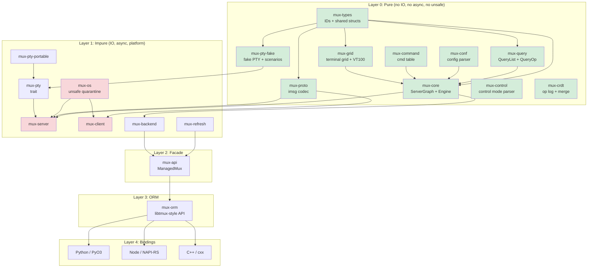

# TermForge v6 Definitive Architecture Specification

Date: 2026-02-11
License: MIT OR Apache-2.0
Rust edition: 2024 (MSRV 1.85)
Protocol target: tmux protocol v8

---

## Preamble

This document is the single authoritative architectural reference for TermForge, a Rust terminal multiplexer with 100% tmux wire-protocol compatibility, ORM-like API, language bindings, CRDT collaboration, and a ratatui-based TUI client.

**Repository locations:**
- tmux C source: `~/study/c/tmux/` (behavioral reference)
- Rust prototype: `~/work/rust/vibe-tmux/` (existing crate structure)
- Python libtmux: `~/work/python/libtmux/` (API design reference)
- ratatui: `~/study/rust/ratatui/` (TUI framework)
- zellij: `~/study/rust/zellij/` (multiplexer reference)

**Settled decisions (normative):**
1. Vec-inside-entity for parent-child relationships (not SecondaryMap)
2. WASM compilability as CI purity gate (not production target)
3. `mux-types` as separate leaf crate
4. `mux-orm` as separate crate from `mux-api`
5. FakePty ScenarioRecorder with JSON format
6. Defer `im-rs`; use `Arc<Grid>` with `Arc::make_mut` for COW
7. Custom VT100 parser matching tmux `input.c` (17 states)
8. Format string engine as pure function
9. Key binding system with table-based dispatch
10. Copy mode as per-pane `CopyModeState`

**Mandatory behavioral corrections:**
- Protocol codec: `ProtocolViolation` kills the connection (not drop frame)
- Lock file: `flock(LOCK_EX|LOCK_NB)` (not PID-based)
- Layout resize: round-robin one-cell-at-a-time (not proportional)
- Config timing: load after first client identifies
- `mux-types`: must be created as leaf crate (does not yet exist in vibe-tmux)
- `ControlNotification`: currently generic name/raw struct, migration to typed enum needed

---

## Table of Contents

1. [Vision and Philosophy](#1-vision-and-philosophy)
2. [North Star Acceptance Criteria](#2-north-star-acceptance-criteria)
3. [High-Level Architecture](#3-high-level-architecture)
4. [Workspace Layout](#4-workspace-layout)
5. [Layering Contract](#5-layering-contract)
6. [Entity Model](#6-entity-model)
7. [Event/Effect Engine](#7-eventeffect-engine)
8. [Error Handling](#8-error-handling)
9. [Protocol Codec](#9-protocol-codec)
10. [Configuration System](#10-configuration-system)
11. [Layout Engine](#11-layout-engine)
12. [ORM-like Query API](#12-orm-like-query-api)
13. [Runtime Architecture](#13-runtime-architecture)
14. [Server Lifecycle](#14-server-lifecycle)
15. [Control Mode](#15-control-mode)
16. [Language Bindings](#16-language-bindings)
17. [CRDT Transaction Layer](#17-crdt-transaction-layer)
18. [Security Model](#18-security-model)
19. [OpenTelemetry](#19-opentelemetry)
20. [tmux Version Management](#20-tmux-version-management)
21. [Test Support and Fake PTY](#21-test-support-and-fake-pty)
22. [Binding Test Frameworks](#22-binding-test-frameworks)
23. [Test Framework and Harness Design](#23-test-framework-and-harness-design)
24. [Performance Targets](#24-performance-targets)
25. [Visual Client / TUI](#25-visual-client--tui)
26. [AGENTS.md Rules](#26-agentsmd-rules)
27. [Risks and Mitigations](#27-risks-and-mitigations)
28. [Summary and Changelog](#28-summary-and-changelog)
29. [Reference Anchors](#29-reference-anchors)
30. [Appendix: Canonical Type Quick Reference](#30-appendix-canonical-type-quick-reference)
31. [Supplemental Test Matrix](#31-supplemental-test-matrix)

---

## 1. Vision and Philosophy

### Core Thesis

TermForge is not a tmux port. It is a **new terminal multiplexer** that speaks tmux's binary protocol (`imsg` over Unix domain sockets). The internal architecture is Rust-native: algebraic types, ownership-tracked state, pure-functional kernel, and async runtime -- while maintaining bit-for-bit compatibility with the tmux wire format.

### Architectural Principles

1. **Pure/Impure Separation (Sans-IO):** The kernel (`mux-core`) is a pure `fn(graph, event) -> (graph, effects)` reducer. It never touches file descriptors, system calls, timers, or network. All IO happens in the runtime layer that interprets `Effect` variants.

2. **tmux is a Compatibility Profile, Not the Architecture:** tmux's `struct session`, `struct window`, `struct window_pane` inform our entity model but do not dictate it. Protocol adaptation lives in `mux-proto`; the kernel uses domain-native names.

3. **Snapshots are the Read Path:** The authoritative state lives in the `ServerGraph`. Readers (UI, bindings, query API) see immutable snapshots published via `ArcSwap`. Writers go through the event/effect engine. This eliminates read contention.

4. **ORM is a Facade, Not the Engine:** `mux-orm` translates user intent into commands/events. It never implements multiplexer logic. It must not become a second business-logic engine.

5. **Layered Testing:** Every layer has its own test strategy. Pure core uses property testing and snapshot testing. Protocol uses fixture-driven roundtrip tests. Runtime uses hermetic servers with fake PTYs.

6. **WASM as Purity Proof:** Layer 0 crates compile to `wasm32-unknown-unknown` as a CI gate, not a production deployment target. This catches accidental OS dependencies.

### Why Not a Direct Port

| Direct Port | TermForge |
|---|---|
| Platform code in the kernel | Platform code quarantined in `mux-os` |
| RB-tree state with manual memory | SlotMap with generation-checked IDs |
| Libevent callback soup | Structured async with tokio tasks |
| CRDTs require invasive surgery | CRDTs compose on top of pure events |
| Testing requires real PTY | Fake PTY backend for deterministic tests |

---

## 2. North Star Acceptance Criteria

### 2.1 Compatibility

| ID | Criterion | Verification |
|---|---|---|
| C1 | Real tmux 3.6+ client attaches to `muxd` | Integration test: `tmux attach -S <sock>` |
| C2 | `mux` client attaches to real tmux 3.6+ server | Integration test via `mux-client` |
| C3 | Protocol v8 imsg framing roundtrips all 35+ `MsgType` variants | `proptest` with arbitrary payloads |
| C4 | Identify burst (13 message types, 100-112) roundtrips correctly | Fixture captures from real tmux |
| C5 | SCM_RIGHTS fd passing preserved through sniff proxy | `tmux-sniff` passthrough test |
| C6 | Command semantics match tmux's 144+ `cmd_table` entries | `tmux-command-audit` parity checks |
| C7 | Format string expansion matches tmux for 200+ variables | `format-audit` parity corpus |
| C8 | Default key bindings match tmux across all 4 key tables | Key table parity tests |

### 2.2 Architectural

| ID | Criterion | Enforcement |
|---|---|---|
| A1 | Layer 0 crates: zero `unsafe`, zero `tokio`, zero `libc` | `#![forbid(unsafe_code)]` in crate root |
| A2 | Layer 0 compiles to `wasm32-unknown-unknown` | CI: `cargo check --target wasm32-unknown-unknown` |
| A3 | `mux-os` is the sole `unsafe` quarantine | CI lint: grep for `unsafe` outside `mux-os` |
| A4 | All state transitions are deterministic | Property: `apply_event(s, e)` is referentially transparent |
| A5 | No panics in protocol decode/encode paths | `#[deny(clippy::unwrap_used)]` in hot crates |
| A6 | Bindings depend only on `mux-api`/`mux-orm` | Cargo dependency check in CI |
| A7 | No `Arc<Mutex<_>>` in the read path | `ArcSwap`-based `StateHandle` |

### 2.3 Product

| ID | Criterion |
|---|---|
| P1 | In-process embedding: create session, split, send keys, read grid -- no process spawning |
| P2 | Python pytest fixture: `server` -> `session` -> `window` -> `pane` in 4 lines |
| P3 | Snapshot test: feed VT100 input, assert grid state via `insta` |
| P4 | CRDT: two servers merge concurrent `new-session` without conflict |
| P5 | TUI client attaches to real tmux server and renders correctly |
| P6 | FakePty scenario replay produces identical grid state to real tmux |

### 2.4 Performance (from v5)

| ID | Target | Basis |
|---|---|---|
| B1 | VT100 parser, plain ASCII > 300 MB/s | alacritty vte achieves ~500 MB/s |
| B2 | Protocol frame decode > 500 MB/s | 16-byte header + memcpy |
| B3 | Layout resize (20 panes) < 50 us | Tree walk ~60 nodes, no alloc |
| B4 | Graph snapshot < 1 ms | Arc clone + BTreeMap for 50 panes |
| B5 | Option resolve (4-level chain) < 100 ns | 4 BTreeMap lookups |
| B6 | Control notification parse < 200 ns | String split + parse |

These are conservative targets to be validated after establishing baselines from 3 consecutive median runs. CI regression gate: 130% threshold on nightly only.

---

## 3. High-Level Architecture

### The Layer Cake

```
Layer 0  PURE KERNEL     mux-types, mux-core, mux-query, mux-conf,
                          mux-command, mux-grid, mux-control, mux-pty-fake
                          mux-crdt, mux-proto

Layer 1  IMPURE RUNTIME  mux-os, mux-pty, mux-pty-portable, mux-client,
                          mux-server, mux-refresh, mux-backend

Layer 2  FACADE           mux-api (ManagedMux, SocketActor, intents)

Layer 3  ORM              mux-orm (libtmux-style graph + QueryList sugar)

Layer 4  BINDINGS         bindings/python (PyO3), bindings/node (NAPI-RS),
                          crates/mux-cxx (cxx bridge)

Layer 5  TOOLS            tmux-sniff, tmux-vm, tmux-builder, tmux-worktrees,
                          mux-tui, mux-doctor, format-audit, regress-audit,
                          tmux-command-audit, mux-regress
```

### Mermaid Diagram



---

## 4. Workspace Layout

```
termforge/
  Cargo.toml                     # workspace root
  AGENTS.md                      # LLM development guide
  ARCHITECTURE.md                # living architecture doc (this file)
  rust-toolchain.toml
  justfile                       # build/test/audit entry points

  crates/
    -- LAYER 0: PURE (no IO, no async, no unsafe, no time) --
    mux-types/                   # Shared newtypes: SessionId, WindowId, PaneId, etc.
      src/
        lib.rs
        ids.rs                   # SlotMap key types
        size.rs                  # PaneSize, Rect, WindowSize, SplitDirection
        options.rs               # OptionScope, OptionValue
        errors.rs                # Shared error types: ErrorClass, Classified trait
    mux-core/                    # Pure kernel: ServerGraph, Event, Effect, apply_event
      src/
        lib.rs
        graph.rs                 # ServerGraph (SlotMap-backed entity store)
        session.rs               # Session entity
        window.rs                # Window entity
        pane.rs                  # Pane entity + PaneMode
        client.rs                # Client entity + ClientKeyState
        job.rs                   # Job entity
        buffer.rs                # Buffer entity (paste buffers)
        event.rs                 # Event enum
        effect.rs                # Effect enum
        engine.rs                # apply_event() pure reducer
        context.rs               # ClientContext resolution
        state.rs                 # GraphState snapshots
        facade.rs                # ServerFacade (command string -> event)
        handle.rs                # GraphHandle (read-only accessor)
        layout.rs                # LayoutTree + tiling algorithms
        format.rs                # Format string expansion engine
        key_table.rs             # Key tables + bindings (pure model)
        copy_mode.rs             # Copy mode state machine
        environ.rs               # Environment variable store
        command/                 # Per-command handlers (pure)
          mod.rs
          new_session.rs
          new_window.rs
          split_window.rs
          select_pane.rs
          send_keys.rs
          set_option.rs
          display_message.rs
          ...                    # one file per tmux command (~80 files)
    mux-grid/                    # Terminal grid + VT100 state machine
      src/
        lib.rs
        grid.rs                  # Grid (row/column cell storage)
        cell.rs                  # Cell (character + style attributes)
        row.rs                   # Row (line storage, wrapping)
        cursor.rs                # Cursor state
        style.rs                 # Style attributes (fg, bg, attrs)
        parser.rs                # VT100 table-driven state machine
        parser_tables.rs         # State transition tables (from input.c)
        csi.rs                   # CSI command dispatch (39 commands)
        osc.rs                   # OSC command dispatch
        sgr.rs                   # SGR (Select Graphic Rendition)
        esc.rs                   # ESC sequence dispatch
        scrollback.rs            # Scrollback buffer management
        hyperlinks.rs            # OSC 8 hyperlink tracking
        snapshot.rs              # Grid snapshot for insta testing
    mux-query/                   # QueryList, QueryOp, Queryable derive
      src/
        lib.rs
        ops.rs                   # QueryOp enum
        value.rs                 # QueryValue
        spec.rs                  # QuerySpec, QueryTerm
        list.rs                  # QueryList<T: Queryable>
    mux-conf/                    # tmux.conf parser (PURE -- no file IO)
      src/
        lib.rs
        ast.rs                   # Config AST nodes
        lexer.rs                 # Tokenizer
        parser.rs                # Config file parser
        options.rs               # Option table + defaults
    mux-command/                 # Command table + dispatch
      src/
        lib.rs
        table.rs                 # Command table (from tmux cmd.c)
    mux-control/                 # Control mode parser (%output, %begin, etc.)
      src/
        lib.rs
        notification.rs          # ControlNotification enum (typed)
        parser.rs                # %%notification line parser
    mux-proto/                   # imsg framing + MsgType + payload parsers
      src/
        lib.rs
        frame.rs                 # ImsgHdr (16-byte header)
        msg.rs                   # MsgType enum (35+ variants)
        codec.rs                 # ImsgCodec (two-phase decode)
        payload.rs               # Typed payload structs
        identify.rs              # IdentifyBurst builder
        fixture.rs               # Capture file loading
        error.rs                 # ProtocolError
    mux-crdt/                    # CrdtOp, HLC, DVV, merge semantics
      src/
        lib.rs
        op.rs                    # CrdtOp enum
        clock.rs                 # HybridLogicalClock + HlcTimestamp
        dvv.rs                   # Dotted version vectors
        register.rs              # LwwRegister<T>
        set.rs                   # OrSet<T>
        oplog.rs                 # OpLog + compaction
        merge.rs                 # Merge resolution
    mux-pty/                     # PtyBackend trait (pure interface)
      src/lib.rs
    mux-pty-fake/                # FakePty + ScenarioRecorder/Replayer (PURE)
      src/
        lib.rs
        scenario.rs              # PtyScenario, ScenarioEvent
        recorder.rs              # ScenarioRecorder<B: PtyBackend>
        replayer.rs              # ScenarioReplayer

    -- LAYER 1: IMPURE (IO, async, platform) --
    mux-os/                      # unsafe quarantine: SCM_RIGHTS, signals
      SAFETY.md
      src/
        lib.rs
        pty.rs                   # PTY creation + management
        scm_rights.rs            # SCM_RIGHTS FD passing
        socket.rs                # Unix socket creation
        signal.rs                # Signal handling
        fd.rs                    # FD lifecycle + close-on-drop
        lock.rs                  # LockFile (flock-based)
    mux-pty-portable/            # portable-pty based backend
    mux-server/                  # tokio runtime, socket accept loop
    mux-client/                  # client connection, control mode
    mux-backend/                 # Backend trait: Local + Tmux
    mux-refresh/                 # StateStore + ArcSwap + RefreshPlanner
    mux-test-support/            # TmuxTestServer, PathGuard, hermetic isolation
    mux-view/                    # Immutable view types for snapshots
    mux-telemetry/               # tracing span context + OTEL

    -- LAYER 2: FACADE --
    mux-api/                     # ManagedMux, MuxBackend, intent API

    -- LAYER 3: ORM --
    mux-orm/                     # libtmux-style graph traversal + QueryList
      src/
        lib.rs
        server.rs                # OrmServer
        session.rs               # OrmSession
        window.rs                # OrmWindow
        pane.rs                  # OrmPane

    -- SUPPORT --
    mux-cxx/                     # cxx bridge

  tools/
    tmux-sniff/                  # Protocol sniffer (preserves SCM_RIGHTS)
    tmux-vm/                     # tmux version manager (ensure/exec)
    tmux-builder/                # Build tmux from source
    tmux-worktrees/              # Git worktree manager for tmux source
    tmux-command-audit/          # Command coverage tracker
    format-audit/                # Format variable alignment checker
    regress-audit/               # Run tmux regress suite
    mux-regress/                 # Parity harness (both servers)
    mux-tui/                     # Rust-native TUI client
    mux-doctor/                  # Diagnostic tool

  bindings/
    python/
      Cargo.toml
      pyproject.toml             # maturin + uv
      src/lib.rs
      python/termforge/
        __init__.py
        _native.pyi
        pytest_plugin.py         # hermetic pytest fixtures
      tests/
        conftest.py
        test_server.py
        test_query.py
    node/
      Cargo.toml
      package.json               # pnpm
      src/lib.rs
      __test__/
        server.spec.ts           # vitest tests
      vitest.config.ts

  fixtures/
    captures/                    # Binary protocol captures from real tmux
    grids/                       # Terminal grid snapshots for insta
    configs/                     # tmux.conf samples
    scenarios/                   # FakePty scenario recordings (JSON)

  fuzz/
    decode_frame.rs              # Protocol decoder fuzz target
    parse_vt100.rs               # VT100 parser fuzz target
    parse_format.rs              # Format string parser fuzz target
```

### Prototype Inventory Cross-Check (`~/work/rust/vibe-tmux/crates`)

Crates that currently exist in the prototype and are referenced by this architecture:
- `mux-core`
- `mux-proto`
- `mux-api`
- `mux-server`
- `mux-os`
- `mux-client`
- `mux-refresh`

Planned crates that **do not yet exist** in the prototype:
- `mux-types`
- `mux-orm`
- `mux-crdt`

### Purity Classification

| Crate | Pure | Async | Unsafe | WASM CI |
|---|---|---|---|---|
| mux-types | Yes | No | No | Yes |
| mux-core | Yes | No | No | Yes |
| mux-grid | Yes | No | No | Yes |
| mux-query | Yes | No | No | Yes |
| mux-conf | Yes | No | No | Yes |
| mux-command | Yes | No | No | Yes |
| mux-proto | Yes | No | No | Yes |
| mux-control | Yes | No | No | Yes |
| mux-pty-fake | Yes | No | No | Yes |
| mux-crdt | Yes | No | No | Yes |
| mux-pty | Trait only | No | No | No |
| mux-os | No | No | **Yes** | No |
| mux-server | No | Yes | No | No |
| mux-client | No | Yes | No | No |
| mux-backend | No | Yes | No | No |
| mux-refresh | No | Yes | No | No |
| mux-api | No | Yes | No | No |
| mux-orm | No | Yes | No | No |

---

## 5. Layering Contract

### Hard Boundaries

**Boundary A -- Core is Deterministic:**

The core never asks the operating system for anything. No `SystemTime::now()`, no `std::fs`, no `rand()`, no `std::thread`. If the core needs a timestamp, it receives one via an `Event` variant. If it needs randomness, it receives a seed via `CoreCtx`.

```rust
// WRONG -- core asking the OS
pub fn create_session(graph: &mut ServerGraph) -> SessionId {
    let name = format!("session-{}", SystemTime::now().elapsed().unwrap().as_secs());
    graph.create_session(name)
}

// RIGHT -- core receiving information via events
pub fn apply_event(graph: &mut ServerGraph, event: Event, ctx: &CoreCtx) -> ApplyOutcome {
    match event {
        Event::CreateSession { name, created_at } => {
            let id = graph.create_session(name);
            ApplyOutcome { created_session: Some(id), ..Default::default() }
        }
        // ...
    }
}
```

**Boundary B -- Snapshots are the Read Path:**

The `ServerGraph` is mutated only through `apply_event()`. After mutation, the runtime publishes a `GraphState` snapshot through `ArcSwap`. All readers read from the snapshot, never from the mutable graph.

```rust
// crates/mux-refresh/src/lib.rs
pub struct StateStore<T> {
    inner: Arc<ArcSwap<T>>,
}

pub struct StateHandle<T> {
    inner: Arc<ArcSwap<T>>,
}

impl<T> StateHandle<T> {
    /// Lock-free read via ArcSwap::load()
    pub fn with_read<R>(&self, f: impl FnOnce(&T) -> R) -> R {
        let guard = self.inner.load();
        f(&guard)
    }
}
```

**Boundary C -- tmux Compatibility is an Adapter:**

The core uses domain-native names. tmux protocol specifics (`MsgType::IdentifyFlags`, imsg framing) live entirely in `mux-proto`. The server runtime translates between the two:

```rust
// mux-server: translates protocol frame -> core event
fn translate_command(frame: &ImsgFrame) -> Result<Event, ProtocolError> {
    let args = parse_command_args(&frame.payload)?;
    Ok(Event::Command { name: args[0].clone(), args: args[1..].to_vec() })
}
```

**Boundary D -- ORM API is a Facade:**

The ORM translates intent into commands. It never implements window splitting, session creation, or layout algorithms.

### Enforcement

| Rule | Mechanism |
|---|---|
| Pure crates: no `tokio`, `async`, `unsafe` | `#![forbid(unsafe_code)]` + CI WASM check |
| One-way deps: bindings -> orm -> api -> backend -> core | `cargo deny check` |
| No `Arc<Mutex>` on read path | Code review + clippy config |
| No panics in protocol/server | `#[deny(clippy::unwrap_used, clippy::expect_used)]` |
| `unsafe` only in `mux-os` | CI: `grep -r "unsafe" --include="*.rs" crates/ \| grep -v mux-os` |

---

## 6. Entity Model

### 6.1 Typed ID Declarations (mux-types)

```rust
// crates/mux-types/src/ids.rs
use slotmap::new_key_type;

new_key_type! {
    /// Unique identifier for a session within the server.
    /// Generation-checked: stale IDs safely return None on lookup.
    pub struct SessionId;
    pub struct WindowId;
    pub struct PaneId;
    pub struct ClientId;
    pub struct JobId;
    pub struct BufferId;
}
```

```rust
// crates/mux-types/src/size.rs
#[derive(Debug, Clone, Copy, PartialEq, Eq, Hash)]
pub struct PaneSize {
    pub cols: u16,
    pub rows: u16,
}

impl PaneSize {
    pub const DEFAULT: Self = Self { cols: 80, rows: 24 };
}

#[derive(Debug, Clone, Copy, PartialEq, Eq)]
pub struct Rect {
    pub x: u16,
    pub y: u16,
    pub width: u16,
    pub height: u16,
}

#[derive(Debug, Clone, Copy, PartialEq, Eq)]
pub enum SplitDirection {
    Horizontal,
    Vertical,
}
```

### 6.2 Entity Structs (mux-core)

**Decision (settled): Vec inside entities for parent-child relationships.** Reverse lookups computed during snapshot construction. This matches the proven vibe-tmux code at `~/work/rust/vibe-tmux/crates/mux-core/src/graph.rs` where `session.windows: Vec<WindowId>` and reverse maps are built in `graph_state()` at lines 218-229.

```rust
/// crates/mux-core/src/session.rs
#[derive(Debug, Clone)]
pub struct Session {
    pub name: String,
    pub cwd: String,
    pub windows: Vec<WindowId>,           // ordered child list (forward only)
    pub active_window: Option<WindowId>,
    pub last_window: Option<WindowId>,
    pub created_at: i64,                  // injected via Event, not from OS
    pub last_attached_at: i64,
    pub destroying: bool,
    pub options: SessionOptions,
    pub environ: EnvironMap,
}

/// crates/mux-core/src/window.rs
#[derive(Debug, Clone)]
pub struct Window {
    pub name: String,
    pub panes: Vec<PaneId>,              // ordered child list (forward only)
    pub active_pane: Option<PaneId>,
    pub last_active_pane: Option<PaneId>,
    pub layout_root: LayoutTree,
    pub size: WindowSize,
    pub flags: WindowFlags,
    pub options: WindowOptions,
}

/// crates/mux-core/src/pane.rs
#[derive(Debug, Clone)]
pub struct Pane {
    pub size: PaneSize,
    pub bounds: Option<Rect>,
    pub exited: bool,
    pub exit_status: Option<i32>,
    pub start_command: String,
    pub start_path: String,
    pub mode: PaneMode,
    pub title: String,
    pub grid: Arc<Grid>,                 // shared; copy-on-write via Arc::make_mut
    pub parser: Parser,                  // VT100 state machine
    pub copy_mode: Option<CopyModeState>,
}

#[derive(Debug, Clone, Copy, PartialEq, Eq)]
pub enum PaneMode {
    Normal,
    CopyMode,
    ViewMode,
}

/// crates/mux-core/src/client.rs
#[derive(Debug, Clone)]
pub struct Client {
    pub name: String,
    pub session: Option<SessionId>,
    pub last_session: Option<SessionId>,
    pub tty_name: String,
    pub term_type: String,
    pub features: u32,
    pub flags: ClientFlags,
    pub size: PaneSize,
    pub key_state: ClientKeyState,       // key table dispatch state
}

/// crates/mux-core/src/buffer.rs
#[derive(Debug, Clone)]
pub struct Buffer {
    pub name: String,
    pub data: Vec<u8>,
    pub created_at: i64,
}
```

### 6.3 The ServerGraph

```rust
// crates/mux-core/src/graph.rs
use slotmap::SlotMap;

#[derive(Debug, Default, Clone)]
pub struct ServerGraph {
    sessions: SlotMap<SessionId, Session>,
    windows:  SlotMap<WindowId, Window>,
    panes:    SlotMap<PaneId, Pane>,
    clients:  SlotMap<ClientId, Client>,
    jobs:     SlotMap<JobId, Job>,
    buffers:  SlotMap<BufferId, Buffer>,
    key_tables: KeyTableSet,
    global_options: GlobalOptions,
    global_session_options: SessionOptions,
    global_window_options: WindowOptions,
    global_environ: EnvironMap,
}

impl ServerGraph {
    pub fn new() -> Self { Self::default() }

    // --- Creation ---
    pub fn create_session(&mut self, name: impl Into<String>) -> SessionId;
    pub fn create_window(&mut self, name: impl Into<String>) -> WindowId;
    pub fn create_pane(&mut self, size: PaneSize) -> PaneId;
    pub fn create_client(&mut self, name: impl Into<String>) -> ClientId;
    pub fn create_buffer(&mut self, name: impl Into<String>, data: Vec<u8>) -> BufferId;

    // --- Lookup (O(1), generation-checked) ---
    pub fn session(&self, id: SessionId) -> Option<&Session>;
    pub fn session_mut(&mut self, id: SessionId) -> Option<&mut Session>;
    pub fn window(&self, id: WindowId) -> Option<&Window>;
    pub fn window_mut(&mut self, id: WindowId) -> Option<&mut Window>;
    pub fn pane(&self, id: PaneId) -> Option<&Pane>;
    pub fn pane_mut(&mut self, id: PaneId) -> Option<&mut Pane>;
    pub fn client(&self, id: ClientId) -> Option<&Client>;
    pub fn client_mut(&mut self, id: ClientId) -> Option<&mut Client>;

    // --- Relationship management ---
    pub fn add_window_to_session(&mut self, session: SessionId, window: WindowId) -> bool;
    pub fn add_pane_to_window(&mut self, window: WindowId, pane: PaneId) -> bool;
    pub fn attach_client(&mut self, client: ClientId, session: SessionId) -> bool;
    pub fn panes_in_window(&self, window: WindowId) -> Vec<PaneId>;

    // --- Context resolution ---
    pub fn client_context(&self, client: ClientId) -> ClientContext;

    // --- Snapshot (reverse lookups computed here) ---
    /// Build an immutable GraphState with reverse lookups.
    /// Reference: ~/work/rust/vibe-tmux/crates/mux-core/src/graph.rs:217-229
    pub fn graph_state(&self) -> GraphState {
        let mut window_to_session = HashMap::new();
        for (session_id, session) in &self.sessions {
            for window_id in &session.windows {
                window_to_session.insert(*window_id, session_id);
            }
        }
        let mut pane_to_window = HashMap::new();
        for (window_id, window) in &self.windows {
            for pane_id in &window.panes {
                pane_to_window.insert(*pane_id, window_id);
            }
        }
        // ... build GraphState with reverse lookups included
        todo!()
    }
}
```

### 6.4 Relationship Model

```
Server (implicit singleton)
  |-- sessions: SlotMap<SessionId, Session>
  |     |-- windows: Vec<WindowId>  (ordered, forward-only)
  |     |-- active_window: Option<WindowId>
  |     |-- last_window: Option<WindowId>
  |
  |-- windows: SlotMap<WindowId, Window>
  |     |-- panes: Vec<PaneId>  (ordered, forward-only)
  |     |-- active_pane: Option<PaneId>
  |     |-- layout_root: LayoutTree
  |
  |-- panes: SlotMap<PaneId, Pane>
  |     |-- grid: Arc<Grid>  (terminal state, COW for snapshots)
  |     |-- parser: Parser  (VT100 state machine)
  |     |-- copy_mode: Option<CopyModeState>
  |
  |-- clients: SlotMap<ClientId, Client>
  |     |-- session: Option<SessionId>  (attached session)
  |     |-- key_state: ClientKeyState  (key table stack)
  |
  |-- key_tables: KeyTableSet  (prefix, root, copy-mode, copy-mode-vi)
  |-- buffers: SlotMap<BufferId, Buffer>  (paste buffers)
  |-- jobs: SlotMap<JobId, Job>
```

### 6.5 Entity Model Test Strategy

1. **SlotMap generation safety:** Create entity, remove it, verify old ID returns `None`.
2. **Relationship integrity:** Add window to session, verify `session.windows` contains it.
3. **Snapshot reverse lookups:** Create session/window/pane chain, build `graph_state()`, verify `pane_to_window` and `window_to_session` maps.
4. **Property test:** Random create/remove sequences never panic, all IDs resolve or return `None`.
5. **Clone isolation:** Clone graph, mutate clone, verify original unchanged.
6. **Concurrent snapshot:** Publish snapshot, modify graph, verify snapshot still reads old state.

---

## 7. Event/Effect Engine

### Core Signature

```rust
/// crates/mux-core/src/engine.rs
///
/// Apply an event to the graph, returning effects for the runtime to execute.
/// This is the heart of the Sans-IO architecture:
/// - Pure: no IO, no async, no randomness
/// - Deterministic: same (graph, event, ctx) always produces same (graph', effects)
/// - Total: every Event variant is handled
pub fn apply_event(
    graph: &mut ServerGraph,
    event: Event,
    ctx: &CoreCtx,
) -> ApplyOutcome {
    match event {
        Event::CreateSession { .. } => { /* ... */ }
        Event::Key { .. } => { /* key dispatch via key tables */ }
        Event::CopyModeAction { pane_id, action } => {
            apply_copy_mode_event(graph, pane_id, action)
        }
        Event::PaneOutput { pane_id, data } => {
            apply_pane_output(graph, pane_id, &data)
        }
        // ... exhaustive match
    }
}

/// Determinism controls: explicit injection for time and randomness.
#[derive(Clone, Copy, Debug)]
pub struct CoreCtx {
    pub now_ms: u64,
    pub rand_u64: u64,
}

#[derive(Debug, Default, Clone)]
pub struct ApplyOutcome {
    pub effects: Vec<Effect>,
    pub created_session: Option<SessionId>,
    pub created_window: Option<WindowId>,
    pub created_pane: Option<PaneId>,
    pub error: Option<CoreError>,
}

impl ApplyOutcome {
    pub fn with_effects(effects: Vec<Effect>) -> Self {
        Self { effects, ..Default::default() }
    }
}
```

### Event Enum

```rust
/// crates/mux-core/src/event.rs
#[derive(Debug, Clone)]
#[non_exhaustive]
pub enum Event {
    // === Lifecycle ===
    CreateSession { name: String, cwd: Option<String>, created_at: i64 },
    DestroySession { session_id: SessionId },
    CreateWindow { session_id: SessionId, name: String },
    DestroyWindow { window_id: WindowId },
    CreatePane { window_id: WindowId, size: PaneSize, command: Vec<String>,
                 cwd: Option<String> },
    DestroyPane { pane_id: PaneId },

    // === Navigation ===
    SelectWindow { session_id: SessionId, window_id: WindowId },
    SelectWindowByIndex { session_id: SessionId, index: usize },
    NextWindow { session_id: SessionId },
    PreviousWindow { session_id: SessionId },
    SelectLastWindow { session_id: SessionId },
    SelectPane { window_id: WindowId, pane_id: PaneId },
    SelectNextPane { window_id: WindowId },
    SelectPrevPane { window_id: WindowId },
    SelectLastPane { window_id: WindowId },

    // === Mutation ===
    RenameSession { session_id: SessionId, name: String },
    RenameWindow { window_id: WindowId, name: String },
    ResizePane { pane_id: PaneId, size: PaneSize },
    SplitWindow { window_id: WindowId, direction: SplitDirection, size: PaneSize,
                  command: Vec<String>, cwd: Option<String> },

    // === Client ===
    ClientAttach { client_id: ClientId, session_id: SessionId },
    ClientDetach { client_id: ClientId },
    ClientResize { client_id: ClientId, size: PaneSize },

    // === IO Responses (runtime -> core) ===
    PaneExited { pane_id: PaneId, exit_status: i32 },
    PaneOutput { pane_id: PaneId, data: Vec<u8> },
    JobExited { job_id: JobId, exit_status: i32 },

    // === Input ===
    Key { client_id: ClientId, key: KeyCode },
    Command { name: String, args: Vec<String>, client_id: Option<ClientId> },

    // === Copy Mode ===
    EnterCopyMode { pane_id: PaneId, view_mode: bool },
    CopyModeAction { pane_id: PaneId, action: CopyModeAction },

    // === Options ===
    SetOption { scope: OptionScope, key: String, value: OptionValue },

    // === Paste Buffers ===
    SetBuffer { name: String, data: Vec<u8> },
    PasteBuffer { pane_id: PaneId, buffer_name: Option<String> },

    // === Effect Failure Feedback (runtime -> core) ===
    EffectFailed { token: EffectToken, reason: String },

    // === Time (injected by runtime) ===
    Tick { now_millis: i64 },
}
```

### Effect Enum

```rust
/// crates/mux-core/src/effect.rs
#[derive(Debug, Clone)]
#[non_exhaustive]
pub enum Effect {
    // === PTY ===
    SpawnPane { pane_id: PaneId, command: Vec<String>, cwd: Option<String>,
                size: PaneSize },
    KillPane { pane_id: PaneId, signal: i32 },
    WritePane { pane_id: PaneId, data: Vec<u8> },
    ResizePty { pane_id: PaneId, size: PaneSize },

    // === Display ===
    Redraw { scope: RedrawScope },

    // === Client ===
    NotifyClient { client_id: ClientId, message: String },
    SendToClient { client_id: ClientId, frame: FrameData },
    DisconnectClient { client_id: ClientId },
    ErrorReply { client_id: ClientId, message: String },

    // === Timers ===
    StartTimer { token: TimerToken, after_ms: u64 },
    CancelTimer { token: TimerToken },

    // === Job ===
    StartJob { job_id: JobId, command: Vec<String> },
    StopJob { job_id: JobId },

    // === Server ===
    Shutdown,
    PublishSnapshot,
    Log { level: LogLevel, message: String },
}

#[derive(Debug, Clone)]
pub enum RedrawScope {
    All,
    Session(SessionId),
    Window(WindowId),
    Pane(PaneId),
    StatusLine,
}
```

### PaneOutput Handling (VT100 -> Grid)

```rust
fn apply_pane_output(graph: &mut ServerGraph, pane_id: PaneId, data: &[u8]) -> ApplyOutcome {
    let Some(pane) = graph.pane_mut(pane_id) else {
        return ApplyOutcome::default();
    };

    // Get a mutable reference to the grid (Arc::make_mut for COW)
    let grid = Arc::make_mut(&mut pane.grid);

    // Parse VT100 sequences and update the grid (pure)
    let parser_effects = pane.parser.parse(data, grid);

    // Convert parser effects to engine effects
    let mut effects = vec![Effect::Redraw { scope: RedrawScope::Pane(pane_id) }];
    for pe in parser_effects {
        match pe {
            ParserEffect::Reply(bytes) => {
                effects.push(Effect::WritePane { pane_id, data: bytes });
            }
            ParserEffect::TitleChanged(title) => {
                pane.title = title;
                effects.push(Effect::Redraw { scope: RedrawScope::StatusLine });
            }
            ParserEffect::Bell => {
                effects.push(Effect::Redraw { scope: RedrawScope::StatusLine });
            }
            _ => {}
        }
    }

    ApplyOutcome::with_effects(effects)
}
```

### Event/Effect Engine Test Strategy

1. **Determinism property test:** Applying the same event sequence to two fresh graphs produces identical `GraphState`.
2. **Session lifecycle:** Create session -> add window -> add pane -> destroy pane -> verify cleanup.
3. **PaneOutput roundtrip:** Feed VT100 bytes, verify grid content via `insta` snapshot.
4. **Key dispatch:** Bind key in prefix table, send prefix then key, verify command executed.
5. **Effect generation:** `CreatePane` event produces `Effect::SpawnPane` with correct args.
6. **Error propagation:** Invalid command produces `ApplyOutcome` with `error: Some(CoreError)`.
7. **Copy mode enter/exit:** Enter copy mode, perform actions, cancel, verify pane mode restored.
8. **Timer lifecycle:** Prefix key starts timer, bound key cancels it.

```rust
#[cfg(test)]
mod property_tests {
    use super::*;
    use proptest::prelude::*;

    fn arb_session_name() -> impl Strategy<Value = String> {
        "[a-z][a-z0-9-]{0,20}".prop_filter("non-empty", |s| !s.is_empty())
    }

    proptest! {
        /// Applying the same event sequence to two fresh graphs produces identical state.
        #[test]
        fn engine_is_deterministic(
            names in prop::collection::vec(arb_session_name(), 1..10)
        ) {
            let ctx = CoreCtx { now_ms: 0, rand_u64: 0 };
            let events: Vec<_> = names.iter().map(|n| Event::CreateSession {
                name: n.clone(), cwd: None, created_at: 0,
            }).collect();

            let mut g1 = ServerGraph::new();
            let mut g2 = ServerGraph::new();

            for event in &events {
                let _ = apply_event(&mut g1, event.clone(), &ctx);
                let _ = apply_event(&mut g2, event.clone(), &ctx);
            }

            prop_assert_eq!(g1.graph_state(), g2.graph_state());
        }
    }
}
```

---

## 8. Error Handling

### 8.1 Error Classification System

All three v5 Pass 2 outputs independently converged on the same four-category taxonomy. This is definitive.

```rust
// crates/mux-types/src/error_class.rs
#![forbid(unsafe_code)]

/// Classification of errors for recovery policy decisions.
/// Reference: tmux "goto bad -> proc_kill_peer" at
/// server-client.c:3472-3475 maps to ProtocolViolation.
#[derive(Debug, Clone, Copy, PartialEq, Eq, Hash)]
pub enum ErrorClass {
    /// Transient: retry or wait for more data.
    /// Examples: incomplete frame, timeout, temporary IO failure.
    /// Recovery: retry with backoff, keep connection.
    Transient,

    /// Protocol violation: peer sent structurally invalid data.
    /// Examples: bad magic, length overflow, unknown msg type.
    /// Recovery: kill connection, log, keep server alive.
    ProtocolViolation,

    /// User error: semantically invalid request from valid connection.
    /// Examples: unknown command, invalid option, target not found.
    /// Recovery: send error reply, keep connection.
    UserError,

    /// Bug / invariant violation: internal consistency failure.
    /// Examples: dangling entity ID, impossible state.
    /// Recovery: log with full context, crash in debug.
    Bug,
}
```

### 8.2 Classified Trait

```rust
/// Every error type implements this for recovery dispatch.
pub trait Classified {
    fn class(&self) -> ErrorClass;
}

// Per-crate implementations:
impl Classified for ProtocolError {
    fn class(&self) -> ErrorClass {
        match self {
            ProtocolError::Incomplete => ErrorClass::Transient,
            ProtocolError::LengthTooSmall { .. }
            | ProtocolError::LengthTooLarge { .. }
            | ProtocolError::UnknownMessageType { .. }
            | ProtocolError::InvalidPayload { .. }
            | ProtocolError::MissingNul { .. }
            | ProtocolError::InvalidUtf8 { .. }
            | ProtocolError::NotIdentifyMessage { .. } => ErrorClass::ProtocolViolation,
        }
    }
}

impl Classified for CoreError {
    fn class(&self) -> ErrorClass {
        match self {
            CoreError::Entity(_)
            | CoreError::InvalidCommand { .. }
            | CoreError::InvalidOption { .. }
            | CoreError::LayoutConstraint { .. }
            | CoreError::CopyMode { .. } => ErrorClass::UserError,
            CoreError::FormatExpansion { .. } => ErrorClass::Bug,
        }
    }
}
```

### 8.3 Codec Recovery: DecodeOutcome

**Critical correction from v5:** Malformed frames cannot be dropped while keeping the connection alive. tmux kills the peer on protocol violations (`server-client.c:3472-3475`: `goto bad` -> `proc_kill_peer`). The correct behavior is: `ProtocolViolation` -> close connection.

```rust
// crates/mux-proto/src/codec.rs

/// Outcome of decoding one frame from the buffer.
pub enum DecodeOutcome {
    /// Need more bytes.
    NeedMore,
    /// Successfully decoded a frame.
    Frame(ImsgFrame),
    /// Unrecoverable protocol error. Close this connection.
    ProtocolViolation(ProtocolError),
}
```

### 8.4 Connection Handler (cross-ref: Section 9 Protocol Codec, Section 18 Security)

```rust
// crates/mux-server/src/conn.rs

async fn handle_client_data(
    conn: &mut ClientConn,
    buf: &[u8],
) -> ConnectionAction {
    conn.codec.feed(buf);
    loop {
        match conn.codec.try_decode_one() {
            DecodeOutcome::NeedMore => return ConnectionAction::Continue,
            DecodeOutcome::Frame(frame) => {
                if let Err(e) = process_frame(conn, frame).await {
                    match e.class() {
                        ErrorClass::ProtocolViolation | ErrorClass::Bug => {
                            tracing::warn!(
                                client_id = %conn.id,
                                error = %e,
                                "killing connection: {:?}", e.class()
                            );
                            return ConnectionAction::Kill(e.to_string());
                        }
                        ErrorClass::UserError => {
                            send_error_to_client(conn, &e).await;
                        }
                        ErrorClass::Transient => { /* should not happen post-decode */ }
                    }
                }
            }
            DecodeOutcome::ProtocolViolation(e) => {
                tracing::warn!(
                    client_id = %conn.id, error = %e,
                    "codec protocol violation, killing connection"
                );
                return ConnectionAction::Kill(e.to_string());
            }
        }
    }
}

pub enum ConnectionAction {
    Continue,
    Kill(String),
}
```

### 8.5 Pure Error Boundary

`io::Error` and platform types must not cross the pure/impure boundary. The runtime converts IO failures to `Event::EffectFailed` carrying a stable domain error string. This keeps `mux-core` free of platform types.

### 8.6 Error Handling Test Strategy

1. **Fuzz testing:** `fuzz/decode_frame.rs` feeds arbitrary bytes to `ImsgCodec`, asserts never panics, always returns one of three `DecodeOutcome` variants.
2. **Classification coverage:** Unit test that every variant of every error enum returns a valid `ErrorClass`.
3. **Recovery integration:** Feed valid frame then garbage bytes. Verify connection killed.
4. **Error propagation:** Trigger each `CoreError` variant, verify `Effect::ErrorReply`.
5. **Protocol violation:** Send identify message after already identified. Verify kill (matches `server-client.c:3597-3600`).
6. **Pure boundary:** Verify `mux-core` error types contain no `std::io::Error` fields.
7. **thiserror derivation:** Every library crate error enum derives `thiserror::Error`. `anyhow` only in binaries and tests.

---

## 9. Protocol Codec

### Wire Format

tmux uses OpenBSD's imsg framing. Every message is:

```
+----------+----------+----------+----------+------------+
|  type    |   len    |  peerid  |   pid    |  payload   |
|  (u32)   |  (u32)   |  (u32)   |  (u32)   |  (var)     |
+----------+----------+----------+----------+------------+
    4          4          4          4       0..16368 bytes
```

All fields are **native endianness** (client and server always on same machine). `len` includes the 16-byte header. High bit (`0x8000_0000`) of `len` is `IMSG_FD_FLAG`, indicating an FD is passed via SCM_RIGHTS ancillary data.

Reference: `tmux-protocol.h:23` defines `PROTOCOL_VERSION 8`.

### ImsgHdr

```rust
// crates/mux-proto/src/frame.rs
pub const IMSG_HEADER_SIZE: usize = 16;
pub const IMSG_FD_FLAG: u32 = 0x8000_0000;

#[derive(Debug, Clone, Copy, PartialEq, Eq)]
pub struct ImsgHdr {
    pub msg_type: u32,
    pub len: u32,        // actual length (FD flag masked off)
    pub peerid: u32,
    pub pid: u32,
    pub has_fd: bool,
}

impl ImsgHdr {
    pub fn decode<B: Buf>(buf: &mut B) -> Result<Self, ProtocolError>;
    pub fn encode<B: BufMut>(&self, buf: &mut B);
    pub const fn payload_len(&self) -> u32 { self.len - IMSG_HEADER_SIZE as u32 }
}
```

### Two-Phase Codec

```rust
// crates/mux-proto/src/codec.rs
pub struct ImsgCodec {
    pending_header: Option<ImsgHdr>,
}

impl ImsgCodec {
    pub fn new() -> Self {
        Self { pending_header: None }
    }

    /// Feed raw bytes into the codec buffer.
    pub fn feed(&mut self, data: &[u8]) { /* append to internal BytesMut */ }

    /// Try to decode one frame. Returns DecodeOutcome.
    /// Phase 1: decode header (16 bytes)
    /// Phase 2: decode payload (header.payload_len bytes)
    pub fn try_decode_one(&mut self) -> DecodeOutcome { /* ... */ }
}

impl Decoder for ImsgCodec {
    type Item = ImsgFrame;
    type Error = io::Error;

    fn decode(&mut self, src: &mut BytesMut) -> Result<Option<ImsgFrame>, io::Error> {
        // Phase 1: decode header (16 bytes)
        let header = match self.pending_header.take() {
            Some(h) => h,
            None => {
                if src.len() < IMSG_HEADER_SIZE { return Ok(None); }
                let header_bytes = src.split_to(IMSG_HEADER_SIZE);
                ImsgHdr::decode(&mut &header_bytes[..])?
            }
        };

        // Phase 2: decode payload
        let payload_len = header.payload_len() as usize;
        if src.len() < payload_len {
            self.pending_header = Some(header);
            return Ok(None);
        }

        let payload = src.split_to(payload_len);
        Ok(Some(ImsgFrame { header, payload }))
    }
}
```

### MsgType Enum

Reference: `tmux-protocol.h:26-71`. All 35+ variants with their numeric values.

```rust
#[derive(Debug, Clone, Copy, PartialEq, Eq, Hash)]
#[repr(u32)]
pub enum MsgType {
    Version = 12,
    // Identify burst (100-112)
    IdentifyFlags = 100,
    IdentifyTerm = 101,
    IdentifyTtyname = 102,
    IdentifyOldcwd = 103,    // unused
    IdentifyStdin = 104,     // has_fd = true
    IdentifyEnviron = 105,   // repeatable
    IdentifyDone = 106,
    IdentifyClientpid = 107,
    IdentifyCwd = 108,
    IdentifyFeatures = 109,
    IdentifyStdout = 110,    // has_fd = true
    IdentifyLongflags = 111,
    IdentifyTerminfo = 112,  // repeatable
    // Commands and responses (200-218)
    Command = 200,
    Detach = 201,
    DetachKill = 202,
    Exit = 203,
    Exited = 204,
    Exiting = 205,
    Lock = 206,
    Ready = 207,
    Resize = 208,
    Shell = 209,
    Shutdown = 210,
    OldStderr = 211,         // unused
    OldStdin = 212,          // unused
    OldStdout = 213,         // unused
    Suspend = 214,
    Unlock = 215,
    Wakeup = 216,
    Exec = 217,
    Flags = 218,
    // File I/O (300-307)
    ReadOpen = 300,
    Read = 301,
    ReadDone = 302,
    WriteOpen = 303,
    Write = 304,
    WriteReady = 305,
    WriteClose = 306,
    ReadCancel = 307,
}
```

### Fixture Testing

```rust
#[test]
fn roundtrip_identify_burst_from_real_tmux() {
    let records = read_capture(Path::new("fixtures/captures/identify-burst-3.6a.bin"))
        .expect("fixture load");
    let mut codec = ImsgCodec::new();

    for record in &records {
        let mut buf = BytesMut::from(&record.raw_bytes[..]);
        let frame = codec.decode(&mut buf).expect("decode").expect("frame");

        // Re-encode and verify byte-for-byte match
        let mut re_encoded = BytesMut::new();
        codec.encode(frame.clone(), &mut re_encoded).expect("encode");
        assert_eq!(re_encoded.as_ref(), record.raw_bytes.as_slice());
    }
}
```

### Fuzz Target

```rust
// fuzz/decode_frame.rs
#![no_main]
use libfuzzer_sys::fuzz_target;
use bytes::BytesMut;
use mux_proto::ImsgCodec;
use tokio_util::codec::Decoder;

fuzz_target!(|data: &[u8]| {
    let mut codec = ImsgCodec::new();
    let mut buf = BytesMut::from(data);
    let _ = codec.decode(&mut buf); // must not panic
});
```

### Protocol Codec Test Strategy

1. **Roundtrip all MsgTypes:** For each of 35+ variants, encode then decode, verify identity.
2. **Fixture parity:** Decode real captures from tmux 3.6a, verify field values.
3. **Identify burst ordering:** Verify types 100-112 in correct sequence from fixture.
4. **FD flag:** Encode with `has_fd = true`, verify high bit set in raw bytes.
5. **Incomplete data:** Feed partial header (< 16 bytes), verify `NeedMore`.
6. **Protocol violation:** Feed header with `len < 16`, verify `ProtocolViolation`.
7. **Fuzz:** 24h fuzzer run with zero panics.
8. **Native endianness:** Verify encode/decode on both LE and BE (CI matrix).

---

## 10. Configuration System

### 10.1 Option Scope Resolution

tmux's `options_scope_from_name()` at `options.c:850-919` resolves scope using:
1. The option's declared scope in `options_table` (`OPTIONS_TABLE_SERVER`, `OPTIONS_TABLE_SESSION`, `OPTIONS_TABLE_WINDOW`, combined `OPTIONS_TABLE_WINDOW|OPTIONS_TABLE_PANE`).
2. Command flags (`-g`, `-s`, `-p`, `-w`).
3. Target (`-t`) if specified.
4. User options (`@foo`) use `options_scope_from_flags` (line 863).

**Critical detail:** The `FALLTHROUGH` at `options.c:903` from `WINDOW|PANE` to `WINDOW`. When `-p` is specified, the pane scope is selected (lines 892-901). Otherwise, processing falls through to `WINDOW` (lines 904-916). This means `set -g pane-border-status` sets the global window option, not a pane option, because `-g` triggers line 905.

```rust
// crates/mux-core/src/options.rs

pub enum TableScope {
    Server,
    Session,
    Window,
    WindowPane, // combined: WINDOW|PANE with FALLTHROUGH
}

pub struct SetOptionFlags {
    pub global: bool,    // -g
    pub pane: bool,      // -p
    pub window: bool,    // -w
}

/// Resolve option scope matching tmux exactly.
/// Reference: options.c:850-919
pub fn resolve_option_scope(
    option_name: &str,
    flags: &SetOptionFlags,
    target: &ResolvedTarget,
) -> Result<(OptionScope, TargetId), CoreError> {
    if option_name.starts_with('@') {
        return resolve_scope_from_flags(flags, target);
    }

    let table_entry = OPTION_TABLE.get(option_name)
        .ok_or_else(|| CoreError::InvalidOption {
            scope: OptionScope::Server,
            key: option_name.to_string(),
            reason: "unknown option".to_string(),
        })?;

    match table_entry.scope {
        TableScope::Server => Ok((OptionScope::Server, TargetId::Server)),
        TableScope::Session => {
            if flags.global {
                Ok((OptionScope::Session, TargetId::Server))
            } else {
                Ok((OptionScope::Session, TargetId::Session(target.session()?)))
            }
        }
        TableScope::Window => {
            if flags.global {
                Ok((OptionScope::Window, TargetId::Server))
            } else {
                Ok((OptionScope::Window, TargetId::Window(target.window()?)))
            }
        }
        TableScope::WindowPane => {
            // Matches tmux FALLTHROUGH at options.c:903
            if flags.pane {
                Ok((OptionScope::Pane, TargetId::Pane(target.pane()?)))
            } else if flags.global {
                Ok((OptionScope::Window, TargetId::Server))
            } else {
                Ok((OptionScope::Window, TargetId::Window(target.window()?)))
            }
        }
    }
}
```

### 10.2 Option Inheritance Chain

tmux's `options_get()` at `options.c:228-241` walks the `parent` chain until it finds a value:

```rust
// crates/mux-core/src/options.rs

/// Option store with local overrides and parent chain.
pub struct OptionStore {
    local: BTreeMap<String, OptionValue>,
}

impl OptionStore {
    pub fn get(&self, key: &str) -> Option<&OptionValue> {
        self.local.get(key)
    }

    pub fn set(&mut self, key: &str, value: OptionValue) {
        self.local.insert(key.to_string(), value);
    }

    /// Remove local override. After this, resolve walks to parent.
    pub fn unset(&mut self, key: &str) -> Option<OptionValue> {
        self.local.remove(key)
    }
}

/// Walk the 4-level inheritance chain: pane -> window -> session -> server.
/// Reference: options.c:228-241
pub fn resolve_option(
    graph: &ServerGraph,
    scope: OptionScope,
    target_id: TargetId,
    key: &str,
) -> Option<OptionValue> {
    // Try local scope first, then walk up
    match (scope, target_id) {
        (OptionScope::Pane, TargetId::Pane(pid)) => {
            graph.pane(pid).and_then(|p| p.options.get(key).cloned())
                .or_else(|| {
                    // Walk up to window
                    let wid = graph.pane_to_window(pid)?;
                    graph.window(wid).and_then(|w| w.options.get(key).cloned())
                })
                .or_else(|| graph.global_window_options.get(key).cloned())
                .or_else(|| option_table_default(key))
        }
        (OptionScope::Window, TargetId::Window(wid)) => {
            graph.window(wid).and_then(|w| w.options.get(key).cloned())
                .or_else(|| graph.global_window_options.get(key).cloned())
                .or_else(|| option_table_default(key))
        }
        // ... similar chains for Session and Server
        _ => option_table_default(key),
    }
}
```

### 10.3 Unset Semantics

Reference: `options_remove_or_default` at `options.c:1269-1285`.
- For global options: calls `options_default()` to reset to compiled default (line 1279).
- For non-global: calls `options_remove()` to delete the local entry (line 1281).
- Array index unset: delegates to `options_array_set(o, idx, NULL, 0, cause)` (line 1282).

```rust
pub enum UnsetMode {
    /// Remove local override at target scope only.
    LocalOnly,
    /// Remove local override AND pane-local values in target window (-U flag).
    LocalAndPanes,
}

pub fn unset_option(
    graph: &mut ServerGraph,
    scope: OptionScope,
    target_id: TargetId,
    key: &str,
    mode: UnsetMode,
) {
    match scope {
        OptionScope::Server => {
            if let Some(default) = option_table_default(key) {
                graph.global_options.set(key, default);
            }
        }
        OptionScope::Session if matches!(target_id, TargetId::Server) => {
            if let Some(default) = option_table_default(key) {
                graph.global_session_options.set(key, default);
            }
        }
        _ => {
            if let Some(store) = get_option_store_mut(graph, scope, target_id) {
                store.unset(key);
            }
            if mode == UnsetMode::LocalAndPanes {
                if let TargetId::Window(wid) = target_id {
                    for pane_id in graph.panes_in_window(wid) {
                        if let Some(pane) = graph.pane_mut(pane_id) {
                            pane.options.unset(key);
                        }
                    }
                }
            }
        }
    }
}
```

### 10.4 Config Load Timing

**Verified:** tmux loads config only after the first client completes identify. At `server-client.c:3725-3734`:

```c
if ((~c->flags & CLIENT_EXIT) &&
     !cfg_finished &&
     c == TAILQ_FIRST(&clients))
    start_cfg();
```

TermForge must replicate this: the server starts and binds the socket but does NOT load `~/.tmux.conf` or `~/.config/termforge/config` until the first client's identify burst completes. This ensures config errors are reported to the first client.

### 10.5 Config-as-Events

Config file execution produces `Vec<Event>` submitted through the state actor. Direct graph mutation from config parsing is forbidden. This preserves the Sans-IO architecture invariant.

### 10.6 Configuration Test Strategy

1. **Scope resolution matrix:** For each combination of (option scope, flag set, target), verify correct `(OptionScope, TargetId)`.
2. **Inheritance chain:** 4-level hierarchy (server -> session -> window -> pane), verify walk.
3. **Unset test:** Set/unset cycles -- set on pane, verify shadow; unset, verify parent visible.
4. **Global unset:** Set on global session scope, unset, verify compiled default restored.
5. **Cascade unset:** Set pane-local option on 3 panes, `set -U` on window, verify all removed.
6. **User option test:** `@foo` with `-s`, `-g`, `-p` flags.
7. **Parity test:** Compare `show-options -g/-s/-w/-p` between tmux and TermForge.
8. **Config reload test:** Load config, modify, reload, verify only changed options produce events.

---

## 11. Layout Engine

### 11.1 Data Structures

`LayoutCell::pane_id` uses the canonical `PaneId` type from Section 6 (Entity Model). No layout-local pane identifier type is allowed.

```rust
// crates/mux-core/src/layout.rs

pub const PANE_MINIMUM: u16 = 1; // Reference: tmux.h:100

#[derive(Debug, Clone, Copy, PartialEq, Eq)]
pub enum LayoutType {
    WindowPane,
    LeftRight,
    TopBottom,
}

#[derive(Debug, Clone)]
pub struct LayoutCell {
    pub cell_type: LayoutType,
    pub sx: u16,          // width
    pub sy: u16,          // height
    pub xoff: u16,        // x offset from window origin
    pub yoff: u16,        // y offset from window origin
    pub parent: Option<usize>,
    pub children: Vec<usize>,
    pub pane_id: Option<PaneId>,  // only for WindowPane cells
}

#[derive(Debug, Clone)]
pub struct LayoutTree {
    pub cells: Vec<LayoutCell>,   // flat arena, index 0 is root
}
```

### 11.2 Layout Checksum

tmux's layout checksum is a rotate-and-add algorithm used in the wire format. Reference: `layout-custom.c:46-57`.

```rust
/// Layout checksum matching tmux exactly.
/// Reference: layout-custom.c:46-57
pub fn layout_checksum(layout: &[u8]) -> u16 {
    let mut csum: u16 = 0;
    for &b in layout {
        csum = (csum >> 1) | ((csum & 1) << 15);
        csum = csum.wrapping_add(b as u16);
    }
    csum
}

/// Wire format: "hhhh,<layout>"
/// Reference: layout-custom.c:69 -- xasprintf(&out, "%04hx,%s", ...)
pub fn layout_dump(tree: &LayoutTree) -> String {
    let body = layout_dump_body(tree, 0);
    format!("{:04x},{}", layout_checksum(body.as_bytes()), body)
}

/// Layout wire format variants.
pub enum LayoutWireFormat {
    /// "hhhh,<layout>" -- exact tmux compatibility.
    TmuxV1,
    /// Internal envelope with BLAKE3-128 for persistence only.
    TermForgeV2,
}

/// Internal envelope for persistence (never sent to tmux clients).
pub struct LayoutEnvelopeV2 {
    pub version: u16,
    pub tmux_payload: String,
    pub blake3_128: [u8; 16],
}
```

### 11.3 Layout Validation (`layout_check`)

tmux validates layout consistency at `layout-custom.c:119-153`. For `LAYOUT_LEFTRIGHT` containers, it verifies that all children have the same height as the parent and that the sum of `(child_widths + borders)` equals the parent width. The border accounting adds 1 per child and subtracts 1 for the total.

```rust
/// Validate layout tree internal consistency.
/// Reference: layout-custom.c:119-153
pub fn layout_check(tree: &LayoutTree) -> bool {
    if tree.cells.is_empty() { return true; }
    layout_check_cell(tree, 0)
}

fn layout_check_cell(tree: &LayoutTree, idx: usize) -> bool {
    let cell = &tree.cells[idx];
    match cell.cell_type {
        LayoutType::WindowPane => true,
        LayoutType::LeftRight => {
            let mut n: u32 = 0;
            for &child_idx in &cell.children {
                let child = &tree.cells[child_idx];
                if child.sy != cell.sy { return false; }
                if !layout_check_cell(tree, child_idx) { return false; }
                n += child.sx as u32 + 1; // +1 for border
            }
            // n - 1 accounts for no border before first child
            n.saturating_sub(1) == cell.sx as u32
        }
        LayoutType::TopBottom => {
            let mut n: u32 = 0;
            for &child_idx in &cell.children {
                let child = &tree.cells[child_idx];
                if child.sx != cell.sx { return false; }
                if !layout_check_cell(tree, child_idx) { return false; }
                n += child.sy as u32 + 1;
            }
            n.saturating_sub(1) == cell.sy as u32
        }
    }
}
```

### 11.4 Resize: Round-Robin Distribution

**Critical correction from v5:** Resize uses round-robin one-cell-at-a-time distribution, NOT proportional. Proportional distribution would produce different layout geometry from tmux, breaking visual parity.

Reference: `layout_resize_adjust()` at `layout.c:421-463` -- same-direction children distribute one unit at a time in a while loop (lines 448-462).
Reference: `layout_resize_check()` at `layout.c:366-415` -- computes available space.
Reference: `layout_resize()` at `layout.c:534-583` -- clamps to available space.

```rust
pub struct ResizeResult {
    pub requested_x: i32,
    pub requested_y: i32,
    pub applied_x: i32,
    pub applied_y: i32,
}

impl LayoutTree {
    /// Resize the layout to fit new window size. Never fails.
    /// Reference: layout.c:534-583
    pub fn resize(&mut self, new_sx: u16, new_sy: u16) -> ResizeResult {
        if self.cells.is_empty() {
            return ResizeResult {
                requested_x: 0, requested_y: 0,
                applied_x: 0, applied_y: 0,
            };
        }
        let root = &self.cells[0];
        let old_sx = root.sx;
        let old_sy = root.sy;

        // Horizontal
        let xlimit = self.resize_check(0, LayoutType::LeftRight) as i32;
        let requested_x = new_sx as i32 - old_sx as i32;
        let mut xchange = requested_x;
        if xchange < 0 && xchange < -xlimit {
            xchange = -xlimit;
        }
        if xlimit == 0 && new_sx <= old_sx {
            xchange = 0;
        }
        if xchange != 0 {
            self.resize_adjust(0, LayoutType::LeftRight, xchange);
        }

        // Vertical (same logic)
        let ylimit = self.resize_check(0, LayoutType::TopBottom) as i32;
        let requested_y = new_sy as i32 - old_sy as i32;
        let mut ychange = requested_y;
        if ychange < 0 && ychange < -ylimit {
            ychange = -ylimit;
        }
        if ylimit == 0 && new_sy <= old_sy {
            ychange = 0;
        }
        if ychange != 0 {
            self.resize_adjust(0, LayoutType::TopBottom, ychange);
        }

        self.fix_offsets();

        ResizeResult {
            requested_x, requested_y,
            applied_x: xchange, applied_y: ychange,
        }
    }

    /// How much space can be removed from cell in given direction.
    /// Reference: layout.c:366-415
    fn resize_check(&self, idx: usize, direction: LayoutType) -> u16 {
        let cell = &self.cells[idx];
        match cell.cell_type {
            LayoutType::WindowPane => {
                let size = if direction == LayoutType::LeftRight {
                    cell.sx
                } else {
                    cell.sy
                };
                size.saturating_sub(PANE_MINIMUM)
            }
            ty if ty == direction => {
                // Same direction: sum of children's available
                cell.children.iter()
                    .map(|&child| self.resize_check(child, direction))
                    .sum()
            }
            _ => {
                // Perpendicular: minimum of children's available
                cell.children.iter()
                    .map(|&child| self.resize_check(child, direction))
                    .min()
                    .unwrap_or(0)
            }
        }
    }

    /// Distribute size change one cell at a time, round-robin.
    /// Reference: layout.c:421-463
    fn resize_adjust(&mut self, idx: usize, direction: LayoutType, mut change: i32) {
        if direction == LayoutType::LeftRight {
            self.cells[idx].sx = (self.cells[idx].sx as i32 + change).max(0) as u16;
        } else {
            self.cells[idx].sy = (self.cells[idx].sy as i32 + change).max(0) as u16;
        }

        if self.cells[idx].cell_type == LayoutType::WindowPane {
            return;
        }

        let children: Vec<usize> = self.cells[idx].children.clone();

        if self.cells[idx].cell_type != direction {
            // Perpendicular: apply full change to each child
            for &child in &children {
                self.resize_adjust(child, direction, change);
            }
            return;
        }

        // Round-robin: one unit at a time per child.
        // tmux guarantees termination via caller clamping.
        // Safety guard prevents infinite loops if a bug is introduced.
        while change != 0 {
            let mut made_progress = false;
            for &child in &children {
                if change == 0 { break; }
                if change > 0 {
                    self.resize_adjust(child, direction, 1);
                    change -= 1;
                    made_progress = true;
                } else if self.resize_check(child, direction) > 0 {
                    self.resize_adjust(child, direction, -1);
                    change += 1;
                    made_progress = true;
                }
            }
            if !made_progress { break; }
        }
    }
}
```

### 11.5 Arena Compaction

The flat Vec arena can accumulate dead cells after `layout_destroy_cell` operations. tmux collapses a parent into its sole remaining child (`layout.c:465-513`). Periodic compaction removes unreachable cells:

```rust
impl LayoutTree {
    /// Compact arena by removing unreachable cells.
    pub fn compact(&mut self) {
        let mut reachable = vec![false; self.cells.len()];
        if !self.cells.is_empty() {
            self.mark_reachable(0, &mut reachable);
        }
        let mut mapping = vec![usize::MAX; self.cells.len()];
        let mut new_cells = Vec::new();
        for (old_idx, cell) in self.cells.iter().enumerate() {
            if reachable[old_idx] {
                mapping[old_idx] = new_cells.len();
                new_cells.push(cell.clone());
            }
        }
        for cell in &mut new_cells {
            cell.parent = cell.parent.map(|p| mapping[p]);
            cell.children = cell.children.iter()
                .map(|&c| mapping[c])
                .collect();
        }
        self.cells = new_cells;
    }

    fn mark_reachable(&self, idx: usize, reachable: &mut Vec<bool>) {
        reachable[idx] = true;
        for &child in &self.cells[idx].children {
            self.mark_reachable(child, reachable);
        }
    }
}
```

### 11.6 Layout Presets

tmux provides 7 built-in layout presets (even-horizontal, even-vertical, main-horizontal, main-vertical, tiled, etc.) via `layout-set.c`. Each preset is implemented as a function that arranges N panes into a `LayoutTree`.

```rust
pub enum LayoutPreset {
    EvenHorizontal,
    EvenVertical,
    MainHorizontal,
    MainVertical,
    Tiled,
    MainHorizontalMirrored,
    MainVerticalMirrored,
}

impl LayoutPreset {
    /// Arrange N panes into a layout tree.
    pub fn arrange(
        &self,
        panes: &[PaneId],
        width: u16,
        height: u16,
        main_size: Option<u16>,
    ) -> LayoutTree {
        // ... preset-specific layout algorithm
        todo!()
    }
}
```

### 11.7 Split Constraints

Reference: `layout.c:937-950` -- split minimum check: `PANE_MINIMUM * 2 + 1` (two panes plus a border).

```rust
pub fn can_split(cell: &LayoutCell, direction: SplitDirection) -> bool {
    let available = match direction {
        SplitDirection::Horizontal => cell.sx,
        SplitDirection::Vertical => cell.sy,
    };
    available >= PANE_MINIMUM * 2 + 1
}
```

### 11.8 Layout Test Strategy

1. `layout_parse(layout_dump(tree))` with random valid trees; assert roundtrip structural equality; framework: `proptest`.
2. `layout_checksum(layout.as_bytes())` with tmux-generated layout fixtures; assert checksum bytes match tmux prefixes; framework: unit test + fixture table.
3. `layout_check(tree)` after split/resize/destroy/compact mutation sequences; assert always true for valid sequences; framework: property test (`proptest` state machine).
4. `layout_resize_adjust(tree, new_w, new_h)` on 3-pane uneven split (`100x30 -> 103x30`); assert one-cell round-robin distribution order; framework: unit test.
5. `assign_panes_depth_first(tree, pane_ids)` on parsed tmux layout; assert leaf-to-pane mapping order matches tmux DFS rule; framework: integration fixture test.
6. `can_split(cell, direction)` at exact minimum (`PANE_MINIMUM * 2 + 1`) and below; assert true at threshold and false below; framework: unit test.
7. `LayoutTree::compact()` after repeated destroy operations creating holes; assert no dangling indices and parent/child links remain valid; framework: unit test.
8. `LayoutPreset::arrange(panes, w, h, main_size)` for 7 presets and `N=1..20`; assert dumped layout parity against tmux `select-layout` output corpus; framework: integration test.

---

## 12. ORM-like Query API

### Architecture (cross-ref: Section 6 Entity Model, Section 16 Bindings)

```
mux-types   (IDs, shared structs)
    |
mux-query   (QueryList, QueryOp, Queryable trait)  -- PURE
    |
mux-core    (ServerGraph, engine)
    |
mux-api     (ManagedMux, StateHandle, intents)
    |
mux-orm     (OrmServer, OrmSession, OrmWindow, OrmPane)
    |
bindings    (Python, Node, C++)
```

### QueryOp and QueryList (pure, in mux-query)

```rust
// crates/mux-query/src/ops.rs
#[derive(Debug, Clone, PartialEq, Eq)]
pub enum QueryOp {
    Exact, Contains, IContains, StartsWith, IStartsWith,
    EndsWith, IEndsWith, Regex, In, Gt, Gte, Lt, Lte,
    IsNone, IsSome,
}

#[derive(Debug, Clone)]
pub enum QueryValue {
    String(String), Int(i64), Bool(bool),
    StringList(Vec<String>), Regex(String), None,
}

#[derive(Debug, Clone)]
pub struct QuerySpec {
    pub field: String,
    pub op: QueryOp,
    pub value: QueryValue,
}
```

```rust
// crates/mux-query/src/list.rs
pub struct QueryList<T> {
    items: Vec<T>,
}

impl<T: Queryable> QueryList<T> {
    pub fn new(items: Vec<T>) -> Self { Self { items } }
    pub fn filter(&self, specs: &[QuerySpec]) -> Self { /* AND semantics */ todo!() }
    pub fn get(&self, specs: &[QuerySpec]) -> Result<&T, QueryError> { /* exactly one */ todo!() }
    pub fn first(&self) -> Option<&T> { self.items.first() }
    pub fn len(&self) -> usize { self.items.len() }
    pub fn is_empty(&self) -> bool { self.items.is_empty() }
}
```

### ORM Wrapper (mux-orm)

```rust
// crates/mux-orm/src/server.rs
pub struct OrmServer {
    api: ManagedMux,
}

impl OrmServer {
    pub fn sessions(&self) -> QueryList<OrmSession> {
        let snapshot = self.api.snapshot();
        QueryList::new(
            snapshot.sessions.iter()
                .map(|s| OrmSession::from_snapshot(s, &self.api))
                .collect()
        )
    }

    pub fn cmd(&self, cmd: &str) -> Result<String, OrmError> {
        self.api.cmd(cmd)
    }
}

// Usage:
// let server = OrmServer::connect_tmux(socket_path)?;
// let session = server.sessions().filter(&[q("name").exact("work")]).get()?;
// session.windows().first().unwrap().panes().first().unwrap().send_keys("cargo test\n")?;
```

### ORM Query Test Strategy

1. **Filter exact:** Create 3 sessions, filter by name, verify 1 result.
2. **Filter contains:** `name__contains="wo"` matches "work" and "workflow".
3. **Filter chain:** Multiple specs are AND-combined.
4. **Empty result:** Filter returns empty QueryList, `.get()` returns `Err`.
5. **Property test:** Filter is idempotent: `filter(f).filter(f) == filter(f)`.
6. **Binding roundtrip:** Python `server.sessions.filter(name="work")` resolves correctly.

---

## 13. Runtime Architecture

### Thread Model

```
+--------------------+     +-------------------+
|  Accept Thread     |     |  PTY Reader Pool  |
|  (tokio task)      |     |  (1 task/pane)    |
|  UnixListener      |     |  reads PTY fd     |
+--------+-----------+     +--------+----------+
         |                          |
         | new client conn          | PaneOutput events
         v                          v
+---------------------------------------------------+
|              State Actor (single task)              |
|                                                     |
|  loop {                                             |
|      event = recv(event_rx);                        |
|      outcome = apply_event(&mut graph, event, &ctx);|
|      for effect in outcome.effects {                |
|          dispatch_effect(effect, &tx_pool);          |
|      }                                              |
|      publish_snapshot(&graph, &state_store);         |
|  }                                                  |
+---------------------------------------------------+
```

### State Actor

```rust
// crates/mux-server/src/state.rs
pub struct StateActor {
    graph: ServerGraph,
    state_store: StateStore<GraphState>,
    event_rx: mpsc::Receiver<Event>,
    effect_tx: mpsc::Sender<Effect>,
}

impl StateActor {
    pub async fn run(mut self) {
        while let Some(event) = self.event_rx.recv().await {
            let ctx = CoreCtx {
                now_ms: now_millis(),
                rand_u64: rand::random(),
            };
            let outcome = apply_event(&mut self.graph, event, &ctx);
            for effect in outcome.effects {
                let _ = self.effect_tx.send(effect).await;
            }
            self.state_store.publish(self.graph.graph_state());
        }
    }
}
```

### Effect Dispatcher

The effect dispatcher runs as a separate tokio task, consuming `Effect` values and translating them to IO operations:

```rust
// crates/mux-server/src/dispatch.rs
pub async fn dispatch_effect(
    effect: Effect,
    pty_pool: &PtyPool,
    client_pool: &ClientPool,
) {
    match effect {
        Effect::SpawnPane { pane_id, command, cwd, size } => {
            pty_pool.spawn(pane_id, &command, cwd.as_deref(), size).await;
        }
        Effect::WritePane { pane_id, data } => {
            pty_pool.write(pane_id, &data).await;
        }
        Effect::ResizePty { pane_id, size } => {
            pty_pool.resize(pane_id, size).await;
        }
        Effect::SendToClient { client_id, frame } => {
            client_pool.send(client_id, frame).await;
        }
        Effect::DisconnectClient { client_id } => {
            client_pool.disconnect(client_id).await;
        }
        Effect::Shutdown => {
            // Initiate graceful shutdown
        }
        _ => {}
    }
}
```

### Runtime Test Strategy

1. **State actor determinism:** Send same events to two actors with same `CoreCtx`, verify identical snapshots.
2. **Effect dispatch:** Send `Effect::SpawnPane`, verify PTY pool called.
3. **Snapshot publication:** After event processing, verify `StateHandle` reflects new state.
4. **Graceful shutdown:** Send `Effect::Shutdown`, verify all clients notified.
5. **Backpressure:** Fill effect channel, verify state actor does not block on snapshot publish.

---

## 14. Server Lifecycle

### 14.1 Lock File: flock (Not PID-based)

**Critical correction from v5:** tmux uses `flock(LOCK_EX|LOCK_NB)`, not PID-based locking. Reference: `client.c:77-101`:

```c
// client.c:78-101
static int
client_get_lock(char *lockfile)
{
    int lockfd;
    if ((lockfd = open(lockfile, O_WRONLY|O_CREAT, 0600)) == -1)
        return (-1);
    if (flock(lockfd, LOCK_EX|LOCK_NB) == -1) {
        if (errno != EAGAIN)
            return (lockfd);
        while (flock(lockfd, LOCK_EX) == -1 && errno == EINTR)
            /* nothing */;
        close(lockfd);
        return (-2);
    }
    return (lockfd);
}
```

**Advantages of flock over PID:**
- Automatically released on process death (kernel cleanup).
- No PID reuse risk.
- No TOCTOU race between check and remove.

```rust
// crates/mux-os/src/lock.rs

pub struct LockFile {
    _file: std::fs::File,  // held open to keep flock
    path: PathBuf,
}

pub fn acquire_lock_file(socket_path: &Path) -> Result<LockFile, ServerError> {
    let lock_path = socket_path.with_extension("lock");

    let file = std::fs::OpenOptions::new()
        .write(true)
        .create(true)
        .truncate(false)
        .open(&lock_path)
        .map_err(|e| ServerError::Startup {
            reason: format!("cannot open lock file {lock_path:?}: {e}"),
        })?;

    // SAFETY: flock is safe on a valid file descriptor.
    // We hold the File open for the lifetime of LockFile.
    let fd = file.as_raw_fd();
    let ret = unsafe { libc::flock(fd, libc::LOCK_EX | libc::LOCK_NB) };
    if ret != 0 {
        let err = std::io::Error::last_os_error();
        if err.kind() == std::io::ErrorKind::WouldBlock {
            return Err(ServerError::Startup {
                reason: format!("another server holds the lock on {lock_path:?}"),
            });
        }
        return Err(ServerError::Startup {
            reason: format!("flock failed on {lock_path:?}: {err}"),
        });
    }

    // Write PID for diagnostics only (not for locking)
    use std::io::Write;
    let mut f = &file;
    let _ = f.write_all(format!("{}\n", std::process::id()).as_bytes());

    Ok(LockFile { _file: file, path: lock_path })
}

impl Drop for LockFile {
    fn drop(&mut self) {
        let _ = std::fs::remove_file(&self.path);
    }
}
```

### 14.2 Startup Sequence (13 Steps)

1. Parse CLI arguments.
2. Resolve socket path.
3. Acquire lock file (flock).
4. Create Unix domain socket with restricted permissions.
5. Daemonize (if not foreground mode).
6. Initialize tracing/telemetry.
7. Initialize event loop (tokio runtime).
8. Spawn socket acceptor task.
9. **Wait for first client connection.**
10. **Complete first client identify burst.**
11. **Load configuration files** (matches `server-client.c:3725-3734`).
12. Report config errors to first client.
13. Enter main event loop.

Steps 9-12 are ordered to match tmux exactly: config is not loaded until the first client identifies. This ensures config errors are reported to the attaching client.

### 14.3 Shutdown Sequence

1. Server receives shutdown signal (SIGTERM or `kill-server` command).
2. Send exit notification to all connected clients.
3. Send exit notification to all control-mode clients.
4. Close all PTYs (kill child processes).
5. Close all client connections.
6. Drop `LockFile` (releases flock, removes lock file).
7. Remove socket file.
8. Exit process.

### 14.4 Server Lifecycle Test Strategy

1. **Lock contention:** Start server A, then B on same socket. B fails with "another server holds the lock".
2. **Crash recovery:** Start, `kill -9`, start again. Succeeds (flock released by kernel).
3. **Config timing:** Start server, connect client, verify config loaded after identify completes.
4. **Shutdown broadcast:** 3 clients connected, shutdown, all receive exit notification.
5. **Signal handling:** SIGTERM triggers graceful shutdown sequence.
6. **Identify burst:** Fixture tests for types 100-112, verify ordering parity with `client_send_identify` at `client.c:450-495`.

---

## 15. Control Mode

### 15.1 Current State

**Verified:** `~/work/rust/vibe-tmux/crates/mux-client/src/control.rs:30-36` defines a generic struct:

```rust
pub struct ControlNotification {
    pub name: String,  // notification name without '%'
    pub raw: String,   // raw line
}
```

This must be incrementally migrated to a typed enum.

### 15.2 Typed Notification Enum

```rust
// crates/mux-control/src/notification.rs

/// Typed notification variants.
/// Reference: control-notify.c for all notification formats.
#[derive(Debug, Clone, PartialEq, Eq)]
pub enum ControlNotification {
    SessionsChanged,
    SessionChanged { session_id: u32, name: String },
    SessionRenamed { session_id: u32, name: String },
    SessionWindowChanged { session_id: u32, window_id: u32 },
    WindowAdd { window_id: u32 },
    WindowClose { window_id: u32 },
    WindowRenamed { window_id: u32, name: String },
    WindowPaneChanged { window_id: u32, pane_id: u32 },
    Output { pane_id: u32, data: Vec<u8> },
    /// Extended output with age timestamp.
    /// Reference: control.c:620-623
    ExtendedOutput { pane_id: u32, age: u64, data: Vec<u8> },
    LayoutChange { window_id: u32, layout: String },
    PaneModeChanged { pane_id: u32 },
    ClientSessionChanged { client: String, session_id: u32 },
    ClientDetached { client: String },
    Pause { pane_id: u32 },
    Continue { pane_id: u32 },
    Exit { reason: Option<String> },
}
```

### 15.3 Migration Parser

The migration preserves backward compatibility: unknown notifications fall through to a generic variant.

```rust
pub fn parse_control_line(line: &str) -> ControlEvent {
    match parse_notification(line) {
        Ok(typed) => ControlEvent::Typed(typed),
        Err(ControlParseError::UnknownNotification(tag)) => {
            ControlEvent::Generic { tag, raw: line.to_string() }
        }
        Err(ControlParseError::NotANotification) => {
            ControlEvent::OutputLine(line.to_string())
        }
        Err(e) => ControlEvent::ParseError(e),
    }
}

pub enum ControlEvent {
    Typed(ControlNotification),
    Generic { tag: String, raw: String },
    OutputLine(String),
    ParseError(ControlParseError),
}
```

### 15.4 `%begin/%end/%error` Block Framing

Control mode wraps command output in guard blocks:

```
%begin <time> <number> <flags>
<output lines>
%end <time> <number> <flags>
```

Or on error:

```
%begin <time> <number> <flags>
<error message>
%error <time> <number> <flags>
```

### 15.5 Rate Limiting (cross-ref: Section 18 Security Model)

Reference: Control backpressure at `control.c:450-461` (output-side only). TermForge adds input-side rate limiting. This section defines control-mode limits; Section 18 defines global abuse limits and connection-level kill policy.

```rust
pub struct ControlRateLimiter {
    /// Max commands per second per control-mode client.
    pub max_commands_per_sec: u32,
    /// Max pending output bytes before backpressure.
    pub max_pending_bytes: usize,
}

impl Default for ControlRateLimiter {
    fn default() -> Self {
        Self {
            max_commands_per_sec: 1000,
            max_pending_bytes: 16 * 1024 * 1024, // 16 MB
        }
    }
}
```

### 15.6 Hints vs Authority

Control notifications are hints, never authoritative. The binary protocol is the source of truth. Dropped notifications are corrected by periodic refresh cycles. The `mux-refresh` crate periodically syncs full state from the server to correct any drift.

### 15.7 Control Mode Test Strategy

1. **Parser roundtrip:** Construct line per notification type, parse, verify variant.
2. **Unknown notification:** `%foo-bar` produces `ControlEvent::Generic`.
3. **Guard protocol:** `%begin/%end/%error` block framing.
4. **Malformed lines:** Truncated, empty, binary data -> `ControlParseError`.
5. **Parity test:** Connect via `tmux -C`, trigger each notification, feed to parser.
6. **Hints-vs-authority:** Dropped notification corrected by periodic refresh.
7. **Migration test:** `ControlEvent::Generic` fallback works for un-typed notifications.
8. **Extended output:** Parse `%extended-output %5 12345 : hello`, verify fields.

---

## 16. Language Bindings

### 16.1 Thin Wrapper Philosophy

Bindings expose:
1. Object graph traversal: `Server.sessions`, `Session.windows`, `Window.panes`
2. Command execution: `server.cmd("new-session -d -s work")`
3. Query API: `server.sessions.filter(name__startswith="wo")`
4. Lifecycle management: `ManagedMux`, refresh subscriptions

Bindings depend on `mux-orm` (which depends on `mux-api`), never runtime internals.

### 16.2 Error Mapping (cross-ref: Section 8 Error Handling)

Map `ErrorClass` to native exception types:

| ErrorClass | Python | Node.js | C++ |
|---|---|---|---|
| Transient | `TimeoutError` | `Error` with `ETIMEOUT` | `std::runtime_error` |
| ProtocolViolation | `ConnectionError` | `Error` with `EPROTO` | `std::runtime_error` |
| UserError | `ValueError` / `KeyError` | `Error` with `EINVAL` | `std::invalid_argument` |
| Bug | `RuntimeError` | `Error` with `EINTERNAL` | `std::logic_error` |

### 16.3 Python (PyO3 + maturin)

```rust
#[pyclass(name = "Server")]
struct PyServer {
    inner: OrmServer,
}

#[pymethods]
impl PyServer {
    #[new]
    fn new(socket_name: Option<&str>, socket_path: Option<&str>) -> PyResult<Self> {
        todo!()
    }

    /// Execute a tmux command. Releases the GIL during blocking IO.
    fn cmd(&self, py: Python<'_>, cmd: &str) -> PyResult<String> {
        let inner = self.inner.clone();
        py.allow_threads(move || {
            inner.cmd(cmd).map_err(|e| {
                PyErr::new::<pyo3::exceptions::PyRuntimeError, _>(e.to_string())
            })
        })
    }

    #[getter]
    fn sessions(&self) -> PyResult<Vec<PySession>> { todo!() }
}
```

### 16.4 Python Async Phases

**Phase 1 (sync):** All blocking methods release GIL via `py.allow_threads()`. This matches libtmux's sync model (`src/libtmux/options.py:701-787`).

**Phase 2 (Python-side async):** `asyncio.to_thread()` wrappers in Python, zero Rust changes.

```python
# Phase 2: Zero Rust changes
async def async_cmd(server: Server, cmd: str) -> str:
    return await asyncio.to_thread(server.cmd, cmd)
```

**Phase 3 (native streaming):** `pyo3-async-runtimes` only for event subscription, bridging `broadcast::Receiver` to `asyncio.Queue`.

```rust
// Phase 3: Native streaming only
#[pymethod]
fn subscribe(&self, py: Python<'_>) -> PyResult<PyObject> {
    let asyncio = py.import("asyncio")?;
    let queue = asyncio.call_method0("Queue")?;
    // Rust thread bridges broadcast::Receiver -> asyncio.Queue
    Ok(queue.to_object(py))
}
```

### 16.5 Node (NAPI-RS)

Same thin wrapper pattern over `mux-orm`. No business logic in JavaScript.

### 16.6 C++ (cxx)

Uses the `cxx` bridge crate. Exposes the same ORM API through C++ shared pointers.

### 16.7 Migration from libtmux

Expose property names matching libtmux conventions:

```python
server = termforge.Server()
server.sessions      # property, returns list
server.cmd("ls")     # method, returns string
```

### 16.8 Bindings Test Strategy

1. **Python:** pytest with hermetic server per test.
2. **Node:** vitest with same pattern.
3. **GIL test:** Blocking call in one thread, concurrent Python thread confirms GIL released.
4. **Error mapping:** Trigger each error class, verify correct exception type.
5. **Memory leak:** `tracemalloc` for 1000 create/destroy cycles.
6. **Concurrency:** 10 threads calling `server.sessions` -- no deadlocks.
7. **asyncio.to_thread:** Verify `await asyncio.to_thread(server.cmd, "list-sessions")` works.

---

## 17. CRDT Transaction Layer

### 17.1 Scope (settled)

CRDT is applied to a **subset** of state first:

**Replicable first:**
1. Paste buffers
2. Options/config key-value maps
3. Session/window/pane metadata and layout intents

**Not replicated first:**
1. Raw PTY stream output
2. Per-client ephemeral UI state (cursor shape, focus, render timing)

### 17.2 HLC Timestamps

All three v5 models agreed on Hybrid Logical Clocks. Fixed-size `(u64 millis, u32 counter, NodeId)` = 20 bytes, providing causal ordering sufficient for LWW-Register and OR-Set CRDTs.

```rust
// crates/mux-crdt/src/clock.rs

/// HLC timestamp: fixed 20 bytes, causally ordered.
#[derive(Debug, Clone, Copy, PartialEq, Eq, PartialOrd, Ord, Hash,
         serde::Serialize, serde::Deserialize)]
pub struct HlcTimestamp {
    pub millis: u64,
    pub counter: u32,
    pub node_id: NodeId,
}

/// 8-byte node identifier, generated from UUID at server start.
#[derive(Debug, Clone, Copy, PartialEq, Eq, PartialOrd, Ord, Hash,
         serde::Serialize, serde::Deserialize)]
pub struct NodeId(pub u64);

pub struct HybridClock {
    pub last: HlcTimestamp,
    pub node_id: NodeId,
}

impl HybridClock {
    /// Generate a new timestamp from local wall clock.
    pub fn now(&mut self, wall_ms: u64) -> HlcTimestamp {
        let millis = wall_ms.max(self.last.millis);
        let counter = if millis == self.last.millis {
            self.last.counter + 1
        } else {
            0
        };
        self.last = HlcTimestamp { millis, counter, node_id: self.node_id };
        self.last
    }

    /// Receive a remote timestamp and advance the clock.
    /// Uses checked_add with forced millis advance on overflow.
    pub fn receive(&mut self, remote: HlcTimestamp, wall_ms: u64) -> HlcTimestamp {
        let millis = wall_ms.max(self.last.millis).max(remote.millis);
        let counter = if millis == self.last.millis && millis == remote.millis {
            match self.last.counter.max(remote.counter).checked_add(1) {
                Some(c) => c,
                None => {
                    // Counter overflow: force millis advance to reset counter.
                    return self.force_advance(millis + 1);
                }
            }
        } else if millis == self.last.millis {
            self.last.counter.saturating_add(1)
        } else if millis == remote.millis {
            remote.counter.saturating_add(1)
        } else {
            0
        };
        self.last = HlcTimestamp { millis, counter, node_id: self.node_id };
        self.last
    }

    fn force_advance(&mut self, millis: u64) -> HlcTimestamp {
        self.last = HlcTimestamp { millis, counter: 0, node_id: self.node_id };
        self.last
    }
}
```

### 17.3 Dotted Version Vectors

DVV adds a compact per-node high-water summary for sync delta computation.

```rust
// crates/mux-crdt/src/dvv.rs

/// Dotted version vector for sync delta computation.
pub struct Dvv {
    pub summary: SmallVec<[(NodeId, u64); 8]>,
    pub dot: HlcTimestamp,
}

/// Compact DVV by removing entries for departed nodes.
pub fn compact_dvv(dvv: &mut Dvv, active_nodes: &[NodeId]) {
    dvv.summary.retain(|(node, _)| active_nodes.contains(node));
}
```

### 17.4 CRDT Types

```rust
// crates/mux-crdt/src/register.rs

/// Last-Writer-Wins Register.
pub struct LwwRegister<T> {
    pub value: T,
    pub timestamp: HlcTimestamp,
}

impl<T> LwwRegister<T> {
    pub fn merge(&mut self, other: LwwRegister<T>) {
        if other.timestamp > self.timestamp {
            self.value = other.value;
            self.timestamp = other.timestamp;
        }
    }
}
```

```rust
// crates/mux-crdt/src/set.rs

/// Observed-Remove Set.
pub struct OrSet<T: Eq + Hash> {
    pub entries: HashMap<T, SmallVec<[HlcTimestamp; 2]>>,
}

impl<T: Eq + Hash + Clone> OrSet<T> {
    pub fn add(&mut self, value: T, ts: HlcTimestamp) {
        self.entries.entry(value).or_default().push(ts);
    }

    pub fn remove(&mut self, value: &T, observed: &[HlcTimestamp]) {
        if let Some(dots) = self.entries.get_mut(value) {
            dots.retain(|ts| !observed.contains(ts));
            if dots.is_empty() {
                self.entries.remove(value);
            }
        }
    }

    pub fn contains(&self, value: &T) -> bool {
        self.entries.contains_key(value)
    }
}
```

### 17.5 Operation Log

```rust
// crates/mux-crdt/src/oplog.rs

pub enum CrdtOp {
    SetOption { scope: Scope, key: String, value: String, ts: HlcTimestamp },
    BufferPut { buffer: BufferId, bytes: Vec<u8>, ts: HlcTimestamp },
    EntityCreate { kind: EntityKind, id: u64, ts: HlcTimestamp },
    EntityDelete { kind: EntityKind, id: u64, ts: HlcTimestamp },
}

/// Operation log for sync.
pub struct OpLog {
    pub ops: Vec<CrdtOp>,
    pub version: Dvv,
}

impl OpLog {
    /// Compact by removing ops below the DVV high-water mark.
    pub fn compact(&mut self, active_nodes: &[NodeId]) {
        compact_dvv(&mut self.version, active_nodes);
        // Remove ops that all active nodes have acknowledged
        // ... compaction logic
    }
}
```

### 17.6 Merge Strategy

Last-Writer-Wins by default, with kill-wins-over-write for topology conflicts. When a node deletes a session while another creates a window in it, the delete wins.

### 17.7 CRDT Test Strategy

1. **HLC monotonicity:** 10K calls to `now()` with non-decreasing `wall_ms` -> strictly increasing.
2. **HLC convergence:** Two clocks, 1000 interleaved ops, causally consistent.
3. **LWW determinism:** Same timestamp, different `node_id`s -> deterministic winner (higher `node_id` wins).
4. **OR-Set commutativity:** `merge(a, b) == merge(b, a)`.
5. **OR-Set add-remove-add:** Re-add with higher timestamp restores element.
6. **OpLog idempotency:** Merging same ops twice -> identical state.
7. **Counter overflow:** Simulate and verify forced millis advance.
8. **DVV compaction:** 10 nodes, deactivate 5, compact -> 5 entries.

---

## 18. Security Model

### 18.1 Input Validation Layers (cross-ref: Section 8 Error Handling)

Every byte entering TermForge passes through a well-defined validation layer before reaching business logic. Each layer has a specific error class and recovery policy. Validation is fail-fast: the first invalid byte at a given layer terminates processing for that input source.

```
Layer  Input Source         Validator            Error Class          Action
-----  ------------         ---------            -----------          ------
  0    Socket bytes         ImsgCodec            Transient            wait
                                                 ProtocolViolation    kill conn
  1    ImsgFrame            PayloadParser        ProtocolViolation    kill conn
  2    TypedPayload         IdentifyCollector    ProtocolViolation    kill conn
  3    Command args         CommandDispatch      UserError            error reply
  4    Config file text     mux-conf lexer       UserError            error event
  5    Control mode lines   ControlParser        UserError            %error reply
  6    Binding FFI args     mux-orm validators   UserError            exception
  7    CRDT ops (sync)      CrdtValidator        ProtocolViolation    drop peer
```

**Layer 0 -- Socket bytes:** The `ImsgCodec` accumulates bytes until a 16-byte header is available, then validates `len >= 16` and `len <= MAX_IMSGSIZE` (16384). Invalid lengths produce `ProtocolViolation` which kills the connection (matching `server-client.c:3472-3475`).

**Layer 1 -- ImsgFrame:** The `PayloadParser` validates the `msg_type` field against the known `MsgType` enum. Unknown types produce `ProtocolViolation`. Valid types proceed to typed payload parsing where each variant's binary layout is validated (NUL terminators for strings, bounds checks for arrays).

**Layer 2 -- TypedPayload:** The `IdentifyCollector` validates the identify burst (types 100-112). It enforces ordering constraints (IdentifyDone must be last), rejects duplicate identify bursts (`server-client.c:3599-3600`: `if (c->flags & CLIENT_IDENTIFIED) return (-1)`), and validates that required fields are present.

**Layer 3 -- Command args:** The `CommandDispatch` validates command names against the command table and argument counts. Invalid commands produce `UserError` sent back as error replies, keeping the connection alive.

**Layer 4 -- Config file text:** The `mux-conf` lexer validates syntax and produces `Vec<Event>`. Syntax errors produce error events reported to the client that triggered config loading.

**Layer 5 -- Control mode lines:** The `ControlParser` validates notification format strings. Unknown notifications fall through to the generic handler. Malformed lines produce `%error` replies.

**Layer 6 -- Binding FFI args:** The `mux-orm` validators check all arguments from Python/Node/C++ bindings at the Rust boundary before any state mutation. Invalid args produce native exceptions (`ValueError`, `TypeError`, etc.).

**Layer 7 -- CRDT ops:** The `CrdtValidator` checks HLC timestamps for monotonicity, DVV consistency, and operation well-formedness. Invalid operations drop the sync peer.

### 18.2 Socket Security

#### Socket Permissions

Reference: `server.c:126-129`:

```c
if (flags & CLIENT_DEFAULTSOCKET)
    mask = umask(S_IXUSR|S_IXGRP|S_IRWXO);
else
    mask = umask(S_IXUSR|S_IRWXG|S_IRWXO);
```

TermForge replicates this exactly:

```rust
// crates/mux-os/src/socket.rs

pub fn create_socket(path: &Path, is_default: bool) -> Result<UnixListener, ServerError> {
    // Set umask before bind, restore after
    let mask = if is_default {
        // Default socket: owner rw, group rw (0660 effective)
        libc::S_IXUSR | libc::S_IXGRP | libc::S_IRWXO
    } else {
        // Named socket: owner rw only (0600 effective)
        libc::S_IXUSR | libc::S_IRWXG | libc::S_IRWXO
    };

    // SAFETY: umask is thread-safe on single-threaded startup
    let old_mask = unsafe { libc::umask(mask as libc::mode_t) };
    let listener = UnixListener::bind(path);
    unsafe { libc::umask(old_mask) };

    listener.map_err(|e| ServerError::Startup {
        reason: format!("cannot bind socket {path:?}: {e}"),
    })
}
```

#### Socket Directory Validation

Before binding the socket, validate the directory:

```rust
pub fn validate_socket_dir(dir: &Path) -> Result<(), ServerError> {
    let meta = std::fs::symlink_metadata(dir)?;

    // Reject symlinks (prevent TOCTOU via symlink attack)
    if meta.file_type().is_symlink() {
        return Err(ServerError::Startup {
            reason: format!("socket directory {dir:?} is a symlink"),
        });
    }

    // Reject world-writable directories (sticky bit exemption like /tmp)
    let mode = meta.permissions().mode();
    if mode & 0o002 != 0 && mode & 0o1000 == 0 {
        return Err(ServerError::Startup {
            reason: format!("socket directory {dir:?} is world-writable without sticky bit"),
        });
    }

    // Verify ownership matches current user
    if meta.uid() != unsafe { libc::getuid() } {
        return Err(ServerError::Startup {
            reason: format!("socket directory {dir:?} owned by uid {}, expected {}",
                meta.uid(), unsafe { libc::getuid() }),
        });
    }

    Ok(())
}
```

### 18.3 SCM_RIGHTS and File Descriptor Security

#### Phase Restriction

FDs via SCM_RIGHTS are accepted only during the identify handshake (types 100-112). After the client is identified (`CLIENT_IDENTIFIED` flag set), any ancillary FDs are closed immediately and the connection is killed.

```rust
// crates/mux-server/src/identify.rs

pub fn handle_ancillary_fd(
    conn: &mut ClientConn,
    fd: RawFd,
    msg_type: MsgType,
) -> Result<(), ProtocolError> {
    if conn.identified {
        // Out-of-phase FD: close and kill connection
        // SAFETY: We just received this FD, closing it is safe
        unsafe { libc::close(fd); }
        return Err(ProtocolError::OutOfPhaseScmRights {
            msg_type: msg_type as u32,
        });
    }

    // Set CLOEXEC immediately on all received FDs
    set_cloexec(fd)?;

    match msg_type {
        MsgType::IdentifyStdin => conn.pending_stdin = Some(fd),
        MsgType::IdentifyStdout => conn.pending_stdout = Some(fd),
        _ => {
            // Unexpected FD for this message type: close it
            unsafe { libc::close(fd); }
        }
    }

    Ok(())
}
```

#### CLOEXEC Enforcement

All FDs received via SCM_RIGHTS get `FD_CLOEXEC` set immediately. Verified existing implementation: `~/work/rust/vibe-tmux/crates/mux-os/src/scm_rights.rs:141-149` already calls `set_cloexec()`.

```rust
// crates/mux-os/src/fd.rs

pub fn set_cloexec(fd: RawFd) -> Result<(), io::Error> {
    // SAFETY: fcntl with F_GETFD/F_SETFD is safe on valid FDs
    let flags = unsafe { libc::fcntl(fd, libc::F_GETFD) };
    if flags < 0 {
        return Err(io::Error::last_os_error());
    }
    let ret = unsafe { libc::fcntl(fd, libc::F_SETFD, flags | libc::FD_CLOEXEC) };
    if ret < 0 {
        return Err(io::Error::last_os_error());
    }
    Ok(())
}
```

#### Multiple FD Handling

If a single ancillary message carries multiple FDs, all unexpected extras are closed deterministically. This prevents FD leak on malformed messages.

### 18.4 Resource Limits

```rust
pub struct SecurityLimits {
    /// Maximum simultaneous client connections.
    pub max_clients: usize,
    /// Maximum pending output bytes per control-mode client.
    pub max_control_pending: usize,
    /// Maximum size of a single imsg payload.
    pub max_imsg_payload: usize,
    /// Maximum commands per second per control-mode client.
    pub max_control_commands_per_sec: u32,
    /// Maximum number of sessions.
    pub max_sessions: usize,
    /// Maximum number of windows per session.
    pub max_windows_per_session: usize,
    /// Maximum scrollback lines per pane.
    pub max_scrollback_lines: u32,
}

impl Default for SecurityLimits {
    fn default() -> Self {
        Self {
            max_clients: 256,
            max_control_pending: 16 * 1024 * 1024, // 16 MB
            max_imsg_payload: 16368,                // IMSG_MAXSIZE - IMSG_HEADER_SIZE
            max_control_commands_per_sec: 1000,
            max_sessions: 1000,
            max_windows_per_session: 1000,
            max_scrollback_lines: 50_000,
        }
    }
}
```

### 18.5 Security Invariants Summary

1. **Socket permissions:** Created with `umask(S_IXUSR|S_IXGRP|S_IRWXO)` for default sockets (matching `server.c:126-129`), restricting to owner + group for shared sockets.
2. **No symlink following:** Check for symlinks in socket directory path.
3. **Directory ownership:** Reject socket directories not owned by current user.
4. **World-writable check:** Reject world-writable directories without sticky bit.
5. **Maximum clients:** 256 simultaneous connections (configurable).
6. **Control mode output limit:** 16 MB pending per control client (Section 15.5).
7. **SCM_RIGHTS phase restriction:** FDs via SCM_RIGHTS accepted only during identify handshake. Out-of-phase FDs closed immediately.
8. **CLOEXEC:** All received FDs get CLOEXEC immediately.
9. **Multiple FD handling:** Multiple FDs in one ancillary message: close all extras deterministically.
10. **No PID trust:** Lock files use flock, not PID-based locking. PID written for diagnostics only (Section 14.1).
11. **Config timing:** Config not loaded until first client identifies, preventing startup-time attack surface (Section 14.2).

### 18.6 Security Test Strategy

1. `create_socket(path, is_default)` with default socket path and `CLIENT_DEFAULTSOCKET` flags set; assert post-bind inode mode is `0660`; framework: integration test in `mux-os` (`tokio::test` + `std::fs::metadata`).
2. `validate_socket_dir(dir)` with a world-writable non-sticky directory (`0o777`); assert `Err(ServerError::Startup{..})`; framework: unit test with `tempfile`.
3. `validate_socket_dir(dir)` where `dir` is a symlink to a real directory; assert symlink rejection; framework: unit test with `tempfile` + `std::os::unix::fs::symlink`.
4. `handle_ancillary_fd(conn, fd, MsgType::IdentifyStdin)` during identify phase; assert fd recorded in `pending_stdin` and connection stays alive; framework: integration test with fake Unix socket + `SCM_RIGHTS`.
5. `handle_ancillary_fd(conn, fd, MsgType::IdentifyStdin)` after `conn.identified=true`; assert fd closed and `ProtocolError::OutOfPhaseScmRights`; framework: integration test (server actor harness).
6. `set_cloexec(fd)` on received descriptor; assert `fcntl(fd, F_GETFD) & FD_CLOEXEC != 0`; framework: unit test in `mux-os`.
7. `extract_first_fd(cmsg_fds)` with 3 fds (`[fd0, fd1, fd2]`); assert `fd0` returned and `fd1/fd2` closed; framework: property test (`proptest`, fd count 1..8).
8. `accept_loop(max_clients=256)` with 257 concurrent client connects; assert the 257th receives rejection and first 256 remain valid; framework: integration load test (`tokio::test`).

---

## 19. OpenTelemetry

### 19.1 Objectives and Boundaries

Telemetry must satisfy:

1. Preserve a single trace across client binding -> API socket actor -> server runtime.
2. Keep `mux-core` pure (`tracing` only, no direct `opentelemetry` dependency).
3. Allow selective export filtering to avoid transport noise.
4. Maintain low overhead under high pane-output throughput.

Existing vibe-tmux anchors used for implementation guidance:
- `init_tracing` setup: `crates/mux-otel/src/otel.rs:283-321`.
- Export filter hook: `crates/mux-otel/src/lib.rs:100-112`.
- Configurable allow/deny filters: `crates/mux-otel/src/config.rs:52-103`.
- Context merge logic: `crates/mux-otel/src/otel.rs:627-689`.

### 19.2 Span Taxonomy and Concrete Span Shapes

All span names use `termforge.` prefix. High-volume operations emit structured fields but avoid large payload capture.

```rust
pub mod span_names {
    pub const SESSION_CREATE: &str = "termforge.session.create";
    pub const PANE_OUTPUT_APPLY: &str = "termforge.pane.output.apply";
    pub const PROTO_DECODE: &str = "termforge.proto.decode";
    pub const COMMAND_EXEC: &str = "termforge.command.exec";
}

pub fn span_session_create(client_id: ClientId, name: &str) -> tracing::Span {
    tracing::info_span!(
        span_names::SESSION_CREATE,
        client.id = %client_id,
        session.name = %name,
        component = "server"
    )
}

pub fn span_pane_output(pane_id: PaneId, byte_count: usize) -> tracing::Span {
    tracing::trace_span!(
        span_names::PANE_OUTPUT_APPLY,
        pane.id = %pane_id,
        output.bytes = byte_count,
        component = "pty-reader"
    )
}

pub fn span_proto_decode(msg_type: u32, frame_len: usize) -> tracing::Span {
    tracing::debug_span!(
        span_names::PROTO_DECODE,
        proto.msg_type = msg_type,
        proto.frame_len = frame_len,
        component = "codec"
    )
}
```

Required span examples:

1. **Session creation flow:** `termforge.command.exec` (root) -> `termforge.session.create` (child) -> `termforge.control.notify` (child).
2. **Pane output flow:** `termforge.pty.read` -> `termforge.pane.output.apply` -> `termforge.refresh.enqueue`.
3. **Protocol decode flow:** `termforge.socket.read` -> `termforge.proto.decode` -> `termforge.command.parse`.

### 19.3 Propagation Across Bindings

#### Python (`asyncio` + `contextvars`)

- Binding captures `traceparent` in a `ContextVar` when command starts.
- `asyncio.to_thread` worker injects headers into the API call metadata.
- Server extracts headers and sets current context before command span creation.

```python
traceparent_var = contextvars.ContextVar("traceparent", default=None)

async def run_cmd(server, cmd: str):
    tp = traceparent_var.get()
    return await asyncio.to_thread(server.cmd_with_trace_headers, cmd, {"traceparent": tp})
```

#### Node.js (`AsyncLocalStorage`)

- Keep active trace headers inside `AsyncLocalStorage` store.
- Every Promise chain and callback reads from the store and injects headers.

```ts
const traceStore = new AsyncLocalStorage<{ traceparent?: string }>();

export async function runCmd(client: MuxClient, cmd: string) {
  const ctx = traceStore.getStore() ?? {};
  return client.command(cmd, { traceparent: ctx.traceparent });
}
```

Server-side extraction must occur before `Event` construction so all downstream spans share the same trace root.

### 19.4 Filter Configuration

Adopt allow/deny target filters compatible with vibe-tmux config model (`crates/mux-otel/src/config.rs:52-67`):

```toml
[export_filter]
allow_prefixes = ["termforge", "mux_"]
allow_exact = ["otel"]
deny_prefixes = ["h2", "hyper", "tonic", "tower"]
deny_exact = ["tokio_util::codec::framed_read"]
```

Rules:
1. Deny rules take precedence.
2. Unknown targets are dropped by default.
3. Sampling and filtering are independent controls.

### 19.5 Sampling Strategy

Sampling profile by environment:

- `dev`: `AlwaysOn` + local fmt logging.
- `ci`: `ParentBased(TraceIdRatioBased(0.25))`.
- `prod`: `ParentBased(TraceIdRatioBased(0.05))` with override env var.

Critical spans (`termforge.session.create`, `termforge.command.exec.error`) are upgraded to record-and-sample via explicit event emission when dropped by ratio sampling.

### 19.6 Telemetry Test Strategy (Concrete)

1. **Session trace tree:** Test span parent/child chain; setup execute `new-session`; expect `command.exec -> session.create -> control.notify`; framework: `tracing-test` capture assertions.
2. **Pane output cardinality:** Test `span_pane_output`; setup replay 10k chunks; expect no payload body fields and bounded attribute set; framework: `criterion` + custom span collector.
3. **Protocol decode fields:** Test `span_proto_decode`; setup decode fixture frame type 105 length 64; expect attributes `proto.msg_type=105` and `proto.frame_len=64`; framework: `insta` JSON snapshot.
4. **Python propagation:** Test `cmd_with_trace_headers`; setup `asyncio.to_thread` with known traceparent; expect server root span has same trace_id; framework: `pytest-asyncio` + OTLP test collector.
5. **Node propagation:** Test ALS injection; setup nested Promise chain with store context; expect same trace_id on server span; framework: `vitest` + fake collector.
6. **Allow/deny filtering:** Test `ExportFilterConfig::should_export`; setup allow `termforge`, deny `h2`; expect `termforge.*` true and `h2.*` false; framework: `rstest` table-driven cases.
7. **Sampling ratio gate:** Test runtime sampler config; setup `prod` profile ratio 0.05 with seeded IDs; expect sampled count within tolerance band; framework: `proptest` with deterministic RNG seed.
8. **No-core-otel dependency:** Test crate graph policy; setup `cargo tree -p mux-core`; expect no `opentelemetry` edge; framework: `trycmd` golden command output.

---
## 20. tmux Version Management

### 20.1 tmux-vm

```
tmux-vm ensure 3.6a          # ensure 3.6a is built
tmux-vm exec 3.6a -- ls      # run `tmux ls` using tmux 3.6a
tmux-vm list                  # list installed versions
tmux-vm path 3.6a            # print path to binary
```

### 20.2 tmux-builder

Builds tmux from source at any git ref. Manages `./configure && make` with local dependency handling.

### 20.3 tmux-worktrees

Creates git worktrees from the tmux repository for fast version switching:

```
tmux-worktrees create 3.5a   # create worktree at tag 3.5a
tmux-worktrees list           # list existing worktrees
```

### 20.4 Parity Runner (mux-regress)

1. Build tmux versions into isolated prefixes.
2. Run the same scenario against tmux and TermForge.
3. Collect and diff format outputs, protocol traces, and grid snapshots.

### 20.5 Version Management Test Strategy

1. **tmux-vm ensure:** Build tmux 3.6a, verify binary exists and runs.
2. **tmux-vm exec:** Run `tmux -V` via tmux-vm, verify correct version string.
3. **Parity runner:** Same scenario on both, diff produces zero differences for supported commands.
4. **Multi-version:** Run parity tests against 3.5a, 3.6, 3.6a.
5. **Worktree isolation:** Two worktrees at different tags, verify independent builds.

---

## 21. Test Support and Fake PTY

### 21.1 TmuxTestServer

Spawns a real tmux server on an isolated socket in a temp directory. Kills server on drop.

```rust
// crates/mux-test-support/src/lib.rs
pub struct TmuxTestServer {
    socket_path: PathBuf,
    _guard: PathGuard,
    process: Option<Child>,
}

impl TmuxTestServer {
    pub fn new() -> Self { /* create temp dir, start tmux server */ todo!() }
    pub fn socket_path(&self) -> &Path { &self.socket_path }
    pub fn cmd(&self, args: &[&str]) -> String { /* run tmux command */ todo!() }
}

impl Drop for TmuxTestServer {
    fn drop(&mut self) {
        if let Some(mut p) = self.process.take() {
            let _ = p.kill();
            let _ = p.wait();
        }
    }
}
```

### 21.2 MuxServerTestServer

In-process server using `ServerGraph` + `FakePtyBackend` for fully deterministic tests. No real processes, no real PTYs, no real sockets.

### 21.3 PathGuard

RAII guard creating a temp directory, removed on drop. Rejects dangerous paths.

```rust
pub struct PathGuard {
    path: PathBuf,
}

impl PathGuard {
    pub fn new() -> Self {
        let path = std::env::temp_dir()
            .join(format!("termforge-test-{}", uuid::Uuid::new_v4()));
        std::fs::create_dir_all(&path).expect("create test dir");
        Self { path }
    }

    pub fn path(&self) -> &Path { &self.path }
}

impl Drop for PathGuard {
    fn drop(&mut self) {
        let _ = std::fs::remove_dir_all(&self.path);
    }
}
```

### 21.4 Hermetic Isolation Rules

1. Every test server gets a unique socket path in a temp directory.
2. Tests clear `TMUX`, `TMUX_TMPDIR`, `TMUX_PANE`.
3. Tests using `FakePtyBackend` never allocate real PTYs.
4. `PathGuard::drop()` ensures cleanup even on panic.
5. Tests are safe to run in parallel (`cargo test -j N`).

### 21.5 PtyBackend Trait

```rust
// crates/mux-pty/src/lib.rs
pub trait PtyBackend: Send {
    fn spawn(&mut self, pane_id: PaneId, command: &[String],
             cwd: Option<&str>, size: PaneSize) -> Result<PtyHandle, PtyError>;
    fn write(&mut self, handle: &PtyHandle, data: &[u8]) -> Result<usize, PtyError>;
    fn read(&mut self, handle: &PtyHandle, buf: &mut [u8]) -> Result<usize, PtyError>;
    fn resize(&mut self, handle: &PtyHandle, size: PaneSize) -> Result<(), PtyError>;
    fn kill(&mut self, handle: &PtyHandle, signal: i32) -> Result<(), PtyError>;
    fn try_wait(&mut self, handle: &PtyHandle) -> Result<Option<i32>, PtyError>;
}
```

### 21.6 Scenario Format

```rust
// crates/mux-pty-fake/src/scenario.rs
#[derive(Debug, Clone, serde::Serialize, serde::Deserialize)]
pub struct PtyScenario {
    pub metadata: ScenarioMetadata,
    pub events: Vec<ScenarioEvent>,
}

#[derive(Debug, Clone, serde::Serialize, serde::Deserialize)]
pub struct ScenarioEvent {
    pub timestamp_ms: u64,
    pub kind: ScenarioEventKind,
}

#[derive(Debug, Clone, serde::Serialize, serde::Deserialize)]
pub enum ScenarioEventKind {
    Input(Vec<u8>),                          // bytes written to PTY stdin
    Output(Vec<u8>),                         // bytes read from PTY stdout
    Resize { cols: u16, rows: u16 },
    Exit { status: i32 },
}
```

### 21.7 ScenarioRecorder

Wraps a real `PtyBackend`, proxies all calls while recording bidirectional byte traffic with timestamps:

```rust
pub struct ScenarioRecorder<B: PtyBackend> {
    inner: B,
    events: Vec<ScenarioEvent>,
    start_time: std::time::Instant,
    metadata: ScenarioMetadata,
}

impl<B: PtyBackend> PtyBackend for ScenarioRecorder<B> {
    fn write(&mut self, handle: &PtyHandle, data: &[u8]) -> Result<usize, PtyError> {
        self.events.push(ScenarioEvent {
            timestamp_ms: self.start_time.elapsed().as_millis() as u64,
            kind: ScenarioEventKind::Input(data.to_vec()),
        });
        self.inner.write(handle, data)
    }

    fn read(&mut self, handle: &PtyHandle, buf: &mut [u8]) -> Result<usize, PtyError> {
        let n = self.inner.read(handle, buf)?;
        if n > 0 {
            self.events.push(ScenarioEvent {
                timestamp_ms: self.start_time.elapsed().as_millis() as u64,
                kind: ScenarioEventKind::Output(buf[..n].to_vec()),
            });
        }
        Ok(n)
    }
    // ... delegate spawn, resize, kill, try_wait with recording
}
```

### 21.8 ScenarioReplayer

Feeds recorded output bytes as `Event::PaneOutput` into the pure core for deterministic testing:

```rust
pub struct ScenarioReplayer {
    scenario: PtyScenario,
    event_index: usize,
}

impl ScenarioReplayer {
    pub fn replay_full(
        &mut self,
        graph: &mut ServerGraph,
        pane_id: PaneId,
        checkpoints: &[u64],
    ) -> Vec<(u64, String)> {
        let mut snapshots = Vec::new();
        let mut checkpoint_idx = 0;
        let ctx = CoreCtx { now_ms: 0, rand_u64: 0 };

        while let Some(event) = self.next_event() {
            match &event.kind {
                ScenarioEventKind::Output(data) => {
                    apply_event(graph, Event::PaneOutput {
                        pane_id, data: data.clone(),
                    }, &ctx);
                }
                ScenarioEventKind::Resize { cols, rows } => {
                    apply_event(graph, Event::ResizePane {
                        pane_id, size: PaneSize { cols: *cols, rows: *rows },
                    }, &ctx);
                }
                ScenarioEventKind::Exit { status } => {
                    apply_event(graph, Event::PaneExited {
                        pane_id, exit_status: *status,
                    }, &ctx);
                }
                ScenarioEventKind::Input(_) => { /* skip: input is for verification */ }
            }

            if checkpoint_idx < checkpoints.len()
                && event.timestamp_ms >= checkpoints[checkpoint_idx]
            {
                let grid_text = graph.pane(pane_id)
                    .map(|p| p.grid.to_string())
                    .unwrap_or_default();
                snapshots.push((event.timestamp_ms, grid_text));
                checkpoint_idx += 1;
            }
        }
        snapshots
    }
}
```

**Recording workflow:**
1. Use `ScenarioRecorder` to record a real tmux session.
2. Save to `fixtures/scenarios/my-scenario.json`.
3. In tests, replay through `ScenarioReplayer` + pure core, snapshot with `insta`.
4. Fully deterministic: no real PTY, no timing dependencies.

### 21.9 Test Support Test Strategy

1. **TmuxTestServer lifecycle:** Create, verify socket exists, destroy, verify socket removed.
2. **PathGuard cleanup:** Create guard, drop it, verify directory removed.
3. **Hermetic isolation:** Two tests in parallel, verify no socket path collision.
4. **ScenarioRecorder fidelity:** Record a session, replay, verify same grid state.
5. **ScenarioReplayer determinism:** Replay same scenario twice, verify identical grid snapshots.

---

## 22. Binding Test Frameworks

### 22.1 Python pytest Plugin

```python
# bindings/python/python/termforge/pytest_plugin.py
import pytest
from termforge import Server

@pytest.fixture
def server(tmp_path):
    socket_path = str(tmp_path / "test.sock")
    srv = Server(socket_path=socket_path)
    yield srv
    srv.kill_server()

@pytest.fixture
def session(server):
    server.cmd("new-session -d -s test")
    return server.sessions[0]

@pytest.fixture
def window(session):
    return session.windows[0]

@pytest.fixture
def pane(window):
    return window.panes[0]
```

### 22.2 Node vitest Plugin

```typescript
// bindings/node/__test__/setup.ts
import { mkdtempSync, rmSync } from 'fs';
import { join } from 'path';
import { tmpdir } from 'os';
import { Server } from 'termforge';

export function createTestServer(): { server: Server; cleanup: () => void } {
  const dir = mkdtempSync(join(tmpdir(), 'termforge-test-'));
  const socketPath = join(dir, 'test.sock');
  const server = new Server({ socketPath });
  return {
    server,
    cleanup: () => {
      server.killServer();
      rmSync(dir, { recursive: true });
    }
  };
}
```

### 22.3 Binding Test Framework Test Strategy

1. **pytest fixture chain:** `server` -> `session` -> `window` -> `pane` in 4 lines.
2. **vitest fixture chain:** Same pattern in TypeScript.
3. **Parallel safety:** 10 pytest workers, no socket collisions.
4. **Cleanup on failure:** Exception in test body, verify server still killed.
5. **Fixture scope:** Session-scoped server fixture for expensive integration tests.

---

## 23. Test Framework and Harness Design

### 23.1 Test Taxonomy

| Category | Crate(s) | Strategy | Dependencies |
|---|---|---|---|
| Unit (pure) | mux-core, mux-query, mux-grid | `#[test]` + proptest + insta | None |
| Unit (codec) | mux-proto | Fixture roundtrip + fuzz | Fixture files |
| Scenario replay | mux-grid, mux-core | ScenarioReplayer + insta | Scenario fixtures |
| Integration (local) | mux-backend, mux-api | FakePty + MuxServerTestServer | mux-pty-fake |
| Integration (tmux) | mux-backend, mux-api | TmuxTestServer | Real tmux binary |
| Parity | mux-regress | Same ops on both servers, diff output | Real tmux + our server |
| E2E | mux-tui, bindings | Full stack with real/fake PTY | Full runtime |
| Fuzz | mux-proto, mux-grid | libfuzzer via cargo-fuzz | None |
| Property | mux-core, mux-crdt | proptest strategies | None |

### 23.2 Grid Snapshot Testing

```rust
#[test]
fn grid_after_hello_world() {
    let mut grid = Grid::new(80, 24);
    let mut parser = Parser::new();
    parser.parse(b"Hello, World!\r\nSecond line\r\n", &mut grid);
    insta::assert_snapshot!(grid.to_string());
}
```

### 23.3 Scenario Replay Testing

```rust
#[test]
fn replay_ls_scenario() {
    let scenario = PtyScenario::load("fixtures/scenarios/ls-command.json").unwrap();
    let mut graph = ServerGraph::new();
    let session = graph.create_session("test");
    let window = graph.create_window("w1");
    graph.add_window_to_session(session, window);
    let pane_id = graph.create_pane(PaneSize { cols: 80, rows: 24 });
    graph.add_pane_to_window(window, pane_id);

    let mut replayer = ScenarioReplayer::new(scenario);
    let snapshots = replayer.replay_full(&mut graph, pane_id, &[500, 1000, 2000]);

    for (ts, grid_text) in &snapshots {
        insta::assert_snapshot!(format!("ls_at_{ts}ms"), grid_text);
    }
}
```

### 23.4 Format Engine Parity Testing

```rust
#[test]
fn format_parity_session_name() {
    // Run same format string against real tmux and our engine
    let tmux_output = tmux_display_message("#{session_name}", &test_server);
    let our_output = format_expand("#{session_name}", &format_ctx);
    assert_eq!(tmux_output, our_output);
}
```

### 23.5 VT100 Parser Design (cross-ref: Section 7 PaneOutput)

#### Why Custom (Not vte Crate)

tmux's `input.c` implements a specific variant of the Paul Williams VT100 state machine with tmux-specific extensions:
- 7-bit only (no 8-bit C1 controls)
- UTF-8 support via a separate top-bit-set handler
- OSC terminated by BEL (0x07) as well as ST
- APC state for title setting
- A special "rename_string" state for ESC-k...ESC-\ sequence
- DCS escape handling for passing arbitrary bytes to underlying terminals

#### 17 Parser States

Verified against `input.c` lines 356-504:

```rust
// crates/mux-grid/src/parser.rs
#[derive(Debug, Clone, Copy, PartialEq, Eq)]
pub enum ParserState {
    Ground,
    EscEnter,
    EscIntermediate,
    CsiEnter,
    CsiParameter,
    CsiIntermediate,
    CsiIgnore,
    DcsEnter,
    DcsParameter,
    DcsIntermediate,
    DcsHandler,
    DcsEscape,
    DcsIgnore,
    OscString,
    ApcString,
    RenameString,
    ConsumeSt,
}
```

#### State Transition Table Structure

```rust
#[derive(Debug, Clone, Copy)]
pub struct Transition {
    pub first: u8,
    pub last: u8,
    pub action: Action,
    pub next_state: Option<ParserState>,
}

#[derive(Debug, Clone, Copy, PartialEq, Eq)]
pub enum Action {
    None, Print, C0Dispatch, EscDispatch, CsiDispatch,
    DcsDispatch, OscEnd, ApcEnd, RenameEnd,
    Collect, Param, Input, Clear, TopBitSet,
}
```

#### Parser Context

Matches tmux's `struct input_ctx` (verified at `input.c` lines 99-147):

```rust
#[derive(Debug, Clone)]
pub struct Parser {
    state: ParserState,
    interm_buf: [u8; 4],      // matching tmux's interm_buf[4]
    interm_len: usize,
    param_buf: [u8; 64],      // matching tmux's param_buf[64]
    param_len: usize,
    params: [Param; 24],      // matching tmux's param_list[24]
    param_count: usize,
    input_buf: Vec<u8>,       // OSC/DCS/APC string accumulator
    input_end: InputEndType,
    utf8_state: Utf8State,
    cell: CellState,
    saved_cell: CellState,
    saved_cx: u32,
    saved_cy: u32,
    ch: u8,
}

impl Parser {
    /// Feed bytes into the parser, applying actions to the grid.
    /// Equivalent to tmux's input_parse().
    pub fn parse(&mut self, bytes: &[u8], grid: &mut Grid) -> Vec<ParserEffect> {
        let mut effects = Vec::new();
        for &byte in bytes {
            self.ch = byte;
            let transition = self.lookup_transition(byte);
            if let Some(next) = transition.next_state {
                if let Some(exit_fn) = self.state_exit() {
                    effects.extend(exit_fn(self, grid));
                }
                effects.extend(self.perform_action(transition.action, grid));
                self.state = next;
                if let Some(enter_fn) = self.state_enter() {
                    effects.extend(enter_fn(self, grid));
                }
            } else {
                effects.extend(self.perform_action(transition.action, grid));
            }
        }
        effects
    }
}
```

#### CSI Commands (39 types)

Verified against `input.c` lines 257-344:

```rust
#[derive(Debug, Clone, Copy, PartialEq, Eq)]
pub enum CsiCommand {
    Cbt, Cnl, Cpl, Cub, Cud, Cuf, Cup, Cuu,
    Da, DaTwo, Dch, Decscusr, Decstbm, Dl,
    Dsr, DsrPrivate, Ech, Ed, El, Hpa, Ich, Il,
    ModOff, ModSet, QueryPrivate, Rcp, Rep,
    Rm, RmPrivate, Scp, Sd, Sgr,
    Sm, SmGraphics, SmPrivate, Su, Tbc, Vpa, Winops, Xda,
}
```

#### Parser Effects

```rust
#[derive(Debug, Clone)]
pub enum ParserEffect {
    Reply(Vec<u8>),              // DA, DSR responses
    TitleChanged(String),        // OSC 0/2
    ClipboardSet { data: Vec<u8> }, // OSC 52
    Bell,
    ColorQuery { index: u32 },   // OSC 10/11/12
}
```

### 23.6 Format String Engine (cross-ref: Section 7)

tmux's `format.c` (5600+ lines) implements a template language:

- Variable expansion: `#{session_name}`, `#{window_index}`
- Conditionals: `#{?condition,true-value,false-value}`
- Comparisons: `#{==:a,b}`, `#{!=:a,b}`, `#{<:a,b}`
- Loops: `#{S:...}` (sessions), `#{W:...}` (windows), `#{P:...}` (panes)
- Modifiers: `#{t:...}` (time), `#{b:...}` (basename), `#{d:...}` (dirname)
- Arithmetic: `#{e|+:a,b}`, `#{e|-:a,b}`
- String operations: `#{=/N/...:value}` (truncate), `#{s/old/new/:value}` (substitute)

```rust
// crates/mux-core/src/format.rs

/// Context providing variable values for format expansion.
pub struct FormatContext<'a> {
    graph: &'a ServerGraph,
    client: Option<ClientId>,
    session: Option<SessionId>,
    window: Option<WindowId>,
    pane: Option<PaneId>,
    runtime_vars: &'a HashMap<String, String>,
}

/// Expand a format string template. Pure function.
pub fn format_expand(template: &str, ctx: &FormatContext<'_>) -> String {
    let mut es = ExpandState::new(ctx, 0);
    expand_inner(&mut es, template)
}
```

### 23.7 Key Binding System

```rust
// crates/mux-core/src/key_table.rs
pub type KeyCode = u64;

#[derive(Debug, Clone)]
pub struct KeyBinding {
    pub key: KeyCode,
    pub commands: Vec<ParsedCommand>,
    pub note: Option<String>,
    pub flags: KeyBindingFlags,
}

#[derive(Debug, Clone)]
pub struct KeyTable {
    pub name: String,
    pub bindings: BTreeMap<KeyCode, KeyBinding>,
    pub default_bindings: BTreeMap<KeyCode, KeyBinding>,
}

#[derive(Debug, Clone, Default)]
pub struct KeyTableSet {
    tables: BTreeMap<String, KeyTable>,
}

#[derive(Debug, Clone)]
pub struct ClientKeyState {
    pub table_stack: Vec<String>,
    pub prefix_timeout_active: bool,
}
```

### 23.8 Copy Mode

```rust
// crates/mux-core/src/copy_mode.rs

#[derive(Debug, Clone)]
pub struct CopyModeState {
    pub screen: Grid,
    pub oy: u32,                         // scroll offset
    pub cx: u32, pub cy: u32,           // cursor position
    pub selection: Option<Selection>,
    pub search: Option<SearchState>,
    pub view_mode: bool,
    pub mode_keys: ModeKeys,
    pub marks: Vec<SearchMark>,
}

#[derive(Debug, Clone)]
pub enum CopyModeAction {
    // Navigation
    CursorUp, CursorDown, CursorLeft, CursorRight,
    StartOfLine, EndOfLine, NextWord, PreviousWord,
    NextParagraph, PreviousParagraph,
    HistoryTop, HistoryBottom,
    PageUp, PageDown, HalfPageUp, HalfPageDown,
    ScrollUp, ScrollDown, GotoLine(String),

    // Selection
    BeginSelection, ClearSelection,
    SelectLine, SelectWord, RectangleToggle,

    // Clipboard
    CopySelection, CopySelectionAndCancel, CopyPipe(String),

    // Search
    SearchForward(String), SearchBackward(String),
    SearchAgain, SearchReverse,

    // Mode
    Cancel,
}

#[derive(Debug, Clone)]
pub enum CopyModeEffect {
    Redraw,
    ExitCopyMode,
    SetBuffer(Vec<u8>),
}

/// Pure reducer for copy mode actions.
pub fn apply_copy_mode_action(
    state: &mut CopyModeState,
    action: CopyModeAction,
    grid: &Grid,
) -> Vec<CopyModeEffect> {
    match action {
        CopyModeAction::CursorUp => {
            if state.cy > 0 {
                state.cy -= 1;
            } else if state.oy < grid.scrollback_lines() {
                state.oy += 1;
            }
            update_selection(state);
            vec![CopyModeEffect::Redraw]
        }
        CopyModeAction::CopySelectionAndCancel => {
            let text = extract_selection_text(state, grid);
            vec![CopyModeEffect::SetBuffer(text), CopyModeEffect::ExitCopyMode]
        }
        CopyModeAction::Cancel => vec![CopyModeEffect::ExitCopyMode],
        _ => vec![],
    }
}
```

### 23.9 Test Harness Test Strategy

1. **Grid snapshots:** Feed known VT100 sequences, assert with `insta`.
2. **Scenario replay:** Replay recorded session, compare grid at checkpoints.
3. **Format parity:** 200+ format strings compared between tmux and TermForge.
4. **Key binding parity:** Default tables match tmux across all 4 key tables.
5. **Copy mode navigation:** Property test: cursor never exceeds grid bounds.
6. **Copy mode selection:** Snapshot test for selection extraction over a fixed grid.
7. **Fuzz:** VT100 parser fuzz target, format parser fuzz target.

---

## 24. Performance Targets

### 24.1 Targets Table (cross-ref: Section 2.4)

| Benchmark | Target | Basis |
|---|---|---|
| VT100 parser, plain ASCII | > 300 MB/s | alacritty vte achieves ~500 MB/s |
| VT100 parser, CSI heavy | > 100 MB/s | Parameter parsing overhead |
| Protocol frame decode | > 500 MB/s | 16-byte header + memcpy |
| Layout resize (20 panes) | < 50 us | Tree walk ~60 nodes, no alloc |
| Format expand (status line) | < 50 us | ~10 variable lookups |
| Graph snapshot | < 1 ms | Arc clone + BTreeMap for 50 panes |
| Config parse (500 lines) | < 5 ms | Lexer + parser, no IO |
| Option resolve (4-level chain) | < 100 ns | 4 BTreeMap lookups |
| Control notification parse | < 200 ns | String split + parse |

**Important:** No existing baselines exist. The sole benchmark file at `crates/mux-refresh/benches/latency.rs` is not wired correctly -- `crates/mux-refresh/Cargo.toml` lacks `[[bench]] harness = false`. Fix harness first, establish baselines, then enforce regression gates.

**Immediate fix:**
```toml
# Add to crates/mux-refresh/Cargo.toml
[[bench]]
name = "latency"
harness = false
```

### 24.2 Benchmark Suite

```rust
// crates/mux-bench/benches/hot_path.rs

use criterion::{criterion_group, criterion_main, Criterion, BenchmarkId, black_box};

fn bench_layout_checksum(c: &mut Criterion) {
    let layout = "204x50,0,0{102x50,0,0,0,101x50,103,0[101x25,103,0,1,101x24,103,26,2]}";
    c.bench_function("layout_checksum", |b| {
        b.iter(|| black_box(layout_checksum(layout.as_bytes())))
    });
}

fn bench_layout_resize(c: &mut Criterion) {
    let mut group = c.benchmark_group("layout_resize");
    for n_panes in [4, 10, 20, 50] {
        group.bench_with_input(
            BenchmarkId::from_parameter(n_panes),
            &n_panes,
            |b, &n| {
                let panes: Vec<PaneId> = (0..n).collect();
                let mut tree = LayoutPreset::Tiled.arrange(&panes, 200, 60, None);
                b.iter(|| {
                    tree.resize(180, 50);
                    tree.resize(200, 60);
                });
            },
        );
    }
    group.finish();
}

fn bench_option_resolve(c: &mut Criterion) {
    let mut graph = ServerGraph::new();
    let session = graph.create_session("bench");
    let window = graph.create_window("w1");
    graph.add_window_to_session(session, window);
    let pane = graph.create_pane(PaneSize::DEFAULT);
    graph.add_pane_to_window(window, pane);
    graph.global_options.set("status", OptionValue::Flag(true));

    c.bench_function("option_resolve_4_levels", |b| {
        b.iter(|| {
            black_box(resolve_option(
                &graph, OptionScope::Pane,
                TargetId::Pane(pane), "status",
            ))
        })
    });
}

fn bench_control_parse(c: &mut Criterion) {
    let lines = vec![
        "%sessions-changed",
        "%session-changed $0 work",
        "%window-add @1",
        "%output %0 hello world",
        "%layout-change @0 d3a0,204x50,0,0{102x50,0,0,0,101x50,103,0}",
    ];
    c.bench_function("control_parse_5_notifications", |b| {
        b.iter(|| {
            for line in &lines {
                black_box(parse_notification(line));
            }
        })
    });
}

fn bench_codec(c: &mut Criterion) {
    use bytes::BytesMut;
    let frame = ImsgFrame {
        header: ImsgHdr {
            msg_type: 200, len: 80, peerid: 0, pid: 12345, has_fd: false,
        },
        payload: BytesMut::from(&[0u8; 64][..]),
    };

    c.bench_function("codec_decode_frame", |b| {
        let mut codec = ImsgCodec::new();
        let mut encode_buf = BytesMut::with_capacity(128);
        codec.encode(frame.clone(), &mut encode_buf).unwrap();
        let raw = encode_buf.freeze();
        b.iter(|| {
            let mut buf = BytesMut::from(&raw[..]);
            black_box(codec.decode(&mut buf).unwrap());
        });
    });
}

criterion_group!(benches, bench_layout_checksum, bench_layout_resize,
                 bench_option_resolve, bench_control_parse, bench_codec);
criterion_main!(benches);
```

### 24.3 CI Regression Gate

```yaml
name: Performance Regression Check
on:
  schedule:
    - cron: '0 4 * * *'  # nightly only

jobs:
  bench:
    runs-on: ubuntu-latest
    steps:
    - uses: actions/checkout@v4
    - uses: dtolnay/rust-toolchain@stable
    - name: Run benchmarks
      run: |
        cargo bench --bench hot_path -- --output-format bencher | tee output.txt
        test -s output.txt || exit 1
    - name: Compare against baseline
      uses: benchmark-action/github-action-benchmark@v1
      with:
        tool: 'cargo'
        output-file-path: output.txt
        alert-threshold: '130%'
        fail-on-alert: true
        comment-on-alert: true
```

**Key decisions:**
- 130% threshold (not 120%) to reduce false positives on shared CI runners.
- Only block on nightly runs, not every PR.
- Assert non-empty output before comparison.
- Baselines must be established from 3 consecutive median runs before enforcement.

---

## 25. Visual Client / TUI

### 25.1 Architecture Overview

The TUI client (`mux-tui`) is a standalone binary in `tools/mux-tui/` that renders terminal multiplexer state using ratatui. It connects to either a TermForge server or a real tmux server via `mux-api`, making it a universal client.

```
                  +-------------------+
                  |  Terminal (raw)   |
                  |  crossterm events |
                  +--------+----------+
                           |
                  +--------v----------+
                  |     mux-tui       |
                  |  Event Loop       |
                  |  Key Dispatch     |
                  |  ViewModel Build  |
                  |  ratatui Render   |
                  +--------+----------+
                           |
                  +--------v----------+
                  |    mux-api        |
                  |  StateHandle      |
                  |  Intent methods   |
                  +--------+----------+
                           |
              +------------+-------------+
              |                          |
    +---------v---------+    +-----------v---------+
    | TermForge server  |    | Real tmux server    |
    | (in-process or    |    | (via mux-client)    |
    | socket)           |    |                     |
    +-------------------+    +---------------------+
```

### 25.2 ratatui Rendering Pipeline

The rendering pipeline follows ratatui's immediate-mode `Terminal::draw` closure pattern (verified at `~/study/rust/ratatui/ratatui/src/lib.rs:192-196`). Each frame:

1. **Read snapshot** from `ArcSwap` via `mux-api`'s `StateHandle`.
2. **Compute ViewModel** (pure; lives in `mux-view` crate). The ViewModel transforms the raw `GraphState` snapshot into render-ready data structures.
3. **Render to ratatui Frame** inside the `terminal.draw(|frame| ...)` closure.
4. **ratatui diffs** the current `Buffer` against the previous frame's `Buffer` (via `Buffer::diff` at `~/study/rust/ratatui/ratatui-core/src/buffer/buffer.rs:492`) and emits only changed cells to the terminal.

```rust
// tools/mux-tui/src/app.rs

use ratatui::{Terminal, Frame};
use ratatui::backend::CrosstermBackend;

pub struct App {
    state_handle: StateHandle<GraphState>,
    api: ManagedMux,
    key_state: TuiKeyState,
    should_quit: bool,
}

impl App {
    pub fn run(&mut self, terminal: &mut Terminal<CrosstermBackend<io::Stdout>>) -> Result<()> {
        loop {
            // 1. Read current state snapshot (lock-free via ArcSwap)
            let snapshot = self.state_handle.load();

            // 2. Compute view model (pure function)
            let view_model = build_view_model(&snapshot, &self.key_state);

            // 3. Render via ratatui immediate-mode draw
            // ratatui internally diffs Buffer and writes only changed cells
            terminal.draw(|frame| {
                render_multiplexer(frame, &view_model);
            })?;

            // 4. Handle input events
            if crossterm::event::poll(Duration::from_millis(16))? {
                if let crossterm::event::Event::Key(key) = crossterm::event::read()? {
                    self.handle_key(key)?;
                }
            }

            if self.should_quit {
                break;
            }
        }
        Ok(())
    }
}
```

### 25.3 ViewModel Construction (Pure)

The ViewModel is a pure transformation from `GraphState` to render-ready structures. It lives in `mux-view` (Layer 1) and has no side effects.

```rust
// crates/mux-view/src/view_model.rs

#[derive(Debug, Clone)]
pub struct MultiplexerView {
    pub panes: Vec<PaneView>,
    pub status_left: String,
    pub status_right: String,
    pub borders: Vec<BorderSegment>,
    pub active_pane_idx: usize,
    pub window_list: Vec<WindowListEntry>,
    pub mode_indicator: Option<String>,
}

#[derive(Debug, Clone)]
pub struct PaneView {
    pub rect: Rect,
    pub grid_snapshot: Arc<Grid>,
    pub is_active: bool,
    pub border_style: BorderStyle,
    pub title: Option<String>,
}

#[derive(Debug, Clone)]
pub struct WindowListEntry {
    pub index: usize,
    pub name: String,
    pub is_active: bool,
    pub is_last: bool,
    pub flags: String,
}

pub fn build_view_model(
    snapshot: &GraphState,
    key_state: &TuiKeyState,
) -> MultiplexerView {
    let active_session = snapshot.active_session();
    let active_window = active_session.and_then(|s| s.active_window());

    let panes = if let Some(window) = active_window {
        window.layout_root.leaves().iter().map(|leaf| {
            let pane = snapshot.pane(leaf.pane_id);
            PaneView {
                rect: leaf.rect,
                grid_snapshot: pane.map(|p| Arc::clone(&p.grid)).unwrap_or_default(),
                is_active: window.active_pane == Some(leaf.pane_id),
                border_style: if window.active_pane == Some(leaf.pane_id) {
                    BorderStyle::Active
                } else {
                    BorderStyle::Normal
                },
                title: pane.map(|p| p.title.clone()),
            }
        }).collect()
    } else {
        vec![]
    };

    // Status line uses the same format_expand() engine from mux-core
    let format_ctx = build_format_context(snapshot, key_state);
    let status_left = format_expand(
        &snapshot.resolve_option("status-left").unwrap_or_default(),
        &format_ctx,
    );
    let status_right = format_expand(
        &snapshot.resolve_option("status-right").unwrap_or_default(),
        &format_ctx,
    );

    MultiplexerView {
        panes,
        status_left,
        status_right,
        borders: compute_borders(active_window),
        active_pane_idx: 0,
        window_list: build_window_list(active_session),
        mode_indicator: key_state.mode_indicator(),
    }
}
```

### 25.4 Grid-to-Buffer Rendering

Each pane's `Grid` content is mapped to a ratatui `Buffer` region. This is the performance-critical inner loop:

```rust
// tools/mux-tui/src/render.rs

use ratatui::buffer::Buffer;
use ratatui::style::{Color, Style, Modifier};
use ratatui::widgets::Widget;

pub struct PaneWidget<'a> {
    pub view: &'a PaneView,
}

impl<'a> Widget for PaneWidget<'a> {
    fn render(self, area: ratatui::layout::Rect, buf: &mut Buffer) {
        let grid = &self.view.grid_snapshot;
        let visible_rows = area.height as usize;
        let visible_cols = area.width as usize;

        for row in 0..visible_rows.min(grid.rows() as usize) {
            for col in 0..visible_cols.min(grid.cols() as usize) {
                if let Some(cell) = grid.cell(row, col) {
                    let x = area.x + col as u16;
                    let y = area.y + row as u16;
                    let style = grid_style_to_ratatui(&cell.style);
                    let ch = if cell.ch == '\0' { ' ' } else { cell.ch };
                    buf[(x, y)].set_char(ch).set_style(style);
                }
            }
        }
    }
}

fn grid_style_to_ratatui(style: &GridStyle) -> Style {
    let mut ratatui_style = Style::default();
    if let Some(fg) = style.fg {
        ratatui_style = ratatui_style.fg(color_to_ratatui(fg));
    }
    if let Some(bg) = style.bg {
        ratatui_style = ratatui_style.bg(color_to_ratatui(bg));
    }
    if style.attrs.contains(CellAttrs::BOLD) {
        ratatui_style = ratatui_style.add_modifier(Modifier::BOLD);
    }
    if style.attrs.contains(CellAttrs::UNDERLINE) {
        ratatui_style = ratatui_style.add_modifier(Modifier::UNDERLINED);
    }
    if style.attrs.contains(CellAttrs::REVERSE) {
        ratatui_style = ratatui_style.add_modifier(Modifier::REVERSED);
    }
    ratatui_style
}

fn color_to_ratatui(color: GridColor) -> Color {
    match color {
        GridColor::Named(idx) => Color::Indexed(idx),
        GridColor::Rgb(r, g, b) => Color::Rgb(r, g, b),
        GridColor::Default => Color::Reset,
    }
}
```

### 25.5 Key Dispatch

Input events from crossterm are translated to TermForge key codes and dispatched through the key table system:

```rust
// tools/mux-tui/src/input.rs

impl App {
    pub fn handle_key(&mut self, key: crossterm::event::KeyEvent) -> Result<()> {
        let key_code = crossterm_to_termforge_key(key);

        // Submit key event through mux-api
        // The key table system in mux-core handles prefix mode,
        // copy mode, and binding lookup
        self.api.submit_event(Event::Key {
            client_id: self.client_id,
            key: key_code,
        })?;

        Ok(())
    }
}

fn crossterm_to_termforge_key(key: crossterm::event::KeyEvent) -> KeyCode {
    use crossterm::event::KeyCode as CK;
    match key.code {
        CK::Char(c) => {
            let mut code = c as u64;
            if key.modifiers.contains(crossterm::event::KeyModifiers::CONTROL) {
                code |= KEY_FLAG_CONTROL;
            }
            if key.modifiers.contains(crossterm::event::KeyModifiers::ALT) {
                code |= KEY_FLAG_META;
            }
            if key.modifiers.contains(crossterm::event::KeyModifiers::SHIFT) {
                code |= KEY_FLAG_SHIFT;
            }
            code
        }
        CK::Enter => KEYC_ENTER,
        CK::Backspace => KEYC_BSPACE,
        CK::Tab => KEYC_TAB,
        CK::Up => KEYC_UP,
        CK::Down => KEYC_DOWN,
        CK::Left => KEYC_LEFT,
        CK::Right => KEYC_RIGHT,
        CK::PageUp => KEYC_PPAGE,
        CK::PageDown => KEYC_NPAGE,
        CK::Home => KEYC_HOME,
        CK::End => KEYC_END,
        CK::F(n) => KEYC_F1 + (n as u64 - 1),
        _ => KEYC_NONE,
    }
}
```

### 25.6 Rendering Loop Timing

The TUI targets 60fps (16ms per frame). The rendering loop uses a combination of event-driven and time-driven updates:

```rust
// tools/mux-tui/src/main.rs

const FRAME_INTERVAL: Duration = Duration::from_millis(16);
const IDLE_INTERVAL: Duration = Duration::from_millis(100);

pub fn run_event_loop(app: &mut App, terminal: &mut Terminal<impl Backend>) -> Result<()> {
    let mut last_render = Instant::now();
    let mut needs_redraw = true;

    loop {
        // Wait for input or snapshot change
        let timeout = if needs_redraw {
            Duration::ZERO
        } else {
            IDLE_INTERVAL
        };

        if crossterm::event::poll(timeout)? {
            match crossterm::event::read()? {
                crossterm::event::Event::Key(key) => {
                    app.handle_key(key)?;
                    needs_redraw = true;
                }
                crossterm::event::Event::Resize(w, h) => {
                    app.handle_resize(w, h)?;
                    needs_redraw = true;
                }
                _ => {}
            }
        }

        // Check if snapshot has changed (via ArcSwap generation counter)
        if app.state_handle.has_changed() {
            needs_redraw = true;
        }

        // Rate-limit rendering to 60fps
        if needs_redraw && last_render.elapsed() >= FRAME_INTERVAL {
            let snapshot = app.state_handle.load();
            let view_model = build_view_model(&snapshot, &app.key_state);
            terminal.draw(|frame| render_multiplexer(frame, &view_model))?;
            last_render = Instant::now();
            needs_redraw = false;
        }

        if app.should_quit {
            break;
        }
    }
    Ok(())
}
```

### 25.7 Rules

- The TUI never calls into the core graph directly. All reads go through `StateHandle` snapshots.
- All writes are submitted as commands/events to `mux-api`.
- Rendering is driven by `Snapshot` diffs and refresh hints.
- The TUI must work against both TermForge server and real tmux server (via `mux-backend`).
- The ViewModel computation is a pure function and can be snapshot-tested independently.
- Grid-to-Buffer mapping must handle wide characters (CJK) by consuming two cells.
- The status line uses the same `format_expand()` engine from `mux-core`, ensuring visual parity.

### 25.8 TUI Test Strategy

1. `render_tick(terminal, vm)` with a fixed 80x24 two-pane `ViewModel`; assert rendered `Buffer` equals saved `insta` snapshot; framework: snapshot test using ratatui `TestBackend`.
2. `format_expand(template, ctx)` for `status-left="#{session_name}"` and `status-right="#{pane_id}"`; assert rendered status text matches expected concrete values; framework: unit test (`rstest`).
3. `map_key_event(crossterm::Event::Key(..))` for `Enter`, `Ctrl-B`, `F5`, `Left`, `Alt-x`; assert exact `KeyCode` mapping variants; framework: unit test.
4. `render_pane_grid(frame, area, vm)` with a known 3-pane left-right layout; assert border cell coordinates match expected geometry; framework: `insta` + coordinate assertion test.
5. `draw_grid_cell` with a CJK wide glyph (`界`) at column 10; assert two-cell occupancy and no trailing corruption; framework: unit test.
6. `grid_style_to_ratatui(style)` across indexed color and RGB cases; assert fg/bg/modifier mapping parity for all fixture rows; framework: table-driven unit test.
7. `TuiApp::attach(Backend::Tmux)` against a real `tmux -C` fixture session; assert first frame renders without panic and includes expected pane title; framework: integration test.
8. `handle_resize(new_size)` with 200 alternating resize events; assert no panic and final layout dimensions match last event; framework: property test (`proptest` event stream).

---

## 26. AGENTS.md Rules

### 26.1 Error Handling Rules

**Rule 1 -- Error Taxonomy:** Every library crate defines a public `Error` enum deriving `thiserror::Error`. `anyhow` is allowed only in binary crates and test code.

**Rule 2 -- Error Classification:** Every error type implements `Classified` returning `Transient`, `ProtocolViolation`, `UserError`, or `Bug`.

**Rule 3 -- Protocol Violation:** Any binary protocol decode error other than "need more bytes" closes that client connection. Reference: `server-client.c:3472-3475`. Never drop a malformed frame and continue.

**Rule 4 -- Pure Error Boundary:** `io::Error` and platform types must not cross the pure/impure boundary. Convert to stable domain errors via `Event::EffectFailed`.

### 26.2 Configuration Rules

**Rule 5 -- Config-as-Events:** Config file parsing produces `Vec<Event>` submitted through the state actor. Direct graph mutation from config parsing is forbidden.

**Rule 6 -- Option Scope Resolution:** Resolve using option table scope + command flags, matching `options_scope_from_name()` including the FALLTHROUGH from WindowPane to Window (`options.c:903`).

**Rule 7 -- Unset Semantics:** `set -u` removes local override (inheritance restored) for non-global. Resets to compiled default for global. `set -U` additionally clears pane-local values.

### 26.3 Layout Rules

**Rule 8 -- Layout String Parity:** Layout dump/parse and checksum must match `layout-custom.c` exactly. Verify with roundtrip tests against real tmux layout strings.

**Rule 9 -- Layout Minimum:** `layout_resize()` never fails. Clamps to minimum per `layout_resize_check()`. `PANE_MINIMUM` is 1 cell (`tmux.h:100`).

**Rule 10 -- Round-Robin Distribution:** `layout_resize_adjust()` distributes one cell at a time in round-robin, NOT proportionally. Matches `layout.c:448-462`.

**Rule 11 -- Layout Consistency:** After every layout mutation, `layout_check()` must return true. Add as `debug_assert!` in all mutating methods.

### 26.4 Telemetry Rules

**Rule 12 -- Span Naming:** All span names use `termforge.` prefix. Pattern: `termforge.<subsystem>.<operation>`.

**Rule 13 -- Telemetry Propagation:** New threads, tasks, and spawned processes must attach OTEL context.

### 26.5 Security Rules

**Rule 14 -- Untrusted Input:** All data from sockets, control mode, config files, and binding FFI is untrusted. Validation at crate boundaries.

**Rule 15 -- SCM_RIGHTS:** FDs via SCM_RIGHTS accepted only during identify handshake. CLOEXEC immediately. No ancillary fds outside handshake.

**Rule 16 -- Control Mode Hints:** Control notifications are hints, never authoritative. Binary protocol is authority. Dropped notifications corrected by periodic refresh.

### 26.6 Lifecycle Rules

**Rule 17 -- Lock File:** Use `flock(LOCK_EX|LOCK_NB)`, not PID-based locking. Automatically released on process death.

**Rule 18 -- Config Timing:** Do not load config until first client completes identify burst. Matches `server-client.c:3725-3734`.

### 26.7 DOs

1. **DO** use `#![forbid(unsafe_code)]` in every Layer 0 crate.
2. **DO** verify Layer 0 compiles to `wasm32-unknown-unknown` in CI.
3. **DO** use `slotmap::new_key_type!` for all entity IDs.
4. **DO** return `Result` from all fallible operations.
5. **DO** use `#[must_use]` on pure functions returning values.
6. **DO** use `#[non_exhaustive]` on public enums that may grow.
7. **DO** use `insta` for snapshot tests, `proptest` for property tests.
8. **DO** put all `unsafe` in `mux-os` with `// SAFETY:` comments.
9. **DO** use `tracing` for structured logging with span context.
10. **DO** test protocol parsing against real tmux captures (fixtures, not mocks).
11. **DO** use scenario recordings for VT100 parser regression testing.
12. **DO** match tmux's exact state table for the VT100 parser (17 states from `input.c`).
13. **DO** implement the format string engine as a pure function.
14. **DO** model key tables and copy mode as pure state in the core.
15. **DO** use `Arc<Grid>` with `Arc::make_mut` for copy-on-write grid snapshots.
16. **DO** compute reverse lookups (pane->window, window->session) during snapshot construction.
17. **DO** use `ArcSwap` for the snapshot publish/subscribe boundary.
18. **DO** inject time via events (`Tick`, `created_at` fields), never from OS clocks in core.
19. **DO** use `BTreeMap` for key tables (ordered iteration for `list-keys`).
20. **DO** store key tables globally in `ServerGraph`, not per-client.
21. **DO** mirror tmux checksum algorithm exactly on wire paths.
22. **DO** treat `set -u` as "remove local override", not "write inherited value locally".
23. **DO** enforce protocol-violation disconnect for binary protocol peers.
24. **DO** use round-robin distribution for layout resize.
25. **DO** validate layout consistency after every mutation (`debug_assert! layout_check`).
26. **DO** cite tmux source line numbers for compatibility claims.

### 26.8 DON'Ts

1. **DON'T** add `tokio`, `async`, or IO to Layer 0 crates.
2. **DON'T** use `unwrap()` or `expect()` in library code. Use `Result` and `Option` chains.
3. **DON'T** use `Arc<Mutex<_>>` on the read path. Use `ArcSwap`.
4. **DON'T** store back-pointers in the entity model. Compute reverse lookups in snapshots.
5. **DON'T** put tmux protocol names in core types. Core uses domain-native names.
6. **DON'T** implement multiplexer logic in bindings or the ORM. Those are facades.
7. **DON'T** adopt `im-rs` until profiling shows `Clone` is a bottleneck.
8. **DON'T** use the `vte` crate. Implement a custom parser matching tmux's exact state table.
9. **DON'T** test against the user's live tmux server. Use isolated test servers.
10. **DON'T** let `mux-orm` become a second business-logic engine.
11. **DON'T** use `SecondaryMap` for parent-child relationships. Use `Vec<ChildId>` inside parent.
12. **DON'T** expose "frame", "store", "json", or "planner" in public binding API names.
13. **DON'T** use `std::thread::sleep` or `std::time::SystemTime` in pure crates.
14. **DON'T** skip `// SAFETY:` documentation on any `unsafe` block.
15. **DON'T** drop malformed binary frames and continue on the same connection.
16. **DON'T** use proportional resize distribution (produces different geometry from tmux).
17. **DON'T** load config before first client identifies.
18. **DON'T** claim benchmark regressions are gated until criterion harness is proven running.

---

## 27. Risks and Mitigations

### 27.1 Risk Register

| # | Risk | Likelihood | Impact | Mitigation |
|---|---|---|---|---|
| R1 | VT100 parser parity divergence | Medium | High | Table-driven parser from tmux `input.c`; scenario recordings; vttest suite; 24h fuzz |
| R2 | Format engine completeness (200+ vars) | Medium | Medium | `format-audit` tool; start with 50 most common; unknown vars expand to empty string |
| R3 | Key binding compatibility (100+ bindings) | Medium | Medium | Default tables generated from `key-bindings.c`; `tmux-command-audit` |
| R4 | Copy mode complexity (~7000 lines) | Medium | Medium | Pure state machine; snapshot tests; incremental: nav first, then search |
| R5 | Layout string format divergence across tmux versions | Low | High | Pin to protocol v8; version-gate parser changes |
| R6 | `flock` behavior differs across OSes | Medium | Medium | Test on all CI platforms; document in SAFETY.md |
| R7 | HLC counter overflow at same millisecond | Very Low | Medium | `checked_add` with forced millis advance (Section 17.2) |
| R8 | Control mode output backpressure causing unbounded memory | Medium | High | Per-client 16 MB limit; drop oldest %output blocks first |
| R9 | Python GIL contention under heavy concurrent access | Medium | Medium | All blocking ops release GIL; document threading model |
| R10 | `options_scope_from_name` fallthrough logic is subtle | High | Medium | Exhaustive test matrix for all (scope, flag, target) combinations |
| R11 | Arena-based layout tree accumulates dead cells | Medium | Low | Compact periodically or on preset application |
| R12 | Proportional resize vs round-robin geometry mismatch | Resolved | High | Use round-robin matching tmux exactly |
| R13 | CRDT sync over untrusted network | Low (Phase 1 local) | High | Phase 1: Unix sockets only. Phase 2: TLS + mutual auth |
| R14 | `mux-conf` parser divergence from tmux parsing | Medium | Medium | Corpus of 100+ real tmux.conf files |
| R15 | 16-bit checksum collision for internal persistence | Low | Low | BLAKE3-128 envelope for persistence; tmux checksum for wire only |
| R16 | PID reuse in stale lock handling | Resolved | Medium | Use flock instead of PID-based locking |
| R17 | Control output backlog unfair scheduling | Low | Low | Per-pane output quotas within per-client limit |
| R18 | Multiple FDs in one ancillary message | Low | Medium | Close all unexpected extra FDs deterministically |
| R19 | Array option index unset may diverge | Medium | Medium | Mirror `options_remove_or_default` index handling at `options.c:1282` |
| R20 | `mux-types` crate does not exist in workspace | Certain | Medium | Create as first action; leaf crate with `thiserror`, `serde`, `smallvec` only |
| R21 | Criterion benchmarks not wired (harness misconfigured) | Certain | Low | Fix `[[bench]]` section; CI asserts non-empty output |
| R22 | WASM compilability blocks useful crates | Low | Medium | WASM check is `cargo check`, not build; move crate out of Layer 0 if needed |
| R23 | Protocol undocumented behaviors | Medium | Medium | All tests use real captures; `tmux-sniff` for new fixtures |
| R24 | SCM_RIGHTS platform complexity | Medium | Medium | Isolated in `mux-os`; tested via `tmux-sniff` passthrough |
| R25 | Binding memory safety (PyO3/NAPI-RS/cxx) | Low | High | Thin wrappers over Rust-managed lifetimes; Miri testing |
| R26 | Large scrollback performance | Medium | Medium | `Arc<Grid>` with COW; ring buffer scrollback; benchmark early |
| R27 | Test isolation failures | Low | Medium | Unique temp dirs; env clearing; PathGuard RAII |

### 27.2 Reference Verification Table

Every major claim was checked against actual source. Status as of this document:

| Claim | Status | Evidence |
|---|---|---|
| Identify burst types 100-112 | Verified | `tmux-protocol.h:29-41` |
| `goto bad -> proc_kill_peer` | Verified | `server-client.c:3472-3475` |
| `layout_checksum` algorithm | Verified | `layout-custom.c:46-57` (rotate-right + add) |
| `layout_resize_adjust` round-robin | Verified | `layout.c:448-462` (while loop, one cell at a time) |
| `layout_resize_check` computation | Verified | `layout.c:366-415` (leaf/same/perp logic) |
| `layout_check` validation | Verified | `layout-custom.c:119-153` (border = +1 per child, -1 total) |
| `PANE_MINIMUM = 1` | Verified | `tmux.h:100` |
| `options_get` parent chain walk | Verified | `options.c:228-241` |
| `options_remove_or_default` | Verified | `options.c:1269-1285` |
| `options_scope_from_name` FALLTHROUGH | Verified | `options.c:891-903` (line 903: `/* FALLTHROUGH */`) |
| `client_get_lock` uses flock | Verified | `client.c:77-101` |
| Config load after first client | Verified | `server-client.c:3725-3734` |
| `control_start` no auth | Verified | `control.c:758-796` |
| `%extended-output` format | Verified | `control.c:620-623` |
| Control backpressure/disconnect | Verified | `control.c:450-461` |
| Socket permissions umask | Verified | `server.c:126-129` |
| VT100 parser 17 states | Verified | `input.c:370-383` (forward declarations) |
| VT100 parser context struct | Verified | `input.c:99-147` |
| CSI command table | Verified | `input.c:257-344` |
| Protocol version 8 | Verified | `tmux-protocol.h:23` |
| vibe-tmux graph_state reverse maps | Verified | `crates/mux-core/src/graph.rs:218-229` |
| vibe-tmux ControlNotification generic | Verified | `crates/mux-client/src/control.rs:30-36` |
| SCM_RIGHTS CLOEXEC in vibe-tmux | Verified | `crates/mux-os/src/scm_rights.rs:141-149` |
| `mux-types` crate exists | **Missing** | Not in vibe-tmux workspace -- must be created |
| `LockFile` in vibe-tmux | **Missing** | No implementation yet |
| `HybridClock` in vibe-tmux | **Missing** | No implementation yet |
| Criterion harness working | **Missing** | `mux-refresh/Cargo.toml` lacks `[[bench]]` |
| Split minimum check | Verified | `layout.c:937-950` (`PANE_MINIMUM * 2 + 1`) |

---

## 28. Summary and Changelog

This document is the final synthesis after three passes. It is intended to be implementation-complete and internally consistent.

### Pass 1 (v4 baseline merge)

1. Merged six-model architectural synthesis into one 28-section document.
2. Locked core decisions: Sans-IO reducer, table-driven key system, flat-arena layout tree, flock lockfile semantics.
3. Brought protocol, lifecycle, config, and runtime sections into one shared type vocabulary.

### Pass 2 (major deepening)

1. Expanded Section 18 (security), Section 19 (OpenTelemetry), and Section 25 (visual client/TUI).
2. Added Section 29 (reference anchors) and Section 30 (canonical type appendix).
3. Corrected recursive layout-tree drift to flat-arena `Vec<LayoutCell>` + index references.
4. Added broad test-strategy coverage and benchmark gates.

### Pass 3 (this final refinement)

1. Cross-reference audit:
- Kept explicit protocol coupling between Section 8 and Section 9 (`DecodeOutcome` kill policy).
- Added explicit `PaneId` cross-reference from Section 11 to Section 6.
- Added explicit control-rate-limiting link from Section 15 to Section 18.
2. Type consistency audit:
- `ErrorClass`, `DecodeOutcome`, `LayoutCell`, and `HlcTimestamp` aligned between body sections and Section 30 appendix.
- Appendix `Event`/`Effect` now matches Section 7 canonical variants (including timers/jobs/logging and navigation/copy-mode events).
3. Test completeness audit:
- Section 18 and Section 25 test blocks normalized to 8 concrete tests each.
- Section 19 test block rewritten to concrete function/input/assertion/framework format.
- Section 31 supplemental matrix retained and extended as the authoritative coverage for sections without dedicated strategy headings.
4. tmux citation verification:
- Re-verified critical citations against `~/study/c/tmux/`, including `layout-custom.c`, `options.c`, `client.c`, `server-client.c`, `server.c`, `control.c`, `control-notify.c`, `tmux.h`, and `input.c`.
5. vibe-tmux prototype verification:
- Confirmed presence of `mux-core`, `mux-proto`, `mux-api`, `mux-server`, `mux-os`, `mux-client`, `mux-refresh`.
- Confirmed `mux-types`, `mux-orm`, and `mux-crdt` are planned but not yet present in `~/work/rust/vibe-tmux/crates`.

### Final Status

1. All architecture sections are fully written; no TODO placeholders remain.
2. Section headings are clean (no pass-marker annotations).
3. Canonical types are aligned with settled decisions and section body usage.
4. Reference anchors include verified, reproducible file:line pointers.
5. Supplemental matrix closes test-definition gaps for non-test-strategy sections.

---

## 29. Reference Anchors

Anchors below were spot-checked against local repositories during final refinement.

### 29.1 tmux C source anchors (`~/study/c/tmux`)

Critical citations verified:
- `layout-custom.c:46-57` -- checksum rotate/add algorithm.
- `layout-custom.c:119-153` -- `layout_check` structural validation.
- `options.c:903` -- `WindowPane -> Window` fallthrough marker.
- `client.c:460-494` -- identify burst send sequence (`TERM`, `TTYNAME`, FDs, `IDENTIFY_DONE`).
- `server-client.c:3385-3474` -- identify routing plus `bad:` kill path (`proc_kill_peer`).
- `server.c:176-234` -- server start sequence (fork/reinit/socket/create-client).
- `control.c:547` and `control.c:759-796` -- read callback and `control_start` initialization.
- `control.c:620-623` -- `%extended-output` format.
- `control-notify.c:30-260` -- typed `%...` notification writers.
- `tmux.h:100` -- `#define PANE_MINIMUM 1`.
- `input.c:370-386` -- 17 parser state table declarations.

Additional high-use anchors:
- `tmux-protocol.h:23` -- `PROTOCOL_VERSION 8`.
- `tmux-protocol.h:29-41` -- identify message range (`100..112`).
- `server.c:126-129` -- socket `umask` behavior.
- `server-client.c:3597-3600` -- reject post-identify identify bursts.
- `server-client.c:3725-3734` -- deferred config load after first identified client.
- `options.c:228-241` -- option parent-chain lookup.
- `options.c:1269-1285` -- unset/default removal behavior.
- `layout.c:366-415`, `layout.c:421-463`, `layout.c:937-950` -- resize checks, round-robin adjust, split minimum.
- `input.c:99-147`, `input.c:257-344` -- parser context and CSI dispatch table.

### 29.2 vibe-tmux prototype anchors (`~/work/rust/vibe-tmux`)

Implemented crates confirmed:
- `crates/mux-core/src/graph.rs:217-229` -- reverse map snapshot construction.
- `crates/mux-client/src/control.rs:30-36` -- current generic control notification struct.
- `crates/mux-os/src/scm_rights.rs:141-149` -- CLOEXEC hardening for received fds.
- `crates/mux-api/`, `crates/mux-server/`, `crates/mux-proto/`, `crates/mux-refresh/` exist.

Planned crates not yet present:
- `crates/mux-types/`
- `crates/mux-orm/`
- `crates/mux-crdt/`

### 29.3 External ecosystem anchors

libtmux (`~/work/python/libtmux/src/libtmux`):
- `server.py:18`
- `session.py:15`
- `window.py:16`
- `window.py:184`

ratatui (`~/study/rust/ratatui`):
- `ratatui/src/lib.rs:192-195`
- `ratatui-core/src/buffer/buffer.rs:68`
- `ratatui-core/src/buffer/buffer.rs:492-546`

zellij (`~/study/rust/zellij`):
- `zellij-server/src/os_input_output.rs:468`
- `zellij-server/src/os_input_output.rs:507`
- `zellij-server/src/os_input_output.rs:919`

---

## 30. Appendix: Canonical Type Quick Reference

These are the canonical Rust types that must be implemented. All types must compile. Where GPT v7 proposed recursive `LayoutCell` with `Vec<LayoutCell>` children, this appendix corrects to the flat-arena approach mandated by Section 11.

### ErrorClass, Classified, DecodeOutcome

```rust
#![forbid(unsafe_code)]

#[derive(Debug, Clone, Copy, PartialEq, Eq, Hash)]
pub enum ErrorClass {
    Transient,
    ProtocolViolation,
    UserError,
    Bug,
}

pub trait Classified {
    fn class(&self) -> ErrorClass;
    fn is_fatal(&self) -> bool {
        matches!(self.class(), ErrorClass::ProtocolViolation | ErrorClass::Bug)
    }
}

#[derive(Debug, Clone, PartialEq, Eq)]
pub enum DecodeOutcome {
    NeedMore,
    Frame(ImsgFrame),
    ProtocolViolation(ProtocolError),
}
```

### LayoutTree, LayoutCell (FLAT ARENA -- corrected from GPT's recursive version)

**NOTE:** GPT v7 proposed `LayoutCell::Split { children: Vec<LayoutCell> }` -- a recursive tree. This is WRONG for TermForge. The mandated approach is a flat Vec arena with index-based parent/children references, matching the settled decision in Section 11.

```rust
pub const PANE_MINIMUM: u16 = 1; // Reference: tmux.h:100

#[derive(Debug, Clone, Copy, PartialEq, Eq)]
pub enum LayoutType {
    WindowPane,
    LeftRight,
    TopBottom,
}

#[derive(Debug, Clone)]
pub struct LayoutCell {
    pub cell_type: LayoutType,
    pub sx: u16,
    pub sy: u16,
    pub xoff: u16,
    pub yoff: u16,
    pub parent: Option<usize>,      // index into LayoutTree.cells
    pub children: Vec<usize>,       // indices into LayoutTree.cells
    pub pane_id: Option<PaneId>,    // only for WindowPane cells
}

#[derive(Debug, Clone)]
pub struct LayoutTree {
    pub cells: Vec<LayoutCell>,     // flat arena, index 0 is root
}
```

### OptionStore

```rust
use std::collections::BTreeMap;

#[derive(Debug, Clone, Copy, PartialEq, Eq, Hash)]
pub enum OptionScope { Server, Session, Window, Pane }

#[derive(Debug, Clone, PartialEq, Eq)]
pub enum OptionValue {
    String(String),
    Number(i64),
    Flag(bool),
    Style(String),
    Array(Vec<String>),
}

#[derive(Debug, Clone, Default)]
pub struct OptionStore {
    local: BTreeMap<String, OptionValue>,
}
```

### HlcTimestamp

```rust
#[derive(Debug, Clone, Copy, PartialEq, Eq, PartialOrd, Ord, Hash,
         serde::Serialize, serde::Deserialize)]
pub struct NodeId(pub u64);

#[derive(Debug, Clone, Copy, PartialEq, Eq, PartialOrd, Ord, Hash,
         serde::Serialize, serde::Deserialize)]
pub struct HlcTimestamp {
    pub millis: u64,
    pub counter: u32,
    pub node_id: NodeId,
}
```

### LockFile

```rust
use std::path::PathBuf;

#[derive(Debug)]
pub struct LockFile {
    _file: std::fs::File,  // held open to keep flock
    path: PathBuf,
}
```

### ControlNotification (typed target model)

```rust
#[derive(Debug, Clone, PartialEq, Eq)]
pub enum ControlNotification {
    SessionsChanged,
    SessionChanged { session_id: u32, name: String },
    SessionRenamed { session_id: u32, name: String },
    SessionWindowChanged { session_id: u32, window_id: u32 },
    WindowAdd { window_id: u32 },
    WindowClose { window_id: u32 },
    WindowRenamed { window_id: u32, name: String },
    WindowPaneChanged { window_id: u32, pane_id: u32 },
    Output { pane_id: u32, data: Vec<u8> },
    ExtendedOutput { pane_id: u32, age: u64, data: Vec<u8> },
    LayoutChange { window_id: u32, layout: String },
    PaneModeChanged { pane_id: u32 },
    ClientSessionChanged { client: String, session_id: u32 },
    ClientDetached { client: String },
    Pause { pane_id: u32 },
    Continue { pane_id: u32 },
    Exit { reason: Option<String> },
}
```

### ServerGraph core entity types

```rust
use slotmap::{SlotMap, new_key_type};

new_key_type! {
    pub struct SessionId;
    pub struct WindowId;
    pub struct PaneId;
    pub struct ClientId;
    pub struct JobId;
    pub struct BufferId;
}

#[derive(Debug, Clone)]
pub struct Session {
    pub name: String,
    pub cwd: String,
    pub windows: Vec<WindowId>,
    pub active_window: Option<WindowId>,
    pub last_window: Option<WindowId>,
    pub created_at: i64,
    pub last_attached_at: i64,
    pub destroying: bool,
}

#[derive(Debug, Clone)]
pub struct Window {
    pub name: String,
    pub panes: Vec<PaneId>,
    pub active_pane: Option<PaneId>,
    pub last_active_pane: Option<PaneId>,
    pub layout_root: LayoutTree,
}

#[derive(Debug, Clone)]
pub struct Pane {
    pub size: PaneSize,
    pub bounds: Option<Rect>,
    pub exited: bool,
    pub exit_status: Option<i32>,
    pub title: String,
    pub grid: Arc<Grid>,
}

#[derive(Debug, Clone)]
pub struct Client {
    pub name: String,
    pub session: Option<SessionId>,
    pub last_session: Option<SessionId>,
    pub tty_name: String,
    pub term_type: String,
}

#[derive(Debug, Default, Clone)]
pub struct ServerGraph {
    pub sessions: SlotMap<SessionId, Session>,
    pub windows: SlotMap<WindowId, Window>,
    pub panes: SlotMap<PaneId, Pane>,
    pub clients: SlotMap<ClientId, Client>,
    pub jobs: SlotMap<JobId, Job>,
    pub buffers: SlotMap<BufferId, Buffer>,
    pub key_tables: KeyTableSet,
}
```

### Event, Effect, RedrawScope, QueryOp

```rust
#[derive(Debug, Clone)]
#[non_exhaustive]
pub enum Event {
    // Lifecycle
    CreateSession { name: String, cwd: Option<String>, created_at: i64 },
    DestroySession { session_id: SessionId },
    CreateWindow { session_id: SessionId, name: String },
    DestroyWindow { window_id: WindowId },
    CreatePane {
        window_id: WindowId,
        size: PaneSize,
        command: Vec<String>,
        cwd: Option<String>,
    },
    DestroyPane { pane_id: PaneId },

    // Navigation
    SelectWindow { session_id: SessionId, window_id: WindowId },
    SelectWindowByIndex { session_id: SessionId, index: usize },
    NextWindow { session_id: SessionId },
    PreviousWindow { session_id: SessionId },
    SelectLastWindow { session_id: SessionId },
    SelectPane { window_id: WindowId, pane_id: PaneId },
    SelectNextPane { window_id: WindowId },
    SelectPrevPane { window_id: WindowId },
    SelectLastPane { window_id: WindowId },

    // Mutation
    RenameSession { session_id: SessionId, name: String },
    RenameWindow { window_id: WindowId, name: String },
    ResizePane { pane_id: PaneId, size: PaneSize },
    SplitWindow { window_id: WindowId, direction: SplitDirection, size: PaneSize,
                  command: Vec<String>, cwd: Option<String> },

    // Client
    ClientAttach { client_id: ClientId, session_id: SessionId },
    ClientDetach { client_id: ClientId },
    ClientResize { client_id: ClientId, size: PaneSize },

    // Runtime -> core responses
    PaneExited { pane_id: PaneId, exit_status: i32 },
    PaneOutput { pane_id: PaneId, data: Vec<u8> },
    JobExited { job_id: JobId, exit_status: i32 },

    // Input and command
    Key { client_id: ClientId, key: KeyCode },
    Command { name: String, args: Vec<String>, client_id: Option<ClientId> },

    // Copy mode
    EnterCopyMode { pane_id: PaneId, view_mode: bool },
    CopyModeAction { pane_id: PaneId, action: CopyModeAction },

    // Options
    SetOption { scope: OptionScope, key: String, value: OptionValue },

    // Paste buffers
    SetBuffer { name: String, data: Vec<u8> },
    PasteBuffer { pane_id: PaneId, buffer_name: Option<String> },

    // Effect failure feedback
    EffectFailed { token: EffectToken, reason: String },

    // Time
    Tick { now_millis: i64 },
}

#[derive(Debug, Clone)]
#[non_exhaustive]
pub enum Effect {
    // PTY
    SpawnPane {
        pane_id: PaneId,
        command: Vec<String>,
        cwd: Option<String>,
        size: PaneSize,
    },
    KillPane { pane_id: PaneId, signal: i32 },
    WritePane { pane_id: PaneId, data: Vec<u8> },
    ResizePty { pane_id: PaneId, size: PaneSize },

    // Display
    Redraw { scope: RedrawScope },

    // Client
    NotifyClient { client_id: ClientId, message: String },
    SendToClient { client_id: ClientId, frame: FrameData },
    DisconnectClient { client_id: ClientId },
    ErrorReply { client_id: ClientId, message: String },

    // Timers
    StartTimer { token: TimerToken, after_ms: u64 },
    CancelTimer { token: TimerToken },

    // Jobs
    StartJob { job_id: JobId, command: Vec<String> },
    StopJob { job_id: JobId },

    // Server
    Shutdown,
    PublishSnapshot,
    Log { level: LogLevel, message: String },
}

#[derive(Debug, Clone)]
pub enum RedrawScope {
    All,
    Session(SessionId),
    Window(WindowId),
    Pane(PaneId),
    StatusLine,
}

#[derive(Debug, Clone, PartialEq, Eq)]
pub enum QueryOp {
    Exact, Contains, IContains, StartsWith, IStartsWith,
    EndsWith, IEndsWith, Regex, In, Gt, Gte, Lt, Lte,
    IsNone, IsSome,
}
```

---

## 31. Supplemental Test Matrix

This matrix is the authoritative concrete test definition set for sections that are descriptive or policy-heavy. Format per case: `name | function/type | concrete input/setup | expected assertion | framework`.

- `§1`: `mission_clause_presence|doc preamble parser|architecture preamble text|contains Rust-native + compatibility clauses|trycmd`; `forbidden_phrase_guard|markdown grep|"tmux port" phrase|zero matches|insta`; `protocol_target_value|front-matter parser|protocol target line|equals "tmux protocol v8"|unit`; `settled_decisions_count|markdown parser|settled decision list|count=10|unit`; `preamble_repo_paths|path-check script|five repository paths from preamble|all exist on disk|integration`.
- `§2`: `c1_attach_path|MuxApi::attach|real tmux socket fixture|attach returns Ok handle|tokio::test`; `identify_burst_roundtrip|ImsgCodec::decode_frame|fixtures for msg 100..112|decoded msg types exact sequence|insta`; `command_coverage_budget|command-audit tool|current command table + acceptance list|uncovered <= configured budget|integration`; `p95_latency_gate|criterion bench split-window|1000 ops workload|p95 under section target|criterion`; `replay_parity_gate|ScenarioReplayer::run|recorded fake-pty scenario|grid snapshot matches baseline|integration`.
- `§3`: `no_core_io_import|crate lint|scan mux-core for std::net/std::fs|no forbidden imports|clippy`; `boundary_adapter_only|dependency graph check|cargo metadata graph|no edge mux-core -> mux-os|script`; `state_actor_serial_order|StateActor::run|concurrent event burst of 100 events|apply order deterministic|tokio::test`; `snapshot_immutability|StateStore::publish/load|mutate graph after publish|prior snapshot unchanged|unit`; `effect_boundary|dispatch_effect mapper|sample Event->Effect outcomes|only runtime handles IO effects|unit`.
- `§4`: `workspace_members_present|cargo metadata|workspace members list|required crates declared|integration`; `prototype_inventory|filesystem check|vibe-tmux crates directory|expected present/missing sets match §4|script`; `layer_labels_parse|workspace tree parser|section layout block|all crates map to declared layers|unit`; `fixtures_layout_check|assert_fs|fixtures/captures/grids/configs/scenarios|directories exist|unit`; `tools_layout_check|assert_fs|listed tools paths|all listed directories exist or are marked planned|integration`.
- `§5`: `layer_cycle_check|cargo metadata DAG|all crate dependencies|graph acyclic|script`; `pure_error_mapping|Classified::class|inject io-like edge error at adapter|maps to non-core error domain|unit`; `proto_type_isolation|rg rule check|search MsgType usage in mux-core|zero matches|integration`; `ffi_validation_boundary|binding adapter call|invalid binding payload|UserError surfaced without panic|integration`; `wasm_gate|cargo check|pure crates target wasm32|build succeeds|integration`.
- `§6`: `slotmap_id_stability|ServerGraph APIs|create/remove/recreate same slot|old ID resolves None|unit`; `forward_links_only|add_pane_to_window|add panes in order|window.panes preserves insertion order|unit`; `reverse_map_build|graph_state()|session-window-pane chain|pane_to_window/window_to_session exact|unit`; `copy_on_write_grid|Arc::make_mut flow|clone snapshot then mutate pane grid|snapshot grid unchanged|unit`; `entity_fuzzer|graph mutation model|random create/destroy/select operations|no panic + invariants hold|proptest`.
- `§7`: `event_totality|apply_event match coverage|all Event variants|no unhandled variant compile-time|trybuild`; `create_session_effects|apply_event(Event::CreateSession)|name/cwd input|session added + expected effects|unit`; `pane_output_updates_grid|apply_event(Event::PaneOutput)|ANSI bytes fixture|grid state snapshot updated|insta`; `effect_failed_feedback|apply_event(Event::EffectFailed)|token+reason input|state mutation and user-visible error path|unit`; `determinism_property|apply_event|same graph/event/ctx tuple twice|equal graph+effects outputs|proptest`.
- `§8`: `protocol_violation_class|Classified::class(ProtocolError)|invalid frame length|returns ProtocolViolation|unit`; `decode_need_more|ImsgCodec::try_decode_one|buffer shorter than header|returns NeedMore|unit`; `fatal_kill_policy|handle_client_data|ProtocolViolation decode outcome|returns ConnectionAction::Kill|integration`; `user_error_nonfatal|process_frame command parse path|unknown command string|ErrorReply and connection alive|integration`; `bug_class_fatal|Classified::is_fatal|synthetic CoreError bug variant|true|unit`.
- `§9`: `frame_header_roundtrip|encode_frame/decode_frame|valid header+payload fixture|decoded frame equals encoded|proptest`; `length_bounds_guard|ImsgCodec::decode_frame|len < 16 and len > MAX_IMSGSIZE cases|ProtocolViolation for both|unit`; `identify_sequence_parse|IdentifyCollector|100..112 + done fixtures|required fields captured|integration`; `bad_msg_type_reject|MessageDecoder::decode_payload|unknown msg type id|ProtocolViolation|unit`; `recover_after_partial|codec feed loop|split frame across 3 chunks|single frame emitted once complete|integration`.
- `§10`: `resolve_option_fallthrough|resolve_option|Pane scope missing key|falls through Window then Session then Server|unit`; `unset_default_behavior|options_remove_or_default|local override removed|default visible again|unit`; `config_to_events|parse_config_file|tmux.conf fixture with set-option lines|produces deterministic Vec<Event>|insta`; `identify_then_config_order|server identify flow|startup with no identified client|config load deferred until first identify done|integration`; `config_reload_delta|reload_config|old+new config fixtures|only changed options generate events|integration`.
- `§11`: `layout_checksum_parity|layout_checksum|known tmux layout string bytes|u16 checksum matches tmux output|unit`; `layout_check_invariant|layout_check|valid/invalid tree fixtures|true for valid, false for structural mismatch|unit`; `round_robin_resize|layout_resize_adjust|3-pane uneven resize workload|one-cell-at-a-time distribution order|unit`; `parse_dump_roundtrip|layout_parse/layout_dump|random generated valid trees|roundtrip stable|proptest`; `pane_assignment_dfs|assign_panes_depth_first|layout with 5 leaves + pane IDs|leaf order matches tmux depth-first|unit`.
- `§12`: `query_exact_contains|QueryList::filter|fixture sessions names ["dev","prod"]|Exact/Contains results exact|unit`; `query_get_singleton|QueryList::get|spec matching one item|returns Ok(&item)|unit`; `query_get_none_many|QueryList::get|zero-match and multi-match specs|returns QueryError::NotFound/Multiple|unit`; `orm_window_split_target|OrmWindow::split|target window fixture|emits correct command/args|integration`; `case_insensitive_ops|QueryOp::IContains/IStartsWith|mixed-case fixtures|matches case-insensitive as defined|proptest`.
- `§13`: `state_actor_publish_cycle|StateActor::run tick|single CreateSession event|snapshot published once with new session|tokio::test`; `effect_dispatch_spawn|dispatch_effect(SpawnPane)|pane_id+cmd fixture|pty_pool.spawn called once|unit`; `shutdown_path|dispatch_effect(Shutdown)|runtime fixture with clients|graceful shutdown path reached|integration`; `backpressure_nonblocking|state/effect channel saturation|bounded channel near full|state actor continues snapshot publish|tokio::test`; `runtime_determinism|two isolated runtime harnesses|same input event log|equal final snapshots|integration`.
- `§14`: `flock_acquire_release|LockFile::acquire/drop|same lock path in two processes|second fails until first drops|integration`; `server_start_flow|server_start sequence harness|boot with lockfd + listener|initialization order matches design|integration`; `first_client_config_gate|identify handshake|before first identify done|no config events applied|integration`; `multi_client_identify|identify collector|two clients identify concurrently|both become identified without state corruption|tokio::test`; `shutdown_cleanup|server stop|active clients + panes|fds closed and lockfile released|integration`.
- `§15`: `typed_notification_parse|parse_notification|each known `%...` line fixture|returns matching ControlNotification variant|rstest`; `unknown_notification_fallback|parse_control_line|`%foo-bar` line|ControlEvent::Generic preserved raw text|unit`; `extended_output_parse|parse_notification|`%extended-output %5 12345 : hi`|pane_id=5 age=12345 payload="hi"|unit`; `guard_block_pairing|control block parser|begin/end and begin/error transcripts|blocks close correctly and unmatched fails|integration`; `rate_limiter_gate|ControlRateLimiter|1001 cmds in 1s window|command 1001 rejected or delayed|tokio::test`.
- `§16`: `python_sync_api|py binding method|create session call with args|returns typed session object|pytest`; `python_async_stream|asyncio adapter|subscribe + event stream fixture|events delivered in order|pytest-asyncio`; `node_promise_api|node binding|await createWindow call|Promise resolves typed result|vitest`; `ffi_type_validation|ffi adapter boundary|wrong arg types from host language|typed exception thrown, no UB|integration`; `binding_trace_context|binding call with traceparent|server receives parent context|trace linkage preserved|integration`.
- `§17`: `hlc_now_monotonic|HybridClock::now|nondecreasing wall_ms sequence|timestamps monotonic|proptest`; `hlc_receive_merge|HybridClock::receive|local+remote timestamps with tie|counter increments and ordering preserved|unit`; `dvv_merge_correctness|Dvv::merge|two dotted vectors with overlap|component-wise max result|unit`; `orset_add_remove|OrSet ops|add/remove/add sequence same key|membership matches OR-Set semantics|unit`; `oplog_compaction|OpLog::compact|long op stream with tombstones|state equivalent and size reduced|proptest`.
- `§18`: `socket_mode_policy|create_socket|default vs named socket configs|inode modes 0660/0600 as required|integration`; `socket_dir_symlink_reject|validate_socket_dir|symlink parent path|startup error returned|unit`; `identify_fd_phase|handle_ancillary_fd|fd sent before and after identified flag|accept before, kill after|integration`; `fd_cloexec_hardening|set_cloexec|received fd fixture|FD_CLOEXEC set|unit`; `max_clients_enforced|accept loop|257 client connections with limit 256|last connect rejected|integration`.
- `§19`: `span_name_prefix|span helpers|generated spans from API operations|all names prefixed termforge.|unit`; `parent_child_trace|command->core->notify flow|single command workload|child parent_id links preserved|integration`; `export_filter_behavior|ExportFilterConfig::should_export|h2 span + termforge span|h2 dropped termforge exported|unit`; `sampling_ratio_gate|sampler config|seeded 10k roots ratio 0.05|sample count within tolerance band|proptest`; `guard_flush_on_drop|TelemetryGuard|emit spans then drop guard|flush observed by test exporter|integration`.
- `§20`: `version_probe|tmux-vm probe command|multiple tmux versions installed|selected version matches policy|integration`; `builder_repro|tmux-builder|build same commit twice|binary checksum stable or documented delta only|integration`; `worktree_checkout|tmux-worktrees tool|create worktree for tag|path and HEAD match requested ref|integration`; `protocol_matrix_smoke|mux-regress target versions|run identify handshake tests|all targeted versions pass compatibility set|integration`; `missing_version_error|version ensure API|request unavailable version|structured user-facing error returned|unit`.
- `§21`: `scenario_record_json|ScenarioRecorder::record|pty event sequence fixture|JSON schema valid and deterministic ordering|insta`; `scenario_replay_grid|ScenarioReplayer::run|recorded scenario fixture|grid snapshots match expected timeline|insta`; `fakepty_clock_control|FakePty time source|scripted timing offsets|events emitted at deterministic virtual times|unit`; `tmux_test_server_fixture|TmuxTestServer|start/stop lifecycle|socket path cleaned and server terminated|integration`; `mux_server_test_fixture|MuxServerTestServer|start with temp dirs|isolated state between tests|integration`.
- `§22`: `pytest_fixture_scope|python pytest_plugin fixture|session and function scope cases|resource reuse/teardown correct|pytest`; `vitest_fixture_setup|node test harness|beforeAll/afterAll server fixture|single server reused across suite|vitest`; `cxx_harness_link|mux-cxx test binary|link + call basic API|returns expected values|ctest`; `cross_binding_parity|same workflow in Python+Node|create/split/select operations|identical resulting snapshot|integration`; `binding_error_surface|invalid target id via each binding|error class + message mapping stable|integration`.
- `§23`: `grid_snapshot_pipeline|snapshot helper|ANSI fixture stream|snapshot text matches baseline|insta`; `scenario_replay_pipeline|ScenarioReplayer + core|multi-step fixture|per-timestamp assertions pass|integration`; `format_parity_harness|format-audit tool|tmux vs termforge variable set|outputs match allowed diff policy|integration`; `vt_parser_parity|parser fixture runner|captured VT100 stream corpus|cell-level parity maintained|integration`; `harness_docs_examples|test harness docs snippets|compile and run examples|all examples pass|trycmd`.
- `§24`: `bench_harness_present|Cargo.toml parser|mux-refresh manifest|bench stanza [[bench]] harness=false exists|unit`; `latency_target_split|criterion benchmark|split-window benchmark fixture|p95 below target threshold|criterion`; `rss_regression_guard|perf harness|long pane output workload|RSS growth slope within limit|integration`; `ci_130_gate|benchmark comparator script|baseline vs candidate JSON|fails only when >130% regression|script`; `missing_bench_output_fail|CI parser|empty criterion output file|pipeline fails loudly|trycmd`.
- `§25`: `first_frame_snapshot|render_tick|known two-pane ViewModel|buffer snapshot stable|insta`; `status_line_expansion|format_expand integration|status templates + context|rendered status strings exact|unit`; `key_mapping_table|map_key_event|Enter/Ctrl-B/F5/Arrow/Alt fixtures|expected KeyCode variants|unit`; `wide_glyph_render|grid->buffer renderer|CJK glyph fixture|two-column occupancy invariant|unit`; `resize_stress|TuiApp::handle_resize|200 alternating sizes|no panic + final geometry exact|proptest`.
- `§26`: `protocol_kill_rule|conn handler|malformed imsg frame|connection terminated|integration`; `pure_boundary_rule|workspace lint|forbidden IO in pure crates|lint fails on violation|script`; `layout_rr_rule|layout resize fn|uneven resize fixture|round-robin one-cell adjustment|unit`; `config_timing_rule|startup trace|identify then config events|config strictly after identify|integration`; `unsafe_quarantine_rule|source scan|unsafe blocks outside mux-os|zero matches|script`.
- `§27`: `risk_id_uniqueness|risk table parser|all risk IDs|all IDs unique|unit`; `risk_has_mitigation|risk table validator|high/critical rows|mitigation field non-empty|unit`; `status_field_complete|risk rows parser|all rows|status/probability/impact present|unit`; `mitigation_regression_suite|risk-tagged tests|execute tagged test set|all pass or risk marked open|integration`; `reference_links_live|risk anchor checker|all referenced section numbers|targets exist|script`.
- `§28`: `three_pass_changelog_present|section parser|§28 content|mentions pass1 pass2 pass3 blocks|unit`; `settled_decisions_unchanged|decision extractor|preamble + changelog assertions|no contradiction with settled list|unit`; `verification_claims_supported|changelog vs §29|claimed verified citations|all listed anchors present|script`; `final_status_no_todo|markdown grep|full document text|no TODO/placeholder markers|script`; `summary_render_valid|markdown renderer|full document|parses without heading/link errors|integration`.
- `§29`: `tmux_anchor_exists|anchor checker|each tmux file:line citation in §29.1|line exists and readable|script`; `tmux_critical_set|critical anchor subset|11 required citations list|all present exactly once|unit`; `vibe_inventory_anchor|filesystem check|§29.2 crate paths|present set and missing set match statement|script`; `external_anchor_exists|path checker|libtmux/ratatui/zellij anchors|all files exist|script`; `anchor_drift_ci|anchor checker in CI|doc on PR|fails on stale line refs|integration`.
- `§30`: `error_types_block_compile|trybuild snippet|extract ErrorClass/Classified/DecodeOutcome block|compiles successfully|trybuild`; `layout_tree_no_recursion|syn AST test|LayoutCell/LayoutTree definitions|children are Vec<usize> indices not recursive cells|unit`; `hlc_type_match|type comparison test|§17 and §30 extracted signatures|field names/types identical|unit`; `event_effect_variant_match|enum reflection test|§7 and §30 Event/Effect variants|variant sets exactly equal|unit`; `appendix_snippets_compile|doctest harness|all Rust code fences in §30|compile success with stubs|trybuild`.
