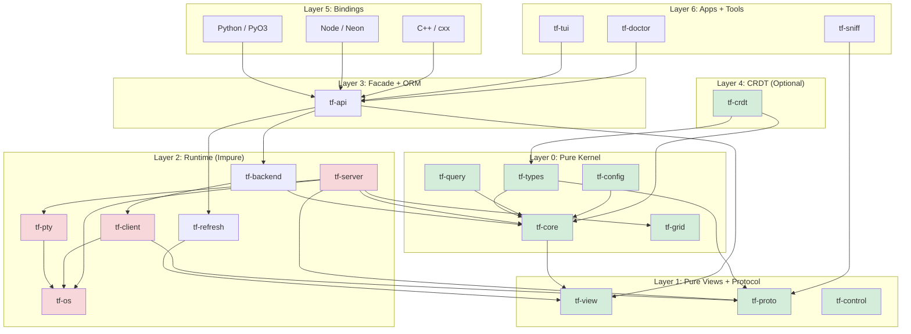

# TermForge: A Layered, CRDT-Ready Terminal Multiplexer with tmux Compatibility

## Synthesized Architectural North Star (v2)

Date: 2026-02-10
Round: 2 (second invocation of multi-model plan)

---

## 1. Project Name and Identity

**Name:** `termforge`

**Rationale:** The name captures the dual nature of the project -- it is both a terminal multiplexer and a forge (foundation) upon which libraries, test frameworks, bindings, and distributed collaborative sessions can be built. It avoids the "tmux" substring to signal architectural independence while the `tmux-compat` feature layer delivers full behavioral compatibility.

**Crate prefix:** `tf-*` (e.g. `tf-core`, `tf-types`, `tf-proto`)

**Tagline:** "A deterministic, layered terminal multiplexer core with tmux wire-compatibility, ORM-style APIs, CRDT collaboration, and multi-language bindings."

---

## 2. Vision & Philosophy

**"Strictly Compatible, Architecturally Liberated."**

- **User Perspective:** It *is* tmux. It reads `.tmux.conf`, accepts `tmux` commands, and behaves exactly as expected. Real tmux clients can attach; it can attach to real tmux servers.
- **Developer Perspective:** It is a modern Rust library ecosystem. You can import `termforge` into your Rust project to manage sessions programmatically (ORM-like) without spawning shell processes.
- **System Perspective:** It is a resilient, async, event-driven system where state is managed through a deterministic pure kernel, CRDT-versioned where needed, ensuring stability even under heavy load or distributed scenarios.
- **Library Perspective:** The kernel is a new multiplexer -- not a 1:1 tmux port. tmux is treated as an external **compatibility profile** (protocol + semantics + config grammar), not as the internal model.

---

## 3. North Star Acceptance Criteria

These are the acceptance tests (technical, architectural, and product) that must stay true as the project evolves. Organized into three categories.

### 3.1 Compatibility Acceptance

1. Real tmux clients can attach to our server.
2. Our client can attach to real tmux servers.
3. Protocol parsing/encoding is fixture-backed; no "invented" framing.
4. Control mode is used only as hints (except where tmux actually sends structured data like `%layout-change` in `control-notify.c`).
5. Command behavior is audit-checked against upstream tmux's command registry (`cmd.c`) and regress scripts.
6. Any tmux-compat claim must cite upstream tmux source/headers or captured fixtures (including SCM_RIGHTS FDs).

### 3.2 Architectural Acceptance

1. **Pure core**: the kernel crate has no tokio/async, no IO, no `nix`/`libc`, no unsafe.
2. **Stream-first**: UI/bindings update via streams; no steady-state polling; one persistent connection per socket/backend.
3. **Unsafe quarantine**: only `tf-os` contains handwritten `unsafe`, each block with `// SAFETY:` documentation and focused tests.
4. **No panics in hot paths**: protocol decode/encode, server loops, PTY loops use `Result` everywhere.
5. **Public API hygiene**: bindings do not expose "frame/store/json/planner" in public names; they expose an object graph + exec facade.
6. **One-way dependency rules**: everything points inward. Pure crates never depend on runtime/OS/bindings. Compatibility adapters depend on kernel+views; kernel never depends on compat.

### 3.3 Product Acceptance

1. **Core usage**: embedding the mux kernel in-process is supported and ergonomic.
2. **ORM usage**: "libtmux-but-Rust" usage is strongly typed and layered.
3. **Bindings usage**: Python/Node/C++ wrappers can be thin and still powerful; query execution happens in Rust.
4. **Test usage**: hermetic servers/sockets/PTY fakes enable deterministic tests; a reusable test framework is published as a standalone crate.
5. **CRDT usage**: transactions can be replicated with merge semantics without retrofitting the entire kernel.

---

## 4. High-Level Architecture

### 4.1 The Layer Cake

1. **Layer 0 -- Kernel (PURE):** state graph, typed IDs, reducer, transactions, effect descriptions.
2. **Layer 1 -- Views + Query (PURE):** immutable snapshots and traversal; query DSL matching libtmux semantics.
3. **Layer 1b -- Protocol (PURE):** tmux binary protocol codec, control-mode parser.
4. **Layer 2 -- Compatibility (mostly PURE):** tmux semantics mapping (commands/options/format/keys).
5. **Layer 3 -- Runtime (IMPURE):** tokio/tasks/threads, sockets, PTY, SCM_RIGHTS, timers.
6. **Layer 4 -- Facade API:** managed per-socket actor, view store, refresh hints.
7. **Layer 5 -- ORM API:** libtmux-shaped object graph layered on views + exec.
8. **Layer 6 -- CRDT:** op log + merge policies + transport (optional).
9. **Layer 7 -- Bindings:** thin wrappers; no matching logic in foreign languages.
10. **Layer 8 -- Tools + Apps:** sniffers, audits, doctor, TUI, CLI.

### 4.2 Architecture Diagram



### 4.3 Actor Topology (Runtime)

```
                                ┌─────────────┐
                                │  tf-server   │
                                │  (main loop) │
                                └──────┬───────┘
                                       │
          ┌────────────────────────────┼────────────────────────────┐
          │                            │                            │
 ┌────────▼────────┐         ┌────────▼────────┐         ┌───────▼────────┐
 │  PtyActor        │         │  StateActor     │         │  Plugin Actor  │
 │  (read/write     │         │  (owns State,   │         │  (WASM runtime)│
 │   pty streams)   │         │   layout, grid, │         │                │
 │                  │         │   rendering)    │         │                │
 └─────────────────┘         └─────────────────┘         └────────────────┘
          │                            │                            │
          └────────────────────────────┼────────────────────────────┘
                                       │
                                ┌──────▼───────┐
                                │ SocketActor   │  (per-socket, from ManagedMux)
                                │ event channel │
                                │ fan-in recv() │
                                └──────────────┘
```

---

## 5. Workspace Layout

```
termforge/
├── Cargo.toml                          # workspace root
├── AGENTS.md                           # human + LLM guardrails
├── ARCHITECTURE.md                     # living architecture doc
│
├── crates/
│   │
│   │  ── LAYER 0: PURE (no IO, no async, no unsafe, no time) ──
│   │
│   ├── tf-types/                       # PURE: foundational types + typed IDs
│   │   └── src/
│   │       ├── lib.rs
│   │       ├── id.rs                   # SessionId, WindowId, PaneId, ClientId, JobId, BufferId
│   │       ├── geometry.rs             # Rect, Size, Position, SplitDirection
│   │       ├── key.rs                  # KeyCode, KeyModifiers (from tmux.h KEYC_*)
│   │       ├── style.rs               # Color, Style, Attributes (from tmux grid_cell)
│   │       └── error.rs               # CoreError enum (pure, no IO errors)
│   │
│   ├── tf-query/                       # PURE: query DSL + operators
│   │   └── src/
│   │       ├── lib.rs
│   │       ├── ops.rs                  # QueryOp enum (Exact, IContains, Regex, etc.)
│   │       ├── value.rs               # QueryValue (Null, Bool, I64, String, List)
│   │       ├── spec.rs                # QuerySpec, QueryTerm
│   │       ├── list.rs                # QueryList<T: Queryable> with filter/get/get_one
│   │       └── derive.rs              # #[derive(Queryable)] proc macro support
│   │
│   ├── tf-config/                      # PURE: config AST, lexer, parser
│   │   └── src/
│   │       ├── lib.rs
│   │       ├── ast.rs                  # Config AST nodes
│   │       ├── lexer.rs               # Tokenizer
│   │       ├── parser.rs              # Config file parser (tmux.conf compatible)
│   │       └── options.rs             # Option table + defaults (from tmux options-table.c)
│   │
│   ├── tf-core/                        # PURE: deterministic state machine + transaction kernel
│   │   └── src/
│   │       ├── lib.rs
│   │       ├── graph.rs               # ServerGraph (SlotMap-backed entity store)
│   │       ├── session.rs             # Session entity
│   │       ├── window.rs              # Window entity
│   │       ├── pane.rs                # Pane entity
│   │       ├── client.rs              # Client entity
│   │       ├── job.rs                 # Job entity
│   │       ├── buffer.rs              # Paste buffer entity
│   │       ├── hook.rs                # Hook storage + dispatch model
│   │       ├── key_table.rs           # Key table + binding model
│   │       ├── event.rs               # Event enum (input intents)
│   │       ├── effect.rs              # Effect enum (runtime side effects)
│   │       ├── engine.rs              # apply_event(graph, event) -> ApplyOutcome
│   │       ├── transaction.rs         # TxnId, Transaction, Precondition, KernelOp
│   │       ├── facade.rs              # ServerFacade (command string -> event)
│   │       ├── handle.rs              # ServerHandle (read-only graph traversal)
│   │       ├── context.rs             # ClientContext (client-relative semantics)
│   │       ├── state.rs               # GraphState, SessionState, etc. (serializable snapshots)
│   │       ├── format.rs              # Format string expansion engine (from tmux format.c)
│   │       ├── layout.rs              # Layout tree + algorithms
│   │       ├── copy_mode.rs           # Copy mode state machine
│   │       └── command/               # Per-command handlers (pure)
│   │           ├── mod.rs
│   │           ├── new_session.rs
│   │           ├── new_window.rs
│   │           ├── split_window.rs
│   │           ├── select_pane.rs
│   │           ├── send_keys.rs
│   │           ├── display_message.rs
│   │           ├── set_option.rs
│   │           └── ...                # one file per tmux command (~80 files)
│   │
│   ├── tf-view/                        # PURE: view model + traversal helpers
│   │   └── src/
│   │       ├── lib.rs
│   │       ├── view.rs               # View, ViewIndex, ViewMeta
│   │       ├── view_id.rs            # ViewId (Local | Tmux)
│   │       ├── refs.rs               # SessionRef, WindowRef, PaneRef (lifetime-bounded)
│   │       ├── query.rs              # query::session::*, query::window::*, query::pane::*
│   │       └── diff.rs               # View diffing for CRDT and incremental updates
│   │
│   ├── tf-grid/                        # PURE: terminal grid + ANSI/VT state machine
│   │   └── src/
│   │       ├── lib.rs
│   │       ├── grid.rs               # Grid (row/column cell storage)
│   │       ├── cell.rs               # Cell (character + style)
│   │       ├── row.rs                # Row (line storage, wrapping)
│   │       ├── parser.rs             # ANSI/VT escape sequence parser
│   │       ├── hyperlinks.rs         # Hyperlink tracking (OSC 8)
│   │       └── scrollback.rs         # Scrollback buffer management
│   │
│   │  ── LAYER 1: PROTOCOL (PURE except for byte handling) ──
│   │
│   ├── tf-proto/                       # PURE*: tmux binary protocol codec
│   │   └── src/
│   │       ├── lib.rs
│   │       ├── frame.rs              # ImsgHdr, ImsgFrame (from tmux-protocol.h)
│   │       ├── codec.rs              # ImsgCodec (tokio_util::Decoder/Encoder)
│   │       ├── msg.rs                # MsgType enum (MSG_COMMAND, MSG_IDENTIFY_*, etc.)
│   │       ├── identify.rs           # IdentifyBurstBuilder
│   │       ├── payload.rs            # Payload parsing helpers
│   │       ├── error.rs              # ProtocolError
│   │       └── fixture.rs            # Test fixtures from real tmux captures
│   │
│   ├── tf-control/                     # PURE: control-mode line parser
│   │   └── src/
│   │       ├── lib.rs
│   │       ├── notification.rs       # ControlNotification enum (from control-notify.c)
│   │       ├── parser.rs             # %%notification line parser
│   │       └── backpressure.rs       # Pause/continue/watermark model
│   │
│   │  ── LAYER 2: RUNTIME (async, IO, unsafe quarantine) ──
│   │
│   ├── tf-os/                          # UNSAFE: OS primitives quarantine
│   │   └── src/
│   │       ├── lib.rs
│   │       ├── pty.rs                # PTY creation + management
│   │       ├── scm_rights.rs         # SCM_RIGHTS FD passing
│   │       ├── socket.rs             # Unix socket creation + permissions
│   │       ├── signal.rs             # Signal handling
│   │       └── fd.rs                 # FD lifecycle + close-on-drop
│   │
│   ├── tf-pty/                         # PTY trait abstraction
│   │   └── src/
│   │       ├── lib.rs                # PtyBackend trait
│   │       ├── os.rs                 # Real OS PTY backend
│   │       ├── portable.rs           # portable-pty backend
│   │       └── fake.rs               # Fake PTY for testing
│   │
│   ├── tf-refresh/                     # Refresh planner + state store
│   │   └── src/
│   │       ├── lib.rs
│   │       ├── planner.rs            # RefreshPlanner (debounce + scope coalescing)
│   │       ├── state.rs              # StateHandle<T> (ArcSwap-backed lock-free store)
│   │       ├── event.rs              # RefreshEvent parsing
│   │       └── subscription.rs       # RefreshHint + broadcast
│   │
│   ├── tf-client/                      # tmux protocol client
│   │   └── src/
│   │       ├── lib.rs
│   │       ├── connection.rs         # Protocol connection management
│   │       ├── control.rs            # Control-mode session management
│   │       ├── sync.rs               # SyncClient (blocking wrapper)
│   │       └── socket.rs             # Socket discovery + resolution
│   │
│   ├── tf-backend/                     # Backend trait + implementations
│   │   └── src/
│   │       ├── lib.rs                # MuxBackend enum (Local | Tmux)
│   │       ├── local.rs              # In-process backend (uses tf-core directly)
│   │       ├── tmux.rs               # Real tmux backend (protocol + control + binary)
│   │       ├── connection.rs         # ConnectionManager (lifecycle)
│   │       └── view_capture.rs       # State snapshot via list-* commands
│   │
│   ├── tf-server/                      # tmux-compatible server binary
│   │   └── src/
│   │       ├── main.rs
│   │       ├── state.rs              # Runtime state wrapping tf-core
│   │       ├── commands.rs           # Command dispatch
│   │       ├── framing.rs            # Protocol frame handler
│   │       ├── config.rs             # Format context + option semantics
│   │       ├── keybinding.rs         # Key dispatch
│   │       ├── status.rs             # Status line rendering
│   │       ├── borders.rs            # Pane border rendering
│   │       ├── copy_mode.rs          # Copy mode runtime
│   │       ├── layout.rs             # Layout algorithms
│   │       ├── attached.rs           # Attached client loop
│   │       ├── pty_reader.rs         # PTY output reader
│   │       └── test_backend.rs       # Configurable backend for testing
│   │
│   │  ── LAYER 3: FACADE (unified API surface) ──
│   │
│   ├── tf-api/                         # Primary public facade crate
│   │   └── src/
│   │       ├── lib.rs                # Re-exports: ManagedMux, View, query::*, etc.
│   │       ├── managed.rs            # ManagedMux (SocketActor) + RefreshDriver
│   │       ├── lifecycle.rs          # LifecycleManager (server start/stop)
│   │       ├── targets.rs            # Target resolution (session/window/pane)
│   │       └── orm.rs                # ORM-like API: server.sessions().filter().get_one()
│   │
│   │  ── LAYER 4: CRDT (collaborative features) ──
│   │
│   ├── tf-crdt/                        # CRDT state synchronization
│   │   └── src/
│   │       ├── lib.rs
│   │       ├── document.rs           # CrdtDocument (graph state as CRDT)
│   │       ├── operations.rs         # CrdtOp enum (insert/delete/update/move)
│   │       ├── clock.rs              # HybridLogicalClock
│   │       ├── merge.rs              # Merge resolution strategies
│   │       ├── transport.rs          # CrdtTransport trait (for network layer)
│   │       └── snapshot.rs           # Snapshot + delta encoding
│   │
│   │  ── LAYER 5: TELEMETRY ──
│   │
│   ├── tf-telemetry/                   # Tracing + OTEL infrastructure
│   │   └── src/
│   │       ├── lib.rs
│   │       ├── tracing.rs            # tracing subscriber setup
│   │       ├── otel.rs               # OpenTelemetry integration
│   │       └── config.rs             # Telemetry config (env vars, TOML)
│   │
│   │  ── TEST SUPPORT ──
│   │
│   ├── tf-test-support/                # Shared test utilities
│   │   └── src/
│   │       ├── lib.rs
│   │       ├── harness.rs            # Test harness (temp sockets, isolated env)
│   │       ├── pty_strict.rs         # PTY leak detection
│   │       └── assertions.rs         # Domain-specific assertions
│   │
│   └── tf-test-framework/              # Test framework for terminal apps
│       └── src/
│           ├── lib.rs
│           ├── session_builder.rs    # Declarative test session setup
│           ├── expectations.rs       # Output matching (exact, regex, contains)
│           ├── timing.rs             # Wait conditions + timeouts
│           ├── capture.rs            # Pane capture utilities
│           └── fixtures.rs           # Fixture recording + replay
│
├── tools/
│   ├── tf-tui/                         # Ratatui-based TUI client
│   ├── tf-sniff/                       # Protocol sniffer/proxy
│   ├── tf-doctor/                      # Diagnostic tool
│   ├── format-audit/                   # tmux format.c alignment checker
│   ├── command-audit/                  # tmux command coverage tracker
│   └── regress-audit/                  # tmux regress test alignment
│
├── bindings/
│   ├── python/                         # PyO3 + maturin
│   │   ├── Cargo.toml
│   │   ├── pyproject.toml
│   │   └── src/
│   │       ├── lib.rs                # #[pymodule] termforge
│   │       ├── server.rs             # PyServer wrapping ManagedMux
│   │       ├── session.rs            # PySession
│   │       ├── window.rs             # PyWindow
│   │       ├── pane.rs               # PyPane
│   │       ├── query.rs              # PyQueryList + Django-style lookups
│   │       └── exceptions.rs         # ObjectDoesNotExist, MultipleObjectsReturned
│   │
│   ├── node/                           # Neon bindings
│   │   ├── Cargo.toml
│   │   ├── package.json
│   │   └── src/
│   │       ├── lib.rs
│   │       ├── server.rs
│   │       ├── session.rs
│   │       ├── window.rs
│   │       ├── pane.rs
│   │       └── query.rs
│   │
│   └── cxx/                            # cxx bridge
│       ├── Cargo.toml
│       └── src/
│           ├── lib.rs                # #[cxx::bridge]
│           └── wrapper.hpp           # Thin C++ adapter
│
└── tests/
    ├── integration/                    # Cross-crate integration tests
    ├── parity/                         # tmux behavioral parity tests
    └── e2e/                            # End-to-end real-tmux tests
```

### Purity Classification Table

| Crate | Purity | Async | Unsafe | IO | Key Dependencies |
|-------|--------|-------|--------|----|------------------|
| `tf-types` | PURE | No | No | No | `bitflags` |
| `tf-query` | PURE | No | No | No | `regex` |
| `tf-config` | PURE | No | No | No | `nom` |
| `tf-core` | PURE | No | No | No | `slotmap`, `indexmap`, `smallvec`, `tf-types`, `tf-query`, `tf-config` |
| `tf-view` | PURE | No | No | No | `tf-core`, `tf-query` |
| `tf-grid` | PURE | No | No | No | `tf-types` |
| `tf-proto` | PURE* | No | No | No | `bytes`, `tokio-util` (codec trait only), `nom` |
| `tf-control` | PURE | No | No | No | `nom` |
| `tf-crdt` | PURE | No | No | No | `tf-types`, `tf-core` |
| `tf-os` | IMPURE | No | **YES** | YES | `nix`, `libc` |
| `tf-pty` | IMPURE | No | Via tf-os | YES | `tf-os`, `portable-pty` |
| `tf-refresh` | IMPURE | Yes | No | No | `tokio`, `arc-swap`, `tf-view` |
| `tf-client` | IMPURE | Yes | No | YES | `tokio`, `tf-proto`, `tf-os` |
| `tf-backend` | IMPURE | Yes | No | YES | `tf-client`, `tf-core`, `tf-view` |
| `tf-server` | IMPURE | Yes | Via tf-os | YES | `tf-core`, `tf-proto`, `tf-os`, `tf-pty`, `tf-grid` |
| `tf-api` | FACADE | Yes | No | No | `tf-backend`, `tf-view`, `tf-refresh` |
| `tf-telemetry` | IMPURE | No | No | YES | `tracing`, `opentelemetry` |

---

## 6. One-Way Dependency Rules

This is the single most important structural constraint in the project. Getting the crate layout right matters less than enforcing these rules.

### The Rule

**Everything points inward. Pure crates never depend on runtime/OS/bindings. Compatibility adapters depend on kernel+views; the kernel never depends on compat.**

### Dependency Direction

```
Bindings  -->  API Facade  -->  Runtime  -->  Protocol  -->  Kernel  -->  Types
                                   |              |             |
                                   v              v             v
                                 tf-os        tf-control    tf-query
                                 tf-pty                     tf-config
```

### Specific Prohibitions

- `tf-core` must NEVER import `tokio`, `nix`, `libc`, or any async runtime.
- `tf-types` must NEVER depend on any other `tf-*` crate.
- `tf-proto` must NEVER depend on `tf-core` (protocol is independent of state model).
- `tf-crdt` must NEVER import networking or transport code (transport is runtime-plane).
- Bindings must NEVER implement query matching logic -- only format criteria and call Rust.
- Runtime crates must NEVER be dependencies of pure crates.

### Why This Matters

> The critical part is not picking the "perfect" set of crates; it's enforcing the one-way dependency rules and making correctness measurable via fixtures + parity harnesses from day one.

---

## 7. Kernel Design

### 7.1 Core State Model: ServerGraph

The kernel owns the authoritative state graph. Unlike vibe-tmux (which keeps some state in mux-server), termforge moves ALL mutable domain state into the pure core:

```rust
// tf-core/src/graph.rs
use slotmap::SlotMap;

pub struct ServerGraph {
    sessions: SlotMap<SessionId, Session>,
    windows: SlotMap<WindowId, Window>,
    panes: SlotMap<PaneId, Pane>,
    clients: SlotMap<ClientId, Client>,
    jobs: SlotMap<JobId, Job>,
    buffers: SlotMap<BufferId, PasteBuffer>,  // In core, not server
    hooks: HookTable,                          // In core, not server
    key_tables: KeyTableSet,                   // In core, not server
    options: OptionsStore,                     // In core, not server
}
```

Typed IDs are mandatory everywhere:

```rust
// tf-types/src/id.rs
slotmap::new_key_type! {
    pub struct SessionId;
    pub struct WindowId;
    pub struct PaneId;
    pub struct ClientId;
    pub struct JobId;
    pub struct BufferId;
}
```

### 7.2 Event/Effect Engine (Functional Core, Imperative Shell)

The kernel is an event reducer producing effect descriptions:

```rust
// tf-core/src/engine.rs
pub fn apply_event(graph: &mut ServerGraph, event: Event) -> ApplyOutcome {
    match event {
        Event::Command { name, args } => command::dispatch(graph, &name, &args),
        Event::CreateSession { name } => { /* ... */ },
        Event::Key { client_id, key } => key_dispatch(graph, client_id, key),
        // ... complete event taxonomy
    }
}

pub struct ApplyOutcome {
    pub effects: Vec<Effect>,
    pub created_session: Option<SessionId>,
    pub created_window: Option<WindowId>,
    pub created_pane: Option<PaneId>,
    pub notifications: Vec<Notification>,  // control-mode notifications to emit
    pub crdt_ops: Vec<CrdtOp>,            // CRDT operations for sync
}
```

### 7.3 Transaction-First Design

Transactions are the unit of composability. Every state mutation flows through the transaction system, enabling CRDT replication, undo/redo, and optimistic concurrency.

```rust
// tf-core/src/transaction.rs

/// Unique transaction identifier for causal ordering and CRDT replay.
pub struct TxnId(u64);

/// A kernel operation -- the atomic unit of state change.
pub enum KernelOp {
    CreateSession { name: String },
    DestroySession { id: SessionId },
    CreateWindow { session_id: SessionId, name: String },
    SplitPane { window_id: WindowId, direction: SplitDirection },
    SelectPane { window_id: WindowId, pane_id: PaneId },
    SetOption { scope: OptionScope, key: String, value: OptionValue },
    SendKeys { pane_id: PaneId, keys: Vec<KeyCode> },
    // ... one variant per atomic mutation
}

/// Precondition for optimistic concurrency and CRDT conflict resolution.
pub enum Precondition {
    SessionExists(SessionId),
    PaneInWindow { pane_id: PaneId, window_id: WindowId },
    OptionEquals { scope: OptionScope, key: String, expected: OptionValue },
    // ... extensible
}

/// A transaction bundles operations with preconditions for atomic application.
pub struct Transaction {
    pub id: TxnId,
    pub ops: Vec<KernelOp>,
    pub preconditions: Vec<Precondition>,
}

/// Apply a full transaction atomically.
pub fn apply_transaction(
    state: &mut ServerGraph,
    txn: Transaction,
    ctx: &KernelCtx,
) -> Result<Vec<Effect>, KernelError> {
    // 1. Validate all preconditions
    for pre in &txn.preconditions {
        validate_precondition(state, pre)?;
    }
    // 2. Apply all ops
    let mut effects = Vec::new();
    for op in txn.ops {
        effects.extend(apply_kernel_op(state, op)?);
    }
    Ok(effects)
}
```

A transaction can be derived from:
- A tmux command (`new-session`, `split-window`, etc.)
- A "native API" call
- A replicated CRDT operation batch

Preconditions are how you later support optimistic concurrency and CRDT conflict policies.

### 7.4 Entity Model (aligned with tmux `tmux.h` struct hierarchy)

```rust
// tf-core/src/session.rs (matches tmux `struct session`)
pub struct Session {
    pub name: String,
    pub windows: Vec<WindowId>,       // ordered (winlink list)
    pub active_window: Option<WindowId>,
    pub last_window: Option<WindowId>,
    pub created: Option<i64>,
    pub destroying: bool,
    pub group: Option<String>,        // session groups
    pub options: OptionScope,
}

// tf-core/src/pane.rs (matches tmux `struct window_pane`)
pub struct Pane {
    pub size: PaneSize,
    pub bounds: Option<Rect>,
    pub grid: Option<PaneId>,         // Links to tf-grid grid (kept external)
    pub pid: Option<u32>,
    pub tty: Option<String>,
    pub start_command: String,
    pub start_path: String,
    pub exited: bool,
    pub exit_status: Option<i32>,
    pub mode: PaneMode,               // Normal, Copy, View
}
```

---

## 8. Runtime Design

### 8.1 Actor Model

The runtime uses an actor model inspired by Zellij's thread bus. Actors communicate via typed instruction enums and channel fan-in. Key actors:

- **ClientActor**: Handles one connected client socket. Manages the identify handshake, protocol framing, and command dispatch.
- **PtyActor**: Manages one running shell process. Reads stdout/stderr, writes stdin. One per pane.
- **StateActor**: Owns the `ServerGraph` (via `tf-core`). Receives `Event` messages, applies them via the engine, and broadcasts `StateChanged` events and `Effect` descriptions.
- **SocketActor** (ManagedMux): Per-socket managed connection for the API facade. Event fan-in via a single channel.

```rust
// Instruction enums (Zellij pattern with actor naming)
pub enum PtyInstruction {
    SpawnTerminal { pane_id: PaneId, command: Vec<String>, cwd: Option<String> },
    WriteToPty { pane_id: PaneId, data: Vec<u8> },
    CloseTerminal { pane_id: PaneId },
}

pub enum ScreenInstruction {
    Render,
    Resize { cols: u16, rows: u16 },
    NewPane { pane_id: PaneId },
    ClosePane { pane_id: PaneId },
}
```

### 8.2 SocketActor / ManagedMux

```rust
// tf-api/src/managed.rs
pub struct ManagedMux {
    backend: MuxBackend,
    state: StateHandle<Option<View>>,     // ArcSwap lock-free store
    updates: broadcast::Sender<RefreshHint>,
    event_tx: Sender<SocketEvent>,
}

enum SocketEvent {
    Wake,
    Control(ControlNotification),
    Refresh(RefreshSet),
    CrdtSync(CrdtOp),                    // CRDT operation from remote
    Shutdown,
}
```

### 8.3 Lock-Free Snapshot Store

UI/bindings should never block on state reads:

- Writes are serialized through the StateActor.
- Reads are lock-free snapshots via `ArcSwap`.
- Updates publish `RefreshHint`s via broadcast channel.
- Latency target: <20ms for UI/binding propagation.

### 8.4 Stream-First Concurrency

Non-negotiable: typed streams over tick-based polling. Event loops block on channels and wake on new data. One persistent connection per socket per backend. No reconnect-per-tick.

---

## 9. tmux Compatibility Profile

### 9.1 Design: New Kernel with tmux as External Profile

tmux is treated as a **compatibility profile**, not as the kernel's internal model. The kernel has full architectural freedom; tmux compatibility spans:

- **Binary protocol** (imsg framing + SCM_RIGHTS FD passing)
- **Control mode** notifications (hints for refresh scoping)
- **Commands/options/format/config grammar** (the full tmux CLI surface)

The kernel does not know about tmux tokens like `$1`, `@3`, `%7`. The compatibility layer translates those into typed IDs and `KernelOp` operations.

### 9.2 Binary Protocol (imsg)

Source of truth: `tmux-protocol.h` (`PROTOCOL_VERSION`, `enum msgtype`).

```rust
// tf-proto/src/frame.rs
pub struct ImsgHdr {
    pub msg_type: u32,     // enum msgtype from tmux-protocol.h
    pub peerid: u32,
    pub pid: u32,
    pub len: u32,          // includes header; high bit = IMSG_FD_FLAG
}

// tf-proto/src/msg.rs (matches tmux-protocol.h enum msgtype)
pub enum MsgType {
    Version = 12,
    IdentifyFlags = 100,
    IdentifyTerm = 101,
    IdentifyTtyname = 102,
    // ... complete enumeration from tmux-protocol.h
    Command = 200,
    Detach = 201,
    // ... all 40+ message types
}
```

### 9.3 Control Mode Notifications

```rust
// tf-control/src/notification.rs
pub enum ControlNotification {
    SessionsChanged,
    SessionRenamed { session_id: u32, name: String },
    SessionWindowChanged { session_id: u32, window_id: u32 },
    WindowAdd { window_id: u32 },
    WindowClose { window_id: u32 },
    WindowRenamed { window_id: u32, name: String },
    WindowPaneChanged { window_id: u32, pane_id: u32 },
    LayoutChange { window_id: u32, layout: String, visible_layout: String, flags: String },
    PaneModeChanged { pane_id: u32 },
    ClientSessionChanged { client: String, session_id: u32, name: String },
    ClientDetached { client: String },
    PasteBufferChanged { name: String },
    PasteBufferDeleted { name: String },
    UnlinkedWindowAdd { window_id: u32 },
    UnlinkedWindowClose { window_id: u32 },
    UnlinkedWindowRenamed { window_id: u32, name: String },
}
```

Control notifications are parsed into this typed enum, mapped to refresh scopes, and never treated as authoritative for full state.

### 9.4 Commands / Config / Format Engine

- `tf-config` owns the config grammar (tmux.conf parser, including conditionals and parse-time format expansion from `cmd-parse.y`).
- `tf-core/src/command/` owns per-command semantic handlers (one file per command).
- `tf-core/src/format.rs` owns the format expansion engine (aligned with `format.c`).
- The compatibility surface translates tmux CLI tokens into typed kernel operations.

---

## 10. ORM / API Layer

### 10.1 Layered API Surface

**Layer 0: Core API (pure, deterministic)**

```rust
use tf_core::{ServerGraph, ServerFacade, Event, Effect, ApplyOutcome};

let mut facade = ServerFacade::new();
let outcome = facade.exec("new-session -s demo")?;
let outcome = facade.exec("split-window -h")?;
let state = facade.snapshot();  // GraphState
```

**Layer 1: View API (pure traversal, Django-style filtering)**

```rust
use tf_view::{View, ViewIndex};
use tf_view::query::{session, window, pane};

let view = View::from_state(state);
let s = view.sessions().filter(session::name().icontains("demo")).get_one()?;
let w = s.windows().filter(window::name().startswith("editor")).get_one()?;
let p = w.panes().filter(pane::active().is_true()).get_one()?;
```

**Layer 2: Managed API (stream-first, push updates)**

```rust
use tf_api::{ManagedMux, RefreshHint};

let managed = ManagedMux::tmux(Some("/tmp/tmux-1000/default"), None, None)?;
let handle = managed.handle();
let mut rx = handle.subscribe();

while let Ok(hint) = rx.recv().await {
    let view = handle.view().expect("view available after hint");
    // React to changes
}
```

**Layer 3: ORM-like API (the "libtmux for Rust")**

```rust
use tf_api::orm::{Server, Session, Window, Pane};

let server = Server::connect("/tmp/tmux-1000/default")?;

for session in server.sessions().iter() {
    println!("Session: {}", session.name());
    for window in session.windows().iter() {
        println!("  Window: {}", window.name());
        for pane in window.panes().iter() {
            println!("    Pane: {} ({})", pane.id(), pane.current_command());
        }
    }
}

// Django-style filtering (matches libtmux.QueryList)
let session = server.sessions().get(name__icontains="dev")?;
let window = session.windows().get(name__startswith="edit")?;

// Command execution
server.cmd("split-window -h")?;
pane.send_keys("echo hello", enter=true)?;
```

### 10.2 Builder-Pattern API Sketch (async, ergonomic)

For users who prefer an async builder-pattern API:

```rust
use tf_api::Client;

#[tokio::main]
async fn main() -> Result<()> {
    let client = Client::connect().await?;

    // ORM-like builder usage
    let session = client.new_session("my_project").create().await?;
    let window = session.active_window().await?;

    // Split pane and run command
    let pane_bottom = window.split_window()
        .direction(Split::Vertical)
        .exec()
        .await?;
    pane_bottom.send_keys("cargo test").await?;

    Ok(())
}
```

### 10.3 Test Framework API

```rust
use tf_test_framework::{TestSession, expect};

#[test]
fn test_split_window() {
    let session = TestSession::builder()
        .window("main", |w| {
            w.pane("editor", "vim file.rs");
            w.pane("terminal", "bash");
        })
        .build()?;

    session.cmd("split-window -h")?;

    expect!(session.active_window().panes().len() == 3);
    expect!(session.active_pane().capture_text()).contains("$");
}
```

---

## 11. CRDT Layer

### 11.1 Architecture

The CRDT layer sits atop the pure core and treats `ServerGraph` mutations as a log of operations:

```rust
// tf-crdt/src/document.rs
pub struct CrdtDocument {
    local_id: ReplicaId,
    clock: HybridLogicalClock,
    operations: Vec<TimestampedOp>,
    graph: ServerGraph,                    // Local materialized view
}

// tf-crdt/src/operations.rs
pub enum CrdtOp {
    CreateSession { id: SessionId, name: String },
    RenameSession { id: SessionId, new_name: String },
    CreateWindow { session_id: SessionId, window_id: WindowId, name: String },
    CreatePane { window_id: WindowId, pane_id: PaneId, spec: PaneSpec },
    SelectWindow { session_id: SessionId, window_id: WindowId },
    SelectPane { window_id: WindowId, pane_id: PaneId },
    MoveWindow { from_session: SessionId, to_session: SessionId, window_id: WindowId },
    SetOption { scope: OptionScope, key: String, value: OptionValue },
    PaneOutput { pane_id: PaneId, data: Vec<u8>, offset: u64 },
    DeleteSession { id: SessionId },
    DeleteWindow { id: WindowId },
    DeletePane { id: PaneId },
}

// tf-crdt/src/clock.rs
pub struct HybridLogicalClock {
    wall_time: u64,
    logical: u32,
    replica_id: ReplicaId,
}
```

### 11.2 Integration with Kernel

The `ApplyOutcome` returned by `tf-core`'s engine includes a `crdt_ops` field. CRDT operations are a derived product of state mutations, not a separate mutation path:

```rust
let outcome = apply_event(&mut graph, event);
for effect in &outcome.effects {
    execute_effect(effect);
}
if let Some(crdt) = crdt_layer.as_mut() {
    for op in &outcome.crdt_ops {
        crdt.broadcast(op).await;
    }
}
```

### 11.3 Authority Modes

1. **Local-authoritative tmux-compat mode**: single writer, tmux semantics, CRDT disabled.
2. **Replicated-authoritative mode**: kernel state derived from CRDT doc; tmux projection is a view.
3. **Hybrid**: tmux commands create transactions encoded as CRDT ops; remote merges apply them.

### 11.4 Transport Layer

```rust
// tf-crdt/src/transport.rs
pub trait CrdtTransport: Send + Sync {
    fn broadcast(&self, op: &CrdtOp) -> Result<()>;
    fn receive(&self) -> Pin<Box<dyn Stream<Item = CrdtOp> + Send>>;
    fn sync_state(&self, peer: ReplicaId) -> Result<Vec<CrdtOp>>;
}
```

Implementations: LocalTransport (testing), UnixSocketTransport (local), WebSocketTransport (remote), GrpcTransport (federation).

### 11.5 Performance Strategy

CRDTs can be slow for large state graphs. Mitigation: use a simplified **Last-Write-Wins (LWW)** map for most structural state (sessions, windows, panes, options). Reserve full CRDT operation logs only for scenarios that genuinely need conflict-free merge (e.g., concurrent pane creation, collaborative editing). Layout geometry uses LWW with wall-clock + replica-ID tiebreaker. Session/window/pane *existence* uses add-wins semantics.

---

## 12. Bindings Strategy

### 12.1 Python Bindings (PyO3 + maturin)

```python
from termforge import Server

server = Server(socket_name="default")

# QueryList with Django-style lookups (from libtmux)
session = server.sessions.get(session_name="demo")
window = session.windows.filter(window_name__startswith="edit")[0]
pane = window.panes.get(pane_active="1")

# Command execution
server.cmd("new-window", "-n", "logs")
pane.send_keys("tail -f /var/log/syslog")

# Context manager for test isolation
with Server(socket_name_factory=lambda: f"test-{uuid4()}") as server:
    session = server.new_session(session_name="test")
    # Server killed on exit
```

### 12.2 Node Bindings (Neon)

```javascript
const { ManagedMux } = require('termforge');

const server = new ManagedMux();
const sessions = server.sessions();
const session = sessions.filter({ name__icontains: 'demo' }).getOne();
const windows = session.windows();
```

### 12.3 C++ Bindings (cxx)

```cpp
#include "termforge.hpp"

auto server = termforge::ManagedMux::connect("/tmp/tmux-1000/default");
auto view = server.view();
auto session = view.sessions()
    .filter(termforge::query::session::name().icontains("demo"))
    .get_one();
```

### 12.4 Binding Implementation Rules

1. `ServerState` holds `Arc<Mutex<ManagedMux>>` + optional `RefreshDriver`.
2. OTEL span propagation across binding boundaries.
3. Query execution happens in Rust; bindings format criteria and call Rust query engine.
4. View reads are lock-free via `StateHandle` (no blocking on readers).
5. Public API names are clean: no "Frame", "Store", "JSON", "Planner" exposed.

---

## 13. Testing Strategy

### 13.1 Testing Pyramid

```
         /\
        /  \  E2E: real tmux <-> our server
       /    \  (50+ parity tests)
      /------\
     /        \  Integration: hermetic, temp sockets
    /          \  (200+ tests, test harness)
   /------------\
  /              \  Unit: pure core Event -> Effect
 /                \  (500+ tests, proptest, insta snapshots)
/------------------\
```

### 13.2 Test Categories

**1. Pure core tests (tf-core)**
- Deterministic: no IO, no time, no randomness unless injected.
- Assert on whole `ApplyOutcome` objects (not field-by-field).
- Proptest for graph invariants: "for any sequence of valid events, session_ids in window.session never reference a deleted session."
- Transaction precondition validation coverage.

**2. Protocol snapshot tests (tf-proto)**
- Insta snapshots for decoded fixtures.
- Proptest: random bytes into codec must not panic.
- Chunking robustness: split valid frames at random boundaries.
- Identify burst ordering validated against real tmux captures.

**3. Parity tests (against real tmux)**
- Run identical script against our server AND real tmux.
- Diff outputs.
- `#[ignore]` by default (require `cargo test --ignored`).
- Track coverage via `regress-audit`, `command-audit`, `format-audit`.
- Target: 90%+ command parity, tracked with measurable audit scores.

**4. Integration tests (hermetic)**
- Start server on temp socket.
- Use fake PTY backend where possible.
- Assert stream-driven UI/binding behavior.
- Never touch real tmux socket.

**5. Binding parity tests**
- Python: pytest suite with isolated tmux servers (from libtmux `pytest_plugin.py` fixture discipline).
- Node: vitest suite.
- C++: Catch2 tests linked against cxx bridge.

**6. CRDT convergence tests**
- Two in-process replicas with concurrent random mutations must converge.
- Snapshot round-trip verification.

### 13.3 Test Environment Safety (Rule 0)

- NEVER touch the developer's real tmux socket.
- All tests use `/tmp/termforge-test-*` sockets.
- `TERMFORGE_GUARD_KILL_SERVER=1` enabled by default.
- Socket path verified before any destructive command.
- Unique socket names per test, cleanup finalizers.

---

## 14. DOs and DON'Ts

### DOs (20 rules)

1. **DO** keep `tf-core` pure: `#![forbid(unsafe_code)]`, no tokio, no IO, no time/rng without injection.
2. **DO** use typed IDs (`SessionId`, `WindowId`, etc.) everywhere -- never raw integers across crate boundaries.
3. **DO** validate protocol claims against tmux source or captured fixtures before implementing.
4. **DO** use stream-first semantics (channels, async streams) for all real-time update paths.
5. **DO** quarantine all `unsafe` in `tf-os` with `// SAFETY:` comments and focused tests.
6. **DO** use `Result` everywhere in hot paths -- no `unwrap()`/`expect()` in protocol/server/PTY code.
7. **DO** implement one command per file in `tf-core/src/command/` for isolation and testability.
8. **DO** run query filtering in Rust -- bindings are thin wrappers that format criteria.
9. **DO** use `ArcSwap`/lock-free reads for view store access from UI/bindings.
10. **DO** expose CRDT operations as a derived product of `ApplyOutcome`, not a separate mutation path.
11. **DO** use `insta` snapshot tests for protocol decoding, view rendering, and format expansion.
12. **DO** use `proptest` for invariant checking on `ServerGraph` and protocol codec.
13. **DO** maintain audit tools (`command-audit`, `format-audit`, `regress-audit`) against tmux source.
14. **DO** use hermetic test sockets (`/tmp/termforge-test-*`) -- verify path before destructive commands.
15. **DO** propagate OTEL trace context across all thread/binding/process boundaries.
16. **DO** keep the binding API surface libtmux-shaped: `server.sessions -> session.windows -> window.panes`.
17. **DO** document public API changes in `ARCHITECTURE.md` and `notes/plan.md`.
18. **DO** use `just check-llm` equivalent before every commit.
19. **DO** prefer inline format args (`format!("{value}")`) over positional.
20. **DO** assert on whole objects in tests, not field-by-field.

### DON'Ts (18 rules)

1. **DON'T** kill the developer's real tmux server (Rule 0).
2. **DON'T** add tokio/async to any PURE-classified crate.
3. **DON'T** use `#[repr(packed)]` anywhere.
4. **DON'T** cast bytes to struct for protocol parsing -- explicit field parsing only.
5. **DON'T** use serde-based IPC for tmux compatibility surfaces.
6. **DON'T** expose internal names (`Frame`, `Store`, `JSON`) in binding public APIs.
7. **DON'T** implement query matching logic in binding languages (only in Rust).
8. **DON'T** use polling/sleep loops for steady-state UI/binding updates.
9. **DON'T** reconnect/identify per tick -- one persistent connection per socket per backend.
10. **DON'T** create new crates for incremental migration work -- add modules to existing crates.
11. **DON'T** use `unwrap()` or `expect()` in protocol decode, server loop, or PTY loop.
12. **DON'T** mutate process environment in tests -- use dependency injection.
13. **DON'T** touch `/mnt/*` paths for socket creation on WSL.
14. **DON'T** invent protocol message ordering or payload layouts -- everything must be tmux-source-backed.
15. **DON'T** use `Runtime::new()` (multi-thread tokio) in synchronous client contexts.
16. **DON'T** keep legacy/polling API paths alongside stream-first surfaces.
17. **DON'T** add overlapping dependency stacks (one PTY strategy, one FD-passing strategy).
18. **DON'T** create documentation files proactively -- only when explicitly requested.

---

## 15. AGENTS.md Template

```markdown
# AGENTS.md (human + LLM guardrails)

## Rule 0: Never kill real tmux
- NEVER run `kill-server` against the developer's real tmux socket.
- Always use dedicated test sockets (`/tmp/termforge-test-*`).
- Keep the kill-server guard enabled (`TERMFORGE_GUARD_KILL_SERVER=1`).

## Mission
Layered terminal multiplexer core with perfect tmux compatibility, ORM-style APIs,
CRDT collaboration support, and multi-language bindings.

"Works" is not success unless a real tmux client/server agrees on the compatibility layer.

## Reference repos
- `~/study/c/tmux` — upstream tmux behavior/source (authoritative for protocol + semantics)
- `~/study/rust/zellij` — actor patterns, thread bus, plugin system
- `~/study/rust/tokio` — async runtime patterns
- `~/study/rust/ratatui` — TUI widget patterns, workspace structure
- `~/study/rust/codex` — AI tool architecture, coding conventions
- `~/work/python/libtmux` — ORM-like API shape, QueryList, pytest plugin
- `~/work/rust/vibe-tmux` — predecessor project (all lessons learned apply)

## Non-negotiables

### 0) Push-first responsiveness
- Typed streams over tick-based polling.
- Event loops block on channels and wake on new data.
- Latency target: <20ms for UI/binding propagation.

### 1) Purity boundary
`tf-core`, `tf-types`, `tf-query`, `tf-config`, `tf-view`, `tf-grid`,
`tf-proto`, `tf-control`, `tf-crdt` are PURE:
- no tokio, no async/.await
- no nix/libc
- no filesystem, sockets, PTYs
- no unsafe (except tf-proto may use bytes::Buf)
- no time/rng without explicit injection

### 2) Unsafe quarantine
Only `tf-os` may contain `unsafe`. Every block:
- minimal boundary
- documents invariants with `// SAFETY: ...`
- has a focused test

### 3) Protocol parsing
- Explicit field parsing (no cast bytes to struct)
- Validate lengths before reading
- Cap allocations
- Malformed frames = protocol violation = close connection cleanly

### 4) Source-of-truth
Protocol/behavior claims must be backed by tmux source or captured fixtures.
No invented message ordering, payload layouts, or flags.

### 5) No panics in hot paths
Use `Result`, close the client, log with context.
Deny: `unwrap_used`, `expect_used`, `panic` in Clippy.

### 6) Testing policy
- Core: deterministic Event -> Effect unit tests
- Protocol: fixture snapshots + proptest chunking
- Integration: hermetic, temp dirs/sockets
- Parity: our server vs real tmux with identical scripts
- Bindings: smoke tests per language

### 7) Dependency policy
- Minimal deps per crate
- No overlapping stacks
- No serde-based IPC for tmux surfaces

## Coding conventions (from codex-rs)
- Inline format args: `format!("{value}")` not `format!("{}", value)`
- Collapsible if statements
- Method references over closures
- Assert whole objects in tests
- Pretty assertions for diffs

## Git commit format
type(scope[detail]) concise description

why: Explanation.
what:
- Change 1
- Change 2
```

---

## 16. Implementation Phases

### Phase 1: Foundation Types (Weeks 1-2)

**Build order steps:** `tf-types`, `tf-query`, `tf-config`, `tf-test-support`

**Create:**
- `Cargo.toml` (workspace), `AGENTS.md`, `ARCHITECTURE.md`
- `crates/tf-types/` (all files)
- `crates/tf-query/` (all files)
- `crates/tf-config/` (all files)
- `crates/tf-test-support/` (basic harness)

**Acceptance:**
- [ ] `cargo test -p tf-types` passes (50+ unit tests for ID types, geometry, keys)
- [ ] `cargo test -p tf-query` passes (port all tests from vibe-tmux `mux-query`)
- [ ] `cargo test -p tf-config` parses 10+ tmux.conf files from `~/study/c/tmux/regress/`
- [ ] All three crates pass `#![forbid(unsafe_code)]`
- [ ] `cargo clippy --workspace` clean with workspace lints

### Phase 2: Core State Machine + Transaction Kernel (Weeks 3-6)

**Build order steps:** `tf-core` (graph, engine, transaction, commands), `tf-view`

**Create:**
- `crates/tf-core/` (all files including `command/` directory and `transaction.rs`)
- `crates/tf-view/` (all files)

**Acceptance:**
- [ ] `ServerGraph` CRUD operations have 100% coverage
- [ ] `apply_event` covers all Event variants with Effect assertions
- [ ] `apply_transaction` validates preconditions and applies ops atomically
- [ ] `ServerFacade::exec()` parses and applies 40+ tmux commands
- [ ] `View` construction from `GraphState` round-trips correctly
- [ ] QueryList filtering works for sessions, windows, panes
- [ ] Proptest: "1000 random event sequences never panic or violate invariants"
- [ ] `format-audit` shows <10% gap against tmux `format.c` variables

### Phase 3: Protocol + Grid (Weeks 7-9)

**Build order steps:** `tf-proto`, `tf-control`, `tf-grid`

**Create:**
- `crates/tf-proto/` (all files)
- `crates/tf-control/` (all files)
- `crates/tf-grid/` (all files)

**Acceptance:**
- [ ] `tf-proto` decodes all imsg types from tmux-protocol.h
- [ ] Identify burst builder matches tmux `client_send_identify` ordering
- [ ] Proptest: "random byte chunks through ImsgCodec never panic"
- [ ] `tf-control` parses all 14+ notification types from `control-notify.c`
- [ ] `tf-grid` renders basic ANSI sequences correctly (vttest subset)
- [ ] Insta snapshots for all protocol fixtures

### Phase 4: OS + PTY + Runtime (Weeks 10-14)

**Build order steps:** `tf-os`, `tf-pty`, `tf-refresh`, `tf-client`, `tf-backend`, `tf-server`

**Create:**
- `crates/tf-os/` (all files)
- `crates/tf-pty/` (all files)
- `crates/tf-refresh/` (all files)
- `crates/tf-client/` (all files)
- `crates/tf-backend/` (all files)
- `crates/tf-server/` (all files)
- `tools/tf-sniff/`, `tools/tf-doctor/`
- `tools/command-audit/`, `tools/format-audit/`, `tools/regress-audit/`

**Acceptance:**
- [ ] `tf-server` binary starts and accepts connection from `tmux attach`
- [ ] `tf-client` connects to real `tmux` server and retrieves `list-sessions`
- [ ] PTY strict mode passes: no leaked PTYs after test suite
- [ ] Loopback test: `tf-client` <-> `tf-server` round-trip
- [ ] `regress-audit` tracks 30+ tmux regress scripts
- [ ] `command-audit` shows 80%+ command coverage

### Phase 5: API Facade + ORM (Weeks 15-17)

**Build order steps:** `tf-api`, `tf-telemetry`

**Create:**
- `crates/tf-api/` (all files)
- `crates/tf-telemetry/` (all files)

**Acceptance:**
- [ ] `ManagedMux` provides lock-free view reads
- [ ] RefreshHint latency <20ms (measured with tracing)
- [ ] ORM API: `server.sessions().filter(name__icontains="demo").get_one()` works
- [ ] Builder-pattern async API: `Client::connect().await?` -> `session.active_window().await?` works
- [ ] `just check-llm` equivalent passes
- [ ] OTEL trace chain verified (no orphan spans)

### Phase 6: CRDT Layer (Weeks 18-20)

**Build order steps:** `tf-crdt`

**Create:**
- `crates/tf-crdt/` (all files)

**Acceptance:**
- [ ] `CrdtDocument` round-trips through serialize/deserialize
- [ ] Two replicas converge after 100 concurrent random mutations
- [ ] Snapshot + delta encoding produces compact representations
- [ ] No CRDT code in tf-core (clean separation)
- [ ] LWW strategy benchmarked and within performance budget

### Phase 7: Bindings (Weeks 21-24)

**Build order steps:** `bindings/python/`, `bindings/node/`, `bindings/cxx/`

**Create:**
- `bindings/python/` (all files)
- `bindings/node/` (all files)
- `bindings/cxx/` (all files)

**Acceptance:**
- [ ] Python: `import termforge; s = termforge.Server()` works
- [ ] Python: `server.sessions.filter(session_name__icontains="x")` returns correct results
- [ ] Python: libtmux pytest smoke suite passes (10+ tests)
- [ ] Node: `const s = new ManagedMux()` works
- [ ] C++: `auto s = termforge::ManagedMux::connect(path)` compiles and runs
- [ ] OTEL traces flow from bindings to server

### Phase 8: Test Framework (Weeks 25-26)

**Build order steps:** `tf-test-framework`

**Create:**
- `crates/tf-test-framework/` (all files)

**Acceptance:**
- [ ] `TestSession::builder().window("main").build()` creates isolated session
- [ ] `session.wait_for(|v| v.panes().len() == 2, Duration::from_secs(5))` works
- [ ] `session.capture(pane_id)` returns terminal content
- [ ] Fixture recording captures real tmux output for replay
- [ ] Published as standalone crate with documentation

### Phase 9: TUI Client + CLI (Weeks 27-30)

**Build order steps:** `tools/tf-tui/`, CLI entry point

**Create:**
- `tools/tf-tui/` (all files)

**Acceptance:**
- [ ] Renders session/window/pane tree
- [ ] Event-driven main loop (no data polling)
- [ ] Ratatui snapshot tests for all views
- [ ] Keyboard navigation works
- [ ] Real tmux integration tests pass

---

## 17. Risks and Mitigations

### Risk 1: tmux Protocol Fragility

**Problem:** tmux's imsg protocol (from `tmux-protocol.h`) has no stability guarantee. `PROTOCOL_VERSION 8` can change.
**Mitigation:** Protocol tests run against multiple tmux versions (3.3a, 3.4, 3.5, 3.6). Fixtures captured per version. Identify burst ordering validated against real captures.

### Risk 2: SCM_RIGHTS FD Leaks

**Problem:** FD passing via Unix domain sockets can leak if not handled precisely.
**Mitigation:** Bind the FD(s) to the correct protocol frame, close on drop (no leaks), validate expected FD counts. `tf-os` tests use PTY strict mode with leak detection.

### Risk 3: CRDT Conflict Resolution in Layout

**Problem:** Two users simultaneously resizing panes creates conflicting layouts.
**Mitigation:** Layout CRDT uses last-writer-wins for geometry (wall clock + replica ID tiebreaker). Session/window/pane existence uses add-wins semantics. Layout is re-computed from the authoritative pane set after merge.

### Risk 4: CRDT Performance

**Problem:** CRDTs can be slow for large state graphs, especially with full operation logs.
**Mitigation:** Use simplified Last-Write-Wins (LWW) maps for most structural state. Only use full CRDT operation logs for scenarios that genuinely need conflict-free merge. Benchmark early and keep CRDT optional (disabled in local-authoritative tmux-compat mode).

### Risk 5: WSL Socket Compatibility

**Problem:** WSL's 9p filesystem causes socket bind failures.
**Mitigation:** Socket paths must be on the Linux filesystem (avoid `/mnt/*`), especially on WSL. Abstract socket escape hatch (`MUX_TEST_ABSTRACT_SOCKET=1`) for testing.

### Risk 6: Binding API Drift

**Problem:** Python, Node, and C++ bindings can diverge from each other and from the Rust API.
**Mitigation:** Audit tools compare binding surface against `tf-api` public types. Query ops documented in a shared `query_ops.txt` with guardrail tests.

### Risk 7: Grid/Terminal Emulation Correctness

**Problem:** ANSI/VT parsing is notoriously complex (thousands of edge cases).
**Mitigation:** Use established parser patterns, test against vttest and tmux's own regress scripts. Keep tf-grid pure so it can be fuzz-tested independently. Consider leaning on `alacritty_terminal` or `vte` crate initially.

### Risk 8: tokio Runtime Overhead in Sync Contexts

**Problem:** Creating full tokio runtimes per protocol command causes thread explosion.
**Mitigation:** `tf-client` `SyncClient` uses `Builder::new_current_thread().enable_all()` exclusively. Batch snapshot operations share one runtime.

### Risk 9: Control-mode Backpressure

**Problem:** tmux pauses control clients at 8192 bytes.
**Mitigation:** `tf-control` models pause/continue explicitly. `ControlDebouncer` coalesces notifications before forwarding.

---

## 18. Key Differences from vibe-tmux

| Aspect | vibe-tmux | termforge | Justification |
|--------|-----------|-----------|---------------|
| Grid/terminal emulation | In mux-server | Separate tf-grid crate (PURE) | Testable, reusable in test framework |
| Paste buffers | In mux-server | In tf-core ServerGraph | CRDT-compatible, testable |
| Hooks | In mux-server | In tf-core ServerGraph | CRDT-compatible, testable |
| Key tables | In mux-server | In tf-core ServerGraph | Deterministic dispatch testing |
| Command handlers | Single `commands.rs` | One file per command | Isolation, contributor clarity |
| Transaction system | Not present | First-class `Transaction` / `TxnId` / `Precondition` | CRDT composability, optimistic concurrency |
| CRDT | Not present | tf-crdt crate with LWW optimization | Core design goal |
| Test framework | Internal test-support | Published tf-test-framework | External consumer value |
| Plugin system | Not present | Plugin trait in tf-core | Extensibility |
| Options | mux-conf + server config | tf-config + tf-core OptionsStore | Unified, testable |
| Dependency rules | Implicit by convention | Explicit one-way rules, structurally enforced | Prevents architectural erosion |

---

## 19. Summary

This architecture takes the hard-won lessons from vibe-tmux (pure core, stream-first, lock-free reads, protocol fixture testing, parity audits, binding-first design) and extends them into a fully layered system that supports:

1. **tmux compatibility** through protocol, control-mode, and behavioral fidelity -- but as a *compatibility profile*, not as the fundamental architecture. The kernel is a new multiplexer; tmux is the external contract.
2. **Transaction-first kernel** where every state mutation flows through `Transaction` / `KernelOp` / `Precondition` types, enabling CRDT replication, undo/redo, and optimistic concurrency without retrofitting.
3. **ORM-like usage** through `tf-view` + `tf-query` with Django-style lookups, directly inspired by libtmux's `QueryList`, plus async builder-pattern APIs for ergonomic use.
4. **Multi-language bindings** through thin wrappers over `tf-api` with query execution in Rust.
5. **CRDT collaboration** through operation-derived state sync on top of the pure core, with LWW optimization for performance-critical paths.
6. **Test framework** as a publishable crate for testing any terminal application.
7. **Plugin extensibility** through pure trait interfaces in the core.

The key insight: by making the core even purer than vibe-tmux (moving buffers, hooks, key tables, options into the deterministic graph and adding first-class transactions), everything else -- CRDT sync, test replay, plugin effects, format expansion -- becomes composable and testable without IO or mocking.

> The critical part is not picking the "perfect" set of crates; it's enforcing the one-way dependency rules and making correctness measurable via fixtures + parity harnesses from day one.

---

## Appendix: Model Contributions

This document is a synthesis of three AI model outputs produced during Round 2 of a multi-model architectural planning session.

**Base plan from:** Claude (Opus 4.6)
- 17+ crate `tf-*` workspace layout with detailed file trees
- Purity classification table and layer numbering
- Complete entity model aligned with tmux `tmux.h` structs
- Event/Effect engine design with `ApplyOutcome`
- 20 DOs / 18 DON'Ts rules
- Full AGENTS.md template
- 9-phase implementation plan with acceptance criteria
- 8 risks with specific mitigations
- vibe-tmux comparison table
- Detailed code sketches for all API layers and bindings

**Incorporated from GPT (gpt-5.3-codex):**
- Transaction-first kernel design (`TxnId`, `KernelOp`, `Precondition` types)
- "North Star acceptance criteria" 3-category framing (compatibility, architectural, product)
- "Compatibility profile" framing for tmux (new mux kernel with tmux as external profile)
- "One-way dependency rules" emphasis and enforcement as the single most important constraint
- 13-step sequential build order (merged into phased approach)
- Closing insight: "the critical part is not picking the perfect set of crates; it's enforcing the one-way dependency rules and making correctness measurable"

**Incorporated from Gemini (Gemini):**
- "Strictly Compatible, Architecturally Liberated" philosophy tagline
- Mermaid architecture diagram
- Actor model naming (ClientActor, PtyActor, StateActor)
- Builder-pattern async ORM API sketch (`Client::connect().await?`, `session.active_window().await?`)
- CRDT performance risk and LWW mitigation strategy ("CRDTs can be slow; use simplified LWW for most state")
- Terminal quirks risk mitigation (lean on established libraries initially)

**Models participated:** All three (Claude Opus 4.6, GPT gpt-5.3-codex, Gemini)
**Round:** 2 (second invocation of multi-model plan)
