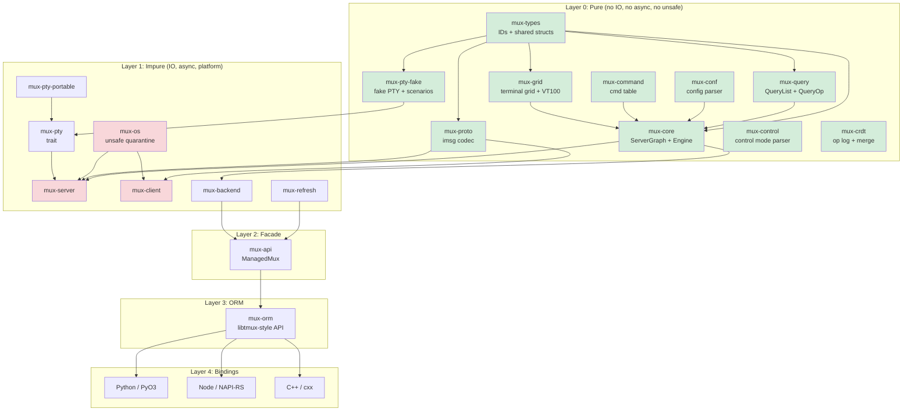

# TermForge: Definitive Architectural North Star (v4 Final Synthesis)

Date: 2026-02-10
Pass: 3 of 3 (Final synthesis of 6 model outputs across 3 passes)
License: MIT OR Apache-2.0
Rust edition: 2024 (MSRV 1.85)

---

## Grounding Statement

This document is the authoritative architectural reference for TermForge, a Rust terminal multiplexer. Everything below describes a **proposed** Rust workspace. The repository where this file lives (`/home/d/study/c/tmux`) is the upstream tmux C source tree. No Rust crates exist here yet. The existing Rust prototype lives at `~/work/rust/vibe-tmux/` and its `crates/mux-core/src/graph.rs` is the proven reference for entity storage patterns (Vec-inside-entity, reverse lookups computed during snapshot construction at lines 218-229). The tmux C files `input.c`, `format.c`, `window-copy.c`, `key-bindings.c`, `grid.c`, and `screen.c` are authoritative behavior references.

---

## Table of Contents

1. [Project Name and Identity](#1-project-name-and-identity)
2. [Vision and Philosophy](#2-vision-and-philosophy)
3. [North Star Acceptance Criteria](#3-north-star-acceptance-criteria)
4. [High-Level Architecture](#4-high-level-architecture)
5. [Workspace Layout](#5-workspace-layout)
6. [Layering Contract](#6-layering-contract)
7. [Entity Model](#7-entity-model)
8. [Event/Effect Engine](#8-eventeffect-engine)
9. [Protocol Codec](#9-protocol-codec)
10. [ORM-like Query API](#10-orm-like-query-api)
11. [Runtime Architecture](#11-runtime-architecture)
12. [Language Bindings](#12-language-bindings)
13. [CRDT Transaction Layer](#13-crdt-transaction-layer)
14. [tmux Version Management](#14-tmux-version-management)
15. [Test Support Crate](#15-test-support-crate)
16. [Fake PTY Backend](#16-fake-pty-backend)
17. [Binding Test Frameworks](#17-binding-test-frameworks)
18. [Test Framework and Harness Design](#18-test-framework-and-harness-design)
19. [Visual Client (TUI)](#19-visual-client-tui)
20. [DOs and DON'Ts](#20-dos-and-donts)
21. [AGENTS.md Template](#21-agentsmd-template)
22. [Phased Implementation Plan](#22-phased-implementation-plan)
23. [Risks and Mitigations](#23-risks-and-mitigations)
24. [Appendix A: Settled Decisions](#appendix-a-settled-decisions)
25. [Appendix B: VT100 Parser Design](#appendix-b-vt100-parser-design)
26. [Appendix C: Format String Engine](#appendix-c-format-string-engine)
27. [Appendix D: Key Binding System](#appendix-d-key-binding-system)
28. [Appendix E: Copy Mode](#appendix-e-copy-mode)

---

## 1. Project Name and Identity

**Name:** `termforge`

**Crate prefix:** `mux-*` (e.g., `mux-core`, `mux-proto`, `mux-grid`). The `mux-` prefix is retained for continuity with the proven vibe-tmux workspace, grep-friendliness, and established downstream tooling.

**Binary names:**

- `muxd` -- server daemon
- `mux` -- CLI client
- `mux-tui` -- visual TUI client (ratatui-based)

**Tagline:** "A deterministic multiplexer kernel with tmux wire-compatibility, ORM queries, and collaborative sessions."

**License:** MIT OR Apache-2.0 (dual)

---

## 2. Vision and Philosophy

### Core Thesis

TermForge is not a tmux port. It is a **new terminal multiplexer** that speaks tmux's binary protocol (`imsg` over Unix domain sockets). The internal architecture is Rust-native: algebraic types, ownership-tracked state, pure-functional kernel, and async runtime -- while maintaining bit-for-bit compatibility with the tmux wire format.

### Architectural Principles

1. **Pure/Impure Separation (Sans-IO):** The kernel (`mux-core`) is a pure `fn(graph, event) -> (graph, effects)` reducer. It never touches file descriptors, system calls, timers, or network. All IO happens in the runtime layer that interprets `Effect` variants.

2. **tmux is a Compatibility Profile, Not the Architecture:** tmux's `struct session`, `struct window`, `struct window_pane` inform our entity model but do not dictate it. Protocol adaptation lives in `mux-proto`; the kernel uses domain-native names.

3. **Snapshots are the Read Path:** The authoritative state lives in the `ServerGraph`. Readers (UI, bindings, query API) see immutable snapshots published via `ArcSwap`. Writers go through the event/effect engine. This eliminates read contention.

4. **ORM is a Facade, Not the Engine:** `mux-orm` translates user intent into commands/events. It never implements multiplexer logic. It must not become a second business-logic engine.

5. **Layered Testing:** Every layer has its own test strategy. Pure core uses property testing and snapshot testing. Protocol uses fixture-driven roundtrip tests. Runtime uses hermetic servers with fake PTYs.

6. **WASM as Purity Proof:** Layer 0 crates compile to `wasm32-unknown-unknown` as a CI gate, not a production deployment target. This catches accidental OS dependencies.

### Why Not a Direct Port

| Direct Port | TermForge |
|---|---|
| Platform code in the kernel | Platform code quarantined in `mux-os` |
| RB-tree state with manual memory | SlotMap with generation-checked IDs |
| Libevent callback soup | Structured async with tokio tasks |
| CRDTs require invasive surgery | CRDTs compose on top of pure events |
| Testing requires real PTY | Fake PTY backend for deterministic tests |

---

## 3. North Star Acceptance Criteria

### 3.1 Compatibility

| ID | Criterion | Verification |
|---|---|---|
| C1 | Real tmux 3.6+ client attaches to `muxd` | Integration test: `tmux attach -S <sock>` |
| C2 | `mux` client attaches to real tmux 3.6+ server | Integration test via `mux-client` |
| C3 | Protocol v8 imsg framing roundtrips all 35 `MsgType` variants | `proptest` with arbitrary payloads |
| C4 | Identify burst (13 message types) roundtrips correctly | Fixture captures from real tmux |
| C5 | SCM_RIGHTS fd passing preserved through sniff proxy | `tmux-sniff` passthrough test |
| C6 | Command semantics match tmux's 144+ `cmd_table` entries | `tmux-command-audit` parity checks |
| C7 | Format string expansion matches tmux for 200+ variables | `format-audit` parity corpus |
| C8 | Default key bindings match tmux across all 4 key tables | Key table parity tests |

### 3.2 Architectural

| ID | Criterion | Enforcement |
|---|---|---|
| A1 | Layer 0 crates: zero `unsafe`, zero `tokio`, zero `libc` | `#![forbid(unsafe_code)]` in crate root |
| A2 | Layer 0 compiles to `wasm32-unknown-unknown` | CI: `cargo check --target wasm32-unknown-unknown` |
| A3 | `mux-os` is the sole `unsafe` quarantine | CI lint: grep for `unsafe` outside `mux-os` |
| A4 | All state transitions are deterministic | Property: `apply_event(s, e)` is referentially transparent |
| A5 | No panics in protocol decode/encode paths | `#[deny(clippy::unwrap_used)]` in hot crates |
| A6 | Bindings depend only on `mux-api`/`mux-orm` | Cargo dependency check in CI |
| A7 | No `Arc<Mutex<_>>` in the read path | `ArcSwap`-based `StateHandle` |

### 3.3 Product

| ID | Criterion |
|---|---|
| P1 | In-process embedding: create session, split, send keys, read grid -- no process spawning |
| P2 | Python pytest fixture: `server` -> `session` -> `window` -> `pane` in 4 lines |
| P3 | Snapshot test: feed VT100 input, assert grid state via `insta` |
| P4 | CRDT: two servers merge concurrent `new-session` without conflict |
| P5 | TUI client attaches to real tmux server and renders correctly |
| P6 | FakePty scenario replay produces identical grid state to real tmux |

---

## 4. High-Level Architecture

### The Layer Cake

```
Layer 0  PURE KERNEL     mux-types, mux-core, mux-query, mux-conf,
                          mux-command, mux-grid, mux-control, mux-pty-fake
                          mux-crdt, mux-proto

Layer 1  IMPURE RUNTIME  mux-os, mux-pty, mux-pty-portable, mux-client,
                          mux-server, mux-refresh, mux-backend

Layer 2  FACADE           mux-api (ManagedMux, SocketActor, intents)

Layer 3  ORM              mux-orm (libtmux-style graph + QueryList sugar)

Layer 4  BINDINGS         bindings/python (PyO3), bindings/node (NAPI-RS),
                          crates/mux-cxx (cxx bridge)

Layer 5  TOOLS            tmux-sniff, tmux-vm, tmux-builder, tmux-worktrees,
                          mux-tui, mux-doctor, format-audit, regress-audit,
                          tmux-command-audit, mux-regress
```

### Mermaid Diagram



---

## 5. Workspace Layout

```
termforge/
  Cargo.toml                     # workspace root
  AGENTS.md                      # LLM development guide
  ARCHITECTURE.md                # living architecture doc (this file)
  rust-toolchain.toml
  justfile                       # build/test/audit entry points

  crates/
    -- LAYER 0: PURE (no IO, no async, no unsafe, no time) --
    mux-types/                   # Shared newtypes: SessionId, WindowId, PaneId, etc.
      src/
        lib.rs
        ids.rs                   # SlotMap key types
        size.rs                  # PaneSize, Rect, WindowSize, SplitDirection
        options.rs               # OptionScope, OptionValue
        errors.rs                # Shared error types
    mux-core/                    # Pure kernel: ServerGraph, Event, Effect, apply_event
      src/
        lib.rs
        graph.rs                 # ServerGraph (SlotMap-backed entity store)
        session.rs               # Session entity
        window.rs                # Window entity
        pane.rs                  # Pane entity + PaneMode
        client.rs                # Client entity + ClientKeyState
        job.rs                   # Job entity
        buffer.rs                # Buffer entity (paste buffers)
        event.rs                 # Event enum
        effect.rs                # Effect enum
        engine.rs                # apply_event() pure reducer
        context.rs               # ClientContext resolution
        state.rs                 # GraphState snapshots
        facade.rs                # ServerFacade (command string -> event)
        handle.rs                # GraphHandle (read-only accessor)
        layout.rs                # LayoutTree + tiling algorithms
        format.rs                # Format string expansion engine
        key_table.rs             # Key tables + bindings (pure model)
        copy_mode.rs             # Copy mode state machine
        environ.rs               # Environment variable store
        command/                 # Per-command handlers (pure)
          mod.rs
          new_session.rs
          new_window.rs
          split_window.rs
          select_pane.rs
          send_keys.rs
          set_option.rs
          display_message.rs
          ...                    # one file per tmux command (~80 files)
    mux-grid/                    # Terminal grid + VT100 state machine
      src/
        lib.rs
        grid.rs                  # Grid (row/column cell storage)
        cell.rs                  # Cell (character + style attributes)
        row.rs                   # Row (line storage, wrapping)
        cursor.rs                # Cursor state
        style.rs                 # Style attributes (fg, bg, attrs)
        parser.rs                # VT100 table-driven state machine
        parser_tables.rs         # State transition tables (from input.c)
        csi.rs                   # CSI command dispatch (39 commands)
        osc.rs                   # OSC command dispatch
        sgr.rs                   # SGR (Select Graphic Rendition)
        esc.rs                   # ESC sequence dispatch
        scrollback.rs            # Scrollback buffer management
        hyperlinks.rs            # OSC 8 hyperlink tracking
        snapshot.rs              # Grid snapshot for insta testing
    mux-query/                   # QueryList, QueryOp, Queryable derive
      src/
        lib.rs
        ops.rs                   # QueryOp enum
        value.rs                 # QueryValue
        spec.rs                  # QuerySpec, QueryTerm
        list.rs                  # QueryList<T: Queryable>
    mux-conf/                    # tmux.conf parser (PURE -- no file IO)
      src/
        lib.rs
        ast.rs                   # Config AST nodes
        lexer.rs                 # Tokenizer
        parser.rs                # Config file parser
        options.rs               # Option table + defaults
    mux-command/                 # Command table + dispatch
      src/
        lib.rs
        table.rs                 # Command table (from tmux cmd.c)
    mux-control/                 # Control mode parser (%output, %begin, etc.)
      src/
        lib.rs
        notification.rs          # ControlNotification enum
        parser.rs                # %%notification line parser
    mux-proto/                   # imsg framing + MsgType + payload parsers
      src/
        lib.rs
        frame.rs                 # ImsgHdr (16-byte header)
        msg.rs                   # MsgType enum (35 variants)
        codec.rs                 # ImsgCodec (two-phase decode)
        payload.rs               # Typed payload structs
        identify.rs              # IdentifyBurst builder
        fixture.rs               # Capture file loading
        error.rs                 # ProtocolError
    mux-crdt/                    # CrdtOp, HLC, merge semantics
      src/
        lib.rs
        op.rs                    # CrdtOp enum
        clock.rs                 # HybridLogicalClock
        merge.rs                 # Merge resolution
    mux-pty/                     # PtyBackend trait (pure interface)
      src/lib.rs
    mux-pty-fake/                # FakePty + ScenarioRecorder/Replayer (PURE)
      src/
        lib.rs
        scenario.rs              # PtyScenario, ScenarioEvent
        recorder.rs              # ScenarioRecorder<B: PtyBackend>
        replayer.rs              # ScenarioReplayer

    -- LAYER 1: IMPURE (IO, async, platform) --
    mux-os/                      # unsafe quarantine: SCM_RIGHTS, signals
      SAFETY.md
      src/
        lib.rs
        pty.rs                   # PTY creation + management
        scm_rights.rs            # SCM_RIGHTS FD passing
        socket.rs                # Unix socket creation
        signal.rs                # Signal handling
        fd.rs                    # FD lifecycle + close-on-drop
    mux-pty-portable/            # portable-pty based backend
    mux-server/                  # tokio runtime, socket accept loop
    mux-client/                  # client connection, control mode
    mux-backend/                 # Backend trait: Local + Tmux
    mux-refresh/                 # StateStore + ArcSwap + RefreshPlanner
    mux-test-support/            # TmuxTestServer, PathGuard, hermetic isolation
    mux-view/                    # Immutable view types for snapshots

    -- LAYER 2: FACADE --
    mux-api/                     # ManagedMux, MuxBackend, intent API

    -- LAYER 3: ORM --
    mux-orm/                     # libtmux-style graph traversal + QueryList
      src/
        lib.rs
        server.rs                # OrmServer
        session.rs               # OrmSession
        window.rs                # OrmWindow
        pane.rs                  # OrmPane

    -- SUPPORT --
    mux-cxx/                     # cxx bridge
    mux-telemetry/               # tracing span context

  tools/
    tmux-sniff/                  # Protocol sniffer (preserves SCM_RIGHTS)
    tmux-vm/                     # tmux version manager (ensure/exec)
    tmux-builder/                # Build tmux from source
    tmux-worktrees/              # Git worktree manager for tmux source
    tmux-command-audit/          # Command coverage tracker
    format-audit/                # Format variable alignment checker
    regress-audit/               # Run tmux regress suite
    mux-regress/                 # Parity harness (both servers)
    mux-tui/                     # Rust-native TUI client
    mux-doctor/                  # Diagnostic tool

  bindings/
    python/
      Cargo.toml
      pyproject.toml             # maturin + uv
      src/lib.rs
      python/termforge/
        __init__.py
        _native.pyi
        pytest_plugin.py         # hermetic pytest fixtures
      tests/
        conftest.py
        test_server.py
        test_query.py
    node/
      Cargo.toml
      package.json               # pnpm
      src/lib.rs
      __test__/
        server.spec.ts           # vitest tests
      vitest.config.ts

  fixtures/
    captures/                    # Binary protocol captures from real tmux
    grids/                       # Terminal grid snapshots for insta
    configs/                     # tmux.conf samples
    scenarios/                   # FakePty scenario recordings (JSON)

  fuzz/
    decode_frame.rs              # Protocol decoder fuzz target
    parse_vt100.rs               # VT100 parser fuzz target
    parse_format.rs              # Format string parser fuzz target
```

### Purity Classification

| Crate | Pure | Async | Unsafe | WASM CI |
|---|---|---|---|---|
| mux-types | Yes | No | No | Yes |
| mux-core | Yes | No | No | Yes |
| mux-grid | Yes | No | No | Yes |
| mux-query | Yes | No | No | Yes |
| mux-conf | Yes | No | No | Yes |
| mux-command | Yes | No | No | Yes |
| mux-proto | Yes | No | No | Yes |
| mux-control | Yes | No | No | Yes |
| mux-pty-fake | Yes | No | No | Yes |
| mux-crdt | Yes | No | No | Yes |
| mux-pty | Trait only | No | No | No |
| mux-os | No | No | **Yes** | No |
| mux-server | No | Yes | No | No |
| mux-client | No | Yes | No | No |
| mux-backend | No | Yes | No | No |
| mux-refresh | No | Yes | No | No |
| mux-api | No | Yes | No | No |
| mux-orm | No | Yes | No | No |

---

## 6. Layering Contract

### Hard Boundaries

**Boundary A -- Core is Deterministic:**

The core never asks the operating system for anything. No `SystemTime::now()`, no `std::fs`, no `rand()`, no `std::thread`. If the core needs a timestamp, it receives one via an `Event` variant. If it needs randomness, it receives a seed via `CoreCtx`.

```rust
// WRONG -- core asking the OS
pub fn create_session(graph: &mut ServerGraph) -> SessionId {
    let name = format!("session-{}", SystemTime::now().elapsed().unwrap().as_secs());
    graph.create_session(name)
}

// RIGHT -- core receiving information via events
pub fn apply_event(graph: &mut ServerGraph, event: Event, ctx: &CoreCtx) -> ApplyOutcome {
    match event {
        Event::CreateSession { name, created_at } => {
            let id = graph.create_session(name);
            ApplyOutcome { created_session: Some(id), ..Default::default() }
        }
        // ...
    }
}
```

**Boundary B -- Snapshots are the Read Path:**

The `ServerGraph` is mutated only through `apply_event()`. After mutation, the runtime publishes a `GraphState` snapshot through `ArcSwap`. All readers read from the snapshot, never from the mutable graph.

```rust
// crates/mux-refresh/src/lib.rs
pub struct StateStore<T> {
    inner: Arc<ArcSwap<T>>,
}

pub struct StateHandle<T> {
    inner: Arc<ArcSwap<T>>,
}

impl<T> StateHandle<T> {
    /// Lock-free read via ArcSwap::load()
    pub fn with_read<R>(&self, f: impl FnOnce(&T) -> R) -> R {
        let guard = self.inner.load();
        f(&guard)
    }
}
```

**Boundary C -- tmux Compatibility is an Adapter:**

The core uses domain-native names. tmux protocol specifics (`MsgType::IdentifyFlags`, imsg framing) live entirely in `mux-proto`. The server runtime translates between the two:

```rust
// mux-server: translates protocol frame -> core event
fn translate_command(frame: &ImsgFrame) -> Result<Event, ProtocolError> {
    let args = parse_command_args(&frame.payload)?;
    Ok(Event::Command { name: args[0].clone(), args: args[1..].to_vec() })
}
```

**Boundary D -- ORM API is a Facade:**

The ORM translates intent into commands. It never implements window splitting, session creation, or layout algorithms.

### Enforcement

| Rule | Mechanism |
|---|---|
| Pure crates: no `tokio`, `async`, `unsafe` | `#![forbid(unsafe_code)]` + CI WASM check |
| One-way deps: bindings -> orm -> api -> backend -> core | `cargo deny check` |
| No `Arc<Mutex>` on read path | Code review + clippy config |
| No panics in protocol/server | `#[deny(clippy::unwrap_used, clippy::expect_used)]` |
| `unsafe` only in `mux-os` | CI: `grep -r "unsafe" --include="*.rs" crates/ \| grep -v mux-os` |

---

## 7. Entity Model

### 7.1 Typed ID Declarations (mux-types)

```rust
// crates/mux-types/src/ids.rs
use slotmap::new_key_type;

new_key_type! {
    /// Unique identifier for a session within the server.
    /// Generation-checked: stale IDs safely return None on lookup.
    pub struct SessionId;
    pub struct WindowId;
    pub struct PaneId;
    pub struct ClientId;
    pub struct JobId;
    pub struct BufferId;
}
```

```rust
// crates/mux-types/src/size.rs
#[derive(Debug, Clone, Copy, PartialEq, Eq, Hash)]
pub struct PaneSize {
    pub cols: u16,
    pub rows: u16,
}

impl PaneSize {
    pub const DEFAULT: Self = Self { cols: 80, rows: 24 };
}

#[derive(Debug, Clone, Copy, PartialEq, Eq)]
pub struct Rect {
    pub x: u16,
    pub y: u16,
    pub width: u16,
    pub height: u16,
}

#[derive(Debug, Clone, Copy, PartialEq, Eq)]
pub enum SplitDirection {
    Horizontal,
    Vertical,
}
```

### 7.2 Entity Structs (mux-core)

**Decision (settled): Vec inside entities for parent-child relationships.** Reverse lookups computed during snapshot construction. This matches the proven vibe-tmux code at `~/work/rust/vibe-tmux/crates/mux-core/src/graph.rs` where `session.windows: Vec<WindowId>` and reverse maps are built in `graph_state()` at lines 218-229.

```rust
/// crates/mux-core/src/session.rs
#[derive(Debug, Clone)]
pub struct Session {
    pub name: String,
    pub cwd: String,
    pub windows: Vec<WindowId>,           // ordered child list (forward only)
    pub active_window: Option<WindowId>,
    pub last_window: Option<WindowId>,
    pub created_at: i64,                  // injected via Event, not from OS
    pub last_attached_at: i64,
    pub destroying: bool,
    pub options: SessionOptions,
    pub environ: EnvironMap,
}

/// crates/mux-core/src/window.rs
#[derive(Debug, Clone)]
pub struct Window {
    pub name: String,
    pub panes: Vec<PaneId>,              // ordered child list (forward only)
    pub active_pane: Option<PaneId>,
    pub last_active_pane: Option<PaneId>,
    pub layout_root: LayoutTree,
    pub size: WindowSize,
    pub flags: WindowFlags,
    pub options: WindowOptions,
}

/// crates/mux-core/src/pane.rs
#[derive(Debug, Clone)]
pub struct Pane {
    pub size: PaneSize,
    pub bounds: Option<Rect>,
    pub exited: bool,
    pub exit_status: Option<i32>,
    pub start_command: String,
    pub start_path: String,
    pub mode: PaneMode,
    pub title: String,
    pub grid: Arc<Grid>,                 // shared; copy-on-write via Arc::make_mut
    pub parser: Parser,                  // VT100 state machine
    pub copy_mode: Option<CopyModeState>,
}

#[derive(Debug, Clone, Copy, PartialEq, Eq)]
pub enum PaneMode {
    Normal,
    CopyMode,
    ViewMode,
}

/// crates/mux-core/src/client.rs
#[derive(Debug, Clone)]
pub struct Client {
    pub name: String,
    pub session: Option<SessionId>,
    pub last_session: Option<SessionId>,
    pub tty_name: String,
    pub term_type: String,
    pub features: u32,
    pub flags: ClientFlags,
    pub size: PaneSize,
    pub key_state: ClientKeyState,       // key table dispatch state
}

/// crates/mux-core/src/buffer.rs
#[derive(Debug, Clone)]
pub struct Buffer {
    pub name: String,
    pub data: Vec<u8>,
    pub created_at: i64,
}
```

### 7.3 The ServerGraph

```rust
// crates/mux-core/src/graph.rs
use slotmap::SlotMap;

#[derive(Debug, Default, Clone)]
pub struct ServerGraph {
    sessions: SlotMap<SessionId, Session>,
    windows:  SlotMap<WindowId, Window>,
    panes:    SlotMap<PaneId, Pane>,
    clients:  SlotMap<ClientId, Client>,
    jobs:     SlotMap<JobId, Job>,
    buffers:  SlotMap<BufferId, Buffer>,
    key_tables: KeyTableSet,
    global_options: GlobalOptions,
    global_environ: EnvironMap,
}

impl ServerGraph {
    pub fn new() -> Self { Self::default() }

    // --- Creation ---
    pub fn create_session(&mut self, name: impl Into<String>) -> SessionId;
    pub fn create_window(&mut self, name: impl Into<String>) -> WindowId;
    pub fn create_pane(&mut self, size: PaneSize) -> PaneId;
    pub fn create_client(&mut self, name: impl Into<String>) -> ClientId;
    pub fn create_buffer(&mut self, name: impl Into<String>, data: Vec<u8>) -> BufferId;

    // --- Lookup (O(1), generation-checked) ---
    pub fn session(&self, id: SessionId) -> Option<&Session>;
    pub fn session_mut(&mut self, id: SessionId) -> Option<&mut Session>;
    pub fn window(&self, id: WindowId) -> Option<&Window>;
    pub fn window_mut(&mut self, id: WindowId) -> Option<&mut Window>;
    pub fn pane(&self, id: PaneId) -> Option<&Pane>;
    pub fn pane_mut(&mut self, id: PaneId) -> Option<&mut Pane>;
    pub fn client(&self, id: ClientId) -> Option<&Client>;
    pub fn client_mut(&mut self, id: ClientId) -> Option<&mut Client>;

    // --- Relationship management ---
    pub fn add_window_to_session(&mut self, session: SessionId, window: WindowId) -> bool;
    pub fn add_pane_to_window(&mut self, window: WindowId, pane: PaneId) -> bool;
    pub fn attach_client(&mut self, client: ClientId, session: SessionId) -> bool;

    // --- Context resolution ---
    pub fn client_context(&self, client: ClientId) -> ClientContext;

    // --- Snapshot (reverse lookups computed here) ---
    pub fn graph_state(&self) -> GraphState {
        // Build reverse maps from forward references
        let mut window_to_session = HashMap::new();
        for (session_id, session) in &self.sessions {
            for window_id in &session.windows {
                window_to_session.insert(*window_id, session_id);
            }
        }
        let mut pane_to_window = HashMap::new();
        for (window_id, window) in &self.windows {
            for pane_id in &window.panes {
                pane_to_window.insert(*pane_id, window_id);
            }
        }
        // ... build GraphState with reverse lookups included
        todo!()
    }
}
```

### 7.4 Relationship Model

```
Server (implicit singleton)
  |-- sessions: SlotMap<SessionId, Session>
  |     |-- windows: Vec<WindowId>  (ordered, forward-only)
  |     |-- active_window: Option<WindowId>
  |     |-- last_window: Option<WindowId>
  |
  |-- windows: SlotMap<WindowId, Window>
  |     |-- panes: Vec<PaneId>  (ordered, forward-only)
  |     |-- active_pane: Option<PaneId>
  |     |-- layout_root: LayoutTree
  |
  |-- panes: SlotMap<PaneId, Pane>
  |     |-- grid: Arc<Grid>  (terminal state, COW for snapshots)
  |     |-- parser: Parser  (VT100 state machine)
  |     |-- copy_mode: Option<CopyModeState>
  |
  |-- clients: SlotMap<ClientId, Client>
  |     |-- session: Option<SessionId>  (attached session)
  |     |-- key_state: ClientKeyState  (key table stack)
  |
  |-- key_tables: KeyTableSet  (prefix, root, copy-mode, copy-mode-vi)
  |-- buffers: SlotMap<BufferId, Buffer>  (paste buffers)
  |-- jobs: SlotMap<JobId, Job>
```

---

## 8. Event/Effect Engine

### Core Signature

```rust
/// crates/mux-core/src/engine.rs
///
/// Apply an event to the graph, returning effects for the runtime to execute.
/// This is the heart of the Sans-IO architecture:
/// - Pure: no IO, no async, no randomness
/// - Deterministic: same (graph, event, ctx) always produces same (graph', effects)
/// - Total: every Event variant is handled
pub fn apply_event(
    graph: &mut ServerGraph,
    event: Event,
    ctx: &CoreCtx,
) -> ApplyOutcome {
    match event {
        Event::CreateSession { .. } => { /* ... */ }
        Event::Key { .. } => { /* key dispatch via key tables */ }
        Event::CopyModeAction { pane_id, action } => {
            apply_copy_mode_event(graph, pane_id, action)
        }
        Event::PaneOutput { pane_id, data } => {
            apply_pane_output(graph, pane_id, &data)
        }
        // ... exhaustive match
    }
}

/// Determinism controls: explicit injection for time and randomness.
#[derive(Clone, Copy, Debug)]
pub struct CoreCtx {
    pub now_ms: u64,
    pub rand_u64: u64,
}

#[derive(Debug, Default, Clone)]
pub struct ApplyOutcome {
    pub effects: Vec<Effect>,
    pub created_session: Option<SessionId>,
    pub created_window: Option<WindowId>,
    pub created_pane: Option<PaneId>,
    pub error: Option<CoreError>,
}

impl ApplyOutcome {
    pub fn with_effects(effects: Vec<Effect>) -> Self {
        Self { effects, ..Default::default() }
    }
}
```

### Event Enum

```rust
/// crates/mux-core/src/event.rs
#[derive(Debug, Clone)]
#[non_exhaustive]
pub enum Event {
    // === Lifecycle ===
    CreateSession { name: String, cwd: Option<String>, created_at: i64 },
    DestroySession { session_id: SessionId },
    CreateWindow { session_id: SessionId, name: String },
    DestroyWindow { window_id: WindowId },
    CreatePane { window_id: WindowId, size: PaneSize, command: Vec<String>, cwd: Option<String> },
    DestroyPane { pane_id: PaneId },

    // === Navigation ===
    SelectWindow { session_id: SessionId, window_id: WindowId },
    SelectWindowByIndex { session_id: SessionId, index: usize },
    NextWindow { session_id: SessionId },
    PreviousWindow { session_id: SessionId },
    SelectLastWindow { session_id: SessionId },
    SelectPane { window_id: WindowId, pane_id: PaneId },
    SelectNextPane { window_id: WindowId },
    SelectPrevPane { window_id: WindowId },
    SelectLastPane { window_id: WindowId },

    // === Mutation ===
    RenameSession { session_id: SessionId, name: String },
    RenameWindow { window_id: WindowId, name: String },
    ResizePane { pane_id: PaneId, size: PaneSize },
    SplitWindow { window_id: WindowId, direction: SplitDirection, size: PaneSize,
                  command: Vec<String>, cwd: Option<String> },

    // === Client ===
    ClientAttach { client_id: ClientId, session_id: SessionId },
    ClientDetach { client_id: ClientId },
    ClientResize { client_id: ClientId, size: PaneSize },

    // === IO Responses (runtime -> core) ===
    PaneExited { pane_id: PaneId, exit_status: i32 },
    PaneOutput { pane_id: PaneId, data: Vec<u8> },
    JobExited { job_id: JobId, exit_status: i32 },

    // === Input ===
    Key { client_id: ClientId, key: KeyCode },
    Command { name: String, args: Vec<String>, client_id: Option<ClientId> },

    // === Copy Mode ===
    EnterCopyMode { pane_id: PaneId, view_mode: bool },
    CopyModeAction { pane_id: PaneId, action: CopyModeAction },

    // === Options ===
    SetOption { scope: OptionScope, key: String, value: OptionValue },

    // === Paste Buffers ===
    SetBuffer { name: String, data: Vec<u8> },
    PasteBuffer { pane_id: PaneId, buffer_name: Option<String> },

    // === Time (injected by runtime) ===
    Tick { now_millis: i64 },
}
```

### Effect Enum

```rust
/// crates/mux-core/src/effect.rs
#[derive(Debug, Clone)]
#[non_exhaustive]
pub enum Effect {
    // === PTY ===
    SpawnPane { pane_id: PaneId, command: Vec<String>, cwd: Option<String>, size: PaneSize },
    KillPane { pane_id: PaneId, signal: i32 },
    WritePane { pane_id: PaneId, data: Vec<u8> },
    ResizePty { pane_id: PaneId, size: PaneSize },

    // === Display ===
    Redraw { scope: RedrawScope },

    // === Client ===
    NotifyClient { client_id: ClientId, message: String },
    SendToClient { client_id: ClientId, frame: FrameData },
    DisconnectClient { client_id: ClientId },

    // === Timers ===
    StartTimer { token: TimerToken, after_ms: u64 },
    CancelTimer { token: TimerToken },

    // === Job ===
    StartJob { job_id: JobId, command: Vec<String> },
    StopJob { job_id: JobId },

    // === Server ===
    Shutdown,
    PublishSnapshot,
    Log { level: LogLevel, message: String },
}

#[derive(Debug, Clone)]
pub enum RedrawScope {
    All,
    Session(SessionId),
    Window(WindowId),
    Pane(PaneId),
    StatusLine,
}
```

### PaneOutput Handling (VT100 -> Grid)

```rust
fn apply_pane_output(graph: &mut ServerGraph, pane_id: PaneId, data: &[u8]) -> ApplyOutcome {
    let Some(pane) = graph.pane_mut(pane_id) else {
        return ApplyOutcome::default();
    };

    // Get a mutable reference to the grid (Arc::make_mut for COW)
    let grid = Arc::make_mut(&mut pane.grid);

    // Parse VT100 sequences and update the grid (pure)
    let parser_effects = pane.parser.parse(data, grid);

    // Convert parser effects to engine effects
    let mut effects = vec![Effect::Redraw { scope: RedrawScope::Pane(pane_id) }];
    for pe in parser_effects {
        match pe {
            ParserEffect::Reply(bytes) => {
                effects.push(Effect::WritePane { pane_id, data: bytes });
            }
            ParserEffect::TitleChanged(title) => {
                pane.title = title;
                effects.push(Effect::Redraw { scope: RedrawScope::StatusLine });
            }
            ParserEffect::Bell => {
                effects.push(Effect::Redraw { scope: RedrawScope::StatusLine });
            }
            _ => {}
        }
    }

    ApplyOutcome::with_effects(effects)
}
```

### Property Test Example

```rust
#[cfg(test)]
mod property_tests {
    use super::*;
    use proptest::prelude::*;

    fn arb_session_name() -> impl Strategy<Value = String> {
        "[a-z][a-z0-9-]{0,20}".prop_filter("non-empty", |s| !s.is_empty())
    }

    proptest! {
        /// Applying the same event sequence to two fresh graphs produces identical state.
        #[test]
        fn engine_is_deterministic(
            names in prop::collection::vec(arb_session_name(), 1..10)
        ) {
            let ctx = CoreCtx { now_ms: 0, rand_u64: 0 };
            let events: Vec<_> = names.iter().map(|n| Event::CreateSession {
                name: n.clone(), cwd: None, created_at: 0,
            }).collect();

            let mut g1 = ServerGraph::new();
            let mut g2 = ServerGraph::new();

            for event in &events {
                let _ = apply_event(&mut g1, event.clone(), &ctx);
                let _ = apply_event(&mut g2, event.clone(), &ctx);
            }

            prop_assert_eq!(g1.graph_state(), g2.graph_state());
        }
    }
}
```

---

## 9. Protocol Codec

### Wire Format

tmux uses OpenBSD's imsg framing. Every message is:

```
+----------+----------+----------+----------+------------+
|  type    |   len    |  peerid  |   pid    |  payload   |
|  (u32)   |  (u32)   |  (u32)   |  (u32)   |  (var)     |
+----------+----------+----------+----------+------------+
    4          4          4          4       0..16368 bytes
```

All fields are **native endianness** (client and server always on same machine). `len` includes the 16-byte header. High bit (`0x8000_0000`) of `len` is `IMSG_FD_FLAG`.

### ImsgHdr

```rust
// crates/mux-proto/src/frame.rs
pub const IMSG_HEADER_SIZE: usize = 16;
pub const IMSG_FD_FLAG: u32 = 0x8000_0000;

#[derive(Debug, Clone, Copy, PartialEq, Eq)]
pub struct ImsgHdr {
    pub msg_type: u32,
    pub len: u32,        // actual length (FD flag masked off)
    pub peerid: u32,
    pub pid: u32,
    pub has_fd: bool,
}

impl ImsgHdr {
    pub fn decode<B: Buf>(buf: &mut B) -> Result<Self, ProtocolError>;
    pub fn encode<B: BufMut>(&self, buf: &mut B);
    pub const fn payload_len(&self) -> u32 { self.len - IMSG_HEADER_SIZE as u32 }
}
```

### Two-Phase Codec

```rust
// crates/mux-proto/src/codec.rs
pub struct ImsgCodec {
    pending_header: Option<ImsgHdr>,
}

impl Decoder for ImsgCodec {
    type Item = ImsgFrame;
    type Error = io::Error;

    fn decode(&mut self, src: &mut BytesMut) -> Result<Option<ImsgFrame>, io::Error> {
        // Phase 1: decode header (16 bytes)
        let header = match self.pending_header.take() {
            Some(h) => h,
            None => {
                if src.len() < IMSG_HEADER_SIZE { return Ok(None); }
                let header_bytes = src.split_to(IMSG_HEADER_SIZE);
                ImsgHdr::decode(&mut &header_bytes[..])?
            }
        };

        // Phase 2: decode payload
        let payload_len = header.payload_len() as usize;
        if src.len() < payload_len {
            self.pending_header = Some(header);
            return Ok(None);
        }

        let payload = src.split_to(payload_len);
        Ok(Some(ImsgFrame { header, payload }))
    }
}
```

### MsgType Enum (35 variants)

```rust
#[derive(Debug, Clone, Copy, PartialEq, Eq, Hash)]
#[repr(u32)]
pub enum MsgType {
    Version = 12,
    // Identify burst (100-112)
    IdentifyFlags = 100,
    IdentifyTerm = 101,
    IdentifyTtyname = 102,
    IdentifyOldcwd = 103,
    IdentifyStdin = 104,       // has_fd = true
    IdentifyEnviron = 105,     // repeatable
    IdentifyDone = 106,
    IdentifyClientpid = 107,
    IdentifyCwd = 108,
    IdentifyFeatures = 109,
    IdentifyStdout = 110,      // has_fd = true
    IdentifyLongflags = 111,
    IdentifyTerminfo = 112,    // repeatable
    // Commands and responses (200-218)
    Command = 200,
    Detach = 201,
    // ... through Flags = 218
    // File I/O (300-307)
    ReadOpen = 300,
    // ... through ReadCancel = 307
}
```

### Fixture Testing

```rust
#[test]
fn roundtrip_identify_burst_from_real_tmux() {
    let records = read_capture(Path::new("fixtures/captures/identify-burst-3.6a.bin"))
        .expect("fixture load");
    let mut codec = ImsgCodec::new();

    for record in &records {
        let mut buf = BytesMut::from(&record.raw_bytes[..]);
        let frame = codec.decode(&mut buf).expect("decode").expect("frame");

        // Re-encode and verify byte-for-byte match
        let mut re_encoded = BytesMut::new();
        codec.encode(frame.clone(), &mut re_encoded).expect("encode");
        assert_eq!(re_encoded.as_ref(), record.raw_bytes.as_slice());
    }
}
```

### Fuzz Target

```rust
// fuzz/decode_frame.rs
#![no_main]
use libfuzzer_sys::fuzz_target;
use bytes::BytesMut;
use mux_proto::ImsgCodec;
use tokio_util::codec::Decoder;

fuzz_target!(|data: &[u8]| {
    let mut codec = ImsgCodec::new();
    let mut buf = BytesMut::from(data);
    let _ = codec.decode(&mut buf); // must not panic
});
```

---

## 10. ORM-like Query API

### Architecture

```
mux-types   (IDs, shared structs)
    |
mux-query   (QueryList, QueryOp, Queryable trait)  -- PURE
    |
mux-core    (ServerGraph, engine)
    |
mux-api     (ManagedMux, StateHandle, intents)
    |
mux-orm     (OrmServer, OrmSession, OrmWindow, OrmPane)
    |
bindings    (Python, Node, C++)
```

### QueryOp and QueryList (pure, in mux-query)

```rust
// crates/mux-query/src/ops.rs
#[derive(Debug, Clone, PartialEq, Eq)]
pub enum QueryOp {
    Exact, Contains, IContains, StartsWith, IStartsWith,
    EndsWith, IEndsWith, Regex, In, Gt, Gte, Lt, Lte,
    IsNone, IsSome,
}

#[derive(Debug, Clone)]
pub enum QueryValue {
    String(String), Int(i64), Bool(bool),
    StringList(Vec<String>), Regex(String), None,
}

#[derive(Debug, Clone)]
pub struct QuerySpec {
    pub field: String,
    pub op: QueryOp,
    pub value: QueryValue,
}
```

```rust
// crates/mux-query/src/list.rs
pub struct QueryList<T> {
    items: Vec<T>,
}

impl<T: Queryable> QueryList<T> {
    pub fn filter(&self, specs: &[QuerySpec]) -> Self { /* AND semantics */ todo!() }
    pub fn get(&self, specs: &[QuerySpec]) -> Result<&T, QueryError> { /* exactly one */ todo!() }
    pub fn first(&self) -> Option<&T> { self.items.first() }
    pub fn len(&self) -> usize { self.items.len() }
    pub fn is_empty(&self) -> bool { self.items.is_empty() }
}
```

### ORM Wrapper (mux-orm)

```rust
// crates/mux-orm/src/server.rs
pub struct OrmServer {
    api: ManagedMux,
}

impl OrmServer {
    pub fn sessions(&self) -> QueryList<OrmSession> {
        let snapshot = self.api.snapshot();
        QueryList::new(
            snapshot.sessions.iter()
                .map(|s| OrmSession::from_snapshot(s, &self.api))
                .collect()
        )
    }

    pub fn cmd(&self, cmd: &str) -> Result<String, OrmError> {
        self.api.cmd(cmd)
    }
}

// Usage:
// let server = OrmServer::connect_tmux(socket_path)?;
// let session = server.sessions().filter(&[q("name").exact("work")]).get()?;
// session.windows().first().unwrap().panes().first().unwrap().send_keys("cargo test\n")?;
```

---

## 11. Runtime Architecture

### Thread Model

```
+--------------------+     +-------------------+
|  Accept Thread     |     |  PTY Reader Pool  |
|  (tokio task)      |     |  (1 task/pane)    |
|  UnixListener      |     |  reads PTY fd     |
+--------+-----------+     +--------+----------+
         |                          |
         | new client conn          | PaneOutput events
         v                          v
+---------------------------------------------------+
|              State Actor (single task)              |
|                                                     |
|  loop {                                             |
|      event = recv(event_rx);                        |
|      outcome = apply_event(&mut graph, event, &ctx);|
|      for effect in outcome.effects {                |
|          dispatch_effect(effect, &tx_pool);          |
|      }                                              |
|      publish_snapshot(&graph, &state_store);         |
|  }                                                  |
+---------------------------------------------------+
```

### State Actor

```rust
// crates/mux-server/src/state.rs
pub struct StateActor {
    graph: ServerGraph,
    state_store: StateStore<GraphState>,
    event_rx: mpsc::Receiver<Event>,
    effect_tx: mpsc::Sender<Effect>,
}

impl StateActor {
    pub async fn run(mut self) {
        while let Some(event) = self.event_rx.recv().await {
            let ctx = CoreCtx {
                now_ms: now_millis(),
                rand_u64: rand::random(),
            };
            let outcome = apply_event(&mut self.graph, event, &ctx);
            for effect in outcome.effects {
                let _ = self.effect_tx.send(effect).await;
            }
            self.state_store.publish(self.graph.graph_state());
        }
    }
}
```

---

## 12. Language Bindings

### Thin Wrapper Philosophy

Bindings expose:
1. Object graph traversal: `Server.sessions`, `Session.windows`, `Window.panes`
2. Command execution: `server.cmd("new-session -d -s work")`
3. Query API: `server.sessions.filter(name__startswith="wo")`
4. Lifecycle management: `ManagedMux`, refresh subscriptions

Bindings depend on `mux-orm` (which depends on `mux-api`), never runtime internals.

### Python (PyO3 + maturin)

```rust
#[pyclass(name = "Server")]
struct PyServer {
    inner: OrmServer,
}

#[pymethods]
impl PyServer {
    #[new]
    fn new(socket_name: Option<&str>, socket_path: Option<&str>) -> PyResult<Self> {
        todo!()
    }
    fn cmd(&self, cmd: &str) -> PyResult<String> {
        self.inner.cmd(cmd).map_err(|e| PyErr::new::<pyo3::exceptions::PyRuntimeError, _>(e.to_string()))
    }
    #[getter]
    fn sessions(&self) -> PyResult<Vec<PySession>> { todo!() }
}
```

### Node (NAPI-RS) and C++ (cxx)

Same thin wrapper pattern over `mux-orm`. No business logic in foreign languages.

---

## 13. CRDT Transaction Layer

### Scope (settled)

CRDT is applied to a **subset** of state first:

**Replicable first:**
1. Paste buffers
2. Options/config key-value maps
3. Session/window/pane metadata and layout intents

**Not replicated first:**
1. Raw PTY stream output
2. Per-client ephemeral UI state (cursor shape, focus, render timing)

### Key Types

```rust
// crates/mux-crdt/src/clock.rs
pub struct HybridTimestamp {
    pub millis: u64,
    pub counter: u32,
    pub node_id: NodeId,
}

// crates/mux-crdt/src/op.rs
pub enum CrdtOp {
    SetOption { scope: Scope, key: String, value: String, ts: HybridTimestamp },
    BufferPut { buffer: BufferId, bytes: Vec<u8>, ts: HybridTimestamp },
    EntityCreate { kind: EntityKind, id: u64, ts: HybridTimestamp },
    EntityDelete { kind: EntityKind, id: u64, ts: HybridTimestamp },
}
```

### Merge: Last-Writer-Wins by default, with kill-wins-over-write for topology conflicts.

Property tests: convergence for commutative op sets, idempotence (apply same op twice).

---

## 14. tmux Version Management

### tmux-vm

```
tmux-vm ensure 3.6a          # ensure 3.6a is built
tmux-vm exec 3.6a -- ls      # run `tmux ls` using tmux 3.6a
tmux-vm list                  # list installed versions
tmux-vm path 3.6a            # print path to binary
```

### tmux-builder

Builds tmux from source at any git ref. Manages `./configure && make` with local dependency handling.

### tmux-worktrees

Creates git worktrees from the tmux repository for fast version switching.

### Parity Runner (mux-regress)

1. Build tmux versions into isolated prefixes.
2. Run the same scenario against tmux and TermForge.
3. Collect and diff format outputs, protocol traces, and grid snapshots.

---

## 15. Test Support Crate

### TmuxTestServer

Spawns a real tmux server on an isolated socket in a temp directory. Kills server on drop.

### MuxServerTestServer

In-process server using `ServerGraph` + `FakePtyBackend` for fully deterministic tests.

### PathGuard

RAII guard creating a temp directory, removed on drop. Rejects dangerous paths.

### Hermetic Isolation Rules

1. Every test server gets a unique socket path in a temp directory.
2. Tests clear `TMUX`, `TMUX_TMPDIR`, `TMUX_PANE`.
3. Tests using `FakePtyBackend` never allocate real PTYs.
4. `PathGuard::drop()` ensures cleanup even on panic.
5. Tests are safe to run in parallel (`cargo test -j N`).

---

## 16. Fake PTY Backend

### PtyBackend Trait

```rust
// crates/mux-pty/src/lib.rs
pub trait PtyBackend: Send {
    fn spawn(&mut self, pane_id: PaneId, command: &[String],
             cwd: Option<&str>, size: PaneSize) -> Result<PtyHandle, PtyError>;
    fn write(&mut self, handle: &PtyHandle, data: &[u8]) -> Result<usize, PtyError>;
    fn read(&mut self, handle: &PtyHandle, buf: &mut [u8]) -> Result<usize, PtyError>;
    fn resize(&mut self, handle: &PtyHandle, size: PaneSize) -> Result<(), PtyError>;
    fn kill(&mut self, handle: &PtyHandle, signal: i32) -> Result<(), PtyError>;
    fn try_wait(&mut self, handle: &PtyHandle) -> Result<Option<i32>, PtyError>;
}
```

### Scenario Format

```rust
// crates/mux-pty-fake/src/scenario.rs
#[derive(Debug, Clone, serde::Serialize, serde::Deserialize)]
pub struct PtyScenario {
    pub metadata: ScenarioMetadata,
    pub events: Vec<ScenarioEvent>,
}

#[derive(Debug, Clone, serde::Serialize, serde::Deserialize)]
pub struct ScenarioEvent {
    pub timestamp_ms: u64,
    pub kind: ScenarioEventKind,
}

#[derive(Debug, Clone, serde::Serialize, serde::Deserialize)]
pub enum ScenarioEventKind {
    Input(Vec<u8>),                          // bytes written to PTY stdin
    Output(Vec<u8>),                         // bytes read from PTY stdout
    Resize { cols: u16, rows: u16 },
    Exit { status: i32 },
}
```

### ScenarioRecorder

Wraps a real `PtyBackend`, proxies all calls while recording bidirectional byte traffic with timestamps:

```rust
pub struct ScenarioRecorder<B: PtyBackend> {
    inner: B,
    events: Vec<ScenarioEvent>,
    start_time: std::time::Instant,
    metadata: ScenarioMetadata,
}

impl<B: PtyBackend> PtyBackend for ScenarioRecorder<B> {
    fn write(&mut self, handle: &PtyHandle, data: &[u8]) -> Result<usize, PtyError> {
        self.events.push(ScenarioEvent {
            timestamp_ms: self.start_time.elapsed().as_millis() as u64,
            kind: ScenarioEventKind::Input(data.to_vec()),
        });
        self.inner.write(handle, data)
    }

    fn read(&mut self, handle: &PtyHandle, buf: &mut [u8]) -> Result<usize, PtyError> {
        let n = self.inner.read(handle, buf)?;
        if n > 0 {
            self.events.push(ScenarioEvent {
                timestamp_ms: self.start_time.elapsed().as_millis() as u64,
                kind: ScenarioEventKind::Output(buf[..n].to_vec()),
            });
        }
        Ok(n)
    }
    // ... delegate spawn, resize, kill, try_wait with recording
}
```

### ScenarioReplayer

Feeds recorded output bytes as `Event::PaneOutput` into the pure core for deterministic testing:

```rust
pub struct ScenarioReplayer {
    scenario: PtyScenario,
    event_index: usize,
}

impl ScenarioReplayer {
    pub fn replay_full(
        &mut self,
        graph: &mut ServerGraph,
        pane_id: PaneId,
        checkpoints: &[u64],
    ) -> Vec<(u64, String)> {
        let mut snapshots = Vec::new();
        let mut checkpoint_idx = 0;
        let ctx = CoreCtx { now_ms: 0, rand_u64: 0 };

        while let Some(event) = self.next_event() {
            match &event.kind {
                ScenarioEventKind::Output(data) => {
                    apply_event(graph, Event::PaneOutput {
                        pane_id, data: data.clone(),
                    }, &ctx);
                }
                ScenarioEventKind::Resize { cols, rows } => {
                    apply_event(graph, Event::ResizePane {
                        pane_id, size: PaneSize { cols: *cols, rows: *rows },
                    }, &ctx);
                }
                ScenarioEventKind::Exit { status } => {
                    apply_event(graph, Event::PaneExited {
                        pane_id, exit_status: *status,
                    }, &ctx);
                }
                ScenarioEventKind::Input(_) => { /* skip: input is for verification */ }
            }

            if checkpoint_idx < checkpoints.len()
                && event.timestamp_ms >= checkpoints[checkpoint_idx]
            {
                let grid_text = graph.pane(pane_id)
                    .map(|p| p.grid.to_string())
                    .unwrap_or_default();
                snapshots.push((event.timestamp_ms, grid_text));
                checkpoint_idx += 1;
            }
        }
        snapshots
    }
}
```

**Recording workflow:**
1. Use `ScenarioRecorder` to record a real tmux session.
2. Save to `fixtures/scenarios/my-scenario.json`.
3. In tests, replay through `ScenarioReplayer` + pure core, snapshot with `insta`.
4. Fully deterministic: no real PTY, no timing dependencies.

---

## 17. Binding Test Frameworks

### Python pytest Plugin

```python
# bindings/python/python/termforge/pytest_plugin.py
import pytest
from termforge import Server

@pytest.fixture
def server(tmp_path):
    socket_path = str(tmp_path / "test.sock")
    srv = Server(socket_path=socket_path)
    yield srv
    srv.kill_server()

@pytest.fixture
def session(server):
    server.cmd("new-session -d -s test")
    return server.sessions[0]

@pytest.fixture
def window(session):
    return session.windows[0]

@pytest.fixture
def pane(window):
    return window.panes[0]
```

### Node vitest Plugin

```typescript
// bindings/node/__test__/setup.ts
export function createTestServer(): { server: Server; cleanup: () => void } {
  const dir = mkdtempSync(join(tmpdir(), 'termforge-test-'));
  const socketPath = join(dir, 'test.sock');
  const server = new Server({ socketPath });
  return {
    server,
    cleanup: () => { server.killServer(); rmSync(dir, { recursive: true }); }
  };
}
```

---

## 18. Test Framework and Harness Design

### Test Taxonomy

| Category | Crate(s) | Strategy | Dependencies |
|---|---|---|---|
| Unit (pure) | mux-core, mux-query, mux-grid | `#[test]` + proptest + insta | None |
| Unit (codec) | mux-proto | Fixture roundtrip + fuzz | Fixture files |
| Scenario replay | mux-grid, mux-core | ScenarioReplayer + insta | Scenario fixtures |
| Integration (local) | mux-backend, mux-api | FakePty + MuxServerTestServer | mux-pty-fake |
| Integration (tmux) | mux-backend, mux-api | TmuxTestServer | Real tmux binary |
| Parity | mux-regress | Same ops on both servers, diff output | Real tmux + our server |
| E2E | mux-tui, bindings | Full stack with real/fake PTY | Full runtime |
| Fuzz | mux-proto, mux-grid | libfuzzer via cargo-fuzz | None |
| Property | mux-core, mux-crdt | proptest strategies | None |

### Grid Snapshot Testing

```rust
#[test]
fn grid_after_hello_world() {
    let mut grid = Grid::new(80, 24);
    let mut parser = Parser::new();
    parser.parse(b"Hello, World!\r\nSecond line\r\n", &mut grid);
    insta::assert_snapshot!(grid.to_string());
}
```

### Scenario Replay Testing

```rust
#[test]
fn replay_ls_scenario() {
    let scenario = PtyScenario::load("fixtures/scenarios/ls-command.json").unwrap();
    let mut graph = ServerGraph::new();
    let session = graph.create_session("test");
    let window = graph.create_window("w1");
    graph.add_window_to_session(session, window);
    let pane_id = graph.create_pane(PaneSize { cols: 80, rows: 24 });
    graph.add_pane_to_window(window, pane_id);

    let mut replayer = ScenarioReplayer::new(scenario);
    let snapshots = replayer.replay_full(&mut graph, pane_id, &[500, 1000, 2000]);

    for (ts, grid_text) in &snapshots {
        insta::assert_snapshot!(format!("ls_at_{ts}ms"), grid_text);
    }
}
```

### Format Engine Parity Testing

```rust
#[test]
fn format_parity_session_name() {
    // Run same format string against real tmux and our engine
    let tmux_output = tmux_display_message("#{session_name}", &test_server);
    let our_output = format_expand("#{session_name}", &format_ctx);
    assert_eq!(tmux_output, our_output);
}
```

---

## 19. Visual Client (TUI)

### ratatui-based rendering pipeline

1. Read snapshot from `ArcSwap` via `mux-api`.
2. Compute `ViewModel` (pure; can live in `mux-view`).
3. Render panes by mapping `Grid` content to ratatui `Buffer`.
4. Translate input events to `Event::Key` or intent methods.
5. Status line uses the same `format_expand()` engine from `mux-core`:

```rust
let left = format_expand(&options.status_left, &format_ctx);
let right = format_expand(&options.status_right, &format_ctx);
```

Rules:
- The TUI never calls into the core graph directly.
- All writes are submitted as commands/events to `mux-api`.
- Rendering is driven by `Snapshot` diffs and refresh hints.

---

## 20. DOs and DON'Ts

### DOs

1. **DO** use `#![forbid(unsafe_code)]` in every Layer 0 crate.
2. **DO** verify Layer 0 compiles to `wasm32-unknown-unknown` in CI.
3. **DO** use `slotmap::new_key_type!` for all entity IDs.
4. **DO** return `Result` from all fallible operations.
5. **DO** use `#[must_use]` on pure functions returning values.
6. **DO** use `#[non_exhaustive]` on public enums that may grow.
7. **DO** use `insta` for snapshot tests, `proptest` for property tests.
8. **DO** put all `unsafe` in `mux-os` with `// SAFETY:` comments.
9. **DO** use `tracing` for structured logging with span context.
10. **DO** test protocol parsing against real tmux captures (fixtures, not mocks).
11. **DO** use scenario recordings for VT100 parser regression testing.
12. **DO** match tmux's exact state table for the VT100 parser (17 states from `input.c`).
13. **DO** implement the format string engine as a pure function.
14. **DO** model key tables and copy mode as pure state in the core.
15. **DO** use `Arc<Grid>` with `Arc::make_mut` for copy-on-write grid snapshots.
16. **DO** compute reverse lookups (pane->window, window->session) during snapshot construction.
17. **DO** use `ArcSwap` for the snapshot publish/subscribe boundary.
18. **DO** inject time via events (`Tick`, `created_at` fields), never from OS clocks in core.
19. **DO** use `BTreeMap` for key tables (ordered iteration for `list-keys`).
20. **DO** store key tables globally in `ServerGraph`, not per-client.

### DON'Ts

1. **DON'T** add `tokio`, `async`, or IO to Layer 0 crates.
2. **DON'T** use `unwrap()` or `expect()` in library code. Use `Result` and `Option` chains.
3. **DON'T** use `Arc<Mutex<_>>` on the read path. Use `ArcSwap`.
4. **DON'T** store back-pointers in the entity model. Compute reverse lookups in snapshots.
5. **DON'T** put tmux protocol names in core types. Core uses domain-native names.
6. **DON'T** implement multiplexer logic in bindings or the ORM. Those are facades.
7. **DON'T** adopt `im-rs` until profiling shows `Clone` is a bottleneck.
8. **DON'T** use the `vte` crate. Implement a custom parser matching tmux's exact state table.
9. **DON'T** test against the user's live tmux server. Use isolated test servers.
10. **DON'T** let `mux-orm` become a second business-logic engine.
11. **DON'T** use `SecondaryMap` for parent-child relationships. Use `Vec<ChildId>` inside parent.
12. **DON'T** expose "frame", "store", "json", or "planner" in public binding API names.
13. **DON'T** use `std::thread::sleep` or `std::time::SystemTime` in pure crates.
14. **DON'T** skip `// SAFETY:` documentation on any `unsafe` block.

---

## 21. AGENTS.md Template

The following is designed to be dropped directly into the repository root as `AGENTS.md`:

```markdown
# AGENTS.md -- LLM Development Guide for TermForge

## Project Overview

TermForge is a Rust terminal multiplexer with tmux wire-protocol compatibility.
It is NOT a tmux port. The architecture is Rust-native with a pure deterministic
kernel and layered IO. The upstream tmux C source (at ~/study/c/tmux) serves as
the behavioral reference, not the code to port.

## Architecture Summary

- **Layer 0 (PURE):** mux-types, mux-core, mux-grid, mux-query, mux-conf,
  mux-command, mux-proto, mux-control, mux-pty-fake, mux-crdt
- **Layer 1 (IMPURE):** mux-os, mux-pty, mux-pty-portable, mux-server,
  mux-client, mux-backend, mux-refresh, mux-test-support
- **Layer 2 (FACADE):** mux-api
- **Layer 3 (ORM):** mux-orm
- **Layer 4 (BINDINGS):** bindings/python, bindings/node, mux-cxx

## Critical Rules

### Purity (HARD REQUIREMENTS)
- NEVER add `tokio`, `async`, `unsafe`, `libc`, or `nix` to Layer 0 crates.
- NEVER use `std::fs`, `std::net`, `std::process`, `std::time::SystemTime`,
  `std::thread`, or `rand` in Layer 0 crates.
- Layer 0 must compile to `wasm32-unknown-unknown`.
- All state mutation goes through `apply_event()` in mux-core/src/engine.rs.
- Time is injected via Event payloads or CoreCtx, never read from the OS.
- All reads go through immutable snapshots (ArcSwap), not mutable graph.

### Entity Model
- Use `slotmap::new_key_type!` for all entity IDs (SessionId, WindowId, etc.).
- Parent-child relationships: Vec<ChildId> inside parent entity (forward-only).
- Reverse lookups (pane->window, window->session) computed in graph_state().
- No SecondaryMap for relationships. No back-pointers.
- Grid uses Arc<Grid> with Arc::make_mut for copy-on-write.

### Key Subsystems
- **VT100 Parser:** mux-grid/src/parser.rs -- table-driven, 17 states,
  matching tmux's input.c (Paul Williams DEC ANSI parser with tmux extensions).
  Do NOT use the vte crate.
- **Format Engine:** mux-core/src/format.rs -- pure template expansion matching
  tmux's format.c (200+ variables, conditionals, modifiers, loops).
- **Key Bindings:** mux-core/src/key_table.rs -- table-based key dispatch with
  prefix, root, copy-mode, copy-mode-vi tables. BTreeMap for ordered keys.
- **Copy Mode:** mux-core/src/copy_mode.rs -- per-pane state machine with
  CopyModeState, Selection, SearchState. All operations are CopyModeAction events.
- **ORM:** mux-orm/ -- separate crate depending on mux-api + mux-query. Facade
  only; no business logic.
- **Protocol:** mux-proto/ -- imsg framing (16-byte header + payload). Two-phase
  decode. 35 MsgType variants. All tests use real tmux capture fixtures.

### Testing Rules
- Use `insta` for snapshot tests, `proptest` for property tests.
- Use FakePty scenario recordings for VT100 parser regression tests.
- All protocol tests must use fixture captures from real tmux.
- Tests must NEVER interfere with the user's live tmux session.
- Every test server uses unique socket path in temp directory.
- Clear TMUX, TMUX_TMPDIR, TMUX_PANE in test environment.

### How To Add a Feature
1. Identify the user-visible behavior.
2. Add/extend an Event variant in mux-core/src/event.rs.
3. Add/extend an Effect variant in mux-core/src/effect.rs if runtime action needed.
4. Implement the behavior in apply_event() in mux-core/src/engine.rs.
5. If protocol-related: add decode/encode in mux-proto.
6. If config-related: add option in mux-conf.
7. Add tests: pure unit tests first, then integration.
8. Update snapshot files if grid output changed.

### How To Add a tmux Command
1. Create a new file in mux-core/src/command/<cmd_name>.rs.
2. Parse arguments according to tmux's cmd_table entry.
3. Translate to one or more Event variants.
4. Add to the dispatch table in mux-command/src/table.rs.
5. Add parity test comparing behavior with real tmux.

### Coding Style
- Return `Result` from all fallible operations.
- Use `#[must_use]` on pure functions returning values.
- Use `#[non_exhaustive]` on public enums that may grow.
- Use `tracing` for structured logging.
- Never use `unwrap()` or `expect()` in library code.
- Document all public items.

### Common Mistakes to Avoid
- Adding OS dependencies to pure crates (caught by WASM CI gate).
- Putting business logic in the ORM or bindings layer.
- Using Arc<Mutex> instead of ArcSwap for the read path.
- Storing back-pointers instead of computing reverse lookups in snapshots.
- Implementing a custom VT100 parser that diverges from tmux's state table.
- Testing against the user's live tmux session instead of isolated test servers.
```

---

## 22. Phased Implementation Plan

### Phase 0: Foundation (Weeks 1-3)

**Goal:** Buildable workspace with core types, protocol codec, and test infrastructure.

| Task | Crate |
|---|---|
| Workspace setup with lint config + WASM CI gate | root |
| Entity types + SlotMap IDs | mux-types |
| ServerGraph + basic CRUD + graph_state() | mux-core |
| Event/Effect enums + apply_event skeleton | mux-core |
| ImsgHdr + MsgType + ImsgCodec | mux-proto |
| PathGuard + TmuxTestServer | mux-test-support |
| Fixture capture tooling | mux-proto/fixture |

**Milestone:** `cargo test --workspace` passes. `cargo check --target wasm32-unknown-unknown -p mux-core -p mux-types` passes.

### Phase 1: Pure Core + Grid (Weeks 4-8)

**Goal:** Feature-complete pure kernel with VT100 parser, format engine, key tables, and copy mode.

| Task | Crate |
|---|---|
| VT100 state machine (17 states, matching tmux input.c) | mux-grid |
| Grid cell/row storage + scrollback | mux-grid |
| CSI dispatch (39 commands from input.c) | mux-grid |
| SGR parsing (colors, attributes) | mux-grid |
| Format string expansion engine | mux-core/format.rs |
| Key table model + default tables (prefix, root, copy-mode-vi) | mux-core/key_table.rs |
| Copy mode state machine | mux-core/copy_mode.rs |
| Layout tree (tiled/manual) | mux-core/layout.rs |
| Command table skeleton (new-session, split-window, etc.) | mux-command |
| Config parser (tmux.conf subset) | mux-conf |
| QueryList + QueryOp + Queryable | mux-query |
| PtyBackend trait | mux-pty |
| FakePtyBackend + ScenarioRecorder/Replayer | mux-pty-fake |
| Snapshot tests for grid | mux-grid/tests |
| Property tests for core engine | mux-core/tests |

**Milestone:** Pure core processes full session lifecycle. Grid parses VT100 with tmux parity for common sequences. Format engine expands status-line templates. Copy mode navigates scrollback.

### Phase 2: Runtime (Weeks 9-13)

**Goal:** Working server that accepts real tmux client connections.

| Task | Crate |
|---|---|
| SCM_RIGHTS, signal handling, FD management | mux-os |
| Real PTY spawning via portable-pty | mux-pty-portable |
| Socket accept loop + identify burst | mux-server |
| State actor loop + effect dispatcher | mux-server |
| Client connection management | mux-client |
| Control mode parser | mux-control |
| Backend trait: Local + Tmux implementations | mux-backend |

**Milestone:** `tmux attach -S /tmp/termforge.sock` connects and renders a shell.

### Phase 3: Facade + ORM + Bindings (Weeks 14-18)

**Goal:** ORM API, Python/Node bindings, managed facade.

| Task | Crate |
|---|---|
| Immutable view types | mux-view |
| StateStore + ArcSwap + RefreshPlanner | mux-refresh |
| ManagedMux + SocketActor | mux-api |
| OrmServer/OrmSession/OrmWindow/OrmPane | mux-orm |
| Python bindings (PyO3 + maturin) | bindings/python |
| Node bindings (NAPI-RS) | bindings/node |
| pytest + vitest plugins | bindings/ |

**Milestone:** `pip install termforge && python -c "from termforge import Server; print(Server().sessions)"` works.

### Phase 4: CRDT + TUI + Tools (Weeks 19-24)

**Goal:** CRDT layer, TUI client, tooling ecosystem.

| Task | Crate |
|---|---|
| CRDT op log for paste buffers + options | mux-crdt |
| Convergence property tests | mux-crdt |
| ratatui TUI client | mux-tui |
| Protocol sniffer | tmux-sniff |
| tmux version manager | tmux-vm |

**Milestone:** Two servers merge concurrent `new-session` without conflict. TUI renders attached session.

### Phase 5: Parity + Hardening (Weeks 25-30)

**Goal:** Full parity testing, fuzz testing, performance benchmarks.

| Task | Crate |
|---|---|
| tmux-command-audit (144+ commands) | tmux-command-audit |
| format-audit (200+ variables) | format-audit |
| regress-audit (tmux regress suite) | regress-audit |
| Fuzz targets: protocol, VT100, format parser | fuzz/ |
| Performance benchmarks (grid, snapshot, codec) | benches/ |
| C++ bindings (cxx) | mux-cxx |

**Milestone:** All common tmux workflows pass parity tests. No fuzz crashes after 24h runs.

---

## 23. Risks and Mitigations

### R1: VT100 Parser Parity

**Risk:** Our parser diverges from tmux's rendering in edge cases.

**Mitigation:**
- Parser state table is generated from tmux's `input.c` transition tables (17 states, verified at `~/study/c/tmux/input.c` lines 356-504), not hand-written.
- Scenario recording captures real tmux sessions; replay tests compare grid output.
- The `vttest` suite provides standards compliance testing.
- Fuzz the parser: any input must not panic.

### R2: Format Engine Completeness

**Risk:** tmux's `format.c` (5600+ lines) has 200+ variables and complex modifier chains.

**Mitigation:**
- `format-audit` tool compares our variable registry against tmux's `format_defaults` functions.
- Start with the 50 most common variables.
- Unknown variables expand to empty string (matching tmux behavior).
- Format expansion is pure, so testing is trivial: template + context -> expected string.

### R3: Key Binding Compatibility

**Risk:** tmux has 100+ default key bindings across 4 key tables.

**Mitigation:**
- Default key tables generated from tmux's `key-bindings.c`, not hand-coded.
- `tmux-command-audit` verifies defaults match.
- Key table model supports `bind-key` and `unbind-key` for user customization.

### R4: Copy Mode Complexity

**Risk:** Copy mode (~7000 lines in `window-copy.c`) has complex search, selection, and rectangle copy.

**Mitigation:**
- Pure state machine with explicit `CopyModeAction` events.
- Snapshot test the copy mode screen after each action sequence.
- Start with basic navigation + selection; add search incrementally.
- All copy mode logic in pure core, testable without real PTY.

### R5: WASM Compilability Constraint

**Risk:** WASM target may prevent use of useful crates.

**Mitigation:**
- `regex` compiles to WASM. `slotmap` is `no_std`-compatible.
- Time is injected (no `chrono` needed in core).
- The WASM check is `cargo check`, not `cargo build`.
- If a crate cannot compile to WASM, it moves out of Layer 0.

### R6: Protocol Undocumented Behaviors

**Risk:** tmux's wire protocol has undocumented quirks.

**Mitigation:**
- All protocol tests use real captured frames.
- `tmux-sniff` captures live sessions for new fixtures.
- Protocol changes tracked via `tmux-builder` building multiple versions.

### R7: SCM_RIGHTS Complexity

**Risk:** File descriptor passing via SCM_RIGHTS is platform-specific and error-prone.

**Mitigation:**
- Isolated in `mux-os/src/scm_rights.rs`.
- Tested via `tmux-sniff` passthrough (FDs survive proxy).
- Platform-specific code behind `#[cfg]` with explicit `// SAFETY:` docs.

### R8: CRDT Convergence

**Risk:** Incorrect merge semantics lead to divergent state.

**Mitigation:**
- Property tests for commutativity and idempotence.
- Start with safe subsets only (paste buffers, options).
- Require convergence proof for any new op type.

### R9: Binding Memory Safety

**Risk:** PyO3/NAPI-RS/cxx boundaries may leak or double-free.

**Mitigation:**
- Bindings are thin wrappers over `mux-orm` (Rust-managed lifetime).
- No raw pointer passing across FFI boundary.
- Miri testing for binding shims where feasible.

### R10: Performance (Large Scrollback)

**Risk:** Naive snapshot building or grid storage is expensive with large scrollback.

**Mitigation:**
- `Arc<Grid>` with copy-on-write avoids grid cloning during snapshots.
- Scrollback uses a ring buffer or paged storage, not unbounded Vec.
- Benchmark early (grid operations, snapshot building, codec throughput).
- Measure before pulling in persistent data structures (`im-rs`).

### R11: Test Isolation

**Risk:** Tests interfere with each other or the user's live tmux.

**Mitigation:**
- Every test gets unique temp directory + socket path.
- Environment variables cleared: `TMUX`, `TMUX_TMPDIR`, `TMUX_PANE`.
- `PathGuard` RAII ensures cleanup even on panic.
- FakePty tests never allocate real PTYs.

---

## Appendix A: Settled Decisions

These decisions were debated across 6 model outputs and are now final:

| # | Decision | Rationale |
|---|---|---|
| 1 | Vec inside entities for parent-child | Simpler serialization, proven in vibe-tmux. Reverse lookups computed in snapshots. |
| 2 | WASM compilability as CI purity gate | `cargo check --target wasm32-unknown-unknown` catches accidental OS deps. Not a runtime target. |
| 3 | Separate mux-types crate | Reduces coupling. mux-grid, mux-proto can depend on types without full engine. |
| 4 | Separate mux-orm crate | Keeps mux-api focused on connection lifecycle. ORM adds traversal sugar. |
| 5 | FakePty ScenarioRecorder design | Records bidirectional bytes as JSON. Replayer feeds into pure core. Deterministic grid testing. |
| 6 | No im-rs initially | Clone cost bounded by entity count (< 1000). Grids use Arc with COW. Profile first. |
| 7 | Custom VT100 parser (not vte crate) | tmux has specific extensions (APC, rename strings, DCS escape). Bit-exact parity requires matching tmux's state table. |
| 8 | Format engine as pure function in mux-core | Template language with AST, variable expansion, conditionals, modifiers. Pure: template + context -> string. |
| 9 | Table-based key dispatch in mux-core | prefix, root, copy-mode, copy-mode-vi tables. BTreeMap storage. Per-client key state stack. |
| 10 | Per-pane CopyModeState in mux-core | Pure state machine with CopyModeAction events. Selection, search, marks all in core. |

---

## Appendix B: VT100 Parser Design

### Why Custom (Not vte Crate)

tmux's `input.c` (verified at `~/study/c/tmux/input.c`) implements a specific variant of the Paul Williams VT100 state machine with these tmux-specific extensions:
- 7-bit only (no 8-bit C1 controls)
- UTF-8 support via a separate top-bit-set handler
- OSC terminated by BEL (0x07) as well as ST
- APC state for title setting
- A special "rename_string" state for ESC-k...ESC-\ sequence
- DCS escape handling for passing arbitrary bytes to underlying terminals

### 17 Parser States

Verified against `input.c` lines 356-504:

```rust
// crates/mux-grid/src/parser.rs
#[derive(Debug, Clone, Copy, PartialEq, Eq)]
pub enum ParserState {
    Ground,
    EscEnter,
    EscIntermediate,
    CsiEnter,
    CsiParameter,
    CsiIntermediate,
    CsiIgnore,
    DcsEnter,
    DcsParameter,
    DcsIntermediate,
    DcsHandler,
    DcsEscape,
    DcsIgnore,
    OscString,
    ApcString,
    RenameString,
    ConsumeSt,
}
```

### State Transition Table Structure

```rust
#[derive(Debug, Clone, Copy)]
pub struct Transition {
    pub first: u8,
    pub last: u8,
    pub action: Action,
    pub next_state: Option<ParserState>,
}

#[derive(Debug, Clone, Copy, PartialEq, Eq)]
pub enum Action {
    None, Print, C0Dispatch, EscDispatch, CsiDispatch,
    DcsDispatch, OscEnd, ApcEnd, RenameEnd,
    Collect, Param, Input, Clear, TopBitSet,
}
```

### Parser Context

Matches tmux's `struct input_ctx` (verified at `input.c` lines 99-147):

```rust
#[derive(Debug, Clone)]
pub struct Parser {
    state: ParserState,
    interm_buf: [u8; 4],      // matching tmux's interm_buf[4]
    interm_len: usize,
    param_buf: [u8; 64],      // matching tmux's param_buf[64]
    param_len: usize,
    params: [Param; 24],      // matching tmux's param_list[24]
    param_count: usize,
    input_buf: Vec<u8>,       // OSC/DCS/APC string accumulator
    input_end: InputEndType,
    utf8_state: Utf8State,
    cell: CellState,
    saved_cell: CellState,
    saved_cx: u32,
    saved_cy: u32,
    ch: u8,
}

impl Parser {
    /// Feed bytes into the parser, applying actions to the grid.
    /// Equivalent to tmux's input_parse().
    pub fn parse(&mut self, bytes: &[u8], grid: &mut Grid) -> Vec<ParserEffect> {
        let mut effects = Vec::new();
        for &byte in bytes {
            self.ch = byte;
            let transition = self.lookup_transition(byte);
            if let Some(next) = transition.next_state {
                if let Some(exit_fn) = self.state_exit() {
                    effects.extend(exit_fn(self, grid));
                }
                effects.extend(self.perform_action(transition.action, grid));
                self.state = next;
                if let Some(enter_fn) = self.state_enter() {
                    effects.extend(enter_fn(self, grid));
                }
            } else {
                effects.extend(self.perform_action(transition.action, grid));
            }
        }
        effects
    }
}
```

### CSI Commands (39 types)

Verified against `input.c` lines 257-344:

```rust
#[derive(Debug, Clone, Copy, PartialEq, Eq)]
pub enum CsiCommand {
    Cbt, Cnl, Cpl, Cub, Cud, Cuf, Cup, Cuu,
    Da, DaTwo, Dch, Decscusr, Decstbm, Dl,
    Dsr, DsrPrivate, Ech, Ed, El, Hpa, Ich, Il,
    ModOff, ModSet, QueryPrivate, Rcp, Rep,
    Rm, RmPrivate, Scp, Sd, Sgr,
    Sm, SmGraphics, SmPrivate, Su, Tbc, Vpa, Winops, Xda,
}
```

### Parser Effects

```rust
#[derive(Debug, Clone)]
pub enum ParserEffect {
    Reply(Vec<u8>),              // DA, DSR responses
    TitleChanged(String),        // OSC 0/2
    ClipboardSet { data: Vec<u8> }, // OSC 52
    Bell,
    ColorQuery { index: u32 },   // OSC 10/11/12
}
```

---

## Appendix C: Format String Engine

### Scope

tmux's `format.c` (5600+ lines) implements a template language used for status-line rendering, `display-message`, and `list-*` commands:

- Variable expansion: `#{session_name}`, `#{window_index}`
- Conditionals: `#{?condition,true-value,false-value}`
- Comparisons: `#{==:a,b}`, `#{!=:a,b}`, `#{<:a,b}`
- Loops: `#{S:...}` (sessions), `#{W:...}` (windows), `#{P:...}` (panes)
- Modifiers: `#{t:...}` (time), `#{b:...}` (basename), `#{d:...}` (dirname), `#{q:...}` (quote)
- Arithmetic: `#{e|+:a,b}`, `#{e|-:a,b}`
- String operations: `#{=/N/...:value}` (truncate), `#{s/old/new/:value}` (substitute)
- Nested expansion: modifiers can be chained

### Architecture

```rust
// crates/mux-core/src/format.rs

/// Context providing variable values for format expansion.
pub struct FormatContext<'a> {
    graph: &'a ServerGraph,
    client: Option<ClientId>,
    session: Option<SessionId>,
    window: Option<WindowId>,
    pane: Option<PaneId>,
    runtime_vars: &'a HashMap<String, String>,
}

/// Expand a format string template. Pure function.
/// Equivalent to tmux's format_expand() in format.c.
pub fn format_expand(template: &str, ctx: &FormatContext<'_>) -> String {
    let mut es = ExpandState::new(ctx, 0);
    expand_inner(&mut es, template)
}

/// Variable resolution. Maps names to extraction functions.
fn resolve_variable(name: &str, ctx: &FormatContext<'_>) -> Option<String> {
    match name {
        "session_name" => ctx.session.and_then(|id| ctx.graph.session(id))
            .map(|s| s.name.clone()),
        "window_name" => ctx.window.and_then(|id| ctx.graph.window(id))
            .map(|w| w.name.clone()),
        "pane_width" => ctx.pane.and_then(|id| ctx.graph.pane(id))
            .map(|p| p.size.cols.to_string()),
        "pane_height" => ctx.pane.and_then(|id| ctx.graph.pane(id))
            .map(|p| p.size.rows.to_string()),
        _ => ctx.runtime_vars.get(name).cloned(),
    }
}

/// Modifiers that can be applied to format values.
#[derive(Debug, Clone)]
enum FormatModifier {
    Timestring, Basename, Dirname, QuoteShell, Literal,
    Expand, ExpandTime, LoopSessions, LoopWindows, LoopPanes,
    LoopClients, Pretty, Length, Width, QuoteStyle,
    Not, Repeat,
    Truncate { width: usize, marker: String },
    Substitute { pattern: String, replacement: String },
}
```

### Parity Strategy

1. `format-audit` runs `tmux display-message -p` with a corpus of format strings.
2. Compare outputs exactly and store deltas as fixtures.
3. Unknown variables expand to empty string (matching tmux).

---

## Appendix D: Key Binding System

### Architecture

tmux uses named key tables. Each client has a current key table reference:
- `root` -- base table (no prefix active)
- `prefix` -- active after pressing prefix key (default: C-b)
- `copy-mode` -- emacs-style copy mode
- `copy-mode-vi` -- vi-style copy mode
- User-defined tables

### Key Table Model

```rust
// crates/mux-core/src/key_table.rs
pub type KeyCode = u64;

pub const KEYC_ESCAPE: u64 = 0x0400_0000_0000;
pub const KEYC_CTRL: u64   = 0x0800_0000_0000;
pub const KEYC_SHIFT: u64  = 0x1000_0000_0000;

#[derive(Debug, Clone)]
pub struct KeyBinding {
    pub key: KeyCode,
    pub commands: Vec<ParsedCommand>,
    pub note: Option<String>,
    pub flags: KeyBindingFlags,
}

#[derive(Debug, Clone)]
pub struct KeyTable {
    pub name: String,
    pub bindings: BTreeMap<KeyCode, KeyBinding>,
    pub default_bindings: BTreeMap<KeyCode, KeyBinding>,
}

#[derive(Debug, Clone, Default)]
pub struct KeyTableSet {
    tables: BTreeMap<String, KeyTable>,
}

#[derive(Debug, Clone)]
pub struct ClientKeyState {
    pub table_stack: Vec<String>,
    pub prefix_timeout_active: bool,
}
```

### Key Dispatch in Engine

```rust
// In apply_event(), handling Event::Key:
Event::Key { client_id, key } => {
    let current_table = client.key_state.current_table().to_string();
    let binding = graph.key_tables.table(&current_table)
        .and_then(|t| t.bindings.get(&key));

    if let Some(binding) = binding {
        // Execute bound commands
        let mut effects = Vec::new();
        for cmd in &binding.commands {
            let sub = apply_command(graph, &cmd.name, &cmd.args);
            effects.extend(sub.effects);
        }
        // Pop back from prefix to root
        if current_table == "prefix" {
            client.key_state.pop_table();
        }
        ApplyOutcome::with_effects(effects)
    } else if current_table == "root" && key == graph.global_options.prefix_key {
        // Prefix key: push prefix table
        client.key_state.push_table("prefix");
        ApplyOutcome::with_effects(vec![
            Effect::StartTimer { token: prefix_timer, after_ms: 2000 }
        ])
    } else {
        // No binding: forward to active pane as PTY input
        // ...
    }
}
```

### Prefix Behavior

1. `Event::Key` for prefix key sets `prefix_armed` and emits `Effect::StartTimer`.
2. Next key resolves against the prefix table.
3. On `TimerFired` for the prefix token, clear prefix state and pop table.

---

## Appendix E: Copy Mode

### Architecture

Copy mode is a per-pane state machine owned by `mux-core`. Implemented in `mux-core/src/copy_mode.rs`.

### CopyModeState

```rust
#[derive(Debug, Clone)]
pub struct CopyModeState {
    pub screen: Grid,                    // overlay screen
    pub oy: u32,                         // scroll offset
    pub cx: u32, pub cy: u32,           // cursor position
    pub selection: Option<Selection>,
    pub search: Option<SearchState>,
    pub view_mode: bool,
    pub mode_keys: ModeKeys,
    pub marks: Vec<SearchMark>,
}

#[derive(Debug, Clone, Copy, PartialEq, Eq)]
pub enum ModeKeys { Vi, Emacs }

#[derive(Debug, Clone)]
pub struct Selection {
    pub start: Position,
    pub end: Position,
    pub cursor_drag: CursorDrag,
    pub sel_flag: SelectionFlag,
    pub rect: bool,
    pub line_flag: LineFlag,
}

#[derive(Debug, Clone)]
pub struct SearchState {
    pub pattern: String,
    pub direction: SearchDirection,
    pub is_regex: bool,
    pub case_sensitive: bool,
}
```

### CopyModeAction Events

```rust
#[derive(Debug, Clone)]
pub enum CopyModeAction {
    // Navigation
    CursorUp, CursorDown, CursorLeft, CursorRight,
    StartOfLine, EndOfLine, NextWord, PreviousWord,
    NextParagraph, PreviousParagraph,
    HistoryTop, HistoryBottom,
    PageUp, PageDown, HalfPageUp, HalfPageDown,
    ScrollUp, ScrollDown, GotoLine(String),

    // Selection
    BeginSelection, ClearSelection,
    SelectLine, SelectWord, RectangleToggle,

    // Clipboard
    CopySelection, CopySelectionAndCancel, CopyPipe(String),

    // Search
    SearchForward(String), SearchBackward(String),
    SearchAgain, SearchReverse,

    // Mode
    Cancel,
}
```

### Pure Reducer

```rust
pub fn apply_copy_mode_action(
    state: &mut CopyModeState,
    action: CopyModeAction,
    grid: &Grid,
) -> Vec<CopyModeEffect> {
    match action {
        CopyModeAction::CursorUp => {
            if state.cy > 0 {
                state.cy -= 1;
            } else if state.oy < grid.scrollback_lines() {
                state.oy += 1;
            }
            update_selection(state);
            vec![CopyModeEffect::Redraw]
        }
        CopyModeAction::BeginSelection => {
            state.selection = Some(Selection {
                start: Position { x: state.cx, y: state.cy + state.oy },
                end: Position { x: state.cx, y: state.cy + state.oy },
                cursor_drag: CursorDrag::EndSel,
                sel_flag: SelectionFlag::Char,
                rect: false,
                line_flag: LineFlag::None,
            });
            vec![CopyModeEffect::Redraw]
        }
        CopyModeAction::CopySelectionAndCancel => {
            let text = extract_selection_text(state, grid);
            vec![CopyModeEffect::SetBuffer(text), CopyModeEffect::ExitCopyMode]
        }
        CopyModeAction::SearchForward(pattern) => {
            state.search = Some(SearchState {
                pattern: pattern.clone(),
                direction: SearchDirection::Forward,
                is_regex: false,
                case_sensitive: !is_lowercase(&pattern),
            });
            search_and_mark(state, grid);
            vec![CopyModeEffect::Redraw]
        }
        CopyModeAction::Cancel => vec![CopyModeEffect::ExitCopyMode],
        _ => vec![],
    }
}

#[derive(Debug, Clone)]
pub enum CopyModeEffect {
    Redraw,
    ExitCopyMode,
    SetBuffer(Vec<u8>),
}
```

### Key Mapping

1. `mux-conf` loads `bind-key -T copy-mode-vi ...` into key tables.
2. Copy mode key bindings resolve to `Event::CopyModeAction { pane, action }`.
3. The engine dispatches to `apply_copy_mode_action()`.

### Testing

1. Snapshot tests for selection extraction over a fixed grid.
2. Property tests: selection bounds never exceed grid dimensions.
3. Parity tests: compare `capture-pane` output against tmux for a corpus of scripts.
