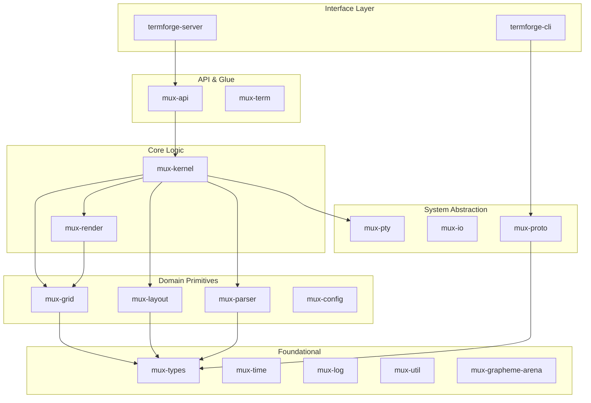

# TermForge Architecture (v0002 - FINAL)

> **Status**: Definitive Reference (Pass 2 Synthesis)
> **Date**: 2026-02-12
> **MSRV**: 1.85 (Edition 2024)

## 1. High-Level Architecture

TermForge is a client-server terminal multiplexer designed for correctness, performance, and recovery. It rejects the monolithic "terminal emulator library" approach (like `termwiz` or `crossterm` for core logic) in favor of a specialized kernel that owns the terminal state machine.

### Core Principles
1.  **Server Authority**: The server (mux-kernel) is the single source of truth. Clients are dumb rendering targets.
2.  **State/Render Separation**: Layout and data state (Grid) are decoupled from the diffing engine (mux-render).
3.  **Crash Recovery**: Panics in the kernel trigger a structured shutdown (saving state if possible) rather than hanging the TTY.
4.  **Invariants**: The system is defined by strict invariants (documented in CLAUDE.md) enforced by the type system where possible.

### Crate Layering

## 2. Key Decisions & Rationale

### 2.1 Composition & Rendering (mux-render)
We use a **Double-Buffered Composite Grid** approach.
- **CompositeGrid**: A flat rendering target representing the client's screen.
- **Diffing**: We compare the previous frame's hash/content with the current to minimize I/O.
- **Optimizations**:
    1.  **Cursor Elision**: Don't move cursor if the next char is adjacent.
    2.  **SGR Batching**: Only emit ANSI color codes when attributes change.
    3.  **REP Sequence**: Use ECMA-48 `REP` for repeating characters.
    4.  **Erase Optimization**: Use `ECH`, `EL`, `ED` where cheaper than writing spaces.
- **Flood Fairness**: Per-pane row quotas ensure a spamming pane doesn't starve others during rendering.

### 2.2 Layout Engine (mux-layout)
The layout engine uses a **Binary Space Partitioning (BSP)** tree of `LayoutCell`s, similar to `tmux` but strictly typed.
- **Algorithms**: 7 distinct algorithms (EvenHorizontal, EvenVertical, MainHorizontal, MainVertical, MainHorizontalMirrored, MainVerticalMirrored, Tiled).
- **Constraints**: Min/Max sizes are propagated up the tree.
- **Resizing**: Redistribution logic preserves relative proportions where possible.
- **Checksums**: Layout states include a checksum to detect desyncs.

### 2.3 Raw Mode & TTY Management
We **REJECT** `crossterm` for raw mode management.
- **Reason**: Crossterm assumes it owns the process and TTY. In a multiplexer, we need fine-grained control over signal masks, IOCTLs (TIOCGWINSZ), and separating the "controlling terminal" of the server from the PTYs of the panes.
- **Implementation**: `mux-pty` provides `RawModeGuard` (RAII) using `nix::sys::termios`.
- **Policy**: `TerminalModePolicy` enum (ManageRaw, AssumeExternalRaw, ProbeAndManage).

### 2.4 Signal Handling (SIGWINCH/SIGCHLD)
- **SIGWINCH**: Caught via `signal-hook`, written to a self-pipe, processed by the main loop. The kernel re-layouts the tree and triggers a render.
- **SIGCHLD**: We use the "Zombie Reaper" pattern. The server listens for SIGCHLD, calls `waitpid` with `WNOHANG` to reap children, and maps PIDs to Panes to mark them as dead/exited.
- **Invariant**: The kernel MUST NOT perform blocking `wait` calls in the main thread.

### 2.5 CRDT & State Sync
- **Strategy**: Last-Writer-Wins (LWW) with Vector Clocks.
- **Usage**: Primarily for configuration syncing and potentially detached session state in future multi-server setups. For v1, it is feature-gated.

### 2.6 SCM_RIGHTS (File Descriptor Passing)
To support `tmux`-like behavior (where a client can attach to a server started in the background), we use Unix Domain Sockets with `SCM_RIGHTS`.
- **Flow**: Client connects -> Server authenticates -> Server sends the PTY master FD (or keeps it and proxies data).
- **Architecture**: In TermForge, the *Server* retains the PTY FDs. The client is a display. Input/Output is multiplexed over the unix socket.

### 2.7 Termlets (SDK Testing)
"Termlets" are isolated, headless instances of the `mux-kernel` + `mux-render` pipeline used for integration testing. They allow us to script scenarios ("User types 'ls -la'", "Pane splits") and assert on the resulting grid state without spawning actual processes or TTYs.

## 3. Configuration (mux-config)
- **Format**: TOML.
- **Hot Reload**: The config crate watches the file (debounce). On change, it produces a `ConfigUpdate` diff. The kernel applies strictly valid updates.

## 4. Panic Recovery
- **Crash Frame**: If the main thread panics, a custom panic hook catches it, attempts to restore the user's TTY to cooked mode, prints a "Crash Frame" (stack trace + state dump), and exits cleanly. This prevents the "broken terminal" state common in raw-mode apps.

## 5. Channel Specifications
- **Control**: 512 capacity (high priority commands).
- **Data**: 1024 capacity, with 64KiB chunks (bulk PTY data).
- **Render**: 256 capacity (frame updates).
- **Effect**: 1024 capacity (side effects like "bell", "clipboard").

## 6. Security
- **Graphics Passthrough**: Disabled by default. Parsed and sanitized when enabled to prevent escape sequence injection attacks.
- **Socket Permissions**: Unix socket defaults to `0600` (user only).

## 7. Build System
- **Edition**: 2024.
- **Dependencies**: Minimal. `libc`, `nix` for OS interaction. `serde` for serialization. `smallvec` for performance.
